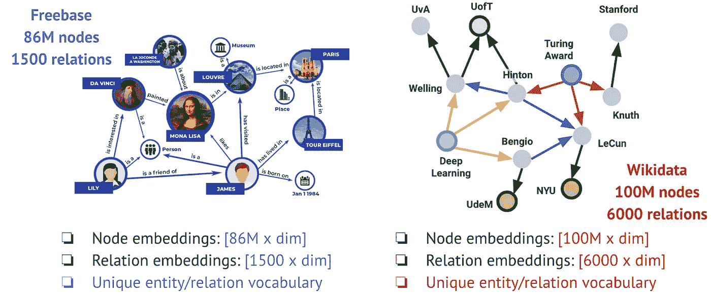
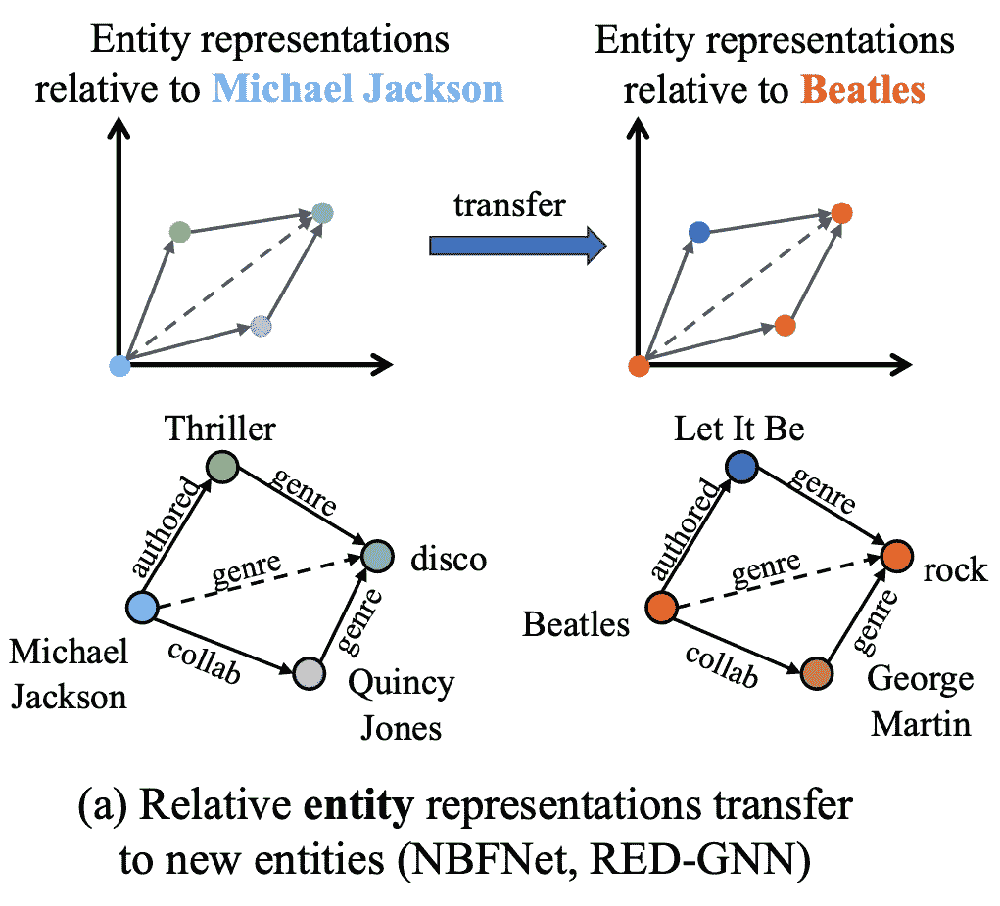
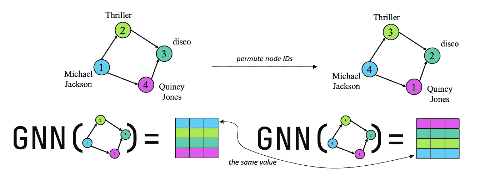
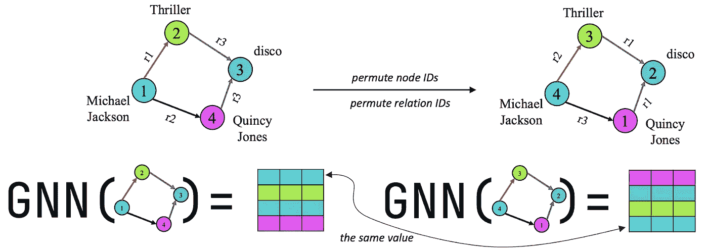
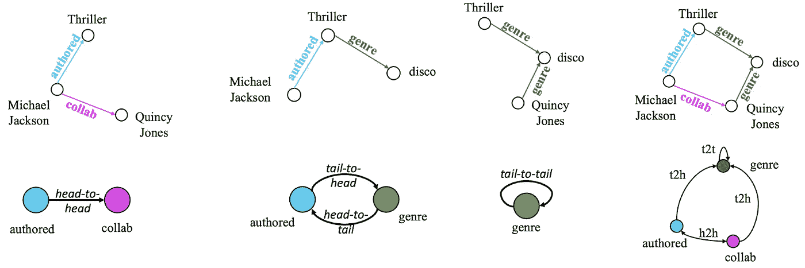
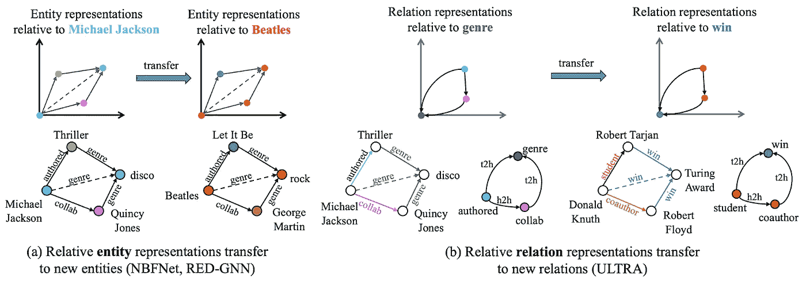
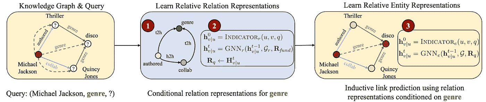
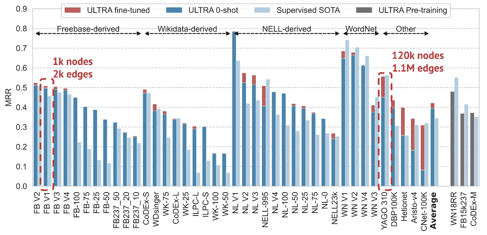
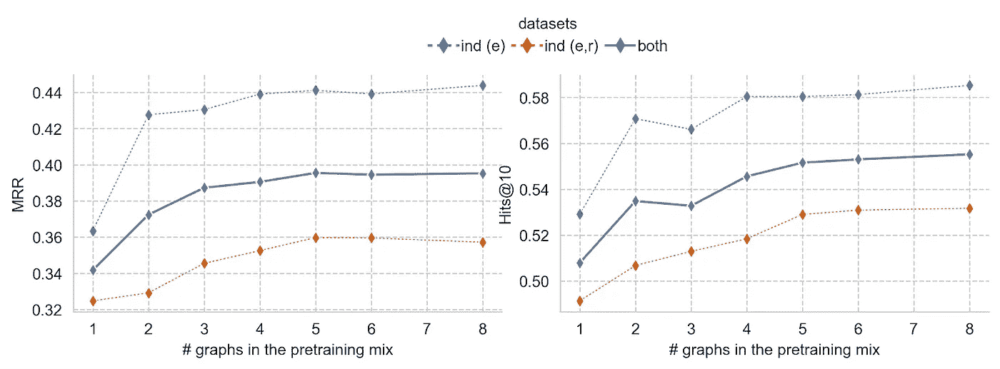

# ULTRA: 知识图谱推理的基础模型

> 原文：[`towardsdatascience.com/ultra-foundation-models-for-knowledge-graph-reasoning-9f8f4a0d7f09?source=collection_archive---------0-----------------------#2023-11-03`](https://towardsdatascience.com/ultra-foundation-models-for-knowledge-graph-reasoning-9f8f4a0d7f09?source=collection_archive---------0-----------------------#2023-11-03)

## 图形机器学习有什么新进展？

## 一个模型统治一切

 [Michael Galkin](https://mgalkin.medium.com/?source=post_page-----9f8f4a0d7f09--------------------------------)

·

[关注](https://medium.com/m/signin?actionUrl=https%3A%2F%2Fmedium.com%2F_%2Fsubscribe%2Fuser%2F4d4f8ddd1e68&operation=register&redirect=https%3A%2F%2Ftowardsdatascience.com%2Fultra-foundation-models-for-knowledge-graph-reasoning-9f8f4a0d7f09&user=Michael+Galkin&userId=4d4f8ddd1e68&source=post_page-4d4f8ddd1e68----9f8f4a0d7f09---------------------post_header-----------) 发表在 [Towards Data Science](https://towardsdatascience.com/?source=post_page-----9f8f4a0d7f09--------------------------------) ·10 分钟阅读·2023 年 11 月 3 日

--

训练一个通用模型以解决任意数据集始终是机器学习研究者的梦想，特别是在基础模型时代。虽然这种梦想在图像或自然语言等感知领域已得以实现，但是否能够在推理领域（如图形）中重现仍然是一个未解的挑战。

图片由作者编辑，源自 DALL-E 3 的输出。

在这篇博客文章中，我们证明了这样一个通用推理模型的存在，至少对于知识图谱（KGs）是如此。我们创建了**ULTRA**，这是一个单一的预训练推理模型，能够泛化到任意实体和关系词汇的新 KG，这为任何 KG 推理问题提供了默认解决方案。

*这篇文章基于我们最近的论文（[*preprint*](https://arxiv.org/abs/2310.04562)），由* [*Xinyu Yuan*](https://github.com/KatarinaYuan) *(Mila)，* [*Zhaocheng Zhu*](https://kiddozhu.github.io/) *(Mila) 和* [*Bruno Ribeiro*](https://www.cs.purdue.edu/homes/ribeirob/) *(Purdue / Stanford) 共同撰写。关注* [*Michael*](https://twitter.com/michael_galkin)*、* [*Xinyu*](https://twitter.com/XinyuYuan402)*、* [*Zhaocheng*](https://twitter.com/zhu_zhaocheng)* 和* [*Bruno*](https://twitter.com/brunofmr) *在 Twitter 上获取更多 Graph ML 内容。*

# 大纲

1.  Why KG representation learning is stuck in 2018

1.  Theory: What makes a model inductive and transferable?

1.  Theory: Equivariance in multi-relational graphs

1.  ULTRA: A Foundation Model for KG Reasoning

1.  Experiments: Best even in the zero-shot inference, Scaling behavior

1.  Code, Data, Checkpoints

# 为什么 KG 表示学习停留在 2018 年

预训练-微调范式自 2018 年起就存在，当时[ELMo](https://arxiv.org/abs/1802.05365)和[ULMFit](https://arxiv.org/abs/1801.06146)展示了首次有希望的结果，随后这些成果在[BERT](https://arxiv.org/abs/1810.04805)和[GPT](https://s3-us-west-2.amazonaws.com/openai-assets/research-covers/language-unsupervised/language_understanding_paper.pdf)的助力下得到了巩固。

在*大型语言模型*（LLM）和更通用的*基础模型*（FMs）时代，我们常常拥有一个（如 GPT-4 或 Llama-2）在大量数据上预训练的单一模型，能够以零样本方式执行各种语言任务（或者至少在特定数据集上进行微调）。如今，多模态 FMs 甚至支持在同一个模型中进行语言、视觉、音频和其他模态的处理。

图形机器学习（Graph ML）中的情况稍有不同。特别是，**2023 年底 KG 上的表示学习怎么样了？** 这里的主要任务是边级：

+   实体预测（或知识图谱补全）`(h,r,?)`：给定一个头节点和关系，对图中所有可能成为真实尾节点的节点进行排名。

+   关系预测`(h,?,t)`：给定两个节点，预测它们之间的关系类型。

事实证明，到目前为止，它一直停留在 2018 年前的阶段。关键问题是：

> 每个 KG 都有自己的一组实体和关系，没有单一的预训练模型可以适用于任何图。

例如，如果我们查看 Freebase（Google 知识图谱背后的知识图谱）和 Wikidata（最大的开源知识图谱），它们具有完全不同的实体集合（86M 对 100M）和关系（1500 对 6000）。当前的知识图谱表示学习方法是否有希望在一个图上训练并转移到另一个图上？

Freebase 和 Wikidata 的词汇表不同。图片由作者提供。

❌ 像 TransE、ComplEx、RotatE 等传统转导方法，以及其他数百种基于嵌入的方法，从训练图中学习**固定的实体和关系类型**，甚至无法支持同一图中添加的新节点。浅层嵌入方法无法转移（事实上，我们认为除了某些学生项目练习外，再也没有必要开发这样的技术）。

🟡 像[NodePiece](https://openreview.net/forum?id=xMJWUKJnFSw)和[Neural Bellman-Ford Nets](https://arxiv.org/pdf/2106.06935.pdf)这样的归纳实体方法不会学习实体嵌入。相反，它们将训练（已见）和新的推理（未见）节点参数化为固定关系的函数。由于它们**只学习关系嵌入**，这使得它们能够转移到具有新节点的图中，但转移到具有不同关系的新图（例如从 Freebase 到 Wikidata）仍然超出范围。

相对实体表示使得归纳 GNN 成为可能。图片由作者提供。

如果在推理时**同时**出现新的实体和关系（一个全新的图）该怎么办？如果你不学习实体或关系嵌入，理论上转移是否可能？那我们就来探讨一下理论吧。

# 理论：是什么使得模型具有归纳性和可转移性？

让我们更正式地定义这个设置：

+   知识图谱是有向的、多关系的图，具有任意的节点和关系类型集合

+   图形到达时**没有特征**，即，我们不假设存在实体和关系的文本描述（也不假设有预计算的特征向量）。

+   给定一个查询（头，关系，？），我们希望对底层图（推理图）中的所有节点进行排名，并最大化返回真实尾部的概率。

+   *转导*设置：训练和推理时节点和实体的集合是相同的。

+   *归纳*（实体）设置：关系的集合必须在训练时固定，但节点在训练和推理时可以不同

+   *归纳*（实体和关系）设置：在推理时允许出现新的未见过的实体和关系

神经网络学习什么以能够对新数据进行泛化？主要参考书籍—[Geometric Deep Learning by Bronstein, Bruna, Cohen, and Veličković](https://geometricdeeplearning.com/)—认为这是一个*对称性和不变性*的问题。

基础模型中可学习的不变性是什么？LLM 在固定的词汇表上进行训练（子词单元、字节，或如 [Lexinvariant LLMs](https://arxiv.org/abs/2305.16349) 中所示的随机初始化向量），视觉模型学习投影图像块的函数，音频模型学习投影音频块。

> 多关系图中的可学习不变性是什么？

首先，我们将介绍标准 **齐次** 图中的不变性（等变性）。

*标准（单一）置换等变图模型：* 当早期的 GNN 研究（[Scarselli et al. 2008](https://ro.uow.edu.au/cgi/viewcontent.cgi?article=10501&context=infopapers)，[Xu et al. 2018](https://arxiv.org/abs/1810.00826)，[Morris et al. 2018](https://ojs.aaai.org/index.php/AAAI/article/view/4384)）展示出假设顶点 ID 是任意的，图模型的预测不应因重新分配顶点 ID 而改变时，图 ML 取得了重大进展。这被称为神经网络在节点 ID 上的 *置换等变性*。这一认识激发了极大的兴奋，并产生了大量新颖的图表示方法，只要神经网络对节点 ID 置换是等变的，我们就可以称其为图模型。

*单关系图。GNN 对节点置换是等变的：即使在重新标记节点 ID 后，Michael Jackson 的节点向量也会保持相同的值。图像来自作者。*

节点 ID 上的置换等变性允许 GNN 以归纳（零-shot）方式将从训练图中学到的模式转移到另一个（不同的）测试图中。这是等变性的结果，因为神经网络不能使用节点 ID 生成嵌入，它必须使用图结构。这就产生了我们所知的 *结构表示*（见 [Srinivasan & Ribeiro (ICLR 2020)](https://iclr.cc/virtual_2020/poster_SJxzFySKwH.html)）。

# 多关系图中的等变性

现在图中的边可能有不同的关系类型——是否有针对这种图的 GNN 理论？

1️⃣ 在我们之前的工作中，[Weisfeiler and Leman Go Relational](https://arxiv.org/abs/2211.17113)（与 Pablo Barceló、Christopher Morris 和 Miguel Romero Orth 合作，LoG 2022），我们推导出了 Relational WL —— 一个更侧重于节点级任务的多关系图的 WL 表达层级。黄等人（NeurIPS 2023）[的伟大后续工作](https://arxiv.org/abs/2302.02209) 将理论扩展到链接预测，形式化了 *条件消息传递* 和使用 Relational WL 的逻辑表达能力。✍️ 让我们记住 **条件消息传递** —— 我们稍后会需要它 —— 它被证明能改善链接预测性能。

提议的全局读取向量的添加，由入边/出边方向诱导，与[Emanuele Rossi 等人](https://arxiv.org/abs/2305.10498)在均质 MPNNs 中研究方向性的[近期工作](https://arxiv.org/abs/2305.10498)相似（详细信息请阅读 Medium 上的博客文章）。然而，这些工作没有设想测试时甚至看不到关系的情况。

*2️⃣ 双重排列等变（多关系）图模型：* 最近，[Gao 等人 2023](https://arxiv.org/abs/2302.01313)提出了多关系图的**双重等变性**概念。双重等变性要求神经网络对节点 ID 和关系 ID 的联合排列保持等变。这确保了神经网络学习节点和关系之间的结构模式，从而使其能够归纳性地（零样本）将学习到的模式迁移到具有新节点和新关系的另一个图上。

*多关系图中的双重等变性。对节点 ID 和关系 ID 的双重排列不会改变关系结构。因此，输出节点状态应保持相同（但排列不同）。图像由作者提供。*

➡️ 在我们的工作中，我们发现了*关系交互的不变性*，即使关系的身份不同，它们的基本交互仍然保持不变，这些基本交互可以通过**关系图**来捕捉。在关系图中，每个节点都是来自原始图的关系类型。如果这个图中的两个节点通过原始图中具有这些关系类型的边连接（即，它们共享一个头部或尾部节点），那么这两个节点就会连接在一起。根据这种连接情况，我们在关系图中区分出**4 种边类型**：

+   *头到头（h2h）* — 两个关系可以从相同的头部实体开始；

+   *尾到头（t2h）* — 一个关系的尾部实体可以是另一个关系的头部实体；

+   *头到尾（h2t）* — 一个关系的头部实体可以是另一个关系的尾部实体；

+   *尾到尾（t2t）* — 两个关系可以有相同的尾部实体。

*原始图中的不同连接模式会在关系图中产生不同的交互。最右侧：示例关系图（为清晰起见省略了反向边）。图像由作者提供。*

关系图的一些优点：

+   它可以通过绝对任何多关系图（通过简单的稀疏矩阵乘法）构建。

+   这 4 种基本交互从不改变，因为它们只是编码了基本的拓扑——在有向图中，头部和尾部节点总是存在，而我们关系中会有这些连接模式。

> 本质上，在关系图上学习表示可以迁移到任何多关系图！这就是*可学习的不变性*。

实际上，可以证明（我们已经在进行正式证明，这些将在即将发布的工作中提供😉），通过关系图中的交互来表示关系是一个双等变模型！这意味着学习到的关系表示是独立于身份的，而是依赖于关系、节点及节点与关系之间的联合交互。

# ULTRA: 一个用于 KG 推理的基础模型

在所有理论基础的支持下，我们现在准备介绍 ULTRA。

ULTRA 是一种统一的、可学习的、可迁移的图表示方法。ULTRA 利用**关系图**的基本交互的不变性（和等变性），并应用**条件消息传递**来获得相对关系表示。也许最酷的事实是

> 一个经过预训练的 ULTRA 模型可以在任何可能的多关系图上进行 0-shot 推理，并在任何图上进行微调。

换句话说，ULTRA 实际上是一个基础模型，可以在任何图输入上进行推理（表现已相当出色），并且可以在任何目标图上进行微调。

ULTRA 的关键组成部分是从关系图中构建的*相对*关系表示。给定一个查询 `(Michael Jackson, genre, ?)`，我们首先用全 1 向量初始化关系图中的`genre`节点（所有其他节点初始化为 0）。运行 GNN 后，关系图的节点嵌入以`genre`节点为条件——这意味着每个起始初始化关系将拥有自己的一组关系特征矩阵，这在许多理论和实际方面都非常有用！

*ULTRA 采用相对关系表示（在关系图上的标记技巧），使得每个关系（例如，“类型”）都有其唯一的关系表示矩阵。图片来源：作者。*

实际上，给定一个输入 KG 和一个(h, r, ?)查询，ULTRA 执行以下操作：

1.  构建关系图；

1.  从条件消息传递 GNN 中获取关系特征（以初始化查询关系 r 为条件）；

1.  使用获得的关系表示来进行条件化的链接预测 GNN，条件为初始化的头节点 h；

步骤 2 和 3 通过对[神经贝尔曼-福特网络 (NBFNet)](https://arxiv.org/pdf/2106.06935.pdf)进行略微不同的修改来实现。ULTRA 仅学习 4 种基本交互（h2t, t2t, t2h, h2h）和 GNN 权重——总体上非常小。我们实验的主要模型仅有 177k 参数。

*ULTRA 采取的三个主要步骤：(1) 构建关系图；(2) 在关系图上进行条件消息传递以获取相对关系表示；(3) 使用这些表示进行实体级别的归纳链接预测 GNN。图片来源：作者。*

# 实验：在零样本推理和微调中表现最佳

我们在基于 Freebase、Wikidata 和 Wordnet 的 3 个标准知识图谱上预训练了 ULTRA，并在 50 多个其他知识图谱上进行了零样本链接预测，这些知识图谱的规模从 1k 到 120k 节点和 2k 边到 1.1M 边不等。

在已知 SOTA 的数据集上平均，单个预训练的 ULTRA 模型在**零样本推理模式下表现优于**针对每个图专门训练的现有 SOTA 模型 🚀 微调甚至能使性能提升 10%。特别令人惊讶的是，单个训练的 ULTRA 模型能够适应如此不同规模的图（节点大小差异为 100 倍，边大小差异为 500 倍），而 GNN 通常会遇到规模泛化问题（参见 [Yehudai et al, ICML 2021](https://arxiv.org/abs/2010.08853) 和 [Zhou et al, NeurIPS 2022](https://arxiv.org/abs/2205.15117) 的突出工作）。

单个预训练的 ULTRA 在零样本推理模式下的表现优于在特定图上端到端训练的监督 SOTA 模型（参见平均列）。微调进一步提升了性能。图片来源：作者

🙃 实际上，经过 57 个测试图，我们有点用尽了测试 ULTRA 的知识图谱。如果你有新的基准藏在某处——告诉我们！

# 扩展行为

我们可以通过将更多图谱添加到预训练混合中进一步提升零样本性能，尽管我们确实观察到在训练 4 个以上图谱后性能出现一定的饱和。

[Scaling Laws](https://arxiv.org/abs/2001.08361) 预言了使用更大的模型在更多优质数据上训练会有更好的表现，因此这绝对在我们的计划之中。

零样本性能随着预训练混合图谱的多样性而增加。图片来源：作者。

# 结论：代码、数据、检查点

所以，知识图谱推理的基础模型终于来了，我们已经过了 2018 年的门槛！单个预训练的 ULTRA 模型可以对任何领域的知识图谱（多关系图）进行链接预测。你只需一个具有超过 1 种边类型的图谱即可开始。

📈 实际上，ULTRA 在多种知识图谱基准测试中的零样本模式下已经展示了非常有前景的性能，但你可以通过短时间的微调进一步提升性能。

我们在 GitHub 上提供了所有代码、训练数据和预训练模型检查点，以便你可以立即在你的数据上运行 ULTRA！

📜 预印本：[arxiv](https://arxiv.org/abs/2310.04562)

🛠️ 代码、数据：[Githtub repo](https://github.com/DeepGraphLearning/ULTRA)

🍪 检查点：在 [Github repo](https://github.com/DeepGraphLearning/ULTRA) 中有 2 个检查点（每个 2 MB）

🌎 项目网站：[这里](https://deepgraphlearning.github.io/project/ultra)

作为总结，KG 推理只是推理领域中许多有趣问题的一部分，大多数问题仍然没有通用的解决方案。我们相信，KG 推理的成功将为其他推理领域带来更多突破（例如，我们最近发现了[LLMs 实际上可以学习和运用文本规则](https://arxiv.org/abs/2310.07064)）。让我们对推理的未来保持乐观！
