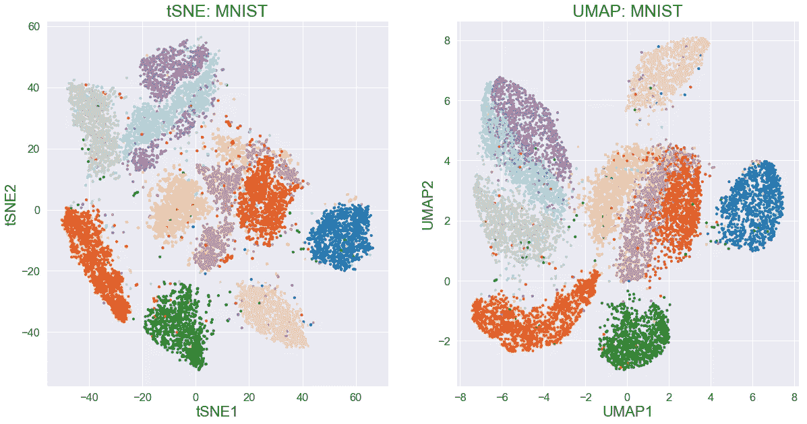

# UMAP 变异解释

> 原文：[`towardsdatascience.com/umap-variance-explained-b0eacb5b0801`](https://towardsdatascience.com/umap-variance-explained-b0eacb5b0801)

## [数学统计与生命科学机器学习](https://towardsdatascience.com/tagged/stats-ml-life-sciences)

## 解释 UMAP 成分的简单方法

[](https://nikolay-oskolkov.medium.com/?source=post_page-----b0eacb5b0801--------------------------------)[](https://towardsdatascience.com/?source=post_page-----b0eacb5b0801--------------------------------) [Nikolay Oskolkov](https://nikolay-oskolkov.medium.com/?source=post_page-----b0eacb5b0801--------------------------------)

·发表于[Towards Data Science](https://towardsdatascience.com/?source=post_page-----b0eacb5b0801--------------------------------) ·阅读时间 19 分钟·2023 年 3 月 27 日

--


在[MNIST 手写数字黑白图像](https://en.wikipedia.org/wiki/MNIST_database)上计算的 UMAP。作者提供的图像

这是我专栏[**数学统计与生命科学机器学习**](https://towardsdatascience.com/tagged/stats-ml-life-sciences)的第**二十五**篇文章，我用简单的语言讨论计算生物学和生命科学中的分析方法。[**UMAP**](https://arxiv.org/abs/1802.03426)是一种[**降维**](https://en.wikipedia.org/wiki/Dimensionality_reduction)技术，与[**tSNE**](https://en.wikipedia.org/wiki/T-distributed_stochastic_neighbor_embedding)一起变得越来越流行，并且*实际上*成为了分析[**单细胞基因组学**](https://en.wikipedia.org/wiki/Single-cell_sequencing)数据的标准工具，而传统方法如[**PCA**](https://en.wikipedia.org/wiki/Principal_component_analysis) **存在局限性**。然而，与 PCA 相比，UMAP 和 tSNE 的一个缺点是它们的**不可解释**成分，难以直接与原始数据的变异性联系起来。在这篇文章中，我建议了一种简单的方法来**估计由主要 UMAP 和 tSNE 成分解释的变异量**。以经典的[MNIST](https://en.wikipedia.org/wiki/MNIST_database)手写数字黑白图像数据集为基准，我展示了**主要 UMAP 和 tSNE 成分在解释数据的总体变异性方面劣于 PCA 成分**，然而，令人惊讶的是，它们在数据点标签的关联性方面表现更好，即它们解释了**数据中更多的生物学而非总变异性**。

# 为分析准备 MNIST 数据

作为基准数据集，我们将使用[**MNIST**](https://en.wikipedia.org/wiki/MNIST_database)，该数据集包含 70,000 张手写数字的黑白图像，**28 x 28 像素**的**分辨率**，即每张图像**784 像素**。首先，我们将下载 MNIST 数据集，检查其维度并可视化一些随机图像。

```py
from sklearn.datasets import fetch_openml

mnist = fetch_openml('mnist_784', version = 1)
labels = mnist.target.astype(int)
print(mnist.data.shape)
#(70000, 784)

from matplotlib import pyplot as plt

plt.figure(figsize = (20, 15))

for i in range(25):
    plt.subplot(5, 5, i + 1)
    plt.imshow(mnist.data[i].reshape(28, 28), cmap = plt.get_cmap('gray'))

plt.show()
```


一些随机的 MNIST 手写数字图像。图片由作者提供

MNIST 数据集的值表示**像素强度**，范围从 0 到 255，其中 0 对应黑色背景。因此，MNIST 是一个**“零膨胀”**数据集，这与**典型的单细胞**基因表达数据集非常**相似**。通常建议通过最大值 255 来归一化黑白像素强度。然而，在这里，类比单细胞基因表达，我们将使用**对数变换**作为另一种温和的归一化策略。同时，为了节省时间，我们不会使用所有 70,000 张图像，而是**随机挑选 10,000 张图像**，稍后我们会多次抽取这 10,000 张图像，以确保我们的结论是可靠的。

```py
import numpy as np

N_points = 10000

X = np.log10(mnist.data + 1)
#X = mnist.data / 255

np.random.seed(123)
random_indices = np.random.choice(X.shape[0], size=N_points, replace=False)
X = X[random_indices,:]
labels = labels[random_indices]
```

作为第一步探索，为了**理解 MNIST 中的变异**，我们将对 MNIST 及其**打乱**版本进行 PCA 分析。这将帮助我们估计初始 784 个维度中有多少个有意义的，即非冗余的维度，即我们将确定要保留的**信息性**维度数量，以供将来所有测试的降维和聚类技术使用。更多详情请见这里。

```py
import pandas as pd; import matplotlib.pyplot as plt
from sklearn.decomposition import PCA; import seaborn as sns

N_pca_comps = 100

sns.set(font_scale = 1.5); figure = plt.figure(figsize = (20, 15))

plt.subplot(221)
X_reduced = PCA(n_components = 2).fit_transform(X)
plt.scatter(X_reduced[:,0], X_reduced[:,1], c=labels, cmap='tab10', s=10)
plt.title('PCA: MNIST', fontsize = 25)
plt.xlabel('PC1', fontsize = 22); plt.ylabel('PC2', fontsize = 22)

plt.subplot(222)
pca = PCA(n_components = N_pca_comps).fit(X)
print('Observed variance explained:')
print(pca.explained_variance_ratio_[0:10]); print('\n')
plt.bar(range(len(pca.explained_variance_ratio_)), 
        pca.explained_variance_ratio_)
plt.xlabel('Number of Principal Components', fontsize = 22)
plt.ylabel('Explained Variance', fontsize = 22)

N_perm = 10
X_flat = X.flatten()
expl_var_perm_df = pd.DataFrame(index = list(range(N_perm)), 
                                columns = list(range(X.shape[1])))
for i in range(N_perm):
    np.random.shuffle(X_flat)
    X_perm = X_flat.reshape(X.shape[0], X.shape[1])
    pca_perm = PCA().fit(X_perm)
    expl_var_perm_df.loc[i] = pca_perm.explained_variance_ratio_
    print('Finished {} permutations'.format(i + 1))
    X_perm = list(expl_var_perm_df.mean(axis = 0) + 
                  2*expl_var_perm_df.std(axis = 0)) 

print('\nPermuted variance explained:')
print(X_perm[0:10])

plt.subplot(223)
plt.plot(pca.explained_variance_ratio_, c = 'blue')
plt.plot(X_perm, c = 'red'); plt.xlim([-1, N_pca_comps])
plt.xlabel('Number of Principal Components', fontsize = 22)
plt.ylabel('Explained Variance', fontsize = 22)
plt.gca().legend(('Observed variance explained', 
                  'Permuted variance explained'), fontsize = 20)

plt.subplot(224)
pval = list()
for j in range(N_pca_comps):
    pval.append(np.sum(expl_var_perm_df.iloc[:, j] + 
                       2*expl_var_perm_df.std(axis = 0) >= 
                       pca.explained_variance_ratio_[j]) / N_perm)
plt.plot(pval, c = 'darkgreen')
plt.xlabel('Number of Principal Components', fontsize = 22)
plt.ylabel('P-value', fontsize = 22); plt.xlim([-1, N_pca_comps])
N_opt_pcs = np.where(np.array(pval) >= 0.05)[0][0]
print('\nNumber of significant Principal Components: {}'.format(N_opt_pcs))
print('Together they explain {}% of variation in the data'.\
format(int(round(sum(pca.explained_variance_ratio_[0:\
np.where(np.array(pval) >= 0.05)[0][0]])*100,0))))

figure.tight_layout()
plt.show()
```


PCA 2D 地图、碎石图和诊断图，说明 MNIST 手写数字数据集中信息性主要成分的数量。图片由作者提供

对 MNIST 和打乱后的 MNIST 进行 PCA 分析的重要结果是，数据集似乎有**62 个信息性**主要成分，这些成分总共**捕捉了 86%的数据变异**。因此，如果我们用 62 个 PC 替代原始包含 784 个特征的数据集，我们将保留数据中的大部分变异，但**数据的维度将减少超过 10 倍**。

现在，让我们使用 UMAP 和 tSNE 降维技术将 MNIST 数据集可视化为 2D 地图。在这两种情况下，我们将使用 2 个主要成分，即 2 个 PC 进行初始化。tSNE 的困惑度超参数和 UMAP 的最近邻数量将计算为数据点（图像）数量的平方根。详情请见这里。

```py
import umap; import numpy as np
import seaborn as sns; import matplotlib.pyplot as plt
from sklearn.manifold import TSNE; from sklearn.decomposition import PCA

opt_perp = np.int(np.round(np.sqrt(X.shape[0]), 0))
X_reduced = PCA(n_components = N_opt_pcs).fit_transform(X)

umap_embedding = umap.UMAP(n_components = 2, n_neighbors = opt_perp, 
                           init = X_reduced[:, 0:2], 
                           min_dist=0.3, n_epochs = 1000, random_state = 123, 
                           verbose = 0).fit_transform(X_reduced)

tsne_embedding = TSNE(n_components=2, perplexity=opt_perp, 
                      init=X_reduced[:, 0:2], 
                      learning_rate = 200, n_iter = 1000, random_state = 123, 
                      verbose = 0).fit_transform(X_reduced)

sns.set(font_scale = 1.5); plt.figure(figsize = (20, 10))

plt.subplot(121)
plt.scatter(tsne_embedding[:, 0], tsne_embedding[:, 1], c = labels, s = 10, 
            cmap = 'tab20')
plt.title('tSNE: MNIST', fontsize = 25)
plt.xlabel("tSNE1", fontsize = 22); plt.ylabel("tSNE2", fontsize = 22)

plt.subplot(122)
plt.scatter(umap_embedding[:, 0], umap_embedding[:, 1], c = labels, s = 10, 
            cmap = 'tab20')
plt.title('UMAP: MNIST', fontsize = 25)
plt.xlabel("UMAP1", fontsize = 22); plt.ylabel("UMAP2", fontsize = 22)

plt.show()
```



tSNE 和 UMAP 的 MNIST 手写数字数据二维地图。图片由作者提供

从 2D PCA、tSNE 和 UMAP 图像的比较中可以得出一个明显的结论，即**手写数字的类别**在非线性**邻域图**降维方法（如 tSNE / UMAP）中比在**线性** **矩阵分解**技术（如 PCA）中得到的分辨率要高得多。因此，如果我们假设手写数字的类别（即生物表型，例如 scRNAseq 实验中的细胞类型）占据了 MNIST 数据中**大部分的变异**，那么可以合理地假设**两个 tSNE/UMAP 组件能够捕捉到比两个 PCA 组件更多的生物变异（至少在 MNIST 数据集中）**。在接下来的章节中，我们将尝试**量化和证明这一假设**。

# PCA 组件解释的 MNIST 变异

作为非线性邻域图技术，**UMAP / tSNE 似乎没有其组件所解释的变异概念**，**与矩阵分解线性降维技术（如 PCA）形成对比**，例如，请参见 UMAP 作者 Leland McInnes 的[回答](https://github.com/lmcinnes/umap/issues/122)。不过，在这里，我们将尝试量化 UMAP / tSNE 组件解释的 MNIST 像素强度变异量，并与 PCA 组件解释的变异量进行比较，使用[**部分最小二乘（PLS）回归**](https://en.wikipedia.org/wiki/Partial_least_squares_regression)和[**R 方统计量**](https://en.wikipedia.org/wiki/Coefficient_of_determination)来推广矩阵运算。

让我们检查 MNIST 中由第一个主成分（PC1）解释的变异百分比，我们可以很容易地通过 PCA 计算并提取它作为 MNIST 的标准化**第一个特征值**。如下所示，**PC1 解释了约 11%的 MNIST 变异**。

```py
#First, we will compute variance explained by PC1 via PCA in sklearn
import numpy as np
from sklearn.decomposition import PCA

pca = PCA(n_components = X.shape[1]).fit(X)
pca_comps = PCA().fit_transform(X)
print(pca.explained_variance_ratio_[0])
#0.11043073983593521
```

现在，**我们将** **通过** **部分最小二乘（PLS）** **回归重新生成这个数字**。我们将使用以下推理。假设我们想要**用另一个矩阵 PCA_matrix 来近似矩阵 X**，目前只包括一个列，即 PC1，但通常可以包括最多 784 列的 MNIST 数据集。然后，我们可以拟合一个 PLS 线性回归模型**X = B * PCA_matrix**并计算一个[**R 方统计量**](https://en.wikipedia.org/wiki/Coefficient_of_determination)，这将反映**X**中由**PCA_matrix**解释的变异量。在矩阵形式中，[R 方统计量](https://en.wikipedia.org/wiki/Coefficient_of_determination)将由以下方程给出：


其中**B*PCA_matrix**表示从其近似**PCA_matrix**对**X**的预测，并将通过 PLS 回归（第一方程）得出。为了在**scikit-learn Python 模块**中技术性地实现这一过程，我们首先拟合一个以**X**为响应变量、**PCA_matrix**为解释变量的 PLS 模型，我们计算预测值**y_pred = B*PCA_matrix**，最后，我们可以使用 scikit-learn 中的**r2_score**函数，或使用上述第二方程来计算[R-squared 统计量](https://en.wikipedia.org/wiki/Coefficient_of_determination)。让我们检查一下两者是否会给出相同的答案：

```py
#Now let us compute variance explained by PC1 through PLS procedure
from sklearn.metrics import r2_score
from sklearn.cross_decomposition import PLSRegression

PCA_matrix = pd.DataFrame(pca_comps[:, 0:1])
pls = PLSRegression(n_components = 1)
pls.fit(PCA_matrix, X)
y_pred = pls.predict(PCA_matrix)
print(r2_score(X, y_pred, multioutput = 'variance_weighted'))
#0.11043073983593246

#Finally, let us compute variance explained by PC1 from scratch
print(1 - np.sum((np.array(X) - np.array(y_pred))**2) / np.sum((X - \
np.mean(X, axis = 0))**2))
#0.11043073983593554
```

因此，通过利用 PLS 回归，我们计算了**第一主成分解释的 MNIST 总变异** **在 PCA 算法之外**的比例。将 PLS 计算的比例与 PCA 算法中 pca.explained_variance_ratio_[0]（即第一特征值与所有特征值之和的比率）解释的方差进行比较。它们几乎是相同的。现在让**PCA_matrix**包含若干个主成分。下面，我们演示 PLS 计算主成分解释的累计方差将**与 PCA 累计解释的方差几乎相同**。

```py
from sklearn.metrics import r2_score
from sklearn.cross_decomposition import PLSRegression

predicted_var_expl = []
for i in range(1, 21):

    PCA_matrix_current = pd.DataFrame(pca_comps[:, 0:i])
    pls_current = PLSRegression(n_components = i)
    pls_current.fit(PCA_matrix_current, X)
    y_pred_current = pls_current.predict(PCA_matrix_current)
    predicted_var_expl.append(r2_score(X, y_pred_current, 
                              multioutput = 'variance_weighted'))

import seaborn as sns
import matplotlib.pyplot as plt

sns.set(font_scale = 1.5); plt.figure(figsize = (20, 15))
plt.plot(np.cumsum(pca.explained_variance_ratio_[0:100]),linewidth=5)
plt.plot(predicted_var_expl, linewidth = 5)

plt.ylabel('Cumulative Explained Variance', fontsize = 20)
plt.xlabel('Number of Principal Components', fontsize = 20)
plt.legend(['PCA - computed cumulative variance explained', 
            'PLS - computed cumulative variance explained'], 
            fontsize = 20); plt.show()
```


使用 PCA 算法和基于 PLS 的方法对 MNIST 图像像素强度数据解释的累计方差进行比较。图片由作者提供

为了清晰起见，我们将 PLS 计算的 MNIST 方差（PC1-PC20）绘制在原生 PCA 特征值基础上解释的方差（PC1-PC100）之上。我们可以看到，**PLS 和 PCA 计算的累计方差曲线很好地重合**。这并不令人惊讶，因为 PLS 计算本质上模拟了 PCA 算法的内部过程。然而，非常重要的是，这为我们提供了计算**X**通过**任何近似**（不仅是**PCA_matrix**，还包括其他任何矩阵）解释的方差的**工具**。在下一节中，我们将使用**UMAP_matrix**作为 MNIST 像素强度的原始**X**矩阵的近似，并**比较 UMAP 和 PCA 组件解释的 X 累计方差**。

# MNIST 由 UMAP 组件解释的变异

在本节中，我们将使用前一节中开发的 PLS 估计解释方差的方法。同样，我们将使用相同的推理：由于 UMAP 提供了对原始数据**X**的某种**近似**，并且人们甚至在 2D UMAP 上运行**聚类**以发现 scRNAseq 领域中的细胞类型，我们可以将**UMAP_matrix**（对于 tSNE 也是如此）作为**X**的近似，然后拟合 PLS 模型**X=B * UMAP_matrix**，并通过 R-squared 统计量估计 UMAP 组件解释的 MNIST 方差的比例。


现在，我们将使用在前一部分开发的 PLS 方法，计算第一个 UMAP 组件解释的 MNIST 方差比例。

```py
from sklearn.metrics import r2_score
from sklearn.cross_decomposition import PLSRegression

#MNIST variation explained by UMAP1
UMAP_matrix = pd.DataFrame(umap_embedding[:, 0:1])
pls = PLSRegression(n_components = 1)
pls.fit(UMAP_matrix, X)
y_pred = pls.predict(UMAP_matrix)
print(r2_score(X, y_pred, multioutput = 'variance_weighted'))
#0.07335034485651613

#Here the same but more explicitly via the R² equation above
print(1 - np.sum((np.array(X) - np.array(y_pred))**2) / np.sum((X - \
np.mean(X, axis = 0))**2))
#0.07335034485652026

#MNIST variation explained by tSNE1
tSNE_matrix = pd.DataFrame(tsne_embedding[:, 0:1])
pls = PLSRegression(n_components = 1)
pls.fit(tSNE_matrix, X)
y_pred = pls.predict(tSNE_matrix)
print(r2_score(X, y_pred, multioutput = 'variance_weighted'))
#0.07265918428990921

#Here the same but explicitly via the R² equation above
print(1 - np.sum((np.array(X) - np.array(y_pred))**2) / np.sum((X - \
np.mean(X, axis = 0))**2))
#0.07265918428991347
```

我们得出结论，**UMAP 和 tSNE 的前几个组件解释了约 7%的 MNIST 变异，这低于第一个 PCA 组件解释的 11%**。这并不令人惊讶。直观上，很难期待有另一个潜在变量替代 PC1，解释超过 11%的 MNIST 变异而不重新定义“解释方差”的概念。当前的定义来自 PCA（**标准化特征值**）和线性回归，即 R 平方分析。两者都是线性框架。**此外，** **PC1 根据定义对应于数据变异的最大方向**。因此，如果另一个潜在变量来自非线性分析如 UMAP，这并不*本身*旨在最大化数据的变异，**那么很难期待例如 UMAP1 在 MNIST 中解释更多变异** **在“解释方差”的线性定义下**。现在我们将计算几个顶级 tSNE 和 UMAP 组件解释的方差。为了使我们的分析对 10,000 张图像的采样更具稳健性，我们将独立抽取它们**N_iter**次。此外，对于每次迭代，我们将稍微**改变/** **扰动** **UMAP 和 tSNE 的超参数，以及 PCA 的数据点数量**。这将使我们能够建立**置信区间**并解决我们分析的敏感性。

```py
import umap; import numpy as np; import seaborn as sns
import matplotlib.pyplot as plt; from sklearn.manifold import TSNE
from sklearn.metrics import r2_score; from sklearn.decomposition import PCA
from sklearn.cross_decomposition import PLSRegression

N_iter = 3; N_comps = 3

N_points_list = [5000, 10000, 15000]
perp_list = [50, 100, 150]; min_dist_list = [0.1, 0.2, 0.3]

predicted_var_expl_matrix = np.zeros(shape = (N_iter, N_comps))
predicted_var_expl_umap_matrix = np.zeros(shape = (N_iter, N_comps))
predicted_var_expl_tsne_matrix = np.zeros(shape = (N_iter, N_comps))
for j in range(N_iter):

    #MNIST variance explained by PCA components
    np.random.seed(j)
    X = np.log10(mnist.data + 1); labels = mnist.target.astype(int)
    random_indices = np.random.choice(X.shape[0], size = N_points_list[j], 
                                      replace = False)
    X_sample = X[random_indices,:]; labels_sample = labels[random_indices]
    pca_comps_sample = PCA(n_components = N_comps).fit_transform(X_sample)
    predicted_var_expl = []
    for i in range(1, (N_comps + 1)):
        PCA_matrix_current = pd.DataFrame(pca_comps_sample[:, 0:i])
        pls_current = PLSRegression(n_components = i)
        pls_current.fit(PCA_matrix_current, X_sample)
        y_pred_current = pls_current.predict(PCA_matrix_current)
        predicted_var_expl.append(r2_score(X_sample, y_pred_current, 
                                           multioutput='variance_weighted'))
    predicted_var_expl_matrix[j,:] = predicted_var_expl

    #MNIST variance explained by UMAP components
    X = np.log10(mnist.data + 1); labels = mnist.target.astype(int)
    random_indices = np.random.choice(X.shape[0], size = N_points, 
                                      replace = False)
    X_sample = X[random_indices,:]; labels_sample = labels[random_indices]
    opt_perp = np.int(np.round(np.sqrt(X_sample.shape[0]), 0))
    X_reduced_sample = PCA(n_components = N_opt_pcs).fit_transform(X_sample)
    umap_embedding_sample = umap.UMAP(n_components = N_comps, 
                                      n_neighbors = opt_perp, 
                                      init = X_reduced_sample[:, 0:N_comps], 
                                      min_dist = min_dist_list[j], 
                                      n_epochs = 1000, verbose = \
                                      0).fit_transform(X_reduced_sample)
    predicted_var_expl_umap = []
    for i in range(1, (N_comps + 1)):
        UMAP_matrix_current = pd.DataFrame(umap_embedding_sample[:, 0:i])
        pls_current = PLSRegression(n_components = i)
        pls_current.fit(UMAP_matrix_current, X_sample)
        y_pred_current = pls_current.predict(UMAP_matrix_current)
        predicted_var_expl_umap.append(r2_score(X_sample, y_pred_current, \
        multioutput = 'variance_weighted'))
    predicted_var_expl_umap_matrix[j,:] = predicted_var_expl_umap    

    #MNIST variance explained by tSNE components
    X = np.log10(mnist.data + 1); labels = mnist.target.astype(int)
    random_indices = np.random.choice(X.shape[0], size = N_points, 
                                      replace = False)
    X_sample = X[random_indices,:]; labels_sample = labels[random_indices]
    X_reduced_sample = PCA(n_components = N_opt_pcs).fit_transform(X_sample)
    tsne_embedding_sample = TSNE(n_components = N_comps, 
                                 perplexity = perp_list[j], 
                                 init = X_reduced_sample[:, 0:N_comps], 
                                 learning_rate = 200, n_iter = 1000, 
                                 verbose = 0).fit_transform(X_reduced_sample)
    predicted_var_expl_tsne = []
    for i in range(1, (N_comps + 1)):
        tSNE_matrix_current = pd.DataFrame(tsne_embedding_sample[:, 0:i])
        pls_current = PLSRegression(n_components = i)
        pls_current.fit(tSNE_matrix_current, X_sample)
        y_pred_current = pls_current.predict(tSNE_matrix_current)
        predicted_var_expl_tsne.append(r2_score(X_sample, y_pred_current, \
        multioutput = 'variance_weighted'))
    predicted_var_expl_tsne_matrix[j,:] = predicted_var_expl_tsne

print("MNIST variance explained by PCA components:")
print(predicted_var_expl_matrix)
print("\nMNIST variance explained by UMAP components:")
print(predicted_var_expl_umap_matrix)
print("\nMNIST variance explained by tSNE components:")
print(predicted_var_expl_tsne_matrix)

#Plot MNIST variance explained by leading PCA, tSNE and UMAP components
sns.set(font_scale = 1.5); plt.figure(figsize = (20, 15))
plt.errorbar(range(1, (N_comps + 1)), np.mean(predicted_var_expl_matrix, 
             axis = 0), yerr = 2*np.std(predicted_var_expl_matrix, axis = 0), 
             linewidth = 3, color = 'red', marker = 'o', markersize = 10, 
             capsize = 5, capthick = 3)
plt.errorbar(range(1, (N_comps + 1)), np.mean(predicted_var_expl_tsne_matrix, 
             axis = 0), yerr = 2*np.std(predicted_var_expl_tsne_matrix, 
             axis = 0), linewidth = 3, color = 'blue', marker = 'o', 
             markersize = 10, capsize = 5, capthick = 3)
plt.errorbar(range(1, (N_comps + 1)), np.mean(predicted_var_expl_umap_matrix, 
             axis = 0), yerr = 2*np.std(predicted_var_expl_umap_matrix, 
             axis = 0), linewidth = 3, color = 'green', marker = 'o', 
             markersize = 10, capsize = 5, capthick = 3)
plt.ylabel('Cumulative MNIST Explained Variance', fontsize = 20)
plt.xlabel('Number of Components', fontsize = 20)
plt.legend(['PCA variance explained', 'tSNE variance explained', 
            'UMAP variance explained'], fontsize = 20)
plt.xlim([0.8, (N_comps + 0.2)]); plt.xticks([1, 2, 3]); plt.show()
```


MNIST 图像像素强度数据的累积方差由 PCA、tSNE 和 UMAP 组件解释。图片由作者提供

在这里，我们得出结论，主成分 PCA 在 MNIST 数据集中的解释变异量始终大于主成分 tSNE 和 UMAP。这个结果是预期的，因为 UMAP 和 tSNE 并不旨在建立最大变异方向，而 PCA 则有此目标。此外，**主成分 tSNE 和 UMAP 在 MNIST 数据中解释的变异量是相当的，并且都低于 PCA 组件解释的变异量**。因此，我们似乎观察到 MNIST 解释方差**在矩阵分解和邻接图降维技术之间**的系统性差异。

# 生物学变异由 UMAP 组件解释

在上一部分中，我们展示了 UMAP 和 tSNE 的主成分在 MNIST 数据集中解释的变异量明显少于主成分 PCA，这是一种**预期的结果**，因为 PCA 根据定义旨在寻找数据中的最大变异成分，而 UMAP 和 tSNE 则不是。

> 然而，这确实是一个有趣的悖论：通过查看 MNIST 数据的 2D UMAP 和 tSNE 图，我们可以明显看到更多的**明显**的手写数字簇，相比于对应的 2D PCA 图。**尽管 2D UMAP 和 tSNE 解释的 MNIST 方差** **比 PCA 少**。

在这里，我们将假设 UMAP / tSNE 组件与**感兴趣的表型**有关，即 MNIST **标签**，或者 scRNAseq 的细胞类型，**而不是数据的总变异**。为了检验这一假设，让我们首先探索主导 PCA、UMAP 和 tSNE 组件如何与 MNIST 标签相关。

```py
import umap; import seaborn as sns
from sklearn.datasets import fetch_openml
from sklearn.decomposition import PCA; import numpy as np
import matplotlib.pyplot as plt; from sklearn.manifold import TSNE

N_comps = 3; N_points = 10000

mnist = fetch_openml('mnist_784', version = 1)
labels = mnist.target.astype(int); X = np.log10(mnist.data + 1)

#Subsample MNIST data down to 10 000 images
np.random.seed(123)
random_indices = np.random.choice(X.shape[0], size=N_points, replace=False)
X = X[random_indices,:]; labels = labels[random_indices]

#Compute top 3 PCA components on the subsampled MNIST data
pca = PCA(n_components = N_comps).fit(X)
pca_comps = PCA().fit_transform(X)

#Compute top 3 UMAP components on the subsampled MNIST data
opt_perp = np.int(np.round(np.sqrt(X.shape[0]), 0))
X_reduced = PCA(n_components = N_opt_pcs).fit_transform(X)
umap_embedding = umap.UMAP(n_components = N_comps, n_neighbors = opt_perp, 
                           init = X_reduced[:, 0:N_comps], 
                           min_dist = 0.3, n_epochs = 1000, random_state=123, 
                           verbose = 0).fit_transform(X_reduced)

#Compute top 3 tSNE components on the subsampled MNIST data
tsne_embedding = TSNE(n_components = N_comps, perplexity = opt_perp, 
                      init = X_reduced[:, 0:N_comps], 
                      learning_rate = 200, n_iter = 1000, random_state = 123, 
                      verbose = 0).fit_transform(X_reduced)

#Pairwise correlations between MNIST labels and PCA / tSNE / UMAP components
from scipy.stats import spearmanr
rho_matrix = np.zeros(shape = (3, 3))
for i in range(N_comps):
    rho, pval = spearmanr(pca_comps[:, i], labels)
    rho_matrix[0, i] = np.abs(rho)
for i in range(N_comps):
    rho, pval = spearmanr(tsne_embedding[:, i], labels)
    rho_matrix[1, i] = np.abs(rho)
for i in range(N_comps):
    rho, pval = spearmanr(umap_embedding[:, i], labels)
    rho_matrix[2, i] = np.abs(rho)
rho_df = pd.DataFrame(rho_matrix, columns = ['Comp1', 'Comp2', 'Comp3'], 
                      index = ['PCA', 'tSNE', 'UMAP'])
sns.set(font_scale = 1.5); plt.figure(figsize = (20, 10))
sns.heatmap(rho_df.T, cmap = "Blues", annot = True)
plt.title('Spearman correlation of leading PCA / tSNE / UMAP components'+ 
           ' with MNIST labels', fontsize = 20); plt.show()
```


MNIST 标签与 PCA / tSNE / UMAP 组件之间的配对斯皮尔曼相关性。图像由作者提供

我们可以观察到，**tSNE1 和 UMAP1 与 MNIST 标签的相关性比 PC1 更强**。此外，PCA、tSNE 和 UMAP 的第二个组件与 MNIST 标签的相关性强度相当，**而第三个 UMAP 组件与 MNIST 标签的相关性远远强于 PCA 和 tSNE 的第三个组件**，即 PC3 和 tSNE3，这两个组件**与 MNIST 标签几乎没有相关性**。在我的 [github](https://github.com/NikolayOskolkov/UMAP_VarianceExplained) 上提供的完整笔记本中，我展示了**得到的热图在采样和 PCA / tSNE / UMAP 超参数扰动方面是稳健的**。

**另外**，我们还可以通过前几节开发的 **PLS 回归** 方法量化 PCA、tSNE 和 UMAP 组件与 MNIST 标签（数字类，即 scRNAseq 数据中的细胞类型）之间的联系。通过类比，如果我们将 **UMAP_matrix**（或 **PCA_matrix** 或 **tSNE_matrix**）视为 MNIST 标签向量的近似值，我们可以拟合 PLS 模型 **labels= B * UMAP_matrix**，并估算**UMAP 组件解释的 MNIST 标签变异** 的比例。


让我们测试 PC1、tSNE1 和 UMAP1 解释了多少 MNIST **标签**的方差：

```py
from sklearn.metrics import r2_score
from sklearn.cross_decomposition import PLSRegression

#Variance in MNIST labels explained by PC1
pca = PCA(n_components = X.shape[1]).fit(X)
pca_comps = PCA().fit_transform(X)
PCA_matrix = pd.DataFrame(pca_comps[:, 0:1])
pls = PLSRegression(n_components = 1)
pls.fit(PCA_matrix, labels)
y_pred = pls.predict(PCA_matrix)
r2_score(labels, y_pred, multioutput = 'variance_weighted')
#0.01570798235844606

#Variance in MNIST labels explained by tSNE1
tSNE_matrix = pd.DataFrame(tsne_embedding[:, 0:1])
pls = PLSRegression(n_components = 1)
pls.fit(tSNE_matrix, labels)
y_pred = pls.predict(tSNE_matrix)
r2_score(labels, y_pred, multioutput = 'variance_weighted')
#0.04531724676013893

#Variance in MNIST labels explained by UMAP1
UMAP_matrix = pd.DataFrame(umap_embedding[:, 0:1])
pls = PLSRegression(n_components = 1)
pls.fit(UMAP_matrix, labels)
y_pred = pls.predict(UMAP_matrix)
r2_score(labels, y_pred, multioutput = 'variance_weighted')
#0.1369512765129124
```

我们可以清楚地看到，tSNE1，特别是 UMAP1，比 PC1 解释了更多的 MNIST 标签变异，这证实了我们之前在上面的热图中通过斯皮尔曼相关性观察到的结果。我们还可以从 **statsmodels** 包中的线性回归模型中复现上述的**R-squared** 值。

```py
import statsmodels.formula.api as smf

my_df_comps = pd.DataFrame({'LABELS': labels, 
                            'PC1': np.array(PCA_matrix).flatten(), 
                            'tSNE1': np.array(tSNE_matrix).flatten(), 
                            'UMAP1': np.array(UMAP_matrix).flatten()})

smf.ols(formula = 'LABELS ~ PC1', data = my_df_comps).fit().summary()
smf.ols(formula = 'LABELS ~ tSNE1', data = my_df_comps).fit().summary()
smf.ols(formula = 'LABELS ~ UMAP1', data = my_df_comps).fit().summary()
```


现在，**一旦我们确保** **可以正确计算** 由 PC1、tSNE1 和 UMAP1 解释的 MNIST 标签方差，通过使用 PLS 和 R-squared 方法，我们可以将这一过程扩展到其他主要的 PCA / tSNE / UMAP 组件，并可视化累积方差解释如何随着更多组件的加入而变化。像往常一样，我们将对 PCA、tSNE 和 UMAP 进行子采样迭代、图像数量和方法超参数的扰动。

```py
from sklearn.decomposition import PCA
from sklearn.cross_decomposition import PLSRegression
import seaborn as sns; import matplotlib.pyplot as plt
import numpy as np; from sklearn.metrics import r2_score

N_iter = 3; N_comps = 3

N_points_list = [5000, 10000, 15000]
min_dist_list = [0.1, 0.2, 0.3]; perp_list = [90, 100, 110]
predicted_var_expl_labels_matrix = np.zeros(shape = (N_iter, N_comps))
predicted_var_expl_labels_umap_matrix=np.zeros(shape=(N_iter, N_comps))
predicted_var_expl_labels_tsne_matrix=np.zeros(shape=(N_iter, N_comps))
for j in range(N_iter):

    #Variance in MNIST labels explained by PCA components
    np.random.seed(j)
    X = np.log10(mnist.data + 1); labels = mnist.target.astype(int)
    random_indices = np.random.choice(X.shape[0], size = N_points_list[j], 
                                      replace = False)
    X_sample = X[random_indices,:]; labels_sample = labels[random_indices]
    pca_comps_sample = PCA(n_components = N_comps).fit_transform(X_sample)

    predicted_var_expl_labels = []
    for i in range(1, (N_comps + 1)):
        PCA_matrix_current_labels = pd.DataFrame(pca_comps_sample[:, 0:i])
        pls_current_labels = PLSRegression(n_components = i)
        pls_current_labels.fit(PCA_matrix_current_labels, labels_sample)
        y_pred_current_labels = pls_current_labels.predict(\
        PCA_matrix_current_labels)
        predicted_var_expl_labels.append(r2_score(labels_sample, \
        y_pred_current_labels, multioutput = 'variance_weighted'))
    predicted_var_expl_labels_matrix[j,:] = predicted_var_expl_labels

    #Variance in MNIST labels explained by UMAP components
    X = np.log10(mnist.data + 1); labels = mnist.target.astype(int)
    random_indices = np.random.choice(X.shape[0], size = N_points, 
                                      replace = False)
    X_sample = X[random_indices,:]; labels_sample = labels[random_indices]
    opt_perp = np.int(np.round(np.sqrt(X_sample.shape[0]), 0))
    X_reduced_sample = PCA(n_components=N_opt_pcs).fit_transform(X_sample)
    umap_embedding_sample = umap.UMAP(n_components = N_comps, 
                                      n_neighbors = opt_perp, 
                                      init=X_reduced_sample[:, 0:N_comps], 
                                      min_dist = min_dist_list[j], 
                                      n_epochs = 1000, verbose = \
                                      0).fit_transform(X_reduced_sample)
    predicted_var_expl_labels_umap = []
    for i in range(1, (N_comps + 1)):
        UMAP_matrix_current_labels=pd.DataFrame(umap_embedding_sample[:,0:i])
        pls_current_labels_umap = PLSRegression(n_components = i)
        pls_current_labels_umap.fit(UMAP_matrix_current_labels,labels_sample)
        y_pred_current_labels_umap = pls_current_labels_umap.predict(\
        UMAP_matrix_current_labels)
        predicted_var_expl_labels_umap.append(r2_score(\
        labels_sample, y_pred_current_labels_umap, \
        multioutput = 'variance_weighted'))
    predicted_var_expl_labels_umap_matrix[j,:]=predicted_var_expl_labels_umap

    #Variance in MNIST labels explained by tSNE components
    X = np.log10(mnist.data + 1); labels = mnist.target.astype(int)
    random_indices = np.random.choice(X.shape[0], size = N_points, 
                                      replace = False)
    X_sample = X[random_indices,:]; labels_sample = labels[random_indices]

    opt_perp = np.int(np.round(np.sqrt(X_sample.shape[0]), 0))
    X_reduced_sample = PCA(n_components = N_opt_pcs).fit_transform(X_sample)
    tsne_embedding_sample = TSNE(n_components = N_comps, 
                                 perplexity = perp_list[j], 
                                 init = X_reduced_sample[:, 0:N_comps], 
                                 learning_rate = 200, n_iter = 1000, 
                                 verbose=0).fit_transform(X_reduced_sample)
    predicted_var_expl_labels_tsne = []
    for i in range(1, (N_comps + 1)):
        tSNE_matrix_current_labels=pd.DataFrame(tsne_embedding_sample[:,0:i])
        pls_current_labels_tsne = PLSRegression(n_components = i)
        pls_current_labels_tsne.fit(tSNE_matrix_current_labels,labels_sample)
        y_pred_current_labels_tsne = pls_current_labels_tsne.predict(\
        tSNE_matrix_current_labels)
        predicted_var_expl_labels_tsne.append(r2_score(labels_sample, \
        y_pred_current_labels_tsne, multioutput = 'variance_weighted'))
    predicted_var_expl_labels_tsne_matrix[j,:]=predicted_var_expl_labels_tsne

print("Variance in MNIST labels explained by PCA components:")
print(predicted_var_expl_labels_matrix)
print("\nVariance in MNIST labels explained by UMAP components:")
print(predicted_var_expl_labels_umap_matrix)
print("\nVariance in MNIST labels explained by tSNE components:")
print(predicted_var_expl_labels_tsne_matrix)

#Plot MNIST labels variance explained by PCA, tSNE and UMAP components
sns.set(font_scale = 1.5); plt.figure(figsize = (20, 15))
plt.errorbar(range(1, (N_comps + 1)), 
             np.mean(predicted_var_expl_labels_matrix, axis = 0), 
             yerr = 2*np.std(predicted_var_expl_labels_matrix, axis = 0), 
             linewidth = 3, color = 'red', marker = 'o', markersize = 10, 
             capsize = 5, capthick = 3)
plt.errorbar(range(1, (N_comps + 1)), 
             np.mean(predicted_var_expl_labels_tsne_matrix, axis = 0), 
             yerr=2*np.std(predicted_var_expl_labels_tsne_matrix,axis=0), 
             linewidth = 3, color = 'blue', marker = 'o', markersize = 10, 
             capsize = 5, capthick = 3)
plt.errorbar(range(1, (N_comps + 1)), 
             np.mean(predicted_var_expl_labels_umap_matrix, axis = 0), 
             yerr=2*np.std(predicted_var_expl_labels_umap_matrix,axis=0), 
             linewidth = 3, color = 'green', marker = 'o', markersize = 10, 
             capsize = 5, capthick = 3)
plt.ylabel('Cumulative MNIST Labels Explained Variance', fontsize = 20)
plt.xlabel('Number of Components', fontsize = 20)
plt.legend(['PCA variance explained', 'tSNE variance explained', 
            'UMAP variance explained'], fontsize = 20)
plt.xlim([0.8, (N_comps + 0.2)]); plt.xticks([1, 2, 3]); plt.show()
```


PCA、tSNE 和 UMAP 组件解释的 MNIST 标签的累积方差。图像由作者提供

**在这里，** **令人惊讶的是，我们观察到** **领先的 UMAP 和 tSNE 组件似乎比领先的 PCA 组件解释了 MNIST 标签中更多的变化**。这在某种程度上是违反直觉的，因为我们在前一节中看到领先的 tSNE 和 UMAP 组件解释了较少的 MNIST 图像像素强度变化。然而，上面的累计解释方差图基本上确认了 MNIST 标签与 PCA / tSNE / UMAP 组件之间的相关性热图。

在这里，我们观察到一个有趣的现象。我们在前一节中看到，领先的 tSNE 和 UMAP 组件无法捕捉比领先的 PCA 组件更多的 MNIST 变化。然而，令人惊讶的是，尽管在进行降维时这些类没有提供给 tSNE / UMAP，它们却**能够捕捉 MNIST 标签，即手写数字的类别中的更多变化**。换句话说，这三种降维技术都是完全无监督的，即它们对手写数字的类别一无所知。尽管如此，**tSNE，尤其是 UMAP 组件，似乎与数字类别惊人地相关**，而无法捕捉 MNIST 图像中像素强度的实质性变化。我不完全理解这个现象，但认为这是一个有趣的观察，我很想进一步探索。**如果你对这种现象的本质有更多见解，请在评论中告诉我。**

# 摘要

在这篇文章中，我们了解到**偏最小二乘（PLS）** **方法**可以用来建立**对 tSNE 和 UMAP 组件解释的数据变化的直觉**。使用这种方法，我们展示了**tSNE 和 UMAP 组件解释（并不出奇）比 PCA 组件少的 MNIST 图像像素强度变化**，然而，令人惊讶的是，它们与**MNIST 图像的标签****有很强的关联**。考虑到这三种降维技术的无监督设计，这种效果的本质尚不清楚。

和往常一样，请在下面的评论中告诉我在生命科学和计算生物学中哪些分析方法对你来说**特别神秘**，我会尽量在这一栏中讨论它们。查看我在[github](https://github.com/NikolayOskolkov/UMAP_VarianceExplained)上的帖子所用的文件。在**Medium**上关注我，[**Nikolay Oskolkov**](https://medium.com/u/8570b484f56c?source=post_page-----b0eacb5b0801--------------------------------)，在**Twitter**上@NikolayOskolkov，在**Mastodon**上@oskolkov@mastodon.social，通过[**Linkedin**](http://linkedin.com/in/nikolay-oskolkov-abb321186)与我联系。在下一篇文章中，我将讨论**如何在 UMAP 空间中进行聚类**，敬请关注。
