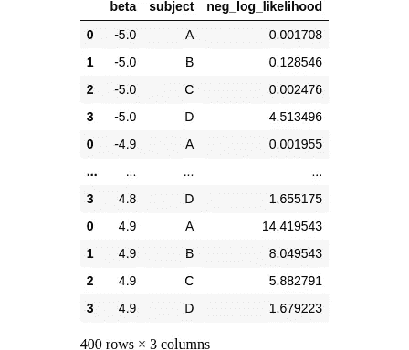

# 解锁 Cox 回归：Cox 回归的直观指南

> 原文：[`towardsdatascience.com/unbox-the-cox-intuitive-guide-to-cox-regressions-c485408ae15d?source=collection_archive---------11-----------------------#2023-06-06`](https://towardsdatascience.com/unbox-the-cox-intuitive-guide-to-cox-regressions-c485408ae15d?source=collection_archive---------11-----------------------#2023-06-06)

## 风险和最大似然估计如何预测事件排名？

[](https://medium.com/@igor-s?source=post_page-----c485408ae15d--------------------------------)[](https://towardsdatascience.com/?source=post_page-----c485408ae15d--------------------------------) [Igor Šegota](https://medium.com/@igor-s?source=post_page-----c485408ae15d--------------------------------)

·

[关注](https://medium.com/m/signin?actionUrl=https%3A%2F%2Fmedium.com%2F_%2Fsubscribe%2Fuser%2Fe5f8ebca4ad8&operation=register&redirect=https%3A%2F%2Ftowardsdatascience.com%2Funbox-the-cox-intuitive-guide-to-cox-regressions-c485408ae15d&user=Igor+%C5%A0egota&userId=e5f8ebca4ad8&source=post_page-e5f8ebca4ad8----c485408ae15d---------------------post_header-----------) 发表在[Towards Data Science](https://towardsdatascience.com/?source=post_page-----c485408ae15d--------------------------------) ·10 分钟阅读·2023 年 6 月 6 日[](https://medium.com/m/signin?actionUrl=https%3A%2F%2Fmedium.com%2F_%2Fvote%2Ftowards-data-science%2Fc485408ae15d&operation=register&redirect=https%3A%2F%2Ftowardsdatascience.com%2Funbox-the-cox-intuitive-guide-to-cox-regressions-c485408ae15d&user=Igor+%C5%A0egota&userId=e5f8ebca4ad8&source=-----c485408ae15d---------------------clap_footer-----------)

--

[](https://medium.com/m/signin?actionUrl=https%3A%2F%2Fmedium.com%2F_%2Fbookmark%2Fp%2Fc485408ae15d&operation=register&redirect=https%3A%2F%2Ftowardsdatascience.com%2Funbox-the-cox-intuitive-guide-to-cox-regressions-c485408ae15d&source=-----c485408ae15d---------------------bookmark_footer-----------)

图片由[Chris Boyer](https://unsplash.com/fr/@csgboyer?utm_source=medium&utm_medium=referral)提供，来源于[Unsplash](https://unsplash.com/?utm_source=medium&utm_medium=referral)

## 引言

Cox 回归的目标是建模预测变量与事件发生所需时间之间的关系——例如只发生一次的事件。我们来看一个虚构的数据集，包含 5 个受试者，标记为 A 到 E。在研究期间，每个受试者要么经历了事件（事件 = 1），要么没有（事件 = 0）。此外，每个受试者在研究前都被分配了一个预测变量，我们称之为 *x*。作为一个实际例子，如果我们跟踪死亡事件，那么 *x* 可能是我们正在测试的药物剂量，看看它是否通过影响直到死亡的时间来帮助人们活得更久。

```py
import pandas as pd
import numpy as np

sample_df = pd.DataFrame({
    'subject': ['A', 'B', 'C', 'D', 'E'],
    'time': [1, 3, 5, 4, 6],
    'event': [1, 1, 1, 1, 0],
    'x': [-1.7, -0.4, 0.0, 0.9, 1.2],
})

sample_df
```


在这个数据集中，受试者 E 在研究期间没有经历任何事件，因此我们将事件设置为 0，分配的时间基本上是我们最后一次知道他们的时间。这种数据被称为“删失数据”，因为我们不知道事件是否在研究结束后发生。为了更容易理解，使用一个酷炫的“棒棒糖”🍭图来可视化这种类型的数据非常有用：

```py
from cox.plots import plot_subject_event_times
plot_subject_event_times(sample_df)
```


线条表示每个受试者在事件发生之前经历的时间，事件由填充的圆圈表示。受试者 E 没有圆圈，因为他在整个研究期间都存活。

(️️绘制函数可以在我的 [Github 仓库](https://github.com/igor-sb/blog/blob/main/posts/cox/plots.py) 中找到。)

提个醒：我希望让 Cox 回归的主要思想更易于理解，因此我们将专注于在给定时间只能发生一个事件的数据（没有平局）。

# 危险度

危险度表示事件在特定时间点发生的瞬时率（单位时间内的概率）——假设在此之前事件尚未发生。由于这是一个事件发生的速率，它可以具有任意单位，与概率不同，危险度值可以在 0 到无穷大之间变化：[0, ∞)。

在 Cox 回归中，危险度的工作方式类似于逻辑回归中的赔率。在逻辑回归中，赔率 = p/(1-p) 将概率范围 [0, 1] 转换为 0, ∞) 的范围。然后，取对数将赔率转换为对数赔率，其值可以从负无穷到正无穷 (-∞, ∞)。这种对数赔率的概率变换是为了将可能的输出值与预测变量 *β₁x₁ + β₂x₂ + …* 的线性组合匹配，后者的范围也可以是 (-∞, ∞)。

在这里，我们从一个危险度 h(t, x) 开始，它的值范围已经是从 0 到无穷大 [0, ∞)。通过应用对数变换，我们将该范围转变为 (-∞, ∞)，从而允许用预测变量的线性组合进行拟合：


这一假设的动机是为了显著简化拟合过程（我们稍后将展示具体方法）。在文献中，截距项 *β₀(t)* 通常被移到方程的左侧，并表示为 *基线风险* *log[h₀(t)]*：


从这个方程中，我们可以表示风险 *h(t, x)*：


现在，这里是有趣的部分：由于每个被试的数据通过预测变量 *x* 仅影响风险，因此每个被试的风险具有相同的时间依赖性。唯一的区别在于 *exp(βx)* 部分，这使得来自不同被试的风险相互成比例。这就是为什么这个模型也被称为“比例风险”模型。

我们已经将很多逻辑回归的类比提及了。如果你阅读了我之前关于逻辑回归的帖子：

[](/logistic-regression-faceoff-67560de4f492?source=post_page-----c485408ae15d--------------------------------) ## 逻辑回归：对决

### 对数损失和完全分离的数据与曲棍球棒有什么关系？

towardsdatascience.com

你可能会想知道 Cox 回归是否也会受到预测变量“过于优秀”的影响。请继续关注下一篇文章，我们将讨论这一点！

# 可能性

Cox 模型使用一种称为最大似然估计（MLE）的方法进行拟合。可能性与概率非常相似：它们共享相同的方程——几乎就像是同一枚硬币的两面。概率是数据 *x* 的函数，模型参数 *β* 固定，而可能性是 *β* 的函数，*x* 固定。这就像是查看正态分布的概率密度，但不是关注 *x*，而是关注 *μ* 和 *σ*。

MLE 拟合过程始于事件发生的排序。在我们编造的数据中，这个顺序是：A、B、D、C，E 为删失。这是 Cox 回归中唯一涉及时间的情况。**事件时间的实际数值完全不重要，只要被试经历事件的顺序相同。**

然后我们逐个处理每个被试，并估计该被试经历事件的概率或可能性，相对于所有其他仍处于 *风险之中的* 被试。例如，考虑被试 A，在 t = 1 时经历了事件。这一事件发生的可能性由被试 A 经历事件的风险率决定，相对于 t = 1 时所有其他仍处于风险中的人的综合风险率（包括所有人）：


如你所注意到的，我们没有定义基线风险 *h₀(t)*，因为它实际上在可能性计算中完全抵消了。

一旦我们为每个主题代入值 *x*（-1.7、-0.4、0.0、0.9、1.2），我们会得到一个仅剩下 *β* 的方程：


从这一点起，在 t = 1 之后的任何时间，主题 A 的风险被认为是零，并且在计算进一步的似然值时不会考虑。例如，在另一个时间 t = 3，主题 B 发生了事件。因此，主题 B 的似然值是相对于主题 B 到 E 的风险来确定的：


我们可以继续计算所有主题 A 到 D 的似然值，但这将在下一部分的编码中进行。由于主题 E 是被审查的且未发生事件，所以它没有自己的似然值。由于审查数据仅用于未审查主题的似然值中，因此结果组合的似然值通常被称为“部分似然”。

为了总结这个过程，我们可以创建一个动画棒棒糖图：

```py
from cox.plots import animate_subject_event_times_and_mark_at_risk
animate_subject_event_times_and_mark_at_risk(sample_df).save(
    '../images/cox_likelihood_fitting_sample.gif'
)
```


# 查找 β

当事件彼此独立发生时，观察所有事件的联合概率或似然值可以通过乘以各个似然值来计算，表示为 *L= L(A) L(B) L(C) L(D)*。然而，乘法的指数表达式可能导致数值误差，因此我们通常取该似然值的对数。通过应用对数，我们将似然值的乘积转换为对数似然值的总和：


由于对数是单调函数，似然值和对数似然值在相同的 *β* 值下达到最大值。为了便于可视化和与其他成本函数进行比较，我们可以将成本定义为负对数似然值，并旨在最小化它。

# 准备好，开始编码！

我们可以逐步在 Python 中实现这个算法。首先，我们需要提取每个未审查主题的事件时间和预测变量 *x*。这可以通过函数 `event_time_and_x_from_subject()` 完成。一旦我们得到主题的事件时间，我们可以对数据框进行子集处理，以识别所有仍在风险中的主题的行。这是通过函数 `subjects_at_risk_data()` 实现的。最后，我们使用函数 `log_likelihood()` 计算每个主题的对数似然值：

```py
def event_time_and_x_from_subject(df, subject):
    subject_with_event_df = df.query(f"subject == '{subject}' & event == 1")
    if subject_with_event_df.empty: # Censored subjects
        return (np.inf, 0)
    return subject_with_event_df.iloc[0][['time', 'x']]

def subjects_at_risk_data(df, subject):
    time = event_time_and_x_from_subject(df, subject)[0]
    return df.query(f'time >= {time}')

def log_likelihood(df, subject, beta):
    x_subjects_at_risk = subjects_at_risk_data(df, subject)['x']
    x_subject = event_time_and_x_from_subject(df, subject)[1]
    at_risk_hazards = np.exp(beta * x_subjects_at_risk)
    return beta * x_subject - np.log(np.sum(at_risk_hazards))
```

为了可视化，我们绘制成本或负对数似然值。因此，我们需要计算每个主题在特定 *β* 值下的这些值：

```py
def neg_log_likelihood_for_all_subjects(df, beta):
    subjects = df.query("event == 1")['subject'].tolist()
    neg_log_likelihoods = [
        -log_likelihood(df, subject, beta)
        for subject in subjects
    ]
    return pd.DataFrame({
        'subject': subjects,
        'neg_log_likelihood': neg_log_likelihoods
    })
```

为了找到最小成本，我们遍历 *β* 值的范围：

```py
def neg_log_likelihood_all_subjects_sweep_betas(df, betas=np.arange(-5, 5, 0.1)):
    loglikelihoods_per_beta = []
    for beta in betas:
        beta_df = neg_log_likelihood_for_all_subjects(df, beta)
        beta_df.insert(0, 'beta', beta) # Add beta column
        loglikelihoods_per_beta.append(beta_df)
    return pd.concat(loglikelihoods_per_beta)

negloglik_sweep_betas_df = neg_log_likelihood_all_subjects_sweep_betas(sample_df)
negloglik_sweep_betas_df
```



# 理解这一切

与其通过按受试者分组的对数似然度求和来聚合数据框，不如保持其当前形式并将其可视化为堆叠条形图。在这个可视化中，每个条形图的总高度对应于负对数似然度的总和。每个受试者在条形图中用不同的颜色表示，指示他们的个体似然度及其对整体似然度的贡献：

```py
from cox.plots import plot_cost_vs_beta
plot_cost_vs_beta(negloglik_sweep_betas_df, width=0.1)
```


每个狭窄的垂直彩色条表示个体负对数似然度。

让我们来理解一下如何解读这个图。

首先，注意到当似然度和危险度很小时，负对数似然度（成本）很大。可以将 y 轴视为 -log(p-value)；较大的值表示较低的概率。

其次，被审查的受试者（如受试者 E）没有自己单独的似然度，因此它们没有出现在图中。然而，它们的贡献被纳入了受试者 A 到 D 的似然度中。

现在，考虑基于 *β* 值的不同场景：

+   如果*β*很大且为负数，受试者 A、B 和 C（*x ≤ 0*）及其事件几乎完美拟合。这些受试者的似然度都接近于一。然而，给 A、B 和 C 拟合如此大的负 *β* 值的代价是受试者 D。在这个 *β* 范围内，受试者 D（*x > 0*）发生事件的概率非常低。因此，总成本由受试者 D 的小似然度主导。

+   如果 *β* 很大且为正，受试者 D（*x > 0*）的危险度相较于其他危险度变得显著。紫色部分（受试者 D）成为总成本的一小部分。然而，由于受试者 A、B 和 C 都有 *x ≤ 0*，因此给他们拟合一个大 *β* 的成本很高。因此，这些受试者主导了总成本。

+   位于图上约 2 的 *β* 的最佳值在为受试者 A、B 和 C 事件分配高概率与受试者 D 之间取得了平衡。这个最佳值可以通过数值方法验证：

```py
negloglik_sweep_betas_df \
    .groupby("beta") \
    .agg(sum_neg_log_likelihood=('neg_log_likelihood', 'sum')) \
    .reset_index() \
    .sort_values('sum_neg_log_likelihood') \
    .head(1)
```


# 使用 lifelines 库

现在我们对 Cox 回归有了更好的理解，我们可以使用 Python 的 lifelines 库将其应用于样本数据以验证结果。以下是我们虚构数据的代码片段：

```py
from lifelines import CoxPHFitter

sample_cox_model = CoxPHFitter()
sample_cox_model.fit(sample_df, duration_col='time', event_col='event', formula='x')
sample_cox_model.print_summary()
```


在输出中，我们可以观察到 -1.71 的系数（coef）值，它对应于 *β* 系数。它旁边的是 exp(coef)，表示 exp(β)，还有表示标准误差和置信区间的列。“部分对数似然度”值为 -2.64，这与我们的手动结果相匹配。

最后，需要提到的是，Cox 回归实现还提供了一个扩展，允许模型处理在同一事件时间发生的多个事件。然而，这超出了本讨论的范围。

# 结论

这里有很多需要“拆解”的内容：

+   Cox 回归模型描述了预测变量与事件发生时间排名顺序之间的关联。

+   事件时间的实际数值完全无关紧要，只要受试者以相同的顺序经历这些事件。

+   危险度是单位时间内的概率，可以具有任意单位，而似然度与事件发生的概率相关。

+   堆叠条形图可以用来通过堆叠单个负对数似然值提供对最大似然估计的洞察，并探索它们如何随预测变量*x*变化。

+   通过在为各种受试者分配事件概率之间取得平衡，最大似然估计找到使观察数据*最有可能发生*的*β*。

## 敬请期待… 👀

# 参考文献

+   带图表的代码: [`github.com/igor-sb/blog/blob/main/posts/cox/plots.py`](https://github.com/igor-sb/blog/blob/main/posts/cox/plots.py)

+   帕特里克·布雷赫尼教授的生存数据分析幻灯片: [`myweb.uiowa.edu/pbreheny/7210/f19/index.html`](https://myweb.uiowa.edu/pbreheny/7210/f19/index.html)

+   用于文本清理和有趣的虚构的 ChatGPT
