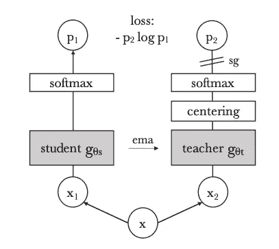
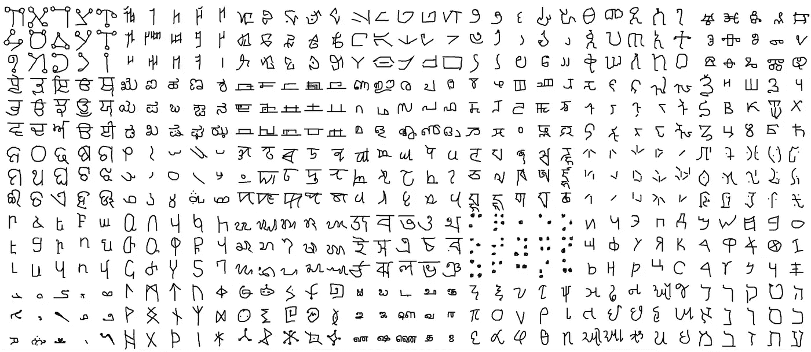
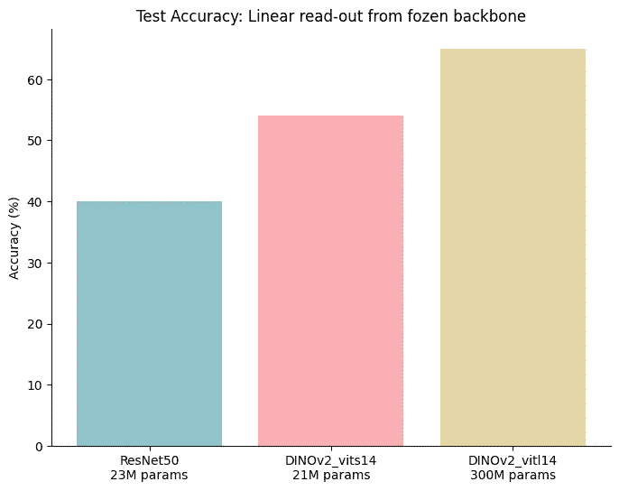

# 开箱 DINOv2，Meta 的新型全能计算机视觉骨干网络

> 原文：[`towardsdatascience.com/unboxing-dinov2-metas-new-all-purpose-computer-vision-backbone-d8e22c059040`](https://towardsdatascience.com/unboxing-dinov2-metas-new-all-purpose-computer-vision-backbone-d8e22c059040)

## 人工智能

## 视觉基础模型是否在追赶 LLMs？

[](https://michaloleszak.medium.com/?source=post_page-----d8e22c059040--------------------------------)[](https://towardsdatascience.com/?source=post_page-----d8e22c059040--------------------------------) [Michał Oleszak](https://michaloleszak.medium.com/?source=post_page-----d8e22c059040--------------------------------)

·发表于 [Towards Data Science](https://towardsdatascience.com/?source=post_page-----d8e22c059040--------------------------------) ·阅读时间 8 分钟·2023 年 5 月 7 日

--


自监督训练方法不断取得突破。上周，Meta AI 发布了他们的第二版自监督蒸馏模型 DINO。该模型据说可以作为骨干网络来解决几乎任何计算机视觉任务，而无需微调！计算机视觉中的基础模型是否已经赶上了大型语言模型长期以来的多功能性？让我们带着 DINO 去探索它能做些什么！

*如果你主要对尝试新的 DINO 感兴趣，可以直接滚动到“测试 DINOv2”部分。在此之前，我们将更详细地探讨模型的架构和训练过程。*


# 🦖 计算机视觉中的自监督学习

自监督在计算机视觉应用中逐渐受到关注已有几年之久。这不足为奇：没有标签示例的模型训练可能使用更大范围的训练数据，并且在一些标签难以获得或成本高昂的应用中，甚至可能实现以前无法完成的训练。

以自监督方式训练的模型仅从图像中学习，无需注释。实际上，它们从未标记的数据中创建自己的伪标签。

这在自然语言处理领域已成为一种既定实践，语言模型通常被训练以预测句子中的下一个词。给定输入文本，可以自动生成训练所需的特征和标签。

然而，在计算机视觉领域，自监督方法直到谷歌和 Meta 的一些对比模型（[SimCLR](https://arxiv.org/abs/2002.05709)，[MoCo](https://arxiv.org/abs/1911.05722)，[SwAV](https://arxiv.org/abs/2006.09882)，和[BYOL](https://arxiv.org/abs/2006.07733)）展示了最先进的结果之前，尚未真正起飞，这些结果有时与完全监督模型匹敌甚至超越了那些有标注训练数据的模型。在我的早期工作中，我展示了 MoCo 如何在标注训练样本稀缺的环境中提高 X 射线诊断的性能。

在 2021 年，Meta 在题为[《自监督视觉变换器中的新兴特性》](https://arxiv.org/abs/2104.14294)的论文中描述了他们的第一个 DINO。尽管他们的模型受到之前主导对比架构的启发，但采取了稍有不同的方法。让我们先看看原始的 DINO，因为它的第二个版本与之非常相似。


# 🦖 DINO 模型

“DINO” 实际上是一种首字母缩略词，代表自**di**蒸馏与**no**标签。正如其名称所示，它结合了两种学习技术：我们已经讨论过的无标签自监督学习和知识蒸馏。

知识蒸馏是一种通常用于压缩模型大小的方法。在这种方法中，一个较小的模型（称为“学生”）通常被训练以产生与一个较大、已训练好的模型（称为“教师”）相同的预测。如果学生能够真实地模仿教师，我们可以在使用较小模型的同时保持相同的性能。

DINO 使用作者称之为自蒸馏的方法，其中两个模型——学生和教师——实际上是相同的模型：它们具有相同的大小和架构。它们仅在训练期间如何更新其参数上有所不同。



DINO 的训练过程。图片来源：[arXiv:2104.14294](https://arxiv.org/abs/2104.14294)

为了训练 DINO，我们设置了两个相同的网络——作者最初使用的是视觉变换器（ViTs）。如前所述，这两个网络具有相同的架构但参数不同。

然后，从每张训练图像中，随机裁剪出一些区域。这些裁剪区域中，有些只覆盖了原始图像的一小部分——我们称之为局部视图。其他裁剪区域较大，覆盖了原始图像的显著部分——这些是全局视图。

接下来，所有的作物通过学生网络进行处理，而只有全局视图通过教师网络进行处理。每个网络生成其输入作物的潜在表示或嵌入。然后，通过交叉熵损失来评估学生和教师的嵌入之间的相似性。这个想法基于[SwAV](https://arxiv.org/abs/2006.09882)，旨在鼓励模型学习全局到局部的对应关系。

最后，基于损失的梯度被反向传播通过学生网络，以教会它生成类似于教师的表示。另一方面，教师的权重通过学生权重的指数移动平均进行更新。这个想法基于[MoCo 模型](https://arxiv.org/abs/1911.05722)，但与之不同的是，DINO 不使用任何记忆库。

原始 DINO 论文的标题是“[自监督视觉变换器中的新兴属性](https://arxiv.org/abs/2104.14294)”，因为作者对模型中出现的属性感到惊讶。DINO 骨干网络包含有关图像语义分割的信息，并且在下游图像分类任务中表现出色。

## V2 有什么新变化？

DINOv2 与其前身有何不同，我听到你在问。嗯，变化不大，至少在模型架构或训练例程方面没有太大变化。作者自己承认，在[DINOv2 论文](https://arxiv.org/abs/2304.07193)中，“大多数技术贡献旨在加速和稳定大规模训练”。

不同之处在于 DINOv2 训练所用的数据。迄今为止，视觉应用自监督学习的大多数进展都是在小型数据集上进行预训练的，比如臭名昭著的 ImageNet，其缺乏多样性阻碍了有用特征的学习。

DINOv2 的作者建立了一个数据管道，使他们能够策划一个相对较大且多样化的数据集。为此，他们使用聚类算法将候选图像分组为语义相似的集群，然后重新平衡集群，以防止模型过拟合数据中的少数几个主要模式。


# 🦖 测试 DINOv2

让我们对模型进行一个简单的测试吧！论文声称 DINOv2 骨干网络可以作为特征提取器使用，而无需微调。让我们看看它的表现如何。

作为测试任务，我们将让 DINO 识别手写字符来自哪个字母表，使用 Omniglot 数据集的一个子集。



Omniglot 数据集中的一个样本。来源：[`github.com/brendenlake/omniglot`](https://github.com/brendenlake/omniglot)。

具体来说，我们将 9543 个字符图像（来自 30 种不同字母表的 964 个不同字符）通过 DINOv2 主干网络。然后，我们将获得的嵌入分为训练集和测试集，并在其上训练一个逻辑回归分类器，以将图像分类到 30 种字母表之一。这种评估方法被称为线性读取——我们仅从冻结的主干网络中读取嵌入，并在其上放置一个线性层（或线性分类器）。

这是一个相当具有挑战性的任务：大约 9.6k 张图像和 960 个不同字符，每个字符只有 10 张图像（其中只有 7 张用于训练——其余用于测试）。实际上，我们创建了一个少样本学习问题，在这种情况下，一个随机分类器的准确率为 1/30，即 3.3%。

我们从设置数据加载器开始。

```py
dataset = ImageFolder(
    "omniglot",
    transform=transforms.Compose([
        transforms.ToTensor(), 
        transforms.Resize((98, 98))
    ]),
)
dataloader = DataLoader(
  dataset, shuffle=True, batch_size=64
)
```

接下来，我们加载 DINOv2 模型。[PyTorch Hub 上提供了四种不同的架构](https://github.com/facebookresearch/dinov2#pretrained-models)，它们有不同的大小和性能。我们使用最轻的 *ViT-S/14 distilled*（21M 参数）和最重的 *ViT-L/14 distilled*（300M 参数）（还有一个未蒸馏版本的 1100M 参数，但它相当重，并且与 300M 参数版本的性能非常接近）。这里是加载 *ViT-S/14 distilled* 的代码片段。

```py
dinov2_vits14 = torch.hub.load('facebookresearch/dinov2', 'dinov2_vits14')
```

完成这些之后，我们将所有图像通过 DINOv2 主干网络，并收集嵌入及其相关的目标标签。

```py
dinov2_vits14 = dinov2_vits14.to(device)

all_embeddings, all_targets = [], []

with torch.no_grad():
    for images, targets in tqdm(dataloader):
        images = images.to(device)
        embedding = dinov2_vits14(images)
        all_embeddings.append(embedding)
        all_targets.append(targets)

all_embeddings = torch.cat(all_embeddings, dim=0)
all_targets = torch.cat(all_targets, dim=0)
```

接下来，我们将数据分为训练集和测试集，并在其上训练一个逻辑回归分类器。

```py
X_train, X_test, y_train, y_test = train_test_split(
    all_embeddings.cpu().numpy(), 
    all_targets.cpu().numpy(), 
    test_size=0.3, 
    random_state=42,
)

model = LogisticRegression()
model.fit(X_train, y_train)
test_acc = model.score(X_test, y_test)
print(f'Test accuracy: {test_acc}')
```

我们得到了稍高于 54% 的测试准确率。比随机猜测好得多，但还远未完美。让我们看看它与一个更大的 300M 参数 DINO 和一个 ResNet50 的表现如何比较。



模型比较：两个 DINO 和一个 ResNet。

ResNet50 和小型 DINOv2 使用的*ViT-S/14*大小相似——DINO 实际上更小——但 DINO 的准确率高出大约 15 个百分点。一个更大的 DINO 可以将准确率再提高 10 到 15 个百分点，即 65–70%。

这是一个好的分数吗？在得到结果时，我的第一反应是略微失望。下意识地，我可能期望得到 90% 以上的准确率。但毕竟，这个任务不容易，而且我们仅使用了（相当于）一个线性层来进行训练。DINOv2 的表现确实优于类似大小的 ResNet，后者通常被用作主流的视觉特征提取器。

你对这些结果怎么看？在评论中告诉我吧！


感谢阅读！

如果你喜欢这篇文章，为什么不 [**订阅电子邮件更新**](https://michaloleszak.medium.com/subscribe) 以获取我新文章的通知呢？而通过 [**成为 Medium 会员**](https://michaloleszak.medium.com/membership)，你可以支持我的写作，并无限制访问所有其他作者和我的故事。

想要时刻掌握日益快速发展的机器学习和人工智能领域的最新动态？查看我的新通讯，[**AI Pulse**](https://pulseofai.substack.com/)。需要咨询？你可以随时问我问题或[**在这里**](https://topmate.io/michaloleszak)预约一对一咨询。

你还可以尝试[我其他的文章](https://michaloleszak.github.io/blog/)。难以选择？可以从这些中挑一个：

[](/self-supervised-learning-in-computer-vision-fd43719b1625?source=post_page-----d8e22c059040--------------------------------) ## 计算机视觉中的自监督学习

### 如何用少量标记样本训练模型

towardsdatascience.com [](/model-optimization-with-tensorflow-629342d1a96f?source=post_page-----d8e22c059040--------------------------------) ## 使用 TensorFlow 进行模型优化

### 通过量化和剪枝来减少模型的延迟、存储和推理成本

towardsdatascience.com [](https://pub.towardsai.net/forget-about-chatgpt-f17a7f5089c3?source=post_page-----d8e22c059040--------------------------------) [## 忘记 ChatGPT

### Bard、Sparrow 和多模态聊天机器人将很快使其过时，原因如下。

pub.towardsai.net](https://pub.towardsai.net/forget-about-chatgpt-f17a7f5089c3?source=post_page-----d8e22c059040--------------------------------)

除非另有说明，所有图片均由作者提供。
