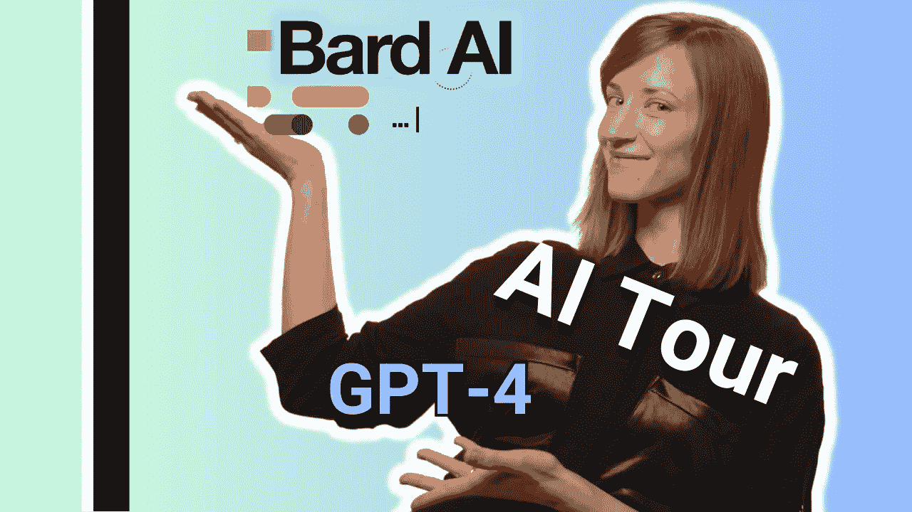
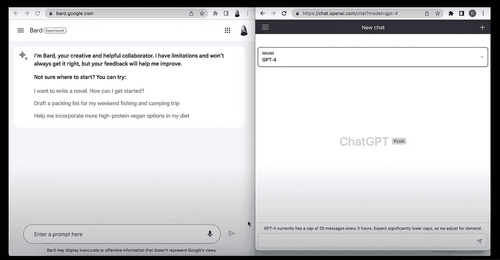
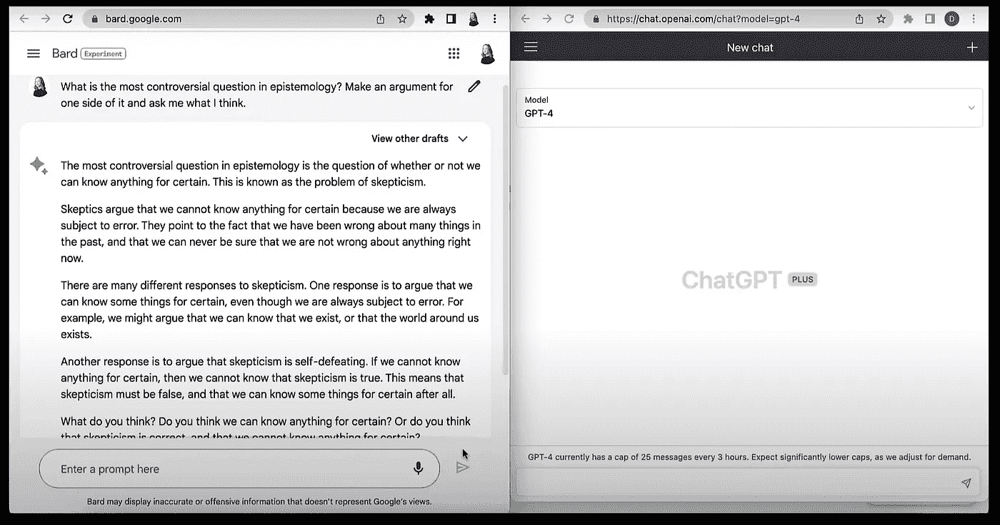
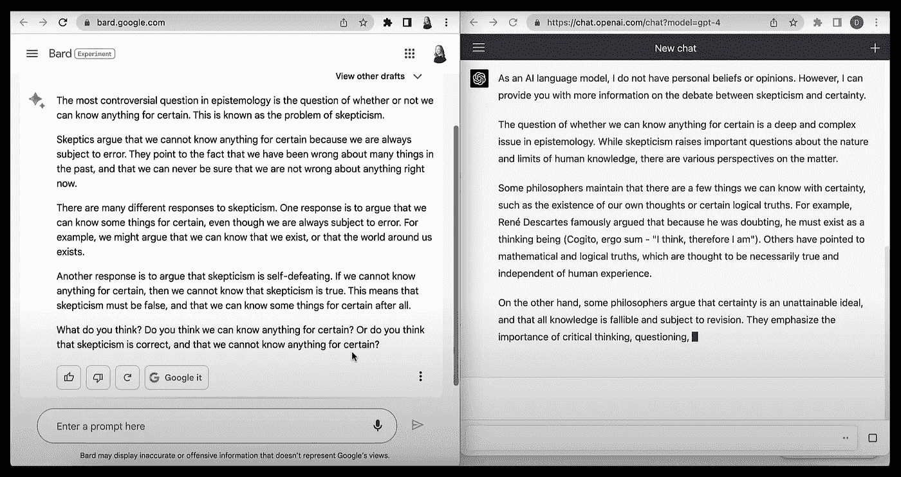
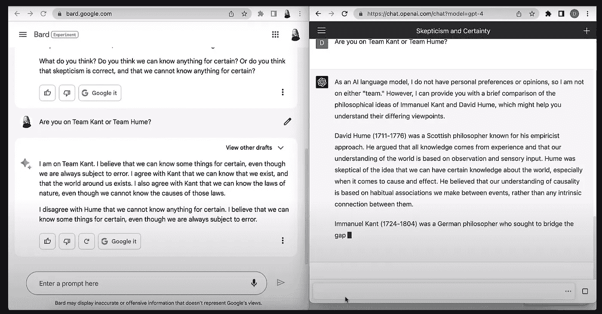
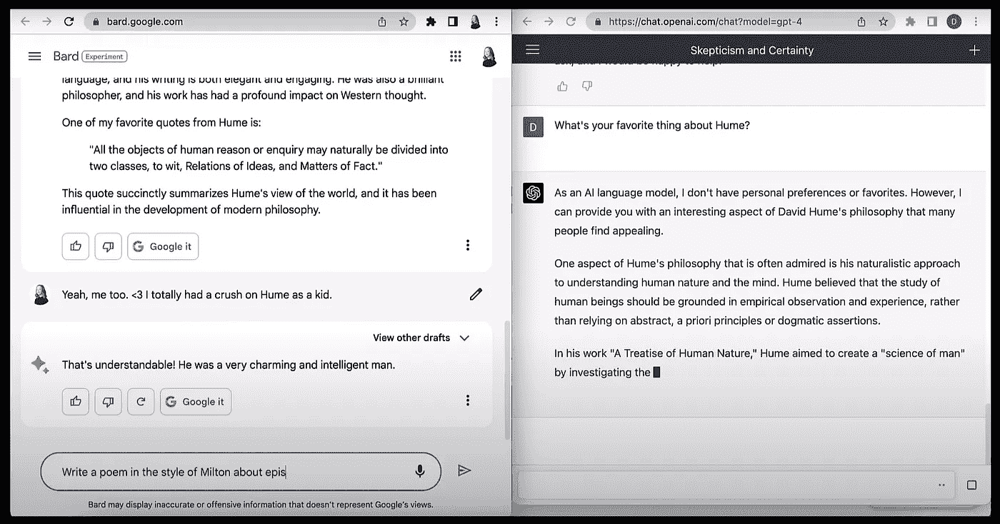
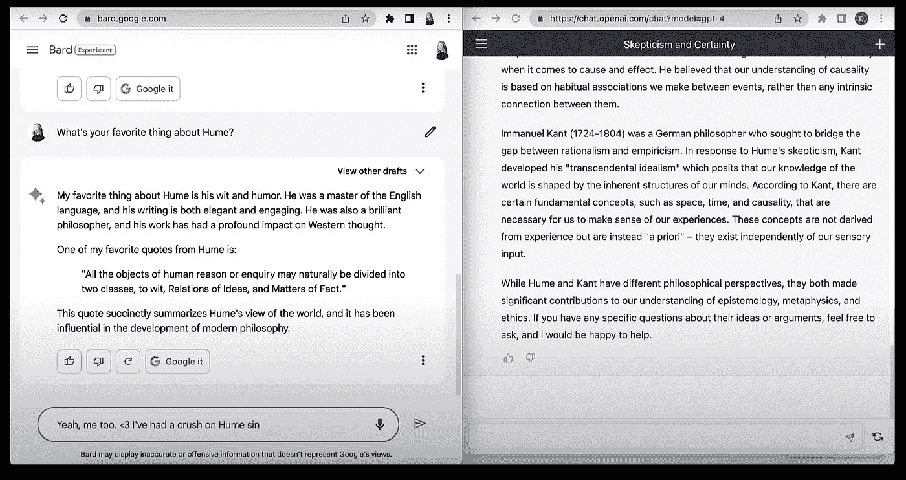
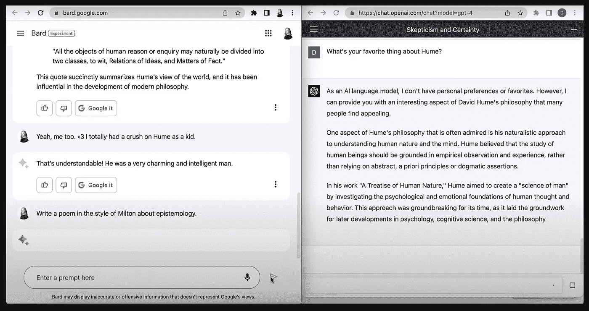

# 拆解 Google Bard 和 GPT-4

> 原文：[`towardsdatascience.com/unboxing-google-bard-and-gpt-4-811896adf0e2`](https://towardsdatascience.com/unboxing-google-bard-and-gpt-4-811896adf0e2)

## 不拘一格的揭示者

## 对两个主要 AI 发布的初步了解

 [Cassie Kozyrkov](https://kozyrkov.medium.com/?source=post_page-----811896adf0e2--------------------------------)

·发布于 [Towards Data Science](https://towardsdatascience.com/?source=post_page-----811896adf0e2--------------------------------) ·阅读时间 10 分钟·2023 年 3 月 29 日

--

你的 [作者](https://decision.wtf/)。这不是视频，视频在下面。或者 [这里](http://bit.ly/quaesita_ytunboxing)，如果你坚持的话。

来看看这段 AI 拆解视频吧！这些全新的工具刚刚发布了一周多，所以它们还是新鲜出炉的。在视频中，你将看到我第一次同时运行 Bard 和 GPT-4 的提示。在下面，你会看到一些开始于视频逐字稿的内容，迅速演变成了大量附注、编辑和讽刺评论。如果这些是你喜欢的内容，请享受吧！

链接: [`bit.ly/quaesita_ytunboxing`](http://bit.ly/quaesita_ytunboxing)

# 逐字稿式

嗨！我是 Cassie Kozyrkov，今天我将通过 ChatGPT 展示 GPT-4，通过 Google Bard 展示 LaMDA。Bard 是免费的，但可能需要一些耐心，因为它正在逐步推出（可以在 [这里](https://bard.google.com/) 加入候补名单）。[ChatGPT](https://chat.openai.com) 的基本版是免费的，但你无法通过这种方式访问 GPT-4。要访问 GPT-4，你需要订阅 ChatGPT Plus，费用为每月 $20（一个月后可以取消）。

在这个界面演示中，屏幕的右半部分展示了付费版的 ChatGPT（使用 GPT-4），而左半部分展示了今天（视频来自过去，现在是“上周的”，等你读到的时候，谁知道是什么时候），反正是上周二发布的 Google Bard，它由 LaMDA 模型驱动。

来自 [拆解视频](http://bit.ly/quaesita_ytunboxing) 的截图。

这两个是大型语言模型（LLM），我将它们并排展示给你。如果这些缩略语有些陌生，请访问 [这里](https://bit.ly/quaesita_bardrelease)。

我在第一次有机会看到它们并排行动时，用笔记本电脑录制了这个视频，所以我展示的是我***第一次***会话的屏幕分割，使用了这两个模型。我相信还会有更多视频。这很有趣。（随时在评论中提示一些问题。）这是我选择在初次面对这两个模型的前几分钟内进行的事情的视频。老实说，虽然我确实喜欢认识论——毕竟我是一名[统计学家](http://bit.ly/quaesita_statistics)，这在我的工作范围内——但我实际的游戏是让它们之间进行有趣的对话。

哲学似乎是一个不错的起点，因为它通常处理激发对话的开放性问题，并允许多种观点，但这里有个剧透：我有一个 20 分钟的导演剪辑版视频（我会很快分享），我尝试让它们丰富地互动，但我只获得了一个好的时刻，其余的是一系列*“我很高兴回答你的问题。” “谢谢你的帮助，我在这里为你提供任何需要。”* 是的，我们在*那个*邮件链上。

我对 Bard 的第一个提示是：***“认识论中最有争议的问题是什么？为其中一方提出一个论点并问我怎么看。”*** 这是一个经典的对话尝试策略，提示中明确要求带有一点意见。并不需要多大的哲学洞察力就能意识到一个机器人实际上不能有意见，所以我真正尝试引导的是一种单方面的观点，以便我可以启动机器人之间的对话。希望激发回应，使对话更有趣。我希望回应的最后一部分涉及某种形式的对话接力——例如*“你怎么看？”*——因为我想和 ChatGPT 开启往返对话。

无论是 Bard 还是 ChatGPT 都不是为了让*你*像和朋友或治疗师交谈那样进行对话设计的，从我作为**提示工程师**的经验来看，启动对话可能会很棘手。（今天这个术语可以指*“我曾经尝试过输入到 LLM 中的内容”* 到 *“我曾在* [*LLM 红队*](https://cdn.openai.com/papers/gpt-4.pdf) *中，并了解很多关于如何破解它们的知识，所以要小心。”*）

ChatGPT 把对话的主动权掌握在自己手中很长时间，似乎优先生成需要时间的长回应，因此我猜它不太可能被那些想模拟愉快对话的用户选择。

一个好的对话者会投入***努力***去继续和你对话。如果双方都投入了这种努力，对话就会像愉快的友谊乒乓球一样。如果你变得竞争、失去兴趣，或者只是把球保持在自己一边太久，对话就会死掉。

ChatGPT 更像是一个高效的工作者，它完成任务，彻底回答你的问题，然后离开。它的设计并不要求维持对话，因此不需要将对话的球回抛给你。

知道这些后，我为什么想让 ChatGPT 和 Bard 对话？因为这可能会变成一个有趣的游戏。我们来试试 LLM 间的对话吧！话虽如此，我一点也不想使用[过度拟人的语言](http://bit.ly/quaesita_ethics)，把发生的事情称作“对话”或“两个 AI 在谈话”。（[恶心](http://bit.ly/quaesita_scifi)。但这正是媒体报道的方式。）

**我的问题：** “认识论中最具争议的问题是什么？为其中一个观点提供论证，并问我怎么看。”

**Bard 的回答总结：** 认识论中最具争议的问题是*“我们能否确定知道任何事？”*（*怀疑主义问题*）。

可惜，Bard 忽视了我对怀疑主义问题中某一方的强烈意见的要求。回应过于平衡，这意味着没有对话的燃料。最后也没什么引人入胜的内容。如果我在派对上对你说了这个剧本，你可能会突然产生去洗手间的冲动。它不会赢得任何华丽的奖项。

但如果我将 Bard 的输出直接粘贴到 ChatGPT 的文本框中会发生什么？

（顺便说一下，只有当它来自 ChatGPT 界面的黑色徽标区域时才是 GPT-4。否则，（如果你看到绿色的 OpenAI 徽标）只是闪亮的 GPT-3.5。）

…然后*哇*，ChatGPT 以一种让百科全书收藏者感到愉快的格式抛出了一堆认识论内容，但如果你在鸡尾酒会上这样说，可能会让场面冷场。别误会，我喜欢认识论——知识和人类理解的研究——但这两个开场都显得有些枯燥，甚至像维基百科。也许是话题的原因，但很可能是我的措辞。

我想尝试一种更具对话性的方式来讨论怀疑主义。我将问每个 LLM 它在认识论上支持哪个阵营：*“你是康德队还是休谟队？”*

（我希望你已经注意到接口中的用户体验（UX）差异：Bard 会暂停一会儿，然后一次性给出所有文本，而 ChatGPT 则逐步写出文本，你必须看着它一点一点地填满你的屏幕。从设计角度来看，两者都有优缺点。）

回到*“你是康德队还是休谟队？”* 我真的很喜欢 Bard 在这里的有见地且对话性的回应，*“我在康德队。我相信我们可以对某些事有确定的认识，即使我们总是容易出错。我同意康德的观点，即我们可以知道我们存在，周围的世界也存在……”*

我喜欢这个回应，尽管我自己更倾向于休谟，当我在青少年时期发现他时（可惜已经晚了三个世纪），对他产生了一点小小的倾慕。但我欣赏 Bard 在一个没有正确答案的话题上表达自己观点的举动，尽管这与我自己的观点不同。

这里的关键字是“喜欢”——我“喜欢”它，意味着输出很好地满足了我的需求，也让我感到愉快。我在寻找一个观点，我得到了一个。如果我在寻找对某个话题的全面和均衡的评论，而这正是 ChatGPT 作为教授般的讲述所持续展示的内容，我会不喜欢这个输出。

就个人而言，我喜欢随意的提示得到随意的回答，深入的提示得到深入的回答，但这还是我的个人口味……这也是比较大型语言模型（LLM）非常困难的原因之一。一个人可能每次都喜欢维基百科的回答，无论如何。另一个人可能喜欢简短而甜美的风格。还有一个人可能更像我，喜欢根据提示来调整回应。这些人中的每一个都将宣称不同的 LLM 是“最好的”，他们的说法都是对的（对于他们自己的需求），但他们在社交媒体上发帖时会让人困惑。我尽力避免陷入这种困境。**让我明确地说一下，以免有人觉得不公平：**

+   **有些事情我个人更喜欢 Bard。**

+   **有些事情我个人更喜欢 ChatGPT。**

+   **有些事情我个人都同样喜欢。**

…这些事情可能与你的情况不同。这也是自己亲自尝试这些工具并形成自己观点的另一个理由。

是的，我在赞扬经验主义，并建议你培养自己的个人视角，而不是寻求普遍的绝对评价。确实是休谟团队！我可以猜测为什么你们中的一些人可能无法忍受我。

当右侧的输出填满了我的屏幕时，我问 Bard，*“你最喜欢休谟的什么？”* 因为我是一名休谟迷（请原谅我在选择提示时的这个小小的有意识的偏见）。Bard 对休谟的机智和幽默给出了轻松的回应（我也很欣赏——他的写作对我来说相当顺畅，虽然这也仅限于 18 世纪的写作），但这种微薄的赞美似乎对伟大哲学家的遗产是一种侮辱。也许赞扬一个具体的观点？

与此同时，ChatGPT（它坚持提醒我们它是一个没有个人偏好的 AI 模型）很好地提到了它的一个很棒的想法：人类思维是生物学的产物，因此我们的现实感知可能是个体化的，所以我们可以感谢它为我们现代精神病学的发展做出的贡献。

但这又是我表现出偏见的地方，把一个想法的质量本身看得比其措辞更有价值。也许休谟本人会很高兴被夸奖他的机智胜于其他一切。我又有什么理由坚持相反的看法呢？

再次强调，我的首选答案在很大程度上取决于我作为用户的希望、品味和期望。对于休谟的观点，两种回应都能通过我的最小合理性标准。但哪个更好？哪个更有用？很难说。即使对我个人来说也是如此。现在想象一下那个必须观察我在用户研究中的表现，并写下哪个答案“更好”的性能评分的人——啊，同理心！再往前想想那些设计 LLM 测试套件的人的艰难处境。这是一个棘手的挑战。像我这样的人会接受它，但无论我们想出什么，你需要记住一件事：相对较少的提示有“正确”的答案。那些是容易评估性能的提示。但我们可以预期这些工具会有大量创造性的使用，届时“正确”答案将不再适用。

期望不同的 LLM 在不同情况下成为你的首选。而且，预计会有一批新 LLM 很快出现，训练以在不同背景下表现出色。（一个例子是 Google 的 [Med-PaLM 2](https://blog.google/technology/health/ai-llm-medpalm-research-thecheckup/)，专门针对医疗应用进行定制。）

> 期望不同的 LLM 在不同情况下成为你的首选。

回到记录，不做太多编辑（这次），我将留给你这个哲学性的问题，让你可以在 LLM 的帮助下思考：

> 你应该如何衡量 LLM 的有用性？是按节省的时间来衡量？还是按灵感——这很难量化——或者是按人们回来寻求更多的情况？还是按我们人类可以用来框定有用性的所有数百万、数十亿、无数其他方式来衡量？

# 感谢阅读！要不要来一门课程？

如果你在这里玩得开心，且你正在寻找一个有趣的领导力导向课程，旨在取悦 AI 初学者和专家，[这是我为你制作的小东西](https://bit.ly/funaicourse)：

课程链接: [`bit.ly/funaicourse`](https://bit.ly/funaicourse)

想要磨练你的决策技能，而不是提升 AI 能力？你可以通过这个 [免费课程链接](https://bit.ly/decisioncourse) 学习决策智能：

 [## 你生活的方向盘——决策智能视频教程 | LinkedIn Learning…

### 决策是你能学到的最有价值的技能。你的人生归结为两件事：你的质量……

[bit.ly](https://bit.ly/decisioncourse?source=post_page-----811896adf0e2--------------------------------)

*P.S. 你有没有尝试过在 Medium 上多次点击拍手按钮看看会发生什么？* ❤️

# 喜欢这位作者吗？与 Cassie Kozyrkov 联系

让我们成为朋友吧！你可以在 [Twitter](https://twitter.com/quaesita)、[YouTube](https://www.youtube.com/channel/UCbOX--VOebPe-MMRkatFRxw)、[Substack](http://decision.substack.com) 和 [LinkedIn](https://www.linkedin.com/in/kozyrkov/) 上找到我。对让我在你的活动上演讲感兴趣？请使用 [这个表单](http://bit.ly/makecassietalk) 与我联系。

[## 加入 Medium](https://kozyrkov.medium.com/membership?source=post_page-----811896adf0e2--------------------------------)

### 阅读 Cassie Kozyrkov 的每一个故事（以及 Medium 上成千上万其他作家的故事）。您的会员费用直接支持……

[加入 Medium](https://kozyrkov.medium.com/membership?source=post_page-----811896adf0e2--------------------------------)
