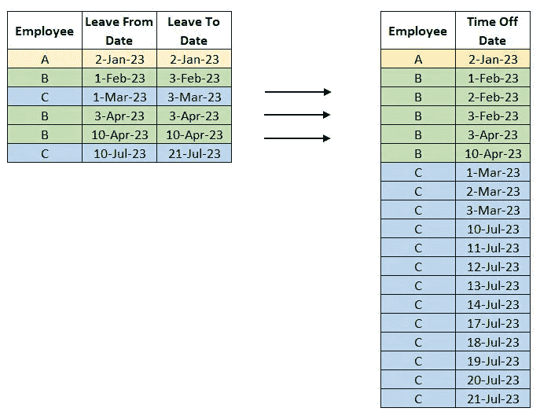
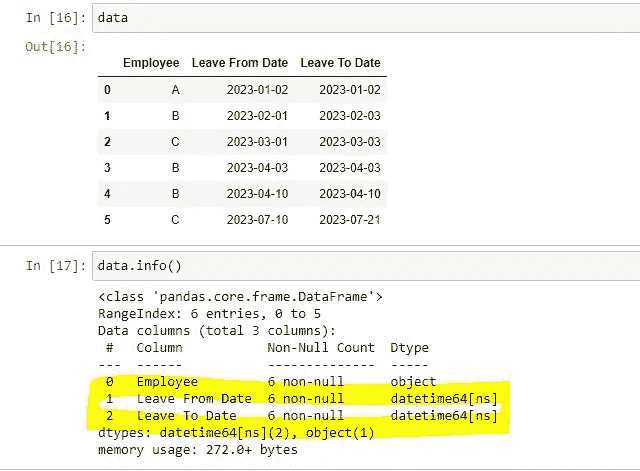
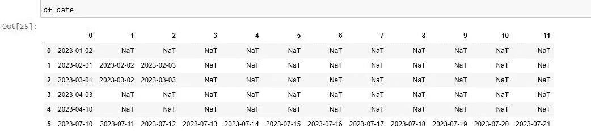
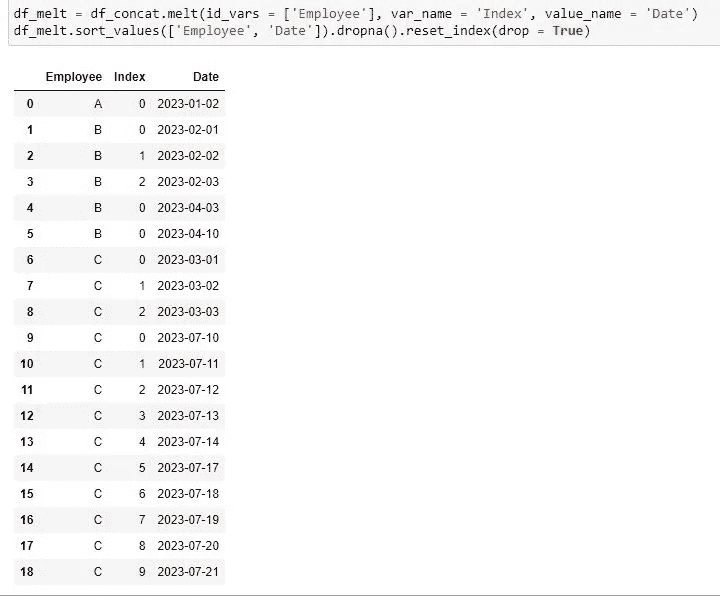

# 使用 Python 的 Pandas 库简化非传统的日期时间转换

> 原文：[`towardsdatascience.com/unconventional-datetime-transformation-made-easy-using-pythons-pandas-library-aa9a8c65d885`](https://towardsdatascience.com/unconventional-datetime-transformation-made-easy-using-pythons-pandas-library-aa9a8c65d885)

## 通过实际例子进行解释

[](https://jin-cui.medium.com/?source=post_page-----aa9a8c65d885--------------------------------)[](https://towardsdatascience.com/?source=post_page-----aa9a8c65d885--------------------------------) [Jin Cui](https://jin-cui.medium.com/?source=post_page-----aa9a8c65d885--------------------------------)

·发表于 [Towards Data Science](https://towardsdatascience.com/?source=post_page-----aa9a8c65d885--------------------------------) ·5 分钟阅读·2023 年 7 月 25 日

--


图片来源：[Debby Hudson](https://unsplash.com/@hudsoncrafted?utm_source=medium&utm_medium=referral) 在 [Unsplash](https://unsplash.com/?utm_source=medium&utm_medium=referral)

# 背景

最近，我的任务是分析客户公司员工的请假情况。特别是，我需要了解员工在特定时间段内是否请假，*最终*设定一个衡量员工是否遵守办公室回归政策的基准。

我获得了以下两个请假数据集：

1.  **休假** **数据**（“数据集 A”），列出了员工的短期请假，如年假或病假。这些请假数据在每个员工每一天的层面上是唯一的（即数据集中的每一行代表某一员工的某一天请假）。

1.  **休假数据**（“数据集 B”），列出了员工的长期请假的 *开始* 和 *结束* 日期。这些请假的例子包括育儿假、产假、无薪假期和职业休假。这个数据集以“请假即走”的方式记录员工的长期请假，每一行代表一个日期范围，员工可能会在数据集中出现多行，每行代表一个不同的日期范围（例如，员工可能会选择每周三天的育儿假，持续 30 周，这将在数据集中显示为 30 个日期范围，分布在 30 行中）。

这两个数据集相辅相成，因为员工在特定时间段内可能会请短期和长期假。

对于我的分析，我希望将两个数据集合并为一种通用格式，以便能够记录特定员工的所有假期。由于数据集 A 已经是按日期和员工级别的结构化表格格式，我需要将数据集 B 转换为类似的格式，如下图所示（这是我为了演示目的创建的数据集）。



图 1：日期时间转换。数据集和图像由作者提供

# 方法论

图 1 中展示的转换带来了许多挑战，因为它不是‘一对一’的，而且涉及到日期。为了实现这一转换，我遵循了如下方法：

+   数据集 B 中的日期范围（如图 1 左侧表格所示）被拆分为唯一（有效）日期

+   关联到同一员工的拆分日期出现在多个行中，这些日期被转换为两个按员工分组的列，然后是唯一日期（如图 1 右侧的表格所示）

我是如何在 Python 中实现上述功能的？继续阅读，获取详细的逐步指南！

# 使用 Pandas 进行日期时间转换

**步骤 1：加载库和数据**

正如该步骤名称所暗示的：

```py
# Load libraries

import pandas as pd
import numpy as np

from datetime import date, timedelta

path = r"Your_Directory_Path\Data.xlsx"
data = pd.read_excel(path)
```

下图展示了数据的打印输出和按列的数据类型。你应该确保这两个日期列的数据类型为 datetime，如果不是，可以使用 [***pd.to_datetime()***](https://www.geeksforgeeks.org/python-pandas-to_datetime/) 进行转换。



图 2：按列的数据和数据类型。图像由作者提供

**步骤 2：获取每行的唯一日期**

然后我们将数据中每一行的日期范围‘拆分’为唯一的日期。这可以使用 [***pd.date_range***](https://pandas.pydata.org/docs/reference/api/pandas.date_range.html) 方法来实现，并将 *freq* 参数指定为 ‘D’：

```py
collate = []

for j in range(len(data)):

    start_date = data['Leave From Date'][j]
    end_date = data['Leave To Date'][j] 

    date_range = pd.date_range(start = start_date, end = end_date, freq = 'D')

    collate.append(date_range)

df_date = pd.DataFrame(collate)
```

其输出显示在下图中。例如，2023–02–01 到 2023–02–03 的日期范围中的员工 B 在第 2 行，现在被拆分成三个唯一日期。



图 3：拆分日期。图像作者提供

你可能会注意到，最后一行中有一些无效日期，如 2023–07–15 和 2023–07-16，这些日期落在周末。为了仅获取工作日日期，请在以下代码中添加一行代码，将工作日索引限制为小于 5。此外，我在注释掉的代码中提供了一个限制日期范围的选项。

```py
 collate = []

for j in range(len(data)):

    start_date = data['Leave From Date'][j]
    end_date = data['Leave To Date'][j] 

    date_range = pd.date_range(start = start_date, end = end_date, freq = 'D')

    ## Get business dates only
    work_dates = date_range[date_range.weekday < 5]

    ## Apply a date range filter if you wish

    #from_date = pd.to_datetime('2023-01-01')
    #to_date = pd.to_datetime('2023-06-30')
    #work_dates = work_dates[(work_dates >= from_date) & (work_dates <= to_date)]

    collate.append(work_dates)

df_date = pd.DataFrame(collate) 
```

**步骤 2：行到列的转换**

现在我们已经拆分了日期范围。接下来我们将按员工级别将这些日期合并。例如，图 3 中的第 2 行和第 5 行都对应于员工 C。

为了将多个行中的日期转换为按员工划分的单一列，我们将‘员工’标识符添加回上述生成的 *df_date* 数据框中，然后对‘员工’列应用 Pandas 的 [***.melt()***](https://pandas.pydata.org/docs/reference/api/pandas.melt.html) 方法。

```py
## Add back employee identifier

df_concat = pd.concat([pd.DataFrame(data['Employee']), df_date], axis = 1) \
                           .sort_values(['Employee']).reset_index(drop = True)

## Apply .melt() over employee identifier, and remove NaT values
df_melt = df_concat.melt(id_vars = ['Employee'], var_name = 'Index', value_name = 'Date')
df_melt.sort_values(['Employee']).dropna().reset_index(drop = True)
```

上面的代码输出正是我们所追求的，见下图。



图 4：最终输出。图像由作者提供

任务完成！这个数据框现在可以与数据集 A 一一对应地进行进一步分析。

# 结论

当我第一次遇到这个问题时，我考虑了使用 SQL、R 和 Python 等多种工具。通过一些研究，我最终选择了 Python，因为它看起来是实现起来最简单的，特别是对于将日期范围拆分为单独日期和将列转换为行（需要注意的是，*melt* 方法在 R 中也可用）。

说到这里，我非常欢迎大家对其他读者认为更实用的数据转换解决方法提供反馈——请在评论区留言！

*在我乘风 AI/ML 浪潮的同时，我喜欢用全面的语言编写和分享逐步指南和操作教程，附带现成的代码。如果你想访问我所有的文章（以及 Medium 上其他从业者/作者的文章），你可以使用* [*这个链接*](https://medium.com/@jin-cui/membership) *注册！*
