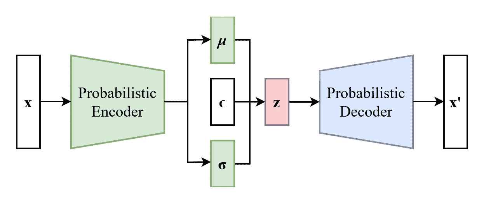

# 使用变分自编码器（VAE）发现异常：深入探索无监督学习的世界

> 原文：[`towardsdatascience.com/uncovering-anomalies-with-variational-autoencoders-vae-a-deep-dive-into-the-world-of-1b2bce47e2e9`](https://towardsdatascience.com/uncovering-anomalies-with-variational-autoencoders-vae-a-deep-dive-into-the-world-of-1b2bce47e2e9)

## 使用变分自编码器（VAE）在各种数据类型中检测异常的示例用例

[](https://medium.com/@will.badr?source=post_page-----1b2bce47e2e9--------------------------------)[](https://towardsdatascience.com/?source=post_page-----1b2bce47e2e9--------------------------------) [Will Badr](https://medium.com/@will.badr?source=post_page-----1b2bce47e2e9--------------------------------)

·发布在 [Towards Data Science](https://towardsdatascience.com/?source=post_page-----1b2bce47e2e9--------------------------------) ·9 分钟阅读·2023 年 1 月 17 日

--


图片由 [JJ Ying](https://unsplash.com/@jjying?utm_source=medium&utm_medium=referral) 提供，来源于 [Unsplash](https://unsplash.com/?utm_source=medium&utm_medium=referral)

在之前的 [帖子](https://medium.com/p/3e5c6f017726) 中，我解释了什么是自编码器，它们的用途以及如何在训练异常检测模型中利用它们。作为提醒，自编码器是一种常用于降维和特征学习的神经网络类型。它们也常用于异常检测，因为它们可以学习重构正常数据，但可能会在重构异常或离群数据时遇到困难。

自编码网络由两个组成部分构成：编码器和解码器。编码器将输入数据映射到较低维度的潜在空间，而解码器将潜在表示映射回原始输入空间。在训练过程中，自编码器被训练以尽可能准确地重构输入数据。

要使用自编码器进行异常检测，首先需要在*正常、非异常*的数据集上训练自编码器。训练完成后，自编码器可以用于重构新的数据样本。如果新的数据样本与自编码器训练时的正常数据有显著差异，它可能会被重构得很差，表明它可能是异常的。

在本文中，我将重点讨论使用一种变体自编码器网络，即变分自编码器（VAE），来检测异常，以及它在异常检测中与普通自编码器的不同之处。

VAE 是一种用于生成建模的神经网络架构。它们的独特之处在于能够学习给定数据集的紧凑、潜在且压缩的表示，然后从这种表示中生成新的样本。

VAE 的一个关键特性是它们被设计为能够学习数据的概率模型，这意味着它们可以用来生成与训练数据相似但不完全相同的新样本。这使得 VAE 可以用于图像生成、文本生成以及其他类型的数据生成任务。

你可能还在想，生成模型与异常检测任务有什么关系！为了回答这个问题，让我们回顾一下异常检测是什么。异常检测是识别数据集中不寻常或意外模式的任务，任何偏离正常情况的模式。由于 VAE 能够学习数据的概率模型，这使得它们能够从潜在空间生成新的样本。这些新样本来自与你用于训练模型的原始数据相同的概率分布，使得 VAE 在数据变化方面比普通自编码器更具鲁棒性和容忍度。这对于检测具有明确正常行为的数据中的异常非常有用。

## VAE 网络结构



来源：[`commons.wikimedia.org/wiki/File:Reparameterized_Variational_Autoencoder.png`](https://commons.wikimedia.org/wiki/File:Reparameterized_Variational_Autoencoder.png)

VAE 网络通常由多个组件组成：

1.  **编码器：**编码器是一个神经网络，它将输入数据映射到一个低维的潜在空间。编码器通常由一组在训练过程中学习到的权重和偏置参数化。

1.  **潜在空间：**潜在空间是编码器将输入数据映射到的低维空间。这个潜在空间通常具有连续结构，这意味着潜在空间的维度只能在某个范围内取任意实值。这与离散潜在空间形成对比，后者每个维度仅允许有限的值集合。这为 VAE 模型提供了更多的灵活性和表达能力。它使 VAE 能够捕捉输入数据中的微妙变化和细微差别，然后生成接近训练数据但不完全相同的新数据样本。这使得 VAE 能够捕捉数据中的不确定性和变异性，并生成多样化和变化丰富的新样本（因此得名 **变分** 自编码器）。

1.  **解码器：**解码器是一个神经网络，它将上述潜在表示映射回原始输入空间。解码器同样通常由一组在训练过程中学习到的权重和偏置参数化。

1.  **重构损失：**重构损失衡量解码器从潜在表示中重建输入数据的能力。通常使用此损失来训练模型。

到目前为止，上述 4 个组件与常规自编码器中的组件类似。VAE 还有两个额外的组件：

5\. **先验：**先验是用于建模潜在空间的概率分布。在 VAE 中，先验通常假定为标准正态分布。

6\. **后验：**后验是给定输入数据建模潜变量的分布。后验通常使用由编码器参数化的函数进行近似。

现在你知道了 VAE 网络的内容，让我们使用 PyTorch 实现一个基本版本：

```py
import torch
import torch.nn as nn
import torch.nn.functional as F

# Define the VAE model
class VAE(nn.Module):
    def __init__(self, input_dim, latent_dim):
        super(VAE, self).__init__()
        # Define the encoder
        self.encoder = nn.Sequential(
            nn.Linear(input_dim, 32),
            nn.ReLU(),
            nn.Linear(32, 16),
            nn.ReLU()
        )
        # Define the latent representation
        self.fc_mu = nn.Linear(16, latent_dim)
        self.fc_logvar = nn.Linear(16, latent_dim)

        # Define the decoder
        self.decoder = nn.Sequential(
            nn.Linear(latent_dim, 16),
            nn.ReLU(),
            nn.Linear(16, 32),
            nn.ReLU(),
            nn.Linear(32, input_dim),
            nn.Sigmoid()
        )

    def forward(self, x):
        x = self.encoder(x)
        mu = self.fc_mu(x)
        logvar = self.fc_logvar(x)
        z = self.reparameterize(mu, logvar)
        reconstructed = self.decoder(z)
        return reconstructed, mu, logvar

    def reparameterize(self, mu, logvar):
        std = logvar.mul(0.5).exp_()
        eps = torch.randn_like(std)
        return mu + std*eps

# Train the VAE on the normal data
vae = VAE(input_dim=30, latent_dim=10)

# Generate random input data to test the model
data = torch.randn(100, 30)
optimizer = torch.optim.Adam(vae.parameters())
```

让我解释一下上面代码片段中的每个部分：

+   编码器和解码器与常规自编码器相同。编码器将输入维度大小（*input_dim*）映射到较小的维度/压缩表示（*latent_dim*），然后解码器将其解压回原始输入维度。

+   `fc_mu`：是一个全连接层，它将编码器生成的输入数据的中间表示映射到后验分布的均值。

+   `fc_logvar`：也是一个全连接层，将输入数据的中间表示映射到后验分布的对数方差。然后使用后验分布来建模给定输入数据的潜变量。

+   `reparameterize()` 我们从全连接层生成的后验均值和对数方差用于通过该函数采样潜变量。这使得 VAE 可以使用基于梯度的优化方法进行训练。它也被称为**重参数化技巧**。

现在我们定义了模型和优化器，我们需要定义损失函数和训练函数。在我们的情况下，损失函数将是两种不同损失的组合。重构损失衡量输入和输出之间的差异；KL 散度损失。**KL 散度损失**用于促使后验分布类似于先验分布，这有助于防止过拟合，并确保潜变量捕捉到输入数据的潜在结构和变异性。

*仍然不明白？让我们进一步详细解释：*

先验分布指的是在条件化输入数据之前的潜变量分布。先验分布通常假定为标准正态分布，这表示潜变量是独立的且具有简单的分布。后验分布指的是在条件化输入数据之后的潜变量分布。后验分布通过编码器生成的潜变量的均值和对数方差来建模。

先验分布作为 VAE 中的正则化项使用，因为它鼓励潜在变量的后验分布（给定输入数据）与先验分布相似。这有助于防止过拟合，并确保潜在变量捕捉输入数据的潜在结构和变化，而不仅仅是记忆训练数据。我们简单地使用 KL 散度损失来实现这一点。它被计算为后验分布和先验分布之间逐元素散度的总和：

```py
kl_loss = -0.5 * torch.sum(1 + logvar - mu.pow(2) - logvar.exp())
```

上述负号的加入是为了确保损失始终为非负，因为 KL 散度是衡量两个分布之间差异的非负量度。0.5 的因子是为了计算方便，因为它允许使用潜在变量的均值和对数方差来计算损失，而不是概率密度。

让我们看看训练代码：

```py
# Instantiate the model
model = VAE(input_dim=30, latent_dim=10)

# Define our reconstruction loss function
loss_fn = nn.BCELoss()

# Train the model
for epoch in range(100):

    # Compute the reconstruction loss
    reconstructed, mu, logvar = model(data)
    reconstruction_loss = loss_fn(reconstructed, data)

    # Compute the KL divergence loss
    kl_loss = -0.5 * torch.sum(1 + logvar - mu.pow(2) - logvar.exp())

    # Compute the total loss
    total_loss = reconstruction_loss + kl_loss

    # Backpropagate the gradients and update the model weights
    optimizer.zero_grad()
    total_loss.backward()
    optimizer.step()

    # Print the loss values
    print(f"Epoch {epoch}: reconstruction_loss = {reconstruction_loss:.4f}, kl_loss = {kl_loss:.4f}, total_loss = {total_loss:.4f}")
```

在实例化模型之后，我们输入数据，模型将返回三个参数：重建输出、mu 和 logvar 参数。然后我们使用 mu 和 logvar 来计算 KL 散度损失。总损失将是重建损失和 KL 散度损失的总和。因此，我们计算相对于*total_loss*变量的梯度。

## 自编码器与变分自编码器 (VAE)：

VAE 和普通自编码器之间的主要区别在于潜在空间的添加和使用变分下界作为目标函数，该目标函数由两部分组成：重建损失和潜在空间上近似后验分布与先验分布之间的 KL 散度。

在普通自编码器中，编码器网络将输入数据映射到潜在表示，解码器网络将潜在表示映射回原始数据。目标函数通常是重建损失，它测量输入数据和重建数据之间的差异。

在 VAE 中，编码器网络仍然将输入数据映射到潜在表示，但潜在表示被分为两个部分：均值向量和对数方差向量。这两个向量用于定义潜在空间上的高斯分布，这允许 VAE 通过从该分布中采样来生成新的样本。然后，解码器网络用于将这些潜在样本映射回原始数据空间。

总结来说，VAE 和普通自编码器之间的主要区别在于使用具有概率解释的潜在空间，以及将变分下界作为目标函数。

## VAEs 的劣势：

现在我们探讨了 VAEs 的好处和优势，特别是在异常检测领域，接下来让我们探讨一些其劣势：

+   对于数据高度变化或具有多种正常行为模式的情况，VAEs 可能不够有效。

+   VAEs 还可能对超参数的不同选择非常敏感，例如潜在维度和学习率，这可能使其优化变得困难。

+   VAEs 的训练可能会计算昂贵，因为它们需要从潜在空间进行采样，并通过采样过程进行反向传播。

+   VAEs 可能难以捕捉输入数据与潜在变量之间的复杂关系，尤其是当数据高度结构化或相关时。

+   VAEs 可能会生成模糊或低质量的重建图像，特别是当潜在维度较小或训练数据较嘈杂时。

总之，VAEs 是一种强大且灵活的工具，适用于学习数据集的潜在结构和变异性，并生成新样本。然而，它们也有一些限制和挑战，这些因素在决定是否将 VAE 用于特定任务时应考虑在内。
