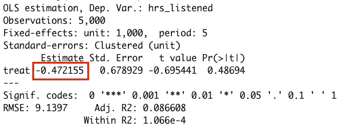

# 揭示传统 DiD 方法的局限性

> 原文：[`towardsdatascience.com/uncovering-the-limitations-of-traditional-did-method-2f068f56d19a`](https://towardsdatascience.com/uncovering-the-limitations-of-traditional-did-method-2f068f56d19a)

## 处理多个时间周期和错开处理时间

[](https://medium.com/@nalagoz13?source=post_page-----2f068f56d19a--------------------------------)[](https://towardsdatascience.com/?source=post_page-----2f068f56d19a--------------------------------) [Nazlı Alagöz](https://medium.com/@nalagoz13?source=post_page-----2f068f56d19a--------------------------------)

·发表于[Towards Data Science](https://towardsdatascience.com/?source=post_page-----2f068f56d19a--------------------------------) ·阅读时间 11 分钟·2023 年 2 月 21 日

--


封面图，由作者使用[NightCafé](https://creator.nightcafe.studio/)生成

差分中的差分（DiD）是一种流行的统计方法，通过比较干预前后两个组的结果差异来估计观察研究中的因果影响。大多数 DiD 指南专注于经典的 DiD 设置，其中仅有两个时期和两个组（处理组和对照组）。

然而，在许多 DiD 的实际应用中，存在多个时间周期和处理时间的变化。**近期对 DiD 的研究表明，在这些情况下，DiD 可能会给出显著误导性的处理效果估计**。在某些场景下，处理效果估计可能与实际处理效果的符号相反。

**在这篇文章中，我将讨论在经典 DiD 设置中，当存在错开处理时间和多个时间周期时可能出现的重要问题**。我还会提出解决这个问题的方案。值得注意的是，虽然我将专注于 DiD 中的这一问题，但对于其他潜在挑战的更全面概述，你可以参考我之前的文章。此外，我将在本文末尾提供进一步的资源，供那些希望深入探讨 DiD 问题的人。

## 封锁与音乐消费实例

举个例子，我们考虑一个假设的场景。假设我们运营一个在多个国家运行的音乐流媒体服务。我们希望调查 Covid-19 封锁对这些国家音乐消费的影响。通过检查减少流动性的影响，我们可以深入了解听音乐是否与某些活动（如通勤）相关，而不是在家工作。

由于我们无法操控封锁的实施，因此无法进行 A/B 测试来检查其效果。因此，我们必须依赖观察性数据。在这种情况下，我们利用了数据集中包含的各国实施封锁的不同时间。在这个例子中，治疗是封锁的实施。对于这个玩具示例，我模拟了一个数据集，详细信息可以在[我的上一篇文章](https://medium.com/towards-data-science/event-studies-for-causal-inference-the-dos-and-donts-863f29ca7b65)和[这个 Gist](https://gist.github.com/nazlialagoz/b66b15b295029029bca9162d1df00cef)中找到。所有分析代码也可以在[这个 Gist](https://gist.github.com/nazlialagoz/85d0713f157ffeacdc71b581a0da07d0)中找到。

```py
rm(list = ls())
library(data.table) # Fast data frames
library(fastDummies) # Create dummy variables
library(fixest) # Fixed-effects regression
library(kableExtra) # Make nice tables
library(bacondecomp) # Goodman-Bacon Decomposition
library(did) # Difference-in-differences package by Callaway & Sant'Anna
source('sim_data.R') # Import data simulation functions and utilities

data <- sim_data() # Simulate the dataset

# EDA and Analysis --------------------------------------------------------
select_cols <- c('unit', 'period', 'cohort_period','treat','hrs_listened')

kable(head(data[, ..select_cols]), 'simple')
```


选定列的数据快照，图片由作者提供。

我们有 1000 个单位或客户的数据，涵盖他们被观察到的每个周期。`cohort_period`指示一个单位在哪个周期接受治疗，因此属于哪个治疗队列。当`cohort_period >= period`时，单位被视为接受治疗（`treat = 1`）。`hrs_listened`是我们关注的结果，表示总音乐消费（小时）。数据集中有两个队列：早期治疗队列和晚期治疗队列。早期队列在第 2 周期接受治疗，晚期队列在第 3 周期接受治疗。总共有五个周期，从第 0 周期开始，到第 4 周期结束。

由于我们拥有一个观察性数据集，其中治疗不是随机分配的，因此不能使用简单的均值差异方法来估计治疗效果。相反，我们的目标是将治疗效果与客户和季节相关因素区分开来，为此我们使用了 DiD 框架。

在我们进入 DiD 之前，虽然在现实应用中这并不可能，但在这个模拟数据集中，我知道每个治疗队列和周期的真实治疗效果。如下图所示，这些效果将在下一步评估估计的治疗效果时是必要的。


每个队列和周期的真实治疗效果，图片由作者提供。

从这张图表中可以看出，两个队列在所有时期的真实处理效果都是正的。两个队列的处理效果随时间增加。然而，总体而言，与队列 3 相比，队列 2 在处理时期的处理效果更大且增加显著。因此，不同处理队列和时期之间存在处理效果的异质性。

# 经典 DiD

假设我们没有意识到多期和错开的处理可能在使用经典 DiD 方法时导致误导性估计。因此，我们天真地决定使用经典 DiD 设置来考虑听力模式的季节性和我们观察数据集中的客户特定效应。我们使用这样的 DiD 设置 [1]：


经典 DiD，图片由作者提供。

*Y*ᵢₜ 是关注的结果。αᵢ 是单位固定效应，用于控制时间不变的单位特征。γₜ 是时间固定效应，用于控制时间趋势或季节性。D*ᵢₜ* 是单位 *i* 在时间 *t* 的处理虚拟变量。ϵᵢₜ 是随机误差。关注的系数 βᵈᵈ 表示处理效果。

我们使用 R 中的经典 DiD 设置来估计处理效果：

```py
formula <- as.formula('hrs_listened ~ treat')
canonical_did <- feols(formula,
                       data = data, panel.id = "unit",
                       fixef = c("unit", "period"), cluster = "unit")
summary(canonical_did) 
```



经典 DiD 估计，图片由作者提供。

估计的处理效果是 -0.47（虽然统计上不显著）！但当我们对每个处理组和时期都有正的（且通常较大的）处理效果时，这怎么可能呢？**原因在于 DiD 估计量是数据中所有可能的两组/两期 DiD 估计量的加权平均** [2]。换句话说，经典 DiD 估计可以分解为加权平均的两组 x 两期处理估计。这被称为**Goodman-Bacon 分解**。我们来使用‘bacondecomp’ 包 [2] 获取计算经典 DiD 估计所用的权重和估计值：

```py
 # Goodman-Bacon Decomposition
bacon_decomp <- bacon(formula, data, id_var="unit", time_var='period', quietly = F)
```


Goodman-Bacon 分解，图片由作者提供。

在上面的图像中，我展示了我们的经典 DiD 估计的 Goodman-Bacon 分解。确实，如果我们将这些估计值按其各自的权重相加，就会得到经典 DiD 估计的处理效果：0.5 x -4.53 + 0.5 x 3.59 = -0.47。由于我们有 2 个组和 2 个时期，其中处理指示符发生变化，我们有 2 个比较。

让我们详细检查这个表格，看看问题在哪里。我们从第二个比较开始，其中处理估计为 3.59。在这里，对照组（‘未处理’）是晚处理组，队列 3。‘处理’组是早处理组，队列 2。我将‘处理’和‘未处理’放在引号中，因为如你所记，数据集中所有组最终都会被处理。在这里，‘处理’和‘未处理’更准确地说指的是经典 DiD 估计器所使用的**处理**和**对照**组。

让我们继续讨论第一个用红色突出显示的比较，其估计值为-4.53。**在这里，早期治疗组（队列 2）被用作晚期治疗组的控制组，这由标准估计器提供**！这个比较没有多大意义。然而，如果治疗效果在各个队列和时期之间保持不变，一切都会正常。在这个应用中以及许多其他应用中，情况并非如此。由于早期治疗组的治疗效果更高并且动态增加，比较起来似乎晚期治疗组的治疗效果是负的！**将早期治疗组用作晚期治疗组控制组的比较称为禁止比较**[2]。

# 如何解决这个问题？

解决这个问题的主要方法是不要将治疗效果限制为单一估计，并仔细选择控制组。在接下来的步骤中，我们将看到如何做到这一点。首先，我将展示如何在没有特定 DiD 包的情况下解决这个问题。随后，我将使用专为多时间期设计的 R 包。

## 解决不依赖于特定 DiD 包的问题

首先，让我们解决这个问题，而不依赖于特定的 DiD 包。我知道为了获得治疗效果的良好估计，我需要做两件事：**（1）不将治疗效果估计限制为单一系数，（2）确保我有一个好的控制组**[3][4]。

本质上，有必要考虑不同队列和时期的治疗效果的变化。此外，确保每个被评估的时期都有未治疗的观察数据也至关重要。因为使用治疗过的观察数据作为控制组可能会导致显著误导的结果，正如之前所提到的那样。

正如你记得的那样，我的数据集中只有治疗组：在第二期接受治疗的队列（早期治疗组）和在第三期接受治疗的队列（晚期治疗组）。显然，由于没有尚未治疗的观察数据可以作为对照组，我无法估计晚期治疗队列的任何治疗效果。

早期治疗组的希望更大，因为在他们接受治疗时，晚期治疗组尚未接受治疗。这意味着我们可以在第二期对早期治疗队列估计治疗效果。然而，由于从第三期开始没有未治疗的观察数据，我们无法估计进一步时期的治疗效果。这就是为什么我们将剔除没有未治疗单位的时期。让我们来编码实现这一点。

```py
# Drop periods that have no untreated units
data <- data[period < 3]
```

现在，是时候估计我们唯一可以估计的治疗效果了。我们将只对第二期的早期治疗组估计治疗效果。

```py
# Create dummy variables
data <- data %>% 
  dummy_cols(select_columns = c("cohort_period", "period"))

interact_covs <- 'cohort_period_2:period_2'

# Regression
formula <- as.formula(paste0('hrs_listened ~ ',interact_covs))
model <- feols(formula,
               data = data, panel.id = "unit",
               fixef = c("unit", "period"), cluster = "unit")
summary(model) 
```


在考虑了错位治疗后的回归结果，图片由作者提供。

从上述结果可以看出，估计的处理效果这次要合理得多：3.6。这意味着封锁措施导致该队列在这个时期的音乐消费增加了 3.6 小时。点估计值与真实处理效果（大约 4 小时）不完全相等，因为数据中存在噪声。

## 使用‘did’包来解决问题

作为手动处理所有事情的替代方案，我们可以使用[**did**](https://bcallaway11.github.io/did/index.html) [Callaway 和 Sant’Anna 的包](https://bcallaway11.github.io/did/index.html) [3]。我们需要做的是使用`att_gt`函数，利用正确的控制组来估计队列和时期层面的处理效果。下面给出了代码。这里需要注意的一点是，你需要将`control_group`指定为`'notyettreated'`，因为该函数默认会尝试找到一个未处理的组作为控制组。

```py
# did package
out <- att_gt(yname = "hrs_listened",
              gname = "cohort_period",
              idname = "unit",
              tname = "period",
              xformla = ~1,
              data = data,
              est_method = "reg",
              control_group = 'notyettreated'
)
out
```


打包结果，图像由作者提供。

`att_gt`函数估计队列-时期特定的处理效果，即`ATT(g,t)`。我们对第 2 队列第 2 时期的处理效果感兴趣，结果为 3.4 小时。这与我们在没有依赖这个包的情况下估计的处理效果几乎相同。由于估计的精确过程，估计值之间可能会有一些差异。处理前时期的‘处理效果’也在第一行中报告，这在统计上并不显著，因为在这种情况下，我知道干预之前结果变量没有系统性变化。我们还可以用一行代码将这些结果绘制成图：

```py
ggdid(out) # graph the results
```


可视化打包结果，图像由作者提供。

这个图表也有助于检查处理前后随时间的趋势。这种可视化在估计许多队列和时期的处理效果时特别有用，尽管在这种情况下我只有一个队列和两个时期可以进行估计。

使用这个包相比于我的手动方法有额外的优点。只要你为`att_gt`函数指定了所需的变量，你不需要做太多其他的操作。你甚至不需要删除没有未处理观察的时期，因为这个包已经考虑了这一点，并且只对有有效控制组的时期进行效果估计。另一个优点是，包默认报告考虑了多重假设检验的均匀置信区间（这会导致由于使用了更高的临界值而使置信带变宽）。两个方法之间的精确估计差异是由于精确的估计方法不完全相同。

回到我们的例子，我们看到封锁对音乐消费有积极的影响（尽管我们只能对一个群体在一个时期进行估计）。这表明实际上音乐听取与居家隔离是互补的。

## 结论

这里是本文的关键要点：

+   经典的 DiD 方法在存在多个时间周期和治疗时间变化的应用中可能会导致误导性的估计。

+   为了防止这个问题，可以使用考虑多个时间周期和治疗时间变化的估计量。

+   这些估计量适用于错开处理背景，因为它们允许灵活的处理效果，并且仅估计存在有效对照组的时期的处理效果。

+   这不是进行 DiD 分析时可能出现的唯一问题。有关其他问题，[请参阅我之前关于事件研究的文章](https://medium.com/towards-data-science/event-studies-for-causal-inference-the-dos-and-donts-863f29ca7b65)。

## *参考文献*

[1] Angrist, J. D., & Pischke, J. S. (2009). [*大多数无害的计量经济学：经验主义者的伴侣*](https://www.mostlyharmlesseconometrics.com/). 普林斯顿大学出版社。

[2] Goodman-Bacon, Andrew. (2021) “[具有治疗时间变化的差分中的差分](https://www.nber.org/papers/w25018).” *计量经济学期刊* 225.2: 254–277.

[3] Callaway, B., & Sant’Anna, P. H. (2021). [具有多个时间周期的差分中的差分](https://doi.org/10.1016/j.jeconom.2020.12.001). *计量经济学期刊*, *225*(2), 200–230.

[4] Wooldridge, J. M. (2021). [双向固定效应、双向 Mundlak 回归和差分中的差分估计量](https://papers.ssrn.com/sol3/papers.cfm?abstract_id=3906345). *可在 SSRN 3906345 获取*.

## 其他有用的 DiD 资源

***视频：***

[Pedro H.C. Sant’Anna — “具有多个时间周期的差分中的差分”](https://www.youtube.com/watch?v=VLviaylakAo&t=62s)

[Andrew Goodman-Bacon “具有治疗时间变化的差分中的差分”](https://www.youtube.com/watch?v=m1xSMNTKoMs)

***一篇总结近期 DiD 文献的好论文：***

Roth, J., Sant’Anna, P. H., Bilinski, A., & Poe, J. (2022). [差分中的差分的趋势是什么？近期计量经济学文献的综述](https://arxiv.org/abs/2201.01194). *arXiv 预印本 arXiv:2201.01194*.

[***许多与 DiD 相关的资源汇编。***](https://asjadnaqvi.github.io/DiD/docs/02_R/)

# 感谢阅读！

*如果你喜欢这篇文章并希望看到更多我的文章，可以* [*关注我*](https://medium.com/@nalagoz13)*。*

***免责声明****：我写作是为了学习，因此你可能会发现文章或代码中的错误。如果发现，请告知我。*
