# 揭示 DAX 中 KEEPFILTERS 的秘密

> 原文：[`towardsdatascience.com/uncovering-the-secrets-of-kepfilters-in-dax-6d268e3565d0`](https://towardsdatascience.com/uncovering-the-secrets-of-kepfilters-in-dax-6d268e3565d0)

## *DAX 中的 KEEPFILTERS()函数是一个被低估的函数。因此，我决定深入研究这个函数，并为你提供一些有趣的细节以及一个惊人的效果。*

[](https://medium.com/@salvatorecagliari?source=post_page-----6d268e3565d0--------------------------------)[](https://towardsdatascience.com/?source=post_page-----6d268e3565d0--------------------------------) [Salvatore Cagliari](https://medium.com/@salvatorecagliari?source=post_page-----6d268e3565d0--------------------------------)

·发布在[Towards Data Science](https://towardsdatascience.com/?source=post_page-----6d268e3565d0--------------------------------) ·8 分钟阅读·2023 年 7 月 13 日

--


照片由[Ian Tuck](https://unsplash.com/@iantuck?utm_source=medium&utm_medium=referral)拍摄，刊登于[Unsplash](https://unsplash.com/?utm_source=medium&utm_medium=referral)

# 引言

当我们在 DAX 中使用 CALCULATE()函数时，我们通常会添加这样一个简单的筛选器：

产品[Color] = “绿色”

此筛选器用“绿色”值替换[Color]列上的任何现有筛选器。

但有时，我们需要额外一步，保留表格或列上的现有筛选器，以执行一些有趣的计算。

有时，我们的度量值会得到错误的结果，我们无法理解为何会发生这种情况。

在这些情况下，[KEEPFILTERS()](https://dax.guide/keepfilters/)函数可以帮助我们。

# 源查询

首先，让我们定义我们想要操作的查询。

我想获取按颜色分类的在线销售列表：

```py
DEFINE
  MEASURE 'All Measures'[Online Sales] = SUMX('Online Sales', [UnitPrice]*[SalesQuantity])

 EVALUATE
     SUMMARIZECOLUMNS('Product'[Color]
                      ,"Online Sales", [Online Sales]
                      )
```

我使用 SUMX 将[UnitPrice]乘以[SalesQuantity]。

结果如下：

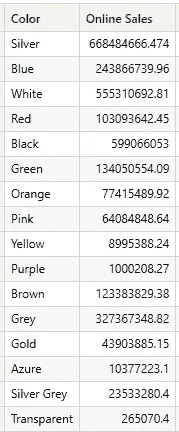

图 1 — 基础结果（作者图）

当我添加筛选器并使用 CALCULATE()时，查询如下所示，如上所述。

```py
// Only Green Sales
DEFINE
  MEASURE 'All Measures'[Online Sales] = SUMX('Online Sales', [UnitPrice]*[SalesQuantity])

  MEASURE 'All Measures'[All Green Sales] =
                 CALCULATE([Online Sales] 
                            ,'Product'[Color] = "Green"
                            )

EVALUATE
  SUMMARIZECOLUMNS('Product'[Color]
                    ,"Online Sales", [Online Sales]
                    ,"Green Sales", [All Green Sales]
                    )
```

结果如下：

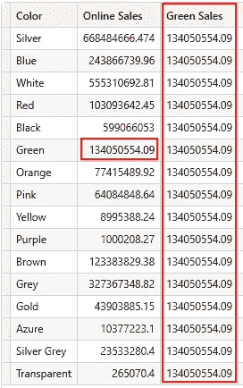

图 2 — 所有行的绿色销售（作者图）

这是因为我们将[Color]列上的筛选器替换为“绿色”。因此，度量值在所有行上返回相同的值，其中[Color] = “绿色”。

# 介绍 KEEPFILTERS()

好吧，我们可以用 KEEPFILTER()做些什么？

当我们在度量值中添加 KEEPMFILTERS()时，CALCULATE 将保留每行的筛选上下文，并在表达式中添加筛选器：

```py
// Only Green Sales with KEEPFILTERS()
DEFINE
  MEASURE 'All Measures'[Online Sales] = SUMX('Online Sales', [UnitPrice]*[SalesQuantity])

  MEASURE 'All Measures'[All Green Sales] =
                CALCULATE([Online Sales] 
                          ,KEEPFILTERS('Product'[Color] = "Green" )
                          )

EVALUATE
    SUMMARIZECOLUMNS('Product'[Color]
                    ,"Online Sales", [Online Sales]
                    ,"Green Sales", [All Green Sales]
                    )
```

这是新的结果：

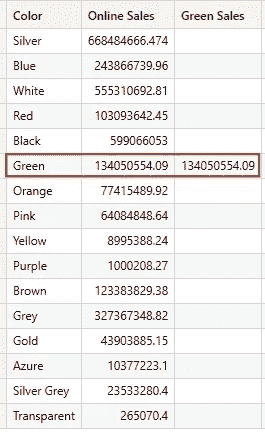

图 3 — 使用 KEEPFILTERS() 的绿色销售（作者绘制的图）

好的，很棒。

那现在呢？

# 时尚

现在我们可以向我们的测量中添加一些逻辑。例如，我们可以仅对绿色产品进行销售计算。

例如，我们将绿色产品的销售额加倍：

```py
// Perform some dynamic calculations - Double the Green Sales
DEFINE
  MEASURE 'All Measures'[Online Sales] = SUMX('Online Sales', [UnitPrice]*[SalesQuantity])

  MEASURE 'All Measures'[All Green Sales] =
              CALCULATE([Online Sales] 
                        ,KEEPFILTERS('Product'[Color] = "Green" )
                        )

 EVALUATE
  SUMMARIZECOLUMNS('Product'[Color]
                    ,"Online Sales", [Online Sales]
                    ,"Green Sales", [All Green Sales]
                    ,"Dynamic Sales", IF(ISBLANK([All Green Sales])
                                        ,[Online Sales]
                                        ,[Online Sales] * 2
                                        )
                    )
```

我使用[IF()](https://dax.guide/if/)和[ISBLANK()](https://dax.guide/isblank/)来检查销售是否为绿色产品。

如果绿色销售的测量结果为空，我将返回[在线销售]测量的结果。

如果没有，我将[在线销售]测量的结果加倍。

看看结果：

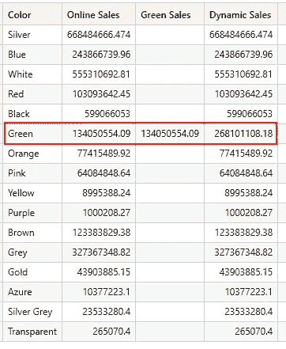

图 4 — 动态销售结果（作者绘制的图）

但我们如何在 Power BI 中使用这个机制呢？

例如，我希望能够选择一种颜色，并对这种颜色的销售进行特定的计算。

首先，我向数据模型中添加了一个新表，但没有在数据模型中添加任何新的关系：

```py
All Colors = SUMMARIZECOLUMNS('Product'[Color])
```

表格如下所示：

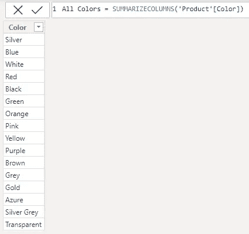

图 5 — 所有颜色表（作者绘制的图）

现在，我将这个列添加到我的报告中的切片器中。

接下来，我的测量必须获取选择的颜色并将其作为筛选器添加：

```py
Modify by selected color =
VAR SelectedColor = SELECTEDVALUE('All Colors'[Color])

VAR CalcByColor = CALCULATE([Online Sales (By Order Date)]
                            ,KEEPFILTERS('Product'[Color] = SelectedColor)
                            )

RETURN
IF(ISBLANK(CalcByColor)
    ,[Online Sales (By Order Date)]
    ,[Online Sales (By Order Date)] * 2
    )
```

这样，我可以根据新表中选择的颜色执行计算：

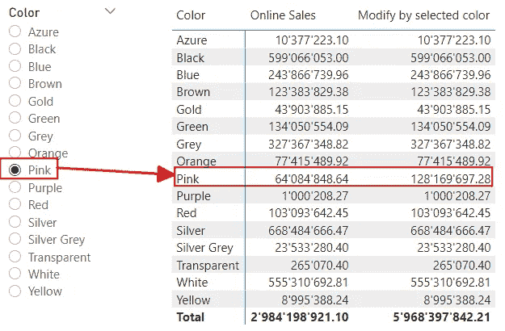

图 6 — 基于选择颜色的计算结果（作者绘制的图）

这种技术为我们的计算开辟了许多可能性，因为我们可以对某一行进行计算而不影响其他行的结果。

# 使用上下文转换

但在某些情况下，理解 KEEPFILTER() 的值是至关重要的：上下文转换。

你可以通过阅读我关于这个话题的文章来了解更多关于上下文转换的内容：

[](/whats-fancy-about-context-transition-in-dax-efb5d5bc4c01?source=post_page-----6d268e3565d0--------------------------------) ## DAX 中上下文转换的时尚之处

### 行和筛选上下文是 DAX 中的常见概念。但我们可以通过上下文转换在这两者之间切换。

[towardsdatascience.com

当我们在测量中使用上下文转换与所谓的任意形状集一起时，情况会很复杂（稍后会详细说明）。

为了展示这一点，我稍微修改了我们的例子：

我想创建一个切片器，通过品牌和颜色的所有组合来筛选产品表。

然后，我想计算每个品牌和颜色的平均销售额。

在这个例子中，我不使用产品表中的列。我想要一个单独的表来模拟实际场景。

为了实现这一点，我使用 Power Query 从原始产品表中提取一个表，获取所有品牌和所有颜色的列表。此外，我添加了一个包含品牌和颜色列组合的关键列。

这里是结果表的摘录：

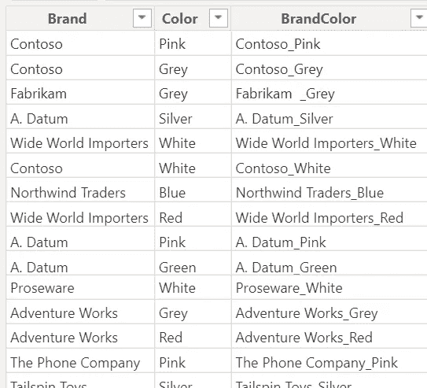

图 7 — 带有品牌和颜色及关键列的表格（图示由作者提供）

我将相同的关键列添加到产品表中。

现在我可以在这两张表之间添加一个关系：

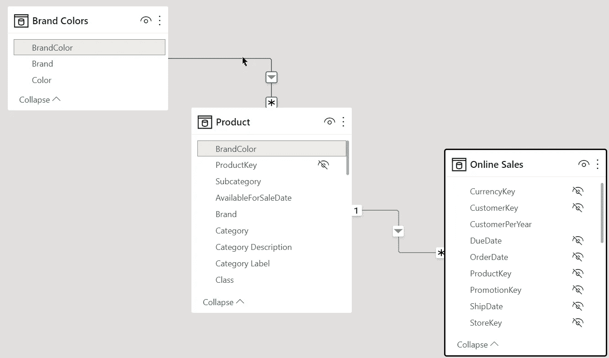

图 8 — 扩展的数据模型（图示由作者提供）

现在，我创建了以下度量：

```py
Average over Brand = AVERAGEX(VALUES('Brand Colors'[Brand])
                                ,[Online Sales (By Order Date)]
                                )
```

但是当我们尝试验证结果时，我们会遇到困难。

原因在于没有任何控制结果时很难理解结果是否正确。

所以我们要么在 Excel 中重新计算结果（或其他可能的地方），要么更改度量以使用 SUMX()。

这使得生活更轻松，因为我们将能够将结果与现有的在线销售度量进行比较。

这里是 Power BI 中的结果：

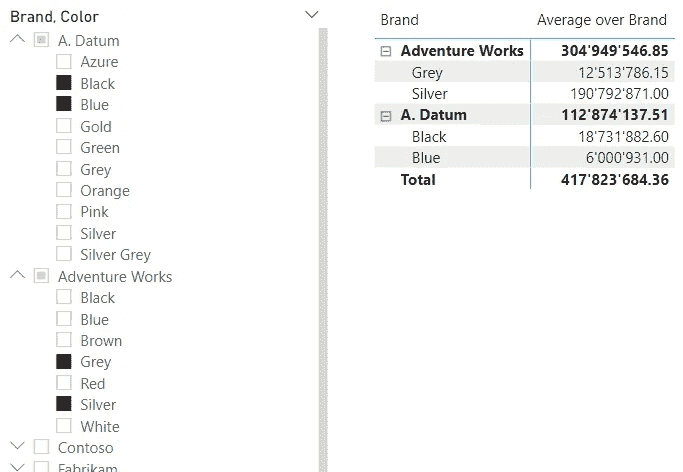

图 9 — 复杂过滤器的新度量结果（图示由作者提供）

如果你仔细查看结果，会发现有些问题。

小计和总计远高于每行结果的总和。

原因在于过滤器的应用方式。

对于这个表，我们期望有如下的过滤器：

```py
(Brand = "A. Datum" AND Color IN ("Black", "Blue")
OR
(Brand = "Adventure Works" AND Color IN ("Grey", "Silver")
```

这样的集合被称为“任意形状的集合”，因为我们混合了来自两个独立列的不同值。

当我们查看每个小计时，我们会期望有两个过滤器：

对于 Adventure Works，我们期望如下：

```py
Brand = "Adventure Works" AND Color IN ("Grey", "Silver")
```

对于 A. Datum，我们期望：

```py
Brand = "A. Datum" AND Color IN ("Black", "Blue")
```

实际上，我们得到了两个完全不同的过滤器：

对于 Adventure Works 的小计，我们有如下过滤器：

```py
Brand IN ("Adventure Works", "A. Datum") AND Color IN ("Grey", "Silver")
```

对于 A. Datum 的小计，我们有如下过滤器：

```py
Brand IN ("Adventure Works", "A. Datum") AND Color IN ("Black", "Blue")
```

这意味着度量计算所选颜色的所有销售总和，但结果中包括了两个选定品牌。

当我们添加新的矩阵可视化并从产品表中添加品牌和颜色列，并将结果与标准在线销售度量进行比较时，我们可以证明存在一些奇怪的情况：

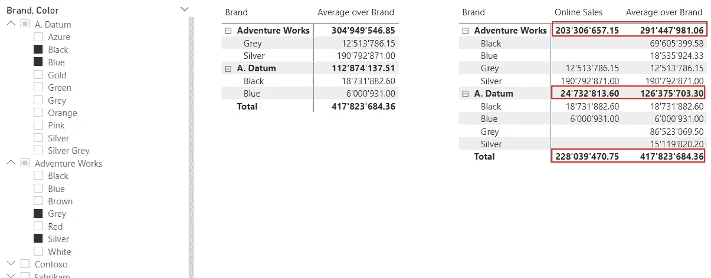

图 10 — 用基础度量验证结果（图示由作者提供）

如你所见，这两个示例之间的结果不同，这使得这一效果极其令人困惑。

目前应用的过滤器如下：

```py
(Brand = "A. Datum" AND Color IN ("Black", "Blue", "Grey", "Silver"))
 OR
(Brand = "Adventure Works" AND Color IN ("Black", "Blue", "Grey", "Silver"))
```

参考文献部分提到的 SQLBI 文章更详细地解释了这一效果。

为了解决这个问题，我们可以使用 KEEPFILTERS() 来强制从切片器中获取完整的过滤上下文：

```py
Average over Brand = SUMX(KEEPFILTERS(
  VALUES('Brand Colors'[Brand]))
          ,[Online Sales (By Order Date)]
          )
```

现在结果如预期一样：

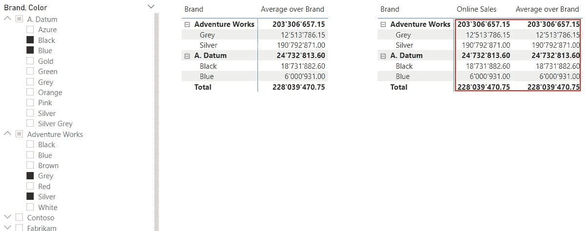

图 11 — 添加 KEEPFILTERS() 后的结果（图示由作者提供）


照片由 [Akhilesh Sharma](https://unsplash.com/@fotonium?utm_source=medium&utm_medium=referral) 在 [Unsplash](https://unsplash.com/?utm_source=medium&utm_medium=referral) 上提供

# 结论

DAX 函数 KEEPFILTERS() 非常有用，有时是关键功能。

我并不是建议在使用上下文转换时总是使用 KEEPFILTER()。

但您需要意识到使用上下文转换的后果，以及用户在报告中使用切片器时创建任意形状集的可能性。

在撰写本文时，我不知道使用上下文转换添加 KEEPCFILTERS()是否有任何缺点。

但我喜欢保持简单，不必要的东西就不添加。

无论如何，这篇文章最重要的教训应该是“只相信您可以证明和验证的结果”。

有一些函数在验证时可能非常具有挑战性。其中两个是 AVERAGE 和 COUNTDISTINCT。这两个函数返回的结果可能难以证明。

但这是另一个故事。

# 参考资料

SQLBI 的 KEEPCFILTERS()介绍：[`www.sqlbi.com/articles/using-keepfilters-in-dax-updated/`](https://www.sqlbi.com/articles/using-keepfilters-in-dax-updated/)

阅读 SQLBI 撰写的这篇文章，了解一些有趣的细节：[`www.sqlbi.com/articles/keepfilters-a-new-dax-feature-to-correctly-compute-over-arbitrary-shaped-sets/`](https://www.sqlbi.com/articles/keepfilters-a-new-dax-feature-to-correctly-compute-over-arbitrary-shaped-sets/)

当我们使用迭代器时，我们使用上下文转换。这里有另一篇 SQLBI 文章，关于这个话题：[`www.sqlbi.com/articles/when-to-use-keepfilters-over-iterators/`](https://www.sqlbi.com/articles/when-to-use-keepfilters-over-iterators/)

我使用了 Contoso 样本数据集，就像在我之前的文章中一样。您可以从 Microsoft [这里](https://www.microsoft.com/en-us/download/details.aspx?id=18279)免费下载 ContosoRetailDW 数据集。

Contoso 数据可以根据 MIT 许可自由使用，详见[这里](https://github.com/microsoft/Power-BI-Embedded-Contoso-Sales-Demo)。

[](https://medium.com/@salvatorecagliari/subscribe?source=post_page-----6d268e3565d0--------------------------------) [## 每当 Salvatore Cagliari 发布新内容时，您将收到电子邮件。

### 每当 Salvatore Cagliari 发布新内容时，您将收到电子邮件。通过注册，如果您还没有，您将创建一个 Medium 帐户…

medium.com](https://medium.com/@salvatorecagliari/subscribe?source=post_page-----6d268e3565d0--------------------------------)
