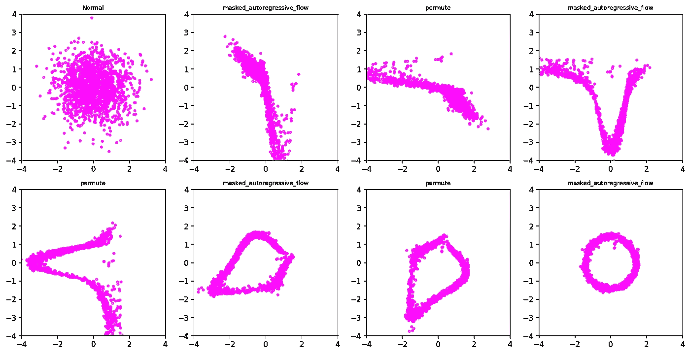

# 理解与实现带掩码的自回归流与 TensorFlow

> 原文：[`towardsdatascience.com/understand-implement-masked-autoregressive-flow-with-tensorflow-9c361cd1354c?source=collection_archive---------11-----------------------#2023-02-21`](https://towardsdatascience.com/understand-implement-masked-autoregressive-flow-with-tensorflow-9c361cd1354c?source=collection_archive---------11-----------------------#2023-02-21)

## 基于流的密度估计模型与 TensorFlow

 [Saptashwa Bhattacharyya](https://saptashwa.medium.com/?source=post_page-----9c361cd1354c--------------------------------)

·

[关注](https://medium.com/m/signin?actionUrl=https%3A%2F%2Fmedium.com%2F_%2Fsubscribe%2Fuser%2F9a3c3c477239&operation=register&redirect=https%3A%2F%2Ftowardsdatascience.com%2Funderstand-implement-masked-autoregressive-flow-with-tensorflow-9c361cd1354c&user=Saptashwa+Bhattacharyya&userId=9a3c3c477239&source=post_page-9a3c3c477239----9c361cd1354c---------------------post_header-----------) 发布于 [Towards Data Science](https://towardsdatascience.com/?source=post_page-----9c361cd1354c--------------------------------) ·8 min 阅读·2023 年 2 月 21 日

--

图：从随机到非随机！来源：作者的笔记本（请参见下方参考文献）。

之前我们详细探讨了标准化流的数学原理以及一些转化概率分布的例子。在这里，我们将这些概念结合起来，以了解自回归流及如何使用 TensorFlow Probability 库实现它们。你可以从这篇文章中期待 —

1.  为什么三角矩阵对自回归流至关重要？

1.  基于自回归流模型的基本构建

— 掩蔽自回归流 (MAF)

— 逆自回归流 (IAF)

3. 如何在 TensorFlow 中实现 MAF 并进行密度估计任务的训练？

不拖延，开始吧！

## 标准化流中的计算问题：

在讨论像掩蔽自回归流等模型之前，我们将回顾 1D 和更高维场景的变量变换规则，这将帮助我们理解标准化流中的计算成本。

之前我们[详细讨论了](https://medium.com/towards-data-science/getting-started-with-normalizing-flows-linear-algebra-probability-f2b863ff427d)变量变换规则，我们从基础分布 *u* 开始……
