# 理解并实现带掩码的自回归流与 TensorFlow

> 原文：[`towardsdatascience.com/understand-implement-masked-autoregressive-flow-with-tensorflow-9c361cd1354c`](https://towardsdatascience.com/understand-implement-masked-autoregressive-flow-with-tensorflow-9c361cd1354c)

## 使用 TensorFlow 进行密度估计的流模型

[](https://saptashwa.medium.com/?source=post_page-----9c361cd1354c--------------------------------)[](https://towardsdatascience.com/?source=post_page-----9c361cd1354c--------------------------------) [Saptashwa Bhattacharyya](https://saptashwa.medium.com/?source=post_page-----9c361cd1354c--------------------------------)

·发表于[Towards Data Science](https://towardsdatascience.com/?source=post_page-----9c361cd1354c--------------------------------) ·8 分钟阅读·2023 年 2 月 21 日

--


图：从随机到不那么随机！来源：作者笔记本（见下文参考文献）。

之前我们详细介绍了正常化流背后的数学以及一些变换概率分布的示例。在这里，我们结合所有这些概念来理解自回归流以及如何使用 TensorFlow Probability 库实现它们。您可以从这篇文章中期待什么 —

1.  为什么三角矩阵对自回归流至关重要？

1.  自回归流模型的基本构造

— 掩码自回归流（MAF）

— 反向自回归流（IAF）

3\. 如何在 TensorFlow 中实现 MAF 并训练它们以进行密度估计任务？

不再耽搁，让我们开始吧！

## 正常化流中的计算问题：

在讨论诸如掩码自回归流等模型之前，我们回顾一维和更高维场景中的变量变换规则，这将帮助我们理解正常化流中的计算成本。

之前我们[详细讨论了](https://medium.com/towards-data-science/getting-started-with-normalizing-flows-linear-algebra-probability-f2b863ff427d)如何推导变量变换规则，其中我们从基础分布 *u* 和双射 *ϕ* 开始，使得 *x* = *ϕ*(*u*)。在这种情况下，我们可以简单地写出变量变换规则如下：

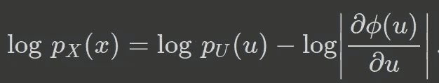

等式 1：一维的变量变换规则

对于归一化流，我们组合（‘链式’）几个双射，将简单分布转变为更复杂的分布。例如，我们可以如下组合 *K* 次双射操作，将我们的基础分布（如 *u_0*）转换为我们所需的复杂分布 *x*。

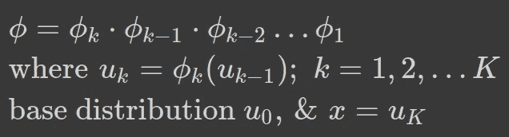

方程 2：组合双射以将简单分布转变为复杂分布。

对于 *K* 变换，我们可以如下修改方程 1：

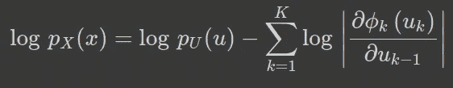

方程 3：将方程 1 从 1 次双射操作重写为 K 次变换。

实现归一化流的最大问题之一是计算对数-行列式雅可比矩阵的计算复杂度。**通过像高斯消去这样的过程计算 *n*×*n* 的雅可比矩阵的行列式具有** [**运行时间复杂度**](https://en.wikipedia.org/wiki/Gaussian_elimination#Computing_determinants) **为 O(*n³*)。**

因此，我们需要对上述过程进行一些简化，现在可以开始学习一些有助于减少计算复杂度的简化方法。

## 三角矩阵与自回归流：

如果变换矩阵是三角形的，那么计算行列式相当容易。对于 *n × n* 的方阵，运行时间复杂度是 *O(n)*。

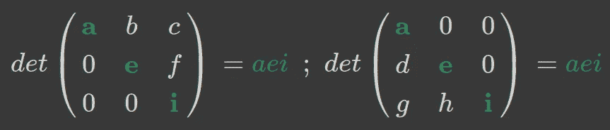

计算三角矩阵的行列式只需要对角元素。

如上所示，对于三角矩阵（上三角/下三角），我们只需要对角元素来计算行列式，因此运行时间复杂度是线性的。

让我们考虑下三角矩阵，其中 *a[i][j]*=0; *j* > *i*。我们在自回归流中施加了非常类似的概念。

我们考虑一个 *D* 维向量 *u*，它经过 1,2,…*K* 次变换，就像以前一样。基于流模型的思想是使用一个（或一系列）变换 *ϕ* 对从 p_u(u) 采样得到的实际向量 *u* 进行操作。在[双射与微分同胚](https://medium.com/towards-data-science/getting-started-with-normalizing-flows-linear-algebra-probability-f2b863ff427d)的基础知识中，我们讨论了当 *u 作为 D 维向量通过 K 次微分同胚变换为 x 时，我们说基础分布是 D 维的，最终分布 (x) 也将是。这样，我们施加了自回归条件，以便获得一个三角矩阵来计算对数-行列式雅可比矩阵，如下所示：*

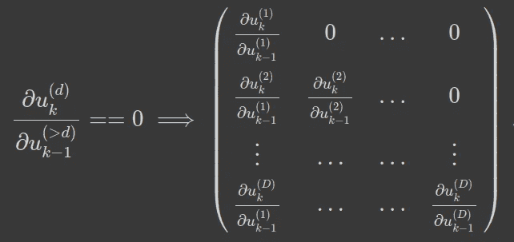

方程 4：自回归条件（左侧的方程）产生一个三角形的对数-行列式雅可比矩阵。

如果你曾经使用过 ARIMA 模型进行时间序列分析，那么你会知道 *自回归* 项表明时间序列基于过去的值。因此，我们可以约束序列数据 [*x*1, *x*2, …, *xD*]，其中每个输出（在特定步骤）仅依赖于之前观察到的值，而不是未来的值。用更数学化的符号表示，就是观察 *xi* 的概率以 *x1*,…,*xi*−1 为条件，这些条件概率的乘积给出观察完整序列的概率：

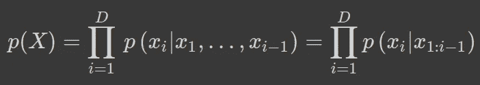

Eq. 5: 条件概率的乘积给出观察完整数据 X 的概率。

条件密度的建模由我们选择，已经提出了多种方案，从简单的单变量高斯分布到甚至神经网络。让我们讨论一些流行的方法！

## Masked Autoregressive Flow (MAF):

对于 MAF，上述 Eq. 5 中描述的条件分布将被视为简单的正态分布，如下所示：

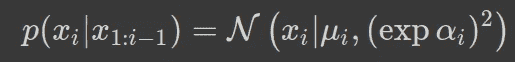

Eq. 6: Eq. 5 中的条件分布假设为简单高斯分布

也可以从基础分布 *u* 生成新数据，如下所示：

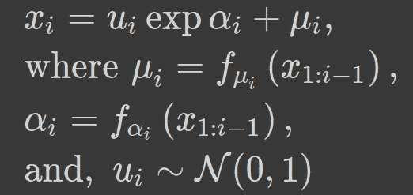

Eq. 7: 给定基础分布 (u) 生成新点，即一组随机数

上述方程告诉我们另一个将自回归模型视为从随机数空间 (*u*) 到数据 *x* 的变换 *f* 的方法。由于这些变换是仿射的（缩放和偏移），为了找回基础变量 *u_i*，我们不需要逆转这些函数。这也在 MADE 论文中提到：

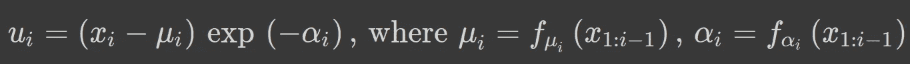

Eq. 8: 从 Eq. 7 中的变换中反转回基础变量。

**这对训练策略极为重要，因为我们不需要显式计算函数 *f_αi*、*f_μi* 的逆，只需对它们进行一次评估（例如，在前向传递时），我们可以使用不可逆的函数，如 RELU。**

在 [*Eric Jang 的博客*](https://blog.evjang.com/2018/01/nf2.html) 中提供了 MAF 的前向传递（以及反向传递）的优秀图示（查看参考文献）。

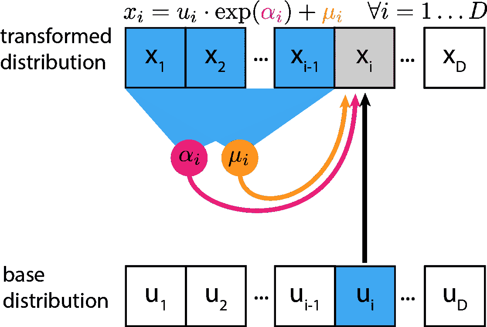

图 2: MAF 的前向传递。来源: [Eric Jang 的精彩博客](https://blog.evjang.com/2018/01/nf2.html) 关于归一化流。

这些是 [Masked AutoRegressive Flow for Density Estimation](https://arxiv.org/pdf/1705.07057.pdf) 论文的基础，希望这个归一化流系列能帮助你解读其中的大部分内容。

## Inverse Autoregressive Flow (IAF):

IAF 的变换规则在[MAF](https://arxiv.org/pdf/1705.07057.pdf)论文中也有清晰解释。IAF 与 MAF 的主要区别在于，对于计算缩放和偏移变量（用于仿射变换），我们使用随机变量(*u*)而不是数据变量(*x*)。以下是变换规则：

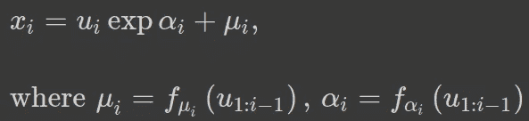

等式 9: 将其与等式 7 对比，查看 MAF 和 IAF 之间的差异

MAF 和 IAF 之间惊人的相似性是难以忽视的；IAF 的逆是 MAF 的前向传播！

## 使用 TensorFlow Probability 训练 MAF：

在掌握基础知识后，我们现在准备使用 TensorFlow Probability 来实现 MAF，并训练它以产生特定的分布。我们使用`sklearn.datasets`，特别是如下所示的`make_circles`数据集：

**1\. 加载数据集：**

```py
circle_dataset = datasets.make_circles(noise=0.05, factor=0.99, 
                                       random_state=1, n_samples=1600)
X_circle, Y_circle = circle_dataset
#standardize
X_circle_normed = StandardScaler().fit_transform(X_circle)
Y_circle = Y_circle.astype('bool')
X_train_c, Y_train_c = X_circle[…, 0], X_circle[…, 1]

#figure section
fig = plt.figure(figsize=(6, 4))
fig.add_subplot(111)
plt.scatter(X_train_c[Y_circle], Y_train_c[Y_circle], 
            s=10, color='blue', alpha=0.4)

plt.scatter(X_train_c[Y_circle == False], Y_train_c[Y_circle == False], 
            s=10, color='red', alpha=0.5)
plt.legend(['label: 1', 'label: 0'])
plt.show()
```

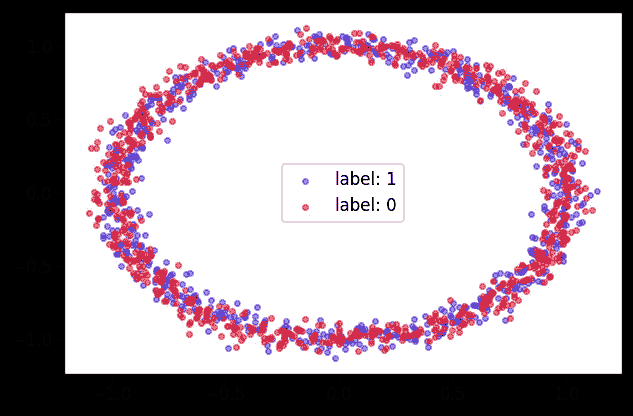

图 3: 我们的目标分布 [来源: 作者笔记本]

这将是我们的目标分布，数据点以圆形方式分布。我们的目标是从随机分布开始，通过使用 MAF 达到这种有序分布。在 TensorFlow Probability 中，实现 MAF 相当简单，因为它存在一个称为`MaskedAutoregressiveFlow`的双射器。在这个双射器中，对于仿射函数（平移和缩放），我们可以使用另一个双射器`AutoregressiveNetwork`，它实现了[Masked AutoEncoder for Density Estimation (MADE)](https://arxiv.org/abs/1502.03509)架构，作者建议这种方法是从自动编码器中一次通过得到联合概率的计算上便宜的方式。下面我们来看实现：

通过 MAF 的前向传播，基础分布为正态分布

我们从一个正态分布开始，并定义 MAF 函数，其中仿射变换由 MADE 架构定义。MADE 架构包含 2 个隐藏层，每层 32 个单元，激活函数为‘Relu’。根据前一篇文章，我们描述了如何使用`TransformedDistribution`变换分布，我们使用正态分布作为基础，MAF 作为双射器。最后，我们绘制了变换分布的概率等高线图。

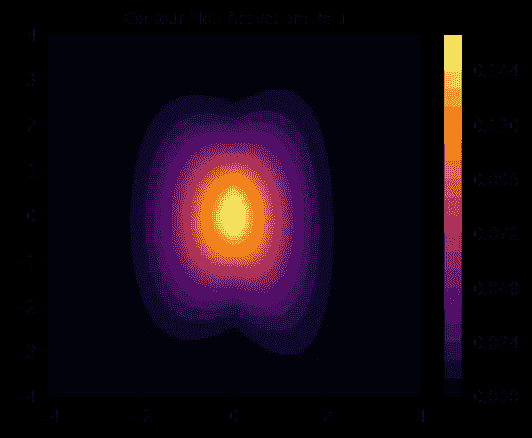

图 4: 从正态分布开始，我们将其通过 MAF，其中仿射变换由 MADE 结构提供（激活函数为 Relu）。来源: 作者笔记本

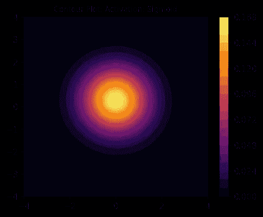

图 5: 与图 4 相同，但激活函数由 Relu 改为 sigmoid。来源: 作者笔记本。

一旦我们定义了前向传播，我们现在就可以开始训练 Flow 模型。我们在最小化负对数似然，首先从一个双射器（MAF 网络）开始训练：

仅使用双射操作（MAF）的训练循环

正如预期的那样，一旦我们绘制训练后的分布，很容易看出结果远离真实分布。我们从训练后的分布中采样，以绘制下面的图：

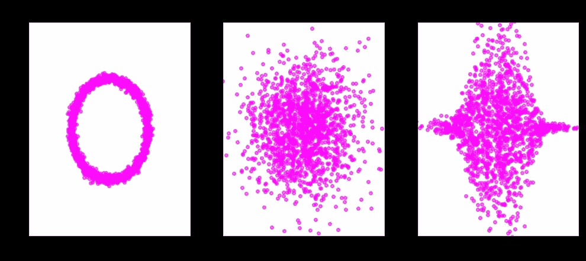

图 6：从随机分布（中间）开始，仅使用双射，我们无法复制真实分布。来源：作者的笔记本

但我们也知道，基于流的模型的思想是链式双射将简单分布转换为复杂分布。在这里，我们不再仅使用 1 个双射，而是链式使用 4 个双射（MAF），并最小化最终分布的负对数似然：

```py
num_bijectors = 4
bijectors=[]

for i in range(num_bijectors):
    masked_auto_i = make_maf(hidden_units=[128, 128], activation='relu')
    bijectors.append(masked_auto_i)
    bijectors.append(tfb.Permute(permutation=[1, 0])) 
    # data is only 2 dimension, so we interchange 0, 1 

flow_bijector = tfb.Chain(list(reversed(bijectors[:-1])))
```

排列部分确保了*D*维数据（这里*D*=2）的不同维度之间相互影响。如果维度的排序从未改变，这会大大降低在归一化流中链式双射的表达能力。在链式双射时，我们丢弃了最后的排列，因为它在训练中无关紧要（没有其他操作跟随这个排列）。有了这个更具表达力的模型，我们可以期待一些有趣的东西！让我们看看训练分布的概率密度等高线图：

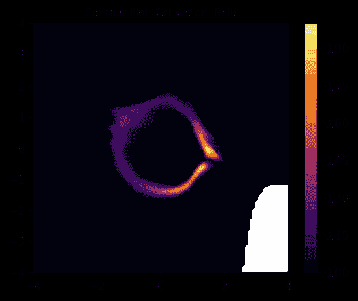

图 7：看起来与我们的目标数据（图 3）非常相似！！来源：作者的笔记本！

这很酷，但我们也可以绘制样本分布，因为我们的基础正态分布通过这 4 个 MAF 双射，来看一下：

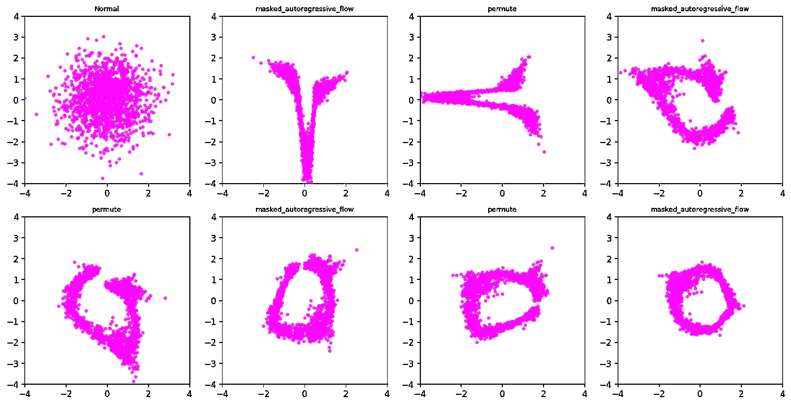

图 8：通过链式 4 个 MAF 双射将随机样本转换为圆形样本。来源：作者的笔记本。

我们从[归一化流](https://medium.com/towards-data-science/getting-started-with-normalizing-flows-linear-algebra-probability-f2b863ff427d)的基础开始，即微分同胚和概率分布的变换规则等。然后我们使用 TensorFlow 概率库实现了一些这些概念，将概率分布从正态分布转变为双峰分布，详见[第二篇文章](https://medium.com/towards-data-science/transforming-probability-distributions-using-normalizing-flows-bcc5ed6ac2c9)。最后，我们了解了最先进的自回归流模型的基础知识以及三角矩阵在这方面的重要性。最后，我们使用 TensorFlow 实现了 MAF，并展示了训练链式 MAF 以将正态分布转换为稍微复杂一点的分布的示例。希望这能帮助你入门流式模型，并迈出向扩散模型发展的第一步！！

***如果你对进一步的基础机器学习概念感兴趣，你可以考虑加入 Medium 使用*** [***我的链接***](https://saptashwa.medium.com/membership)***。你无需支付额外费用，但我会获得一小部分佣金。感谢大家！！***

[](https://medium.com/@saptashwa/membership?source=post_page-----9c361cd1354c--------------------------------) [## 使用我的推荐链接加入 Medium - Saptashwa Bhattacharyya

### 更多来自 Saptashwa（以及 Medium 上的许多其他作者）。您的会员费直接支持 Saptashwa 和其他…

[medium.com](https://medium.com/@saptashwa/membership?source=post_page-----9c361cd1354c--------------------------------)

## 参考文献：

[1] [用于密度估计的掩蔽自回归流](https://arxiv.org/abs/1705.07057): Papamakarios, G. 等

[2] [使用 RealNVP 进行密度估计](https://arxiv.org/abs/1605.08803): Dinh, L. 等

[3] [归一化流：第二部分](https://blog.evjang.com/2018/01/nf2.html); Jang, E. 的博客

[4] [基于流的模型](https://lilianweng.github.io/posts/2018-10-13-flow-models/); Weng, L. 的博客

[5] [TensorFlow 概率库：特别是 MAF](https://www.tensorflow.org/probability/api_docs/python/tfp/bijectors/MaskedAutoregressiveFlow)。

[6] 这里使用的代码笔记本：[我的 GitHub](https://github.com/suvoooo/Learn-TensorFlow/blob/master/TF-Proba/Norm-Flows/NormFlows_AutoReg.ipynb)
