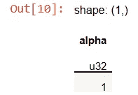

# 理解 Polars 缺乏索引

> 原文：[`towardsdatascience.com/understand-polars-lack-of-indexes-526ea75e413?source=collection_archive---------1-----------------------#2023-01-06`](https://towardsdatascience.com/understand-polars-lack-of-indexes-526ea75e413?source=collection_archive---------1-----------------------#2023-01-06)

## 从 Pandas 切换到 Polars，忘记索引吧

[](https://medium.com/@carlmkadie?source=post_page-----526ea75e413--------------------------------)[](https://towardsdatascience.com/?source=post_page-----526ea75e413--------------------------------) [Carl M. Kadie](https://medium.com/@carlmkadie?source=post_page-----526ea75e413--------------------------------)

·

[关注](https://medium.com/m/signin?actionUrl=https%3A%2F%2Fmedium.com%2F_%2Fsubscribe%2Fuser%2Fa5e87027005f&operation=register&redirect=https%3A%2F%2Ftowardsdatascience.com%2Funderstand-polars-lack-of-indexes-526ea75e413&user=Carl+M.+Kadie&userId=a5e87027005f&source=post_page-a5e87027005f----526ea75e413---------------------post_header-----------) 发布于 [Towards Data Science](https://towardsdatascience.com/?source=post_page-----526ea75e413--------------------------------) ·7 分钟阅读·2023 年 1 月 6 日[](https://medium.com/m/signin?actionUrl=https%3A%2F%2Fmedium.com%2F_%2Fvote%2Ftowards-data-science%2F526ea75e413&operation=register&redirect=https%3A%2F%2Ftowardsdatascience.com%2Funderstand-polars-lack-of-indexes-526ea75e413&user=Carl+M.+Kadie&userId=a5e87027005f&source=-----526ea75e413---------------------clap_footer-----------)

--

[](https://medium.com/m/signin?actionUrl=https%3A%2F%2Fmedium.com%2F_%2Fbookmark%2Fp%2F526ea75e413&operation=register&redirect=https%3A%2F%2Ftowardsdatascience.com%2Funderstand-polars-lack-of-indexes-526ea75e413&source=-----526ea75e413---------------------bookmark_footer-----------)

一只北极熊与一只熊猫竞赛——来源：[`openai.com/dall-e-2`](https://openai.com/dall-e-2/)

Pandas 和 Polars 是两个 Python 的数据框库。在[上一篇文章](https://medium.com/towards-data-science/understand-pandas-indexes-1b94f5c078c6)中，我这样写过 Pandas 和索引的内容：

> 为了高效使用 Pandas，忽略它的文档，学习关于索引的*[复杂]*真相。

相比之下，原始的 [Polars 书籍](https://web.archive.org/web/20230117102825/https://pola-rs.github.io/polars-book/user-guide/coming_from_pandas.html) 这样说 Polars 和索引：

> 不需要索引！没有它们会使事情变得更简单——说服我们相信相反的观点！

我们真的可以忘记索引吗？让我们测试一下 Polars 的说法。我们将把我之前文章中的所有示例从 Pandas 移植到 Polars。这将让我们了解在没有索引的情况下工作的实际情况。

最终，我们将看到：

+   “索引是不必要的！没有索引使事情更简单。”

+   如果你认为你 *真的* 需要一个索引，你 *真的* 需要一个字典。

为了达到这一点，我们首先创建一个数据框并检索一行。

# 构建和简单行检索

在 Pandas 中，我们这样构建数据框并设置索引：

```py
import pandas as pd
df1 = pd.DataFrame([['a',2,True],
                    ['b',3,False],
                    ['c',1,False]],
                   columns=['alpha','num','class'])
df1.set_index(['alpha'],inplace=True)
df1
```


我们用以下方法将关键字`b`转化为感兴趣的行：

```py
df1.loc[['b']]  # returns row 'b' as a dataframe
```


在 Polars 中，我们可以通过这样的方式从行构建数据框：

```py
import polars as pl
df1 = pl.from_records([['a', 2, True],
                       ['b', 3, False],
                       ['c', 1, False]],
                      orient='row',
                      columns=['alpha', 'num', 'class'])
df1
```

然而，Polars 是以列为中心的，所以构建相同数据框的更好方法是：

```py
import polars as pl
df1 = pl.DataFrame({'alpha':['a','b','c'],    
                    'num':[2,3,1],
                    'class':[True,False,False]
                    })
df1
```


我们不需要设置索引。我们用以下方法将关键字`b`转化为感兴趣的行：

```py
df1.filter(pl.col("alpha")=='b')
```

`filter` 方法用于查找感兴趣的行。表达式 `pl.col("alpha")=='b'` 告诉 `filter` 要查找哪些行。与 Pandas 相比，我发现 Polars 的方法更简单、更通用。（我们稍后将讨论性能问题。）

我们从找到一个简单的行转向找到行的数量。

# 查找行号

在 Pandas 中，你可以通过 `index.get_loc(...)` 查看感兴趣行的数字：

```py
import pandas as pd
df2 = pd.DataFrame([['x',2,True],
                    ['y',3,False],
                    ['x',1,False]],
                   columns=['alpha','num','class'])
df2.set_index(['alpha'],inplace=True)
print(f"{df2.index.get_loc('y')=}")
print(f"{df2.index.get_loc('x')=}")
```


如示例所示，函数仅在单个项匹配时返回一个数字。当多个项匹配时，它返回一个布尔数组。

在 Polars 中，你应该首先问自己是否真的需要找到行号。答案通常是“否”。但是，如果你回答“是”，你可以使用 `arg_where`。

```py
df2 = pl.DataFrame({'alpha':['x','y','x'],
                    'num':[2,3,1],
                    'class':[True,False,False]})
df2.select(pl.arg_where(pl.col("alpha")=='y')).to_series()
```



```py
df2.select(pl.arg_where(pl.col("alpha")=='x')).to_series()
```


结果是一个 Polars `series`。在 Polars 中，`series` 代表一列值，这里是行号。

比较 Pandas 和 Polars 在查找行号方面的复杂性，我发现两者类似。然而，Polars 可能会通过减少行号的重要性而占据优势。

接下来我们来看复杂的行访问。

# 行访问

在 Pandas 中，访问索引行的主要方式是 `.loc[…]`，其中输入可以是：单个元素、元素列表或元素切片。行将按输入中出现的顺序输出。这些示例展示了每种输入方式。

```py
df3 = pd.DataFrame([['i',2,True],
                    ['j',3,False],
                    ['k',5,False],
                    ['j',1,False]],
                   columns=['alpha','num','class'])
df3.set_index(['alpha'],inplace=True)
df3.loc['j']
```


```py
df3.loc[['k','i']]
```


```py
df3.loc['i':'k']
```


请注意，与 Python 的其他部分不同，Pandas 中的 *start:stop* 切片包括 *stop* 值。同时注意，Pandas 排除了第二个‘j’行，因为它在（第一个）‘k’行之后。

在 Polars 中，我们使用 `filter` 和表达式：

```py
df3 = pl.DataFrame({'alpha':['i','j','k','j'],
                    'num':[2,3,5,1],    
                    'class':[True,False,False,False]})
df3.filter(pl.col("alpha")=='j')
```


```py
df3.filter(pl.col("alpha").is_in(['k','i']))
```


```py
df3.filter(pl.col("alpha").is_between('i','k',include_bounds=True))
```


默认情况下，Polars 的`is_between`不会包含其边界，但可以选择包含其中一个或两个边界。同时，请注意，Polars 包含了第二行的‘j’。Polars 基于字母顺序而非行顺序查看`in_between`（在字符串值上）。

由于它不需要索引，我发现 Polars 在这些更复杂的行检索中比 Pandas 更简单。

对于我们的最后一个基本任务，让我们看看连接行。

# 连接行

在 Pandas 中，左连接的规则是：

+   左侧的数据框不需要被索引，但右侧的数据框需要。

+   在连接的`on`输入中给出左侧感兴趣的列。

在这个示例中，我们将使用`join`向数据框中添加一个“score”列。这里是左侧的数据框。它没有被索引。

```py
df_left = pd.DataFrame([['x',2,True],
                        ['y',3,False],
                        ['x',1,False]],
                       columns=['alpha','num','class'])
```

在 Pandas 中，右侧的数据框需要一个索引，但它可以命名为任何名称。这里我们称它为`any_name`。

```py
df_right = pd.DataFrame([['x',.99],
                         ['b',.88],
                         ['z',.66]],
                        columns=['any_name','score'])
df_right.set_index(['any_name'],inplace=True)
```

我们通过左连接组合这两个数据框。我们使用第一个数据框中的`alpha`列以及第二个数据框中的任何索引。结果是一个包含分数列的新数据框。

```py
df_left.join(df_right,on=['alpha'],how='left')
```


在 Polars 中，一切都很类似，但稍微简单一些：

```py
df_left = pl.DataFrame({'alpha':['x','y','x'],
                        'num':[2,3,1],
                        'class':[True,False,False]})
df_right = pl.DataFrame({'alpha':['x','b','z'],
                            'score':[.99,.88,.66]})
df_left.join(df_right,on=['alpha'],how='left')
```


区别在于我们不需要为右侧数据框建立索引。如果感兴趣的列具有相同的名称（如这里所示），我们使用`on`。如果没有，我们使用`left_on`和`right_on`。

所以，Polars 再次比 Pandas 更简单使用，但代价是什么呢？

# 性能

当然，缺少索引会使 Polars 变慢。但令人惊讶的是，实际上并非如此。在广泛的基准测试中，[Polars 比 Pandas 快得多](https://www.ritchievink.com/blog/2021/02/28/i-wrote-one-of-the-fastest-dataframe-libraries/) [[Vink, 2021]](https://www.ritchievink.com/blog/2021/02/28/i-wrote-one-of-the-fastest-dataframe-libraries/)。它通过优化实现了这一点，包括良好的内存布局和自动向量化/并行化。

我们能否构造出 Pandas 比 Polars 更快的情况？是的，如果我们将数据框用作字典，Pandas 可能比 Polars 快 20 倍。然而……

猜猜什么比将 Pandas 用作字典快 300 倍？答案是：将字典用作字典。

在这个测试中，我们构造了一个包含两个列的数据框，填充了从 0 到 999,999 的数字。然后我们寻找数字 500,000。

```py
import polars as pl
import pandas as pd

n = 1_000_000
df_pl = pl.DataFrame({'a':list(range(n)),'b':list(range(n))})
%timeit df_pl.filter(pl.col("a")==n//2)

df_pd = pd.DataFrame({'a':list(range(n)),'b':list(range(n))})
df_pd = df_pd.set_index('a')
%timeit df_pd.loc[n//2]

dict_pl = df_pl.partition_by('a',as_dict=True)
%timeit dict_pl[n//2]
```

以下是我在 4 核笔记本电脑上多次运行的平均结果：


总结性能：根据其他基准测试，对于典型使用情况，Polars 比 Pandas 更快。对于特殊情况——例如，当你确实需要使用字典时——Polars 提供了创建字典以获得最快性能的工具。

# 结论

在我看来，消除索引使得 Polars 比 Pandas 更易于使用。

你可能会预期这种简化会导致性能变慢。然而，基准测试显示 Polars 通常比 Pandas 快得多。它通过包括良好的内存布局和自动向量化/并行化等优化来实现这一点。可能仍然存在需要类似索引的数据结构的情况。对于这些情况，Polars 提供了创建字典等工具。

那么，你应该从 Pandas 切换到 Polars 吗？这要视情况而定。

我们的基因组学项目，[FaST-LMM](https://fastlmm.github.io/) 使用 Pandas 输出统计结果表格。FaST-LMM 几乎所有的计算工作都在 Pandas 之外用自定义代码完成。它仅使用 Pandas 与我们的用户分享最终结果，我们可以假设这些用户了解 Pandas。考虑到这一点，我们没有理由从 Pandas 切换。

另一方面，如果我开始一个涉及有趣数据分析的新项目，我会使用 Polars。Polars 给了我一直想从 Pandas 中获得的速度和简便性。

*请* [*在 Medium 上关注我*](https://medium.com/@carlmkadie)*。我撰写关于 Rust 和 Python 中的科学编程、机器学习和统计学的文章。我通常每个月写一篇文章。*
