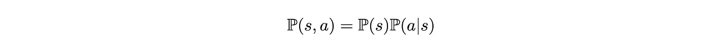
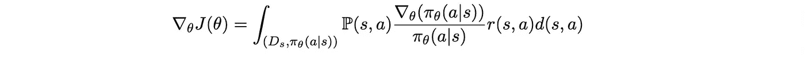
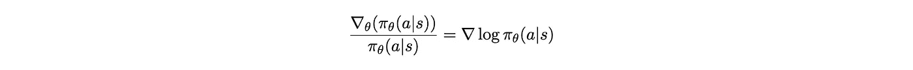

# 通过从零开始构建交叉熵来理解策略梯度

> 原文：[`towardsdatascience.com/understand-policy-gradient-by-building-cross-entropy-from-scratch-75ca18b53e94?source=collection_archive---------2-----------------------#2023-06-11`](https://towardsdatascience.com/understand-policy-gradient-by-building-cross-entropy-from-scratch-75ca18b53e94?source=collection_archive---------2-----------------------#2023-06-11)

## 我们如何训练模型的统一视角

 [Tony Chen](https://tonychenxyz.medium.com/?source=post_page-----75ca18b53e94--------------------------------)

·

[关注](https://medium.com/m/signin?actionUrl=https%3A%2F%2Fmedium.com%2F_%2Fsubscribe%2Fuser%2F1c86c3ef2039&operation=register&redirect=https%3A%2F%2Ftowardsdatascience.com%2Funderstand-policy-gradient-by-building-cross-entropy-from-scratch-75ca18b53e94&user=Tony+Chen&userId=1c86c3ef2039&source=post_page-1c86c3ef2039----75ca18b53e94---------------------post_header-----------) 发表在 [Towards Data Science](https://towardsdatascience.com/?source=post_page-----75ca18b53e94--------------------------------) · 16 分钟阅读 · 2023 年 6 月 11 日 

--

**强化学习 (RL)** 可以做出令人惊叹的事情。最近，[ChatGPT 通过 PPO 进行微调](https://www.assemblyai.com/blog/how-chatgpt-actually-works/)，PPO 是一种叫做 **策略梯度 (PG)** 的强化学习算法的变种。理解 RL，特别是策略梯度，可能并不简单，特别是如果你像我一样喜欢把握直觉的话。在这篇文章中，我将探讨一系列思路，这些思路确实帮助我从更熟悉的监督学习环境出发，深入理解 PG。

# 摘要

+   我们将从设计一个简单的监督训练程序开始，通过奖励+1 来对二分类机器人进行正确答案的训练

+   我们将为该过程制定目标

+   我们将推导出该过程的梯度上升公式（这将与使用交叉熵的梯度下降过程相同）

+   我们将把我们的过程与 RL 设置进行比较，并将我们的梯度上升与策略梯度联系起来

# **谁应该阅读这个？**

+   我的目标是提供一种友好且直观的方式来理解 PG。如果你对 RL 问题设置有一个大致了解，并且知道 PG 的高级概念，将会很有帮助。

+   我希望帮助你更好地理解 RL 与 PG 以及监督 ML 之间的关系。因此，如果你了解如何用交叉熵损失函数训练一个监督 ML 算法，将会非常有帮助。

# 为什么写这篇文章？

## 策略梯度

在 RL 问题中，**代理**与**环境**互动以学习**策略**。策略告诉代理在不同**状态**下该做什么以最大化**奖励**。

作者提供的图像

PG 的想法似乎很简单明了。

+   指导时间*t*上代理行为的**策略**是*π_θ(a_t|s_t)*。

+   这是一种**函数**（通常是神经网络），具有参数*θ*。

+   它**接收状态信息** *s_t* 并输出一个**采取行动的概率分布** *a_t*。

+   然后它**接收奖励** *r(s_t, a_t)*。

+   当我们拥有许多这样的动作和奖励周期的历史时，我们可以更新参数*θ*以最大化由*π_θ*生成的动作所带来的预期奖励。

我们如何进行更新？通过…**梯度**！我们通过以下梯度更新生成*π_θ*的模型

## 有些东西感觉不对劲

这看起来非常熟悉。当我们在传统的监督学习中训练神经网络模型时，我们也通过执行第二行操作即梯度下降来更新模型参数（在 PG 情况下，技术上是梯度上升，因为我们在最大化目标）。

但这也感觉非常不同。如果你查看它的[推导过程](https://www.youtube.com/watch?v=GKoKNYaBvM0&list=PL_iWQOsE6TfXxKgI1GgyV1B_Xa0DxE5eH&index=23)，你会发现推导这个方程**需要一点努力**。这与我们在监督学习中更直观的做法非常不同：将输入提供给神经网络，得到输出，与目标进行比较并计算损失函数，点击反向传播按钮，就完成了！

对我来说，**对数项**总是似乎突然出现。尽管上述链接中的同一在线课程讲解了如何得到对数项，但过程似乎只是一堆正确但缺乏动机的数学。

从监督学习中具体的区别是什么？深入探讨这个问题可以很好地理解策略梯度。此外，它也是对我们每天做的**一些熟悉的监督学习本质**的良好提醒。

# 从头开始构建交叉熵

如果我们用一些在监督学习中使用的损失函数来分析，它们会立即“显得合理”。但要理解它们的来源则需要更多的努力。例如，经典的均方误差直观上很合理：它只是最小化预测与目标之间的距离。但有这么多距离度量，为什么选择平方距离？[你必须深入了解均方误差是做最大似然估计并假设基础总体分布为正态分布的副产品](https://tivadardanka.com/blog/mean-squared-error-explained)。

同样地，我们日常使用的另一个经典损失函数是交叉熵。虽然有很多关于交叉熵的良好解释，**让我们尝试从最基本的方式构建它**。

## 让我们训练一个分类机器人！

假设你想训练一个机器人来分类狗和猫的图像。直观上，通过奖励正确答案并惩罚（或不奖励）错误答案来训练它是合理的。具体方法如下：

+   你**给机器人一张图片**。我们称之为*s*。这张图片是从总体分布*D_s*中采样的。

狗图像来源：Unsplash；其他部分由作者提供

+   如果机器人认为这是狗的图像（动作*a_dog*）或这是猫的图像（动作*a_cat*），它将**给你一个答案**。

+   机器人根据图像有**自己的预测**，即图像是狗还是猫的概率：*π_θ(a|s) = (a_dog, a_cat)*。例如，*π_θ(a|s) = (0.9, 0.1)*意味着它认为有 0.9 的概率是狗，0.1 的概率是猫。

狗图像来源：Unsplash；其他部分由作者提供

+   但每次机器人只会给你一个明确的答案。它要么说“这是狗” (*a_dog*)，要么说“这是猫” *(a_cat)*。每次**它给你一个回应**时，回应（动作）是**从分布中随机采样**得到的，由*π_θ(a|s)*产生：*a = (a_dog, a_cat) ~ π_θ(a|s)*。

狗图像来源：Unsplash；其他部分由作者提供

+   当机器人正确回答时，你将**奖励**它（可能给它一个小奖励？），奖励值为 1。（*r(s,a) = 1*）。当回答错误时，则**没有奖励**（0 奖励）。(*r(s,a) = 0*)

狗图像来源：Unsplash；其他部分由作者提供

猫图像来源：Unsplash；其他部分由作者提供

这是我在第一次学习监督学习时想到的过程。当它正确时给予奖励。当它错误时（或在我们设计的训练过程中没有奖励）给予惩罚。这可能是训练某物最直观的方式。

## 最大化目标

我们的目标是什么？我们希望它的响应尽可能正确。更准确地说，我们希望找到最优参数*θ*，使得生成的*π_θ(a|s)*，在所有可能的*s*（从图像总体分布*D_s*中采样）和*a*（从由模型*π_θ(a|s)*生成的分布中采样）中，能够获得**每对*(s,a)*出现的概率加权的最大平均奖励**：

换句话说，我们在**最大化**定义为

## 目标的梯度

现在我们有了一个目标函数，我们可以尝试通过…梯度上升来最大化它！也就是说，我们可以通过迭代进行

但我们应如何计算梯度，即*J*对*θ*的导数？这在这种情况下有点棘手，因为

+   我们希望对其求导的函数是一个**期望**。

+   如果期望不是关于依赖于*θ*的分布，那么通过期望的线性性，我们可以直接对期望内部的内容进行求导，并将期望保留在那里。然而，在这种情况下，期望是关于*(s,a) ~ (D_s, π_θ(a|s))*的，这依赖于*θ*。因此，导数并不明显。

+   另一种思考方式是，*J*(*θ*)的值随着我们从由**部分由*θ*决定的分布**中采样*(s,a)*的频率变化而变化。我们希望更频繁地出现*s=dog image*和*a=a_dog*（猫的类似对）。当我们进行梯度上升时，我们如何捕捉**向这个方向变化的*θ***？

此外，**理想情况下，我们希望梯度呈现以下形式**

这是因为你通过机器人与您的交互样本来训练机器人。每个样本包含一个*(s,a,r)*三元组。因此，我们可以通过对收集到的*N*个样本进行平均来近似这个梯度（根据大数法则，即进行随机梯度上升）：

然后我们可以通过进行梯度上升来进行优化

现在让我们找到*f*。

## 寻找梯度

总结一下，我们希望从（1）开始，得到（2），对于某个*f(θ,s,a,r)*。

首先，让我们用**期望的定义**重写（1）：

这基本上是对所有可能的*(s,a)*对的奖励按概率加权的积分。

那么，一个*(s,a)*对的联合概率*P(s,a)*究竟是多少？我们可以将其分解为图像样本（*s*）出现的概率和机器人随机选择动作*a*的概率。

由于机器人从其内部预测模型 *π_θ(a|s)* 中随机选择动作 *a*，我们有

在括号内的所有项中，只有 *π_θ(a|s)* 依赖于 *θ*。其他项都是常数。因此，我们可以**将梯度操作移动到积分符号内**，并得到

注意，我们也可以写出以下内容。这里没什么大不了的。只是将原始左边的内容乘以以分数形式写出的 1，并调整项。

替换回去，并稍微调整一下，我们得到

*P(s)π_θ(a|s)* 看起来很熟悉。这正是我们之前分解的 *P(s,a)*！将其放回去，我们得到

现在我们有一个积分和 *P(s,a)*，我们可以…将其适配回**期望的定义**！

这正是我们在（2）中想要得到的形式，其中 *f* 是括号内的项！

你可能会想，为什么我们在之前的繁琐分数中重写了*π_θ(a|s)*的梯度？其目的是创建一个*π_θ(a|s)*项（我们在求导时丢失了它），以便我们可以**再次生成一个 *P(s,a)* 项**，并将积分重新转化为期望！

## 构建交叉熵

现在是魔法时刻。

不相信我？使用链式法则从右手边到左手边进行工作。（[可选] 旁注：如果你对策略梯度公式中对数项的动机感到困惑，这实际上是简化我们得到的繁琐方程的副产品，旨在提取一个 *π_θ(a|s)* 项，将事物转回期望。）

所以我们可以稍微简化*J(θ)*的梯度：

所以每次我们有一批*(s,a)*作为样本时，可以通过

为了将其转化为更熟悉的形式，将梯度符号移到求和外部，我们有

我们还会通过进行以下操作来反转符号

这让你想起什么吗？让我们将其与**在交叉熵损失上进行梯度下降**时所做的事情进行比较。

记住，交叉熵损失是

其中**y_i**是真实标签，是一个描述图像是猫还是狗的独热向量（*y_i_1, y_i_2*，要么是(0,1)要么是(1,0)）。**y_hat_i**是模型的预测，是一个向量（*y_hat_i_1, y_hat_i_2*），其中两个条目的和为 1。

当我们对这个损失函数进行**梯度下降**时，我们计算批次的交叉熵损失函数，并点击反向传播按钮：

这个表达式与我们之前推导出的梯度上升表达式之间的区别是

用语言描述，就是：在样本*x_i*上，y_i

+   模型**做出预测**（*y_hat_i_1, y_hat_i_2*）给定*x_i*

+   模型**从预测分布中随机采样响应**

+   我们**奖励**响应 1 的*y_i_1*，并且对响应 2 的*y_i_2*进行奖励。

+   由于当标签为类别 1 时，*y_i_1 = 1, y_i_2 = 0*，我们在模型正确响应 1 时**奖励模型 1 分**，而在模型错误响应 0 时**没有奖励**。类别 2 的情况也是如此。

这正是我们一直在做的事情！

所以总结一下，

+   我们**设计了一个简单的训练**设置，在这个设置中，我们**奖励** **机器人**当其正确回答时得 1 分，当其回答错误时得 0 分。

+   我们总结了我们希望在**目标函数**中实现的内容，该目标函数描述了机器人根据其响应的机会加权所获得的奖励。

+   我们找到梯度下降过程以**最大化这个目标函数**

+   然后我们得到……我们在**通过计算交叉熵损失然后进行反向传播训练模型**时使用的确切过程！

# 回到强化学习

现在让我们把焦点重新放回到强化学习设置上。RL 与监督学习设置之间的区别是什么？

## 多个时间步长

第一个区别是 RL 通常涉及**多个状态和多个回合**。在我们的设置中，机器人从图像输入开始，即状态*s*。在机器人基于预测给出答案并收集奖励后，机器人与您的互动就结束了。

相反，在 RL（强化学习）问题中，智能体通常在**多个回合**中与环境互动，且在初始状态后可能过渡到其他状态。

目标函数变为

用语言描述，我们最大化**所有时间步长**的**平均奖励总和**，**对所有可能的状态和动作序列（轨迹）加权**，**加权由每个轨迹发生的概率决定**，当动作由参数*θ*决定时。

注意，*p_θ*是一个状态和动作序列的联合分布，当动作由代理的模型参数*θ*决定时。在每个时间步，代理的动作由*π_θ(a_t|s_t)*决定，其中*π_θ*是一个以*θ*为参数的模型。*p_θ*是一个**高级抽象**，表示当代理根据*π_θ*做出决策时，状态和动作序列发生的概率（即*p_θ*是理论上代理在轨迹上采取行动的频率的占位符。另一方面，*π_θ(a|s)*是代理在特定时间步采取某个动作的概率。我们实际上不容易知道*p_θ*的值，因此稍后我们将用实际知道的模型输出*π_θ(a|s)*来重写它）。

让我们与之前的目标进行比较：

**主要区别**如下：

+   我们计算一个* s *和*a*序列上的期望，而不是仅仅一个对。

+   我们最大化轨迹中所有时间步的奖励总和，而不仅仅是来自图像和回答的单一时间步奖励。

## 比较梯度公式：

我们可以对这个目标做类似的操作，推导出我们可以在每个时间步更新*θ*的梯度。

回顾一下，我们的目标是以以下形式找到某些*f*的*J(θ)*的梯度。

当我们获得一批样本序列*s_1, a_1, r_1, … s_T, a_T, r_T*时，我们可以通过随机梯度上升更新*θ*：

为了简化，我们将状态序列记作一个变量*τ*。

所以我们希望最大化以下目标函数：

我们可以做类似的操作：

+   **用积分表示期望**。

+   对仅涉及*θ*的项*p_θ(τ)* **求导**。

+   将*p_θ(τ)*的梯度重写为** *p_θ(τ)*和其他东西的乘积**，以恢复定义期望的形式。

所以我们得到：

看！这正是我们想要找到的。换句话说，这意味着我们正在将*θ* **更新为样本*τ*的对数概率梯度的方向**，权重是沿样本*τ*的**总奖励**。**这正是策略梯度的公式**。

如果我们从早期的交叉熵类比延伸过来，奖励的总和基本上是轨迹的标签，而 *p_θ(τ)* 是模型预测下 *τ* 发生的可能性。训练过程 **鼓励模型预测与不同轨迹 *τ* 上的奖励分布相似的分布**。（这实际上是一个数学上准确的陈述 [如果我错了请纠正我]。如果你知道 KL 散度，可以将所计算的梯度与 KL 散度进行比较）。

我们可以对条件概率和 *p_θ(τ)* 的定义进行更多的操作。这个过程在[这个视频](https://www.youtube.com/watch?v=GKoKNYaBvM0&list=PL_iWQOsE6TfXxKgI1GgyV1B_Xa0DxE5eH&index=22&ab_channel=RAIL)（大约在 9:27）中讲解得很好。我们最终得到以下内容，将 *p_θ(τ)* 重新表示为 *π_θ(a_t|s_t)*，这是我们实际知道其值的：

注意 **当 T = 1**（单次实验），**这与我们之前设置中获得的梯度是一样的**。换句话说，监督学习是强化学习的一个特殊情况，其中只有一个实验，奖励是非随机的（见下一节）。

## 另一个区别：奖励的估计

强化学习与监督学习之间的另一个区别是我们可以多大程度上相信奖励。在监督学习中，奖励是与图像样本一起提供的真实标签。我们通常 100% 确定奖励是正确的，我们的机器人会根据这些标签调整其行为。

然而，在强化学习问题中，奖励可能 **更具随机性**（想象一下你玩游戏时，可能在同一个地方两次但得到不同的分数）。因此，我们必须 **估计特定状态-动作对的奖励**，通过与环境互动并利用历史奖励来进行估计。

> ***[可选]*** *附带想法：我还在思考是否存在监督学习（标签/奖励是 100% 可相信的）和强化学习（奖励更具随机性）之间的中间领域。当标签有噪声（包含一些错误标签）时，我们是否有点像处于中间？所以，* [*伪标签方法*](https://www.kaggle.com/code/cdeotte/pseudo-labeling-qda-0-969) *是否与强化学习问题有一些相似之处？请告诉我你的想法。*

从长远来看，我们应该有足够的历史奖励来理解平均奖励行为，但在短期内，小样本数量可能会产生 **不稳定** 的偏差估计。

更糟糕的是，由于代理行为是通过收集的奖励来更新的，如果我们收集到低质量的奖励，我们可能会陷入并停留在一个糟糕的策略中。要从那里走出来并重新回到正确的轨道上需要很长时间。

这是强化学习中的一个挑战，仍然是一个正在进行的研究领域。 [对奖励进行一些操作](https://www.youtube.com/watch?v=VgdSubQN35g&list=PL_iWQOsE6TfXxKgI1GgyV1B_Xa0DxE5eH&index=25&ab_channel=RAIL) 和变体，如 [TRPO](https://arxiv.org/abs/1502.05477) 和 [PPO](https://arxiv.org/abs/1707.06347)，旨在更好地解决这个问题，并且比普通 PG 使用得更为广泛。

## [可选] 另一种思考：与序列监督机器学习的比较

我们的监督机器学习设置与 RL 之间的一个区别是 RL 通常涉及多个时间步。我立刻有一个问题：那么 RL 与训练像 Transformer 或 LSTM 这样的序列模型有什么不同？

这个问题的答案绝对取决于你最喜欢的序列模型的训练损失设计。

现在，假设你训练一个序列模型 *f(***x_1,x_2,…x_T***)* 以预测 **y_1, y_2…y_T**。例如，在机器翻译任务中，**x** 可能是输入英文句子的单词，而 **y** 是输出法文句子的单词（每个 **x_t, y_t** 是单词的一个独热向量表示）。

我们通过对每个样本的每个单词输出预测与真实标签之间的交叉熵之和来计算损失函数。然后，我们对一批样本进行平均，并像下面这样进行反向传播。

放回到策略梯度公式中，对我来说，这与计算目标函数的梯度相同

这种公式与 PG 公式的区别在于，我们没有将所有时间步的预测的对数概率之和与所有步骤的奖励之和相乘。相反，我们取每个时间步的对数概率与奖励的成对乘积并将它们相加。

这去除了很多项，因此大大减少了梯度的方差，这可能是使得在监督设置中训练 Transformer/LSTM 比 RL 算法更容易的原因？（除了监督设置中的非随机奖励）。

[这个视频](https://www.youtube.com/watch?v=VgdSubQN35g&list=PL_iWQOsE6TfXxKgI1GgyV1B_Xa0DxE5eH&index=25&ab_channel=RAIL) 中介绍了一种减少 PG 方差的技术：将 PG 中所有时间步的奖励总和更改为未来奖励（即从 *t’ = t 到 t’ = T* 的总和）。这与 PG 与在监督设置中训练 Transformer/LSTM 之间的不同具有相似的风味。虽然未来奖励方法使得代理能够通过可能的未来奖励评估每个状态，但我们是否可以说监督序列训练使得模型仅关注当前时间步的正确性？

此外，我尝试从这个梯度表达式中倒推，找到导致这个梯度表达式的原始 *J(θ)*，以便我们可以更直接地解释监督序列训练的目标。但我在半途中卡住了。如果你有任何想法，请告诉我。

## 致谢

策略梯度与交叉熵之间的联系并非我自己原创的想法。感谢[这篇文章](https://amoudgl.github.io/blog/blog/policy-gradient/)给了我拓展思路的启发，让我从更根本的角度理解交叉熵和策略梯度的作用。
