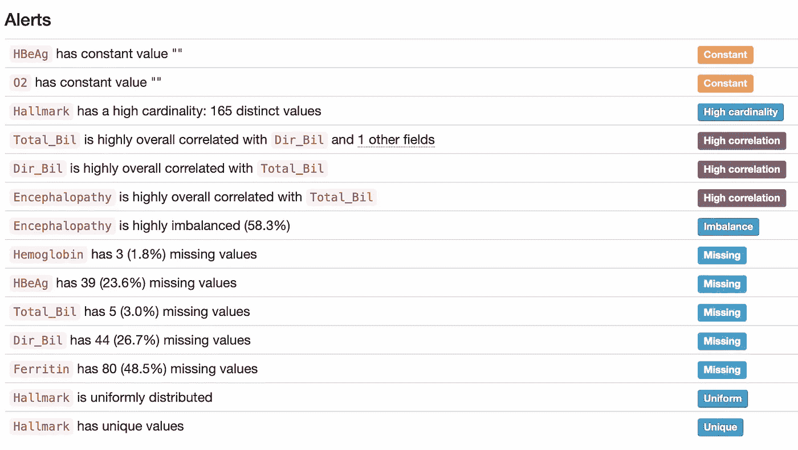

# 实时了解您的数据

> 原文：[`towardsdatascience.com/understand-your-data-in-real-time-1f6d9f6937e5?source=collection_archive---------8-----------------------#2023-07-20`](https://towardsdatascience.com/understand-your-data-in-real-time-1f6d9f6937e5?source=collection_archive---------8-----------------------#2023-07-20)

## 实操教程

## 与 bytewax 和 ydata-profiling

 [Miriam Santos](https://medium.com/@miriam.santos?source=post_page-----1f6d9f6937e5--------------------------------)

·

[关注](https://medium.com/m/signin?actionUrl=https%3A%2F%2Fmedium.com%2F_%2Fsubscribe%2Fuser%2F243289394aaa&operation=register&redirect=https%3A%2F%2Ftowardsdatascience.com%2Funderstand-your-data-in-real-time-1f6d9f6937e5&user=Miriam+Santos&userId=243289394aaa&source=post_page-243289394aaa----1f6d9f6937e5---------------------post_header-----------) 发表在 [Towards Data Science](https://towardsdatascience.com/?source=post_page-----1f6d9f6937e5--------------------------------) ·8 分钟阅读·2023 年 7 月 20 日

--

*在这篇博客文章中，我们将深入探讨如何将开源流处理解决方案* ***bytewax**** *与* ***ydata-profiling**** *结合使用，以提升您的流处理质量。准备好了吗！*

流处理允许对数据进行实时分析，无论是在传输过程中还是存储之前，并且可以是**有状态的**或**无状态的**。

**有状态流处理** 用于*实时*推荐、模式检测或复杂事件处理，其中需要处理历史数据（窗口、按键连接等）。

**无状态流处理** 用于*内联*转换，无需了解流中其他数据点，例如掩码电子邮件或类型转换。

照片由 [Markus Spiske](https://unsplash.com/@markusspiske?utm_source=medium&utm_medium=referral) 提供，拍摄于 [Unsplash](https://unsplash.com/?utm_source=medium&utm_medium=referral)

总体而言，数据流在工业中广泛使用，应用于诸如 *欺诈检测*、*病人监控* 或 *事件预测维护* 等用例。

# 所有数据流必须考虑的一个关键方面是数据质量。

与传统模型中数据质量通常在数据仓库或仪表板解决方案创建过程中进行评估不同，*流数据需要持续监控*。

在整个过程中，从数据收集到传递给下游应用程序，保持数据质量至关重要。毕竟，差的数据质量可能会给组织带来高昂的成本：

> “对于大多数公司来说，差的数据质量的成本高达 15% 到 25% 的收入。 (…) 通过在数据质量上提前准备，可以消除其中的三分之二的成本。”
> 
> **— 托马斯·C·雷德曼，《数据质量的前瞻》一书的作者**

在本文中，我们将向您展示如何将 `bytewax` 与 `ydata-profiling` 结合起来，以分析和提高您的流数据质量！

# 使用 Bytewax 进行数据专业人士的流处理

[Bytewax](https://github.com/bytewax/bytewax) 是一个开源流处理框架，专为 Python 开发人员设计。

它允许用户**构建流数据管道和实时应用程序**，具有类似于 Flink、Spark 和 Kafka Streams 的功能，同时提供一个友好且熟悉的界面，并且**与 Python 生态系统 100% 兼容**。

使用内置的 [连接器](https://bytewax.io/blog/custom-input-connector) 或现有的 Python 库，**您可以连接到实时和流数据源**（Kafka、RedPanda、WebSocket 等），并**将转换后的数据**写入各种下游系统（Kafka、parquet 文件、数据湖等）。

对于转换，Bytewax **支持有状态和无状态的转换**，通过 *map*、*windowing* 和 *aggregation* 方法，并具备如恢复和可扩展性等熟悉的功能。

Bytewax [提供了以 Python 为主的数据流体验](https://bytewax.io/blog/whywax)，并**专门为数据工程师和数据科学家而构建**。它允许用户**构建流数据管道和实时应用程序**，并创建满足需求的自定义配置，而无需学习和维护像 Spark 或 Flink 这样的基于 JVM 的流处理平台。

Bytewax 非常适合多种使用场景，包括[生成 AI 的嵌入管道](https://bytewax.io/blog/embedding-pipelines-for-generative-ai)、[数据流中的缺失值处理](https://bytewax.io/guides/handling-missing-values)、[在流式上下文中使用语言模型理解金融市场](https://bytewax.io/blog/LLM-in-streaming)等。有关用例灵感和更多信息，如文档、教程和指南，请随时查看[Bytewax 网站](https://bytewax.io/)。

# 为什么需要对数据流进行数据分析？

**数据分析是任何机器学习任务成功的关键**，指的是彻底理解我们的数据：其结构、行为和质量。

简而言之，数据分析包括分析与数据格式和基本描述符相关的方面（例如，样本数量、特征数量/类型、重复值）、其内在特征（如缺失数据或不平衡特征），以及在数据收集或处理过程中可能出现的其他复杂因素（例如，错误值或不一致特征）。

**确保高数据质量标准对于所有领域和组织都至关重要，但对于那些处理持续输出数据的领域尤其相关**，因为情况可能会快速变化，需要立即采取行动（例如，医疗监测、股票价值、空气质量政策）。

对于许多领域，数据分析是从探索性数据分析的角度使用的，考虑存储在数据库中的历史数据。相反，对于数据流，**数据分析在流中的验证和质量控制中变得至关重要**，数据需要在不同的时间帧或处理阶段进行检查。

通过将**自动化分析嵌入我们的数据流中**，我们可以*立即获得反馈*，了解当前数据状态，并在出现潜在关键问题时收到警报——无论这些问题与**数据一致性和完整性**（例如，数据损坏或格式变化）相关，还是与**短时间内发生的事件**（例如，数据漂移、偏离业务规则和结果）有关。

在现实世界中 — *你只知道墨菲定律肯定会生效，“一切都可能出错”* — 自动化分析可能会帮助我们避免多个脑力难题和需要停产的系统！

关于数据分析，`ydata-profiling`一直是一个[热门选择](https://medium.com/ydata-ai/auditing-data-quality-with-pandas-profiling-b1bf1919f856)，无论是[表格数据](https://ydata-profiling.ydata.ai/docs/master/pages/getting_started/examples.html)还是[时间序列数据](https://medium.com/towards-data-science/how-to-do-an-eda-for-time-series-cbb92b3b1913)。这也不足为奇——**一行代码就可以进行全面的分析和洞察。**

复杂且耗时的操作在后台完成：ydata-profiling **自动检测数据中的特征类型**，并根据特征类型（数字或分类）**调整概要统计和可视化**，这些内容会在分析报告中显示。

促进*以数据为中心的分析*，该包还**突显了特征之间的现有关系**，关注它们的配对**交互**和**相关性**，并提供**数据质量警报的全面评估**，从*重复*或*常量*值到*偏斜*和*不平衡*特征。

这确实是对我们数据的*360º视角*——付出最少的努力。

分析报告：突显潜在的数据质量问题。图片来源：作者。

# 汇总：bytewax 和 ydata-profiling

在开始项目之前，我们需要首先设置我们的 Python 依赖项并配置数据源。

首先，让我们安装`bytewax`和`ydata-profiling`包（*你可能需要使用虚拟环境来进行这个操作——* [*查看这些说明*](https://github.com/Data-Centric-AI-Community/nist-crc-2023#%EF%B8%8F-installation-instructions) *如果你需要额外的指导！）*

然后，我们将上传[环境传感器遥测数据集](https://www.kaggle.com/datasets/garystafford/environmental-sensor-data-132k)（许可—CC0：公共领域），该数据集包含来自不同 IoT 设备的**温度、湿度、一氧化碳、液化石油气、烟雾、光线和运动**的多项测量：

**在生产环境中，这些测量将由每个设备持续生成**，输入将类似于我们在流媒体平台[例如 Kafka](https://bytewax.io/guides/enriching-streaming-data)中预期的内容。在这篇文章中，**为了模拟流数据的上下文，我们将一次从 CSV 文件中读取一行数据**，并使用 bytewax 创建数据流。

*(快速旁注：数据流本质上是一个可以描述为有向无环图—DAG 的数据管道)*

首先，让我们进行一些**必要的导入**：

然后，我们定义我们的数据流对象。之后，我们将使用无状态的映射方法，在其中传入一个函数以将字符串转换为日期时间对象，并将数据重组为格式（device_id, data）。

map 方法将以无状态的方式对每个数据点进行更改。我们修改数据的形状是为了在接下来的步骤中更容易地对数据进行分组，以便分别对每个设备进行数据分析，而不是同时对所有设备进行分析。

现在我们将利用 `bytewax` 的有状态能力来收集在我们定义的时间段内每个设备的数据。`ydata-profiling` 期望获得数据的时间快照，这使得窗口操作符成为实现这一目标的完美方法。

在 `ydata-profiling` 中，我们能够为特定上下文指定的数据框生成汇总统计。例如，在我们的示例中，我们可以生成涉及每个 IoT 设备或特定时间段的数据快照：

在定义了快照之后，利用 `ydata-profiling` 就像调用每个我们想要分析的数据框的 `ProfileReport` 一样简单：

在这个示例中，我们将图像写入本地文件作为 map 方法中的一个函数的一部分。这些图像可以通过消息工具报告，或者将来我们可以将它们保存到一些远程存储中。一旦配置文件完成，数据流会期望一些输出，因此我们可以使用内置的 `StdOutput` 打印已分析的设备以及在 map 步骤中传递出的配置文件时间：

执行 Bytewax 数据流的方法有多种。在这个示例中，我们使用相同的本地机器，但 Bytewax 也可以在多个 Python 进程中运行，跨多个主机，使用 [Docker 容器](https://bytewax.io/docs/deployment/container)，利用 [Kubernetes 集群](https://bytewax.io/docs/deployment/k8s-ecosystem)，以及 [更多](https://bytewax.io/docs/getting-started/execution#multiple-workers-manual-cluster)。

在本文中，我们将继续使用本地设置，但我们鼓励你查看我们的辅助工具 [waxctl](https://bytewax.io/docs/deployment/waxctl)，它可以在你的管道准备好过渡到生产环境时管理 Kubernetes 数据流部署。

假设我们在包含数据流定义文件的相同目录中，我们可以使用以下命令运行它：

然后我们可以使用这些分析报告来验证数据质量，检查模式或数据格式的变化，并 **比较不同设备或时间窗口之间的数据特征**。

实际上，我们可以利用 [**比较报告功能**](https://pub.towardsai.net/how-to-compare-2-dataset-with-pandas-profiling-2ae3a9d7695e)，它以简单明了的方式突出显示两个数据配置文件之间的差异，从而帮助我们更容易地发现需要调查的重要模式或必须解决的问题：

# 准备好探索你自己的数据流了吗？

**验证数据流对于持续识别数据质量问题以及比较不同时间段数据状态至关重要。**

对于在*医疗保健*、*能源*、*制造*和*娱乐*等领域处理持续数据流的组织来说，**自动化分析是建立数据治理最佳实践的关键**，从质量评估到数据隐私。

这需要对数据快照进行分析，如本文所示，可以通过结合`bytewax`和`ydata-profiling`以无缝的方式实现。

**Bytewax**负责处理和结构化数据流所需的所有过程，这些数据流可以汇总并通过**ydata-profiling**进行比较，生成数据特征的综合报告。

适当地处理和分析传入数据能够在不同领域开启许多应用场景，从**数据模式和格式错误的修正**到突出和缓解由现实世界活动引发的额外问题，如**异常检测**（例如，欺诈或入侵/威胁检测）、**设备故障**以及其他偏离预期的事件（例如，数据漂移或与业务规则的不一致）。

现在你可以开始探索你的数据流了！让我们知道你发现了哪些其他应用场景，随时在评论中给我们留言，或在[数据驱动的 AI 社区](https://tiny.ydata.ai/dcai-medium)中与我们联系，提出问题和建议！*在那里见！*

# 致谢

*本文得到了 Fabiana Clemente（CDO @* [*YData*](https://ydata.ai)*)的支持，开发了* [*ydata-profiling*](https://github.com/ydataai/ydata-profiling)*，以及 Zander Matheson（*CEO & Founder @ [Bytewax](https://bytewax.io)*)和 Oli Makhasoeva（Developer Relations @* [*Bytewax*](https://bytewax.io)*），两者都开发了* [*bytewax*](https://github.com/bytewax/bytewax)*。你可以在相应的文档中找到有关这些开源软件包的更多信息：* [*ydata-profiling 文档*](https://ydata-profiling.ydata.ai/docs/master/index.html) *与* [*bytewax 文档*](https://bytewax.io/docs/)*。*
