# 深入理解 AUC 分数：意义何在？

> 原文：[`towardsdatascience.com/understanding-auc-scores-in-depth-whats-the-point-5f2505eb499f`](https://towardsdatascience.com/understanding-auc-scores-in-depth-whats-the-point-5f2505eb499f)

## 探索替代度量标准以获得更深入的见解

[](https://medium.com/@MahamsMultiverse?source=post_page-----5f2505eb499f--------------------------------)[](https://towardsdatascience.com/?source=post_page-----5f2505eb499f--------------------------------) [Maham Haroon](https://medium.com/@MahamsMultiverse?source=post_page-----5f2505eb499f--------------------------------)

·发表于 [Towards Data Science](https://towardsdatascience.com/?source=post_page-----5f2505eb499f--------------------------------) ·阅读时间 11 分钟·2023 年 9 月 2 日

--


图片来源：[Jonathan Greenaway](https://unsplash.com/@jogaway?utm_source=unsplash&utm_medium=referral&utm_content=creditCopyText) 在 [Unsplash](https://unsplash.com/photos/TNUEQ73frkA?utm_source=unsplash&utm_medium=referral&utm_content=creditCopyText)

你好！

今天，我们将深入探讨用于评估模型性能的特定度量标准——AUC 分数。但在深入细节之前，你是否曾经想过为什么有时需要一些不直观的分数来评估我们模型的性能？

无论我们的模型处理的是单一类别还是多个类别，根本目标始终不变：优化准确预测的同时最小化错误预测。为了探讨这个基本目标，让我们首先来看一下包含真实正例、假正例、真实负例和假负例的混淆矩阵。

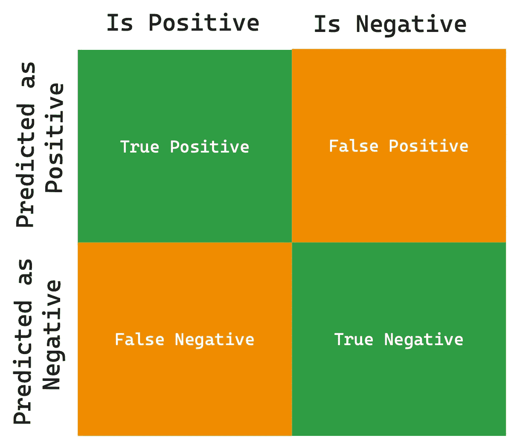

作者提供的图片

> 对于任何分类或预测问题，只有两种结果：真或假。

因此，评估预测或分类算法性能的每个度量标准都基于这两项指标。实现这一点的最简单度量标准是**准确率**。

## 准确率

在分类和预测的背景下，准确率表示正确预测的实例在总实例中的比例。这是对模型预测性能非常直接和直观的度量标准。

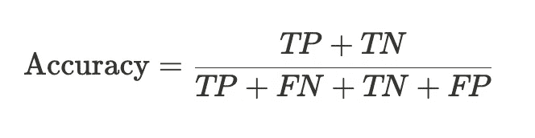

作者提供的图片

**然而，准确率真的足够吗？**

虽然准确率是评估模型表现的一个良好一般指标，但当我们查看下面的表格时，它的不足之处变得显而易见。该表展示了四个模型的性能指标，每个模型的结果都有些次优，但这些模型都表现出高准确率。例如，在第一和第二个案例中，明显存在对某一类别的偏倚，导致对不常见类别的分类结果不佳，但准确率为 90%，这非常具有误导性。

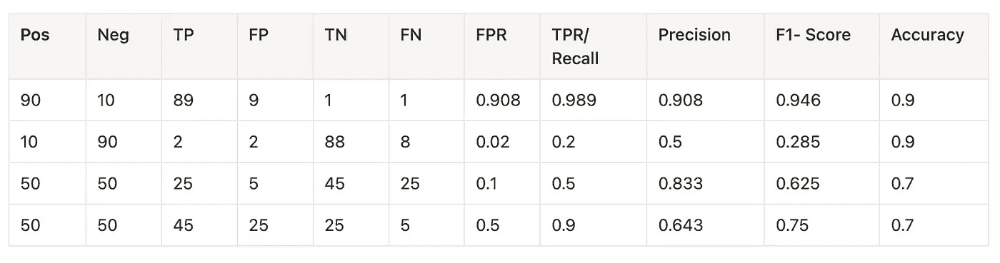

作者提供的图像

这帮助我们得出结论：

> 尽管准确率很有价值，但它有时会误导，尤其是在类别不平衡的场景中或某些错误具有重大后果时。

例如，在漏掉正例（类型 2 错误）或错误识别负例（类型 1 错误）的代价高昂的情况下，单靠准确率可能无法全面评估模型的有效性。

准确率的优点在于其简单性以及在各个类别中的适用性。

现在，考虑到准确率，让我们深入探索预测和分类的领域，几个问题出现了：

+   我们的目标是什么？

+   我们的数据是否平衡？

+   我们是否优先考虑一个类别而非另一个类别？

+   我们倾向于避免假正例（类型 2 错误），还是强调最小化假负例（类型 1 错误）？

在提出这些问题之后，仅根据准确率评估模型性能似乎有些微不足道，因此我们将注意力转向评估模型性能的其他三个指标，即精确度、召回率和 F1 分数。

# 精确度

精确度衡量模型在识别特定类别（通常是积极类别）时的准确性。它衡量了对该类别预测的可靠性。

考虑一个场景，其中机器学习算法基于借款人特征预测贷款批准。虽然偶尔对合格候选人的贷款拒绝（假负例）可能对公司是可以接受的，但主要问题是避免对那些不应获得贷款的人（假正例）做出不必要的批准。

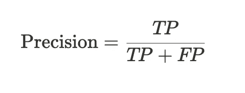

作者提供的图像

从本质上讲，精确度旨在最小化类型 2 错误——那些应被拒绝但错误被接受的实例。

让我们通过返回到我们的表格来演示这一点：


作者提供的图像

我们从案例 1 和 3 中观察到，当特定（积极）类别的真正正例与假正例的比例较大时，可以实现更高的精确度，而不管实际的模型表现如何。因此，

> 对于特定类别，高精确度意味着低类型 2 错误。

接下来，我们有一个精确度的对应物来处理类型 1 错误：

# 召回率、敏感度或 TPR

召回率与精确率一样，关注的是我们对特定类别的预测能力。它量化了我们从整个池中准确选择属于特定类别的实例的能力。

考虑一个场景，其中我们模型的目标是防止信用欺诈。我们可能可以处理将非欺诈性活动标记为欺诈性（假阳性）的情况，但我们不希望遗漏可能实际上是欺诈的活动（假阴性）。

在这种情况下，追求高召回率涉及到最小化 Type 1 错误——确保尽可能捕捉到所有相关实例，即使这意味着标记一些无辜的实例。

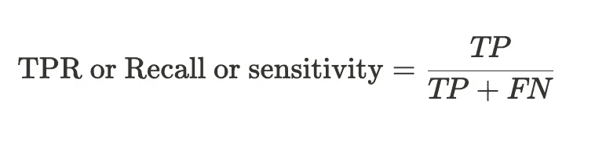

图片由作者提供

让我们第三次回到我们的表格：


图片由作者提供

从案例 1 和 4 中我们可以看到，当最大化正分类时，召回率表现优异。在这些情况下，即使存在假阳性或负类别的表现不佳，召回率仍然很高。因此，

> 对于特定类别，高召回率确保了 Type 1 错误的最小化。

**现在，如果我们旨在最小化类别的两种错误类型呢？**

这就是 F1 得分发挥作用的地方：

## F1-得分

F1-得分是精确率和召回率的调和平均数。F1 得分本质上试图在类别的精确率和召回率之间找到平衡，并在这种方式中也尝试平衡 Type 1 和 Type 2 错误。

从本质上讲，F1 得分展示了分类模型在特定类别上的整体有效性。

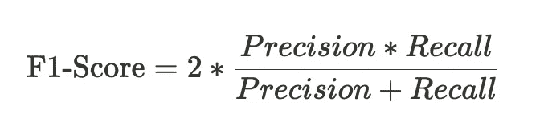

图片由作者提供

让我们从第四个也是最后一个角度回到我们的表格：


图片由作者提供

这一次，我们观察到，当精确率和召回率都表现优异时，F1 得分表现良好，这在案例 1 中是正确的。注意，尽管模型在这种情况下的表现仍然不够理想，但由于真正的正例数量很高，而假阳性和假阴性的数量都很小，因此 F1 得分很高。因此，我们可以推断，

> 高 F1 得分对于特定类别来说更为保守，可以最小化 Type 1 和 Type 2 错误。

在检查了其他指标后，很明显每个指标都有其局限性。此外，与准确率不同，F1、精确率和召回率并不具备类无关性，而准确率仍然容易受到类不平衡的影响。

此外，我们从未提出过这样的问题：“预测阈值是多少？”换句话说，类别之间是否存在明显的分界？正实例的预测分数是集中在 0.8-0.9 之间，还是更接近 0.51？

这就是 ROC 曲线和 AUC 得分发挥作用的地方，尽管这些方法有一定程度的直观性不足。

# 理解 AUC 得分

AUC 分数，也称为曲线下面积，是通过计算接收者操作特征（ROC）曲线下的面积来衡量的分数。

ROC 曲线是一个图表，y 轴为召回率/真阳性率（TPR），x 轴为假阳性率（FPR）。ROC 的名字源于其在电气工程领域的起源。

为了构造 ROC 曲线，需要计算不同分类阈值下的 FPR 和 TPR。分类阈值指的是预测值，例如 0.5，超过该值的实例被分类为正类，而低于 0.5 的实例则被分类为负类。

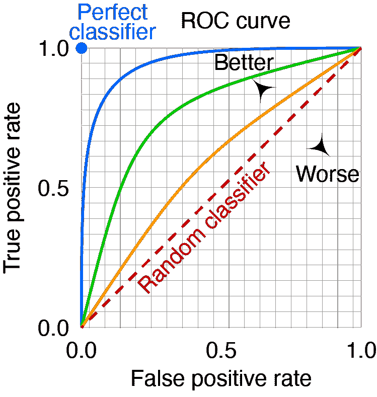

由 cmglee 和 MartinThoma 制作 — Roc-draft-xkcd-style.svg，CC BY-SA 4.0，[`commons.wikimedia.org/w/index.php?curid=109730045`](https://commons.wikimedia.org/w/index.php?curid=109730045)

然而，由于创建完整的曲线可能会很繁琐且无法提供量化的衡量，因此测量曲线下的面积（AUC）成为了更常用的做法。

下面，我展示了通过绘制 FPR 与 TPR 值的进展，以显示 ROC 曲线的创建过程。我将每个新添加的点标记为红色，而之前的点标记为蓝色。我们可以看到，当这些独立的点连接起来时，曲线与上图中的浅蓝色曲线非常相似，并且与模型的 AUC 分数 0.91 一致。

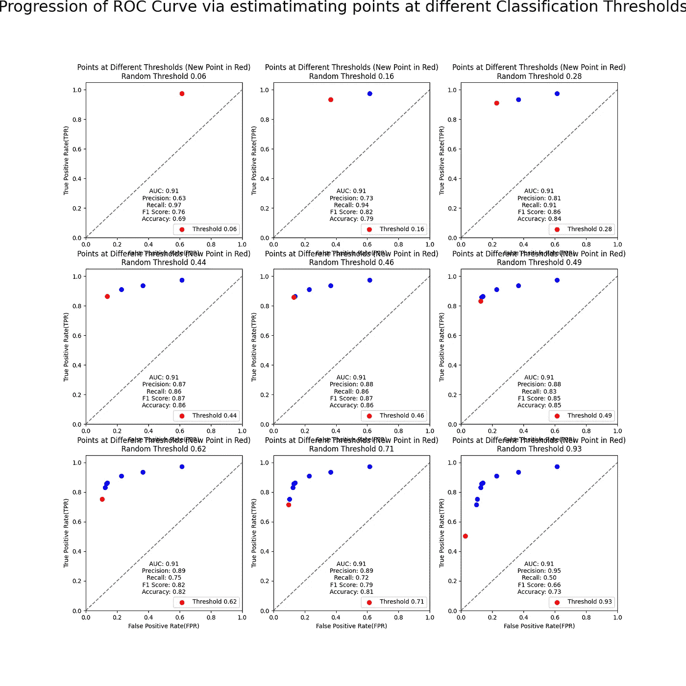

作者提供的图片

图中还展示了阈值的变化如何影响其他指标，如准确率、F1 分数、精确度和召回率。

用于创建上述图形的代码如下：

```py
 import numpy as np
import matplotlib.pyplot as plt
from sklearn.datasets import make_classification
from sklearn.model_selection import train_test_split
from sklearn.linear_model import LogisticRegression
from sklearn.metrics import confusion_matrix, roc_curve, auc, f1_score, accuracy_score

# Synthetic dataset
X, y = make_classification(n_samples=1000, n_features=20, random_state=42)

# Train/test data split
X_train, X_test, y_train, y_test = train_test_split(X, y, test_size=0.3, random_state=42)

# LR Model training
model = LogisticRegression()
model.fit(X_train, y_train)

# Model Predictions
y_probs = model.predict_proba(X_test)[:, 1]

# Generating Random thresholds for creating ROC Curve
num_thresholds = 9
random_thresholds = np.sort(np.random.rand(num_thresholds))

# Visualization
fig, axes = plt.subplots(3, 3, figsize=(16, 16))
axes = axes.flatten()

for i, threshold in enumerate(random_thresholds):
    ax = axes[i]
    for t in random_thresholds[:i+1]:
        y_pred = (y_probs >= t).astype(int)
        tn, fp, fn, tp = confusion_matrix(y_test, y_pred).ravel()
        fpr = fp / (fp + tn)
        tpr = tp / (tp + fn)
        color = 'red' if t == threshold else 'blue'
        label = f'Threshold {t:.2f}' if t == threshold else None
        ax.scatter(fpr, tpr, color = color, label = label, s = 50)

    ax.plot([0, 1], [0, 1], color = 'gray', linestyle = '--')
    ax.set_xlim([0.0, 1.0])
    ax.set_ylim([0.0, 1.05])
    ax.set_xlabel('False Positive Rate(FPR)')
    ax.set_ylabel('True Positive Rate(TPR)')
    ax.set_title(f'Points at Different Thresholds (New Point in Red)\nRandom Threshold {threshold:.2f}')
    ax.legend(loc = "lower right")

    # Calculating AUC Score
    fpr, tpr, _ = roc_curve(y_test, y_probs)
    roc_auc = auc(fpr, tpr)

    # Calculating precision, recall, F1 score, and accuracy
    precision = tp / (tp + fp)
    recall = tp / (tp + fn)
    f1 = f1_score(y_test, y_pred)
    accuracy = accuracy_score(y_test, y_pred)

    # Displaying other metrics for various classification thresholds
    metrics_text = f'AUC: {roc_auc:.2f}\nPrecision: {precision:.2f}\nRecall: {recall:.2f}\nF1 Score: {f1:.2f}\nAccuracy: {accuracy:.2f}'
    ax.text(0.5, 0.1, 
            metrics_text, 
            transform=ax.transAxes, 
            fontsize=10, 
            va='bottom', 
            ha='center')

plt.suptitle('Progression of ROC Curve via estimatimating points at different Classification Thresholds', size = 26, y=1)
# plt.savefig('ROC.png')
plt.tight_layout()
plt.show()
```

这段代码展示了如何使用 Python 创建 ROC 曲线并计算 AUC 分数。它包括生成一个合成数据集，将其拆分为训练集和测试集，训练一个逻辑回归模型，然后绘制不同分类阈值下的 ROC 曲线点。

**一个题外话：如果换成真负率与假负率对比会有什么影响吗？**

不，因为 TNR = 1-FPR 和 FNR = 1-TPR

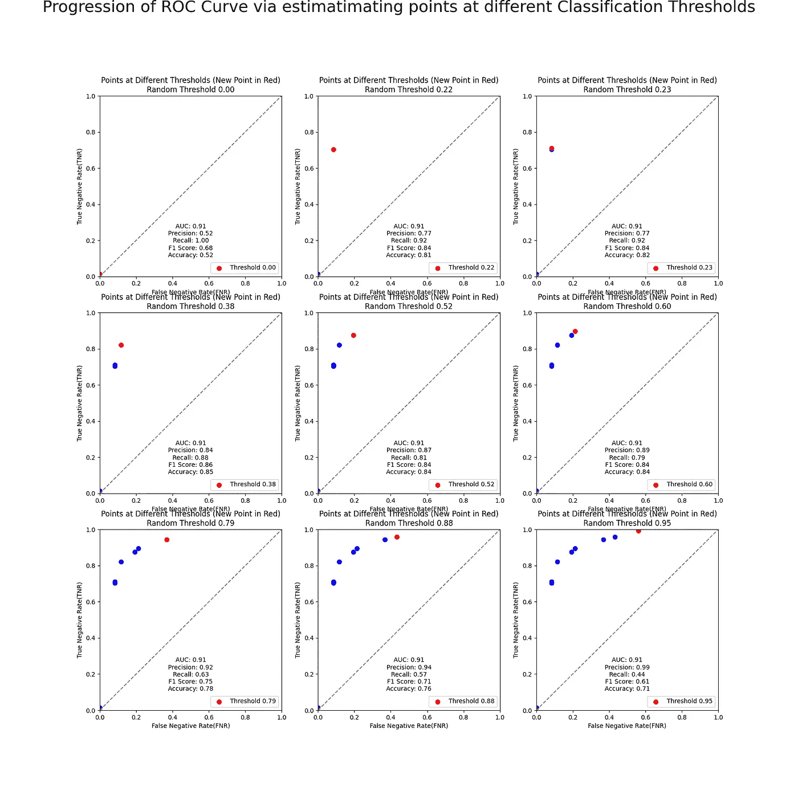

作者提供的图片

## 多类别情况如何？

因为 ROC 曲线一次只能计算两个类别，所以对于多个类别来说会稍显复杂，但可以对每个类别进行一对多的比较。

现在我们已经了解了 AUC 分数的构造方式，让我们更深入地探讨如何解释 AUC 分数及其对模型的意义。

# 解释 AUC 分数

我们将查看 4 种情况，我通过图片展示了在分类阈值右侧的所有数据被预测为正类，而左侧的数据被预测为负类。数据的实际标签在各自的矩形框中表示。

## 0 AUC 分数

AUC 分数为 0 将很难达到，并且可能指向一些严重的人为错误。这意味着 TPR 在每个分类阈值下都是 0，除非 FPR 为 1。在 FPR 为 1 时，TPR 在不同的分类阈值下从 0 到 1，这使得曲线下的面积有效地为 0。视觉上，这将意味着存在完美的类别分离，但每个标签都被反转了。

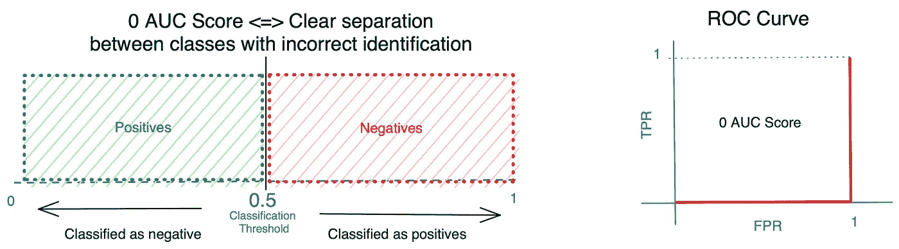

图片由作者提供

## **0.5 AUC 分数**

现在这是模型没有学到任何东西，分类或预测仅仅是随机的情况。在这种情况下，ROC 曲线显示了 TPR 和 FPR 之间的线性关系或直线比例线。视觉上，它看起来好像完全没有类别分离。

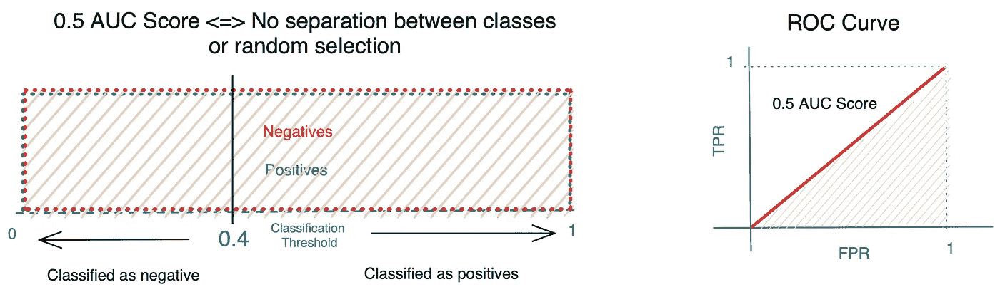

图片由作者提供

**0.5 < AUC 分数 < 1**

如果我们在模型中正确操作，这些是最常见的情况。AUC 分数在 0.5 到 1 之间意味着模型至少学到了一些优于随机分类器的东西，但数据中仍然存在重叠实例，模型无法完全有效地分离类别。AUC 分数越接近 1，类别之间的分离程度就越大。

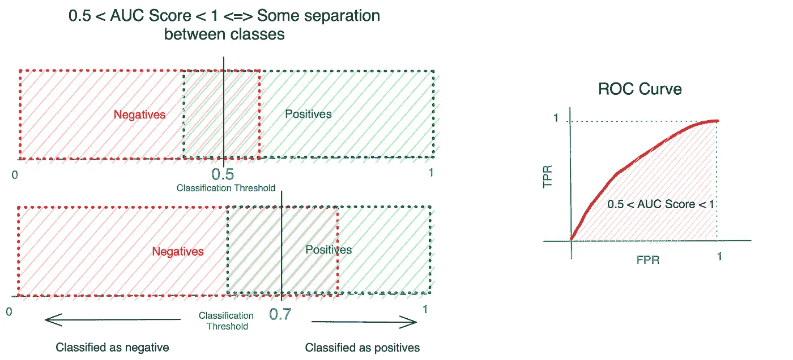

图片由作者提供

**完美的 AUC 分数**

完美的 AUC 分数 1.0 表示模型具有完美的区分能力。然而，达到如此完美的 AUC 分数确实可能是潜在过拟合和不切实际的模型行为的标志，尤其是在处理现实世界数据集和场景时。

除非 FPR 为 0，否则 TPR 在所有情况下都有效为 1。最终导致曲线下的面积等于 1。这在视觉上意味着两个类别之间有完美的类别分离，并且预测也是正确的。

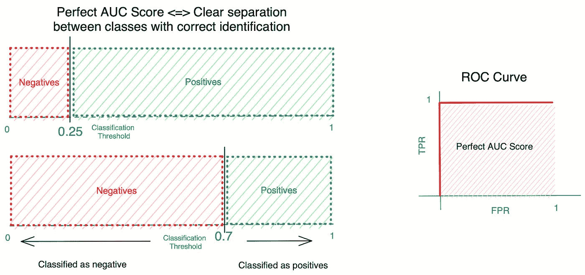

图片由作者提供

重要的是要注意，现实世界的数据通常是嘈杂的并且包含固有的不确定性。期望一个模型产生完美的分离可能是不现实的，即使它发生了，这也可能是过拟合的情况。

> 如果达到了不太可能的 AUC 分数 1，模型可能会由于过拟合的高概率而无法有效地进行泛化，并在实际场景中表现良好。

一个更平衡和稳健的模型是一个在达到合理高的 AUC 分数的同时，还允许一定程度的不确定性。

让我们看看使用 AUC 分数的一些好处。

# AUC 分数的好处

与其他指标相比，AUC 分数有很多好处

1.  **与类别无关：** 与依赖于选定正类的精度、召回率和 F1 分数等指标相比，AUC 提供了对模型区分能力的更全面评估，而不受类别分布的影响。

1.  **预测阈值无关性：** AUC 评分的一个显著特点是它考虑了模型在不同分类阈值下的表现，提供了其区分类别能力的全面视图。

1.  **对类别不平衡不敏感：** 由于 AUC 衡量模型如何相对排序正负实例，它不容易受到类别分布不平衡引起的扭曲。

1.  **ROC 曲线阈值选择：** 尽管 AUC 不受阈值影响，但 ROC 曲线本身可以帮助你直观地选择一个提供最佳性能的阈值。

# AUC 评分的缺点

虽然没有很多缺点，而且这不是一个详尽的列表，但需要注意的是，在数据极度不平衡的情况下，AUC 评分可能会受到影响。此外，AUC 对所有误分类一视同仁。在许多现实世界的场景中，不同类型错误相关的成本和收益可能会有所不同。AUC 没有考虑这些因素，可能无法完全代表在某种错误比另一种更为关键的情况下的性能。

# 总结

因此，让我们总结一下，虽然 AUC 评分是评估模型性能的一个极佳指标，但每个指标在合适的上下文中都有其优点。

在结束时，我希望这篇文章对你有价值，并希望你能清楚地理解 AUC 评分是什么以及如何解读它。

如果你觉得这很有启发性，请在评论中告诉我。:)

## AUC 评分的其他资源……

[## 魔术师角落：9\. 机器学习模型性能指标](https://www.ncbi.nlm.nih.gov/pmc/articles/PMC8204137/?source=post_page-----5f2505eb499f--------------------------------)

### “没有解决方案，只有权衡。”在之前的文章中，我们展示了如何处理图像和……

[## CS 229 — 机器学习技巧和窍门备忘单](https://stanford.edu/~shervine/teaching/cs-229/cheatsheet-machine-learning-tips-and-tricks?source=post_page-----5f2505eb499f--------------------------------)

### 斯坦福大学研究生 Shervine Amidi 的教学页面。

[## 什么是好的 AUC 评分？ - Statology](https://www.statology.org/what-is-a-good-auc-score/?source=post_page-----5f2505eb499f--------------------------------)

### 本教程解释了什么被认为是 AUC（曲线下面积）的好值，包括几个示例。

[## 统计学](https://www.statology.org/what-is-a-good-auc-score/?source=post_page-----5f2505eb499f--------------------------------)
