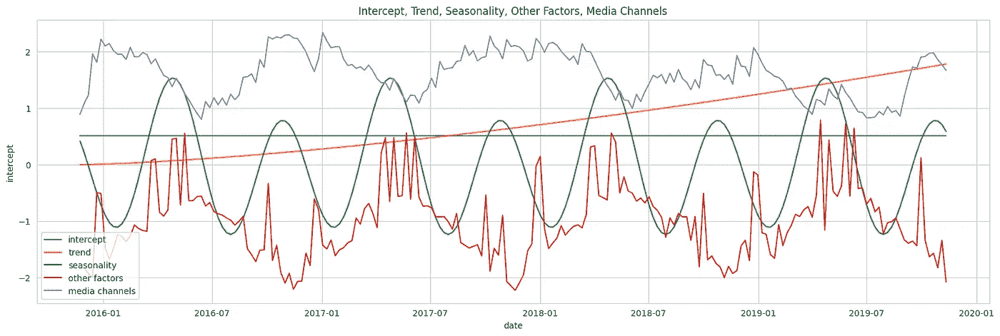

# 了解贝叶斯市场营销组合建模：深入探讨先验规格

> 原文：[`towardsdatascience.com/understanding-bayesian-marketing-mix-modeling-a-deep-dive-into-prior-specifications-af400adb836e?source=collection_archive---------2-----------------------#2023-06-24`](https://towardsdatascience.com/understanding-bayesian-marketing-mix-modeling-a-deep-dive-into-prior-specifications-af400adb836e?source=collection_archive---------2-----------------------#2023-06-24)

## 探索使用 Google 的 LightweightMMM 进行模型规格化

[](https://medium.com/@slavax?source=post_page-----af400adb836e--------------------------------)[](https://towardsdatascience.com/?source=post_page-----af400adb836e--------------------------------) [Slava Kisilevich](https://medium.com/@slavax?source=post_page-----af400adb836e--------------------------------)

·

[关注](https://medium.com/m/signin?actionUrl=https%3A%2F%2Fmedium.com%2F_%2Fsubscribe%2Fuser%2Fba0d56f8b910&operation=register&redirect=https%3A%2F%2Ftowardsdatascience.com%2Funderstanding-bayesian-marketing-mix-modeling-a-deep-dive-into-prior-specifications-af400adb836e&user=Slava+Kisilevich&userId=ba0d56f8b910&source=post_page-ba0d56f8b910----af400adb836e---------------------post_header-----------) 发表在[Towards Data Science](https://towardsdatascience.com/?source=post_page-----af400adb836e--------------------------------) · 8 分钟阅读·2023 年 6 月 24 日[](https://medium.com/m/signin?actionUrl=https%3A%2F%2Fmedium.com%2F_%2Fvote%2Ftowards-data-science%2Faf400adb836e&operation=register&redirect=https%3A%2F%2Ftowardsdatascience.com%2Funderstanding-bayesian-marketing-mix-modeling-a-deep-dive-into-prior-specifications-af400adb836e&user=Slava+Kisilevich&userId=ba0d56f8b910&source=-----af400adb836e---------------------clap_footer-----------)

--

[](https://medium.com/m/signin?actionUrl=https%3A%2F%2Fmedium.com%2F_%2Fbookmark%2Fp%2Faf400adb836e&operation=register&redirect=https%3A%2F%2Ftowardsdatascience.com%2Funderstanding-bayesian-marketing-mix-modeling-a-deep-dive-into-prior-specifications-af400adb836e&source=-----af400adb836e---------------------bookmark_footer-----------)

图片由[Pawel Czerwinski](https://unsplash.com/@pawel_czerwinski?utm_source=medium&utm_medium=referral)拍摄，发布在[Unsplash](https://unsplash.com/?utm_source=medium&utm_medium=referral)

贝叶斯营销混合建模越来越受到关注，特别是随着 [LightweightMMM](https://lightweight-mmm.readthedocs.io/en/latest/index.html)（Google）或 [PyMC Marketing](https://www.pymc-marketing.io)（PyMC Labs）等开源工具的发布。尽管这些框架简化了贝叶斯建模的复杂性，但用户仍需理解基本的贝叶斯概念，并能够理解模型规范。

在这篇文章中，我以 Google 的 LightweightMMM 作为实际示例，展示了该框架先验规范的直观性和含义。我演示了如何使用 Python 和 scipy 库进行先验样本的模拟。

# 数据

我使用 [Robyn](https://github.com/facebookexperimental/Robyn) 在 MIT 许可证下提供的数据。

数据集包含 208 周的收入数据（从 2015–11–23 到 2019–11–11），包括：

+   5 个媒体支出渠道：**tv_S，ooh_S，print_S，facebook_S，search_S**

+   2 个媒体渠道也具有曝光信息（印象，点击量）：facebook_I，search_clicks_P

+   无支出的有机媒体：**newsletter**

+   控制变量：**事件，假期**，竞争对手销售（**competitor_sales_B**）

# LightweightMMM 模型规范

[LightweightMMM 模型](https://lightweight-mmm.readthedocs.io/en/latest/models.html#)的规范定义如下：


LMMM 模型规范（作者提供的图像）

这个规范表示一个加性线性回归模型，该模型解释特定时间点 *t* 的响应（目标变量）值。

让我们分解方程中的每个组件：

+   **α**：这个组件表示响应的截距或基线值。它是当其他因素为零时响应的预期值。

+   ***趋势***：这个组件捕捉响应随时间的增加或减少趋势。

+   ***季节性***：这个组件表示响应的周期性波动。

+   ***媒体渠道***：这个组件考虑了媒体渠道（电视、广播、在线广告）对响应的影响。

+   ***其他因素***：这个组件包括任何其他对响应有影响的变量，如天气、经济指标或竞争对手活动。

接下来，我将详细介绍每个组件，并解释如何解释先验规范。请记住，先验分布是对某个参数的假设分布，而没有任何关于底层数据的知识。

## 截距


截距先验规范（作者提供的图像）

截距定义为遵循标准差为 2 的半正态分布。半正态分布是一种连续概率分布，类似于正态分布，但仅限于正值。该分布由一个参数（标准差（尺度））来表征。半正态分布意味着截距只能取正值。

以下代码生成截距的先验分布样本，并可视化标准差为 2 的半正态分布的概率密度函数（PDF）。有关其他组件的可视化，请参阅附带的[Github repo](https://github.com/slavakx/medium_posts)中的源代码。

```py
from scipy import stats

scale = 2
halfnormal_dist = stats.halfnorm(scale=scale)
samples = halfnormal_dist.rvs(size=1000)

plt.figure(figsize=(20, 6))
sns.histplot(samples, bins=50, kde=False, stat='density', alpha=0.5)
sns.lineplot(x=np.linspace(0, 6, 100), 
      y=halfnormal_dist.pdf(np.linspace(0, 6, 100)), color='r')

plt.title(f"Half-Normal Distribution with scale={scale}")
plt.xlabel('x')
plt.ylabel('P(X=x)')
plt.show()
```


半正态分布（图像由作者提供）

## 趋势


趋势规范（图像由作者提供）

趋势定义为时间 *t* 与趋势值之间的幂律关系。参数 *μ* 代表趋势的幅度或大小，而 *k* 控制趋势的陡度或曲率。

参数 *μ* 从均值为 0、标准差为 1 的正态分布中抽取。这意味着 *μ* 遵循标准正态分布，以 0 为中心，标准差为 1。正态分布允许 *μ* 取正值和负值，分别表示向上或向下的趋势。

参数 *k* 从 0.5 到 1.5 的均匀分布中抽取。均匀分布确保 *k* 取值可以产生合理且有意义的趋势曲率。

下图展示了从先验分布中获得的独立组件：截距和趋势的样本，每个组件单独表示。


趋势和截距（图像由作者提供）

## 季节性


季节性规范（图像由作者提供）

每个组件 γ 从均值为 0、标准差为 1 的正态分布中抽取。

通过将不同 γ 的余弦和正弦函数结合，可以模拟周期模式以捕捉数据中的[季节性](https://en.wikipedia.org/wiki/Seasonality)。余弦和正弦函数表示在 52 个单位（周）的周期内观察到的振荡行为。

下图展示了从先验分布中获得的季节性、截距和趋势的样本。


季节性、趋势和截距（图像由作者提供）

## 其他因素（控制变量）


其他因素规范（图像由作者提供）

每个因子系数 *λ* 取自均值为 0 和标准差为 1 的正态分布，这意味着 *λ* 可以取正值或负值，代表每个因子对结果的影响方向和幅度。

下图描绘了从先验分布中获得的独立组件：一个拦截项、趋势、季节性和控制变量（*竞争对手销售 _B, 新闻通讯, 节假日和活动*），每个组件都单独表示。


其他因素（合并）（图像由作者提供）

## 媒体渠道


媒体渠道的先验规范（图像由作者提供）

媒体渠道 *m* 的 *β* 系数的分布被指定为半正态分布，其中标准差参数 *v* 由与媒体渠道 *m* 相关的总成本的总和确定。总成本反映了分配给该特定媒体渠道的投资或资源。

## 媒体变换


Adstock 和 Hill 饱和规范（图像由作者提供）

在这些方程中，我们使用一系列变换（如 adstock 和 Hill 饱和）来建模媒体渠道的行为。

[](/modeling-marketing-mix-using-pymc3-ba18dd9e6e68?source=post_page-----af400adb836e--------------------------------) ## 使用 PyMC3 建模营销组合

### 实验先验、数据标准化，并将贝叶斯建模与 Robyn、Facebook 的开源 MMM 进行比较……

[towardsdatascience.com

变量 *媒体渠道* 代表了在时间点 *t* 上经过变换后的媒体渠道。它是通过对原始媒体渠道值 *x* 应用变换获得的。Hill 变换由参数 *K*（半饱和点，0 < k ≤ 1）和控制曲线陡峭度的形状参数 *S*（s > 0）来控制。

变量 *x*∗ 代表在经过 adstock 变换后的时间 *t* 上的变换媒体渠道值。它是通过将当前原始媒体渠道值加到前一个变换值与 adstock 衰减参数 *λ* 的乘积来计算的。

参数 *K* 和 *S* 遵循 gamma 分布，形状和尺度参数均设置为 1，而 *λ* 遵循 beta 分布，形状参数为 2 和 1。

Hill 饱和参数 *K* 和 *S* 的概率密度函数如下图所示：

```py
shape = 1
scale = 1

gamma_dist = stats.gamma(a=shape, scale=scale)
samples = gamma_dist.rvs(size=1000)

plt.figure(figsize=(20, 6))
sns.histplot(samples, bins=50, kde=False, stat='density', alpha=0.5)
sns.lineplot(x=np.linspace(0, 6, 100), y=gamma_dist.pdf(np.linspace(0, 6, 100)), color='r')

plt.title(f"Gamma Distribution for $K_m$ and $S_m$ with shape={shape} and scale={scale}")
plt.xlabel('x')
plt.ylabel('P(X=x)')

# Show the plot
plt.show()python
```


Gamma 分布（图像由作者提供）

adstock 参数 *λ* 的概率密度函数如下图所示：


Beta 分布（图像由作者提供）

**关于 adstock 参数 *λ* 的说明：**

Beta(α = 2, β = 1) 分布的概率密度函数呈现正趋势，表明较高的值具有更高的概率密度。在媒体分析中，不同的行业和媒体活动可能显示出不同的衰减率，大多数媒体渠道通常表现出较小的衰减率。例如，Robyn 提出了常见媒体渠道 λ 衰减的以下范围：电视 (0.3–0.8)、户外广告/印刷/广播 (0.1–0.4)、数字媒体 (0–0.3)。

在 Beta(α = 2, β = 1) 分布的背景下，较高的概率分配给接近 1 的 λ 值，而较低的概率分配给接近 0 的值。因此，相较于接近区间 [0, 1] 下端的结果，接近上端的结果更有可能发生。

或者，在[具有延续性和形状效应的贝叶斯媒体混合建模方法](https://static.googleusercontent.com/media/research.google.com/en//pubs/archive/46001.pdf)中，衰减参数被定义为 Beta(α = 3, β = 3)，其概率密度函数如下图所示。该分布在 0.5 附近对称，表明在区间 [0, 1] 的两端和中间位置观察到结果的可能性相等。


Beta(3,3)（图片由作者提供）

下图描绘了从先验分布中获得的各个独立组件：截距、趋势、季节性、控制变量和媒体渠道的样本，每个组件单独表示。



所有模型组件（图片由作者提供）

## 组合所有组件

如前所述，LightweightMMM 通过结合截距、趋势、季节性、媒体渠道及其他从其先验分布中抽样的因素来模拟加性线性回归，从而获得预测响应。下图可视化了真实响应和从先验预测分布中抽样得到的预期响应。

将单个样本与真实响应值进行可视化，可以观察模型的预测与实际结果在特定参数值集下的比较。这可以直观地理解模型在该特定实例中的表现。


收入：真实与先验（图片由作者提供）

## 先验预测检查

为了获得更稳健的洞见，一般建议从先验预测分布中多次抽样并测量不确定性。先验预测检查有助于评估所选择模型的充分性，并在观察任何实际数据之前评估模型的预测是否符合我们的预期。

下面描绘的图表通过显示每个点的预期收入（均值）以及不确定性度量来可视化先验预测分布。我们可以看到真实收入落在标准差范围内，这表明模型规格适合观察到的数据。


先验预测检查（图片由作者提供）

# 结论

贝叶斯营销组合建模可能需要相当多的时间来掌握。希望这篇文章能帮助你提高对先验分布和贝叶斯营销模型规格的理解。

完整的代码可以从我的[Github repo](https://github.com/slavakx/medium_posts)下载。

感谢阅读！
