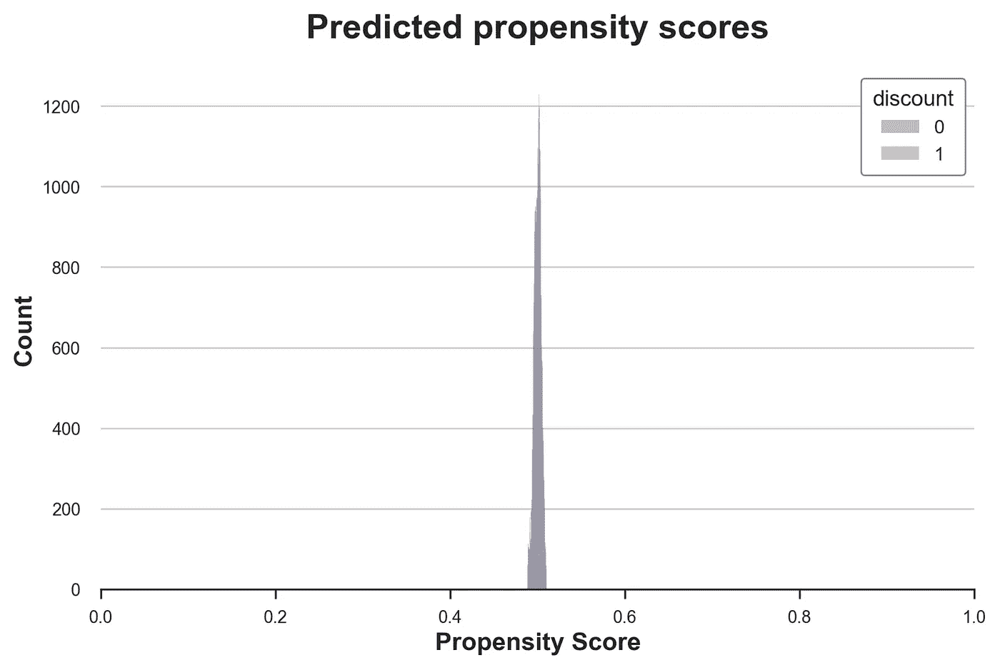
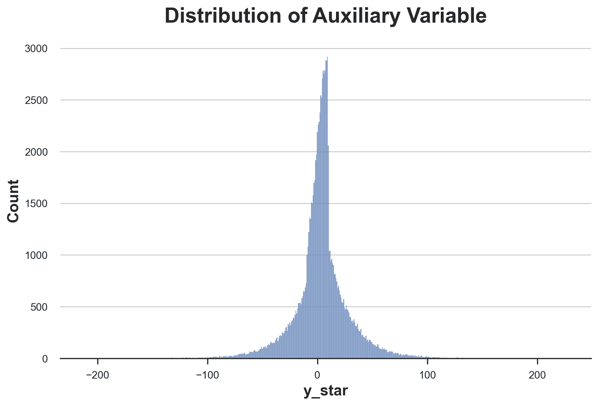
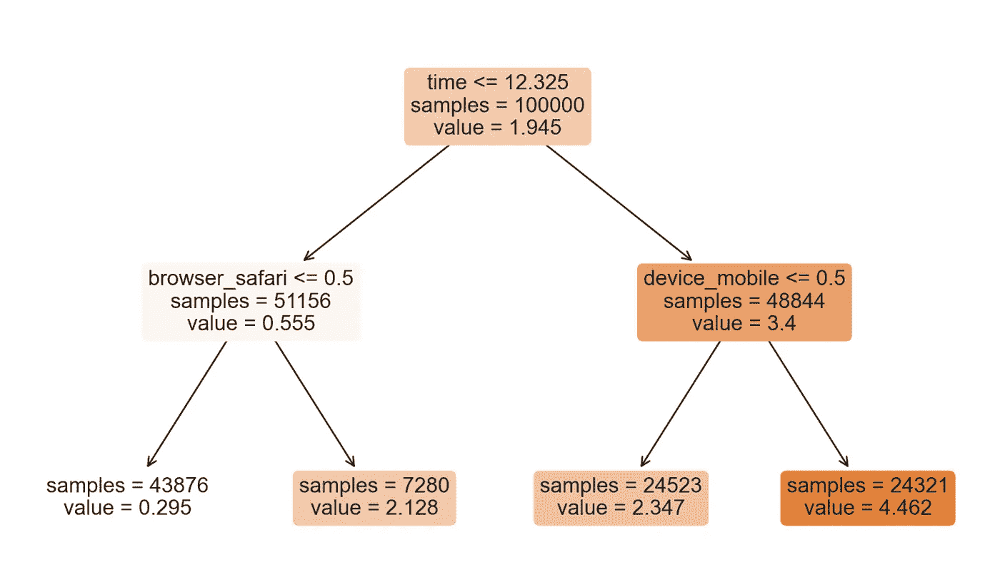
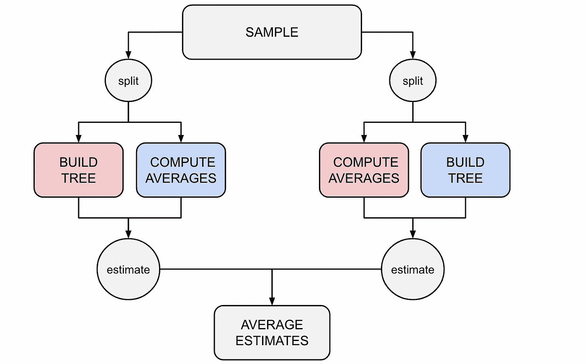
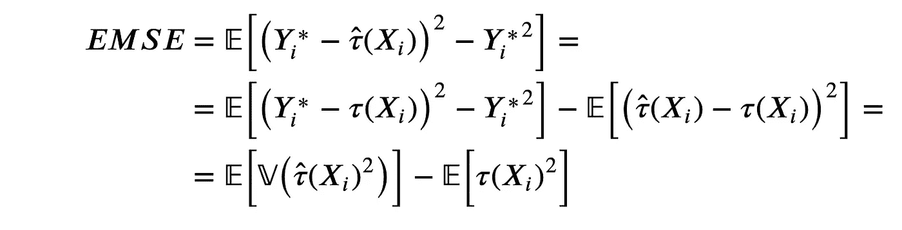
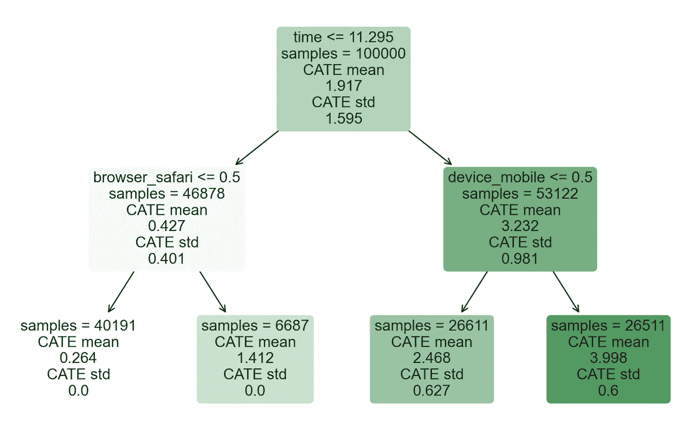
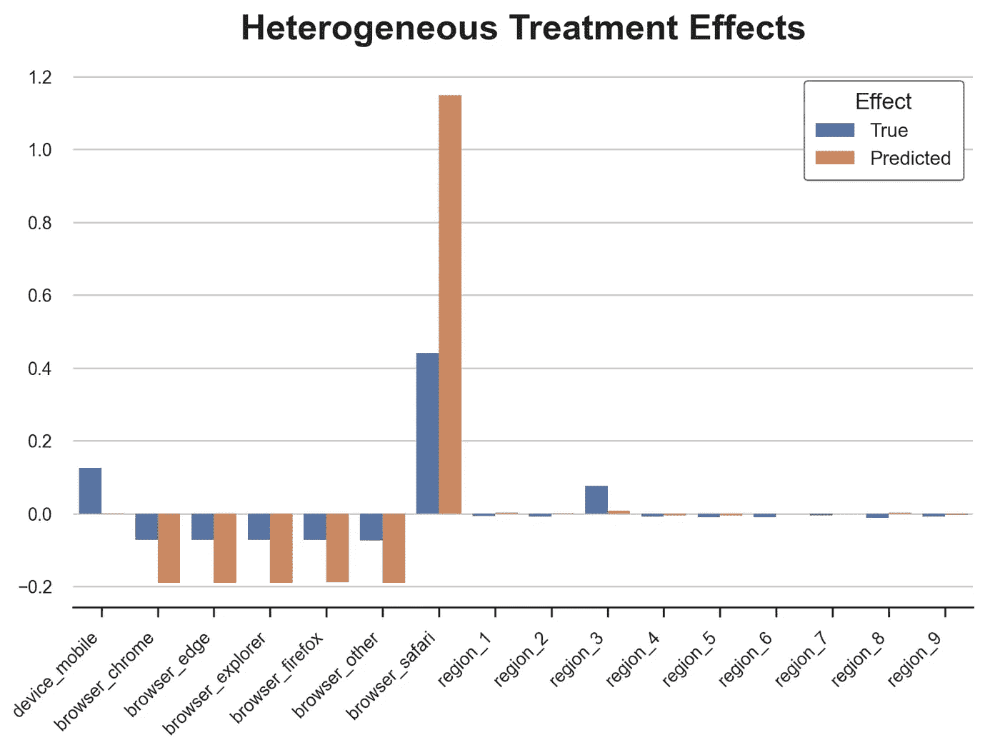
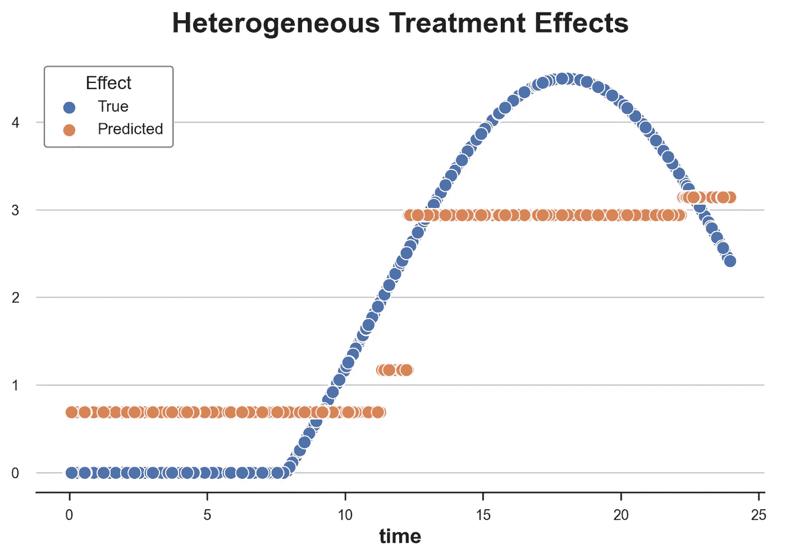

# 理解因果树

> 原文：[`towardsdatascience.com/understanding-causal-trees-920177462149`](https://towardsdatascience.com/understanding-causal-trees-920177462149)

## [因果数据科学](https://towardsdatascience.com/tagged/causal-data-science)

## *如何使用回归树来估计异质性处理效应*

 [Matteo Courthoud](https://medium.com/@matteo.courthoud?source=post_page-----920177462149--------------------------------)

·发表于 [Towards Data Science](https://towardsdatascience.com/?source=post_page-----920177462149--------------------------------) ·阅读时间 15 分钟·2023 年 2 月 3 日

--

封面，图片由作者提供

在因果推断中，我们通常关注的是估计处理（药物、广告、产品等）对感兴趣结果（疾病、公司收入、客户满意度等）的因果效应。然而，知道处理在平均情况下有效通常是不够的，我们希望了解对哪些对象（患者、用户、客户等）效果更好或更差，即我们希望估计**异质性处理效应**。

估计异质性处理效应使我们能够通过**目标定位**选择性地和更有效地使用处理。了解哪些客户更可能对折扣做出反应可以使公司通过提供更少但更精准的折扣来节省开支。这同样适用于负面效应：知道哪些患者对某种药物有副作用可以使制药公司警告或将他们排除在治疗之外。估计异质性处理效应还有一个更微妙的优势：了解**谁**对处理有效可以帮助我们更好地理解**如何**处理有效。知道折扣的效果不依赖于接受者的收入而是依赖于其购买习惯，告诉我们也许这不仅仅是钱的问题，而是关注度或忠诚度的问题。

在本文中，我们将探讨使用回归树（及其森林）改进版来估计异质性处理效应。从机器学习的角度来看，**因果树与预测树之间有两个基本差异**。首先，目标是处理效应，这本质上是一个不可观察的对象。其次，我们关注的是进行推断，这意味着量化我们估计的不确定性。

# 在线折扣与目标定位

在文章的其余部分，我们将使用一个示例进行说明：假设我们是一个**在线商店**，并且我们希望了解是否对新客户提供折扣会增加他们的支出。特别是，我们希望知道对某些客户提供折扣是否比对其他客户更有效，因为我们不希望对那些即使没有折扣也会消费的客户进行折扣。此外，向客户发送弹窗广告可能会让他们反感，从而产生相反的效果。

图片由作者使用[NightCafé](https://creator.nightcafe.studio/)生成

为了了解折扣的效果以及效果的大小，我们进行了一项**A/B 测试**：每当一个新用户访问我们的在线商店时，我们会随机决定是否向他们提供折扣。我从`[src.dgp](https://github.com/matteocourthoud/Blog-Posts/blob/main/notebooks/src/dgp.py)`导入数据生成过程`dgp_online_discounts()`。与之前的文章相比，我生成了一个新的 DGP 父类来处理随机化和数据生成，而其子类包含具体的使用案例。我还从`[src.utils](https://github.com/matteocourthoud/Blog-Posts/blob/main/notebooks/src/utils.py)`导入了一些绘图函数和库。为了包括代码、数据和表格，我使用了[Deepnote](https://deepnote.com/)，这是一个类似 Jupyter 的基于 Web 的协作笔记本环境。

我们有 100,000 名网站访问者的数据，我们观察他们的`time`（时间）、使用的`device`（设备）、`browser`（浏览器）以及他们的地理`region`（区域）。我们还记录了他们是否获得了`discount`（折扣），我们的处理，以及他们的`spend`（支出），这是我们的关注点。

由于处理是随机分配的，我们可以使用简单的**均值差异**估计量来估计处理效应。我们期望处理组和对照组在`discount`（折扣）之外是相似的，因此我们可以将`spend`（支出）的任何差异归因于`discount`（折扣）。

折扣似乎有效：在处理组中，平均支出增加了 1.95 美元。但所有客户的反应是否相同？

为了回答这个问题，我们希望估计**异质处理效应**，可能在个体层面上。

## 异质处理效应

估计异质处理效应有多种方法。最常见的方法是根据一些可观察的特征将人群划分为不同的组，在我们的案例中，这些特征可以是`device`（设备）、`browser`（浏览器）或地理`region`（区域）。一旦决定了数据划分的变量，你可以简单地将处理变量（`discount`）与处理异质性的维度进行交互。以`device`为例。

我们如何解读回归结果？`discount`对客户`spend`的影响是 1.22$，但如果客户通过移动`device`访问网站，这一影响会增加至 1.44$。

对于分类变量，划分很容易，但对于像`time`这样的连续变量来说，不直观如何划分。每小时划分一次？哪个维度更具信息性？虽然很诱人尝试所有可能的划分，但我们对数据的划分越多，发现虚假结果（即在机器学习术语中，我们过拟合）的可能性就越大。如果我们能**让数据说话**并选择最小且信息量最大的划分，那就太好了。

在[另一篇文章](https://medium.com/towards-data-science/understanding-meta-learners-8a9c1e340832)中，我展示了所谓的**元学习者**如何采取这种因果推断方法。思路是根据每个观察的治疗状态预测结果，然后将预测的条件治疗结果与预测的对照结果进行比较。二者之间的差异就是个体治疗效应。

元学习者的问题在于，它们在预测结果时使用了所有的[自由度](https://en.wikipedia.org/wiki/Degrees_of_freedom_(statistics))。然而，我们感兴趣的是预测治疗效应的异质性。如果结果的大部分变异*不*在治疗维度上，我们将得到非常差的治疗效应估计。

是否可以直接集中在**个体治疗效应的预测**上？我们将*Y*定义为感兴趣的结果`spend`，*D*为治疗`discount`，以及*X*为其他可观察特征。*理想*的损失函数是

理想的损失函数，图片由作者提供

其中*τᵢ*是个体*i*的治疗效应。然而，这个目标函数是**不可行的**，因为我们无法观察到*τᵢ*。

但事实证明，有一种方法可以获得**个体治疗效应**的无偏估计。**思路**是使用一个辅助结果变量，其每个个体的期望值即为个体治疗效应。这个变量是

辅助结果变量，图片由作者提供

其中*p*(*Xᵢ*)是观察*i*的[**倾向评分**](https://en.wikipedia.org/wiki/Propensity_score_matching)，即其被治疗的概率。

在随机化实验中，倾向得分是已知的，因为随机化完全在实验者的控制之下。例如，在我们的案例中，治疗的概率是 50%。而在准实验研究中，当治疗概率未知时，需要进行估计。即使在随机化实验中，估计倾向得分总是比填补更好，因为它能防止随机化中的抽样变异。有关倾向得分及其在因果推断中的使用的更多详细信息，请参阅我在[这里](https://medium.com/towards-data-science/matching-weighting-or-regression-99bf5cffa0d9)的单独帖子。

首先，我们为类别变量`device`、`browser`和`region`生成虚拟变量。

我们拟合了一个`LogisticRegression`并用它来预测治疗概率，即构建倾向得分。

估计的倾向得分分布，图片来源：作者

正如预期的，大多数倾向得分接近 0.5，这是随机化中使用的治疗概率。此外，治疗组和对照组的分布几乎完全相同，进一步确认了随机化的有效性。如果情况不是这样，我们将需要做出进一步假设以进行因果分析。最常见的假设是**无混淆性**，也称为可忽略性或基于可观测变量的选择。简而言之，我们将假设在某些可观测变量𝑋的条件下，治疗分配是随机的。

**无混淆假设**，图片来源：作者

然而，在我们的案例中，治疗概率是已知的，并且似乎随机化过程中没有出现问题。

我们现在拥有计算辅助结果变量*Y**的所有元素。

正如我们之前所说，目的是将*Y**作为预测问题的目标，因为其期望值正好是个体治疗效果。让我们检查数据中的平均值。

确实，它的平均值几乎与之前估计的 1.94$的平均治疗效果相同。

如何在只有一个观察值和倾向得分估计的情况下估计个体治疗效果？有什么缺点？

**直观**的想法是从不同的角度来处理问题：*事前*，在实验之前。设想我们的数据集只有一个观察值，*i*。我们知道治疗概率是*p*(*Xᵢ*)，即倾向得分。因此，期望中，我们的数据集中治疗组有*p*(*Xᵢ*)个观察值，对照组有*1–p*(*Xᵢ*)个观察值。其余的照常处理：我们通过两组之间的平均结果差异来估计治疗效果！这确实是我们会做的：

辅助结果变量，图片来源：作者

唯一的区别是我们只有一个观察值。

这个技巧有一个代价：*Yᵢ* 是个体处理效应的无偏估计量，但具有非常**高的方差**。通过绘制其分布，这一点可以立即显现出来。

辅助变量的分布，图像由作者提供

我们现在准备估计**异质性处理效应**，通过将因果推断问题转化为预测问题，预测给定可观察特征*X*的辅助结果*Y*。

图像由作者使用[NightCafé](https://creator.nightcafe.studio/)生成

## 因果树

在前一节中，我们已经看到，我们可以将**异质性处理效应**的估计转化为预测问题，其中结果是辅助结果变量。

辅助结果变量，图像由作者提供

原则上，我们可以使用任何机器学习算法来估计个体处理效应。然而，[**回归树**](https://en.wikipedia.org/wiki/Decision_tree_learning)具有特别便利的特征。

首先，回归树是如何工作的？分类和回归树（CART）是基于协变量*X*递归**对数据进行分箱**的算法，使得每个箱中的结果*Y*在*箱内*尽可能同质，而*箱间*的结果尽可能异质。预测值只是每个箱中的结果平均值，在我们的情况下是*辅助*结果变量*Y*，每个观察值的期望值等于个体处理效应。因此，通过对每个箱中的*Y*进行平均，我们可以计算**条件（基于 X）的异质性处理效应** 𝔼[*τᵢ | Xᵢ*] 对于落在该箱中的观察值。

**平均化**部分是回归树推断的一个主要优势，因为我们非常清楚如何使用平均值进行推断，这要归功于[**中心极限定理**](https://en.wikipedia.org/wiki/Central_limit_theorem)。回归树相对于其他机器学习算法的第二个优势是树非常**可解释**，因为我们可以直接将数据分区绘制为树结构。我们稍后会详细了解这一点。最后但同样重要的是，截至 2022 年，回归树仍然是[表现最佳的预测算法](https://arxiv.org/abs/2207.08815)的核心。

让我们使用`sklearn`中的`[DecisionTreeRegressor](https://scikit-learn.org/stable/modules/generated/sklearn.tree.DecisionTreeRegressor.html)`函数来拟合我们的回归树，并估计`discounts`对顾客`spend`的异质性处理效应。

我们将树的最大深度限制为 2，并且每个分区（也称为*叶子*）至少包含 30 个观察值，以便我们可以轻松绘制树并可视化估计的组和处理效应。

辅助结果变量 Y*上的回归树，作者提供的图片

我们应该如何**解读**这棵树？在顶部，我们可以看到数据中的平均值*Y**为 1.945$，对应于平均处理效应。从那里开始，数据根据每个节点顶部突出显示的规则被分成不同的分支。例如，第一个节点将数据分成两个大小分别为 51,156 和 48,844 的组，具体取决于`time`是否晚于 12.325。在底部，我们有最终的分区，包含异质的处理效应。例如，最左边的叶子包含 43,876 个观察值，其中`time`早于 12.325 且`browser`不是 Safari，我们预测对`spend`的影响为 0.295$。简而言之，每个节点包含**条件平均处理效应** 𝔼[*τᵢ | Xᵢ*]的估计，其中节点颜色越深表示预测值越高。

我们应该相信这些估计吗？不完全是，因为有几个原因。**第一个问题**是，只有在*每个叶子内部*我们有相同数量的处理组和对照组单元时，我们才有平均处理效应的无偏估计。这在使用现成的`DecisionTreeRegressor()`时并非自动成立。

## 诚实树

我们的简单方法的另一个问题是我们使用了**相同的数据**来生成和评估树。这会产生偏差，因为简单的均值差异估计量不会考虑分区是内生的，即在相同的数据上生成的。用机器学习术语来说，我们是在过拟合。解决方案很简单：我们可以将样本拆分为两个独立的子样本，并使用不同的数据生成树和计算预测。这些树被称为**诚实树**。

这个解决方案既简单又有效，因为它允许我们在推断阶段，将每个叶子中的样本视为与树结构独立。此时，我们的估计量是对独立子样本的**均值差异**估计量，我们可以简单地使用中心极限定理进行推断。拆分数据的一个缺点是我们失去了[统计功效](https://en.wikipedia.org/wiki/Power_of_a_test)，即由于样本较小而无法检测到虚假的异质处理效应。解决方案是重复该过程两次，交换用于构建树和计算叶子内均值的样本。然后，我们可以对每个个体的两个估计值取平均，并相应地调整估计的标准误差。

样本拆分过程，作者提供的图片

## 生成拆分

最后但同样重要的是，树应该如何生成？`DecisionTreeRegressor`函数生成**分裂**的默认规则是`squared_error`，并且对每个叶子中的最小观测数没有限制。其他常用规则包括平均绝对误差、基尼 impurity 和香农信息。哪个表现更好取决于具体应用，但总体目标始终是预测准确性，广义上定义。

相反，在我们的案例中，目标是**推断**：我们希望揭示在统计上不同的异质性处理效应。如果处理效应在统计上不可区分，那么生成不同的处理效应就没有意义。此外（但与之紧密相关），在构建树和生成数据分区时，我们必须考虑，由于我们使用的是诚实树，我们将使用不同的数据来估计叶内处理效应。

[Athey 和 Imbens (2016)](https://www.pnas.org/doi/abs/10.1073/pnas.1510489113)使用了[均方误差 (MSE)](https://en.wikipedia.org/wiki/Mean_squared_error)的修改版本作为分裂标准，即**扩展均方误差 (EMSE)**：

扩展均方根误差，作者提供的图片

其中*μ*是估计的条件期望*μ*(*X*) *=* 𝔼 [*Y* | *X*]，与 MSE 的差异是额外的项*Yᵢ²*，即平方的结果变量。在我们的设置中，我们可以将其重写为

扩展均方根误差用于因果树，作者提供的图片

为什么这是一个合理的误差损失？因为我们可以将其重写为条件处理效应的期望方差减去平方期望值。

扩展均方根误差用于因果树，作者提供的图片

这种 EMSE 的公式明确了目标是**最小化估计条件处理效应*τ*(*X*)的叶内方差**（第一个项）。换句话说，小的叶子会被自动惩罚。第二个项只是一个归一化因子。请注意，这两个项都是未知的，必须从训练数据中估计，用于生成树。

## **实现**

幸运的是，有多个因果树库可供选择。我们从微软的[EconML](https://econml.azurewebsites.net/)库中导入`CausalForestDML`，这是最好的因果推断库之一。

我们将估计器的数量限制为 1，以便得到一棵树，而不是多棵树，即所谓的[**随机森林**](https://en.wikipedia.org/wiki/Random_forest)，我们将在另一篇文章中介绍。

估计的因果树，作者提供的图片

正如我们所见，树形表示与之前使用`DecisionTreeRegressor`函数得到的结果非常相似。然而，现在模型不仅报告条件平均处理效应的估计值，还有这些估计值的标准误差（在底部）。这些是如何计算的？

## 推断

诚实树除了提高模型的样本外预测准确性外，还有另一个重要意义：它们允许我们**像树结构是外生的一样计算标准误差**。实际上，由于用于计算预测的数据与用于构建树的数据（分割数据）是独立的，我们可以将树结构视为与估计的处理效应独立。因此，我们可以将估计的标准误差视为样本均值差异的标准误差，就像标准的 AB 测试一样。

如果我们使用相同的数据来构建树并估计处理效应，我们将引入**偏差**，由于协变量与结果之间的虚假相关性。这个偏差通常在非常大的样本量中消失，但诚实树并不需要这样。

## 性能

模型表现如何？由于我们控制了数据生成过程，我们可以做一些真实数据无法做到的事情：将预测的处理效应与真实值进行比较。`add_treatment_effect()`函数为数据中的每个观测值提供了“真实”处理效应。

我们现在可以检查因果树在估计个体处理效应方面的能力。让我们从分类变量开始。我绘制了基于`device`、`browser`和`region`每个值的真实和估计的平均处理效应。

每个分类值的真实和估计处理效应，图片由作者提供

因果树在检测分类变量的异质处理效应方面表现相当好。它高估了移动设备和 Safari 浏览器的效应，但总体上表现不错。

然而，这也是我们期望树模型表现特别好的地方：在**离散**的效应上。它在我们的连续变量时间上的表现如何？首先，让我们再次隔离`time`上的预测处理效应，并忽略其他协变量。

我们现在将预测的处理效应与真实值沿`time`维度进行绘图。

沿时间维度的真实和估计处理效应，图片由作者提供

从图中，我们可以欣赏到因果树的离散特性：模型只能将连续变量分割成 4 个区间。这些区间接近真实的处理效应，但未能捕捉到处理效应异质性的较大部分。

这些预测能得到改进吗？答案是肯定的，我们将在下一篇文章中探讨如何改进。

# 结论

在本文中，我们探讨了如何使用因果树来估计**异质性处理效应**。主要的洞见来自于辅助结果变量的定义，这使我们能够将推断问题框架设为预测问题。虽然我们可以使用任何算法来预测处理效应，但回归树特别有用，因为它们具有良好的可解释性、预测准确性，并且能够生成作为子样本平均值的预测。

[Athey 和 Imbens (2016)](https://www.pnas.org/doi/abs/10.1073/pnas.1510489113) 关于回归树计算异质性处理效应的工作，将因果推断和机器学习这两个不同的文献结合在了一起，形成了非常有成效的**协同效应**。因果推断文献（重新）发现了样本分割的推断好处，这使我们能够在数据分割复杂且难以分析时进行正确的推断。另一方面，将树生成阶段与叶内预测阶段分开，有助于提高预测准确性，防止过拟合。

## 参考文献

+   S. Athey, G. Imbens, [异质因果效应的递归分割](https://www.pnas.org/doi/abs/10.1073/pnas.1510489113) (2016), *PNAS*。

+   S. Wager, S. Athey, [使用随机森林的异质性处理效应的估计和推断](https://www.tandfonline.com/doi/full/10.1080/01621459.2017.1319839) (2018), *美国统计协会期刊*。

+   S. Athey, J. Tibshirani, S. Wager, [广义随机森林](https://projecteuclid.org/journals/annals-of-statistics/volume-47/issue-2/Generalized-random-forests/10.1214/18-AOS1709.full) (2019). *统计年鉴*。

+   M. Oprescu, V. Syrgkanis, Z. Wu, [用于因果推断的正交随机森林](http://proceedings.mlr.press/v97/oprescu19a.html?ref=https%3A%2F%2Fgithubhelp.com) (2019). *第 36 届国际机器学习会议论文集*。

## 相关文章

+   DAG 和控制变量

+   匹配、加权还是回归？

+   理解元学习者

+   理解 AIPW，双重稳健估计量

## 代码

原始的 Jupyter Notebook 可以在这里找到：

[`github.com/matteocourthoud/Blog-Posts/blob/main/notebooks/causal_trees.ipynb`](https://github.com/matteocourthoud/Blog-Posts/blob/main/notebooks/causal_trees.ipynb)

## 感谢阅读！

*我非常感激！* 🤗 *如果你喜欢这篇文章并希望看到更多内容，请考虑* [***关注我***](https://medium.com/@matteo.courthoud)*。我每周发布一次与因果推断和数据分析相关的话题。我尽量保持帖子简单但精确，始终提供代码、示例和模拟。*

*此外，一个小小的* ***免责声明****：我写作是为了学习，因此错误是常见的，尽管我尽力而为。如果你发现错误，请告诉我。我也欢迎对新话题的建议！*
