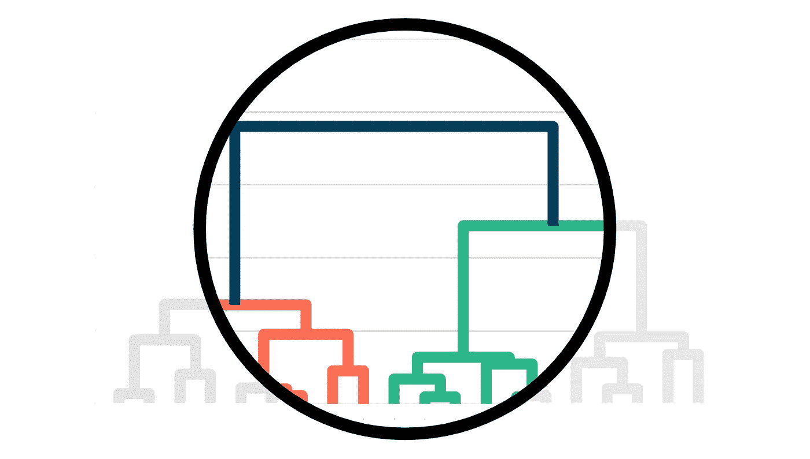

# 了解因果树

> 原文：[`towardsdatascience.com/understanding-causal-trees-920177462149?source=collection_archive---------2-----------------------#2023-02-03`](https://towardsdatascience.com/understanding-causal-trees-920177462149?source=collection_archive---------2-----------------------#2023-02-03)

## [因果数据科学](https://towardsdatascience.com/tagged/causal-data-science)

## *如何使用回归树来估计异质治疗效应*

 [Matteo Courthoud](https://medium.com/@matteo.courthoud?source=post_page-----920177462149--------------------------------)

·

[查看](https://medium.com/m/signin?actionUrl=https%3A%2F%2Fmedium.com%2F_%2Fsubscribe%2Fuser%2F666130fb420f&operation=register&redirect=https%3A%2F%2Ftowardsdatascience.com%2Funderstanding-causal-trees-920177462149&user=Matteo+Courthoud&userId=666130fb420f&source=post_page-666130fb420f----920177462149---------------------post_header-----------) 发表在 [Towards Data Science](https://towardsdatascience.com/?source=post_page-----920177462149--------------------------------) ·15 分钟阅读·2023 年 2 月 3 日

--

封面，作者提供的图片

在因果推断中，我们通常关心的是估计治疗（如药物、广告、产品等）对感兴趣结果（如疾病、公司收入、客户满意度等）的因果效应。然而，仅仅知道治疗在平均情况下有效通常是不够的，我们还希望了解对哪些个体（患者、用户、客户等）效果更好或更差，即我们希望估计**异质治疗效应**。

估计异质性治疗效果使我们能够通过**精准定位**选择性地和更高效地使用治疗。了解哪些客户更可能对折扣产生反应可以让公司通过提供更少但更有针对性的折扣来节省开支。这同样适用于负面效果：了解哪些患者对某种药物有副作用可以让制药公司警告或将他们排除在治疗之外。估计异质性治疗效果还有一个更微妙的好处：了解**对谁**有效的治疗可以帮助我们更好地理解**治疗如何**起作用。知道折扣的效果不依赖于接受者的收入，而是依赖于他们的消费习惯，这告诉我们可能……
