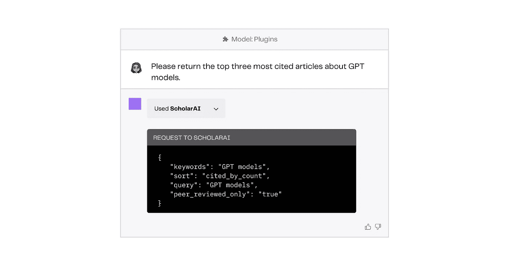

# 了解 ChatGPT 插件：益处、风险及未来发展

> 原文：[`towardsdatascience.com/understanding-chatgpt-plugins-benefits-risks-and-future-developments-7a76f64e52ce`](https://towardsdatascience.com/understanding-chatgpt-plugins-benefits-risks-and-future-developments-7a76f64e52ce)

## 期待改进，而不是完美。

 [Mary Newhauser](https://medium.com/@mary.newhauser?source=post_page-----7a76f64e52ce--------------------------------)

·发表于 [Towards Data Science](https://towardsdatascience.com/?source=post_page-----7a76f64e52ce--------------------------------) ·13 分钟阅读·2023 年 6 月 2 日

--

图片由作者提供。

[*本文最初发表于 GPTech*](https://gptech.ghost.io/understanding-chatgpt-plugins/)*。*

当 ChatGPT 在 2022 年底首次发布时，它的能力既令人印象深刻又令人失望。它可以 [进行说唱对决](https://www.reddit.com/r/ChatGPT/comments/122zfa6/rap_battling_chatgpt_is_my_new_favorite_sport/) 和 [用 LaTeX 写](https://twitter.com/bentossell/status/1598269692082151424) 微分方程，但对乌克兰战争一无所知，有时甚至无法做 [简单数学](https://twitter.com/petergyang/status/1607443647859154946?lang=en)。它的 [能力和局限性](https://medium.com/towards-data-science/gpt-4-vs-chatgpt-an-exploration-of-training-performance-capabilities-and-limitations-35c990c133c5) 的鲜明对比，虽然令人困惑且有时显得神秘，但却引发了一些有趣的 Twitter 讨论，最终强调了模型急需连接到互联网的事实。

图片由作者提供。

但插件不仅仅是将 ChatGPT 连接到互联网，它们还可以将 ChatGPT 连接到其他外部数据源，如内部数据库甚至你的电子邮件收件箱。本质上，插件扩展了 ChatGPT 的能力，提高了响应的准确性，并允许更个性化的聊天机器人体验。

本文介绍了插件的工作原理、促使其融入 ChatGPT 的必要性，以及它们对 ChatGPT 用户体验的变革性影响。我们还将探讨这些插件相关的风险和限制，并对 ChatGPT 及其不断发展的插件生态系统的未来进行一些推测。

# 插件是什么？

[插件](https://www.lifewire.com/what-are-plugins-4582189)是定制和扩展现有程序功能的软件附加组件。这些小的附加项，通常由第三方开发者创建和发布，旨在满足用户定义的特定需求，这些需求超出了原始产品的范围。

你可能对浏览器插件（也称为扩展）最为熟悉。例如，[Google Translate](https://chrome.google.com/webstore/detail/google-translate/aapbdbdomjkkjkaonfhkkikfgjllcleb)提供了一个适用于基于 Chrome 的浏览器的插件，可以通过点击按钮翻译整个网页。另一方面，[AdBlock](https://chrome.google.com/webstore/detail/adblock-%E2%80%94-best-ad-blocker/gighmmpiobklfepjocnamgkkbiglidom)是一个由第三方开发者提供的插件，可以阻止弹窗，移除网页和应用程序中的广告，并禁用侵入性的跟踪器。这些插件通过为浏览器添加功能来满足用户的特定需求。

图片由作者提供。

尽管插件可以非常有用且下载迅速，但需要记住的是，许多插件是由第三方开发者发布和维护的。这意味着某个应用程序的插件质量可能差异很大，你应始终独立[验证](https://smallbusiness.chron.com/mozilla-firefox-opening-blank-58496.html)它们的安全性。

现在我们已经回顾了插件到底是什么，让我们讨论在 ChatGPT 上下文中的插件功能。

# 没有插件的 ChatGPT

ChatGPT 是由[OpenAI](https://openai.com/)开发的大型语言模型（LLM），旨在作为聊天助手工作，生成类似人类的对话输出（响应）以回应文本输入（提示）。

尽管在机器学习社区中这一点仍然存在[争议](https://www.linkedin.com/pulse/chatgpt-simply-predicting-next-word-trung-ngo-ph-d-) ，解释 ChatGPT 最简单的方法是说它是一个统计模型，*训练来预测基于到目前为止看到的单词（如预测搜索）和它所接受的训练数据的下一个单词*。

在训练过程中，模型会接收大量的文本数据。模型通过研究不同文本之间的复杂模式、关系和依赖性来学习训练数据的潜在结构。这意味着当你从 ChatGPT 收到回应时，它并不是从一个定义的来源中提取特定的信息。相反，它是根据你提供的输入和它接受过的训练数据做出有根据的预测。你收到的回应是一个近似值，旨在模拟信息可能是什么，而不是直接检索具体数据。

然而，由于该模型没有连接到互联网或其他任何外部数据源，它可能会以非常有说服力的方式输出极其不准确的信息。例如，当我要求 ChatGPT 给出五篇关于“从人类反馈中进行强化学习”主题的有影响力论文的标题时，它建议的三篇文章根本不存在。

图片由作者提供。

‌也许这项回应中最令人担忧的方面是这些虚构的论文听起来完全可信。它们甚至被归因于该领域的知名作者。这被称为 幻觉，是 LLM 的最严重缺陷之一。虽然有几种机器学习方法可以减少 LLM 的幻觉，但通过使用插件使这些模型连接到数据源是一种成本较低的方法，可以提高准确性并进一步扩展 LLM 的能力。

# 带有插件的 ChatGPT

ChatGPT 插件通过向聊天机器人提供未包含在模型训练数据中的最新、个人或特定数据来增强聊天体验。LLM 连接到实时数据源（如数据库或网页浏览）的目的是帮助 ChatGPT 生成更准确和及时的结果。它还允许聊天机器人在 ChatGPT 界面内直接执行更复杂的任务，例如回复电子邮件。让我们将所有这些新增功能分解成不同的类别。

## 网页浏览

ChatGPT 的网页浏览模式的引入使你能够在不使用搜索引擎和点击链接的情况下进行研究和搜索互联网。这项新功能的目的是简化你的搜索过程和互联网浏览体验，省去手动任务，如筛选结果、点击链接和扫描网页以获取所需信息。

为了实现这一点，ChatGPT 本质上会将你的提示重新表述为搜索查询，执行互联网搜索，点击最相关的链接，阅读网页，然后用你所需的信息作出回应。让我们看看 ChatGPT 在网页浏览模式下如何回答问题 *“谁在竞选 2024 年美国总统？”*

图片由作者提供。

而原版 ChatGPT 会对这样的问题直接回避，网页浏览能力使 ChatGPT 能够提供关于基模型训练截止日期之后发生事件的相关及时信息。浏览模式还能够引用其来源，包括用来收集信息的在线来源链接，这允许用户独立验证 ChatGPT 响应的部分内容。

最终，将大型语言模型的自然语言能力与外部数据源（即互联网）连接起来，可以提供更有信息量和全面的体验。

## 任务自动化

虽然浏览模式对于涉及研究和信息收集的相对简单任务很有帮助，但 ChatGPT 的新自定义插件确实将其提升到了一个新的水平，使其能够在个性化的基础上自动化多步骤任务。

[任务自动化](https://www.smartsheet.com/task-automation)，即利用技术来完成任务而不是手动完成，并不是新鲜事物。无论是使用超市的自助结账机、机场的自助登机 kiosks，还是让你的机器人吸尘器在晚餐后清理厨房，你都会遇到它。数字任务自动化利用软件来自动化常规和重复的任务，比如在你离开办公室时自动发送电子邮件回复。

将 LLMs 纳入数字任务自动化工作流可以实现更有效和个性化的常见任务自动化。当我们使用 [Zapier 插件](https://zapier.com/blog/announcing-zapier-chatgpt-plugin/) 并要求 ChatGPT 给我妈妈写一封电子邮件时，就会发生这种情况。为了完成这个任务，ChatGPT 会请求已经连接到我的 Gmail 账户的 Zapier，草拟一封包含所有相关信息（主题、收件人、语气）的电子邮件。Zapier 完成了这个任务，使用 ChatGPT 语言模型生成所有必要的文本，并提供一个链接，允许我直接从 Gmail 账户审阅并发送草稿。

图片由作者提供。

使用 ChatGPT 自动化任务的想法是，理论上，你可以在不必打开一堆标签页、手动点击和撰写文本的情况下完成任何数量的任务。这不仅能节省逐个案例的时间，还能在大规模上提供有价值的结果。例如，如果你每天经常发送和接收超过一百封电子邮件，使用一组 [预定义的提示](https://beebom.com/best-chatgpt-prompts/) 与 ChatGPT 和 Zapier 插件结合使用，可以节省大量时间。

将 LLMs 与插件结合用于任务自动化，为我们处理日常和复杂任务的方式带来了令人兴奋的机会。以下是一些例子：

+   以对话方式查询和更新文档及数据库

+   自动化创建和发布社交媒体内容

+   自动化个人和职业通信

+   安排和取消约会及工作电话

+   根据特定要求生成食谱和餐单

+   根据某些标准规划假期和活动

+   总结给定数据集中的发现

+   为给定项目中的特定任务编写代码

# 缺点和限制

虽然插件可以帮助扩展大型语言模型（LLM）的现有功能，但它们也有自身的缺点和限制。以下是我在使用 ChatGPT 插件时遇到的一些最显著的限制：

+   **插件速度较慢。** 在简单的使用场景中，比如查找实时信息，使用搜索引擎可能更快。

+   **插件仍然可能产生幻觉。** 虽然幻觉可能会减少，但请记住，ChatGPT 背后的 LLM 仍然可能产生幻觉。

作者提供的图片。

+   **插件可能会很脆弱。** 插件依赖于外部 API，这意味着如果 API 出现故障或无法正常运行，插件可能变得几乎无用。我遇到过不止一次这种情况。

+   **插件会暴露更多的个人数据。** 为了利用 LLMs 处理你的个人数据，你需要将这些数据暴露给插件。在将插件与个人数据、文档或电子邮件帐户集成之前，请务必阅读每个插件的数据隐私政策。

+   **有些插件并不复杂。** 当你通过点击插件的下拉菜单查看某些插件的内部时，你会发现有些插件并不复杂。例如，当使用 ScholarAI 插件搜索文章时，它只是从提示中提取一个具有简单参数的搜索查询，然后在数据库中进行搜索。

作者提供的图片。

+   **插件缺乏人类判断。** ChatGPT 的浏览模式和其他将用户连接到实时数据的插件正在为我们搜索互联网，实际上是“点击”链接并扫描那些网页以获取相关信息。这不能替代人类的判断，因为我们不知道如何选择或优先考虑来源的决策过程。

# 最有前景的 ChatGPT 插件

现在我们已经回顾了 ChatGPT 插件的工作原理和它们的局限性，让我们来看看一些最有前景的 ChatGPT 插件。虽然这些插件仍处于初期阶段，但它们具有广泛的功能和潜力，可以自动化各种任务，这些任务要么能节省大量时间，要么能带来显著的业务价值。

## Zapier

[Zapier](https://zapier.com/) 是一个工作流自动化平台，支持数千个流行应用程序，将它们连接在一起并执行自动化任务。最初，你需要在 Zapier 网站上手动配置这些任务；现在，你只需通过提示 ChatGPT 就可以做到这一点。

在之前的示例中，我展示了如何使用 Zapier 起草个人电子邮件。现在，让我们使用该插件自动将新数据添加到现有的 Google Sheets 文档中。为了简单起见，假设这个电子表格记录了我所有喜爱的狗的名字、品种和年龄。在安装并启用 Zapier 插件后，我只需用简单的英文告诉 ChatGPT 将数据添加到名为“favorite-dogs”的现有 Google 表格中。接下来，我点击响应中提供的链接，确认 ChatGPT 正确理解了我的请求，并确认该操作。当我打开“favorite-dogs”文档时，我会看到数据已被添加。

作者提供的图片。

Zapier 维护了一份 [列表](https://zapier.com/apps/chatgpt/integrations) ，展示了将不同应用程序连接起来以完成任务的创意方式，包括将 [新的](https://zapier.com/apps/chatgpt/integrations/dropbox/479720/convert-new-dropbox-files-to-pdfs-with-pdfco-and-summarize-them-with-chatgpt) Dropbox 文件转换为 PDF 和生成文档摘要，[生成回复](https://zapier.com/apps/sms77/integrations/sms77/1199003/generate-replies-to-new-incoming-sms77-messages-with-chatgpt) 对来电 SMS 消息，以及基于 Evernote 待办事项列表 [优先排序任务](https://zapier.com/apps/evernote/integrations/evernote/1337269/get-chatgpt-to-prioritize-your-day-based-on-your-to-dos)。

Zapier ChatGPT 插件在自动化琐碎和重复性任务方面具有令人难以置信的潜力。它执行任务的速度相对较快，并在执行之前给你一个任务概览。然而，在使用此插件之前，我建议你查看 Zapier 的 OAuth 政策，这些政策指定了你授予 Zapier 执行任务所需的对外部账户（例如 Gmail、Google Drive）不同级别的访问权限和许可。

## Noteable

[Noteable](https://www.notion.so/f65f080ac2d040538f1aa00297cd8fde) 是一个用于临时分析、机器学习和数据应用的协作数据科学笔记本平台。像 [Jupyter notebooks](https://jupyter.org/) 一样，Noteable 是你可以编写代码来清理、总结和可视化数据，以及训练和评估机器学习模型的地方。[Noteable ChatGPT 插件](https://noteable.io/chatgpt-plugin-for-notebook/) 允许你与现有数据和笔记本互动，甚至只需提示 ChatGPT 即可创建新的笔记本。这意味着你可以在不编写一行代码的情况下获得洞察并处理实际数据。‌

图片由作者提供。

使用 Noteable 插件，你还可以利用自然语言查询连接到 Noteable 的数据库，使用 Pandas 清理和转换原始数据，从外部来源加载数据，甚至创建图表。有关其他创意，查看这些 [示例](https://app.noteable.io/p/efa0bae2-e7e2-49b1-8b10-6c73aff0bfa5/ChatGPT-Plugin-Examples)，这些笔记本是 Noteable 团队使用 ChatGPT 插件创建的。

*为了安全起见，我不会将此插件用于敏感的公司或个人数据。* 然而，如果你是一个有抱负的数据科学家，寻求一种有趣且富有创意的方法来提升技能，或如果你正在从事涉及公共代码和数据的项目，这个插件可能是一个有趣的工具来探索！

# ChatGPT 插件的当前情况

插件通过允许 LLM（如 ChatGPT）访问原始训练数据中未包含的信息来扩展其能力。这使得大型语言模型有可能在准确性和任务自动化方面表现更好。一些首批推出的 ChatGPT 插件，如 Zapier 和 Noteable，展现了巨大潜力，允许用户通过简单的提示执行各种难度的任务。

然而，LLM 的插件仍处于初期阶段。第一代 ChatGPT 插件速度较慢，有点笨重，有时甚至无法正常工作。可以把这些插件看作类似于 2008 年首次上市的 iOS 和 Android 应用。开发者正在学习如何编写与用户以新方式互动并满足新需求的代码。未来的插件可能会更快、更复杂、更友好。

但是，重要的是要记住，将 LLM 连接到互联网和外部数据源自身也带有风险。语言模型在审查互联网来源时缺乏人类判断力，这意味着我们需要在让聊天机器人为我们浏览网页时保持谨慎和怀疑。同样，用户需要意识到他们将个人数据交给第三方插件，因为这些插件可能以用户未完全理解的方式收集、存储或分享这些数据。

# ChatGPT 插件的未来

首先，ChatGPT 插件的复杂性和性能将会提高。希望随着公司投入更多资源维护第三方 API，它们会变得更可靠，插件最终也会能够更快地执行任务（尽管可能仅限于付费客户）。

其次，未来几个月，插件的数量和多样性将会显著增加。由于插件是与数字产品和内容建立互动的有趣且富有成效的方式，你可以肯定许多公司将投入资源开发创新且互动性强的插件用于 ChatGPT。而且，只需注册 OpenAI 的[插件开发者访问](https://openai.com/waitlist/plugins)（目前有等待名单），你就可以开始[开发自己的插件](https://platform.openai.com/docs/plugins/introduction)，开源社区有潜力贡献各种创意插件。

最后，重要的是要记住 ChatGPT 的未来可能并不完全是 ChatGPT。各种程度的 [开源](https://magazine.sebastianraschka.com/p/ahead-of-ai-8-the-latest-open-source) 聊天助手和模型的数量和质量正在迅速增加，我几乎放弃了跟踪。由于开源社区致力于保持 LLM 的透明性和可访问性，加上美国和欧洲 [AI 监管](https://www.brookings.edu/research/the-eu-and-us-diverge-on-ai-regulation-a-transatlantic-comparison-and-steps-to-alignment/) 的未来不确定，未来将会是什么样子很难说。

话虽如此，尽情玩转所有新的 ChatGPT 插件，并小心选择你分享的数据！

[*这篇文章最初发布在 GPTech*](https://gptech.ghost.io/understanding-chatgpt-plugins/)*.*

*如果你想了解最新的数据科学趋势、技术和工具，考虑成为 Medium 会员。你将获得无限访问文章和博客的权限，如 Towards Data Science，同时支持我的写作。（我从每个会员中赚取少量佣金）。*

 [## 使用我的推荐链接加入 Medium - Mary Newhauser

### 每月 $5 即可无限访问 Medium 文章 🤗 你的会员费直接支持 Mary Newhauser 和…

medium.com](https://medium.com/@mary.newhauser/membership?source=post_page-----7a76f64e52ce--------------------------------)

## 想要联系我？

+   📖 关注我在 [Medium](https://medium.com/@mary.newhauser)

+   💌 [订阅](https://medium.com/@mary.newhauser/subscribe) 以便在我发布新内容时收到邮件

+   🖌️ 查看我关于生成 AI 的新 [博客](http://gptech.ghost.io)

+   🔗 查看我的 [作品集](https://www.datascienceportfol.io/marynewhauser)

+   👩‍🏫 我还是一名数据科学 [教练](https://www.datajump.co/)！

## 我还写过：

 ## GPT-4 与 ChatGPT 的比较：训练、性能、能力和局限性的探讨

### GPT-4 是一种改进，但请调整你的期望值。

towardsdatascience.com  ## 终极参考：干净的 Pandas 代码

### 清理文本数据的干净方法。

towardsdatascience.com  ## PyCon 精华：PyCon DE 2023 中的精选演讲

### LLMs 的孤立使用并不是未来。

towardsdatascience.com

## ‌参考文献

(1) A. George, [什么是插件，插件如何工作？](https://www.lifewire.com/what-are-plugins-4582189) (2021). Lifewire.

(2) K. Olang, [Mozilla Firefox 打开空白页面](https://smallbusiness.chron.com/mozilla-firefox-opening-blank-58496.html) (2023). Chron.

(3) T. Ngo, [ChatGPT 并非仅仅是在“预测”下一个词](https://medium.com/r?url=https%3A%2F%2Fwww.linkedin.com%2Fpulse%2Fchatgpt-simply-predicting-next-word-trung-ngo-ph-d-) (2023). LinkedIn.

(4) F. Neugebauer, 理解 LLM 幻觉 (2023). Towards Data Science.

(5) K. Eby, [自动化一切：任务自动化的终极指南](https://www.smartsheet.com/task-automation) (2018). Smartsheet.

(6) E. Alston, [新！试用 Zapier 的 ChatGPT 插件](https://zapier.com/blog/announcing-zapier-chatgpt-plugin/) (2023). Zapier.

(7) U. Sharma, [125+ 个最佳 ChatGPT 提示，适用于各种工作流程](https://beebom.com/best-chatgpt-prompts/) (2023). Beebom.

(8) Zapier. [利用 ChatGPT 集成做更多事](https://zapier.com/apps/chatgpt/integrations) (2023). Zapier.

(9) Zapier. [将新的 Dropbox 文件转换为 PDF，并使用 ChatGPT 进行总结](https://zapier.com/apps/chatgpt/integrations/dropbox/479720/convert-new-dropbox-files-to-pdfs-with-pdfco-and-summarize-them-with-chatgpt) (2023). Zapier.

(10) Zapier. [使用 ChatGPT 对新的 incoming sms77 消息生成回复](https://zapier.com/apps/sms77/integrations/sms77/1199003/generate-replies-to-new-incoming-sms77-messages-with-chatgpt) (2023). Zapier.

(11) Zapier. [让 ChatGPT 根据待办事项优先排序你的日程](https://zapier.com/apps/evernote/integrations/evernote/1337269/get-chatgpt-to-prioritize-your-day-based-on-your-to-dos) (2023). Zapier.

(12) Noteable. [ChatGPT 插件](https://noteable.io/chatgpt-plugin-for-notebook/) (2023). Noteable.

(13) Noteable. [ChatGPT 插件示例](https://app.noteable.io/p/efa0bae2-e7e2-49b1-8b10-6c73aff0bfa5/ChatGPT-Plugin-Examples) (2023). Noteable.

(14) OpenAI. [聊天插件](https://platform.openai.com/docs/plugins/introduction) (2023). OpenAI.

(15) OpenAI. [ChatGPT 插件等候名单](https://openai.com/waitlist/plugins) (2023). OpenAI.

(16) S. Raschka, [AI 领先 #8：最新的开源 LLM 和数据集](https://magazine.sebastianraschka.com/p/ahead-of-ai-8-the-latest-open-source) (2023). AI 领先.

(17) A. Engler, [欧盟与美国在 AI 监管上的分歧：跨大西洋比较及对齐步骤](https://www.brookings.edu/research/the-eu-and-us-diverge-on-ai-regulation-a-transatlantic-comparison-and-steps-to-alignment/) (2023). 布鲁金斯学会。
