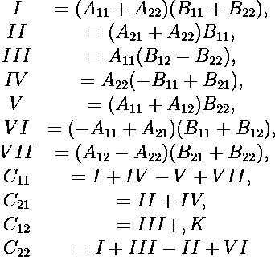
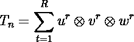
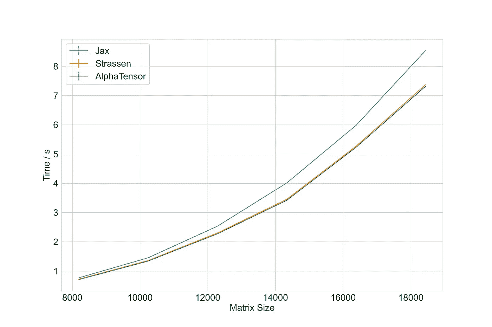
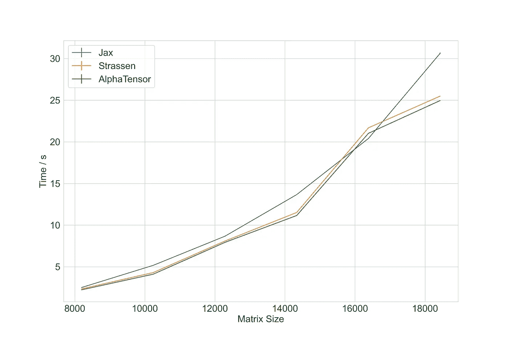
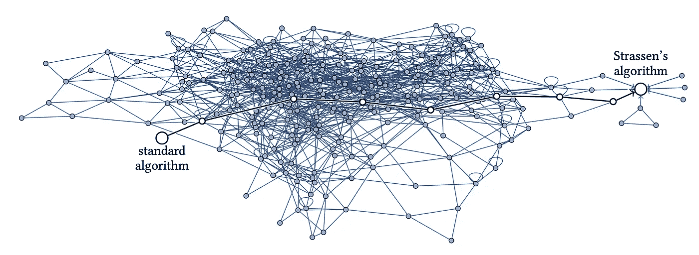

# 理解 DeepMind 矩阵乘法

> 原文：[`towardsdatascience.com/understanding-deepmind-matrix-multiplication-c8dc49687ce7`](https://towardsdatascience.com/understanding-deepmind-matrix-multiplication-c8dc49687ce7)

## DeepMind 矩阵乘法在 NVIDIA V100、Tesla T4 上的表现，以及 FBHHRBNRSSSHK——这可不是我在随意输入字母！

[](https://stefanobosisio1.medium.com/?source=post_page-----c8dc49687ce7--------------------------------)[](https://towardsdatascience.com/?source=post_page-----c8dc49687ce7--------------------------------) [Stefano Bosisio](https://stefanobosisio1.medium.com/?source=post_page-----c8dc49687ce7--------------------------------)

·发表于[Towards Data Science](https://towardsdatascience.com/?source=post_page-----c8dc49687ce7--------------------------------) ·7 分钟阅读·2023 年 2 月 11 日

--


图片由[伊凡·迪亚兹](https://unsplash.com/@ivvndiaz)提供，发布于[Unsplash](https://unsplash.com/photos/Z-PU9Lv441Y)

在之前的帖子中，我们学习了 Strassen 算法背后的数学，并编写了 Python 代码以在不同矩阵大小下进行测试。此外，我们了解到线性代数的圣杯是矩阵乘法的优化算法。通常，我们会把矩阵乘法代码看作是三个 for 循环：

```py
def matmul(mat1, mat2, mat3):
    r""" Function to multiply mat1 and mat2 
    returns mat3 
    Parameters
    ---------
    mat1: np.array, matrix A 
    mat2: np.array, matrix B 
    mat3: np.array, empty matrix C 

    Return 
    ------
    mat3: np.array, matmul between A & B
    """ 
    for i in range(mat1.shape):
        for j in range(mat2.shape):
            mat3[i][j] = 0.0 
            for k in range(mat3.shape):
                mat3[i][j] += mat1[i][k]*mat2[k][j]
    return mat3
```

因此，计算复杂度是*O(n³)*。Strassen 改进了这一计算，找到了以下关系：



图 1：Strassen 算法，如其论文“高斯消去法不是最优的”中提出的。[作者提供的图片]

该算法应用于块矩阵，总复杂度降至*O(n²·⁸⁰⁸)*。虽然 2.808 可能看起来改进很小，但我们看到对于 4096 大小的方阵，标准 numpy `matmult`大约需要 454.37 +/- 6.27 秒，而 Strassen 需要 31.57 +/- 1.01 秒，差异约为一个数量级。

我们看到矩阵乘法问题可以简化为张量积，通过*张量*操作：



图 2：矩阵乘法张量的三元组定义，如 Deep Mind 论文中所定义的。[作者提供的图片]

图 2 准确报告了矩阵乘法，表示为*三元组*，即三个元素。*最小三元组数定义了计算乘积矩阵所需的最小操作数。* 这个最小数就是张量的*秩* *R(t)*。研究张量秩是一种有效的方式来寻找新的乘法算法，如 DeepMind 的论文中所述。

DeepMind 这些年来展示了如何通过机器学习方法、特别是强化学习（RL）方法，解决从理论到应用的数学问题。在此期间，他们还调整了 AlphaZero，以寻找矩阵乘法的最佳策略，结果就是 AlphaTensor。我认为现在定义一下我们可以从这篇论文中欣赏到的内容是值得的：

1.  DeepMind 再次证明了 RL 可以成为解决复杂数学问题的强大助手；

1.  AlphaTensor 找到了一个可以比 Strassen 算法更好的算法，用于 4 x 4 和 5 x 5 块矩阵的乘法；

1.  此外，AlphaTensor 可以为特定的硬件需求找到最优解。正如他们在论文中所示，可能会有专门针对 TPU 和 GPU（论文中的 V100）的算法；

1.  尽管这些可能不是最佳结果，但数学家们现在可以拥有一套全新的矩阵乘法方程，这可以作为寻找新的最优解的起点。

# 在 V100 GPU 上测试 AlphaTensor

幸运的是，DeepMind 在其[GitHub 上提供了 AlphaTensor 的实现，](https://github.com/deepmind/alphatensor)可以进行测试，全部用 JAX 编写。代码专为 4 x 4 块矩阵的乘法设计，共有 47 次乘法，已在张量表示中报告，具体可见[这里](https://github.com/deepmind/alphatensor/blob/1949163da3bef7e3eb268a3ac015fd1c2dbfc767/benchmarking/factorizations.py#L21)。

基准测试在 TPU 和 V100 GPU 上进行，他们测试了以下[尺寸](https://github.com/deepmind/alphatensor/blob/1949163da3bef7e3eb268a3ac015fd1c2dbfc767/benchmarking/run_gpu_benchmark.py#L67)的矩阵乘法：8192, 10240, 12288, 14336, 16384, 18432, 20480，对于[标准](https://github.com/deepmind/alphatensor/blob/1949163da3bef7e3eb268a3ac015fd1c2dbfc767/benchmarking/utils.py#L155)的`[jax.numpy.dot](https://github.com/deepmind/alphatensor/blob/1949163da3bef7e3eb268a3ac015fd1c2dbfc767/benchmarking/utils.py#L155)`[乘法](https://github.com/deepmind/alphatensor/blob/1949163da3bef7e3eb268a3ac015fd1c2dbfc767/benchmarking/utils.py#L155)，Strassen 算法和 AlphaTensor 算法。

我分叉了代码，并进行了两个小的修改：

1.  我正在打印每种方法的时间

1.  由于我们对每个算法进行 10 次乘法运算，*我将基准函数中的* [*平均次数修改为 10*](https://github.com/deepmind/alphatensor/blob/1949163da3bef7e3eb268a3ac015fd1c2dbfc767/benchmarking/utils.py#L227)*，而不是保持为 20*。

在拥有 Google Cloud Console 的免费访问权限（仍然依赖$300 积分）的情况下，我在 GCP Compute Engine 中创建了一个虚拟机以测试 AlphaTensor，具体如下：

+   运行区域为`europe-west4`

+   选择了带有 1 NVIDIA V100 GPU 的 GPU 机器

+   自动选择 CPU 平台

+   `n1-standard-4`机器类型（4 vCPU 和 15 GB RAM）

+   我将操作系统镜像更改为：操作系统`Deep Learning on Linux`和版本`基于 Debian 10 的 Deep Learning VM 用于 TensorFlow Enterprise 1.15，带有 CUDA 11.0 M100`，磁盘大小为`50GB`

总成本为每小时$1.94 — 因此要小心，不要让这台机器无限期运行。

一旦创建了机器，你可以直接通过 SSH 访问并使用`git clone https://github.com/Steboss/alphatensor.git`下载代码库。你需要设置 Python 环境并使用`pip3 install -r alphatensor/benchmarking/requirements.txt -f [`storage.googleapis.com/jax-releases/jax_cuda_releases.html`](https://storage.googleapis.com/jax-releases/jax_cuda_releases.html)`安装`jax`。最后，你可以通过`python alphatensor.benchmarking.run_gpu_benchmark`运行测试。



图 3：Jax 矩阵乘法、Strassen 算法与 AlphaTensor 在 V100 GPU 上的比较。 [图片来源：作者]。

图 3 显示了每个算法相对于矩阵大小的性能时间。我们可以看到，对于*小矩阵*尺寸，8192 和 10240，Strassen 相对于标准 JAX 实现了*约 6.5%的提升*，与 AlphaTensor 约 8.5%的提升相当。对于*大矩阵*，取得了优异的结果，因此对于 18432 的方阵，Strassen 的计算提升了*15%*（7.37 +/- 0.01），而 AlphaTensor 相对于 JAX（8.53 +/- 0.01）达到了*16%*的提升（7.31 +/- 0.01）。

# 如果我没有免费访问 V100 的权限怎么办？

我还在 Google Colab 上进行了另一个测试。在这种情况下，我们可以依赖 Tesla T4 GPU。虽然算法已经在 V100 上测试过，但值得调查其可迁移性并比较结果。与 V100 测试类似，我在 Google Colab 笔记本上复制了这些计算，[去除了这些行](https://github.com/deepmind/alphatensor/blob/1949163da3bef7e3eb268a3ac015fd1c2dbfc767/benchmarking/run_gpu_benchmark.py#L53:L55)



图 4：Jax 矩阵乘法、Strassen 算法与 AlphaTensor 在 Tesla T4 上的比较。 [图片来源：作者]。

正如你所看到的，我们在结果中有更多的变化，特别是在 16384 大小的矩阵中，我们可以看到所有算法实现了相同的性能时序。这并不准确，因为这可能是由于我们在 Google Colab 上无法管理的一些停机时间。表 1 总结了在 Tesla T4 上的所有发现：

表 1：在 Tesla T4 上对 JAX、Strassen 和 AlphaTensor 矩阵乘法算法的性能时序比较。

尺寸 12288 和 16384 是棘手的点，在这些点上我们相对于 JAX 标准乘法没有实际改进。另一方面，我们可以看到对于非常大的矩阵有改进，在 18432 时，Strassen 实现了 20% 的加速，AlphaTensor 实现了 22% 的加速。

# 这是故事的结局吗？

就在 [DeepMind 论文](https://www.nature.com/articles/s41586-022-05172-4) 发布几天后，Manuel Kauers 和 Jakob Moosbauer 写了一篇精彩的论文回复，提出了 [FBHHRBNRSSSHK-算法](https://arxiv.org/abs/2210.04045)。该算法基于 DeepMind 的发现，使用 47 次乘法改进了 4x4 矩阵的计算，而不是 AlphaTensor 发现的 49 次乘法，5x5 矩阵的乘法次数减少到 95 次（而不是 AlphaTensor 提出的 96 次）。这是一个好消息，表明人类可以与 ML 算法有效合作。在这篇回复之后，Kauers 和 Moosbauer 发表了一篇出色的数学论文，名为 “[矩阵乘法的翻转图](https://arxiv.org/abs/2212.01175)”。在这篇论文中，作者展示了他们找到的进一步改进矩阵乘法的技术。特别是，这项技术的核心部分是从已知的矩阵乘法方案开始，并将其分组在一个图中：

> 我们定义了一个图，其中的顶点是正确的矩阵乘法方案，如果第二个方案可以通过某种变换从第一个方案获得，则在两个方案之间存在一条边。我们考虑了两种变换。一种叫做翻转，将给定方案转变为一个不同的方案，乘法次数相同，另一种叫做归约，将给定方案转变为一个乘法次数更少的方案。

所有矩阵乘法方案之间的导航是通过随机游走完成的。然后，翻转可以使用以下想法进行：

> 这个想法是从一个秩-1 张量中减去某些东西，然后将其添加到其他张量中。



图 5：翻转图示例，展示了所有算法如何作为图中的节点存在，翻转是无向边，归约变换是有向边。[图片来源：Manuel Kauers 和 Jakob Moosbauer]。

图 5 显示了论文中的图像，作者描绘了所有已知方案以及它们如何通过翻转和归约变换相互连接。因此，这并不是故事的结局，而是另一个很好的起点，将带来越来越高效的矩阵乘法算法。

# 结论

今天我们结束了对 DeepMind 论文《利用强化学习发现更快的矩阵乘法算法》的评审。这篇论文在矩阵乘法领域引起了极大的兴趣，并且显然带来了许多问题。

我们从论文中得出了 4 个主要观点：

1.  强化学习是一个强大的工具，可以帮助我们解决数学问题。

1.  AlphaTensor 已经找到了乘法 5x5 和 4x4 矩阵的新公式。

1.  AlphaTensor 可以为特定硬件（例如 GPU 或 TPU）找到最佳解决方案。

1.  这是新研究矩阵乘法问题的一个很好的起点。

然后，我们在 NVIDIA V100 GPU 和 Tesla T4 上运行了 AlphaTensor。尽管有一些起伏，我们可以看到总体上 AlphaTensor 提高了计算效率，在 V100 上提高了多达 16%，在 Tesla T4 上提高了 22% —— 尽管该算法并未针对这种 GPU 进行优化。

最后，我们看到这不仅仅是故事的结束，而是一个美好的新开始。一个例子是[FBHHRBNRSSSHK-算法](https://arxiv.org/abs/2210.04045)，它证明了如何通过纯数学形式进一步利用 DeepMind 的解决方案，找到新的、更高效的矩阵乘法技术。

# 支持我的写作：

[](https://stefanobosisio1.medium.com/membership?source=post_page-----c8dc49687ce7--------------------------------) [## 通过我的推荐链接加入 Medium - Stefano Bosisio

### 阅读 Stefano Bosisio 的每个故事（以及 Medium 上成千上万其他作家的故事）。为什么支持我？1）关于 AI 的文章……

stefanobosisio1.medium.com](https://stefanobosisio1.medium.com/membership?source=post_page-----c8dc49687ce7--------------------------------)

*如果有任何问题或意见，请随时发邮件至：stefanobosisio1@gmail.com，或者直接在 Medium 上联系我。*
