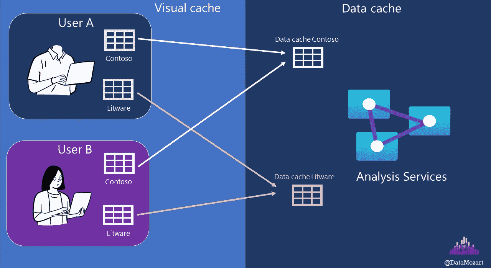

# 理解 Power BI 中的不同缓存类型

> 原文：[`towardsdatascience.com/understanding-different-cache-types-in-power-bi-f1e205f5956e?source=collection_archive---------5-----------------------#2023-03-22`](https://towardsdatascience.com/understanding-different-cache-types-in-power-bi-f1e205f5956e?source=collection_archive---------5-----------------------#2023-03-22)

## 你知道 Power BI 依赖于两种不同的缓存类型吗？在这篇文章中，我们将揭示它们在实际中的工作原理。

 [Nikola Ilic](https://datamozart.medium.com/?source=post_page-----f1e205f5956e--------------------------------)

·

[关注](https://medium.com/m/signin?actionUrl=https%3A%2F%2Fmedium.com%2F_%2Fsubscribe%2Fuser%2F64005b7daa38&operation=register&redirect=https%3A%2F%2Ftowardsdatascience.com%2Funderstanding-different-cache-types-in-power-bi-f1e205f5956e&user=Nikola+Ilic&userId=64005b7daa38&source=post_page-64005b7daa38----f1e205f5956e---------------------post_header-----------) 发表在 [Towards Data Science](https://towardsdatascience.com/?source=post_page-----f1e205f5956e--------------------------------) · 9 分钟阅读 · 2023 年 3 月 22 日 

--

作者提供的图片

你是否曾经遇到过这样的情况？当你第一次打开报告时，渲染需要一些时间，但当你在其他报告页面之间来回切换时，那一页的渲染速度明显更快！

是的，我知道，我们都经历过很多次。这是因为 Power BI 会缓存数据，在第一次运行之后，它可以更快地响应。

听起来很简单，对吧？实际上并不是那么简单，这篇文章将试图揭示 Power BI 中不同缓存类型的奥秘。

***在开始之前推荐阅读****:* 由于我将提到一些 Power BI 内部架构组件，即存储引擎和公式引擎，因此我建议你首先阅读[这篇文章](https://data-mozart.com/vertipaq-brain-muscles-behind-power-bi/)以理解二者之间的区别。你还应该了解[这两个引擎在数据检索过程中的不同角色](https://data-mozart.com/inside-vertipaq-compress-for-success/)。这一点至关重要，因为本文的其余部分将假设你了解存储引擎和公式引擎的关键特性。
