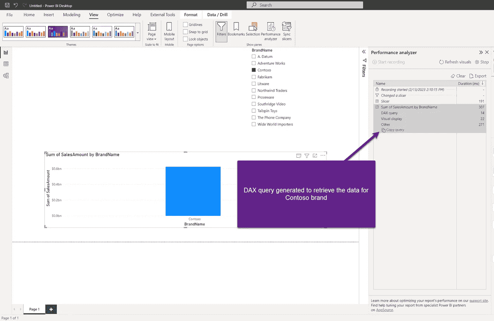

# 理解 Power BI 中的不同缓存类型

> 原文：[`towardsdatascience.com/understanding-different-cache-types-in-power-bi-f1e205f5956e`](https://towardsdatascience.com/understanding-different-cache-types-in-power-bi-f1e205f5956e)

## 你知道 Power BI 依赖于两种不同的缓存类型吗？在本文中，我们将揭示它们在实际中的工作原理

[](https://datamozart.medium.com/?source=post_page-----f1e205f5956e--------------------------------)[](https://towardsdatascience.com/?source=post_page-----f1e205f5956e--------------------------------) [Nikola Ilic](https://datamozart.medium.com/?source=post_page-----f1e205f5956e--------------------------------)

·发布在[Towards Data Science](https://towardsdatascience.com/?source=post_page-----f1e205f5956e--------------------------------) ·9 分钟阅读·2023 年 3 月 22 日

--


图片由作者提供

你多少次遇到过这样的情况？第一次打开报告时，渲染需要一些时间，但一旦你在其他报告页面之间来回切换，那个页面的渲染速度会显著提高！

是的，我知道，我们都经历过多次。这是因为 Power BI 会缓存数据，并且在第一次运行之后响应会更快。

听起来很简单，对吧？其实并不像那样简单，本文将尝试揭示 Power BI 中不同缓存类型的奥秘。

***开始前推荐阅读****:* 由于我会提到 Power BI 的一些内部架构组件，即存储引擎和公式引擎，我建议[你首先阅读这篇文章](https://data-mozart.com/vertipaq-brain-muscles-behind-power-bi/)以了解这两者之间的区别。你还应该了解[这两个引擎在数据检索过程中的不同角色](https://data-mozart.com/inside-vertipaq-compress-for-success/)。这非常重要，因为本文其余部分将假定你已经了解存储引擎和公式引擎的关键特性。

# 缓存类型一览

首先从高层次的视角解释两种主要的缓存类型，然后我们将深入探讨每种类型的细微差别。

# Power BI 中的视觉缓存

我们先从一个非常简单的例子开始。我将使用一个示例 Contoso 数据库进行所有演示。


图片由作者提供

我有一个簇状柱形图视觉对象，显示 Contoso 数据库中每个品牌的总销售额。还有一个品牌名称的切片器。让我们在 Power BI Desktop 中打开性能分析器，并选择切片器中的一个值：



图片由作者提供

正如你可能注意到的，公式引擎生成了一个 DAX 查询来检索有关 Contoso 品牌销售的数据，存储引擎需要 14 毫秒来实际返回这些数据。由于我们使用的是导入存储模式，并且我在 Power BI Desktop 中，因此数据存储在 Analysis Services 的本地实例中。

现在让我们将切片器值更改为 Litware：


图片由作者提供

再次，和之前的情况一样，发生了相同的工作流程。现在，如果我在切片器中切换回 Contoso，会发生什么呢？


图片由作者提供

现在事情变得有趣了！完全没有 DAX 查询，也没有“复制查询”选项，这使我们无法获取查询并在[例如 DAX Studio 中更详细地分析它](https://data-mozart.com/mastering-dp-500-exam-troubleshoot-dax-performance-with-dax-studio/)—这个选项被禁用了！这意味着，公式引擎没有生成查询，这个视觉对象的数据是从缓存中提供的。在这种情况下，我们谈论的是***视觉缓存***。

如果我再次在切片器中选择 Litware，情况也会如此。然而，一旦我点击顶部的刷新视觉对象选项……


图片由作者提供

尽管再次检索 Contoso 的数据，在这种情况下，视觉缓存已被清除，公式引擎再次生成了一个 DAX 查询。

显然，在这个超级基础的示例中，很难发现两个场景之间的显著性能差异。但实际上，我们通常会应用更复杂的逻辑，从缓存中检索查询结果通常比一遍遍运行相同的查询要快得多。

如果我现在从 DAX Studio 连接到我的 Analysis Services 本地实例，并打开所有查询，一旦我点击刷新视觉对象，所有查询都将被 DAX Studio 捕获：


图片由作者提供

从这里，我将双击第一个查询并在 DAX Studio 中执行它


图片由作者提供

这个包含查询结果的表格将被报告缓存。每当我们的视觉对象请求相同的结果时，数据可以从缓存中提供。

# 那 Power BI 服务呢？

好吧，在上面的示例中，我们解释了 Power BI 如何在使用 Power BI Desktop 时缓存查询结果，即在 Analysis Services 的本地实例中。合理的问题是：一旦我们转到 Power BI 服务，这个缓存“东西”还会有效吗？

答案是——是的！在这种情况下，它是通过你的网页浏览器完成的。然而，请记住，视觉缓存的范围是特定的 Power BI 会话。我们稍后会更详细地解释这如何运作。

# Power BI 中的数据缓存

数据缓存是 Power BI 中的另一种缓存类型。与之前场景中的缓存发生在个别报告用户级别不同，数据缓存是在更通用的级别——Analysis Services 表格模型的级别上操作的。

如果你完成了作业并阅读了我一开始推荐的文章，你可能已经知道 VertiPaq 以压缩的方式将我们的 Contoso 数据存储在内存中。

那么，当我们要求 Power BI 计算 Contoso 品牌的总销售额时，究竟发生了什么？公式引擎生成并执行 DAX 查询，但随后 Storage Engine 将 DAX 转换为一种类似 SQL 的特殊语言，称为 xmSQL，以物理地从表格模型中提取数据。


作者提供的图片

对于每个 xmSQL 查询，都有一个特殊的数据结构，称为 datacache，存储在内存中。

如果我在 DAX Studio 中开启服务器计时并运行前一个示例中捕获的 DAX 查询：


作者提供的图片

如你所见，查询结果是从缓存中检索的（我们有一个 Storage Engine 查询，而那个 Storage Engine 查询是使用了缓存）。这意味着实际上，我们并没有真正查询 Analysis Services 模型。为了确认这一点，我会在 DAX Studio 中打开 Cache 选项卡，你会看到在第 1 行，这个查询实际上是从缓存中提供的，而不是来自 Analysis Services 的内部数据结构。


作者提供的图片

# 注意！有关数据缓存需要记住的事项

现在，有至少两个重要的考虑因素需要记住，关于数据缓存。

首先，***这可能会让你觉得你的查询运行得很快，尽管这可能不是真的***。假设你正在排查一个性能差的查询，并利用 DAX Studio 深入了解后台发生了什么。你第一次运行查询时，它需要 2000 毫秒才能返回结果。

然后你进行了一些小的更改，再次运行查询——现在它在 100 毫秒内渲染完成。耶！你已经开始想着：“嗯，为什么大家都说 DAX 很难？我只是重新排序了代码中的行，它的速度快了 20 倍……”

是的，没错！第二天早上，一位报告用户再次抱怨相同的报告视图渲染缓慢。

你可能忘记在运行“改进版”DAX 计算之前清除数据缓存了。


作者提供的图片

即使在这个极其简单的计算中，从缓存中获得的结果集的场景也比查询分析服务内部数据结构的场景快了将近 4 倍（请注意第 1 行，其中包含 Internal 作为子类）。

其次，由于数据缓存驻留在内存中，这意味着它确实有有限的资源。简单来说，***并不是所有的查询都可以在分析服务中缓存！*** 根据查询检索的数据量，可能发生只有一部分（或没有）存储引擎查询可以从缓存中检索到。

让我展示一下这在现实中是如何表现的。我在 Power BI 报告中添加了一些更多的内容。假设我想计算每一年中我们有多少个不同的订单。我创建了一个简单的 DAX 度量来计算这个：

```py
Distinct Orders = DISTINCTCOUNT(FactOnlineSales[SalesOrderNumber])
```

接下来，我想将这个值与去年值进行比较，因此我将创建另一个度量来计算去年的不同订单数量：

```py
Distinct Orders PY = CALCULATE(
                            [Distinct Orders],
                            SAMEPERIODLASTYEAR(DimDate[Datekey])
)
```


作者图片

让我们切换到 DAX Studio 并检查生成的数据查询：


作者图片

由于在运行这个查询之前我没有清除数据缓存，所以所有 10 个存储引擎查询都从缓存中检索到了！总的来说，结果在 7 毫秒内返回。

我现在将清除缓存并重新运行相同的查询：


作者图片

结果从 7 毫秒变成了超过 1 秒！这就是我告诉你在运行相同的查询之前清除数据缓存至关重要的原因。

现在让我们检查一下如果我们将范围包括个别日期而不是年份会发生什么：


作者图片

在没有清除缓存的情况下，这个查询花费了超过 16 秒来返回结果！

简要解释一下这里发生了什么：当查询执行时，存储引擎检索数据并在一个名为 datacache 的特殊结构中物化中间查询结果。这个 datacache 最终被公式引擎消耗，然后最终结果集才返回到报告中。现在，根据许多不同的因素，有时所有必要的数据可以在一个 datacache 中物化，但有时可能发生数据量过多，导致存储引擎创建多个 datacache。

在我们的例子中，我们可以看到这些查询都非常快——仅需几毫秒——但查询数量很多。准确地说：2195 个查询！

现在，如果要物化的数据不是很多，会发生什么呢？我们能否“帮助”引擎再次利用数据缓存功能？

我将向我的报告中添加一个日期切片器，仅包含 2010 年 1 月 1 日之后的日期：


作者图片

让我们看看 DAX Studio 服务器时间现在显示什么：


作者提供的图片

显然，查询运行得更快，因为引擎需要处理的 datacaches 数量较少。但我们仍然无法充分利用数据缓存。

现在，我们只包含 2010 年 10 月 1 日之后的日期，并在 DAX Studio 中检查查询：


作者提供的图片

这次，我们命中了缓存，差异巨大！这个查询只用了 134 毫秒就返回了结果。

总结来说，从数据缓存的角度来看，查询扫描和物化的数据量非常重要。

# 结论

缓存查询结果是关键的性能优化概念之一，这不仅与 Power BI 和表格模型相关，而是普遍适用的。

当我们检查 Power BI 缓存类型时，你需要了解两种不同的缓存：

+   ***视觉缓存***（或报告缓存）— 数据在特定的 Power BI 会话范围内被缓存，无论是本地机器上的 Power BI Desktop 会话，还是 Power BI 服务中的会话。

+   ***数据缓存*** — 数据在 Analysis Services 实例的范围内被缓存，而不管打开了多少 Power BI 会话。

感谢阅读！

[成为会员，支持 Medium 上成千上万的作者！](https://datamozart.medium.com/membership)
