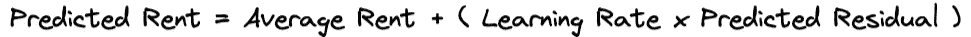

# 理解梯度提升：数据科学家的指南

> 原文：[`towardsdatascience.com/understanding-gradient-boosting-a-data-scientists-guide-f5e0e013f441`](https://towardsdatascience.com/understanding-gradient-boosting-a-data-scientists-guide-f5e0e013f441)

图片由 Midjourney 提供

 [Louis Chan](https://louis-chan.medium.com/?source=post_page-----f5e0e013f441--------------------------------)

·发表于 [Towards Data Science](https://towardsdatascience.com/?source=post_page-----f5e0e013f441--------------------------------) ·阅读时间 10 分钟·2023 年 2 月 7 日

--

梯度提升机（GBM）是机器学习和数据科学领域最重要的进展之一，它使我们这些从业者能够使用模型集成来解决许多领域特定的问题。尽管这一工具在`scikit-learn`和`xgboost`等 Python 包中广泛可用，但作为数据科学家，我们应该始终深入探讨模型的理论和数学，而不是将其视为黑箱。在这篇博客中，我们将深入探讨以下领域：

+   GBM 的不同支持概念

+   分步图解以重建 GBM

+   优点和缺点

让我们深入了解一下——图片来自 [GIPHY](https://giphy.com/gifs/14uzPzKMOuVIPu)

# 梯度提升的基本原理

## 1. 弱学习者和集成学习

弱学习者和集成学习是使梯度提升有效的两个关键概念。弱学习者是一个模型，它的表现仅比随机猜测稍好。与许多其他弱学习者结合，可以形成一个强大的集成模型，进行准确预测。

> 文字过多，过于复杂

好吧，假设我们正在和两个朋友一起玩 10000 片拼图。（他们一定是很棒的朋友才愿意报名）我们每个人负责拼接四个象限中的一个。虽然我们可能只能自己解决拼图的一小部分，但当我们作为团队合作时，我们可以迅速完成整个拼图。

在这种情况下，我们每个人都是一个弱学习者，四个人的团队就是集成模型。就像我们关注我们的象限一样，集成模型中的每个弱学习者擅长根据某些特征和特性进行预测。当我们四个弱学习者聚在一起分享对某个数据点是否属于某个象限的看法时，集成模型能够提供比我们单独预测更准确的结果。

本质上，弱学习者和集成学习是集体智慧的力量。正如古老的谚语所说：

> 整体大于部分之和。

## 2\. 加法模型

在梯度提升算法中，弱学习者模型是迭代地添加到集成中的。它几乎看起来像是泰勒近似，其中最终值是使用粗略估计通过一系列修正项进行修正。由于每个弱学习者都会贡献一个修正项，这使得 GBM 在添加模型时非常灵活，当预测结果表明过拟合时可以进行调整。

e^x 的泰勒展开从 1 开始并进行迭代修正 — 作者图片

GBM 从基线开始，通过加法模型进行迭代修正 — 作者图片

## 3\. 损失函数

当我们说一个模型经过迭代修正或改进时，我们必须明白并不是所有的改进都是相同的。例如，我和我哥哥的考试分数从 10 分提高到 20 分和从 80 分提高到 90 分，满分为 100 分。尽管我们都提高了 10 分，但我们能说这些改进是一样的吗？

> 这就引出了损失函数。

损失函数只是测量两个值之间差异的数学方法。在机器学习的背景下，它可以用作衡量预测值与实际值之间差异的评分卡，从而评估模型性能。损失越大，模型表现越差。

在我们上面的例子中，如果我们考虑百分比改进，从 10 到 20 的 10 分提高显得更加重要，或者如果我们考虑我们的分数离满分 100 有多远，这种提高也可能显得不那么重要。

考试示例中的损失函数 — 作者图片

根据我们定义模型成功的标准，我们可能会选择不同的损失函数。一些常见的选择如下：

+   **MSE（均方误差）：** 通常用于回归模型

+   **MAE（均方绝对误差）**

+   **Log Loss（交叉熵）：** 通常用于分类模型

## 4\. 梯度下降

仍以相同的例子为例，如果我们希望在提高分数方面最有效率，我们可能需要在最容易获得额外积分的地方更加努力学习（例如，对像我这样心不在焉的人来说拼写错误）。一旦征服了这一点，我们就继续处理下一个最容易获得额外积分的项目。如此反复，直到达到 100 分。

> 这正是梯度下降的工作原理！

从技术上讲，梯度下降是一种机制，旨在通过反复沿着函数值减少最快的方向移动，来探索函数的最小值。在机器学习的背景下，通过**最小化损失函数**，我们试图识别出一组最佳的模型参数，以便做出准确的预测。

不要过多地跑题到梯度下降的博客文章中，这种技术的一个重要问题是算法可能会收敛到一个次优的最小值。

最小值 — 作者提供的图像

请放心。有不同的方法来处理这些情况。示例包括以下内容：

1.  学习率：这调整了我们每一步的移动量。其直觉是，如果它不是绝对的低谷，我们可能会因为步长过大而错过它。

1.  动量方法：这种方法考虑了我们之前的步骤。算法会将前一步的一个部分（即动量）传递给下一步，以平滑振荡。（即，动量将 90 度的右转变成一个平缓的曲线）

> 梯度下降基本上是一种根查找算法。如果你对根查找算法感兴趣，可以看看我关于根查找算法的博客！

## 高效的根查找算法在 Python 中

### 在 Python 中实现高效的根查找算法和优化

towardsdatascience.com

在我们深入理解梯度提升算法的工作原理之前，先简单介绍一下自己。

如果你喜欢这篇文章，你也可以通过下面的附属链接来支持我订阅 Medium。这是一个我发现很多有趣阅读的平台。即使你不打算订阅，你也可以通过点赞来支持我和我的创作。

[## 通过我的推荐链接加入 Medium - Louis Chan](https://louis-chan.medium.com/membership?source=post_page-----f5e0e013f441--------------------------------)

### 阅读 Louis Chan 的每一个故事（以及 Medium 上成千上万的其他作家的故事）。你的会员费用直接支持…

[louis-chan.medium.com](https://louis-chan.medium.com/membership?source=post_page-----f5e0e013f441--------------------------------)

感谢你容忍这个插件。这是来自萨摩耶的一次可爱眨眼，作为我的感谢。

图片来自 [GIPHY](https://giphy.com/gifs/cute-dog-6MWahPArixa6I)

现在回到正题！

# 梯度提升算法

## 从头开始的算法

假设我们想用一个**1 棵树**的梯度提升机来预测某个地区的公寓租金：

图片由作者提供

我们首先计算平均租金，即 688。这将是我们的基准模型，即预测租金为该区域的平均值。**我们也可以将其理解为目标变量的简单预测。**

图片由作者提供

然后计算租金与平均值之间的差异——这是我们的弱学习器会尝试迭代最小化的间隙。在我们的例子中，我们只有一个弱学习器。

图片由作者提供

现在是时候建立我们的弱学习器组来预测**来自平均值的残差**了。让我们从决策树开始：

图片由作者提供

如果叶节点中有多个项目，则预测结果应为这些项目的平均值。

图片由作者提供

现在，让我们尝试使用这棵新决策树进行预测，并将其与我们之前获得的基准进行比较。计算预测值的公式如下：

图片由作者提供

通过将学习率作为预测残差的修正因子，我们应用了梯度下降的概念，即采用逐步方法来最小化损失函数。**在我们的案例中，“损失函数”是我们的残差。**

图片由作者提供

基于第一棵树的预测值，我们可以计算新的残差。

图片由作者提供

看！通过将我们创建的树“添加”到我们之前仅使用平均值做出的基线预测中，残差已经变得更小了！

如果我们要训练一个合适的梯度提升模型，我们需要重复拟合大量基于树的模型（通常超过 1,000 棵树）以形成加法模型。

一般来说，在拟合了 1,000 棵树后，我们可以使用以下公式来计算最终预测值：

图片由作者提供

## 超参数

根据上述例子，我们可以总结出具有以下超参数的 GBM 的特点：

1.  **加法模型数量：** 集成中的弱学习器总数。

1.  **学习率：** 决定弱学习者对最终结果贡献的修饰符。这也决定了模型调整梯度的速度。

1.  **每个模型的最大深度：** 每个弱学习者的最大深度。较浅的弱学习者意味着在拟合单个弱学习者时更具内存效率，但可能无法捕捉变量之间更复杂的交互。

1.  **弱学习者终端节点中的最小观察数：** 较小的值通常适用于不平衡的数据集，而较大的值适用于更平衡的数据集。

## 梯度提升的优点

+   **强大的预测性能：** 尽管这并非使用梯度提升的自然优势，但回顾来说，梯度提升在 Kaggle 上的各种比赛中常常获胜。这可以归功于梯度提升结合了许多较小模型的特点，并利用群体智慧进行最终预测，而不是试图将所有数据模式拟合到一个模型中。

+   **灵活性：** 梯度提升是一种可以应用于回归或分类问题的模型类型，使用不同的弱学习者（不一定是决策树）、损失函数和数据类型（有序、连续、类别等）。

+   **易于获取：** 不论你使用 R ([gbm](https://www.rdocumentation.org/packages/gbm/versions/2.1.8.1), [xgboost](https://www.rdocumentation.org/packages/xgboost/versions/1.7.3.1), [lightgbm](https://www.rdocumentation.org/packages/lightgbm/versions/3.3.5)), Julia ([GradientBoost](https://juliapackages.com/p/gradientboost)), 还是 Python ([sklearn](https://pypi.org/project/sklearn/), [xgboost](https://pypi.org/project/xgboost/), [lightgbm](https://pypi.org/project/lightgbm/), [catboost](https://pypi.org/project/catboost/))，都有许多模块可以将梯度提升应用于你的数据问题。

+   **可解释性：** 相比于神经网络，梯度提升机器可以说是模型拓扑中在复杂性和可解释性之间平衡较好的。如果你想了解更多关于解释机器学习模型的内容，这里有一篇博文，我深入探讨了 SHAP 的工作原理。

 ## SHAP: 用 Python 解释任何机器学习模型

### 你的 SHAP、TreeSHAP 和 DeepSHAP 综合指南

towardsdatascience.com

## 梯度提升的缺点

+   **计算复杂度：** 拟合/训练梯度提升机涉及通常拟合超过 1,000 个小弱学习者。虽然保持弱学习者较小可以减少训练时间，但当我们开始扩展模型时，这种时间仍会很快累积。

+   **过拟合：** 另一个拥有这么多小弱学习者的可能缺点是过拟合的风险。减轻这种风险的一种方法是预留一个验证集或使用交叉验证来评估模型的表现。

+   **超参数调优：** 这可能是实际上任何机器学习模型中最少提及的缺点之一。虽然模型具有一些预定义的超参数，例如树的最大深度=3，但这些假设是基于特定的统计观察做出的。这些假设是否代表了我们的数据问题，那是完全不同的故事。因此，我们不仅要关注超参数的“是什么”，还要关注“为什么”。

# 结论

就这样，一个逐步教程数据科学指南，讲解梯度提升的工作原理。

> *不要止步于此*

像任何领域一样，数据科学是一个需要不断打磨思维和获取新知识的领域，以便在众人中脱颖而出。如果你想了解更多关于我对各种数据科学相关主题的看法，可以从下面的列表中选择：

+   [每个数据科学家都应该避免的 5 个错误](https://medium.com/towards-data-science/5-mistakes-every-data-scientist-should-avoid-7e3523f6a9ec)

+   [如何通过字符串调用 Python 函数？](https://medium.com/towards-artificial-intelligence/python-trick-how-to-call-a-function-by-its-name-f35309469c66)

+   [Python 技巧：如何使用 Pandas 检查表格合并](https://medium.com/towards-data-science/python-tricks-how-to-check-table-merging-with-pandas-cae6b9b1d540)

+   [股票选择的 ANN 推荐系统](https://medium.com/towards-artificial-intelligence/ann-recommendation-system-for-stock-selection-c9751a3a0520)

+   [Python 中的交易策略优化遗传算法](https://medium.com/towards-artificial-intelligence/genetic-algorithm-for-trading-strategy-optimization-in-python-614eb660990d)

+   [在 Pandas 数据框上高效的条件逻辑实现](https://medium.com/towards-data-science/efficient-implementation-of-conditional-logic-on-pandas-dataframes-4afa61eb7fce)

+   [神经网络初始化的 3 个常见问题](https://medium.com/towards-data-science/3-common-problems-with-neural-network-initialisation-5e6cacfcd8e6)

最后但绝对不容忽视的是，如果我遗漏了或误解了任何关键内容，请随时在评论区留言或通过 LinkedIn 给我发私信。让我们一起保持知识流动，共同在这一领域进步！

 [## Louis Chan — 领先的 GCP 数据与机器学习工程师 — 副总监 — KPMG UK | LinkedIn

### 有雄心、好奇心强且富有创造力的个人，对知识各领域之间的**相互联系**有着强烈的信念以及…

[www.linkedin.com](https://www.linkedin.com/in/louis-chan-b55b9287?source=post_page-----f5e0e013f441--------------------------------)

## 参考文献

+   **《梯度提升的温和介绍》**，作者**Brownlee**（2018 年）

+   **《使用 Python 的梯度提升与 XGBoost》**，作者**Raschka**（2017 年）

+   **《统计学习简介》**，作者**James**等（2013 年）

+   **《集成学习》**，作者**Alpaydin**（2010 年）

+   **《提升方法简介》**，作者**Schapire**（2003 年）
