# 理解机器学习中的梯度下降

> 原文：[`towardsdatascience.com/understanding-gradient-descent-for-machine-learning-246e324c229`](https://towardsdatascience.com/understanding-gradient-descent-for-machine-learning-246e324c229)

## 使用 Python 深入探讨批量、随机和小批量梯度下降算法

[](https://idilismiguzel.medium.com/?source=post_page-----246e324c229--------------------------------)[](https://towardsdatascience.com/?source=post_page-----246e324c229--------------------------------) [Idil Ismiguzel](https://idilismiguzel.medium.com/?source=post_page-----246e324c229--------------------------------)

·发布于[Towards Data Science](https://towardsdatascience.com/?source=post_page-----246e324c229--------------------------------) ·阅读时间 14 分钟·2023 年 5 月 21 日

--


图片由[Lucas Clara](https://unsplash.com/ko/@lux17?utm_source=medium&utm_medium=referral)提供，来源于[Unsplash](https://unsplash.com/?utm_source=medium&utm_medium=referral)

梯度下降是一种流行的优化算法，广泛应用于机器学习和深度学习模型，如线性回归、逻辑回归和神经网络。它通过迭代使用一阶导数来最小化成本函数，通过更新模型系数（用于回归）和权重（用于神经网络）。

在本文中，我们将深入探讨梯度下降的数学理论，并探索如何使用 Python 进行计算。我们将检查包括批量梯度下降、随机梯度下降和小批量梯度下降在内的各种实现，并评估它们在不同测试案例中的效果。

在阅读本文的同时，你可以查看我 GitHub 上的[Jupyter Notebook](https://github.com/Idilismiguzel/Machine-Learning/blob/master/Gradient_Descent/gradient_descent_implementation.ipynb)以获取完整的分析和代码。

在深入探讨梯度下降之前，让我们首先了解损失函数。

# 什么是损失函数？

**损失**或**成本**这两个术语可以互换使用，用来描述预测中的误差。损失值表示预测值与实际值的差异，损失函数将来自多个数据点的所有损失值汇总为一个单一的数字。

从下图中可以看出，左侧的模型具有高损失，而右侧的模型具有低损失，并且更好地拟合了数据。

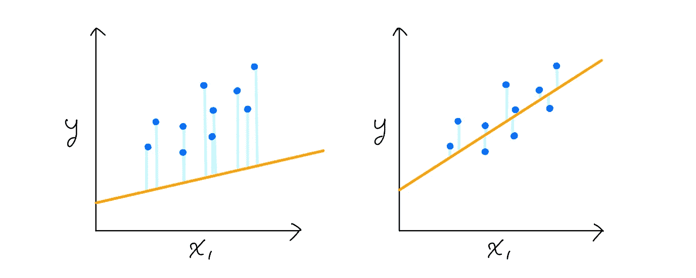

高损失与低损失（蓝线）相对于黄色回归线的对比。

损失函数（J）用作预测算法的性能测量工具，预测模型的主要目标是最小化其损失函数，这由模型参数的值（即 θ0 和 θ1）决定。

例如，线性回归模型通常使用平方损失来计算损失值，而均方误差是平均所有平方损失的损失函数。

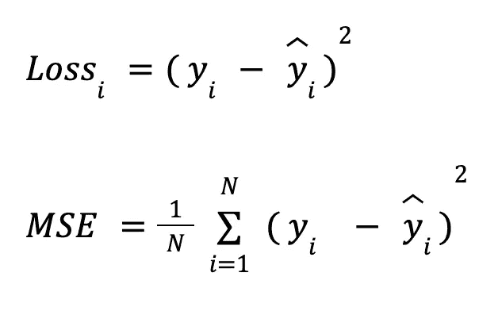

平方损失值（L2 损失）和均方误差（MSE）

线性回归模型在后台通过多次迭代来优化其系数，以达到尽可能低的均方误差。

## 什么是梯度下降？

梯度下降算法通常用山的类比来描述：

> ⛰ 想象你站在山顶，视野有限，你想要到达地面。在下坡时，你会遇到斜坡，并通过较大或较小的步伐通过它们。一旦你到达几乎平坦的斜坡，你就会知道你已经到达最低点。 ⛰

从技术上讲，**梯度**指的就是这些斜率。当斜率为零时，可能表示你已经到达了函数的最小值或最大值。

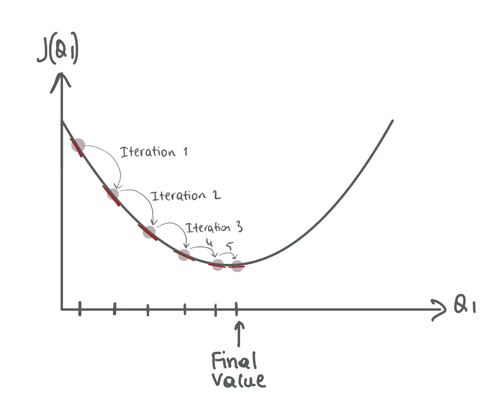

就像在山的类比中一样，GD 通过在梯度的相反方向上重复迈步来最小化起始损失值，从而减少损失函数。

在曲线上的任何一点，斜率的陡峭程度可以通过**切线**来确定——一条与该点相切的直线（如上图中的红线）。类似于切线，损失函数上某一点的梯度是相对于参数计算的，并且会朝相反方向迈出小步以减少损失。

总结一下，梯度下降的过程可以分解为以下步骤：

1.  选择模型参数的起始点。

1.  确定成本函数相对于参数的梯度，并通过迭代步骤不断调整参数值以最小化成本函数。

1.  重复步骤 2，直到成本函数不再减少或达到最大迭代次数。

我们可以检查之前定义的成本（损失）函数的梯度计算。虽然我们正在使用具有截距和系数的线性回归，但这种推理可以扩展到包含多个变量的回归模型。

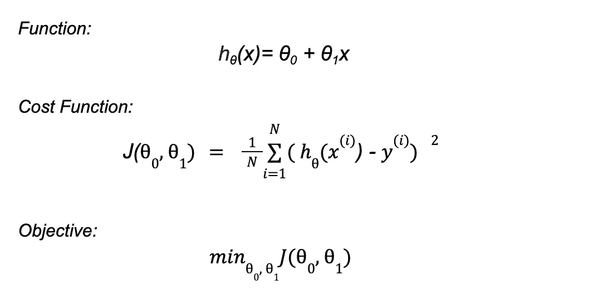

具有 2 个参数的线性回归函数、成本函数和目标函数

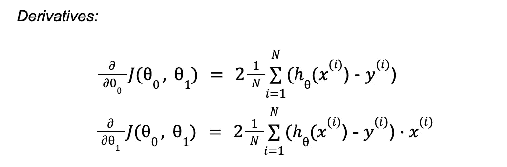

相对于模型参数计算的偏导数

💡 有时，已达到的点可能只是一个*局部最小值*或*平坦区域*。在这种情况下，模型需要继续迭代，直到达到全局最小值。不幸的是，达到全局最小值并不保证，但通过适当的迭代次数和学习率，我们可以提高成功的几率。

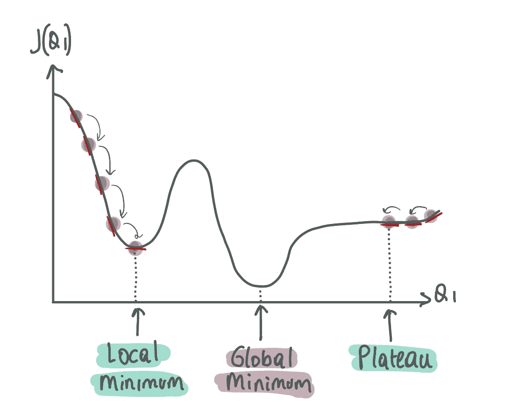

使用梯度下降时，需要注意可能会停留在局部最小值或平坦区域的挑战。为避免这种情况，选择适当的迭代次数和学习率至关重要。我们将在接下来的部分中进一步讨论这一点。

`Learning_rate`是定义学习步长大小的梯度下降超参数。可以使用[超参数调整技术](https://medium.com/towards-data-science/hyperparameter-tuning-with-grid-search-and-random-search-6e1b5e175144)进行调节。

+   如果`learning_rate`设置得过高，可能会导致跳跃，从而产生比起始点更大的损失值。高`learning_rate`可能会导致梯度下降**发散**，使其不断获得更高的损失值，阻止其找到最小值。

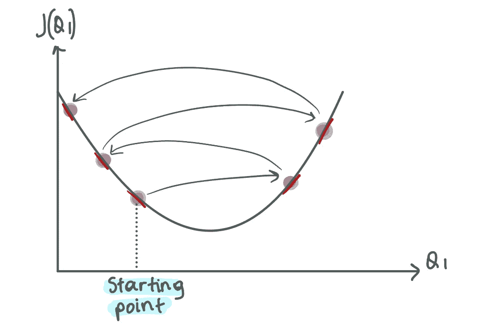

示例案例：高学习率导致梯度下降（GD）发散

+   如果`learning_rate`设置得过低，可能会导致计算过程漫长，梯度下降需要经历多个梯度计算轮次才能**收敛**并发现最小损失值。

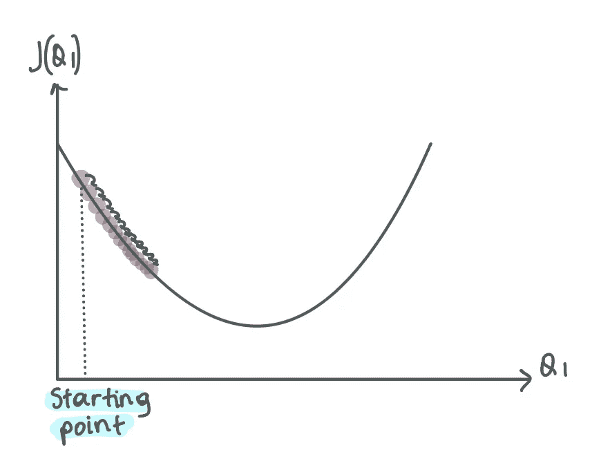

示例案例：低学习率导致梯度下降（GD）收敛所需时间过长

学习步长的值由曲线的斜率决定，这意味着随着我们接近最小点，学习步长变得越来越小。

当使用低学习率时，进展会比较平稳，而高学习率可能会导致指数级进展或停滞在低点。

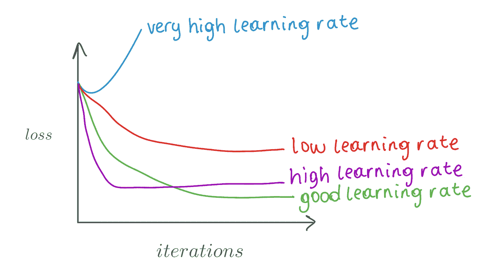

图像改编自[`cs231n.github.io/neural-networks-3/`](https://cs231n.github.io/neural-networks-3/)

现在我们将探讨梯度下降算法的三种不同实现。

# 1\. 批量梯度下降

批量梯度下降是实现梯度下降的最广泛使用的方法。它涉及在每次迭代时计算整个数据集相对于模型参数（如回归系数）的梯度。

让我们看一个例子 🔍

首先，生成一个截距为 5，系数为 4 的数据集，并添加少量高斯噪声。请参见下面生成数据的散点图。

```py
# Create example data set
x = 2 * np.random.rand(100,1)
y = 5 + 4 * x + np.random.randn(100,1)

# Make dataframe
regression_df = pd.DataFrame({'x':x.flatten(), 'y':y.flatten()})

# Plot
sns.lmplot(x='x', y='y', data=regression_df, fit_reg=False)
```

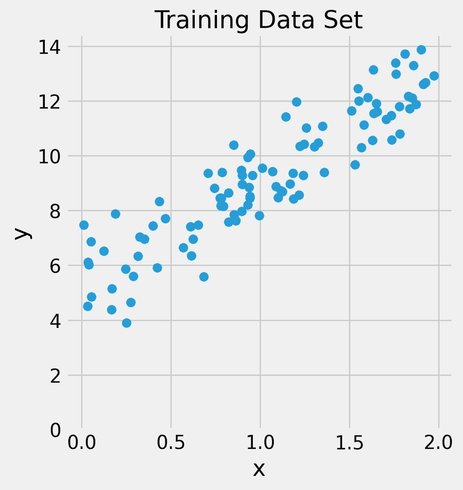

生成的数据的散点图

以下函数通过利用指定的学习率和迭代次数来执行批量梯度下降。最初，模型的系数（m）和截距（b）都设置为 0.5。在每次迭代中，通过计算预测值和实际值之间的差异来确定误差。然后，算法通过提取梯度来更新 m 和 b，梯度也会乘以学习率。循环持续进行，直到达到指定的迭代次数，结果的损失值和模型参数被存储在`params`和`loss`中。

```py
# Function to compute batch gradient descent
def batch_gradient_descent(x, y, learning_rate, iterations):

    '''
    Batch Gradient Descent implication. Inputs data,   
    learning rate, and number of iterations. Random m and
    b values are given to start the iteration. Returns optimal 
    model parameters as well as historical loss values.  
    '''

    m, b = 0.5, 0.5 
    params, loss = [], [] 
    N = len(x)

    for iteration in range(iterations):

        func = y - (m*x + b)

        # Updating m and b
        m -= learning_rate * (-2 * x.T.dot(func).sum() / N)
        b -= learning_rate * (-2 * func.sum() / N)

        params.append((m, b))
        loss.append(mean_squared_error(y, (m*x + b)))        

    return m, b, params, loss
```

使用上述函数，我们现在将测试不同的学习率并评估性能。

1️⃣ 让我们设置 `learning_rate=0.01`，进行 1000 次迭代，并绘制损失函数图。

```py
# Find optimal parameters using BGD
m, b, params, loss = batch_gradient_descent(x, y, learning_rate=0.01, 
iterations=1000)

# Predict y values using optimal parameters
y_predicted = m*x + b

# Print optimal parameters and final loss value
print("m:", m, "b:", b)
print("MSE:", mean_squared_error(y, y_predicted))

# Plot actual vs predicted value plot as well as historical loss values
plot_regression(x, y, y_predicted, params=params, 
title="Batch Gradient Descent with Learning Rate=0.01")
```

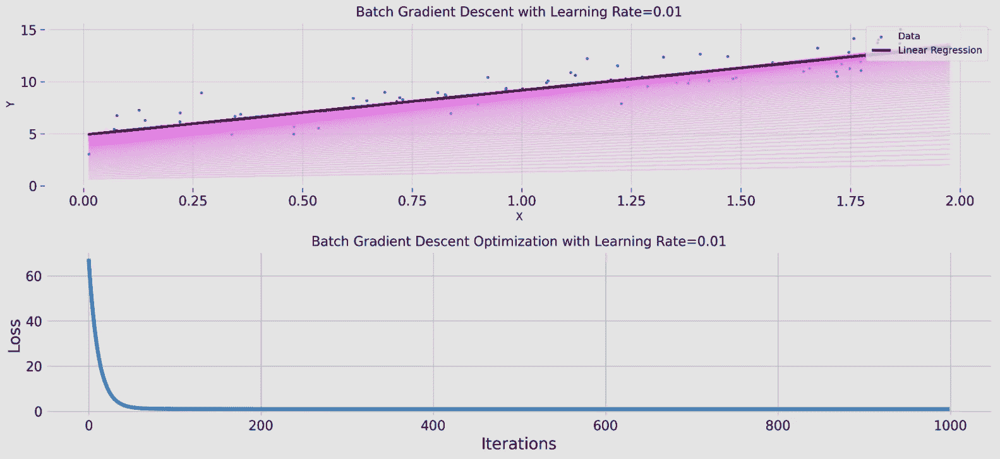

使用学习率为 0.01 和 1000 次迭代的批量梯度下降

> m: 4.27, b: 4.88, MSE: 0.95
> 
> 执行时间：367 毫秒

在上述图中，首先可以看到每次迭代生成的回归线（紫色），并注意它如何在大约 100 次迭代后逐渐接近最优。在第二个图中，损失函数在每次迭代后显示，在前 50-100 次迭代内损失显著减少。

2️⃣ 现在让我们设置 `learning_rate=0.001`，使用相同的迭代次数，并绘制损失函数图。

```py
# Find optimal parameters using BGD
m, b, params, loss = gradient_descent(x, y, learning_rate=0.001,
iterations=1000)

# Predict y values using optimal parameters
y_predicted = m*x + b

# Print optimal parameters and final loss value
print("m:", m, "b:", b)
print("MSE:", mean_squared_error(y, y_predicted))

# Plot actual vs predicted value plot as well as historical loss values
plot_regression(x, y, y_predicted, params=params, 
title="Batch Gradient Descent with Learning Rate=0.01")
```

> m: 4.67, b: 4.31, MSE: 1.05
> 
> 执行时间：522 毫秒

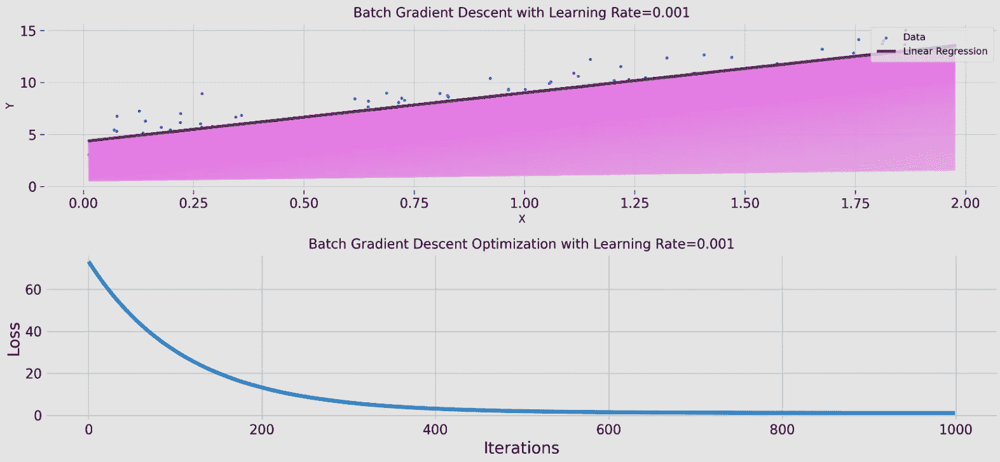

使用学习率为 0.001 和 1000 次迭代的批量梯度下降

当学习率降低时，模型需要更多时间才能收敛，并且最终损失值较高。第一个图显示了回归线下方更深的紫色阴影，这意味着在许多迭代中远离了最优线。此外，请注意将学习率从 0.01 减少到 0.001 导致执行时间从 367 毫秒增加到 522 毫秒。

3️⃣ 让我们使用相同的迭代次数设置 `learning_rate=0.1` 并绘制损失函数图。

```py
# Find optimal parameters using BGD
m, b, params, loss = gradient_descent(x, y, learning_rate=0.1,
iterations=1000)

# Predict y values using optimal parameters
y_predicted = m*x + b

# Print optimal parameters and final loss value
print("m:", m, "b:", b)
print("MSE:", mean_squared_error(y, y_predicted))

# Plot actual vs predicted value plot as well as historical loss values
plot_regression(x, y, y_predicted, params=params, 
title="Batch Gradient Descent with Learning Rate=0.01")
```

> m: 4.23, b: 4.93, MSE: 0.95
> 
> 执行时间：214 毫秒

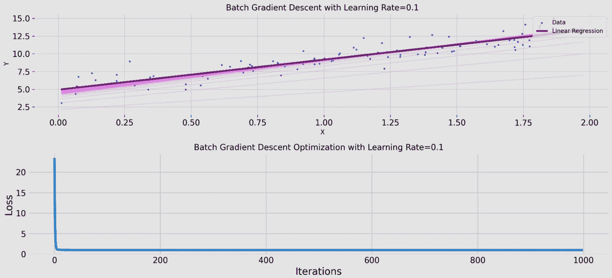

使用学习率为 0.1 和 1000 次迭代的批量梯度下降

当使用高学习率时，模型表现出快速收敛。在第一个图中，只有少数几次迭代中回归线远离最优线。在第二个图中，损失在前几次迭代中急剧下降，并保持稳定直到所有迭代完成。此外，执行时间在三次试验中最低，为 214 毫秒。

🚨 对于每次参数更新计算整个训练数据集的梯度在大型数据集上可能计算开销较大。幸运的是，随机梯度下降或小批量随机梯度下降可以帮助解决这个问题。

# 2\. 随机梯度下降

实现梯度下降的另一种方法是使用随机梯度下降。它特别适用于大型训练数据集，在这些数据集上，批量梯度下降可能需要过长的计算时间。

随机梯度下降通过仅计算一个**随机**数据点的损失值来更新模型系数，而不是计算训练数据集中的每个数据点并聚合。

随机选择数据点对于防止陷入类似值（如数据中的簇）是至关重要的。学习率和迭代次数也是关键因素，类似于批量梯度下降。

以下函数通过利用指定的学习率和迭代次数来执行随机梯度下降。初始时，模型的系数（m）和截距（b）设置为 0.5。在每次迭代中，使用`np.random`计算一个随机选择的数据点的误差。函数的其余步骤与批量梯度下降中的步骤相同。

```py
# Function to compute stochastic gradient descent 
def stochastic_gradient_descent(x, y, learning_rate, iterations):

    '''
    Stochastic Gradient Descent Implication. Inputs data,   
    learning rate, and number of iterations. Random m and
    b values are given to start the iteration. Index of the 
    random data is updated for each iteration. Returns 
    optimal model parameters as well as historical loss values.  
    '''

    m, b = 0.5, 0.5 # initial parameters
    params, loss = [], [] # lists to store learning process

    for iteration in range(iterations):

        # Sample a random index for loss calculation
        indexes = np.random.randint(0, len(x), 1)

        xi = np.take(x, indexes)
        yi = np.take(y, indexes)
        N = len(xi)

        func = yi - (m*xi + b)

        # Updating parameters m and b
        m -= learning_rate * (-2 * xi.dot(func).sum() / N)
        b -= learning_rate * (-2 * func.sum() / N)

        params.append((m, b))
        loss.append(mean_squared_error(y, m*x+b))        

    return m, b, params, loss
```

让我们尝试使用与批量梯度下降相同的学习率和迭代次数。

1️⃣ 让我们设置`learning_rate=0.01`并进行 1000 次迭代，然后绘制损失函数。

```py
# Find optimal parameters using SGD
m, b, params, loss = stochastic_gradient_descent(x, y, learning_rate=0.01, 
iterations=1000)

# Predict y values using optimal parameters
y_pred = m*x + b

# Print final loss value
print("MSE:", mean_squared_error(y, y_pred))

# Plot actual vs predicted value plot as well as historical loss values
plot_regression(x, y, y_pred, params=params, title="Stochastic Gradient Descent with Learning Rate=0.01")
```

> MSE: 0.97
> 
> 执行时间: 325 毫秒

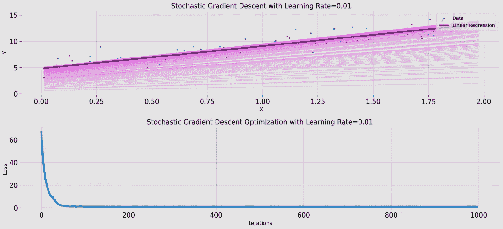

学习率为 0.01 和 1000 次迭代的随机梯度下降

注意到在相同学习率下，与批量梯度下降相比，我们将执行时间从 367 毫秒减少到 325 毫秒。然而，均方误差（MSE）从 0.95 增加到了 0.97。

2️⃣ 现在让我们设置`learning_rate=0.001`并进行 1000 次迭代，然后绘制损失函数。我不会包括代码片段，因为它与之前的示例相同。不过，如果需要，可以参考[文章的源代码](https://github.com/Idilismiguzel/Machine-Learning/blob/master/Gradient_Descent/gradient_descent_implementation.ipynb)。

> MSE: 1.03
> 
> 执行时间: 253 毫秒

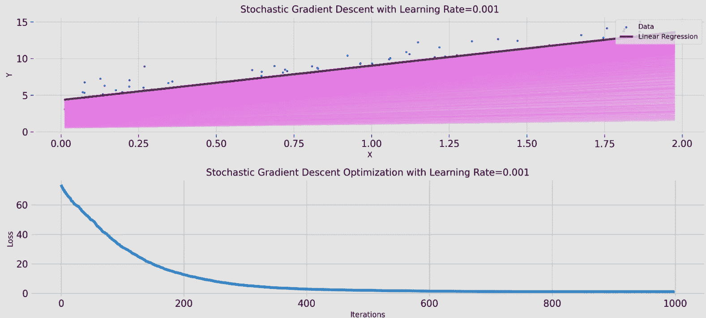

学习率为 0.001 和 1000 次迭代的随机梯度下降

注意到使用学习率为 0.001 的批量梯度下降，在 522 毫秒内得到了 1.05 的损失值。然而，使用相同学习率的随机梯度下降只需 253 毫秒就得到了 1.03 的损失值。

3️⃣ 现在让我们设置`learning_rate=0.1`并进行 1000 次迭代，然后绘制损失函数。

> MSE: 1.27
> 
> 执行时间: 237 毫秒

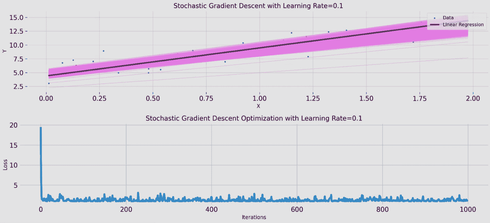

学习率为 0.1 和 1000 次迭代的随机梯度下降

使用高学习率的随机梯度下降时，计算引入了损失值的波动。如第一个图所示，存在许多迭代在最佳回归线的上方和下方。

总体而言，批量梯度下降在收敛到最小值方面优于随机梯度下降，因为随机梯度下降往往会在全局最小值附近徘徊。然而，如果仔细选择学习率，随机梯度下降也可以在较短的时间内达到类似的损失值（有时甚至更好）。

# 3\. 迷你批量梯度下降

迷你批量梯度下降是批量和随机梯度下降之间的一个有用的中间选项。它不是为整个数据集或单个观察值计算梯度，而是将训练数据分成较小的批次，并为每个批次计算梯度。

通过结合批量和随机方法，迷你批量 GD 在计算速度上优于批量模型，并且提高了随机模型的准确性。

以下函数执行迷你批量梯度下降，使用给定的学习率、设定的迭代次数和选定的批量大小。通过指定批量大小，我们可以确定每次梯度计算中包含的数据点数量。例如，在随机梯度下降中，批量大小为 1，梯度是针对单个数据点计算的。然而，如果我们设置批量大小为 10，那么梯度将会针对 10 个数据点进行计算，然后合并。

```py
# Function to compute mini-batch gradient descent
def mini_batch_gradient_descent(x, y, learning_rate, iterations, batch_size):

    '''
    Mini-Batch Gradient Descent implication. Inputs data,   
    learning rate, number of iterations and batch size.
    Random m and b values are given to start iteration. 
    Index of the random data is updated for each iteration 
    per batch. Returns optimal model parameters as well 
    as historical loss values.  
    '''

    m, b = 0.5, 0.5 
    params, loss = [], [] 

    for iteration in range(iterations):

        indexes = np.random.randint(0, len(x), batch_size)

        xi = np.take(x, indexes)
        yi = np.take(y, indexes)
        N = len(xi)

        func = yi - (m*xi + b)

        # Updating parameters m and b
        m -= learning_rate * (-2 * xi.dot(func).sum() / N)
        b -= learning_rate * (-2 * func.sum() / N)

        params.append((m, b))
        loss.append(mean_squared_error(y, m*x+b))        

    return m, b, params, loss
```

使用批量大小为 10 的情况下，测试相同的 3 种情况，`learning_rate=0.01`、`learning_rate=0.001`和`learning_rate=0.1`。

1️⃣ `learning_rate=0.01` 并进行 1000 次迭代。

```py
# Find optimal parameters using MBGD
m, b, params, loss = mini_batch_gradient_descent(x, y, learning_rate=0.01,
iterations=1000, batch_size=10)

# Predict y values using optimal parameters
y_pred = m*x + b

# Print final loss value
print("MSE:",mean_squared_error(y, y_pred))

# Plot actual vs predicted value plot as well as historical loss values
plot_regression(x, y, y_pred, params=params,
title="Mini-Batch Gradient Descent with Learning Rate=0.01")
```

> MSE: 0.96
> 
> 执行时间：224 毫秒

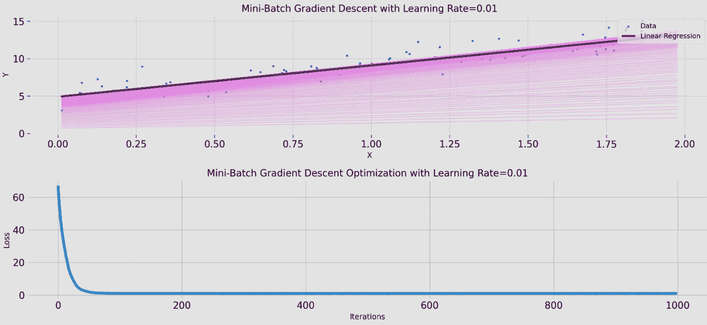

使用学习率为 0.01 和 1000 次迭代的迷你批量梯度下降

你是否注意到，使用 0.01 的学习率时，我们能够在 367 毫秒内通过批量 GD 达到 MSE 为 0.95，而使用随机 GD 则在 325 毫秒内得到 MSE 为 0.97？此外，通过迷你批量梯度下降，我们能够在仅 224 毫秒内达到 MSE 为 0.96。

2️⃣ `learning_rate=0.001` 并进行 1000 次迭代。

> MSE: 1.04
> 
> 执行时间：485 毫秒

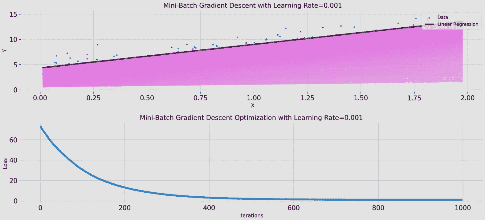

使用学习率为 0.001 和 1000 次迭代的迷你批量梯度下降

值得注意的是，通过使用相同的学习率，我们成功地将执行时间从 522 毫秒减少到 485 毫秒，相比批量梯度下降。此外，均方误差（MSE）从 1.05 降到了 1.04。

3️⃣ `learning_rate=0.1` 并进行 1000 次迭代。

> MSE: 0.97
> 
> 执行时间：239 毫秒

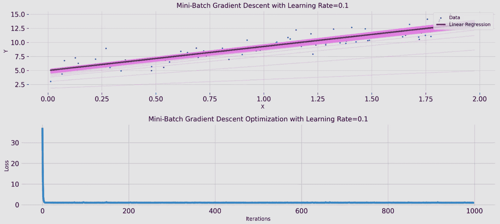

使用学习率为 0.1 和 1000 次迭代的迷你批量梯度下降

通过实现迷你批量，消除了在随机梯度下降历史损失值中观察到的不规则性，并且模型收敛非常快。

# 结论

在这篇文章中，我们深入探讨了梯度下降算法及其三种主要实现——批量、随机和小批量。通过一系列实验，我们比较了这三种实现的不同学习率和迭代次数。我们发现，批量梯度下降能够获得最准确的模型参数，导致最低的损失值，尽管需要的时间最长。另一方面，随机梯度下降虽然准确度较低，但计算速度最快。最后，我们探索了小批量梯度下降，发现它在合理的执行时间内达到了中等的准确度。

希望你喜欢阅读有关梯度下降的内容，并觉得这篇文章有用！✨

🍓 如果你喜欢阅读这样的文章并希望支持我的写作，你可以考虑 [成为 Medium 会员](https://idilismiguzel.medium.com/membership)! Medium 会员可以全面访问所有作者的文章，如果你使用 [我的推荐链接](https://idilismiguzel.medium.com/membership)，你将直接支持我的写作。

🍓 如果你已经是会员并且有兴趣阅读我的文章，你可以 [订阅以获取通知](https://medium.com/subscribe/@idilismiguzel) 或 [在 Medium 上关注我](https://idilismiguzel.medium.com)。如果你有任何问题或建议，请告诉我。✨

## 我推荐在阅读完这篇文章后进一步阅读的附加资源：

1.  了解通过这两种最常见的方法进行超参数调整的概念。

[](/hyperparameter-tuning-with-grid-search-and-random-search-6e1b5e175144?source=post_page-----246e324c229--------------------------------) ## 网格搜索和随机搜索的超参数调整

### 以及深入探讨如何将它们结合起来

[towardsdatascience.com

2\. 理解线性回归模型及其假设。

[](/linear-regression-model-with-python-481c89f0f05b?source=post_page-----246e324c229--------------------------------) ## 使用 Python 的线性回归模型

### 如何通过图形和数值输出构建和检查回归模型的质量

[towardsdatascience.com

参考文献

1.  头图由 [Lucas Clara](https://unsplash.com/ko/@lux17?utm_source=medium&utm_medium=referral) 提供，来源于 [Unsplash](https://unsplash.com/?utm_source=medium&utm_medium=referral)

1.  学习率图表改编自 [`cs231n.github.io/neural-networks-3/`](https://cs231n.github.io/neural-networks-3/)

1.  所有其他图片由作者提供
