# 理解群体顺序测试

> 原文：[`towardsdatascience.com/understanding-group-sequential-testing-befb35cec07a`](https://towardsdatascience.com/understanding-group-sequential-testing-befb35cec07a)

## [因果数据科学](https://towardsdatascience.com/tagged/causal-data-science)

## *如何进行有效的实验，包括窥视和提前停止。*

[](https://medium.com/@matteo.courthoud?source=post_page-----befb35cec07a--------------------------------)[](https://towardsdatascience.com/?source=post_page-----befb35cec07a--------------------------------) [Matteo Courthoud](https://medium.com/@matteo.courthoud?source=post_page-----befb35cec07a--------------------------------)

·发表于 [Towards Data Science](https://towardsdatascience.com/?source=post_page-----befb35cec07a--------------------------------) ·15 分钟阅读·2023 年 12 月 26 日

--

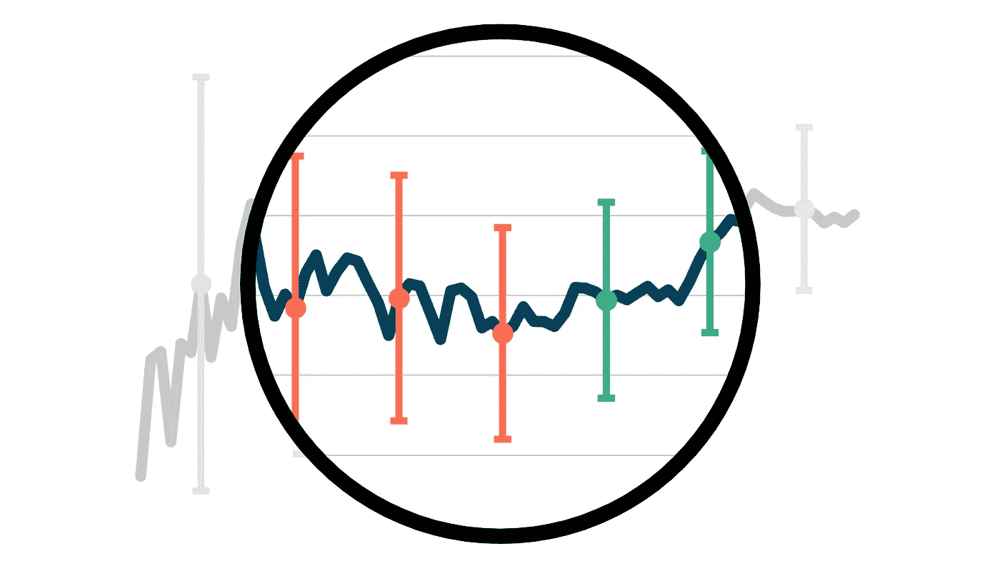

封面，图片由作者提供

A/B 测试是因果推断的黄金标准，因为它们允许我们在最小假设下做出有效的因果陈述，这要归功于**随机化**。实际上，通过随机分配**处理**（药物、广告、产品等），我们可以比较**结果**（疾病、公司收入、客户满意度等）在**受试者**（患者、用户、客户等）之间的差异，并将结果的平均差异归因于处理的因果效应。

实施 A/B 测试通常不是瞬间完成的，尤其是在在线环境中。用户通常是**实时**或**分批**处理的。在这些情况下，可以在数据收集完成之前多次查看数据。这种现象被称为**窥视**。虽然窥视本身并不成问题，但在窥视时使用标准测试程序可能会导致**误导性结论**。

解决**窥视**问题的方法是相应地调整测试程序。最著名和传统的方法是所谓的**序列概率比检验 (SPRT)**，该方法可以追溯到第二次世界大战。如果你想了解更多关于这个测试及其迷人的历史，我写了一篇博客文章。

[](/experiments-peeking-and-optimal-stopping-954506cec665?source=post_page-----befb35cec07a--------------------------------) ## 实验、窥视与最优停止

### 编辑描述

towardsdatascience.com

顺序概率比检验（SPRT）的主要**优点**是它在给定目标置信水平和功效的情况下，保证了最小的样本量。然而，SPRT 的**主要问题**是它可能会无限期地继续。这在有截止日期和预算限制的应用环境中是一个非无关的问题。在这篇文章中，我们将探索一种**替代方法**，允许在数据收集的*任何*点进行*任何*数量的中间窥探：**分组顺序测试**。

# 模拟

让我们从一些模拟的**数据**开始。为了保持代码尽可能简洁，我将抽象化实验设置，直接处理来自**正态分布**的数据。然而，我们可以将其视为标准 A/B 测试中平均治疗效果的分布。正态分布是基于[中心极限定理](https://en.wikipedia.org/wiki/Central_limit_theorem)的渐近近似。

在生成数据之前，我从[src.theme](https://github.com/matteocourthoud/Blog-Posts/blob/main/notebooks/src/theme.py)导入相关库和我的绘图主题。

```py
from src.theme import *
import numpy as np
import pandas as pd
import scipy as sp
```

假设真实的数据生成过程确实是一个正态分布，**均值**为*μ=1*，**标准差**为*σ=5.644*。在 A/B 测试的背景下，我们可以将其视为一个正的平均治疗效果，标准差比效果大 5 倍以上。

```py
mu = 1
sigma = 5.644
```

我们希望建立一个双侧检验，具有*95%*的置信度和*80%*的功效。因此，我们的目标假阳性错误率将是*α=0.05*，目标假阴性错误率将是*β=0.2*。

```py
alpha = 0.05
beta = 0.2
```

我们现在可以计算实验所需的样本量，假设平均治疗效果为*1*，标准差为*5.664*。由于我们已经抽象化了两个组的比较，功效计算的公式是


功效计算公式，图片来源于作者

其中*zs*是标准正态分布的分位数，计算在*1-α/2*和*1-β*处。

```py
ppf = sp.stats.norm(0, 1).ppf
cdf = sp.stats.norm(0, 1).cdf
z_alpha = ppf(1 - alpha/2)
z_beta = ppf(1 - beta)
N = int((2 * sigma * (z_alpha + z_beta) / mu)**2)
print(f"Number of obserations needed: {N}")
```

```py
Number of obserations needed: 1000
```

我们需要*N=1000*个观察值来达到目标置信水平*95%*和功效*80%*。

我们现在可以绘制模拟数据。由于我们将经常比较不同模拟结果，我们绘制*K=10,000*个*N=1,000*数据点的序列。

```py
K = 10_000
np.random.seed(2)
obs = np.random.normal(mu, sigma, size=(N, K))
```

我们现在准备调查窥探和分组顺序测试。

# 窥探

如果我们在实验**结束前**对数据进行**窥探**会发生什么？

假设例如我们每*50*个观察值查看一次数据，从*100*开始。一个原因可能是数据以批次到达，或者我们每天一开始工作时就进行窥探。

```py
N_peek = np.arange(100, N+1, 50, dtype=int)
N_peek
```

```py
array([ 100,  150,  200,  250,  300,  350,  400,  450,  500,  550,  600,  650,  700,  750,  800,  850,  900,  950, 1000])
```

观察数据本身当然不是问题*per-se*。然而，我们可能会被诱使**得出结论**，基于我们观察到的内容。假设我们的*幼稚*实验平台持续报告最新的平均值、标准差和置信区间，其中置信区间计算方式如下：


在不窥视的情况下的置信区间，图片由作者提供

其中 *n* 是样本数量，*μ̂ₙ* 是经过 *n* 个样本后的估计样本均值，*σ̂ₙ* 是经过 *n* 个样本后的估计标准差，*α* 是显著性水平，*z* 是标准正态分布的 *1-α/2* 分位数。

```py
def select_alpha_naive(n, N, N_peek, alpha):
    return alpha
```

假设我们决定**在获得一个显著结果后停止实验**。

让我们计算在每个窥视点上观察到的置信区间。

```py
def compute_intervals(select_alpha, obs, N_peek, alpha=0.05, **kwargs):
    # Compute rolling mean and standard deviation
    N, K = np.shape(obs)
    ns = np.reshape(np.arange(1, N+1), (-1, 1))
    means = np.cumsum(obs, axis=0) / ns
    stdevs = np.sqrt(np.cumsum((obs - means)**2, axis=0) / ns)

    # Compute intervals at each peeking time
    df_intervals = pd.DataFrame({"k": range(K)})
    df_intervals["rejected_0"] = False
    df_intervals["rejected_1"] = False
    df_intervals["length"] = max(N_peek)
    for t, n in enumerate(N_peek):
        df_intervals[f"mean{n}"] = means[n-1, :]
        df_intervals[f"width{n}"] = ppf(1 - select_alpha(n, N, N_peek, alpha, **kwargs)/2) * stdevs[n-1, :] / np.sqrt(n)
        df_intervals[f"lowerb{n}"] = means[n-1, :] - df_intervals[f"width{n}"]
        df_intervals[f"upperb{n}"] = means[n-1, :] + df_intervals[f"width{n}"]
        df_intervals[f"coverage{n}"] = (df_intervals[f"lowerb{n}"] <= mu) & (df_intervals[f"upperb{n}"] >= mu)
        df_intervals["rejected_0"] = df_intervals["rejected_0"] | (df_intervals[f"lowerb{n}"] >= 0) | (df_intervals[f"upperb{n}"] <= 0)
        df_intervals[f"power{n}"] = df_intervals["rejected_0"]
        df_intervals["rejected_1"] = df_intervals["rejected_1"] | ~df_intervals[f"coverage{n}"]
        df_intervals[f"falsep{n}"] = df_intervals["rejected_1"]
        df_intervals["length"] = np.minimum(df_intervals["length"], n) * df_intervals["rejected_0"] + max(N_peek) * (1 - df_intervals["rejected_0"])
    return df_intervals
```

```py
dfi_naive = compute_intervals(select_alpha_naive, obs, N_peek)
```

这些平均值和置信区间随时间的变化是什么样的？在下图中，我绘制了数据收集的累积平均值，以及每次窥视时的置信区间。

```py
plot_peeking(dfi_naive, obs)
```

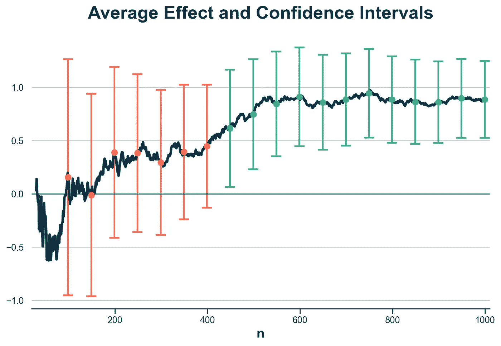

累积平均效应和窥视置信区间，图片由作者提供

如我们所见，前七次观察数据时，置信区间穿过零线，因此我们未能拒绝零均值的零假设。我用橙色标出了这些置信区间。然而，在第八次观察数据时，即*450*次观察，置信区间没有穿过零线，因此我们**拒绝零假设**，结束实验。

这个过程的问题与**多重假设检验**非常相似：我们为单次数据观察构建置信区间，因此做出*单个*决定，但实际上我们做出了*多个*决定。事实上，我们已经*决定*在达到 *450* 次观察之前七次不停止实验，而在 *450* 次观察时停止了实验。

窥视和早期停止的**后果**是什么？让我们看看如果我们重复这个实验多次会发生什么。我们现在将绘制*100*个不同模拟在三个不同时间点的置信区间：在*200*、*400* 和 *600* 次观察后。请注意，这些分别对应于第*3*次、第*7*次和第*11*次数据窥视。

```py
N_plot = [200, 400, 600]
```

我们首先要检查的是**覆盖率**：置信区间是否真的*覆盖*了真实的处理效应，正如它们所应该的那样？我标出了那些没有覆盖的置信区间。

```py
plot_intervals(dfi_naive, N_plot, "coverage")
```

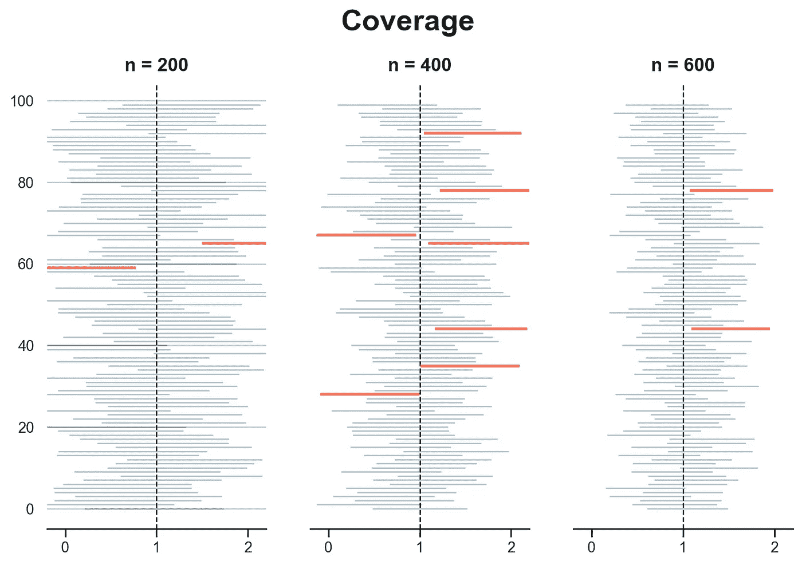

使用幼稚测试的 100 次模拟的覆盖情况，图片由作者提供

看起来我们的覆盖率在每个时间点都是正常的。我们分别在*100*次模拟中有*2*、*6*和*2*次不覆盖真实治疗效应（*μ=1*）。这是可以预期的，因为我们的置信水平是*5%*，因此我们期望*100*个区间中*平均*有*5*个不覆盖真实治疗效应。

接下来，我们研究**功效**：我们估计量在确实存在效应时检测效应的能力。记住，功效总是*相对于*效应大小的。然而，我们在进行功效计算时使用了真实效应，因此我们期望实验达到*80%*的预期功效。

请注意，由于我们进行观察，我们会在*测试*显著时拒绝原假设并停止实验。因此，在我们案例中，特定时间点的功效是拒绝原假设的概率，无论是该测试还是*任何*之前的测试。

```py
plot_intervals(dfi_naive, N_plot, "power")
```

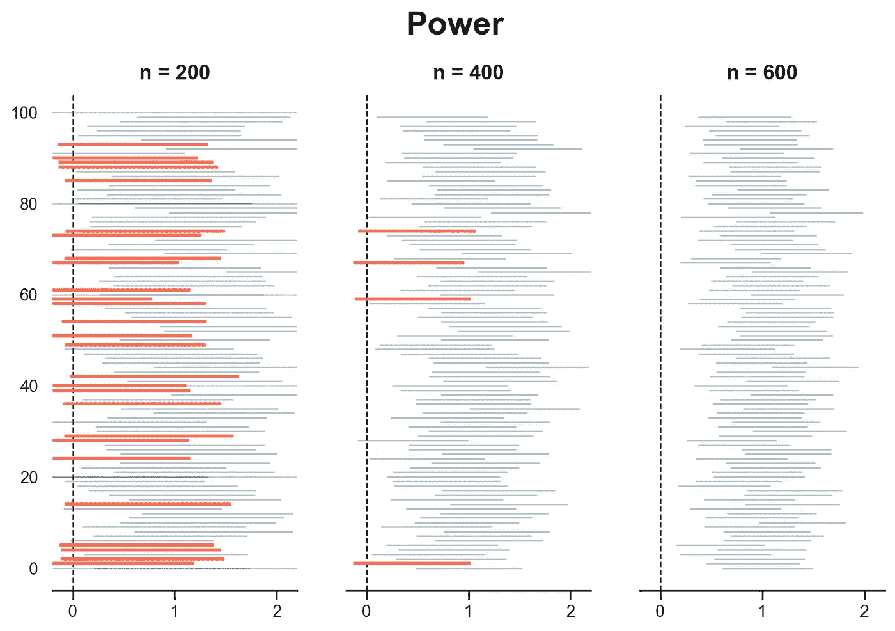

使用朴素测试的 100 次模拟中的功效，图像由作者提供

如我们所见，在*200*次观察时，我们已经在*100*次模拟中的*72*次拒绝了没有效应的原假设（*μ=0*），接近目标功效的*80%*。然而，在*400*次观察时，我们在超过*100*次模拟中的*80*次拒绝了原假设，表明我们可以缩短实验时间。

到目前为止，一切似乎都很顺利：我们的区间覆盖了真实效应，并且比预期更快地拒绝了原假设。让我们检查所有的观察阶段和*10,000*次模拟。我们还要检查第三个指标：**假阳性**错误率。为了计算这个，我们将原假设更改为*μ=1*并检查我们拒绝它的频率。同样，由于我们进行了多次观察，重要的是特定观察阶段或*任何*之前的阶段的拒绝率。

在下图中，我绘制了每个观察阶段*10,000*次模拟中的覆盖率、功效和错误拒绝率。

```py
plot_coverage_power(dfi_naive)
```

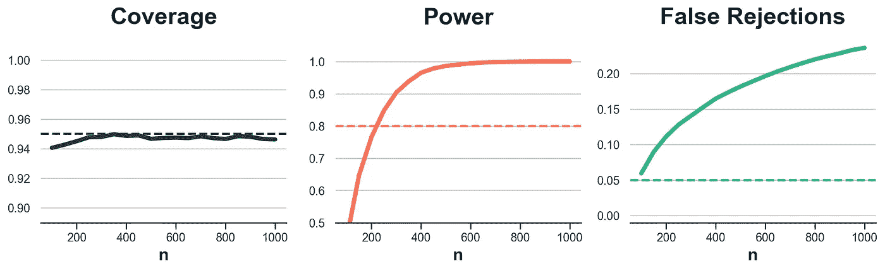

使用朴素测试的*10,000*次模拟中的估计器性能，图像由作者提供

覆盖率似乎符合预期。功效在大约*250*次观察后已达到*80%*以上，确认了我们之前的见解。然而，错误拒绝率远高于目标的*5%*。这意味着当原假设为真时，我们的拒绝频率高于应有的水平。

我们最后要检查的是实验是否确实在平均上更短，以及短了多少。让我们计算**平均实验长度**，以观察次数为单位。

```py
print(f"Average length: n = {dfi_naive.length.mean():.0f}", )
```

```py
Average length: n = 177
```

平均而言，我们只需*177*次观察即可得出结论！然而，由于较高的错误拒绝率，这些可能是**错误的结论**。

我们可以怎么解决这个问题？我们需要构建考虑到我们在顺序中进行多次测试的置信区间。

# Alpha 修正

在本节中，我们将探讨第一组校正，这些校正会修改用于计算置信区间的*α*值，以考虑窥视和提前停止。

## Bonferroni 校正

由于窥视问题类似于多重假设测试，我们可以从应用相同的解决方案开始。

处理多重假设测试的最简单方法是所谓的 [**Bonferroni 校正**](https://en.wikipedia.org/wiki/Bonferroni_correction)。这个想法很简单：根据观察次数按比例减少显著性水平*α*。特别是，我们不再对每次观察使用相同的*α*，而是使用


Bonferroni 的α校正，作者提供的图像

其中 *P* 是我们计划窥视的次数。

```py
def select_alpha_bonferroni(n, N, N_peek, alpha):
    P = len(N_peek)
    return alpha / P
```

Bonferroni 校正在**覆盖率**方面表现如何？让我们绘制三个窥视阶段的置信区间：在收集了*200*、*400* 和 *600* 次观察后。

```py
dfi_bonferroni = compute_intervals(select_alpha_bonferroni, obs, N_peek)
plot_intervals(dfi_bonferroni, N_plot, "coverage")
```

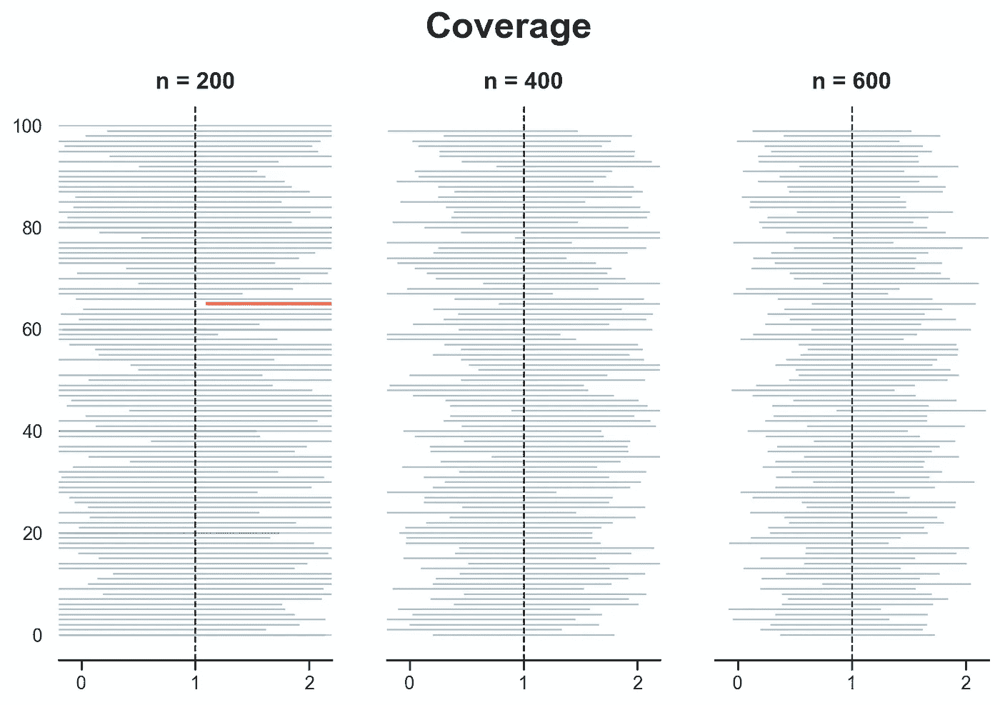

Bonferroni 校正下的覆盖率在 100 次模拟中，作者提供的图像

覆盖率看起来很棒！只有一次在*n=200*时一个区间没有覆盖真实值*μ=1*。

虽然这在一开始可能让人感到安慰，但实际上应该引起警觉。事实上，使用显著性水平*α=0.05*时，我们期望的覆盖率是*95%*。更高的覆盖率很可能会以**功效**为代价。我们来看看。

```py
plot_intervals(dfi_bonferroni, N_plot, "power")
```

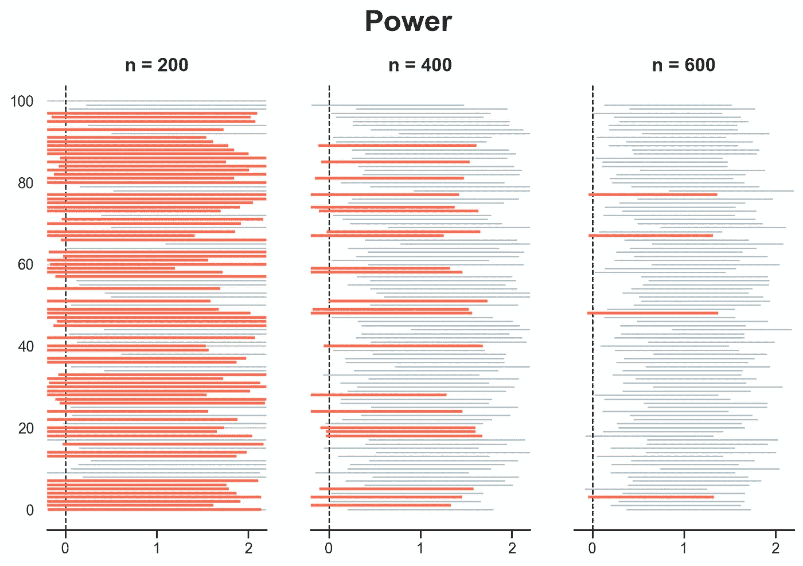

Bonferroni 校正下的功效在 100 次模拟中，作者提供的图像

在*200*次观察下测试功效不足，而在*400*次观察下功效非常接近目标的*80%*。在*600*次观察时，我们几乎达到了 100% 的功效。

让我们绘制每个窥视阶段的覆盖率、功效和假阳性率，基于*K=10,000*次模拟。

```py
plot_coverage_power(dfi_bonferroni)
```

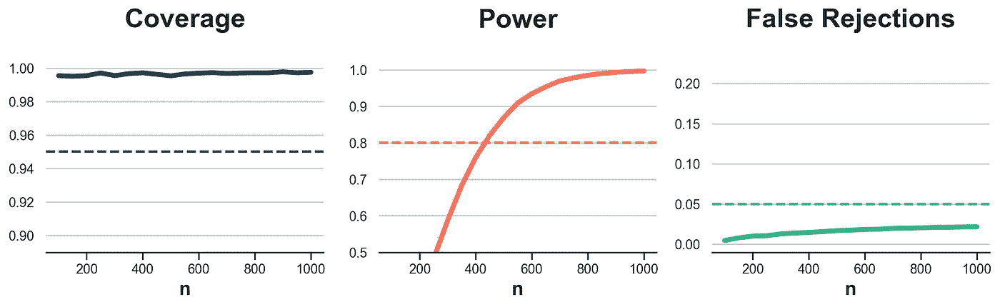

Bonferroni 校正在 10,000 次模拟中的估计性能，作者提供的图像

覆盖率很好，功效在大约*450*次观察后达到目标，虚假拒绝率始终低于*5%*的目标。那么平均实验长度呢？

```py
print(f"Average length: n = {dfi_bonferroni.length.mean():.0f}", )
```

```py
Average length: n = 317
```

平均实验长度为*317*次观察，高于朴素测试程序，但仍明显低于未经窥视所需的*1000*次观察。

一切看起来都不错，甚至可能**过于完美**。确实，可能还有改进的空间。考虑到如此高的覆盖率和低的虚假拒绝率，结果表明我们可以缩短置信区间，从而提高功效和降低实验长度，同时不低于*95%*的覆盖率或超过*5%*的虚假拒绝率。如何？

Bonferroni 校正有**两个缺点**。首先，它**不是为序列测试设计**的，而是为多重假设测试设计的。其次，即使是多重假设测试，它也被认为是非常**保守**的。

## 校正

**Bonferroni 的序贯检验校正**的第一个版本是[Pocock (1977)](https://www.jstor.org/stable/2335684)。其思想是考虑检验的**序贯**特性，这会在检验统计量之间生成非常特定的相关结构。由于这一洞察，Pocock 能够使用一个校正的*α*值，该值介于天真的*α*和 Bonferroni 的*α/P*之间。比 Bonferroni 更大的*α*意味着更高的功效，同时保持高覆盖率和低假阳性率。这些值是通过一个数值算法得出的，该算法以显著性水平*α*和总窥探次数*P*作为输入。

Pocock 校正的问题在于它未能充分利用检验的序贯特性，因为置信区间随时间保持不变。[O’Brien 和 Fleming (1979)](https://www.jstor.org/stable/2530245) 提出了使用**时间变化**的*α*校正。他们的想法是使置信区间的宽度不仅适应显著性水平*α*和总窥探次数*P*，还适应每次窥探*p*。

然而，这些程序的主要缺点是它们要求**提前规划**窥探次数。这通常是*不切实际的*，因为窥探是一个固有的自发过程，来源于数据批量的大小、管理层的压力或实验者的好奇心。

当窥探**未提前规划**时，我们该怎么办？

# **组序贯检验**

[Lan 和 DeMets (1983)](https://www.jstor.org/stable/2336502)注意到，窥探中重要的不是*你窥探了多少*，而是*你何时窥探*。**组序贯检验（GST）**的主要思想是允许在任何时间点进行窥探，并在数据收集过程中对窥探时间点的显著性水平进行校正，*t = n/N*。

组序贯检验的动态部分是所谓的**α花费函数**，它决定了如何根据窥探时间*t*来校正显著性水平*α*。在本文的其余部分，我们将回顾两个α花费函数，分别近似于[Pocock (1977)](https://www.jstor.org/stable/2335684)和[O’Brien 和 Fleming (1979)](https://www.jstor.org/stable/2530245)的校正。

## GST Pocock 近似

第一个α花费函数是[Pocock (1977)](https://www.jstor.org/stable/2335684)的近似，其表达式为


Pocock 的α花费函数用于组序贯检验，图片来源于作者

请注意，当观察比例*t=n/N*达到整个样本(*t=1*)时，Pocock 的校正会收敛到原始显著性水平*α*。

```py
def select_alpha_gst_pocock(n, N, N_peek, alpha):
    t = n / N
    return alpha * np.log(1 + (np.exp(1) - 1) * t)
```

让我们看看使用 Pocock 的α花费函数的组序贯检验如何工作。

```py
dfi_gst_pocock = compute_intervals(select_alpha_gst_pocock, obs, N_peek)
plot_coverage_power(dfi_gst_pocock)
```

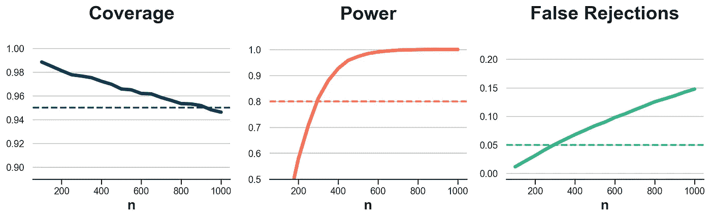

使用 Pocock 的 GST 进行 10,000 次模拟的估计器性能，图片来源于作者

正如我们之前提到的，覆盖率趋向于目标覆盖率，观察次数增加。实验似乎也比使用 Bonferroni 校正的功效更强，但如果实验运行时间过长，虚假拒绝率会超过*5%*的目标。

平均实验长度怎么样？

```py
print(f"Average length: n = {dfi_gst_pocock.length.mean():.0f}", )
```

```py
Average length: n = 229
```

平均实验长度确实低于 Boferroni，平均为*229*次观察，而不是*317*次。

## GST O’Brien & Fleming 近似

第二个α支出函数是[O’Brien, Fleming (1979)](https://www.jstor.org/stable/2530245)的近似，其表达式为


O’Brien 和 Fleming 的组序贯测试α支出函数，图像由作者提供

其中**Φ**是标准正态分布的累积分布函数（CDF），而*ρ*是一个自由参数，通常默认为*ρ=1*。

```py
def select_alpha_gst_obrien_fleming(n, N, N_peek, alpha, rho=1):
    t = n / N
    return 4 - 4 * cdf(ppf(1 - alpha/4) / t**(rho/2))
```

让我们看看使用 O’Brien 和 Fleming 近似的组序贯测试在*K=10,000*次模拟中的表现。

```py
dfi_gst_obrien_fleming = compute_intervals(select_alpha_gst_obrien_fleming, obs, N_peek)
plot_coverage_power(dfi_gst_obrien_fleming)
```

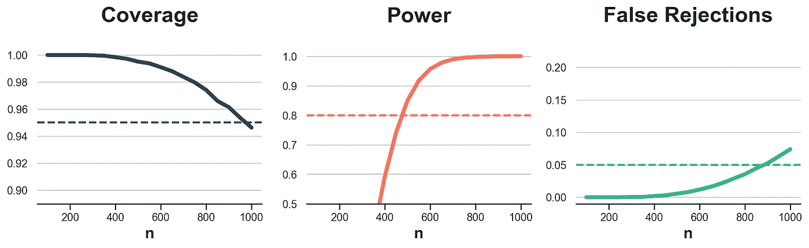

使用 O’Brien 和 Fleming 的 GST 在 10,000 次模拟中的估计性能，图像由作者提供

看起来 O’Brien 和 Fleming 的近似比 Pocock 的更保守，具有更高的覆盖率和较低的功效，但虚假拒绝率更接近*5%*目标。

```py
print(f"Average length: n = {dfi_gst_obrien_fleming.length.mean():.0f}", )
```

```py
Average length: n = 414
```

平均实验长度实际上高于 Boferroni，平均为*414*次观察，而不是*317*次。然而，通过在校正公式中降低参数*ρ*，可以减少这一数值。以*ρ=0.5*为例，它对应于[Wang, Tsiatis (1987)](https://www.jstor.org/stable/2531959)的校正。

```py
dfi_gst_obrien_fleming_05 = compute_intervals(select_alpha_gst_obrien_fleming, obs, N_peek, rho=0.5)
print(f"Average length: n = {dfi_gst_obrien_fleming_05.length.mean():.0f}", )
```

```py
Average length: n = 303
```

确实，使用较低的*ρ*，我们已将平均实验长度从*414*减少到*303*次观察。

## α支出权衡

在总结之前，值得看看窥视的权衡。我们引入了一种方法，使我们能够在任何时候进行有效推断。然而，**我们应该窥视吗**？如果是的话，**窥视多少次**呢？

在下图中，我绘制了使用 Pocock 近似的组序贯测试的测试性能，当我们**增加窥视频率**从*50*次观察到*10*次观察时。

```py
N_peek_10 = np.arange(30, N+1, 10, dtype=int)
dfi_gst_10 = compute_intervals(select_alpha_gst_pocock, obs, N_peek_10)
plot_coverage_power(dfi_gst_10)
```

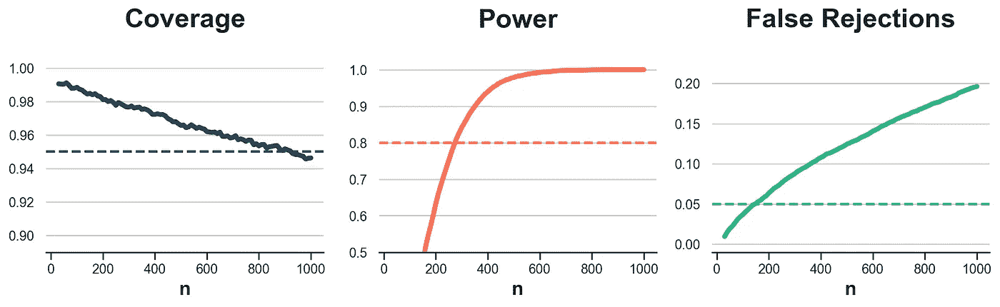

每 10 次观察下的 GST 估计性能，图像由作者提供

如我们所见，覆盖率基本不受影响，而功效和虚假拒绝率有所增加。平均实验长度也从*229*减少到*188*次观察。

```py
print(f"Average length: n = {dfi_gst_10.length.mean():.0f}", )
```

```py
Average length: n = 188
```

如果我们**减少窥视频率**会怎样？在下图中，我绘制了每 200 次观察时的结果。

```py
N_peek_200 = np.arange(200, N+1, 200, dtype=int)
dfi_gst_200 = compute_intervals(select_alpha_gst_pocock, obs, N_peek_200)
plot_coverage_power(dfi_gst_200)
```

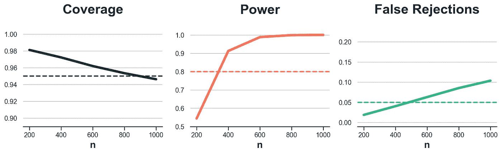

每 200 次观察下的 GST 估计性能，图像由作者提供

从图中我们可以看到相反的结果：功效和虚假拒绝都减少了。另一方面，现在我们平均需要 *311* 次观测才能得出结论，而不是 *229* 次。

```py
print(f"Average length: n = {dfi_gst_200.length.mean():.0f}", )
```

```py
Average length: n = 311
```

# 结论

在本文中，我们探讨了 **组顺序测试**，一种在 A/B 测试中任何次数和任何时刻进行窥探时做出有效推断的程序。我们还看到窥探并不是免费的。主要的 **权衡** 是，我们窥探的次数越多，实验停止得越早，但虚假拒绝率也越高。

文章中至少还有几个我没有提及的主题，以避免过长。第一个是 **偏倚**。顺序测试容易引入偏倚，因为提前停止可能是由于低方差或大效应。由于后者，顺序测试往往会导致对治疗效果的 *高估*。这种现象通常称为 *赢家的诅咒*，通常发生在研究的功效不足时，即在早期窥探阶段。一种解决方案是设计一个 **β 花费** 函数。

我没有涵盖的第二个主题是所谓的 **因无效而停止**。在本文的例子中，如果我们得到统计上显著的估计值，我们就提前停止实验。然而，窥探也可以告知另一种停止规则：因为继续测试变得极不可能产生显著结果而停止。

我没有涵盖的最后一个主题是如何进行 **功效分析**。在上面的例子中，我们在一开始就进行了功效分析，假设没有窥探。然而，鉴于我们知道我们会窥探，我们本可以预期需要一个更小的样本。一个密切相关的主题是 **最佳窥探**。一旦决定要窥探，应该何时进行？

## 参考文献

+   Lakens, Pahlke, Wassmer (2021). [组顺序设计：教程](https://osf.io/preprints/psyarxiv/x4azm)

+   Lan, DeMets (1983). [临床试验的离散顺序边界](https://academic.oup.com/biomet/article-abstract/70/3/659/247777)

+   Spotify (2023). [选择顺序测试框架](https://engineering.atspotify.com/2023/03/choosing-sequential-testing-framework-comparisons-and-discussions/)

## 相关文献

+   实验、窥探和最佳停止

## 代码

你可以在这里找到原始的 Jupyter Notebook：

[](https://github.com/matteocourthoud/Blog-Posts/blob/main/notebooks/group_sequential_testing.ipynb?source=post_page-----befb35cec07a--------------------------------) [## Blog-Posts/notebooks/group_sequential_testing.ipynb at main · matteocourthoud/Blog-Posts

### 我的 Medium 博客文章的代码和笔记本。通过创建一个来贡献 matteocourthoud/Blog-Posts 开发…

github.com](https://github.com/matteocourthoud/Blog-Posts/blob/main/notebooks/group_sequential_testing.ipynb?source=post_page-----befb35cec07a--------------------------------)

## 感谢你的阅读！

*非常感谢！* 🤗 *如果你喜欢这篇文章并希望看到更多内容，可以考虑* [***关注我***](https://medium.com/@matteo.courthoud)*。我每周发布一次关于因果推断和数据分析的内容。我尽量保持文章简洁但准确，始终提供代码、示例和模拟。*

*此外，一个小小的* ***免责声明****：我写作是为了学习，因此错误是常有的事，尽管我尽力做到最好。请在发现错误时告诉我。我也欢迎对新话题的建议！*
