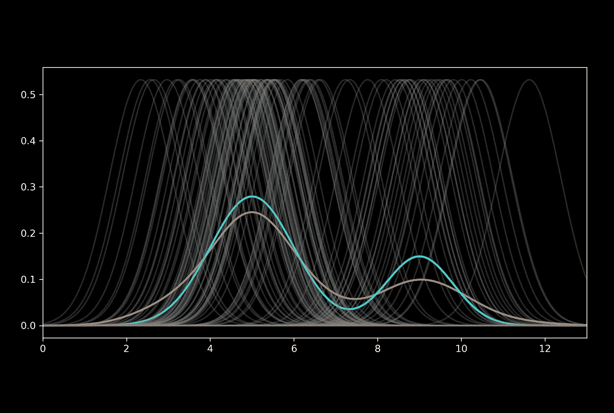

# 理解直方图和核密度估计

> 原文：[`towardsdatascience.com/understanding-histograms-and-kernel-density-estimation-6f9a1f09f960?source=collection_archive---------3-----------------------#2023-12-18`](https://towardsdatascience.com/understanding-histograms-and-kernel-density-estimation-6f9a1f09f960?source=collection_archive---------3-----------------------#2023-12-18)

## 对直方图和核密度估计的深入探讨

 [Reza Bagheri](https://reza-bagheri79.medium.com/?source=post_page-----6f9a1f09f960--------------------------------)

·

[关注](https://medium.com/m/signin?actionUrl=https%3A%2F%2Fmedium.com%2F_%2Fsubscribe%2Fuser%2Fda2d000eaa4d&operation=register&redirect=https%3A%2F%2Ftowardsdatascience.com%2Funderstanding-histograms-and-kernel-density-estimation-6f9a1f09f960&user=Reza+Bagheri&userId=da2d000eaa4d&source=post_page-da2d000eaa4d----6f9a1f09f960---------------------post_header-----------) 发表在 [Towards Data Science](https://towardsdatascience.com/?source=post_page-----6f9a1f09f960--------------------------------) · 26 分钟阅读 · 2023 年 12 月 18 日

--

直方图是一个可视化数值数据频率的图表。它在数据科学和统计学中常用于对数据集分布的初步估计。核密度估计（KDE）是一种通过从未知分布中抽取的随机样本来估计随机变量（PDF）的概率密度函数（PDF）的方法。因此，它允许我们基于从总体中采样的有限数据集来推断总体的概率密度。KDE 常用于信号处理和数据科学，作为估计概率密度的基本工具。本文讨论了直方图和 KDE 背后的数学原理和直觉以及它们的优缺点。它还演示了如何从零开始在 Python 中实现 KDE。*本文中的所有图表均由作者创作。*

**概率密度函数**

设 *X* 为一个连续随机变量。*X* 在区间 [a, b] 内取值的概率可以表示为

其中 *f(x)* 是 *X* 的概率密度函数（PDF）。*X* 的*累积分布函数*（CDF）定义为：

因此，*X* 的 CDF 在 *x* 处的值是 *X* 取值小于…的概率
