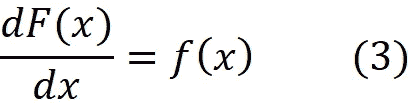
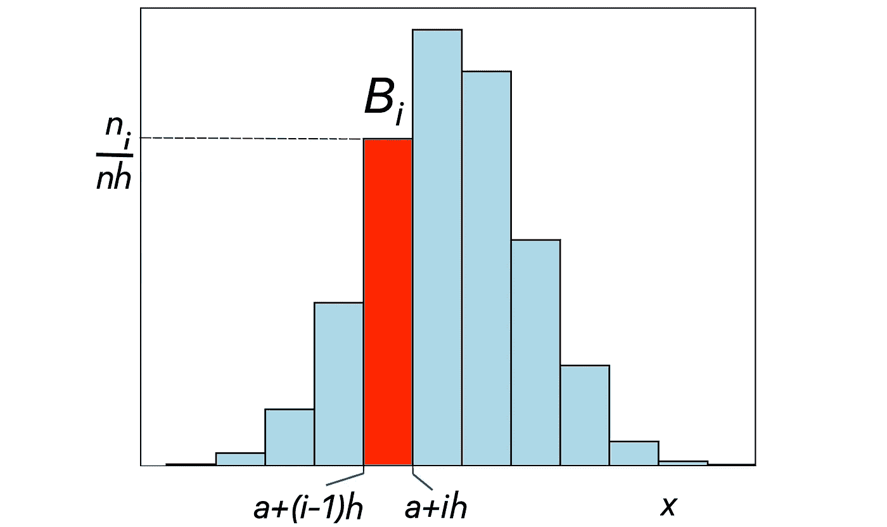

# 理解直方图和核密度估计

> 原文：[`towardsdatascience.com/understanding-histograms-and-kernel-density-estimation-6f9a1f09f960`](https://towardsdatascience.com/understanding-histograms-and-kernel-density-estimation-6f9a1f09f960)

## 对直方图和 KDE 的深入探索

[](https://reza-bagheri79.medium.com/?source=post_page-----6f9a1f09f960--------------------------------)[](https://towardsdatascience.com/?source=post_page-----6f9a1f09f960--------------------------------) [Reza Bagheri](https://reza-bagheri79.medium.com/?source=post_page-----6f9a1f09f960--------------------------------)

·发表于 [Towards Data Science](https://towardsdatascience.com/?source=post_page-----6f9a1f09f960--------------------------------) ·26 分钟阅读·2023 年 12 月 18 日

--


直方图是可视化数值数据频率的图形。它通常用于数据科学和统计学中，以对数据集的分布进行初步估计。核密度估计（KDE）是一种通过从未知分布中抽取的随机样本来估计随机变量的概率密度函数（PDF）的方法。因此，它允许我们基于从中抽样的有限数据集推断总体的概率密度。KDE 常用于信号处理和数据科学，是估计概率密度的一个重要工具。本文讨论了直方图和 KDE 背后的数学和直觉，以及它们的优缺点。它还演示了如何从头开始在 Python 中实现 KDE。*本文中的所有图形均由作者创建。*

**概率密度函数**

设 *X* 为连续随机变量。*X* 在区间 [a, b] 内取值的概率可以写作


其中 *f(x)* 是 *X* 的概率密度函数（PDF）。*X* 的*累积分布函数*（CDF）定义为：


因此，*X* 的累积分布函数（CDF），在 *x* 处的值是 *X* 取小于或等于 *x* 的值的概率。使用方程 1，我们可以写道：


使用微积分基本定理，我们可以证明



这意味着 *X* 的概率密度函数（PDF）可以通过对其累积分布函数（CDF）关于 *x* 的导数来确定。直方图是估计数据集 PDF 的最简单方法，如我们在下一节所示，它利用方程 1 达到这一目的。

**直方图**

在列表 1 中，我们创建了一个双峰分布，作为两个正态分布的混合，并从该分布中抽取了大小为 1000 的随机样本。这里我们混合了两个正态分布：


因此，正态分布的均值分别是 0 和 4，方差分别是 1 和 0.8。混合系数为 0.7 和 0.3，因此这些分布的混合 PDF 为：


列表 1 绘制了图 1 中的 PDF 和样本。

```py
# Listing 1

np.random.seed(2)
sample_size = 100
mu1 = 5
sigma1 = 1
mu2 = 9
sigma2 = 0.8
dist1 = norm.rvs(loc = mu1, scale = sigma1, size=sample_size)
dist2 = norm.rvs(loc = mu2, scale = sigma2, size=sample_size)

x = np.arange(0, 13, 0.01)
pdf1 = norm.pdf(x, loc = mu1, scale = sigma1)
pdf2 = norm.pdf(x, loc = mu2, scale = sigma2)
mix_coeffs = [0.7, 0.3]
pdf = mix_coeffs[0]*pdf1+mix_coeffs[1]*pdf2

data = np.zeros((sample_size, 2))
data[:, 0] = dist1
data[:, 1] = dist2

random_idx = np.random.choice(np.arange(2),
                 size=(sample_size,), p=mix_coeffs)
sample = data[np.arange(sample_size), random_idx]

plt.figure(figsize=(8, 5))
num_bins = 40
plt.plot(sample, np.zeros(len(sample)), marker='|', markersize=15,
         linestyle='None', alpha=1)
plt.plot(x, pdf, color='red', linewidth=2, label="PDF")
plt.xlim([0, 13])
plt.xlabel('$x$', fontsize=16)
plt.ylabel('Probability density', fontsize=16)
plt.legend(loc='best', fontsize=14)

plt.show()
```


图 1

现在假设我们只有样本数据集，而双峰分布是未知的，我们如何从数据集中估计该分布的 PDF？我们可以做的最简单的事情是绘制这个数据集的直方图。列表 2 绘制了在列表 1 中生成的随机样本的直方图，并附上了该分布的 PDF。尽管它没有平滑的表面，但它模仿了分布的 PDF 的形状。

```py
# Listing 2
plt.figure(figsize=(8, 5))
num_bins = 20
plt.hist(sample, density=True, bins = num_bins,
         edgecolor='black', linewidth=1)
plt.plot(x, pdf, color='red', linewidth=2, label="PDF")
plt.xlim([0, 13])
plt.xlabel('$x$', fontsize=16)
plt.ylabel('Probability density', fontsize=16)
plt.legend(loc='best', fontsize=14)
plt.savefig('fig2.png', dpi=300, bbox_inches='tight')
plt.show()
```


图 2

让我们来看一下直方图的基本构造。利用导数定义和方程 2 及方程 3，我们可以写出：


因此，*X*在点*x*的 PDF 可以通过此方程估计。直方图使用相同的概念来估计基于随机样本的随机变量的 PDF。假设*X*是一个未知分布的随机变量，而随机变量*X*₁、*X*₂、… *X_n*通常表示可以从该分布中抽取的随机样本（即*X*₁、*X*₂、… *X_n*是独立同分布的）。在抽取随机样本后，我们用*x*₁、*x*₂、… *x_n*来表示样本中的观察值。因此，*x*₁、*x*₂、… *x_n*形成了我们想要生成直方图的数据集，每个*xᵢ*是这个数据集中的一个观察值。

我们首先需要定义计算直方图的区间[*a*, *b*]。我们将此区间划分为长度为*h*=(*b*−*a*)/*k*的*k*个等长子区间。这些定长子区间也称为*bins*。因此，我们将有以下子区间：


请注意，前*k*-1 个子区间是半开区间，只包括其左端点，因为我们不希望它们在端点处重叠。现在我们可以使用方程 4 来估计属于子区间*Bᵢ*的测试点*x*的 PDF：


这是一种近似，因为我们不再取极限。但是我们如何计算


我们可以简单地使用我们的随机样本。我们知道我们的数据集有*n*个观察值。那么


如果我们用*nᵢ*表示随机样本在*Bᵢ*中的观察次数，那么我们有：


我们将 PDF 的这种估计称为 *f^*(*x*)，所以我们可以将之前的方程写成：


要绘制直方图，我们需要知道 *a*、*b* 和 *h* 的值。我们首先计算箱子的端点，对于每个箱子 *Bᵢ*，我们在该箱子的中点上绘制一个宽度为 *h* 且高度等于 *nᵢ* / (*nh*) 的矩形条（图 3）。



图 3

我们知道


所以，PDF 在整个空间上的积分必须等于 1。


这意味着 PDF 是标准化的，PDF 曲线下的面积等于 1。直方图的面积等于图 2 中矩形的面积之和：


其中 *k* 是箱子的数量。这是有意义的，因为直方图是分布 PDF 的一种估计器。

在 `matplotlib` 中绘制直方图时，我们使用 `hist()` 函数。请注意，我们应将参数 `density` 设置为 `True` 来获得 PDF 的估计值。否则，我们将得到一个 *频率直方图*。在频率直方图中，每个箱子的高度等于：


使用方程 6 绘制的直方图也称为 *密度直方图*。在本文中，直方图指的是密度直方图。

从清单 2 中可以看出，我们只设置了箱子的数量，并未提供 *a* 和 *b* 的值。

```py
plt.hist(sample, density=True, bins = num_bins,
         edgecolor='black', linewidth=1)
```

这是因为 `sample` 的最小值和最大值分别自动用作 *a* 和 *b*。我们可以通过以下代码片段绘制相同的直方图：

```py
bin_width = (max(sample) - min(sample)) / num_bins
plt.hist(sample, density=True, 
         bins = np.arange(min(sample), max(sample) + bin_width, bin_width),
         edgecolor='black', linewidth=1)
```

基于方程 6，*f^*(*x*) 的值依赖于 *n* 和 *h*。但它也依赖于箱子的起始点（方程 5 中的 *a*）。所以，如果我们改变 *a* 的值，它将改变直方图的形状。清单 3 绘制了清单 1 中定义的样本的直方图，其中 *a*=1.8 和 *b*=12，并将其与图 2 中 *a* 和 *b* 设置为样本的最小值和最大值的直方图进行了比较。两个直方图具有相同的 *h*。结果见图 4。

```py
# Listing 4

fig, (ax1, ax2) = plt.subplots(2, 1, figsize=(10,10))
plt.subplots_adjust(hspace=0.4)
num_bins = 20
bin_width = (max(sample) - min(sample)) / num_bins
ax1.hist(sample, density=True, 
         bins = np.arange(min(sample), max(sample) + bin_width, bin_width),
         edgecolor='black', linewidth=1)
ax1.plot(x, pdf, color='red', linewidth=2, label="PDF")
ax1.set_xlim([0, 13])
ax1.set_ylim([0, 0.45])
ax1.set_xlabel('$x$', fontsize=16)
ax1.set_ylabel('Probability density', fontsize=16)
ax1.legend(loc='best', fontsize=14)
ax1.set_title('a={}, b={}'.format(np.round(min(sample), 3),
                                  np.round(max(sample), 3)), fontsize=16)

ax2.hist(sample, density=True, 
         bins = np.arange(1.15, 12 + bin_width, bin_width),
         edgecolor='black', linewidth=1)
ax2.plot(x, pdf, color='red', linewidth=2, label="PDF")
ax2.set_xlim([0, 13])
ax2.set_ylim([0, 0.45])
ax2.set_xlabel('$x$', fontsize=16)
ax2.set_ylabel('Probability density', fontsize=16)
ax2.legend(loc='best', fontsize=14)
ax2.set_title('a={}, b={}'.format(1.15, 12), fontsize=16)

plt.plot()
```


图 4

如你所见，通过改变 *a* 的值，直方图的形状会发生变化。因此，直方图的形状依赖于用于生成它的随机样本。我们不知道从中抽取随机样本的总体的最大值和最小值。因此，如果我们基于随机样本的最小值和最大值绘制直方图，则样本将影响直方图的形状。然而，直方图应模仿总体的 PDF 形状，而总体的 PDF 对所有随机样本都是相同的。

**直方图作为机器学习模型**

记住，样本的直方图应该模仿从样本中提取的总体的概率密度函数（PDF）的形状。事实上，我们可以将直方图视为一种机器学习模型，它基于我们从总体中提取的样本来学习总体的 PDF。这是一个非常简单的模型，因为它只有一个超参数，即箱宽（*h*）。这个超参数控制了模型的复杂性。（超参数是用来配置机器学习模型的参数，其值由用户在训练过程开始前确定。相比之下，模型的其他参数值是通过训练确定的。）

像其他任何机器学习模型一样，我们可以计算直方图的偏差和方差。假设 *X* 是一个具有未知分布的随机变量，而随机变量 *X*₁、*X*₂、… *X_n* 通常表示可以从该分布中抽取的随机样本。抽取随机样本后，我们将其中的观测值记为 *x*₁、*x*₂、… *x_n*（这里每个 *xᵢ* 是 *Xᵢ* 的一个具体值），这些观测值形成用于生成直方图的数据集。现在我们想创建一个学习 *X* 分布的 PDF 的直方图。记住，从方程 6 中，我们有：


但这个方程式适用于一个特定的数据集。如果我们想将其应用于随机样本 *X*₁、*X*₂、… *X_n*，我们需要用随机变量 *Nᵢ* 替换 *nᵢ*。这是因为 *nᵢ* 的实际值取决于 *X*₁、*X*₂、… *X_n* 的值。因此，得出：


请注意，虽然 *X*₁、*X*₂、… *X_n* 的值在每次我们抽取的样本中可能会变化，但样本大小（*n*）、箱宽（*h*）和子区间 *Bᵢ* 保持不变。所以，它们是随机变量。现在如果 *Nᵢ* 是一个随机变量，它的分布是什么？要回答这个问题，我们首先需要计算每个 *Xₖ* 位于区间 *Bᵢ* 的概率。假设


其中 *a* 是一个常数端点，并且不随样本的变化而改变。由于每个 *Xₖ* 都是从相同的 *X* 分布中抽样的，所以 *Xₖ* 属于 *Bᵢ* 的概率可以写成：


现在我们有 *n* 个随机变量，每个随机变量位于 *Bᵢ* 的概率是 *pᵢ*，我们想知道 *Nᵢ* 的分布，其中 *Nᵢ* 表示这些随机变量中位于 *Bᵢ* 的总数。这类似于在 *n* 次掷硬币中找出正面总数的问题，其中出现正面的概率是 *pᵢ*。我们已经知道，如果我们用一个随机变量表示正面总数，它具有参数为 *n* 和 *pᵢ* 的二项分布。因此我们得出结论，*Nᵢ* 应该具有参数为 *n* 和 *pᵢ* 的二项分布：


现在我们可以通过知道 *Nᵢ* 的分布来计算它的均值和方差：


我们还可以计算在测试点 *x_t* 上 *f*^(* x *) 的均值和方差：


因此，* f *^(* x_t *) 的偏差为：


基于积分的均值定理，我们知道如果 *f* 在区间 *Bᵢ* 上是连续的，则在 *Bᵢ* 中存在一个点 *εᵢ* 使得


其中 *d*₁ 和 *d*₂ 是方程 7 中 *Bᵢ* 的端点：


使用这个方程，* pᵢ *可以简化为：


所以，得出结论


因此，通过减小 *h*，方差会增加。在进一步简化偏差项之前，我们需要做一个假设。这里我们假设 *f*(*x*) 在区间 *Bᵢ* 上是*Lipschitz 连续*的。如果一个函数在区间 *Bi* 上是 Lipschitz 连续的，那么存在一个正的常数 *γᵢ* 使得


现在使用这个方程，我们可以简化偏差：


这里我们利用了* x *和* εᵢ *都在宽度为 *h* 的区间 *Bᵢ* 内的事实，因此它们的距离不能大于 *h*。你会发现通过减小 *h*，偏差的绝对值会减少。

通过有了偏差和方差，我们可以很容易地计算在 *x*_*t* 上的均方误差 (MSE)：


如果我们将直方图视为模型，区间宽度 *h* 是这个模型唯一的超参数，它类似于模型复杂性的度量。随着 *h* 趋近于零，模型变得更加复杂。因此偏差的绝对值减少而方差增加（过拟合）。另一方面，当 *h* 增加时，模型变得更简单，因此方差减少，但偏差的绝对值增加（欠拟合）。

所以，我们得出结论，偏差的绝对值和方差之间存在权衡：增加一个会减少另一个。这是机械学习中偏差-方差权衡的表现，它描述了模型复杂性与预测准确性之间的关系。

列表 5 展示了偏差-方差权衡的演示。这里我们从均值为 5、方差为 1 的正态分布中获取 100 个大小为 80 的随机样本。我们还尝试了从 0.15 到 2.7 的一系列 *h* 值。接着，我们选择一个测试点 (*x*_*t*)，并计算该点的正态分布 PDF (*f(x_t*) )。对于每个 *h* 值，我们计算所有 100 个随机样本的直方图。然后，我们计算这些直方图的 *f*^(*x_t*)。最后，使用 *f*(*x*_*t*) 和所有随机样本的 *f*^(*x_t*) 值，我们可以计算每个 *h* 值在测试点 *x*_*t* 的偏差²、方差和 MSE。

然而，我们并不想仅仅最小化一个测试点 (*x*_*t*) 的直方图预测误差。因此，我们从数组 `xt_list` 中选择一个测试点范围，并计算每个 *h* 值在所有测试点上的平均偏差²、方差和 MSE。列表 5 创建了不同 *h* 值的平均偏差²、方差和 MSE 的图示，如图 5 所示。

```py
# Listing 5

np.random.seed(0)
n_samples = 100
sample_size = 80
h_list = np.arange(0.2, 2.7, 0.15)
mu = 5
sigma = 1
samples = norm.rvs(loc = mu, scale = sigma,
                   size=n_samples*sample_size).reshape(n_samples, sample_size)

xt_list = np.arange(mu-3*sigma, mu+3*sigma, 0.05)
f_xt = norm.pdf(xt_list, loc = mu, scale = sigma)
avg_mse_list = []
avg_var_list = []
avg_bias_sq_list =[]
for h in h_list:
    fhat_xt_list = []
    for i in range(n_samples):
        (ni, bins) = np.histogram(samples[i], density=True,
                                  bins = np.arange(min(samples[i]),
                                  max(samples[i]) + h, h))
        fhat_xt_ind = np.digitize(xt_list, bins)-1
        fhat_xt = np.pad(ni, [1,1], 'constant',
                         constant_values=0).take(fhat_xt_ind+1, mode='clip') 
        fhat_xt_list.append(fhat_xt)
    avg_bias_sq_list.append(((np.vstack(fhat_xt_list).mean(axis=0)-f_xt)**2).mean())
    avg_var_list.append(np.vstack(fhat_xt_list).var(axis=0).mean())
    avg_mse_list.append(np.mean((np.vstack(fhat_xt_list)-f_xt)**2).mean())

plt.plot(h_list, avg_var_list, "-o", label="Var")
plt.plot(h_list, avg_bias_sq_list, "-o", label="$Bias²$")
plt.plot(h_list, avg_mse_list, "-o", label="MSE")
plt.xlabel("h", fontsize=14)
plt.ylabel("Avg MSE, Avg Var, Avg $Bias²$", fontsize=14)
plt.legend(loc="best")
plt.show()
```


图 5

通过减少 *h* 的值，模型复杂度和平均方差增加，但平均偏差²减少。过于复杂的模型会导致过拟合。另一方面，增加 *h* 的值会导致模型更简单，从而减少平均方差并增加平均偏差²。过于简单的模型会导致欠拟合。如前所述，MSE 是方差和偏差平方的总和，因此在欠拟合和过拟合的情况下，我们对所有测试点的平均 MSE 都很大。正如图中所示，*h*=0.8 为所有测试点提供了最低的平均 MSE，因为此时平均偏差²和平均方差之间存在平衡。这个点代表了一个既不简单也不复杂的模型，因此最小化了平均 MSE。

列表 6 绘制了三种 *h* 值的直方图（图 6）。在 *h*=2.3 时直方图欠拟合，在 *h*=0.15 时直方图过拟合，两种情况均无法很好地估计 PDF。根据图 5 的结果，最佳拟合发生在 *h*=0.8。此值的直方图提供了对 PDF 的最佳估计。

```py
# Listing 6

h_list = [2.3, 0.8, 0.15]
labels = ["Underfitting", "Right fit", "Overfitting"]
x = np.arange(1, 10, 0.01)
f_x = norm.pdf(x, loc = mu, scale = sigma)
fig, ax = plt.subplots(1, 3, figsize=(17,6))
for i in range(len(ax)):
    p = 3
    ax[i].hist(samples[p], density=True,
               bins = np.arange(min(samples[p]),
                                max(samples[p]) + h_list[i], h_list[i]),
               edgecolor='black', linewidth=1)  
    ax[i].plot(x, f_x, color='red', label="PDF", linewidth=2)
    ax[i].set_xlabel('$x$', fontsize=24)
    ax[i].set_title("{} (h={})".format(labels[i], h_list[i]), fontsize=22)
    ax[i].legend(loc='best', fontsize=15)
ax[0].set_ylabel('Probability density', fontsize=24)
plt.plot()
```


图 6

如你所见，如果我们有足够多的训练数据集，我们可以找到 *h* 的最佳值，但实际上我们只有一个。在这种情况下，我们可以使用 Scott 规则来找到 *h* 的最佳值：


其中 *σ^* 是样本标准差，*n* 是样本大小。此规则假设样本服从正态分布。如果我们对列表 5 中的所有样本使用此规则，我们会发现 *h* 的平均值非常接近列表 5 中找到的 *h* 的最佳值：

```py
(3.5*samples.std(axis=1, ddof=1)*samples.shape[1]**(-1/3)).mean()
```

```py
0.8005
```

请注意，实际上我们只有一个样本来估计 *h*，因此估计误差可能较大。

**核密度估计**

为了避免直方图对其端点的依赖，我们可以使用不同的公式来近似 CDF 的导数。这个公式被称为对称差商：


如你所见，与方程 5 不同，这个方程不依赖于 *a*。接下来，我们可以写作：


我们也可以使用指示函数来计算这个概率。设 *A* 为集合。*A* 在 *x* 处的指示函数定义为：


因此，它在其域内的所有属于 *A* 的点上等于 1，而在所有其他点上等于 0。现在，我们可以使用指示函数来计算属于 *x*-*h*, *x*+*h*) 的观察值的数量。记住，*x*₁，*x*₂，… *x_n* 代表我们想要生成直方图的数据集。因此，对于每个 *xᵢ*：


并且得出：


如果我们用 *f^*(*x*) 表示这个 PDF 的估计，我们可以将前面的方程写作：


接下来，我们可以写作：


因此，我们可以写出我们的 PDF 估计为：


现在让我们看一下总和内的表达式，检查它可以取的不同值：


与连续均匀分布的 PDF 比较：


我们可以观察到 *K*((*x*-*xᵢ*)/*h*) 是区间 [-1, 1] 上均匀分布的 PDF。

列表 7 使用这种方法来估计在列表 1 中生成的样本的 PDF。结果如图 7 所示，并与样本来源分布的 PDF 进行了比较。

```py
# Listing 7

def kde(x, data, h, dist=norm(0, 1)):
    n = len(data)
    K = dist.pdf((x.repeat(n).reshape(len(x), n) - data) / h)
    return np.sum(K, axis=1) / n / h

h = 0.75
x = np.arange(0, 13, 0.01)
fhat = kde(x, sample, h, dist=uniform(loc=-1, scale=2))

plt.figure(figsize=(14, 5))
plt.plot(x, fhat, label='KDE')
plt.plot(x, pdf, color='red', linewidth=2, label="PDF")
plt.xlim([0, 13])
plt.xlabel('$x$', fontsize=20)
plt.ylabel('Probability density', fontsize=20)
plt.legend(loc='best', fontsize=18)
plt.show()
```


图 7

我们可以将方程 8 进行概括，并用不同的 PDF 替代 *K*。我们通常将核密度估计器 *f*^(*x*) 定义为：


在这个方程中，*K*(*x*) 称为 *核函数*，*h* 称为 *带宽*。我们也可以将前面的方程写作：


其中 *K_h* 称为 *缩放核*，其定义为：


核函数应满足以下条件：


基于前两个条件，核函数应为非负且归一化，以保证核函数是一个概率密度函数（PDF）。根据第三个条件，它应为对称的 PDF。这个条件意味着：


观察图 7，你会发现估计器曲线不平滑，因为均匀密度没有平滑的形状。我们可以使用标准正态分布的 PDF 作为核函数，因为它具有平滑的形状：


将这个核代入公式 9，我们得到：


因此，估计器是 *n* 个均值为 *xᵢ* 的正态分布的 PDF 的平均值，而带宽 *h* 可以被视为这些分布的标准差。

列表 8 使用了带有标准正态核的估计器来估计列表 1 中生成的样本的 PDF。结果如图 8 所示，并且与样本抽取来源的分布的 PDF 进行了比较。*n* 个缩放的核 (*K*_*h*) 也在该图中绘制，每个缩放核都是均值为 *xᵢ* 和标准差为 *h* 的正态分布。

```py
# Listing 8

def plot_kernel(x, data, h):
    n = len(data)
    K = norm(0,1).pdf((x.repeat(n).reshape(len(x), n) - data) / h) / h 
    for i in range(K.shape[1]-1):
        plt.plot(x, K[:,i], color="grey", alpha=0.3)
    plt.plot(x, K[:,i+1], color="grey", alpha=0.3, label="$K_h(x-X_i)$")

h=0.75
x = np.arange(0, 13, 0.01)
fhat = kde(x, sample, h)  

plt.figure(figsize=(14, 5))
plt.plot(x, fhat, label='KDE', linewidth=2)
plt.plot(x, pdf, color='red', linewidth=2, label="PDF")
plot_kernel(x, sample, h)
plt.xlim([0, 13])
plt.xlabel('$x$', fontsize=20)
plt.ylabel('Probability density', fontsize=20)
plt.legend(loc='best', fontsize=15)
plt.show()
```


图 8

**作为机器学习模型的核密度估计器**

类似于直方图，核密度估计器可以被视为一种机器学习模型，它根据我们从总体中抽取的样本来学习总体的概率密度函数（PDF）。该模型的超参数包括带宽 (*h*)、核类型及其对应的参数。这些超参数使得核密度估计器相比于直方图更加灵活。

假设我们有公式 9 中的核估计器。为了计算这个估计器的偏差和方差，我们需要使用从总体中抽取的所有可能样本，因此我们使用独立同分布的随机样本 *X*₁、*X*₂、… *X_n* 来创建密度估计器：


现在可以证明，对于测试点 *x*_*t*，*f*^(*x_t*) 的偏差为：


其中 *σ_K* 定义为：


我们还可以证明 *f*^(*x_t*) 的方差如下：


*R*(*K*) 被定义为：


带宽 (*h*) 控制了模型的复杂性。当 *h* 趋近于零时，模型变得更复杂，因此偏差的绝对值减少而方差增加（过拟合）。相反，当 *h* 增加时，模型变得更简单，因此方差减少，但偏差的绝对值增加（欠拟合）。

计算偏差和方差的详细信息见附录。现在，我们可以计算 MSE：


到目前为止，我们只考虑了一个测试点 *x_t*。然而，通常我们希望控制密度估计器的总体均方误差（MSE）。因此，我们需要计算均值积分平方误差（MISE）：


现在，将方程 13 代入此方程，我们得到：


这个方程可以使用方程 7 和方程 12 简化：


此方程中的两个主导项称为渐近均方积分误差 (AMISE)：


通过将 AMISE 的导数设置为零，我们可以找到使其最小化的 *h* 的最佳值：


解此方程可以得出 *h* 的最佳值：


请注意，我们不能直接使用上述涉及未知 PDF 二阶导数 (*f’’*) 的公式。因此，我们不能直接使用它。然而，我们可以对 PDF 类型做出假设。如果我们假设要估计一个均值为 *µ* 和方差为 *σ*² 的正态分布的 PDF，则：


由此得到


然后我们得到：


如果使用标准正态分布的 PDF 作为核函数：


然后得到


和


将这些方程代入方程 14，我们得到：


由于我们通常不知道总体的标准差 (*σ*)，我们可以使用样本标准差 (*σ^*) 来代替：


这是估计 KDE 带宽的 Scott 规则。列表 9 显示了核密度估计器的偏差-方差权衡。我们从均值为 5 和方差为 1 的正态分布中获取了 100 个样本，每个样本大小为 100。我们尝试了从 0.14 到 0.52 的 *h* 范围。我们从数组 `xt_list` 中挑选了一系列测试点。

对于 `xt_list` 中的每个测试点 (*x*_*t*)，计算该点的正态分布的 PDF (*f(x_t*))。然后计算所有 100 个随机样本的 KDE 和这些样本的 *f*^(*x_t*)。最后，使用 *f*(*x*_*t*) 和所有随机样本的 *f*^(*x_t*) 值，计算 *x*_*t* 处的偏差²、方差和 MSE。最后，对于每个 *h* 的值，我们计算 `xt_list` 中所有测试点的平均偏差²、方差和 MSE。列表 9 创建了不同 *h* 值的平均偏差²、方差和 MSE 的图示，如图 9 所示。

```py
# Listing 9

np.random.seed(5)
n_samples = 100
sample_size = 500
h_list = np.arange(0.14, 0.52, 0.02)
mu = 5
sigma = 1
samples = norm.rvs(loc = mu, scale = sigma,
                   size=n_samples*sample_size).reshape(n_samples, sample_size)

xt_list = np.arange(mu-4*sigma, mu+4*sigma, 0.02)
f_xt = norm.pdf(xt_list, loc = mu, scale = sigma)
avg_mse_list = []
avg_var_list = []
avg_bias_sq_list =[]
for h in h_list:
    fhat_xt_list = []
    for i in range(n_samples):
        fhat_xt = fhat = kde(xt_list, samples[i], h)  
        fhat_xt_list.append(fhat_xt)
    avg_bias_sq_list.append(((np.vstack(fhat_xt_list).mean(axis=0)-f_xt)**2).mean())
    avg_var_list.append(np.vstack(fhat_xt_list).var(axis=0).mean())
    avg_mse_list.append(np.mean((np.vstack(fhat_xt_list)-f_xt)**2).mean())

plt.plot(h_list, avg_var_list, "-o", label="Var")
plt.plot(h_list, avg_bias_sq_list, "-o", label="$Bias²$")
plt.plot(h_list, avg_mse_list, "-o", label="MSE")
plt.xlabel("h", fontsize=14)
plt.ylabel("Avg MSE, Avg Var, Avg $Bias²$", fontsize=14)
plt.legend(loc="best")
plt.show()
```


图 9

当 *h* 趋近于零时，模型变得更加复杂，结果是平均偏差²减少，平均方差增加（过拟合）。另一方面，当 *h* 增加时，模型变得更简单，导致欠拟合。因此，平均方差减少，但平均偏差²增加。

我们还可以使用方程 15 来估计 *h* 的最佳值。在这里，我们计算了列表 9 中所有样本的 *h* 的平均值：

```py
(1.06*samples.std(axis=1, ddof=1)*samples.shape[1]**(-1/5)).mean()
```

```py
0.3060
```

我们看到 *h* 的平均值非常接近于列表 9 中找到的 *h* 的最佳值。请注意，实际上我们只有一个样本来估计 *h*。列表 10 绘制了三个 *h* 值的 KDE（图 10）。在 *h*=1 时，KDE 欠拟合；在 *h*=0.1 时，KDE 过拟合，这两种情况下 KDE 都没有很好地估计 PDF。正确的拟合发生在 *h*=0.8。这个 *h* 值的 KDE 给出了对 PDF 的最佳估计。

```py
# Listing 10

h_list = [0.1, 0.31, 1]
labels = ["Underfitting", "Right fit", "Overfitting"]
x = np.arange(1, 10, 0.01)
f_x = norm.pdf(x, loc = mu, scale = sigma)
fig, ax = plt.subplots(1, 3, figsize=(17,6))
for i in range(len(ax)):
    ax[i].plot(x, f_x, color='red', label="PDF", linewidth=2)
    fhat = kde(x, samples[1], h_list[i])  
    ax[i].plot(x, fhat, linewidth=2, linestyle="--", label="KDE")
    ax[i].set_xlabel('$x$', fontsize=24)
    ax[i].legend(loc='best', fontsize=15)
    ax[i].set_title('h={}'.format(h_list[i]), fontsize=22)
ax[0].set_ylabel('Probability density', fontsize=24)
plt.plot()
```


图 10

`SciPy`库中的函数 `gaussian_kde()` 可以用来计算 KDE。其他库如 `seaborn` 和 `matplotlib` 使用此函数来绘制数据集的 KDE。该函数使用标准正态核来估计 PDF。文档提到它使用 Scott 规则来估计 *h*，然而，公式略有不同：


列表 11 绘制了列表 1 中定义的样本的 KDE。它比较了方程 15 和 SciPy 的规则。图 11 展示了该图。

```py
# Listing 11

x = np.arange(0, 13, 0.01)
f_x = norm.pdf(x, loc = mu, scale = sigma)
h1 = 1.06 * sample.std(ddof=1) * len(sample)**(-1/5)
h2 = sample.std(ddof=1) * len(sample)**(-1/5)
plt.figure(figsize=(10, 7))
plt.plot(x, pdf, color='red', label="PDF", linewidth=1)
fhat1 = kde(x, sample, h1)  
fhat2 = kde(x, sample, h2)  
sns.kdeplot(data=sample, color="green", linewidth=2, label="KDE, SciPy")
plt.plot(x, fhat1, linewidth=2, linestyle="--", color= "blue",
         label="KDE, $h=1.06\hat{\sigma}n^{-1/5}$")
plt.plot(x, fhat2, linewidth=2, linestyle="--", color="black",
         label="KDE, $h=\hat{\sigma}n^{-1/5}$")

plt.xlim([0, 13])
plt.xlabel('$x$', fontsize=20)
plt.legend(loc='best', fontsize=13)
plt.ylabel('Probability density', fontsize=20)
plt.plot()
```


图 11

在本文中，我们讨论了直方图和核密度估计。这两种方法都用于估计数据集的概率分布的 PDF。因此，它们都可以被视为学习数据集 PDF 的机器学习模型。我们展示了如何计算这些模型的偏差和方差。均方误差（MSE）是方差和偏差的平方之和，我们希望通过找到直方图的最佳箱宽或核密度估计器的最佳带宽来最小化它在所有可能的测试点上的值。文章展示了如何使用 Scott 规则来估计这些最佳值。

希望你喜欢阅读这篇文章。本文中的所有代码列表都可以从 GitHub 上的 Jupyter Notebook 中下载：

[`github.com/reza-bagheri/histograms_kde/blob/main/KDE.ipynb`](https://github.com/reza-bagheri/histograms_kde/blob/main/KDE.ipynb)

**附录：**

记住，随机样本 *X*₁，*X*₂，… *X_n* 是独立且同分布的，表示从随机变量 *X* 的分布中抽取的随机样本（我们想估计其 PDF），因此它们每一个单独的分布与 *X* 相同。因此，随机变量


是独立且同分布的，每一个都具有相同的分布：


核估计器


是这些独立同分布随机变量的均值，因此我们有：


现在我们可以计算在测试点 *x_t* 处核估计器的均值和方差：


接下来，我们进行变量变换 *y*=(*x_t*-*x*)/*h*。因此，之前的方程可以写作：


现在我们可以使用泰勒级数来估计 *f*(*x_t*-*yh*)：


其中 o(*h*²) 表示这是一个相比于 *h*² 的更小的阶项，当 *h* 趋近于零时。将此方程代入前一个方程，我们得到：


现在使用方程 11 (*I*) 和 (*II*)，我们可以简化此方程并将其写作：


*σ_K* 被定义为：


*x_t* 的偏差定义为：


因此，得出：


请注意，我们需要方程 11 (*II*) 中的条件来得到这个偏差方程。接下来，我们计算点 *x_t* 处的方差：


使用方差的定义可以写作：


要计算此方程右侧的第一项，我们可以写作：


我们在这里使用了变量变换 *y*=(*x_t*-*x*)/*h*。再次，我们使用泰勒级数来估计 *f*(*x_t*-*yh*)：


将此方程代入前一个方程，我们得到：


*R*(*K*) 被定义为：


此方程右侧的第二项可以使用方程 *A*.1 进行计算：


在这里，如果我们忽略所有的项并将其近似为零，我们得到：


最后，我们得到：


在这里，我们利用了当 *h* 趋近于零时 1/*h*>>1 的事实。所以


