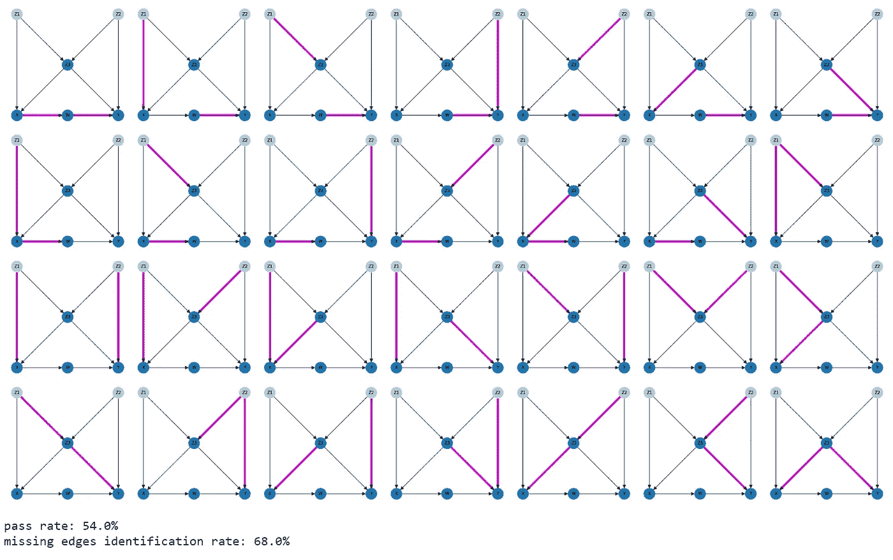

# 理解独立性及其在因果推断和因果验证中的重要性

> 原文：[`towardsdatascience.com/understanding-independence-and-why-it-is-critical-in-causal-inference-and-causal-validation-dfdd26c29739`](https://towardsdatascience.com/understanding-independence-and-why-it-is-critical-in-causal-inference-and-causal-validation-dfdd26c29739)

## 理解独立性的逐步指南以及如何应用它来验证使用 Python 的有向无环图（DAG）在因果验证中的有效性

[](https://grahamharrison-86487.medium.com/?source=post_page-----dfdd26c29739--------------------------------)[](https://towardsdatascience.com/?source=post_page-----dfdd26c29739--------------------------------) [Graham Harrison](https://grahamharrison-86487.medium.com/?source=post_page-----dfdd26c29739--------------------------------)

·发表于[Towards Data Science](https://towardsdatascience.com/?source=post_page-----dfdd26c29739--------------------------------) ·23 分钟阅读·2023 年 12 月 7 日

--


图片由[Towfiqu barbhuiya](https://unsplash.com/@towfiqu999999?utm_content=creditCopyText&utm_medium=referral&utm_source=unsplash)提供，来源于[Unsplash](https://unsplash.com/photos/a-blue-question-mark-on-a-pink-background-oZuBNC-6E2s?utm_content=creditCopyText&utm_medium=referral&utm_source=unsplash)

# 背景

在最近的一篇文章中，作者探讨并解释了如何使用依赖性概念来验证提出的有向无环图（DAG）是否符合数据集，以识别图中的虚假边，即 DAG 中建议的因果链接在数据中不存在。

在第二部分中，将应用相反的（但同样关键的）概念，即如何利用独立性来识别缺失的边。这些是提议的 DAG 中未出现但实际上存在于数据中的因果链接，必须将这些链接添加回 DAG 中，以使其完整且正确。

# 介绍

因果推断是数据科学的一个新兴分支，关注于确定事件和结果之间的因果关系，并且它有潜力显著提高机器学习为组织创造的价值。

例如，传统的机器学习算法可以预测哪些贷款客户可能会违约，从而使客户能够进行主动干预。然而，尽管这个算法对于减少贷款违约有用，但它并不了解违约发生的原因，虽然主动干预是有用的，但了解违约的原因将有助于解决根本原因。在这种情况下，主动干预可能不再必要，因为导致违约的因素已被永久治愈。

这就是因果推断的承诺，它有可能对能够利用这种潜力的组织产生重大影响和结果。

有多种不同的方法，但最常见的方法通常从用“有向无环图”（DAG）来增强数据开始，这种图形封装和可视化数据中的因果关系，然后使用因果推断技术来提出“如果”类型的问题。

# 问题

封装数据中的因果关系的 DAG 通常由数据科学家和领域专家手动（或半手动）构建。因此，DAG 可能是错误的，这会使任何因果计算失效，从而导致错误的结论和潜在的不正确决策。

# 机会

存在一系列的“因果验证”技术（验证 DAG 是否符合数据的过程），如果这些技术有效，它们可以最小化或消除 DAG 中的错误，从而确保计算和结论是无误的。

# 前进的道路

随机变量之间的独立性统计概念可以用来确定 DAG 中不存在的关系是否在数据中存在。如果遇到这种情况，则很可能 DAG 中缺失的因果关系需要添加到 DAG 中，以使其完整和正确。

# 开始

我们需要一个示例 DAG 来解决问题，这个 DAG 需要有足够的节点和链接，以提供一个好的示例来探索问题 …


文章中使用的 DAG — 作者图片

DAG 完全是虚构的，所以节点上的字母没有任何意义，但需要注意的是，“X”是治疗，“Y”是结果，其他节点代表影响结果的因素，有可能隐藏或扭曲 X 对 Y 的真实效果。

为了更好地理解 DAG，如果这是一个现实世界的问题，它可能代表以下情况 …

+   X 代表药物服用的规律性。

+   W 代表药物对血压的影响。

+   Y 代表对患者恢复和结果的改善。

+   Z1、Z2 和 Z3 代表其他因素（例如，也许 Z1 代表健康的生活方式，Z3 代表健身水平等）

DAG 中的箭头表示一个因素对另一个因素的因果影响，例如 …

+   使用药物（用“X”表示）对血压（用“W”表示）有因果影响，而血压又对患者恢复（“Y”）有因果影响。

我们还需要一些与 DAG 匹配的数据。下面的数据集完全是合成的，由作者生成；它准确地封装并匹配了 DAG 建议的结构，并且没有错误或虚假的关系…


全文使用的数据集 — 作者提供的图像

接下来的部分将开始解读 DAG 和数据，并利用它们解释如何利用统计独立性来识别 DAG 中遗漏或忽视的因果关系。

# 理解独立性

独立性的一个定义如下 —

> “两个随机变量之间的独立性是指一个随机变量的发生或值不会影响或提供关于另一个随机变量发生或值的任何信息的基本概念。”

我们再看看我们的 DAG，并考虑节点 Z1 和 Z2 …


突出显示的 Z1 和 Z2 节点的 DAG — 作者提供的图像

我们可以看到，节点 Z1 和 Z2（代表影响治疗和结果的一些因果因素）没有直接或间接的连接，DAG 中没有通过它们的路径，因此可以说 Z1 与 Z2 是独立的（反之亦然）。

为了进一步说明这一点，我们还可以看到，尽管 X（治疗）和 Y（结果）没有直接连接，但它们实际上是依赖的，因为 DAG 中有几条路径将它们连接起来 …


节点 X 和节点 Y 之间的所有路径 — 作者提供的图像

这两个例子表明，如果 Z1 的值发生变化，它不会影响或改变 Z2 的值，但如果 X 的值发生变化，它会改变 Y 的值。

这个解释可以通过再看看 DAG 建模的数据集来扩展 …


数据集审查 — 作者提供的图像

在现实世界的因果推断问题中，数据将是起点，DAG 将通过与领域专家咨询来开发，但为了方便文章，作者需要一个保证与 DAG 匹配的数据集。

因此，上述数据集是通过应用以下公式生成的 1000 行数据 …


用于创建数据集的结构方程 — 作者提供的图像

可以按如下方式阅读和理解 -

+   Z1 是一个外生变量（即没有输入），呈正态分布，均值为 4.37，标准差为 1.95。

+   Z1 是一个外生变量，呈正态分布，均值为 1.28，标准差为 1.94。

+   Z3 = -1.5 X Z1–1.5 x Z2 + 一个误差项

+   X = -1.5 x Z1 + 1.5 x Z3 + 一个误差项

+   W = -3 x XZ + 一个误差项

+   Y = -2.5 x W + -3 x Z2 + -3 x Z3 + 误差项

用于创建数据的公式清楚地表明 Z1 独立于 Z2，因为它们都是完全分开的正态分布，但 X 和 Y 并不独立，因为改变 X 会改变 W，改变 W 会改变 Y。

还有另一种表示方式，通过数学符号显示依赖关系……


独立性和依赖性符号 — 作者提供的图片

⫫ 符号被称为“双向叉”，意思是“独立于”。⫫̸ 符号没有被广泛接受的名称，因此我个人偏好使用“斜线双向叉”，意思是“依赖于”，因此上述公式可解读为“Z1 独立于 Z2”，以及“Y 依赖于 X”。

在本节结束时，我们将把这些知识带回到因果验证的背景下。

在因果推断问题中，数据已经被收集，有向无环图通常由领域专家单独构建，他们可能犯了错误或知识可能不完整。

> 因果验证则是证明或反驳有向无环图是否有效地表示数据因果关系的过程。

独立性在这个过程中起着关键作用，因为如果有向无环图中的依赖关系和独立性在数据中都能被匹配和检测到，那么可以推断有向无环图是有效的。

这可以用以下公式表示……


推断 DAG 和数据等效的公式 — 作者提供的图片

这些公式看起来很吓人，但实际上非常简单。

> 第一条说，如果图（DAG）中的 Z1 独立于 Z2，那么 Z1 在数据中也应该独立于 Z2。
> 
> 第二条说，如果图（DAG）中的 Y 依赖于 X，则 Y 在数据中也应该依赖于 X。

# 使用独立性来识别缺失的因果链接

在上一篇文章中，我解释了如何使用独立性来检测虚假链接，即在有向无环图中出现但在数据中未出现的因果关系……

[](/demystifying-dependence-and-why-it-is-important-in-causal-inference-and-causal-validation-4263b18d5f04?source=post_page-----dfdd26c29739--------------------------------) ## 解析依赖性及其在因果推断和因果验证中的重要性

### 理解依赖性概念及其如何应用于验证有向无环图的逐步指南…

towardsdatascience.com

… 在这篇文章的其余部分，我将深入探讨如何利用依赖性来识别缺失的链接，即在数据中出现但在 DAG 中未出现的因果关系。

因此，如果可以使用独立性来识别缺失的链接，那么这些链接可以重新添加到无效的 DAG 中，使其变为有效。

本文提出的方法基于 Judea Pearl 的多项工作和已发表的论文，他被公认为因果推断领域的全球权威。

在《统计中的因果推断》（Pearl, Glymour, Jewell, 2019）中，Pearl 探讨了使用 d-分离来识别缺失链接的想法，但这是一个部分示例，未提供足够的解释来实现 Python 中的算法。

[](https://www.amazon.co.uk/Causal-Inference-Statistics-Judea-Pearl/dp/1119186846/ref=asc_df_1119186846&amp;mcid=19d06a4904073cf985acfb21fe45ebbb?tag=grahamharri04-21&amp%3BlinkCode=df0&amp%3Bhvadid=80676723059500&amp%3Bhvnetw=o&amp%3Bhvqmt=e&amp%3Bhvbmt=be&amp%3Bhvdev=c&amp%3Bhvlocint=&amp%3Bhvlocphy=&amp%3Bhvtargid=pla-4584276297438266&amp%3Bpsc=1&_encoding=UTF8&linkCode=ur2&linkId=7f120490d4ac7cabf046e73a4cd1c14b&camp=1634&creative=6738&source=post_page-----dfdd26c29739--------------------------------) [## 统计中的因果推断：入门]

### 购买《统计中的因果推断：入门》1 由 Pearl, Judea, Glymour, Madelyn, Jewell, Nicholas P.（ISBN…）

[www.amazon.co.uk](https://www.amazon.co.uk/Causal-Inference-Statistics-Judea-Pearl/dp/1119186846/ref=asc_df_1119186846&amp;mcid=19d06a4904073cf985acfb21fe45ebbb?tag=grahamharri04-21&amp%3BlinkCode=df0&amp%3Bhvadid=80676723059500&amp%3Bhvnetw=o&amp%3Bhvqmt=e&amp%3Bhvbmt=be&amp%3Bhvdev=c&amp%3Bhvlocint=&amp%3Bhvlocphy=&amp%3Bhvtargid=pla-4584276297438266&amp%3Bpsc=1&_encoding=UTF8&linkCode=ur2&linkId=7f120490d4ac7cabf046e73a4cd1c14b&camp=1634&creative=6738&source=post_page-----dfdd26c29739--------------------------------)

注意：上面的链接是亚马逊的附属链接。如果你通过这个链接购买书籍，作者会获得小额的推荐费，而对购买者没有额外费用。

以下探讨旨在提供足够的解释和示例，以便可以在 Python 中实现一个可靠识别 DAG 中缺失但数据中存在的因果链接的解决方案。

这是实现目标的规则 …

> “在 DAG 中，任何节点 N 在给定其父节点的情况下应与其非后代节点独立”

（作者原话）

听起来很复杂，单独理解确实困难，但通过示例可以使其更清晰。

DAG 中的每个节点都可以单独测试该规则。这里是应用于节点“W”的规则 …


节点 W 的独立性规则 — 作者提供的图像

… 这可以理解为 — “W 在给定（条件为）其父节点时与其非后代节点独立”。

那么这是什么意思，以及如何应用它来识别 DAG 中缺失的因果关系呢？

首先，我们需要完全理解“父节点”是什么意思以及“非后代”是什么意思。

注意：以下图示的颜色编码如下……

+   粉色：感兴趣的节点

+   红色：父节点

+   绿色：后代

+   黄色：非后代

+   蓝色：所有其他节点

节点的父节点易于可视化；它们是 DAG 中有箭头指向该节点的因果链接的节点，我们可以通过考虑表示节点 W 的父节点和节点 X 的父节点的图表来可视化这一点……


节点 W 的父节点和节点 X 的父节点 — 作者图片

我们可以看到节点 W 有一个父节点 — X，而节点 X 有两个父节点 — Z1 和 Z3，我们也可以看到不同的节点可以有零个、一个或多个父节点。

非后代略难以可视化，因为它们与祖先有细微的不同。我对节点的非后代的定义如下……

> “节点的非后代是所有不是后代且也不是直接父节点的节点”

为了说明这一点，让我们首先可视化节点 W 的所有后代，以及节点 X 的所有后代……


节点 W 的非后代和节点 X 的非后代 — 作者图片

最后，这里是整合在一起的 — 一个节点 W 的图示和一个节点 X 的单独图示，突出显示它们的父节点为红色，非后代为黄色……


节点“的父节点和非后代及节点 X 的父节点和非后代 — 作者图片

此时你可能在想两件事……

**为什么非后代排除直接父节点？**

对这个问题的回答是，这是一种“非后代”的定义，广泛遵循了 Judea Pearl 的书中提出的发现缺失链接的解决方案。如果你包括父节点，那么以下公式将不起作用……


节点 W 的独立性公式 — 作者图片

……因为如果使用“给定”符号（|），父节点将出现在两侧。

**这些与因果验证有什么关系？**

这个问题的答案将在下一节揭示……

# 使用独立性、非后代和父节点来识别 DAG 中缺失的链接

到目前为止，我们已经定义了什么是独立性，即如果 A 对 B 是独立的，那么改变 A 的值对 B 没有影响。我们还探讨和理解了“父节点”和“非后代”的含义，并且我们从文献中推导和整合了一个可以识别缺失链接的公式（𝑁 ⫫ 𝑛𝑜𝑛−𝑑𝑒𝑠𝑐𝑒𝑛𝑑𝑎𝑛𝑡𝑠 | 𝑝𝑎𝑟𝑒𝑛𝑡𝑠）。

现在只剩下把所有这些整合在一起 — 简单！好吧，也许不简单，所以让我们重新查看节点 W 的最终图示并添加一些额外的路径……


DAG 强调了节点 W 的非后代到节点 W 的可能缺失路径 — 图片由作者提供

节点 Z1、Z3、Z2 和 Y 之间的亮粉色路径在数据中不应该存在，因为它们在 DAG 中不存在。因此，如果在数据中检测到这些依赖关系，则 DAG 必定是错误的，不仅如此，我们将确切知道哪里出错了！一个在 DAG 上缺失的链接将被识别，使当前 DAG 无效，然后可以通过添加缺失的链接来修正。

这是一个令人惊叹的可能性！让我们先从将其表示为节点 W 的数学公式开始……


关于 DAG 中节点 W 的独立性的公式和数据中的独立性 — 图片由作者提供

这看起来很吓人，但它只是说如果在图（DAG）中 W 在给定 X 的情况下独立于 Z1、Z2 和 Z3，那么在数据中 W 也应该在给定 X 的情况下独立于 Z1、Z2 和 Z3。

如果你需要复习在 DAG 中条件下的“给定”是什么意思，这篇文章提供了深入的逐步解释……

[](/unlock-the-secrets-of-causal-inference-with-a-master-class-in-directed-acyclic-graphs-f2d3b40738e?source=post_page-----dfdd26c29739--------------------------------) ## 解锁有向无环图中的因果推断秘密的精英课程

### 从基础到更高级的方面，逐步解释有向无环图

towardsdatascience.com

结果发现，运行这个测试并查看其是否成立（即数据是否与 DAG 匹配）相对容易。让我们试试……

为了在公式右侧对 W 进行测试，我们可以对左侧的所有 4 个变量进行回归 — Z1、Z2、Z3 和 X。一些教科书和来源提到 Z1、Z2 和 Z3 的“消失”。

这意味着如果在父变量和非后代变量上进行回归，那么所有非后代变量的系数应该为零或接近零，因此让我们从可视化这些数据关系开始……


回归 W 时 X、Z1、Z2 和 Z3 的系数的图形表示 — 图片由作者提供

从这个可视化中我们可以看到 Z1、Z2 和 Z3 确实有一个平坦（或“消失”）的系数。如果我们用数学表示这些关系，它们看起来像这样……


回归 W 时 X、Z1、Z2 和 Z3 的系数的数学表示 — 图片由作者提供

到目前为止一切看起来都不错，那么我们如何在 Python 代码中使用普通最小二乘（OLS）回归来实现这一测试并提取结果？

以下是使用本文早些时候的合成数据集来完成这一点的源代码……


OLS 结果汇总 — 作者提供的图像

关键方面是结果汇总倒数第二个表格中的`coef`列（系数或斜率）和`P>|t|`列（p 值）。

我们可以很容易地看到 Z1、Z2 和 Z3 的系数（或图中的斜率）很小但不为零（即完全平坦），那么我们如何得出它们是“消失”的结论？

事实证明，在我阅读的所有文本或文章中，没有关于“消失”系数的定义，因此我基于试验和大量测试提出了自己的方法……

```py
W is not dependent on Z1 in the data
W is not dependent on Z2 in the data
W is not dependent on Z3 in the data
W is dependent on X in the data
```

我选择的测试是基于多小时的测试结果，是同时查看 OLS 结果汇总中的 p 值和系数的组合。

理论上，p 值本身应该足够。对于每个变量，有一个原假设，即独立变量（例如 Z1）与因变量（W）之间没有关系。

如果 p 值小于α值（通常选择 0.05），则拒绝原假设，结论是存在某种关系。

如果我们查看变量 Z1 的结果，可以看到 p 值为 0.473，远高于 0.05，因此我们不能拒绝原假设，结论是 Z1 与 X 之间没有关系。这同样适用于 p 值为 0.176 的 Z2 和 p 值为 0.518 的 Z3。然而，X 的 p 值为 0.000，因此不能拒绝原假设，这一切与上面的斜率图一致。

因此，在这种情况下，Z1、Z2 和 Z3 与 W 的独立性以及 X 对 W 的依赖性可以通过仅查看 p 值来确定，但在我从广泛测试中观察到的情况是，情况并非总是如此，通过定义一个“消失”系数来指示独立性，可以获得最佳结果，如下所示……

“对于每个变量，如果 p 值大于 0.05 且系数小于或等于 1，那么该变量是独立的（或称为‘消失’）”

我发现如果在进行 p 值检验的同时检查系数，那么在大量随机选择的测试中，准确性会显著提高，因此这是我开发并选择在 Python 代码中实现的定义，以尽可能准确地执行检验。

# 识别无效 DAG 中的缺失因果链接

此时，我们考虑了一个 DAG 和一个数据集，知道 DAG 是数据因果关系的准确表示，因为作者创建数据集以反映 DAG，而不是反过来（这在现实世界中是实际情况）。

已提出一种方法来测试 DAG 相对于一组数据的有效性，该方法涉及测试 DAG 中每个节点的非后代的独立性，如果不能确定独立性，则假定存在缺失链接。

该方法已经在 Python 中实现，并在 DAG 与数据匹配的情况下进行了测试，证明了 DAG 是有效的。

但这只是开始。测试匹配 DAG 的有效性是一回事，更重要的是 — 当 DAG 无效且存在数据集中确实存在的缺失链接时，这种方法能否检测到这些链接？

考虑一下我们 DAG 的这个变体……


带有从节点 Z1 到节点 W 附加链接的 DAG 变体 — 图片由作者提供

在节点 Z1 和节点 W 之间添加了一个新的因果链接，这里是一个包含所有因果关系（包括新关系）的新的合成数据集……


包含从 Z1 到 W 的新链接的新数据集 — 图片由作者提供


定义和描述新数据集的结构方程 — 图片由作者提供

现在假设我们的虚构领域专家不知道 Z1 和 W 之间的因果链接，并根据他们的领域知识创建了这个 DAG，而这些知识是数据科学家咨询他们时提供的……


包含错误的 DAG（缺少新链接） — 图片由作者提供

此时，所提出的 DAG 与数据集不匹配。现在的关键测试是看我们的方法是否准确检测到缺失的链接。

下面的图表显示了从实施依赖性测试“W ⫫ Z1, Z2, Z3 | X”得到的普通最小二乘回归结果……


新数据的系数（包含新链接） — 图片由作者提供

```py
W is dependent on Z1 in the data
W is not dependent on Z2 in the data
W is not dependent on Z3 in the data
W is dependent on X in the data
```

当数据中存在因果关系 Z1 -> W 但 DAG 中没有时，它被正确地识别为 DAG 中缺失。因此，我们不仅知道 DAG 无效，还知道如何修复它。只需将（“Z1”，“W”）作为附加边添加到 DAG 中，它就变得有效！

当我第一次成功运行这个测试时，我对其影响感到震惊。我不再依赖（无意冒犯！）领域专家的绝对可靠。如果他们的知识存在漏洞或犯了错误，这种验证技术可以发现他们遗漏的因果链接，并生成一个正确有效的 DAG！

到目前为止，我们已经成功测试了有效 DAG 中的单个节点，并成功识别了无效 DAG 中的缺失链接。

下一步是将我们的单节点测试扩展到识别和执行整个 DAG 的所有验证测试……

# 从测试单个节点到验证整个 DAG

我们现在从测试节点“W”转向验证整个 DAG，结果发现这非常简单。只需在每个节点周围迭代，执行这个算法……


数学表示：对于每个节点，该节点在给定其父节点的情况下应该与其非后代独立 — 图像由作者提供

对于任何验证失败，将识别出的缺失链接添加到整体缺失链接列表中，最终结果是识别 DAG 中的所有缺失链接。

请注意，如果一个节点没有父节点，它仍然应该被测试，但如果一个节点没有非后代，它就不应该也无法被测试。

因此，节点 Z3 被从下面的测试中省略，因为它没有任何非后代（回忆一下，父节点被排除在非后代之外）。

测试整个 DAG 所需的验证测试集合可以在下面的图示中直观地表示（在每个 DAG 中，正在测试的节点为粉色，其父节点为红色，其非后代为黄色，所有剩余节点为蓝色）……


图形表示所有测试所需的验证 DAG 以涵盖所有缺失链接 — 图像由作者提供

以下是以等效数学符号表示的测试……


数学表示所有测试所需的验证 DAG 以涵盖所有缺失链接 — 图像由作者提供

如果对数据执行这 5 个独立性测试，并且在每个测试中非后代“消失”，那么可以有较高的信心认为 DAG 是数据的有效因果表示，并且 DAG 中没有缺失的因果链接。

然而，还有一种优化和改进可以进行。现有文献，特别是 Pearl 的著作 — 例如《统计学中的因果推断》（Pearl, Glymour, Jewell, 2019）— 描述了一组比上述表示的测试要小的测试集，尽管我从未找到关于如何进行最小化的解释。

进一步的研究和反复试验发现，一些独立性测试是等效的，例如……


确定等效测试 — 图像由作者提供

这意味着在测试 A ⫫ B | P1, P2, … , Pn 与 B ⫫ A | P1, P2, … , Pn 等效，并且其中一个可以被省略，因为没有必要重复测试完全相同的内容。

因此，优化后的测试用于证明或反驳我们示例 DAG 的有效性如下……


针对我们的 DAG 的优化缺失链接测试，去除了等效测试 — 图像由作者提供

即 Z2 ⫫ Z1 已被移除，因为它等同于 Z1 ⫫ Z2，测试不需要重复进行。

让我们通过查看实施 OLS 回归测试时生成的图表来结束本节……


可视化所有 4 个缺失链接测试的系数 — 图片由作者提供

这个结果正是我们所期望的！对于每个测试的节点，图表显示非后代的系数非常小，即它们正在消失，即它们是独立的，即没有缺失的链接。

下一个明显的问题是“这种技术的可靠性如何？它是否总能被依赖于识别缺失的因果链接并纠正无效的 DAG？”

这是一个非常重要的问题，需要问清楚并回答，因为我读过的文献（书籍、博客和文章等）都没有涉及这个关键问题。即使有探讨因果验证的内容，也往往是不完整、解释不充分，统计术语过多，Python 代码不足，但关键的是我只找到 DAG 和数据匹配的例子，没有探讨它们不匹配时会发生什么。

以下部分将这一思想拓展到我在文献中未曾发现的领域，使用了我在 Python 代码中构思和实验的各种方法，以观察这些算法在现实场景中的表现……

# 彻底测试提出的算法

为了彻底测试本文提出的算法，采取了以下方法……

1.  确定 DAG 中的每条边（因果关系）

1.  按如下方式运行 100 次测试……

+   为 DAG 生成一组有效的测试数据。

+   随机挑选一条缺失的边并删除它。

+   查看提出的算法是否正确识别了缺失的边。

在评估成功时考虑了两个因素……

1.  提出的算法是否准确找到了删除/缺失的边？

1.  算法是否找到了删除/缺失的边，同时还错误识别了其他缺失的边？

结果如下……


可视化单个缺失链接的所有可能组合的测试 — 图片由作者提供

缺失的边在 100/100 次测试中均被正确识别，但在其中 13 次测试中，算法还识别出一些实际上并不存在的其他边。

下一个明显的问题是“如果缺少两条边/因果链接会怎样？”……



可视化所有可能组合的两个缺失链接的测试 — 图片由作者提供

当删除两条边时，准确率下降。算法在 68/100 次测试中正确找到了缺失的两条边，但在其中 14 次测试中，它错误地识别了一些实际上并不存在的缺失边。

可以进一步测试以评估算法在更复杂、更现实的 DAG 中的性能……


可视化测试单个缺失链接所有可能组合的情况 — 作者提供的图像

在这种情况下，算法在 74/100 的测试中正确识别了缺失的因果链接，其中包括 18 次测试中额外识别为缺失的链接，但实际上并不存在。

为了完成测试，这里是针对一个去掉 2 个有效链接的复杂 DAG 的测试 …


可视化测试所有可能的两个缺失链接组合的情况 — 作者提供的图像

这一次准确率开始下降。算法在 50/100 的测试中正确识别了缺失的因果链接，但其中包括 20 次测试中算法错误地识别了额外的链接以为它们是缺失的。

# 奖励部分：优化缺失链接

你可能会疑惑为什么测试结果包括了那些识别出的缺失链接与测试中提到的其他数字完全匹配的测试次数，即被删除的链接被发现了，但也有一些被错误识别的链接。

原因在于，在过度识别的情况下，识别为缺失的但实际上并不存在的链接可以很容易地被修正。

在最近的一篇文章中，我探讨了这里解释的验证的镜像，即使用依赖性来识别伪链接（与使用独立性来识别缺失链接相对）。

[](/demystifying-dependence-and-why-it-is-important-in-causal-inference-and-causal-validation-4263b18d5f04?source=post_page-----dfdd26c29739--------------------------------) [## 揭示依赖关系及其在因果推断和因果验证中的重要性]

### 逐步指南，帮助理解依赖关系的概念以及如何将其应用于验证有向无环图…

towardsdatascience.com](/demystifying-dependence-and-why-it-is-important-in-causal-inference-and-causal-validation-4263b18d5f04?source=post_page-----dfdd26c29739--------------------------------)

“伪链接”算法非常准确，几乎能正确识别所有伪链接，即使在有两个或更多伪链接的复杂 DAG 中也能如此。

这意味着，一个找到缺失链接但也错误识别了一些实际上并不存在的链接的算法，可以通过以下方式进行优化和改进 …

1.  运行依赖性/伪链接算法，以识别并纠正任何真正的**伪链接**。

1.  运行本文提出的独立性/缺失链接算法，以识别并纠正任何**缺失链接**。

1.  由于步骤 2 可能过度识别，再次运行依赖性/伪链接算法，这将找到并删除步骤 2 认为是缺失但实际上并不存在的任何链接。

如果实现了这一高级算法，它将使每个测试中两个数字的较高值变为准确值，即 …

+   简单 DAG 中的 1 个缺失链接：100%准确率

+   简单 DAG 中的 2 个缺失链接：68%准确率

+   复杂 DAG 中的 1 个缺失链接：74% 准确率

+   复杂 DAG 中的 2 个缺失链接：50% 准确率

虽然这些结果并不完美，但足够好，可以极其有用。

还应注意，本文提出的算法在 DAG 实际与数据匹配时的准确率接近 100%，因此在验证失败的情况下，一种替代方法是通过强力的试错法修改 DAG 直到验证检查通过（或错误最小化）。

这些是复杂的技术，将在未来的文章中全面探讨，但理论是可靠的，并提供了实现因果验证的极具潜力的高效算法。

# 结论

因果推断承诺提供一套新的技术，扩展已建立的机器学习所带来的组织影响力和成果。

然而，为了开始这段因果之旅，必须使用领域专业知识构建捕捉因果关系的有向无环图（DAG），而这些专业知识可能存在缺陷。

除非 DAG 准确捕捉因果关系，否则任何后续分析可能包含错误，但因果验证提供了修正和纠正不准确 DAG 的潜力，以确保因果推断方法的结论是正确的。

之前的文章探讨了如何利用依赖关系来识别和去除 DAG 中的虚假因果链接，而这篇文章则探讨了如何利用独立性来识别和添加缺失的因果链接。

未来的文章将探讨如何使用 v-结构来识别和修正反向因果链接（即因果箭头方向错误），以及如何将虚假、缺失和反向链接测试整合成一个一致的整体，这将有助于提供极具有效性的因果验证算法，从而提高组织影响力和成果，优化因果推断技术的应用。

# 连接并保持联系 …

如果您喜欢这篇文章，您可以通过每月仅需 5 美元成为 Medium 会员，获取无限访问更多故事，您可以 [点击我的推荐链接](https://grahamharrison-86487.medium.com/membership)（如果您使用此链接注册，我将获得部分费用，您无需额外支付费用）。

[](https://grahamharrison-86487.medium.com/membership?source=post_page-----dfdd26c29739--------------------------------) [## 通过我的推荐链接加入 Medium - Graham Harrison

### 作为 Medium 会员，您的会员费用的一部分将用于支持您阅读的作者，您可以全面访问所有故事……

grahamharrison-86487.medium.com](https://grahamharrison-86487.medium.com/membership?source=post_page-----dfdd26c29739--------------------------------)

…或通过以下方式连接 …

[每当我发布新故事时，订阅我的免费电子邮件](https://grahamharrison-86487.medium.com/subscribe)。

[快速查看我之前的文章](https://grahamharrison-86487.medium.com/)。

[下载我的免费战略数据驱动决策框架](https://relentless-originator-3199.ck.page/5f4857fd12)。

访问我的数据科学网站 — [数据博客](https://www.the-data-blog.co.uk/)。
