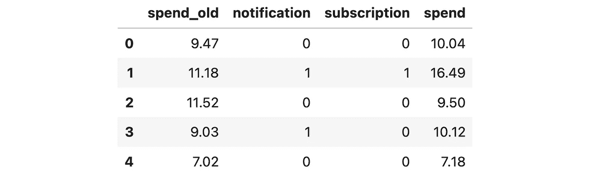

# 理解工具变量

> 原文：[`towardsdatascience.com/understanding-instrumental-variables-0ce5d3d6ba20`](https://towardsdatascience.com/understanding-instrumental-variables-0ce5d3d6ba20)

## [因果数据科学](https://towardsdatascience.com/tagged/causal-data-science)

## *如何在无法随机化治疗时估计因果效果*

[](https://medium.com/@matteo.courthoud?source=post_page-----0ce5d3d6ba20--------------------------------)[](https://towardsdatascience.com/?source=post_page-----0ce5d3d6ba20--------------------------------) [Matteo Courthoud](https://medium.com/@matteo.courthoud?source=post_page-----0ce5d3d6ba20--------------------------------)

·发表于[数据科学前沿](https://towardsdatascience.com/?source=post_page-----0ce5d3d6ba20--------------------------------) ·阅读时间 12 分钟·2023 年 11 月 13 日

--


封面，图片作者提供

A/B 测试是因果推断的黄金标准，因为它们允许我们在最少假设下做出有效的因果声明，这要归功于**随机化**。实际上，通过随机分配**治疗**（药物、广告、产品等），我们能够比较**结果**（疾病、公司收入、客户满意度等）在**受试者**（患者、用户、客户等）之间的差异，并将结果的平均差异归因于治疗的因果效果。

然而，在许多情况下，由于伦理、法律或实际原因，**无法随机化**治疗。一种常见的在线环境是按需功能，例如订阅或高级会员。其他设置包括我们无法区分客户的功能，例如保险合同，或者那些深度硬编码到系统中的功能，实验可能不值得付出努力。在这些情况下，我们仍然可以进行有效的因果推断吗？

答案是肯定的，这要归功于**工具变量**和对应的实验设计，即**鼓励设计**。在上述许多情况下，我们无法随机*分配*治疗，但我们可以*鼓励*客户接受治疗。例如，我们可以提供订阅折扣，或者我们可以更改选项呈现的顺序。虽然客户对接受治疗拥有最终决定权，但我们仍然能够估计因果治疗效果。让我们看看如何做到这一点。

# 评估订阅计划

在文章的其余部分，我们将使用一个示例。假设我们是一家产品公司，启动了一份每周的**通讯**以推广产品和功能更新。我们想了解通讯是否值得投入，以及它是否最终成功地增加了**销售额**。不幸的是，我们不能进行标准的 A/B 测试，因为我们不能强迫客户**订阅**通讯。这是否意味着我们无法评估通讯？不完全是。

假设我们还在移动应用上进行了一次关于新**通知**的 A/B 测试，以推广通讯。随机的一部分客户收到了通知，而另一部分客户没有。也许这个 A/B 测试与**通讯**的因果效应评估毫无关系，这在大公司中有时会发生。然而，这对数据科学家来说是一个绝佳的机会，尤其是对于那些有兴趣了解通讯对**销售**影响的人。

首先，我们来看看数据。我从[src.dgp](https://github.com/matteocourthoud/Blog-Posts/blob/main/notebooks/src/dgp.py)中导入了数据生成过程，并从[src.utils](https://github.com/matteocourthoud/Blog-Posts/blob/main/notebooks/src/utils.py)中导入了一些绘图工具。

```py
dgp = dgp_notification_newsletter(n=10_000)
df = dgp.generate_data()
df.head()python
```



数据快照，图源作者

我们有关于*10,000*名客户的信息，我们观察了他们是否收到了`notification`，是否`subscribed`了通讯，以及他们`spent`了多少。此外，我们还观察了他们在订阅程序推出前的花费情况（`spent_old`）。在文章的其余部分，我们将这些变量标记如下：

+   `notification`，**处理分配**，*Z*

+   `subscription`，**处理状态**，*W*

+   `spend_old`，**特征**或控制变量，*X*

+   `spend`，**结果**，*Y*

一种**天真的方法**是比较`subscribed`和未`subscribed`客户之间的`spend`差异。相应的因果对象或*估计量*是


订阅对花费的影响，图源作者

让我们可视化两个组的平均`spend`。

```py
plot_group_comparison(df, x="subscription", y="spend", title="Spend", xticks=["Non-subscriber", "Subscriber"])
```


订阅者与非订阅者之间的花费差异，图源作者

订阅者平均花费比非订阅者多*11.5$*。但这是否是**因果**效应？

我们可以想象，那些更活跃、对我们产品更感兴趣的客户也会对收到有关它的新闻更感兴趣。例如，我们可以想象那些有更多**预算**的客户，也会希望更好地花费这些预算并订阅通讯。

我们可以用以下的有向无环图（DAG）来表示变量之间的关系。如果你从未听说过 DAG，我建议你先阅读我的入门文章。

[](/controls-b63dc69e3d8c?source=post_page-----0ce5d3d6ba20--------------------------------) ## DAGs 和控制变量

### 编辑描述

towardsdatascience.com

在图中，我们用圆圈表示变量，用箭头表示因果关系。


DAG 数据生成过程，图像由作者提供

从技术上讲，客户的**预算**是一个不可观察的混杂因素，它在我们的处理变量`subscription`和结果变量客户的`spend`之间打开了一个虚假的路径。因此，我们不能将*11.5$*的均值差异估计解释为因果关系。

我们能做什么？

# 鼓励设计

不幸的是，我们不能进行 A/B 测试，因为我们不能强制人们订阅新闻通讯。然而，我们可以*鼓励*人们订阅。例如，我们可以发送移动**通知**来宣传新闻通讯。这种设置称为**鼓励设计**，因为我们不随机化处理，而是随机化鼓励措施。在我们的设置中，鼓励措施`notification`也被称为**工具变量**。

重要的是要强调，虽然被随机分配，但鼓励措施*不*与感兴趣的处理相符。事实上，尽管收到通知，有些人仍然*不会*订阅，有些人则会在*未*收到通知的情况下订阅。


处理分配和处理状态，图像由作者提供

添加鼓励措施`notification`后，数据生成过程可以用以下 DAG 表示。


DAG 数据生成过程，图像由作者提供

请注意，现在我们已经关闭了`subscription`和`spend`之间的开放路径。因此，我们可以估计订阅对销售概率的因果效应。我们来看一下。

首先，我们想了解`notification`是否有效。这通常被称为**工具的强度**。由于随机化，我们可以将收到`notification`的人与未收到通知的人之间的`spend`平均差异归因于处理本身。


通知对消费的影响，图像由作者提供

让我们可视化相应的均值差异估计。

```py
plot_group_comparison(df, x="notification", y="spend", title="Spend", xticks=["No Notification", "Notification"])
```


带有和不带有通知的消费差异，图像由作者提供

看起来，收到`notification`的客户平均比未收到通知的客户多花费*1$*。这比我们之前估计的*11.5$*低得多。

然而，`notification`对`spend`的影响不是我们关注的重点。我们更想知道`subscription`对`spend`的影响。实际上，并非所有收到邮件的客户都会订阅新闻简报。反之，一些人即使没有通知也会订阅新闻简报。

这意味着我们刚刚计算出的效果被**稀释**了，因为有些人不遵守我们的激励措施，即`notification`。我们必须将其*仅*归因于因新闻简报而改变主意的客户。这些客户有多少？

让我们计算每个处理组的`subscription`概率。


通知对订阅概率的影响，图像由作者提供

```py
plot_group_comparison(df, x="notification", y="subscription", title="Subscription Probability", xticks=["No Notification", "Notification"])
```


带有和没有通知的订阅概率，图像由作者提供

收到`notification`的客户的`subscription`概率高出*17%*。换句话说，似乎`notification`能够让*17%*的客户改变主意。从对照组中，我们了解到*28%*的人无论如何会订阅，而我们无法说服剩下的*55%*。

我们现在拥有进行主要分析所需的所有要素

## 工具变量（IV）

在这种情况下，通过一个二元工具变量，即`notification`，一个二元处理，即`subscription`决策，以及 50-50 的处理分配概率，我们可以获得对工具变量工作原理的非常简单的**直观**理解。

我们有四组客户，取决于他们是否收到了通知，以及他们是否订阅了。

```py
df.groupby(["notification", "subscription"]).agg(spend=("spend", "sum"), customers=("spend", "count")).iloc[::-1].T.round(0)
```


按细分的消费和客户数量，图像由作者提供

让我们可视化每个组别的总消费和总客户数量。


按细分的消费和客户数量，图像由作者提供

比较处理组（`notification`）和对照组，我们看到通知导致了`spend`的*5k€*的增加（*43 + 20 - 28 - 30*）。为了恢复感兴趣的因果效应，我们只需将*5k€*的额外`spend`归因于*800*（*2200 - 1400*）个因`notification`而决定订阅的客户。结果正是*5k€ / 800 = 6€*每个客户！


按细分的消费和客户数量，图像由作者提供

更一般地，IV 估计量由**两个因果效应的比率**给出：工具变量（或鼓励，或分配）*Z*对结果*Y*的影响，除以工具变量*Z*对处理（或内生变量）*W*的影响。


工具变量估计器，图像由作者提供

为了计算 IV 估计量，我们将期望值替换为经验平均值。实际上，在我们的情况下，我们只是将前一部分图表中计算的两个均值差异估计值进行除法。

```py
tau_ZY = df.loc[df.notification == 1, "spend"].mean() - df.loc[df.notification == 0, "spend"].mean()
tau_ZW = df.loc[df.notification == 1, "subscription"].mean() - df.loc[df.notification == 0, "subscription"].mean()
tau_ZY / tau_ZW
```

```py
6.070222743259094
```

我们对 `subscription` 计划对 `spend` 影响的工具变量估计值是 *6$*，这在上面的图示中已经预期到！请注意，图示中的数学仅在完全 50-50 分配的特殊情况下有效。

更一般地，可以证明 IV 估计量的公式由协方差比率给出，


IV 估计量作为协方差比率，图片由作者提供

或者，使用矩阵符号表示，


IV 估计量的矩阵符号表示，图片由作者提供

# IV 扩展

如果我们有更多的工具变量或其他控制变量会发生什么？例如，我们可以进行其他实验以鼓励客户 `subscribe`。或者，如我们的情况，我们可以添加其他变量到模型中以提高预测准确性，如先前的消费水平 `spend_old`。我们如何将它们包含在模型中？

长话短说，当我们有多个工具变量时，工具变量公式可以重写为


两阶段最小二乘估计量，图片由作者提供

其中 *Ŵ* 是 *W* 在 *Z* 上的投影，即在实践中是给定处理分配的预测处理状态。这个预测步骤称为**第一阶段**。这个公式应该让你想到 OLS 估计量公式。实际上，这相当于将我们的结果 *Y* 对预测处理 *W* 进行线性回归，给定分配 *Z*。这个步骤称为**第二阶段**。总体来说，由于估计过程可以分为两个独立的阶段，因此称为**两阶段最小二乘（2SLS）估计量**。

两阶段公式在大多数 IV 包的实现中尤为明显，在这些包中，我们将处理表示为对工具变量的回归结果。在 `[IV2SLS](https://bashtage.github.io/linearmodels/iv/iv/linearmodels.iv.model.IV2SLS.html)` 包中，这通过使用方括号来完成。

```py
from linearmodels.iv.model import IV2SLS as iv

model_iv = iv.from_formula("spend ~ 1 + [subscription ~ notification]", data=df).fit()
model_iv.summary.tables[1]
```


IV 估计量，图片由作者提供

我们可以验证这在代数上等同于首先对 `subscription` 和 `notification` 进行回归，然后对预测的 `subscription` 概率进行 `spend` 回归。下面我们运行这两个回归并报告第二阶段的估计值。

```py
model_1st_stage = smf.ols("subscription ~ 1 + notification", data=df).fit()
df["subscription_hat"] = model_1st_stage.predict(df)
model_2nd_stage = smf.ols("spend ~ 1 + subscription_hat", data=df).fit()
model_2nd_stage.summary().tables[1]
```


2SLS 估计量，图片由作者提供

系数确实是相同的！

最后，上述两阶段的公式也使得包含额外的**协变量**变得相当直观。我们只需将协变量添加到两个阶段。

```py
model_1st_stage = smf.ols("subscription ~ 1 + spend_old + notification", data=df).fit()
df["subscription_hat"] = model_1st_stage.predict(df)
model_2nd_stage_x = smf.ols("spend ~ 1 + spend_old + subscription_hat", data=df).fit()
model_2nd_stage_x.summary().tables[1]
```


2SLS 估计量，图片由作者提供

我们可以再次验证，估计的系数是相同的。

```py
model_2sls = iv.from_formula("spend ~ 1 + spend_old + [subscription ~ notification]", data=df).fit()
model_2sls.summary.tables[1]
```


2SLS 估计，图像由作者提供

将之前的消费水平纳入回归确实将标准误差从*0.5*降低到了*0.1*。

# IV 的限制

在实验设置中，工具变量的主要限制，如本文分析所示，是它们估计的是一种非常“特殊”的因果效应。正如我们在前一节中看到的，我们必须通过决定`订阅`*因为*`通讯`的客户数量来重新缩放总体效应。这意味着我们只能估计那些*遵守*我们干预的客户的效果。这一类客户通常被称为**合规者**，相应的因果效应被称为**局部平均处理效应（LATE）**或**合规者平均因果效应（CACE）**。

不幸的是，我们无法对那些即使没有`通知`也订阅了`通讯`的客户（即**总是接受者**）以及那些我们无法通过`通知`说服的客户（即**从不接受者**）做出任何判断。

IV 的另一个限制涉及其**假设**。在上一段中，我们讨论了三类客户：合规者（我们最喜欢的）、总是接受者和从不接受者。你可能注意到这种分类隐含着第四类群体的存在：**违抗者**。这些客户如果我们没有收到`通知`的话，本来会`订阅`通讯。然而，由于收到通知，他们改变了主意，*违背了*工具变量的意图。


根据处理分配和处理状态分组，图像由作者提供

为了能够得出因果结论，我们必须假设实验中**没有违抗者**，否则我们的重新缩放将会错误，我们的估计也会有偏差。

另一个在背景中潜在的重要假设是通常所说的**排除限制**。这个假设指出，工具变量`通知`只通过处理变量`订阅`影响结果`消费`。在我们的设置中，一个潜在的违背情况是通知可能会*唤醒*处于休眠状态的用户。想象一下，一个客户想要完成一笔交易，并且已经将物品添加到购物车中，但忘记了结账。订阅通知可能会提醒用户结账，从而直接影响`消费`。如你所想，IV 估计会有偏差，因为我们错误地将一些销售归因于`订阅`，而这些销售实际上是`通知`本身的*直接*效果。

# 结论

在这篇文章中，我们介绍了**工具变量**在实验环境中的应用。当我们因为伦理、法律或技术限制而不能随机化处理时，我们仍然可以考虑随机化**激励**来接受处理。这使我们能够做出因果陈述，但仅针对整体人群中的一个子集，即**合规者**，即因激励而接受处理的客户。

重要的是要注意，工具变量也可以在**观察设置**中使用。然而，在这种情况下，我们之前提到的**排除限制**假设变得更难以证明。实际上，我们需要一个环境，在这个环境中，我们的工具变量不会通过*任何其他*途径影响结果。从技术上讲，排除限制假设是


排除限制，作者图片

当我们无法控制鼓励分配的设计时，这一假设更难以证明。然而，如果假设成立，它为在全新环境下进行因果推断打开了大门。

## 参考文献

+   Spotify (2023), [A/B 测试中的鼓励设计和工具变量](https://engineering.atspotify.com/2023/08/encouragement-designs-and-instrumental-variables-for-a-b-testing/)

+   Goldsmith-Pinkham (2021), [工具变量](https://www.youtube.com/watch?v=LEAx0He_KBI) 视频讲座

+   Ding (2023), [因果推断的第一课程](https://arxiv.org/abs/2305.18793) 注释

## 相关文章

+   DAGs 和控制变量

+   理解遗漏变量偏差

+   理解 Frisch-Waugh-Lovell 定理

## 代码

你可以在这里找到原始的 Jupyter Notebook：

[](https://github.com/matteocourthoud/Blog-Posts/blob/main/notebooks/instrumental_variables.ipynb?source=post_page-----0ce5d3d6ba20--------------------------------) [## Blog-Posts/notebooks/instrumental_variables.ipynb at main · matteocourthoud/Blog-Posts

### 代码和笔记本用于我的 Medium 博客文章。通过创建一个...

[github.com](https://github.com/matteocourthoud/Blog-Posts/blob/main/notebooks/instrumental_variables.ipynb?source=post_page-----0ce5d3d6ba20--------------------------------)

## 感谢阅读！

*我非常感激！* 🤗 *如果你喜欢这篇文章并希望看到更多内容，请考虑* [***关注我***](https://medium.com/@matteo.courthoud)*。我每周发布一次与因果推断和数据分析相关的主题。我尽量保持帖子简洁但准确，总是提供代码、示例和模拟。*

*此外，简单的* ***免责声明***：我写作是为了学习，所以错误是常见的，尽管我尽力而为。请在发现错误时告诉我。我也欢迎对新主题的建议！*
