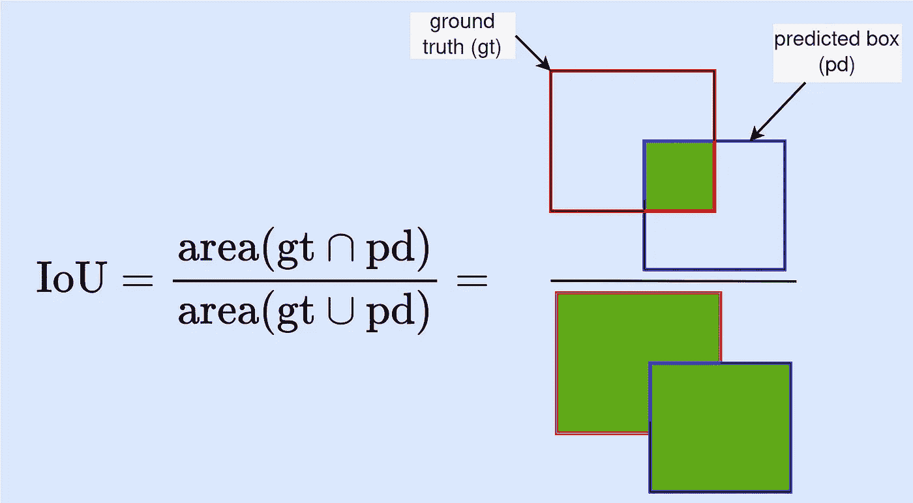
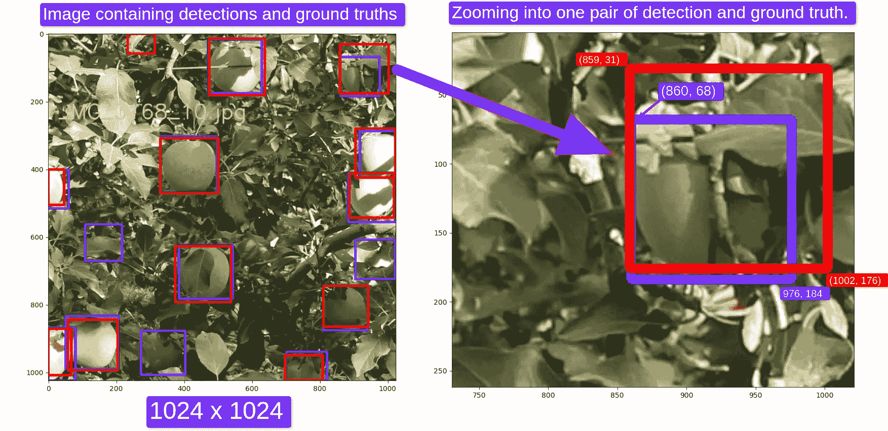
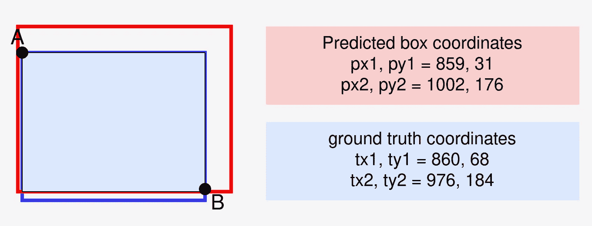
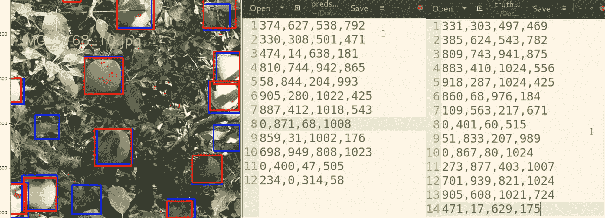
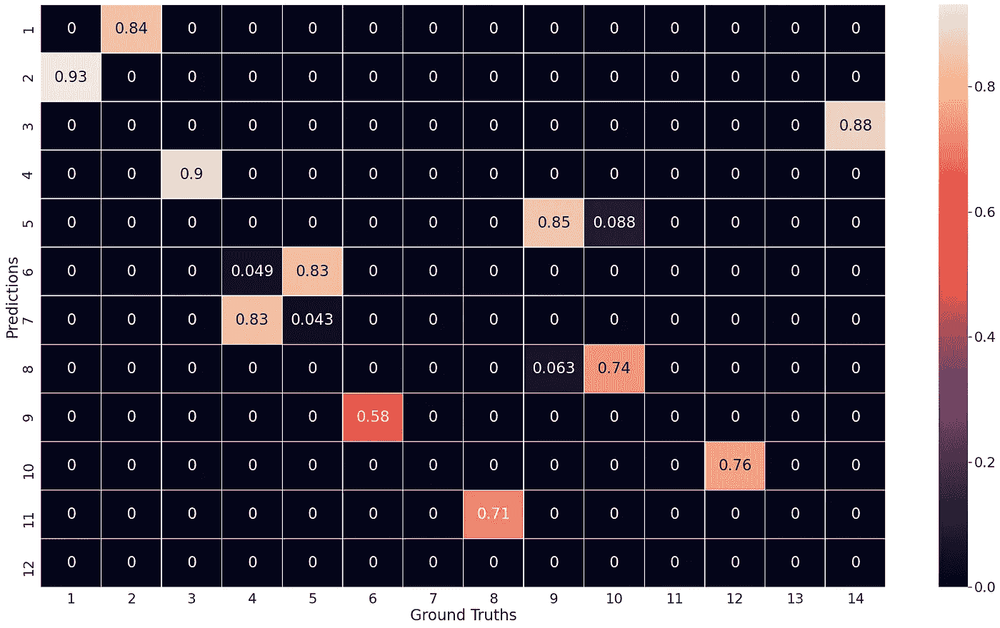

# 理解目标检测中的交并比（代码）

> 原文：[`towardsdatascience.com/understanding-intersection-over-union-for-object-detection-code-9a691c72d83a`](https://towardsdatascience.com/understanding-intersection-over-union-for-object-detection-code-9a691c72d83a)

## 目标检测模型的评估归结为一个问题：确定检测结果是否有效。

[](https://medium.com/@kiprono_65591?source=post_page-----9a691c72d83a--------------------------------)[](https://towardsdatascience.com/?source=post_page-----9a691c72d83a--------------------------------) [Kiprono Elijah Koech](https://medium.com/@kiprono_65591?source=post_page-----9a691c72d83a--------------------------------)

·发表于 [Towards Data Science](https://towardsdatascience.com/?source=post_page-----9a691c72d83a--------------------------------) ·阅读时间 7 分钟·2023 年 10 月 7 日

--


照片来自 [Vardan Papikyan](https://unsplash.com/@varpap?utm_source=medium&utm_medium=referral) 在 [Unsplash](https://unsplash.com/?utm_source=medium&utm_medium=referral)

确定检测是否有效需要理解 **交并比指标（IoU）**。

本文涵盖以下内容：

+   IoU 基础——**什么是 IoU**？

+   **如何计算（理论上和 Python 代码中）单对检测和地面真实边界框的 IoU**

+   **计算多个预测和地面真实边界框的 IoU**。

+   如何 **解读 IoU 值**？

# 什么是交并比（IoU）？

IoU 是评估目标检测模型的核心指标。它通过评估检测框和地面真实框之间的重叠程度来衡量对象检测器的准确性。

+   **地面真实框** 或 **标签** 是一个标注框，显示了对象的位置（标注通常是手工完成的，地面真实框被认为是对象的实际位置）。

+   **检测框** 或 **预测边界框** 是来自对象检测器的预测。

从形式上讲，**IoU** 是地面真实框（*gt*）和预测框（*pd*）的交集面积除以两个框的并集面积。



IoU 定义（作者提供的图像）。

# 示例 1：计算单对检测和地面真实的 IoU

让我们从一个简单的例子开始。计算一个检测和一个地面真实的 IoU。

为此，我们需要两个框的左上角（x1, y1）和右下角（x2, y2）坐标。

在下图（右）中，我们有两个边界框：

**预测边界框 (p-box)：** (px1, py1, px2, py2) = (859, 31, 1002, 176)

**真实边界框 (t-box)：** (tx1, ty1, tx2, ty2) = (860, 68, 976, 184)



左：包含 14 个真实值（蓝色框）和 12 个预测值（红色框）的图像。右：单个真实框和预测框的放大视图（标注由作者完成，果园图像来源于 [`zenodo.org/record/3712808`](https://zenodo.org/record/3712808)）。

**重要：** 在计算机视觉中，惯例是：

+   **x 轴** 是图像的水平维度，*从左到右值逐渐增大*。

+   **y 轴** 是图像的垂直维度，*从上到下值逐渐增大*（这与标准的笛卡尔坐标系统不同）。

## 步骤 1：计算两个盒子的面积

这个步骤计算预测框和真实框的面积。它仅是长度乘以宽度。

***predicted_area*** *= (1002–859) * (176–31) = 20735* ***ground_truth_area*** *= (976–860) * (184–68) = 13456*

## 步骤 2：找到交集点

这个步骤用于找到交集区域的 top-left(A) 和 bottom-right(B) 坐标。

这可以通过以下方法找到：

top_left = max(px1, tx1), max(py1, ty2)

bottom_right = min(px2, tx2), min(py2, ty2)

在我们的案例中，

***top_left (A)*** *= max(859, 860), max(31, 68) = (860, 68)* ***bottom_right (B)*** *= min(1002, 976), min(176, 184) = (976, 176)*



显示两个盒子之间的交集区域（图片作者提供）。

## 步骤 3：计算交集面积

由于我们有交集点，我们可以轻松地计算交集矩形的面积。

***intersection_area*** *= (976–860) * (176–68) = 12528*

## 步骤 4：计算 IoU 值

IoU = 交集面积 / 并集面积，

其中 *union_area* 是两个盒子面积的总和减去交集面积。即，

***union_area = (真实边界框面积 + 预测框面积) - 交集面积*** *= (20735+13456) — 12528 = 21663*

因此，

***IoU = 12528/21664 = 0.578286558***

## 让我们将其转换为 Python 代码

以下代码可用于计算单对真实框和预测框的 IoU。代码片段之后，让我们深入探讨所使用的思路。

```py
import numpy as np

def compute_iou(box1, box2):
    """
    This function computes the intersection-over-union of two boxes.
    Both boxes are expected to be in (x1, y1, x2, y2) format.
    where (x1, y1) is the top_left coordinates and 
    (x2, y2) is the bottom_right coordinates

    Arguments:
        box1 4 by 1 NumPy Array: The first box.
        box2 4 by 1 NumPy Array: The second box.

    Returns:
        iou (float): The intersection-over-union value for the two boxes.
    """
    # Calculate the area of each box
    area1 = np.prod(box1[2:] - box1[:2])
    area2 = np.prod(box2[2:] - box2[:2])
    print("Area of box 1 and box2, respectively: ", area1, area2)

    # Calculate the intersection coordinates (top left and bottom right)
    top_left = np.maximum(box1[:2], box2[:2])
    bottom_right = np.minimum(box1[2:], box2[2:])
    print("Top left and bottom right of intersection rectangle: ", top_left, bottom_right)

    # Calculate the intersection area
    intersection = np.prod(np.clip(bottom_right - top_left, a_min=0, a_max=None))
    print("Intersection area: ", intersection)
    # Calculate the union area
    union = area1 + area2 - intersection
    print("Union area: ", union)

    # Calculate the IoU
    iou = intersection / union if union > 0 else 0.0

    return iou

# Calling compute_iou with overlapping boxes
detection = np.array([859, 31, 1002, 176])
label = np.array([860, 68, 976, 184])
iou_value = compute_iou(detection, label)
print("IoU:", iou_value)
```

输出：

```py
Area of box 1 and box2, respectively:  20735 13456
Top left and bottom right of intersection rectangle:  [860  68] [976 176]
Intersection area:  12528
Union area:  21663
IoU: 0.5783132530120482
```

让我们第二次调用 compute_iou() 函数，使用不重叠的盒子。

```py
# Calling compute_iou with non-intersecting boxes
detection = np.array([810, 744, 942, 865])
label = np.array([109,563,217,671])
iou_value = compute_iou(detection, label)
print("IoU:", iou_value)
```

输出：

```py
Area of box 1 and box2, respectively:  15972 11664
Top left and bottom right of intersection rectangle:  [810 744] [217 671]
Intersection area:  0
Union area:  27636
IoU: 0.0
```

代码分解：

+   [NumPy 向量化](https://www.programiz.com/python-programming/numpy/vectorization) 使我们能够对数组执行 `np.prod()`, `np.maximum()`, `np.minimum()`, `np.clip()`, `addition` 和 `subtraction` 等操作，而无需循环遍历数组元素或索引单个元素。

+   `np.clip()` 函数限制或“剪切”数组中的值在指定范围内。在我们的案例中，`np.clip(bottom_right — top_left, a_min=0, a_max=None)` 通过将负值设为 0 来确保交集的宽度和高度值为非负数。

# 示例 2：计算多个真实值和预测框对的 IoU

在这个例子中，我们想要计算下图中所有真实值和预测框对的 IoU 值（最左侧）。

图像包含 12 个预测（红色框）和 14 个真实值（蓝色框）。



左：包含真实值和检测的图像，中间：预测，右：真实值（作者标注，果园图像来源于 [`zenodo.org/record/3712808`](https://zenodo.org/record/3712808)）。

通过修改初始代码，可以轻松计算所有检测和真实值对的 IoU，如下所示。

```py
def compute_ious(boxes1, boxes2):
    """
    This function computes intersection-over-union of boxes.
    Both sets of boxes are expected to be in (x1, y1, x2, y2) format
    where (x1,y1) is the top-left coordinates and 
    (x2,y2) is the bottom right coordinates
    Arguments:
        boxes1: M by 4 NumPy array
        boxes2: N by 4 NumPy array
    Returns:
        iou MxN Numpy Matrix - containing the pairwise
            IoU values for every element in boxes1 and boxes2
    """
    # Compute area for all combination of boxes in boxes1 and boxes2
    area1 = np.prod(boxes1[:, 2:] - boxes1[:, :2], axis=1)
    area2 = np.prod(boxes2[:, 2:] - boxes2[:, :2], axis=1)

    # Top left and bottom right of the intersection for all box pairs
    top_left = np.maximum(boxes1[:, None, :2], boxes2[:, :2])  # NxMx2 Array
    bottom_right = np.minimum(boxes1[:, None, 2:], boxes2[:, 2:])  # NxMx2 Array

    # Compute intersection for all box pairs
    intersection = np.prod(np.clip(bottom_right - top_left, a_min=0, a_max=None), 2)

    return intersection / (area1[:, None] + area2 - intersection)

# Define detections and ground_truths
detections = np.array([[374,627,538,792],
[330,308,501,471],
[474,14,638,181],
[810,744,942,865],
[58,844,204,993],
[905,280,1022,425],
[887,412,1018,543],
[0,871,68,1008],
[859,31,1002,176],
[698,949,808,1023],
[0,400,47,505],
[234,0,314,58]])

ground_truths = np.array([[331,303,497,469],
[385,624,543,782],
[809,743,941,875],
[883,410,1024,556],
[918,287,1024,425],
[860,68,976,184],
[109,563,217,671],
[0,401,60,515],
[51,833,207,989],
[0,867,80,1024],
[273,877,403,1007],
[701,939,821,1024],
[905,608,1021,724],
[471,17,629,175]])
# Call compute_ious() function 
ious = compute_ious(detections, ground_truths)
print(ious)
```

**输出（为更好地查看而格式化）：**



compute_ious() 函数的输出（图像由作者提供）

输出显示：

+   一个检测（索引 12）没有与任何真实值重叠。

+   3 个真实值与任何检测没有重叠——位于索引 7、11 和 13 的真实值。

+   有 11 个检测的 IoU > 50% 与真实值。

让我们详细分析一段可能不太清楚的代码：

+   在上述代码中，`None` 在索引操作中的使用是 NumPy 的一种技术，用于在数组中引入新的轴或维度。它通常用于广播不同形状的数组，以执行逐元素操作或启用某些计算。

# IoU 值的解释

IoU 值范围在 [0, 1] 之间，其中 0 表示两个框之间没有重叠，而 1 表示完全重叠。

根据你的应用，你可以设置一个 IoU 阈值来确定什么是好的检测。

希望这篇文章能让 IoU 概念更清晰。

祝好运！
