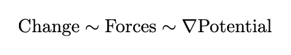

# 理解大型语言模型：**(Chat)GPT 和 BERT 的物理学**

> 原文：[`towardsdatascience.com/understanding-large-language-models-the-physics-of-chat-gpt-and-bert-ea512bcc6a64`](https://towardsdatascience.com/understanding-large-language-models-the-physics-of-chat-gpt-and-bert-ea512bcc6a64)

## 从物理学家的角度探讨粒子和力量如何帮助我们理解大型语言模型（LLMs）。

 [Tim Lou, PhD](https://tim-lou.medium.com/?source=post_page-----ea512bcc6a64--------------------------------)

·发表于 [Towards Data Science](https://towardsdatascience.com/?source=post_page-----ea512bcc6a64--------------------------------) ·12 分钟阅读·2023 年 7 月 20 日

--

ChatGPT 和冰晶之间可能有更多的相似之处（来源：[15414483@pixabay](https://pixabay.com/photos/ice-frost-winter-snow-snowflakes-6538605/))

ChatGPT，或者更广泛的说，大型语言 AI 模型（LLMs），已经在我们的生活中无处不在。然而，LLMs 的大部分数学和内部结构对于普通大众来说是模糊的知识。

那么，我们如何才能超越将 LLMs，如 ChatGPT，视为神秘黑箱的观念呢？物理学或许能提供答案。

每个人对我们的物理世界都有一定的了解。像汽车、桌子和行星这样的物体由数万亿个原子组成，受一套简单物理法则的支配。同样，像 ChatGPT 这样的复杂生物体也已经出现，并能够生成像艺术和科学这样高度复杂的概念。

结果表明，LLMs 的构建模块的方程类似于我们的物理法则。因此，通过理解复杂性如何从简单的物理法则中产生，我们可能能够获得一些关于 LLMs 工作原理和原因的见解。

# 从简单中看复杂

复杂的结构，如气泡膜和其中的对流单元，是由简单的物理法则生成的（照片来源：[chuttersnap](https://unsplash.com/@chuttersnap?utm_source=medium&utm_medium=referral) 在 [Unsplash](https://unsplash.com/?utm_source=medium&utm_medium=referral)）

我们的世界本质上是复杂的，但它可以通过极少量的基本相互作用来描述。例如，复杂的雪花和气泡膜可以与分子之间简单的吸引力联系起来。

那么，复杂结构产生的共同点是什么？在物理学中，复杂性是当我们从最小尺度放大到最大尺度时产生的。

以语言为类比，英语从有限数量的基本成分开始——26 个符号。这些符号可以组合成大约 100,000 个可用的单词，每个单词都携带独特的意义。从这些单词中，可以生成无数的句子、段落、书籍和卷册。

这种语言学层次结构类似于物理学中的层次结构。我们目前的基本法则（[标准模型](https://en.wikipedia.org/wiki/Standard_Model)）以有限数量的基本粒子开始，如夸克和电子，以及由光子等力子介导的一些相互作用。这些粒子和力结合形成原子，每种原子具有独特的化学性质。从这些原子中，产生了大量的分子、结构、细胞和生物。

在我们的物理世界中，有一种涌现的普遍性：尽管许多复杂系统有着完全不同的起源，但它们常常共享一些普遍特征。例如，许多液体尽管具有不同的化学性质，却共享三种共同的相态（液态、固态和气态）。作为一个更极端的例子，某些材料的物理学（[I 型超导体](https://en.wikipedia.org/wiki/Type-I_superconductor)）可以借用来描述基本物理学（著名的[希格斯机制](https://en.wikipedia.org/wiki/Higgs_mechanism)）。

尽管需要牢记语言和物理学之间的区别——物理定律由自然规定并受到限制，而语言是看似不受约束的人类创造——但语言复杂性不必与我们世界中的物理复杂性相似。

然而，正如我们将要论证的那样，ChatGPT 和其他类似的 LLMs 包含类似粒子物理学的结构。如果我们认为这些结构是 LLMs 成功的关键，它可能会提供语言复杂性与物理复杂性共享一些共同点的线索。此外，这也可能为我们提供关于 LLMs 如何工作的有价值见解。

# 语言模型的物理学

物理定律由方程 govern，但像 ChatGPT 这样的 LLMs 呢？（来源：作者自身的工作）

为了将 LLMs 与物理学联系起来，我们需要将它们的基础数学结构进行关联。在物理学中，粒子的运动（或更一般地说，场或状态）可以示意性地表示为：

物理方程的示意图

(** 技术说明：[哈密顿量](https://en.wikipedia.org/wiki/Hamiltonian_mechanics)形式使其更精确，尽管导数部分需要稍作修改)

直观地说，它表明粒子因力的作用而移动，这些力来源于一些抽象对象叫做*势能*的斜率。这类似于水流下山，势能来自重力和流体动力学。

结果表明，LLMs 的结构非常相似：它们将句子拆解为基本组成部分，即*tokens*，并以类似的方式逐层修改这些 tokens：

描述 LLMs 本质的示意方程

这将在下面的技术部分中更为准确地说明。由此，我们可以进行类比。

> 基于 Transformer 的语言模型将词语视作粒子，这些粒子在相互影响下移动，生成引人入胜的模式。

这样，就像水分子可以构建美丽的雪花，或液体肥皂混合物可以创造复杂的气泡图案一样，ChatGPT 的有趣结果可能归因于其类似物理的行为。

在接下来的可选部分中，我们将更详细地描述这一类比如何变得更加严谨，然后深入探讨这一洞见如何帮助我们理解 LLMs。

# 技术绕道

下面我们将更详细地解释如何将 LLMs 视作物理模型。

从物理学的角度来看，在微观层面上，每个粒子通常会受到系统中所有粒子的影响。例如，假设一个只有 3 个粒子的假想世界；在这种情况下，一个粒子和另一个粒子之间会有总共 3 × 3 = 9 种可能的势能。从示意图来看，我们可以这样表示：

描述三个粒子运动方程的示意图

(**在物理学中，势能通常是对称的，即 Potential₁₂ = Potential₂₁，我们在这里放宽了这一约束**)

为了了解这与 LLMs 的关系，让我们回顾一些基本事实：

1.  为了将数据输入 LLMs，文档或文本会被拆分成 tokens。tokens 通常由一个词或词的一部分组成。像粒子一样，tokens 被视为 LLM 中最小的不可分割的组成部分。

1.  LLMs 具有多个层级，在每一层中，所有的 token 都被自注意力模块所修改。

1.  最终输出层汇聚 tokens 形成预测，这些预测可用于分类或生成文本/图像。

如果我们以三个 token 的例子（比如来自句子“I like physics”）进行分析，这些方程会是什么样的？

根据我们所处理的 LLMs 的具体类型，有一些小的差异：[BERT](https://en.wikipedia.org/wiki/BERT_(language_model))或[GPT](https://en.wikipedia.org/wiki/Generative_pre-trained_transformer)。

## BERT 模型

对于类似 BERT 的模型（通常用于分类），每一层会按如下方式示意性地修改 tokens：

(** 层₁ 的参与是由于残差层)

如果我们把层看作类似于时间维度，那么这个方程的结构类似于控制三个粒子运动的方程，尽管在 LLM 中，层是离散的，而在物理学中则是连续的。

为了使类比完整，我们仍需要将注意力部分转换为某种潜在量。让我们从数学上更深入地挖掘。选取一个特定的令牌 *tᵢ*，在每一层中，它会根据自注意力机制进行相应的修改（忽略多个注意力头）：

其中 *Q*、*K*、*V* 是在注意力模块中通常看到的查询、键、值矩阵。现在我们忽略了归一化层。关键是指数形式可以被重写为某种潜在项的导数！

(** 尽管 *Q*ᵀ*K* 可能并不总是可逆的，这个方程式可能并不完全准确，但 *V* 是我们模型中的一个任意权重：因此我们总是可以在注意力模块中用 *V* 代替 *M* 以实现相同的模型性能)

这样，通过 LLM 的各层传递令牌类似于粒子在某些成对相互作用下的相互作用！这有点像气体分子互相碰撞并形成天气模式。

(** 从这个角度来看，我们可以将归一化和矩阵乘法 *M* 解释为一种投影，以便令牌粒子在系统中得到适当约束。这类似于过山车被限制在轨道上。)

## GPT

对于类似 [Chat](https://en.wikipedia.org/wiki/Generative_pre-trained_transformer) 的模型，讨论会有所修改。注意力模块具有额外的因果结构——即令牌只能被之前的令牌修改。这意味着方程中缺少一些项：

按照我们的类比，这意味着粒子一次一个地进入，每个粒子在经过所有的相互作用层后会被卡住。这有点像逐个原子地生长晶体。

需要记住的一点是，我们的物理类比并不是 100%准确的，因为物理学中普遍存在的对称性和能量/动量守恒等基本特性并不适用于 LLM。

# 语言模型中的涌现

像一片美丽的雪花一样，LLM 的输出可能依赖于其类似物理的属性（图片来源：[Aaron Burden](https://unsplash.com/@aaronburden?utm_source=medium&utm_medium=referral) 在 [Unsplash](https://unsplash.com/?utm_source=medium&utm_medium=referral)）

既然我们有了物理学的类比，它如何帮助我们理解 LLMs？希望的是，像复杂物理系统一样，我们可以从其他更熟悉且理解得更透彻的系统中获得对 LLMs 的洞见。然而，我必须提醒读者，以下大部分讨论将是推测性的，因为确认这些观点需要对 LLMs 进行详细的实验研究。

(* 事实上，如果我有更多资源，我会想象这些想法可能会成为有成果的学术研究项目)

下面是如何利用物理学语言重新框定我们对 LLMs 理解的示例。

## LLMs 训练

使用热物理学的语言，我们可以将大型语言模型（LLMs）视为一个可调节的物理系统，模型训练类似于对系统施加热压以调整其参数。这一观点在我的另一篇文章“[机器学习的热力学](https://medium.com/towards-data-science/a-physicists-view-of-machine-learning-the-thermodynamics-of-machine-learning-6a3ab00e46f1)”中有描述，因此我在这里不会详细讨论。

## 智能的出现？

尽管关于 ChatGPT 是否智能有很多讨论，但我将避免对此有争议的话题进行更多探讨，因为我甚至不确定如何定义智能。然而，很明显，ChatGPT 可以持续产生复杂且有趣的输出。

如果我们接受物理学类比，这并不令人惊讶。从雪花到龙卷风，我们知道即使是简单的定律也可以产生高度复杂的行为，而从复杂行为中，可以出现看似智能的结构。

复杂性作为一个概念并不容易定义，因此为了进一步探讨，我们可以尝试检查复杂系统的一些关键特征：相变就是其中之一。

## 相变

许多复杂的物理系统具有独特的相，每个相都有一组突出的物理属性。因此，合理的猜测是，在 LLMs 中也可能存在独特的相，每个相都被调整以在特定任务中（例如编码与校对）提供帮助。

我们如何验证或反驳这种说法？这就是事情可能变得有趣的地方。在物理学中，相位出现时，交互作用开始形成有趣的结构。一些例子包括：

1.  当水冷却时，分子之间的吸引力变得更强，使分子粘在一起形成固体。

1.  当金属被冷却到极低的温度时，电子可能通过声波（声子）相互吸引，形成 I 型超导体。

在 LLMs 中是否可能发生类似的现象？例如，在 ChatGPT 中，人们可能会推测“代码”或“校对”中的某些令牌组合可能会触发一系列特定的力量，从而驱动特定类型的输出。

相变的另一个技术方面是对对称性的修改。这与结构的创建有关，例如从水蒸气中形成的冰晶图案。尽管 LLMs 不具备物理对称性，但它们应该包含某种模型权重的排列对称性。这是因为模型性能应该是相同的，只要它们以相同的统计数据初始化并在相同的范式下训练。特定权重的具体值只有在训练过程中才变得重要。这可以看作是权重的“冻结”。然而，要继续讨论这个话题，我们需要深入探讨[自发对称破缺](https://en.wikipedia.org/wiki/Spontaneous_symmetry_breaking)的技术内容，我们将在以后再讨论。

## LLMs 高效吗？

尽管有许多关于 LLMs 由于其大量参数而被认为效率低下的批评（特别是与物理模型相比时），这些批评可能并不完全成立。

为什么？这归结于我们计算机的技术限制，这导致了物理学和 LLMs 之间存在显著差异：

1.  物理定律具有无限精度，而 LLMs 具有有限精度。

1.  物理学表现出巨大的层级结构，一些力非常微小，而另一些力则很大。在 LLMs 中，我们通过归一化尝试使所有输出/权重大小相似。

1.  在物理学中，微小的效应可以累积成巨大的影响（例如地球的引力）。在 LLMs 中，这些微小的效应通常会被舍去和消除。

1.  自然是一个极其高效的计算机，能够以无限精度瞬时计算所有尺度上的相互作用。另一方面，LLMs 则是受限于有限精度的相对较慢的计算机。

这意味着，虽然我们可以努力使 LLMs 更好地模拟物理现象并创建更强大的模型，但在实际应用中，计算机本质上无法完全模拟我们的世界（如在“[我们为什么不生活在模拟中](https://medium.com/physicist-musings/why-we-dont-live-in-a-simulation-a-physicist-s-perspective-1811d65f502d)”中讨论的）。因此， resorting to a large number of parameters 可能是一种应对这些不足的最后手段。

即使考虑到有限的精度，也可以认为标准计算机能够达到的复杂度可能存在上限。这可能会使得显著减少参数数量变得非常具有挑战性（尽管[量子计算](https://en.wikipedia.org/wiki/Quantum_computing)的进展可能会在未来改变这种情况）。

## 对 LLMs 的改进

我们的物理类比是否可以为下一代 LLMs 提供一些线索？我认为这是可能的。从逻辑上讲，根据我们的信念，有两个可能的方向可以探索：

1.  **物理类似的特征是值得追求的**：我们应该从物理学中获得更多灵感，以创造更好的模型结构。

1.  **物理学特征是不可取的**：物理学特征可能由于固有的计算限制而限制 LLM 的能力，因此我们应该避免它们。

既然我们使用物理学来理解大型语言模型（LLMs），那么我将重点关注第一个可能性。在这种假设下，我们如何解决类似 ChatGPT 的 LLMs 的不足之处？

1.  **保持层次结构**：我们不应仅仅专注于规范化权重和降低精度，而应探索替代方法，以考虑不同强度和规模的多样化交互。我们可以借鉴自然界中电磁力（非常强）和重力（非常弱）如何结合的方式。

1.  **适应不同阶段**：使用相同的基本分子方程描述冰和水是低效的。使用不同的描述来应对不同的阶段（例如声波与水波）会更有效。我们可以创建一种更好的结构，能够自然地适应模型中的宏观差异。

1.  **高级物理学技术**：在物理学中，我们不仅仅使用基本方程研究涌现现象。技术如 [热力学](https://en.wikipedia.org/wiki/Thermodynamics)、[均场理论](https://en.wikipedia.org/wiki/Mean-field_theory) 和 [重整化](https://en.wikipedia.org/wiki/Renormalization) 可以帮助我们简化问题。将这些思想的一部分融入 LLM 的构建模块中，可能会提高它们的效率。例如，最近对 [线性注意力](https://arxiv.org/abs/2006.16236)（A. Katharopoulos 等）的进展，可能已经被解释为一种均场方法。

通过探索这些途径，我们或许能够提升 LLM 的能力和效率，利用物理学的洞察力进一步推动该领域的发展。

# 结语

总结一下，我们展示了 LLM 的数学如何与物理学中的数学相似。这使我们能够利用对日常物理系统的直觉来理解这些新兴现象，例如 ChatGPT。我希望这有助于揭示 LLM 特征背后的原因。

更一般地说，我希望我已经向你传达了物理学如何为像 LLMs 这样的复杂主题提供有价值的见解。我坚信，当我们从看似不相关的领域中借鉴洞察力时，科学最为有效。

如果你喜欢这篇文章，你可能会对我关于类似主题的其他文章感兴趣，例如物理学与人工智能之间的联系。

请留下评论或提供反馈，这鼓励我写出更多有见地的文章！👋

 ## 物理学家对机器学习的看法：机器学习的热力学

### 自然界中的复杂系统可以通过热力学进行成功研究。那么，机器学习呢？

[逻辑回归背后的意义，从物理学角度看 [## 逻辑回归背后的意义，从物理学角度看]

### 为什么我们使用逻辑回归和 softmax 函数？热物理学或许能提供答案。

为什么因果关系是相关性的体现：物理学家的视角（第一部分） [## 为什么因果关系是相关性的体现：物理学家的视角（第一部分）]

### 我们都听说过“相关性不代表因果性”这句话，但没有人真正谈论因果性到底是什么…

[为什么我们不生活在模拟中](https://medium.com/physicist-musings/why-we-dont-live-in-a-simulation-a-physicist-s-perspective-1811d65f502d?source=post_page-----ea512bcc6a64--------------------------------) [## 为什么我们不生活在模拟中]

### 将现实描述为模拟极大地低估了我们世界的复杂性。以下是为什么模拟…

[medium.com](https://medium.com/physicist-musings/why-we-dont-live-in-a-simulation-a-physicist-s-perspective-1811d65f502d?source=post_page-----ea512bcc6a64--------------------------------)
