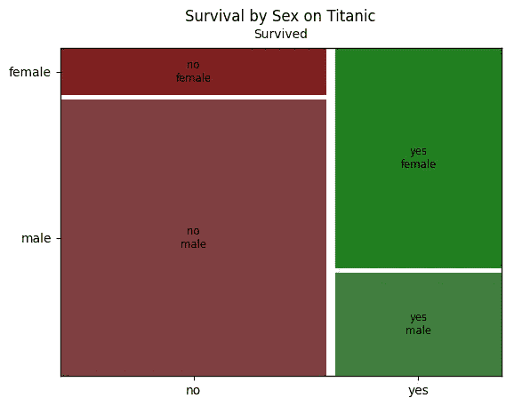
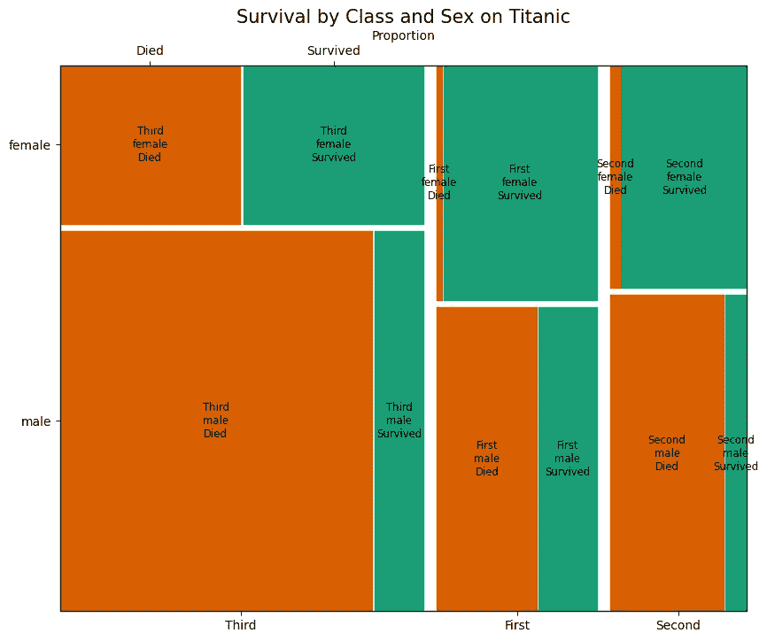

# 理解马赛克图

> 原文：[`towardsdatascience.com/understanding-mosaic-plots-fcf148315f4b`](https://towardsdatascience.com/understanding-mosaic-plots-fcf148315f4b)

## PYTHON | DATA | VISUALISATION

## 一本全面的指南，讲述如何使用 statsmodels 和 Matplotlib 有效绘制多变量数据集

[](https://david-farrugia.medium.com/?source=post_page-----fcf148315f4b--------------------------------)[](https://towardsdatascience.com/?source=post_page-----fcf148315f4b--------------------------------) [David Farrugia](https://david-farrugia.medium.com/?source=post_page-----fcf148315f4b--------------------------------)

·发表于[Towards Data Science](https://towardsdatascience.com/?source=post_page-----fcf148315f4b--------------------------------) ·7 分钟阅读·2023 年 6 月 13 日

--


照片来源：[Dimitry B](https://unsplash.com/fr/@dimitry_b?utm_source=medium&utm_medium=referral) 于[Unsplash](https://unsplash.com/?utm_source=medium&utm_medium=referral)

我们生活在一个数据泛滥的世界中——一个不断扩展的数字海洋。但在那片海洋中，有待发现的珍贵洞察就在其中。

寻找这些珍珠的关键是什么？数据可视化——将原始数据呈现成更易于理解和解读的视觉形式的过程。

借助数据可视化，你可以赋予原始数字生命，将它们转化为揭示隐藏模式、潜在趋势和关键联系的形式，这些联系可能在数据中隐匿不显。

在我们拥有的数据可视化工具中，有著名的 Matplotlib。

这个强大的 Python 库功能多样且强大。

在 Matplotlib 的工具包中隐藏着一个你可能未曾遇到过的宝石——马赛克图。

这些图表提供了一种强大的方法来可视化跨多个维度的分类数据。

想象一下能够俯瞰你的数据，理解不同变量如何相互作用和交集。马赛克图正是可以做到这一点，以直接且视觉上吸引人的方式呈现复杂关系。

无论是发现客户细分、理解用户行为，还是揭示人口统计趋势，马赛克图都是研究人员和数据科学家必备的绝佳工具。

在本文中，我们将探讨马赛克图的世界。我们将详细介绍如何在 Matplotlib 中创建马赛克图，并讨论如何解读它们，为你的数据可视化工具包增添一个额外的优势。

# 理解马赛克图

让我们首先将马赛克图比作某种织锦。每个复杂的部分代表数据中的一个独特类别，部分的大小反映了该类别的频率。

因此，织锦函数作为马赛克图，提供了一个视觉表现，帮助理解各种类别变量之间的互动。


图片由 [Tom Rumble](https://unsplash.com/@tomrumble?utm_source=medium&utm_medium=referral) 提供，来源于 [Unsplash](https://unsplash.com/?utm_source=medium&utm_medium=referral)

马赛克图的独特之处在于它们能够同时处理多个维度。想象它就像是审视一个色彩斑斓的数据魔方。

从外部视角，可以观察到不同类别（或颜色，根据我们魔方的比喻）如何相互连接和融合。

想想，你可能在哪里使用这些图表？

想象一下你在 Netflix 等流媒体平台工作，任务是理解不同年龄组、性别和各种类型之间的相互作用。在这里，马赛克图大放异彩。它提供了一个视觉上的描绘，例如，18-25 岁的女性与喜剧的互动频率，与同龄男性进行对比，或者 35-45 岁年龄组对惊悚片的倾向。

## 马赛克图具有许多优点。

+   *它们擅长处理多维度的类别数据，提供了数据的全景视角。*

+   *他们直观的颜色编码增强了视觉吸引力，加快了解读速度并促进快速决策。*

+   *它们揭示了原始数据表中可能隐藏的模式和关系。*

## 尽管如此，了解它们的限制仍然至关重要。

+   *如果类别数量过多或类别分布较为均匀，马赛克图可能会迅速变得复杂。*

+   *它们在处理定量数据时表现出限制，当精确的数值比较至关重要时，可能不是理想选择。*

尽管有这些限制，马赛克图仍然是数据可视化工具中不可或缺的工具。

它们能够将枯燥的数字表转换为动态的趋势和关系表现。

因此，当未来面对多变量类别数据集时，可以考虑使用马赛克图来挖掘隐藏的洞察。

# 使用 Matplotlib 创建你的第一个马赛克图

初次接触马赛克图可能会感觉像迷宫一样，对吧？实际上，使用 Matplotlib，整个过程变得相对简单。

首先，我们需要一些数据。我们将使用开放的 Titanic 数据集作为示例（参见 [`www.openml.org/search?type=data&sort=runs&id=40945&status=active`](https://www.openml.org/search?type=data&sort=runs&id=40945&status=active)）。

我们的目标？弄清楚男性和女性之间的生存率如何分布。

让我们开始吧，好吗？

我们首先导入所需的库：

```py
import seaborn as sns
import matplotlib.pyplot as plt
import pandas as pd
from scipy.io.arff import loadarff
from statsmodels.graphics.mosaicplot import mosaic
```

接下来我们加载数据集。数据集采用 ARFF 格式。我们可以通过以下方式将其加载到 pandas 中：

```py
# Load the data
raw_data = loadarff('titanic.arff')
titanic = pd.DataFrame(raw_data[0])
```

我们调用 statsmodels 中的马赛克函数，并传入我们想要可视化的特征。

```py
# Create the mosaic plot
mosaic(titanic, ['alive', 'sex'], gap=0.02)

# Customize the plot
plt.title('Survival by Sex on Titanic')
plt.xlabel('Survived')
plt.ylabel('Sex')

plt.show()
```

然后，我们得到如下结果：



当然，这只是一个非常简单的示例。

让我们提升一下难度，好吗？

假设我们想创建一个马赛克图，表示泰坦尼克号上每个乘客舱的比例、他们的生存状态和性别。

我们还将为‘幸存’变量使用颜色编码，并添加一些标签到图表中。

这一次，我们还需要导入 numpy 库。

```py
import numpy as np
```

我们将如下创建`survived`列：

```py
# Convert 'survived' into string for clarity in the plot
titanic['survived'] = titanic['survived'].map({0:'Died', 1:'Survived'})
```

我们还定义了图表使用的属性。这些属性主要用于图表的颜色编码。

```py
# Define properties function for colors
props = lambda key: {'color': '#1b9e77' if 'Survived' in key else '#d95f02'}
```

然后我们创建如下图表：

```py
# Create a new figure with a defined size
fig, ax = plt.subplots(figsize=(10, 8))

# Create the mosaic plot
mosaic(titanic, ['class', 'sex', 'survived'], gap=0.02, properties=props, ax=ax)

# Customize the plot
plt.title('Survival by Class and Sex on Titanic', fontsize=15)
plt.ylabel('Class - Sex')
plt.xlabel('Proportion')

plt.show()
```



## 解析马赛克图

马赛克图分为三个主要的垂直部分，代表泰坦尼克号上的三个舱位：*第一舱*、*第二舱*和*第三舱*。

每个部分的宽度与每个舱位的乘客数量成比例。在这种情况下，似乎第三舱的乘客最多，其次是第一舱，最后是第二舱。

在每个舱位部分内，图表进一步水平划分为两个部分，分别代表`男性`和`女性`。这些部分的高度与每个舱位中男性和女性的数量成比例。例如，在第三舱中，男性比女性多。

每个性别部分再进一步划分为**幸存**和**遇难**两个部分。这些划分的宽度与每个舱位中每个性别的幸存者和遇难者数量成比例。

例如，在‘第一’舱的‘女性’部分，代表‘幸存’的绿色区域远大于代表‘遇难’的橙色区域。这表明第一舱的女性中有很大比例幸存。

颜色编码提供了额外的视觉提示：绿色表示幸存者，而橙色表示遇难者。

# 使用马赛克图的小贴士和技巧

+   **保持简单** —— 马赛克图很容易变得令人困惑和杂乱。一次只处理少数类别。目标是传达洞察。

+   **实践有效的颜色编码** —— 与任何数据可视化一样，颜色调色板有着显著的影响。马赛克图也不例外。

+   **使用标签和注释** —— 始终标记图表的轴并提供描述性标题。背景信息是关键。

# 总结 remarks

就这样！

我们已经完成了马赛克图的探索。现在是时候思考一下我们在过程中学到了什么。

我们通过了解数据可视化为何如此重要来开启了这段旅程。我们了解了马赛克图作为观察多层次分类数据的有效方式，它帮助我们发现类别之间的详细相互作用。

然后我们利用 Titanic 数据集制作了我们的第一个马赛克图。我们还为图表添加了颜色、标签和标题，帮助我们用数据编织故事。

马赛克图的真正优势在于其将复杂数据转化为简单、直观故事的能力。但别忘了，保持简单很重要。过多的类别或混乱的颜色方案会将一个出色的图表变成视觉上的头痛。

现在，掌握了这项新知识，你已经准备好开始自己的数据可视化冒险了。也许你会使用马赛克图来了解你在网上商店的客户行为，或分析本地选举中的投票趋势。不论你处理的数据是什么，马赛克图都是你的空白画布，而你的发现就是你用来绘制它的颜色。

不要害羞，多多尝试，尝试不同的调整和各种数据集。实践出真知！

记住，每组数据都有一个故事要讲。所以，出去吧，让你的马赛克图编织出隐藏在数据中的故事。

祝你绘图愉快！

**你喜欢这篇文章吗？每月$5，你可以成为会员，解锁对 Medium 的无限访问权限。你将直接支持我和你在 Medium 上的其他喜爱作者。对此，深表感谢！**

[](https://david-farrugia.medium.com/membership?source=post_page-----fcf148315f4b--------------------------------) [## 使用我的推荐链接加入 Medium - David Farrugia

### 获取对我所有⚡高级⚡内容以及 Medium 上的所有内容的独家访问权限。通过给我买杯咖啡来支持我的工作…

david-farrugia.medium.com](https://david-farrugia.medium.com/membership?source=post_page-----fcf148315f4b--------------------------------)

# 想要联系我吗？

我很想听听你对这个话题的看法，或者任何关于人工智能和数据的想法。

如果你希望联系我，可以发邮件到***davidfarrugia53@gmail.com***。

[Linkedin](https://www.linkedin.com/in/david-farrugia/)
