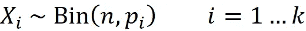

# 使用 Python 理解多项分布

> 原文：[`towardsdatascience.com/understanding-multinomial-distribution-using-python-f48c89e1e29f`](https://towardsdatascience.com/understanding-multinomial-distribution-using-python-f48c89e1e29f)

## 多项分布背后的数学和直觉

[](https://reza-bagheri79.medium.com/?source=post_page-----f48c89e1e29f--------------------------------)[](https://towardsdatascience.com/?source=post_page-----f48c89e1e29f--------------------------------) [Reza Bagheri](https://reza-bagheri79.medium.com/?source=post_page-----f48c89e1e29f--------------------------------)

·发布于[Towards Data Science](https://towardsdatascience.com/?source=post_page-----f48c89e1e29f--------------------------------) ·20 分钟阅读·2023 年 1 月 6 日

--


来源：[`pixabay.com/vectors/dice-game-die-luck-random-numbers-151867/`](https://pixabay.com/vectors/dice-game-die-luck-random-numbers-151867/)

多项分布是二项分布的推广，用于在具有多个结果的实验中计算概率。本文对多项分布进行了直观的介绍，并讨论了其数学性质。此外，还将教你如何使用 Python 中的 SciPy 库来建模和可视化多项分布。

**二项分布**

由于多项分布是二项分布的推广，我们将在此简要回顾一下。有关单变量概率分布的详细讨论，请参阅[另一篇文章](https://medium.com/towards-data-science/understanding-probability-distributions-using-python-9eca9c1d9d38)，如果你对二项分布或随机变量和概率质量函数（PMF）等概念不熟悉，建议你先阅读[那篇文章](https://medium.com/towards-data-science/understanding-probability-distributions-using-python-9eca9c1d9d38)。

*随机变量* 是一个其值由随机实验的结果决定的变量。随机变量通常用大写字母表示，但我们使用小写字母表示它可以取的特定值。例如，我们可以定义一个随机变量 *X* 来表示掷硬币的结果。为此，我们需要给每个结果分配一个数值。我们可以用 1 表示得到正面，用 0 表示得到反面。现在，*X*=1 表示掷硬币的结果是正面，*X*=0 表示是反面。这样只能取特定值的随机变量称为*离散随机变量*。

我们将离散随机变量*X*的概率质量函数（PMF）定义为一个给出*X*等于某个特定值的概率的函数。从数学上讲，*X*的 PMF 定义为函数*p*ₓ，使得


特定值*X*可以取的值用*x*表示，因此*P*(*X*=*x*)表示*X*=*x*的概率。我们知道，*X*所有可能值的概率之和应该等于 1，因此：


具有伯努利分布的离散随机变量*X*，其参数为*p*，表示一个只有两个结果的随机实验，分别用 0 和 1 表示（我们用*X*~Bern(*p*)表示）。这里*X*=1（也称为‘成功’）发生的概率是*p*，而*X*=0（也称为‘失败’）发生的概率是 1-*p*。例如，我们可以用伯努利分布的随机变量*X*表示掷硬币的结果。现在我们可以假设*X*=1 和*X*=0 分别表示得到正面和反面，*p*是得到正面的概率。

假设我们有一个*n*次独立随机实验的序列，每次实验可以用一个伯努利分布参数*p*的随机变量表示。因此，每次实验只有两个结果，分别为 1（成功）和 0（失败），且*X*=1 发生的概率为*p*（这样的实验称为伯努利试验）。具有参数*n*和*p*的二项分布的离散随机变量*X*表示这一序列中的成功总数，我们可以写作*X ~* Bin(*n, p*)。假设我们有一枚硬币，正面朝上的概率为*p*。我们可以用具有参数*n*和*p*的二项分布的随机变量*X*表示这一硬币在*n*次投掷中的正面总数（图 1）。


图 1（作者提供的图片）

**随机向量**

多项分布是一种*多变量分布*。在统计学中，*单变量分布*是仅一个随机变量的概率分布。多变量分布是单变量分布的推广，适用于两个或更多随机变量。要理解这些分布，我们首先应讨论随机向量。随机向量是一个随机变量的向量。如果我们有*n*个随机变量*X*₁、*X*₂ …、*X*ₙ，我们可以将它们放在随机向量***X***中：


我们用粗体大写字母表示随机向量。要表示随机向量的一个可能值（这也是一个向量），我们使用粗体小写字母，如***x***。例如：


是一个包含两个元素的随机向量，且


是它的一个可能值。

**联合 PMF**

假设我们有一个随机向量


其中 *X*₁，*X*₂，…，*Xₙ* 是离散随机变量。***X***的*联合概率质量函数*（联合 PMF）定义为：


其中 *P*(*X*₁=*x*₁，*X*₂=*x*₂，…，*Xₙ*=*xₙ*) 是 *X*₁=*x*₁，*X*₂=*x*₂，…，和 *Xₙ*=*xₙ* 同时发生的概率。如果我们知道随机向量 ***X*** 的联合 PMF，我们可以通过*边缘化*来推导其一个分量 *Xᵢ* 的分布。*边缘* *概率质量函数* 可以从 ***X*** 的联合 PMF 导出，如下所示


这里 *R***ₓ** 是 ***X*** 的支持集，表示随机向量 ***X*** 可以取的所有值的集合。因此，为了推导 *Xᵢ* 在点 *x* 的边缘概率 PMF，我们需要对 *R***ₓ** 中 *Xᵢ* 等于 *x* 的所有向量的概率进行求和。

**多项分布**

多项分布是二项分布的一种推广。假设我们有 *n* 次独立试验。每次试验有 *k* 种不同的结果（*k* ≥ 2），第 *i* 种结果的概率是 *pᵢ* 和


向量 ***p*** 表示这些概率：


设离散随机变量 *Xᵢ* 表示在*n*次试验中结果编号*i*出现的次数。随机向量 ***X*** 定义为


并且我们有 *x*₁+*x*₂ +…+*xₖ*=*n*。那么 ***X*** 就称为具有参数 *n* 和 ***p*** 的多项分布。***X*** 的联合 PMF 定义如下：


让我们看看是否可以证明这一点。首先，我们应该注意到如果 *x*₁+*x*₂ +…+*xₖ*≠*n*，那么事件 *X*₁=*x*₁，*X*₂=*x*₂，…，和 *Xₖ*=*xₖ* 是不可能的，因此其概率应为零。如果 *x*₁+*x*₂ +…+*xₖ*=*n*，事件 *X*₁=*x*₁，*X*₂=*x*₂，…，和 *Xₖ*=*xₖ* 的概率是


此外，获得 *X*₁=*x*₁，*X*₂=*x*₂，…，和 *Xₖ*=*xₖ* 的 *n* 次试验的不同方式的总数是


所以在*n*次试验中，*X*₁=*x*₁，*X*₂=*x*₂，…，和*Xₖ*=*xₖ*的总概率是


基于这个故事，多项分布可以用来描述一个 *k* 面的骰子。假设我们有一个 *k* 面的骰子，且获得面 *i* 的概率是 *pᵢ*。此外，设 *Xᵢ* 表示观察到面 *i* 的总次数。现在，如果我们掷骰子 *n* 次，随机向量 ***X*** 就具有参数 *n* 和 ***p*** 的多项分布（见图 2）。


图 2（作者提供的图片）

我们也可以用另一种方式来表达多项式分布。假设我们有一个由 *k* 种不同类别的物品组成的总体（*k* ≥ 2）。总体中属于类别 *i* 的物品比例为 *pᵢ*，并且


现在我们从总体中随机选择 *n* 个物品（允许重复），我们假设随机变量 *Xᵢ* 代表选择的物品中属于类别 *i* 的数量（图 3）。由于这些物品是随机选择的且允许重复，因此选择是相互独立的，每个物品属于类别 *i* 的概率是 *pᵢ*。因此，我们可以将每次选择视为一个具有 *k* 种不同结果的独立试验，每个结果 *i* 的相应概率是 *pᵢ*。现在，如果我们定义向量 ***p*** 为


那么随机向量


具有参数 *n* 和 ***p*** 的多项式分布。


图 3（图像来源：作者）

具有参数 *n* 和 ***p*** 的多项式分布的随机向量 ***X*** 可以表示为 *n* 个具有参数 1 和 ***p*** 的多项式分布的随机向量之和：


**证明**（*可选*）：向量 ***Y****ᵢ* 可以写成如下形式：


由于 *X*₁+*X*₂ +…+*X*ₖ*=*n*，我们可以得出在右侧有 *n* 个向量。每个 ***Y****ᵢ* 中有一个元素为 1，其余为 0。因此，每个 ***Y****ᵢ* 可以表示一个具有 *k* 种不同结果的试验，其中等于 1 的元素表示观察到的结果。因此，每个 ***Y****ᵢ* 具有参数为 1 和 ***p*** 的多项式分布。

我们可以合并多项式随机向量 ***X*** 中的多个元素来获得新的多项式随机向量。例如，设


现在我们可以合并前三个元素得到新的随机向量


而这个随机向量具有参数为 *n* 和 的多项式分布


实际上，通过合并 *X*₁、*X*₂ 和 *X*₅，我们创建了一个新类别，该类别的比例是 *p*₁+*p*₂+*p*₅。因此，它可以在剩余类别 3 和 4 上创建一个多项式分布，同时这些类别的比例保持不变。

多项式分布是二项式分布的推广。如果 *k*=2，多项式分布简化为二项式分布。因此，如果我们有


那么 *X*₁ ~ Bin(*n*, *p*₁) 和 *X*₂ ~ Bin(*n*, *p*₂)。

**证明**（*可选*）：我们应该注意到 *X*₂= *n*-*X*₁ 和 *p*₂=1-*p*₁。因此，如果我们将结果 1 视为成功，将结果 2 视为失败，则每次试验只有两种结果（成功和失败），成功的概率是 *p*₁。因此，每次试验可以用具有参数 *p*₁ 的伯努利分布表示，*X*₁ 代表了 *n* 次伯努利试验中成功的次数，参数为 *p*₁。因此，我们得出 *X*₁ 具有参数 *n* 和 *p*₁ 的二项分布。类似地，如果我们将结果 2 视为成功，将结果 1 视为失败，则 *X*₂ 代表了 *n* 次伯努利试验中成功的次数，参数为 *p*₂，因此具有参数 *n* 和 *p*₂ 的二项分布。

我们可以将之前的结果扩展到 *k*>2 的多项分布。如果


那么每个 *Xᵢ* 的边际分布是具有参数 *n* 和 *pᵢ* 的二项分布：



**证明**（*可选*）：我们假设结果 *i* 的成功概率为 *pᵢ*，所有其他结果的失败概率为 1-*pᵢ*。因此，*Xᵢ* 代表了 *n* 次伯努利试验中成功的次数，参数为 *pᵢ*，并且它具有参数 *n* 和 *pᵢ* 的二项分布。

此外，***X*** 的某些元素的总和服从二项分布。从数学上讲，如果 *Xᵢ,*₁, *Xᵢ,*₂, …, *Xᵢ,ₘ* 是随机向量 ***X*** 的 *m* 个元素（*m*<*k*），它们在向量 ***p*** 中的对应概率是 *pᵢ,*₁, *pᵢ*,₂, …, *pᵢ,ₘ*，那么总和 *Xᵢ,*₁ + *Xᵢ,*₂ + …+ *Xᵢ,ₘ* 服从具有参数 *n* 和 *pᵢ,*₁ + *pᵢ,*₂ + …+ *pᵢ,ₘ* 的二项分布。例如，对于 *n*=8 和 *k*=5，*X*₁+*X*₃+*X*₅ 具有参数 8 和 *p*₁ + *p*₃ + *p*₅* 的二项分布。

**证明**（*可选*）：如前所述，我们可以将多项式随机向量 ***X*** 中的多个元素合并，以获得一个新的多项式随机向量。因此，通过合并 *Xᵢ,*₁ + *Xᵢ,*₂ + …+ *Xᵢ,ₘ*，我们得到一个新的随机向量 ***Y***，它具有多项分布：


我们现在还展示了多项式随机向量每个元素的边际分布具有参数 *n* 和其对应概率的二项分布，因此我们得出结论 *Xᵢ,*₁ + *Xᵢ,*₂ + …+ *Xᵢ,ₘ* 具有参数 *n* 和 *pᵢ,*₁ + *pᵢ,*₂ + …+ *pᵢ,ₘ* 的二项分布。

我们可以使用 Python 中的 `scipy` 库生成多项分布。我们可以使用 `scipy.stat` 中的 `multinomial` 对象创建多项分布，并使用该对象的 `pmf()` 方法计算其联合 PMF。该对象接受 `n` 和 ***p*** 参数，其中 `n` 和 ***p*** 对应于 *n* 和 ***p***。`p` 是一个类似数组的对象。`p` 的每个元素应在 [0, 1] 区间内，并且这些元素的和应为 1。如果它们的和不为 1，则 `p` 的最后一个元素不会被使用，而是用之前元素和的 1 减去替代（以使元素和为 1）。

首先，我们需要导入所有必需的库：

```py
import numpy as np
import matplotlib.pyplot as plt
from scipy.stats import binom, multinomial
%matplotlib inline
```

列表 1 创建了以下多项分布


并计算其联合 PMF 在


```py
# Listing 1

n = 5
p=[0.5, 0.3, 0.2]
mult = multinomial(n=n, p=p)
mult.pmf([3, 1, 1])

# Output
0.15
```

我们也可以直接将分布参数传递给 `pmf()` 函数：

```py
multinomial.pmf([3, 1, 1], n=n, p=p)

# Output
0.15
```

方法 `rvs()` 可以用于生成随机变异。随机变异或简称变异是随机变量或随机向量的特定结果。使用此方法，我们可以从多项分布中抽取大小为 *m* 的随机样本，这意味着我们从具有多项分布的随机向量中生成 *m* 个随机变异。例如，要从方程 1 中的多项分布中抽取大小为 4 的随机样本，我们可以使用以下代码片段：

```py
np.random.seed(2)
multinomial.rvs(n=n, p=p, size = 4)

# Output
array([[2, 3, 0],
       [3, 1, 1],
       [2, 2, 1],
       [2, 2, 1]])
```

它返回一个包含 4 个元素的 2d 数组。每个元素是一个数组，表示方程 1 中的随机向量可以取的可能值 ***X***。

让我们看看如何可视化方程 1 定义的多项分布。在这里，我们希望收集***X***可能取的所有值。为此，我们只需计算元组 (*X*₁, *X*₂) 所有可能的值。一旦我们知道了 *X*₁ 和 *X*₂ 的值，就可以利用 *X*₃=*n*-*X*₁-*X*₂ 计算 *X*₃ 的值。由于 *n*=5，*Xᵢ* 可以取 0 到 5 之间的整数值。列表 2 使用 `numpy` 中的 `meshgrid()` 方法获取 (*X*₁, *X*₂) 的所有可能值及其对应的 *X*₃ 值。最后，(*X*₁, *X*₂, *X*₃) 的不同值被存储在数组 `X_mat` 中。我们得到了一些负值的 *X*₃。虽然这些负值是不可能取的，但我们无需丢弃它们，因为多项分布中任何 *Xᵢ* 为负值的联合 PMF 仅为零。

```py
# Listing 2

n = 5
x1_array = np.arange(0, n+1)
X1_mat, X2_mat = np.meshgrid(x1_array, x1_array)
x3_array = n - X1_mat.flatten() - X2_mat.flatten()

X_mat = np.array([X1_mat.flatten(), X2_mat.flatten(), x3_array]).T
X_mat

# Output
array([[ 0,  0,  5],
       [ 1,  0,  4],
       [ 2,  0,  3],
       [ 3,  0,  2],
       [ 4,  0,  1],
       [ 5,  0,  0],
       [ 0,  1,  4],
       [ 1,  1,  3],
       ...
```

现在我们可以使用 `X_mat` 计算 *X*₁ 在 *X*₁=3 时的边际 PMF。为此，我们需要对所有值为 3 的 ***X*** 的联合 PMF 进行求和。

```py
multinomial(n, p).pmf(X_mat[X_mat[:, 0]==3]).sum()

# Output
0.3125
```

我们还知道*X*₁的边际分布是参数*n*和*p*₁*的二项分布。因此，我们可以使用参数*n*=5 和*p*₁=0.5 的二项分布的 PMF。为了计算二项分布的 PMF，我们可以使用`scipy.stat`中的`binom`对象。我们计算*X*₁=3 处的 PMF 值，结果应该与之前的代码片段相同。

```py
binom.pmf(k=3,n=n, p=p[0])

# Output
0.31249999999999983
```

结果几乎相同，但由于数值误差存在小的差异。我们还可以通过从多项分布中抽样来近似*X*₁的边际 PMF。列表 3 从方程 1 中的多项分布中抽取了大小为 100,000 的样本，并绘制了该样本中*X*₁值的条形图。结果如图 4 所示。正如图中所示，样本的条形图与参数*n*=5 和*p*₁=0.5 的二项分布的 PDF 匹配。

```py
# Listing 3

np.random.seed(2)
n = 5
p=[0.5, 0.3, 0.2]
x = np.arange(n+1)
sample = multinomial.rvs(n=n, p=p, size=100000)
pmf_binomial = binom.pmf(k = x,n = n, p = p[0])
sample_marginal = sample[:, 0] 
values, counts = np.unique(sample_marginal, return_counts=True)
probs = counts / counts.sum()

fig = plt.figure(figsize=(8, 6))
plt.bar(values, probs, label='Marginal sample')
plt.plot(x, pmf_binomial, marker='o', color='red',
         label='Binomial distribution, n={}, p={}'.format(n, p[0]))
plt.xlabel('$x_1$', fontsize = 18)
plt.ylabel('Probability', fontsize=18)
plt.ylim([0, 0.45])
plt.legend(loc='best', fontsize = 15)
plt.show()
```


图 4

如果一个具有多项分布的随机变量只有 3 个元素（*k*=3），我们可以轻松地在 2d 或 3d 空间中绘制其联合 PMF。列表 4 绘制了图 5（顶部）中先前多项分布的联合 PMF。图是*X*₁与*X*₂的热图。我们不需要在此图中包含*X*₃，因为其值依赖于*X*₁与*X*₂（*X*₃=*n*-*X*₁-*X*）。*X*₁的二项分布 PMF 也绘制在图 5（底部）中。

```py
# Listing 4

n = 5
p=[0.5, 0.3, 0.2]
x = np.arange(n+1)

x1_array = np.arange(0, n+1)
X1_mat, X2_mat = np.meshgrid(x1_array, x1_array)
x3_array = n - X1_mat.flatten() - X2_mat.flatten()
X_mat = np.array([X1_mat.flatten(), X2_mat.flatten(), x3_array]).T

pmf_mult = multinomial(n, p).pmf(X_mat)
pmf_binomial = binom.pmf(k = x, n = n, p = p[0])
pmf_grid = pmf_mult.reshape(6, 6)

f, (ax1, ax2) = plt.subplots(2, 1, figsize=(9, 11))
plt.subplots_adjust(hspace=0.4)

heatmap = ax1.pcolor(pmf_grid, cmap='coolwarm')
ax1.set_xlabel('$x_1$', fontsize = 18)
ax1.set_ylabel('$x_2$', fontsize = 18)

for x1_pos in range(pmf_grid.shape[0]):
    for x2_pos in range(pmf_grid.shape[1]):
        ax1.text(x1_pos + 0.5, x2_pos + 0.5,
                '%.5f' % pmf_grid[x2_pos, x1_pos],
                 horizontalalignment='center',
                 verticalalignment='center',
                 )

ax1.set_yticks(np.arange(pmf_grid.shape[0])+0.5)
ax1.set_yticklabels(np.arange(pmf_grid.shape[0]))

ax1.set_xticks(np.arange(pmf_grid.shape[1])+0.5)
ax1.set_xticklabels(np.arange(pmf_grid.shape[1]))
plt.colorbar(heatmap, ax=ax1)

ax2.bar(x, pmf_binomial,
        label='Binomial\ndisitrbution\nn={}, p={}'.format(n, p[0]))
ax2.bar_label(ax2.containers[0], fontsize = 13)
ax2.set_xlabel('$x_1$', fontsize = 18)
ax2.set_ylim([0, 0.4])
ax2.set_ylabel('Probability', fontsize=18)
ax2.legend(loc='best', fontsize = 14)

plt.show()
```


图 5（作者提供的图片）

热图中每列在*X*₁=*x*处包含所有值的联合 PMF，其中*X*₁等于*x*。因此，*X*₁在*x*处的边际 PMF 等于*X*₁=*x*列的总和（图 5）。类似地，*X*₂在*x*处的边际 PMF 等于*X*₂=*x*行的总和。

我们还可以使用 3d 条形图来可视化方程 1 中多项分布的联合 PMF。如前所述，我们只需要在图中包含*X*₁和*X*₂，因为*X*₃的值依赖于它们。列表 5 使用`pmf()`方法计算`X_mat`中数组的联合 PMF，并在图 6 中创建这些联合 PMF 值的 3d 条形图。此图中还显示了*X*₁和*X*₂的边际分布。

```py
# Listing 5

n = 5
p=[0.5, 0.3, 0.2]

x1_array = np.arange(0, n+1)
X1_mat, X2_mat = np.meshgrid(x1_array, x1_array)
x3_array = n - X1_mat.flatten() - X2_mat.flatten()
X_mat = np.array([X1_mat.flatten(), X2_mat.flatten(), x3_array]).T

pmf_mult = multinomial(n, p).pmf(X_mat)
pmf_x1 = binom.pmf(k=x1_array,n=n, p=p[0])
pmf_x2 = binom.pmf(k=x1_array,n=n, p=p[1])

fig = plt.figure(figsize=(10, 10))
ax1 = fig.add_subplot(111, projection='3d')

x1 = X_mat[:, 0]
x2 = X_mat[:, 1]
z = np.zeros(len(x1))

width = 0.8
dx1 = np.repeat(width, len(x1))
dx2 = np.repeat(width, len(x1))

ax1.bar3d(x1-width/2, x2-width/2,
          z, dx1, dx2, pmf_mult, color='aqua')
ax1.bar3d(x1_array-width/2, np.repeat(6, n+1)-width/2,
          np.zeros(n+1), np.repeat(0.8, n+1),
          np.zeros(n+1), pmf_x1, color='blue', shade=False)
ax1.bar3d(np.repeat(0, n+1)-width/2, x1_array-width/2,
          np.zeros(n+1), np.zeros(n+1),
          np.repeat(0.8, n+1), pmf_x2,
          color='blue', shade=False)

ax1.set_xlabel('$x_1$', fontsize=20)
ax1.set_ylabel('$x_2$', fontsize=20)
ax1.set_zlabel("$p_\mathregular{X}(\mathregular{x})$", weight="bold",
               style="italic", fontsize=18, labelpad = 8)

ax1.text(4.2, 5, 0.25,"$p_{X_1}(x_1)$", fontsize= 18, color='b')
ax1.text(0.7, 1.7, 0.3, "$p_{X_2}(x_2)$", fontsize= 18, color='b')
ax1.text(1.3, 7, 0.25,"$X_1 \sim Bin(5, 0.5)$", fontsize= 18)
ax1.text(-3, 1.7, 0.3, "$X_2 \sim Bin(5, 0.3)$", fontsize= 18)

ax1.view_init(35, -45)
plt.show()
```


图 6

我们可以将方程 1 中的多项分布的前两个元素合并，得到新的随机向量。


我们还知道这个随机向量具有参数*n*的多项分布。


列表 6 通过从多项分布中采样来近似 *X*₁+*X*₂ 的边际 PMF。它从方程 86 中的多项分布中抽取一个 100,000 大小的样本，并绘制该样本中 *X*₁+*X*₂ 值的条形图。结果如图 7 所示，你可以看到条形图与参数 *n*=5 和 *p*₁+*p*₂ 的二项分布的 PDF 相匹配。

```py
# Listing 6

np.random.seed(2)
n = 5
p=[0.5, 0.3, 0.2]
x = np.arange(n+1)
sample = multinomial.rvs(n=n, p=p, size=100000)
pmf_binomial = binom.pmf(k = x,n = n, p = p[0]+p[1])
sample_marginal = sample[:, 0] + sample[:, 1] 
values, counts = np.unique(sample_marginal, return_counts=True)
probs = counts / counts.sum()

fig = plt.figure(figsize=(8, 6))
plt.bar(values, probs, label='Marginal sample')
plt.plot(x, pmf_binomial, marker='o', color='red',
         label='Binomial distribution, n={}, p={}'.format(n, p[0]+p[1]))
plt.xlabel('$x_1+x_2$', fontsize = 18)
plt.ylabel('Probability', fontsize=18)
plt.ylim([0, 0.45])
plt.legend(loc='best', fontsize = 13)

plt.show()
```


图 7

列表 7 展示了如何从具有 *k* 个不同类别的项的总体中进行有放回采样可以产生多项分布（图 3）。这里总体由一个具有 3 个独特元素的列表表示：1、2 和 3。它们的比例分别是 0.5、0.3 和 0.2。我们可以从这个列表中随机选择 5 个元素，并计算 1、2 和 3 的出现次数（我们用 *x*₁、*x*₂ 和 *x*₃ 来表示）。现在这个向量


是方程 1 中多项分布的随机变量。我们也可以将其称为从该分布中抽取的大小为 1 的随机样本。请注意，我们也可以使用 `rvs()` 方法生成这个随机变量。现在我们可以重复相同的过程 *n* 次，从多项分布中抽取一个大小为 *n* 的随机样本。列表 7 在图 8（蓝色条形）中绘制了两个随机样本的条形图。这些样本的大小分别为 30 和 50000。图中还绘制了方程 1 中定义的多项分布的联合 PMF 的条形图（红色条形）。随着样本大小的增加，样本条形图的形状越来越接近多项分布联合 PMF 的条形图的形状。

```py
# Listing 7

np.random.seed(1)
population = [1]*5 + [2]*3 + [3]*2
n = 5
xedges = np.arange(n+2)
yedges =  np.arange(n+2)
num_samples_list = [30, 50000]

x1_array = np.arange(0, n+1)
X1_mat, X2_mat = np.meshgrid(x1_array, x1_array)
x3_array = n - X1_mat.flatten() - X2_mat.flatten()
X_mat = np.array([X1_mat.flatten(), X2_mat.flatten(), x3_array]).T
pmf_mult = multinomial(n, p).pmf(X_mat)

x1 = X_mat[:, 0]
x2 = X_mat[:, 1]
z = np.zeros(len(x1))
width = 0.15
dx1 = np.repeat(width, len(x1))
dx2 = np.repeat(width, len(x1))

fig = plt.figure(figsize=(18, 10))
plt.subplots_adjust(wspace=0.1)
ax1 = fig.add_subplot(121, projection='3d')
ax2 = fig.add_subplot(122, projection='3d')
axs = [ax1, ax2]

for i, num_samples in enumerate(num_samples_list):
    samples = np.random.choice(population,
                 size=n*num_samples).reshape(num_samples, n)
    samples_count = np.stack(((samples==1).sum(axis=1),
                              (samples==2).sum(axis=1)), axis=-1)
    H, _, _ = np.histogram2d(samples_count[:, 0],
                             samples_count[:, 1],
                             bins=(xedges, yedges))
    H = H.T / H.sum()

    axs[i].bar3d(x1-2*width, x2-width, z, dx1, dx2, H.flatten(),
              color='aqua')
    axs[i].bar3d(x1+width/2, x2-width, z, dx1, dx2, pmf_mult,
              color='red')
    axs[i].set_xlabel('$x_1$', fontsize=20)
    axs[i].set_ylabel('$x_2$', fontsize=20)
    axs[i].set_zlabel("$p_\mathregular{X}(\mathregular{x})$",
                      weight="bold", style="italic",
                      fontsize=18, labelpad = 8)
    axs[i].set_title('Sample size={}'.format(num_samples), fontsize=20)
    axs[i].set_zlim([0, 0.2])
    axs[i].view_init(35, -135)

plt.show()
```


图 8

在列表 8 中，我们比较了在方程 1 中定义的多项分布的随机变量的联合 PMF 与具有 *n* 个随机向量的和的联合 PMF，这些随机向量具有参数 *n*=1 和 ***p***。我们首先从方程 1 中定义的多项分布中抽取一个 5000000 大小的样本（`sample1`），该多项分布具有以下参数：


然后我们从 5 个具有相同***p***和*n*=1 的多项分布中抽取一个 5000000 大小的样本。我们将这 5 个样本相加，得到一个 5000000 大小的样本并存储在`sample2`中。实际上，这个样本包含了随机向量


可以取。

```py
# Listing 8

np.random.seed(50)
num_samples = 5000000
n = 5
p=[0.5, 0.3, 0.2]
sample1 = multinomial.rvs(n=n, p=p, size=num_samples)
sample2 = multinomial.rvs(n=1, p=p,
    size=n*num_samples).reshape(num_samples, n, len(p)).sum(axis = 1)
```

我们现在可以比较在`sample1`和`sample2`中获得特定值的概率。

```py
(sample1 == [3, 2, 0]).all(axis=1).mean()

# output
0.1124632
```

```py
(sample2 == [3, 2, 0]).all(axis=1).mean()

# Output
0.1125352
```

正如你所见，概率非常接近，微小的差异是由于样本大小的不同。随着样本大小趋于无穷大，这些概率趋于相同。

如前所述，如果我们有：


然后每个*Xᵢ*具有参数*n*和*p*的二项分布。因此，利用二项分布的性质我们得出：


我们定义随机向量***X***的均值为


我们还展示了***X***的一些元素的和具有二项分布。因此，对于每对*i*、*j* (*i*、*j*=1…*k*，*i*≠*j*)，*Xᵢ* + *Xⱼ*具有参数*n*和*pᵢ* + *pⱼ*的二项分布。因此，我们有：


可以证明：


由此可以得出：


由于*n*、*pᵢ*和*pⱼ*是正数，我们得出*Xᵢ*和*Xⱼ*的协方差总是负数。让我们看看为什么相关性是负的。两个随机变量之间的负相关意味着当其中一个变量较高时，另一个变量倾向于较低，并且当一个变量增加时，另一个变量倾向于减少。我们知道*X*₁+*X*₂+ …+ *Xₖ*=*n*，所以假设***X***的所有其他分量（所有*m* ≠ *i*、*j*的*Xm*）都是常数，那么任何*Xᵢ*的增加都应该导致*Xⱼ*的减少，反之亦然。

我们定义***X***的协方差矩阵为：


所以，协方差矩阵中的(*i, j*)元素是变量*Xᵢ*和*Xⱼ*的协方差，而第*i*个对角元素给出了*Xᵢ*的方差。根据协方差的定义，我们知道*Cov*(*Xᵢ*, *Xⱼ*)=*Cov*(*Xⱼ*, *Xᵢ*)。因此，协方差矩阵是对称矩阵，其中的(*i*, *j*)元素等于(*j*, *i*)元素。

我们可以使用 Python 轻松计算在方程 1 中定义的多项分布的均值和协方差矩阵。方法`mean()`返回方程 2 中定义的均值向量：

```py
n = 5
p=[0.5, 0.3, 0.2]
multinomial(n, p).mean()

# Output
array([2.5, 1.5, 1\. ])
```

方法`cov()`返回协方差矩阵（方程 3）：

```py
multinomial(n, p).cov()

# Output
array([[ 1.25, -0.75, -0.5 ],
       [-0.75,  1.05, -0.3 ],
       [-0.5 , -0.3 ,  0.8 ]])
```

在这篇文章中，我们讨论了多项分布背后的数学原理，并展示了如何在 Python 中实现它。多项分布在科学、工程和金融领域被广泛使用。它可以用于那些有超过两个可能结果的应用场景，并且系统不能通过成功-失败的描述进行建模。

希望你喜欢阅读这篇文章。如果你有任何问题或建议，请告诉我。本文中的所有代码列表可以从 GitHub 上作为 Jupyter 笔记本下载，链接为：[`github.com/reza-bagheri/probability_distributions/blob/main/multinomial_distribution.ipynb`](https://github.com/reza-bagheri/probability_distributions/blob/main/multinomial_distribution.ipynb)
