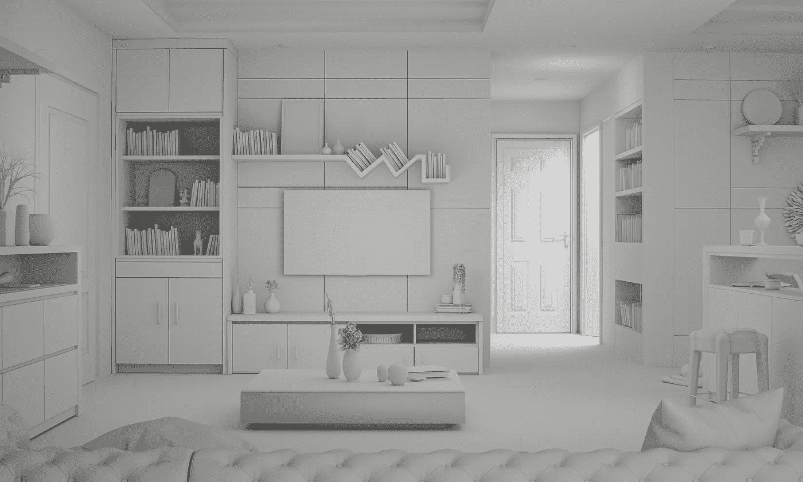

# 了解 NeRFs

> 原文：[`towardsdatascience.com/understanding-nerfs-2a082e13c6eb`](https://towardsdatascience.com/understanding-nerfs-2a082e13c6eb)

## 场景表示的重大突破

 [Cameron R. Wolfe, Ph.D.](https://wolfecameron.medium.com/?source=post_page-----2a082e13c6eb--------------------------------)

·发布于 [Towards Data Science](https://towardsdatascience.com/?source=post_page-----2a082e13c6eb--------------------------------) ·11 min read·2023 年 4 月 28 日

--

(照片由 [nuddle](https://unsplash.com/@nuddle?utm_source=unsplash&utm_medium=referral&utm_content=creditCopyText) 提供，来源于 [Unsplash](https://unsplash.com/s/photos/3d-scene?utm_source=unsplash&utm_medium=referral&utm_content=creditCopyText))

正如我们通过 [DeepSDF](https://cameronrwolfe.substack.com/p/3d-generative-modeling-with-deepsdf) [2] 和 [SRNs](https://cameronrwolfe.substack.com/p/scene-representation-networks) [4] 等方法所见，将 3D 对象和场景编码在前馈神经网络的权重中是一种内存高效的隐式 3D 数据表示，既准确又高分辨率。然而，到目前为止，我们看到的方法还无法以足够的保真度捕捉现实和复杂的场景。相反，离散表示（例如三角网格或体素网格）在内存分配充足的情况下，能产生更准确的表示。

这在 Neural Radiance Fields (NeRFs) [1] 的提议下发生了改变，NeRFs 使用前馈神经网络来建模场景和物体的连续表示。NeRFs 使用的表示称为辐射场，与 [先前](https://cameronrwolfe.substack.com/i/94634004/signed-distance-functions) [提案](https://cameronrwolfe.substack.com/i/94842305/occupancy-functions) 有些不同。特别是，NeRFs 将五维坐标（即空间位置和视角方向）映射到体积密度和视角相关的 RGB 颜色。通过在不同视角和位置上累积这些密度和外观信息，我们可以渲染出*逼真的*新视角场景。

像[SRNs](https://cameronrwolfe.substack.com/p/scene-representation-networks) [4]一样，NeRFs 可以仅使用一组图像（以及它们相关的[相机姿态](https://cameronrwolfe.substack.com/i/97472888/background)）对底层场景进行训练。与之前的方法相比，NeRF 渲染在质量和数量上都更好。值得注意的是，NeRFs 甚至可以捕捉复杂效果，如物体表面的视角依赖反射。通过在前馈神经网络的权重中隐式建模场景，*我们在不需要过多内存成本的情况下实现了离散场景表示的准确性*。

（摘自[1]）

**为什么这篇论文很重要？** 本帖子是我关于 3D 形状和场景深度学习系列的一部分。NeRFs 在这一领域是一个革命性的提案，因为它们能够从任意视角实现极其准确的 3D 重建。NeRFs 生成的场景表示质量非常高，我们将在本帖的其余部分看到这一点。

# 背景

理解 NeRFs 所需的大部分背景概念已在之前的帖子中涵盖，包括：

+   前馈神经网络 [[link](https://cameronrwolfe.substack.com/i/94634004/feed-forward-neural-networks)]

+   表示 3D 对象 [[link](https://cameronrwolfe.substack.com/i/94634004/representing-d-shapes)]

+   离散表示的问题 [[link](https://cameronrwolfe.substack.com/i/94842305/shortcomings-of-d-shape-representations)]

在介绍 NeRFs 的工作原理之前，我们只需要覆盖几个更多的背景概念。

# 位置编码

NeRFs 不是直接将`[x, y, z]`坐标作为输入传递给神经网络，而是将这些坐标转换为高维位置嵌入。我们在之前关于[transformer 架构](https://cameronrwolfe.substack.com/i/76273144/berts-architecture)的帖子中讨论过位置嵌入，因为位置嵌入用于向自注意力模块提供令牌排序和位置的概念。

（摘自[1]）

简而言之，位置嵌入将一个标量数作为输入（例如，坐标值或表示序列中位置的索引），并产生一个高维向量作为输出。我们可以在训练期间学习这些嵌入，或者使用固定函数生成它们。对于 NeRFs，我们使用上面显示的函数，该函数将一个标量`p`作为输入，并产生一个`2L`维的位置编码作为输出。

# 其他内容

在本概述中，我们可能会遇到一些其他（可能）不熟悉的术语。让我们现在快速澄清这些术语。

**端到端训练。** 如果我们说一个神经架构可以“端到端”学习，这仅仅意味着系统的所有组件都是可微分的。因此，当我们为某些数据计算输出并应用我们的损失函数时，我们可以通过整个系统（即，端到端）进行微分，并用梯度下降进行训练！

并非所有系统都可以进行端到端训练。例如，如果我们正在建模表格数据，我们可能会执行特征提取过程（例如，一热编码），然后在这些特征上训练机器学习模型。由于特征提取过程是手工设计的且不可微分，我们不能对系统进行端到端训练！

**朗伯特反射。** 在阅读 NeRFs 之前，这个术语对我完全陌生。朗伯特反射指的是物体表面的反射特性。如果一个物体的表面是哑光的，并且从不同角度看不会改变，我们称这个物体是朗伯特型的。另一方面，一个“光亮”的物体，其反射光线的方式根据观察角度不同而变化，则被称为非朗伯特型的。

# 建模 NeRFs

（来自 [1]）

使用 NeRF 渲染场景视角的高层次过程如下：

1.  使用 [射线行进](https://michaelwalczyk.com/blog-ray-marching.html) 方法生成场景的 3D 点和视角方向样本。

1.  将点和视角方向作为输入提供给前馈神经网络，以生成颜色和密度输出。

1.  执行体积渲染，将场景中的颜色和密度累积到 2D 图像中。

我们现在将详细解释这个过程的每个组件。

**辐射场。** 如前所述，NeRFs 模型是一个 5D 向量值（即，意味着函数输出多个值）函数，称为辐射场。该函数的输入是一个 `[x, y, z]` 空间位置和一个 2D 视角方向。视角方向有两个维度，对应于表示 3D 空间中方向的两个角度；见下文。

3D 空间中的方向可以用两个角度表示。

实际上，视角方向仅表示为一个 3D [笛卡尔](https://en.wikipedia.org/wiki/Cartesian_coordinate_system) [单位向量](https://en.wikipedia.org/wiki/Unit_vector)。

这个函数的输出有两个组成部分：体积密度和颜色。颜色只是一个 [RGB 值](https://en.wikipedia.org/wiki/RGB_color_model)。然而，这个值是视角依赖的，这意味着给定不同的视角方向作为输入，颜色输出可能会变化！这种特性使 NeRFs 能够捕捉反射和其他视角依赖的外观效果。相比之下，体积密度仅依赖于空间位置，捕捉不透明度（即，光线通过该位置时积累的程度）。

NeRF 使用前馈神经网络建模辐射场（来自[1]）

**神经网络。** 在[1]中，我们用前馈神经网络建模辐射场，该网络接收 5D 输入并训练以生成相应的颜色和体积密度作为输出；见上文。然而，请记住，颜色是视角相关的，而体积密度则不是。为了解决这个问题，我们首先将输入的 3D 坐标通过几个前馈层，这些层产生体积密度和特征向量作为输出。然后，将这个特征向量与视角方向连接，并通过一个额外的前馈层来预测视角相关的 RGB 颜色；见下文。

NeRF 的前馈架构。

**体积渲染（简要说明）。** 体积渲染是一个太复杂的话题，无法在这里深入讨论，但我们应该了解以下内容：

1.  它可以从离散数据样本（例如颜色和密度值）生成底层场景的图像。

1.  它是可微的。

对于那些对体积渲染的更多细节感兴趣的人，请查看[这里](https://www.heavy.ai/technical-glossary/volume-rendering)的解释和[1]的第四部分。

**大局观。** NeRF 使用前馈网络生成关于场景几何和外观的相关信息，这些信息沿着众多不同的相机光线（即从特定相机视点向场景中的某个方向移动的 3D 空间中的一条线）进行传递，然后使用渲染将这些信息汇聚成一张 2D 图像。

值得注意的是，这两个组件都是可微的，这意味着我们可以端到端地训练整个系统！给定一组带有对应相机姿态的图像，我们可以通过仅生成/渲染已知视角，并使用[(随机)梯度下降](https://en.wikipedia.org/wiki/Stochastic_gradient_descent)来最小化 NeRF 输出与实际图像之间的误差，来训练 NeRF 以生成新的场景视点；见下文。

（来自[1]）

**一些额外细节。** 我们现在了解了 NeRF 的大部分组件。然而，迄今为止我们描述的方法在[1]中实际上被证明是低效的，并且通常不能很好地表示场景。为了改进模型，我们可以：

1.  用位置嵌入替换空间坐标（包括空间位置和视角方向）。

1.  采用层次采样方法进行体积渲染。

通过使用位置嵌入，我们将前馈网络的输入（即空间位置和视角方向坐标）映射到更高维度。先前的工作表明，与直接使用空间或方向坐标作为输入相比，这种方法使神经网络更好地建模场景的高频（即变化很大/很快）特征[5]。这使得 NeRF 的输出质量大大提高；见下文。

（来自 [1]）

NeRF 使用的分层采样方法使渲染过程更高效，只对可能影响最终渲染结果的地点和视角方向进行采样（并通过前馈神经网络传递）。这样，我们仅在需要的地方评估神经网络，避免在空白或遮挡区域浪费计算。

# 给我们展示一些结果吧！

NeRFs 被训练为一次仅表示一个场景，并在多个数据集上进行评估，这些数据集包括合成和真实对象。

（来自 [1]）

如上表所示，NeRFs 显著超越了 [SRNs](https://cameronrwolfe.substack.com/p/scene-representation-networks) [4] 和 [LLFF](https://cameronrwolfe.substack.com/p/local-light-field-fusion) [6] 等替代方法。除了定量结果之外，与其他方法的输出进行视觉对比也非常有用。首先，我们可以立即看出，使用位置编码和以视角依赖的方式建模颜色是非常重要的；见下文。

（来自 [1]）

我们会立即注意到的一个改进是，NeRFs — 因为它们以视角依赖的方式建模颜色 — 能够捕捉场景中的复杂反射（即[非朗伯特特征](https://en.wikipedia.org/wiki/Lambertian_reflectance)）和视角依赖的模式。此外，NeRFs 还能够以惊人的精度建模底层几何体的复杂方面；见下文。

（来自 [1]）

NeRF 场景表示的质量在以视频形式查看时最为明显。正如下面的视频所示，NeRFs 以令人印象深刻的准确性和一致性建模了底层场景，并在不同视角之间保持一致。

要获取更多可以使用 NeRF 生成的逼真场景视角的示例，我强烈建议查看[这里](https://www.matthewtancik.com/nerf)链接的项目网站！

# 主要结论

正如我们在评估中所见，NeRFs 在场景表示质量上取得了巨大的突破。因此，这项技术在人工智能和计算机视觉研究社区中获得了极大的关注。由于其场景表示的质量，NeRF 的潜在应用（例如虚拟现实、机器人等）几乎是无穷无尽的。主要结论列在下方。

（来自 [1]）

**NeRFs 捕捉复杂细节。** 使用 NeRFs，我们能够捕捉场景中的细粒度细节，例如船只中的装配材料；见上文。除了几何细节，NeRFs 还能处理非朗伯特效应（即反射和基于视角的颜色变化），因为它们以视角依赖的方式建模颜色。

**我们需要智能采样。** 到目前为止，我们见过的所有 3D 场景建模方法都使用神经网络在 3D 空间上建模一个函数。这些神经网络通常会在所考虑的空间体积内的每个空间位置和方向上进行评估，如果处理不当，可能会非常昂贵。对于 NeRF，我们使用一种分层采样方法，仅评估可能影响最终渲染图像的区域，这大大提高了采样效率。类似的方法也被先前的工作采用；例如， [ONets](https://cameronrwolfe.substack.com/p/shape-reconstruction-with-onets) [3] 使用基于 [octree](https://en.wikipedia.org/wiki/Octree) 的 [分层采样方法](https://cameronrwolfe.substack.com/i/94842305/occupancy-networks) 更高效地提取对象表示。

**位置嵌入效果很好。** 到目前为止，我们见过的大多数场景表示方法都直接将坐标值作为输入传递给前馈神经网络。通过 NeRF，我们发现将这些坐标进行位置嵌入要好得多。特别是，将坐标映射到更高维度似乎允许神经网络捕捉场景几何和外观的高频变化，这使得结果场景渲染更加准确且视角一致。

**仍然节省内存。** NeRF 隐式地建模了基础场景的连续表示。这种表示可以在任意精度下进行评估，并且具有固定的内存成本——我们只需存储神经网络的参数！因此，NeRF 可以在不占用大量内存的情况下提供准确的高分辨率场景表示。

> “至关重要的是，我们的方法克服了在高分辨率下建模复杂场景时离散体素网格的高昂存储成本。” *— 来源于 [1]*

**局限性。** 尽管 NeRF 在先进技术方面取得了显著进展，但它们并不完美——表示质量仍有改进空间。然而，NeRF 的主要局限性在于它们每次只能建模一个场景，并且训练成本高（即，每个场景在单个 GPU 上需要 2 天）。未来在这一领域的进展如何找到更高效的生成 NeRF 质量场景表示的方法将会非常有趣。

# 结束语

非常感谢你阅读这篇文章。我是 [Cameron R. Wolfe](https://cameronrwolfe.me/)，[Rebuy](https://www.rebuyengine.com/) 的人工智能总监，也是莱斯大学的博士生。我研究深度学习的经验和理论基础。你也可以查看我在 medium 上的 [其他文章](https://medium.com/@wolfecameron)！如果你喜欢这篇文章，请关注我的 [twitter](https://twitter.com/cwolferesearch) 或订阅我的 [Deep (Learning) Focus 新闻通讯](https://cameronrwolfe.substack.com/)，在这里我通过对该领域流行论文的易懂概述，帮助读者深入理解深度学习研究中的主题。

# 参考文献

[1] Mildenhall, Ben 等人。“Nerf：将场景表示为用于视图合成的神经辐射场。” *ACM 通讯* 65.1 (2021): 99–106。

[2] Park, Jeong Joon 等人。“Deepsdf：学习用于形状表示的连续符号距离函数。” *IEEE/CVF 计算机视觉与模式识别会议论文集*。2019 年。

[3] Mescheder, Lars 等人。“占用网络：在函数空间中学习 3d 重建。” *IEEE/CVF 计算机视觉与模式识别会议论文集*。2019 年。

[4] Sitzmann, Vincent、Michael Zollhöfer 和 Gordon Wetzstein。“场景表示网络：连续的 3d 结构感知神经场景表示。” *神经信息处理系统进展* 32 (2019)。

[5] Rahaman, Nasim 等人。“神经网络的谱偏差。” *国际机器学习会议*。PMLR，2019 年。

[6] Mildenhall, Ben 等人。“局部光场融合：带有规定性采样指南的实用视图合成。” *ACM 图形学交易 (TOG)* 38.4 (2019): 1–14。
