# 理解机器学习中的噪声数据和不确定性

> 原文：[`towardsdatascience.com/understanding-noisy-data-and-uncertainty-in-machine-learning-4a2995a84198`](https://towardsdatascience.com/understanding-noisy-data-and-uncertainty-in-machine-learning-4a2995a84198)

## 你的机器学习模型无法正常工作的真正原因

[](https://harrisonfhoffman.medium.com/?source=post_page-----4a2995a84198--------------------------------)[](https://towardsdatascience.com/?source=post_page-----4a2995a84198--------------------------------) [Harrison Hoffman](https://harrisonfhoffman.medium.com/?source=post_page-----4a2995a84198--------------------------------)

·发表于 [Towards Data Science](https://towardsdatascience.com/?source=post_page-----4a2995a84198--------------------------------) ·阅读时间：9 分钟·2023 年 1 月 23 日

--

人工智能和机器学习领域比以往任何时候都更火热。随着像 Chat GPT 和 Stable Diffusion 这样的模型席卷全球，人工智能和机器学习的炒作重新回归并吸引了[大众](https://www.google.com/search?tbm=vid&sxsrf=AJOqlzXI5TC9wmd1MTAKaqmrRY_q6b0k3Q%3A1674266462280&q=chatgpt&spell=1&sa=X&ved=2ahUKEwiz-_jNyNf8AhUZk2oFHY1kCZoQBSgAegQIERAB&biw=1185&bih=714&dpr=2)。面对这些炒作，我们必须提醒自己，机器学习成功的关键在于高质量数据。

在缺乏优质训练数据的情况下，监督机器学习模型没有任何用处。不幸的是，大多数现实世界的数据科学项目失败是因为在数据源质量完全了解之前对模型性能有不切实际的期望。本文将尝试提供对噪声数据的直观理解以及为什么机器学习模型无法有效工作的原因。我们将探讨监督学习和确定性函数的本质、不同类型的模型不确定性，并讨论减少这种不确定性和管理期望的方法。

# 监督学习表述

从根本上讲，监督机器学习就是函数近似。我们向模型提供一些输入（X）和目标（y），并期望模型通过优化目标函数来近似（或学习）将 X 映射到 y 的函数。更正式地说，监督学习的表述大致如下：

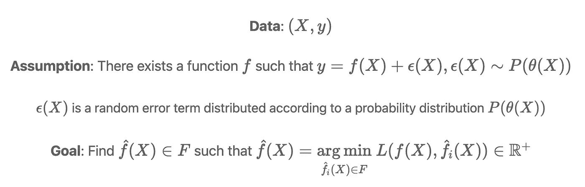

监督学习的简要表述。图像来源：作者。

给定一个数据集（X，y），我们假设 X 和 y 之间的关系至少部分是确定性的。随机误差项 epsilon 的方差在函数 f(X)的确定性水平中发挥了至关重要的作用。epsilon 的方差越高，X 和 y 之间的关系就越随机，越不容易预测。与监督学习的常见教学方式相反，值得注意的是，epsilon 可以（并且通常是）X 的函数。这意味着噪声量和相应的模型不确定性在 X 的不同区域中有所不同。

为了更好地理解确定性和随机误差的作用，我们将深入研究确定性函数的性质，检查它们的特征以及在机器学习中的影响。

# 确定性函数

确定性函数的输出完全由输入指定。这意味着对于定义域中的每个输入，函数都输出一个唯一的量。这些是我们从第一门代数课程开始就见过的大多数函数：

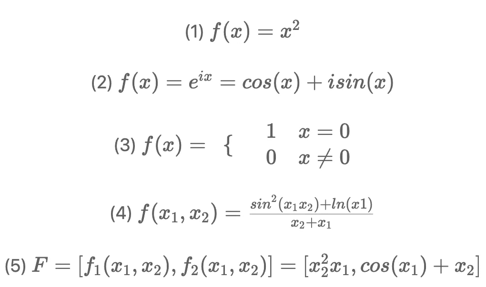

确定性函数示例。图像由作者提供。

在上述每个示例中，传递到函数中的每个输入都产生一个单一的输出。注意，这并不意味着函数对每个可能的数字都定义。例如，函数（4）仅在 x1 > 0 且 x1 和 x2 的和不为零时定义。

从视觉上看，在一维中，确定性函数通过[“垂直线测试”](https://en.wikipedia.org/wiki/Vertical_line_test)——这意味着如果我们在定义域中的任何点画一条垂直线，它最多会与函数相交一次：

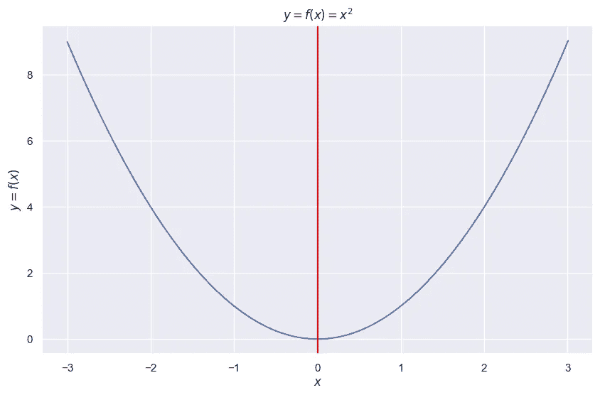

确定性函数的垂直线测试。图像由作者提供。

与此相比，纯非确定性函数则不同。这些函数对于单一输入可能有多个输出。

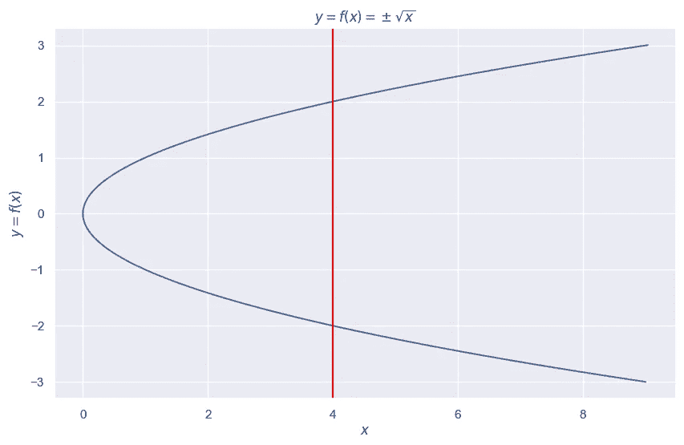

非确定性函数的垂直线测试。图像由作者提供。

在上图中，垂直线 x = 4 穿过曲线的-2 和 2 处。如果有人问我们 f(4)是什么，我们必须说是-2 或 2。在最极端的情况下，非确定性函数可能会对单一输入输出无限多个值。

尽管上述非确定性函数在可视化和量化上很简单，但机器学习模型永远无法学习它。为了解释这一点，假设我们按如下方式对函数进行采样：

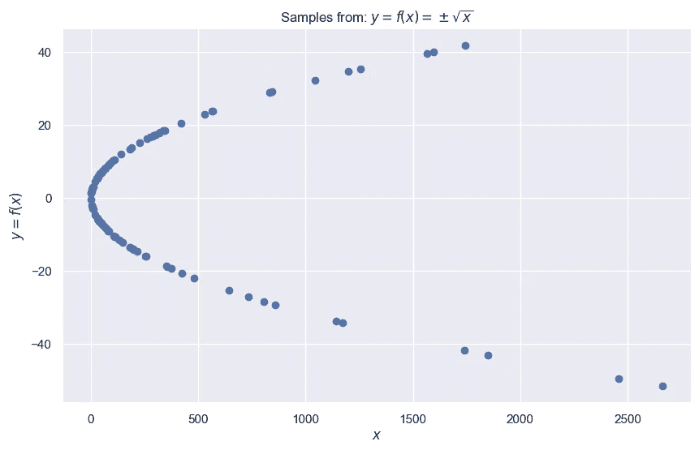

非确定性函数的样本。图像由作者提供。

我们将使用上述样本作为训练集，并拟合一个决策树回归器：

```py
import numpy as np
from sklearn.tree import DecisionTreeRegressor

# Create the training set for the function y = +- sqrt(x)
y_train = np.random.normal(0, 20, 100)
x_train = y_train**2

# Fit a decision tree regressor to the training data
model = DecisionTreeRegressor()
model.fit(x_train.reshape(-1, 1), y_train)

# Create the test set for the function y = +- sqrt(x)
y_test = np.random.normal(0, 20, 100)
x_test = y_test**2

# Make predictions on the test set
preds = model.predict(x_test.reshape(-1, 1))
```

我们可以可视化模型在测试集上的表现：

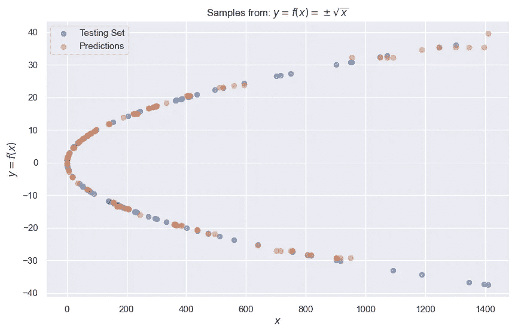

决策树回归器在测试集上的预测叠加。图像由作者提供。

决策树在测试集上本质上是在猜测。由于领域中的每个非零输入映射到两个不同的值，机器学习模型无法知道在测试集上预测哪个值。由于基础函数的性质，训练数据中的噪声会导致任何机器学习模型做出具有高不确定性的预测。

# 不确定性来源

现在我们已经了解了确定性和非确定性/随机函数之间的区别，让我们探讨从学习这些函数中可能产生的不确定性类型。

## 数据（随机）不确定性

数据的不确定性，也称为随机不确定性，源于观察数据集的固有复杂性。在分类设置中，这通常表现为重叠的类别。例如，以下散点图描绘了二维空间中重叠的类别：

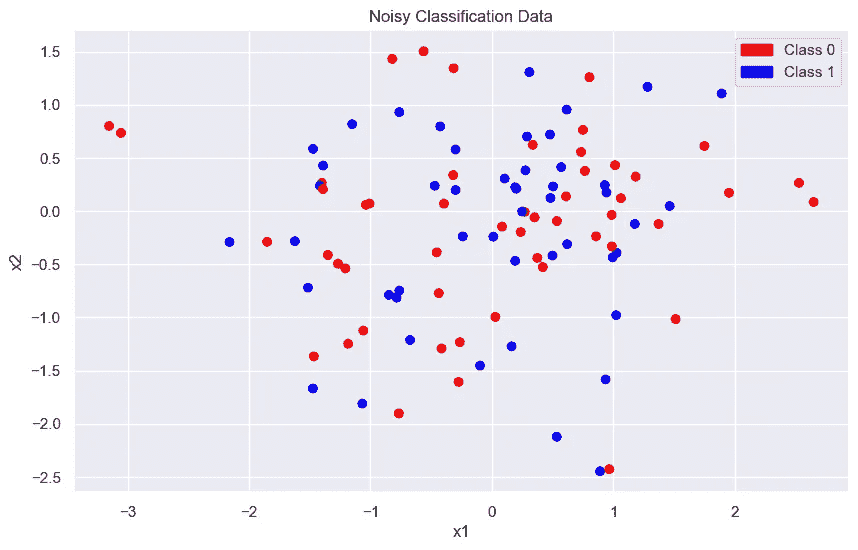

带有重叠类别的分类数据。图片来源：作者。

对于 (x1, x2) 邻域中的大多数观测值，没有明显的方法来区分两个类别。虽然确实存在一个足够复杂的分类器可以完美分类上述数据集中的例子，但同样的分类器在测试集上的表现可能不会比随机猜测更好。

在回归设置中，数据不确定性通常源于基础数据中的附加噪声。数据不确定性会出现在类似于以下数据集的情况中：

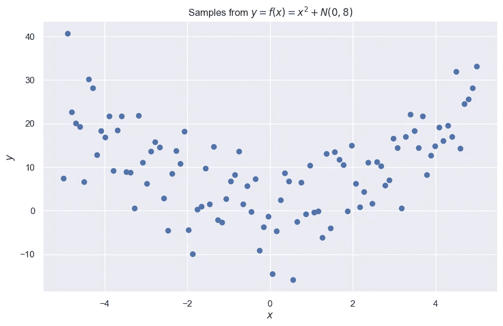

噪声回归数据。图片来源：作者。

在这种情况下，x 是唯一考虑的特征，对于 x 的任何邻域，y 都可能取很多不同的值。例如，如果我们基于数据来预测 x = 0 时 y 的值，没有明显的答案显现出来。一般来说，附加噪声分布的方差越大，数据不确定性就会越高。

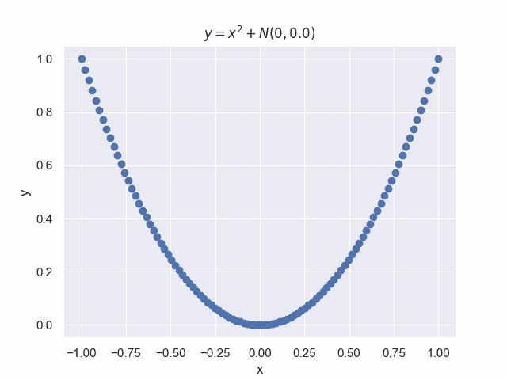

带有附加噪声的二次函数样本。图片来源：作者。

如前所述，噪声水平和数据不确定性在领域的不同区域中常常有所不同。数据不确定性通常在领域的边缘区域较高，如下所示：

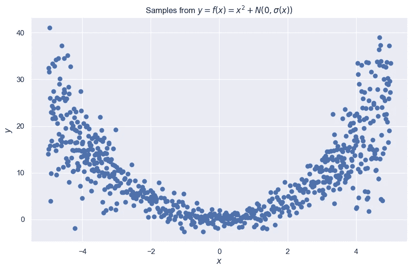

噪声和数据不确定性随 x 变化。附加噪声项的方差是 x 的函数。图片来源：作者。

数据的不确定性通常表现为模型中遗漏了关键特征。为了说明这一点，考虑以下数据集，我们希望使用 x1 来预测 y：

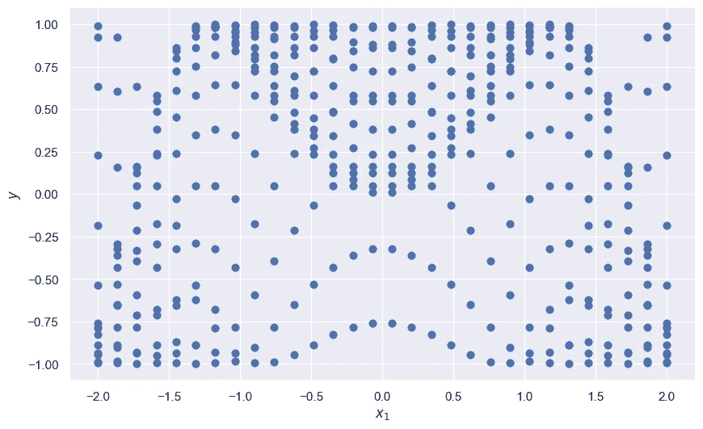

像愤怒的青蛙一样的噪声数据。图片来源：作者。

如果仅使用 x1 作为特征来预测 y，没有任何机器学习模型能够表现良好。例如，当 x1 = -0.49 时，在这个数据集中 y 取 14 个不同的值。在没有其他特征的情况下，预测 y 看起来无望。然而，上述数据集实际上是以下函数的一个样本：

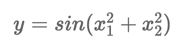

一个方程。图像由作者提供。

如果我们从 x2 取样，并在三维中可视化 x1、x2 和 y，则会出现一个清晰的表面：

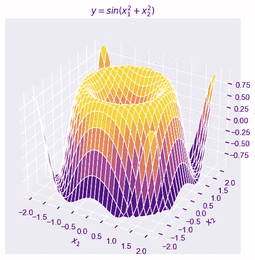

一个三维表面。图像由作者提供。

互动表面。图像由作者提供。

x1 和 y 之间的关系噪声较大，任何试图学习这种关系的模型都会导致高数据不确定性。然而，(x1, x2) 和 y 之间的关系没有噪声，因为它完全由一个封闭形式的方程决定。只要有足够的训练数据，足够非线性的模型可以学习这种关系，从而没有数据不确定性。

许多金融应用面临数据不确定性，因为许多未观察到的人类行为会影响市场。例如，无数因素影响一个人是否会违约。即使两个贷款接收者有相同的信用档案并在特征空间中看起来相同（大多数金融机构有大量的特征），仍然有可能因为生活紧急情况而导致接收者 A 违约，而接收者 B 没有违约。除非违约模型接触到预测生活紧急情况的数据，否则这些情况下总会存在数据不确定性。

## 知识（认知）不确定性

知识（认知）不确定性来自于在领域的某些区域稀疏采样的数据。考虑以下数据集，我们希望建模 x 和 y 之间的关系：

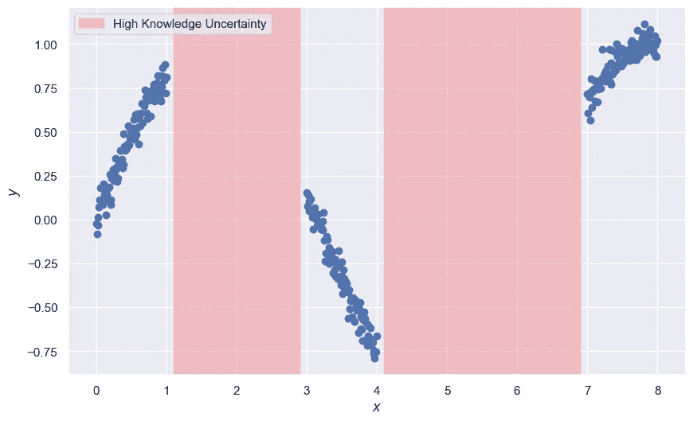

高知识不确定性。图像由作者提供。

当 x 在 1 到 3 之间或在 4 到 7 之间取值时，这个数据集没有关于 y 的信息。机器学习模型在预测这些区域的 y 值时不得不做出盲目猜测。幸运的是，与数据不确定性不同，知识不确定性可以通过采样缺失数据的区域来减少。如果我们对领域进行完全采样，x 和 y 之间的关系将变得清晰：

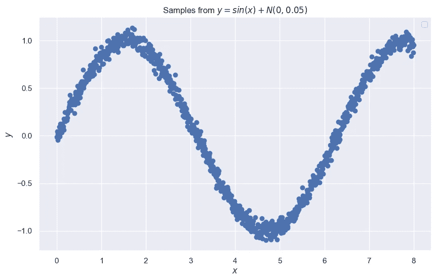

通过采样消除知识不确定性。图像由作者提供。

知识不确定性在实际应用中很常见，因为大多数数据集不是从均匀分布中采样的，导致领域中的稀疏区域。一般来说，领域采样越均匀，建模过程中的知识不确定性就会越小。

# 处理噪声数据和不确定性的方法

现在我们对噪声数据和不确定性的性质有了一些直觉，让我们探讨一些可以采取的实际措施来应对这个问题。

## 1\. 停止尝试寻找更好的模型

快速失败并知道何时转移是无价的数据科学技能。我们生活在一个几乎对任何机器学习问题都有最先进、高性能模型的时代。任何在模型选择或超参数调整过程中遇到次优结果的数据科学家应该寻求其他地方的性能提升。换句话说，模型可能并不需要改进，数据才需要。

## **2\. 获取更多数据**

正如我们之前所见，表现不佳的模型通常是由于数据不完整。即使是一个看似不重要的特征，在与更多特征一起使用时也可以提供显著的预测能力。因此，数据科学家必须确保他们对问题及成功建模所需的数据源有全面的理解。获取正确的数据和工程化良好的特征可以说是数据科学家工作中最困难但最关键的部分。数据科学家应该能够与利益相关者一起权衡获取更多数据的成本和收益，因为这最终是带来最大商业价值的地方。

## 3\. 量化模型预测的不确定性

对于那些噪声数据不可避免的高风险机器学习问题，模型量化预测的不确定性通常是有价值的。经过校准的分类器提供的预测概率的不确定性估计比预测类别可能更有用。在回归中，像[分位数回归](https://en.wikipedia.org/wiki/Quantile_regression)、[符合预测](https://en.wikipedia.org/wiki/Conformal_prediction)、贝叶斯神经网络和[自然梯度提升](https://arxiv.org/pdf/1910.03225v1.pdf)等方法可以用于生成不确定性估计。简而言之，拥有一个在做出预测时能够说“我不知道”的模型可以非常有价值。

## 4\. 管理期望

作为数据科学家，重要的是要记住机器学习是实现特定目标的工具，应该在清楚理解基本业务问题的情况下使用。全面理解问题以及机器学习在解决问题中的角色，可以更准确地设定模型性能的期望，从而最终更有效地使用这一工具。这将有助于开发出一个针对业务特定需求的机器学习模型，提供最佳结果。机器学习是一种手段。通常情况下，不需要一个完美的模型来解决问题，但正确利用不完美的模型则是必要的。

*成为会员：* [*https://harrisonfhoffman.medium.com/membership*](https://harrisonfhoffman.medium.com/membership)

*喜欢我的文章？请给我买杯咖啡：* [*https://www.buymeacoffee.com/HarrisonfhU*](https://www.buymeacoffee.com/HarrisonfhU)

# 参考文献

1.  *使用 Catboost 估计不确定性 —* [*https://catboost.ai/en/docs/references/uncertainty*](https://catboost.ai/en/docs/references/uncertainty)
