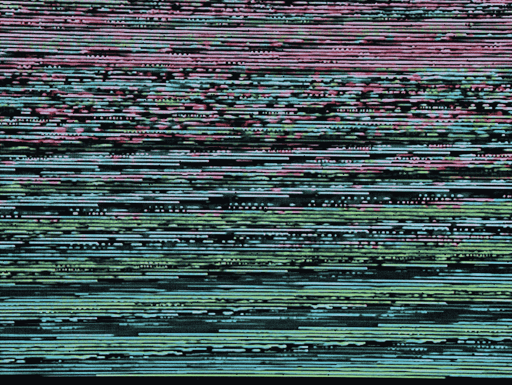

# 理解预测性维护——数据采集与信号去噪

> 原文：[`towardsdatascience.com/understanding-predictive-maintenance-data-acquisition-and-signal-denoising-0309b1b103a7?source=collection_archive---------9-----------------------#2023-11-08`](https://towardsdatascience.com/understanding-predictive-maintenance-data-acquisition-and-signal-denoising-0309b1b103a7?source=collection_archive---------9-----------------------#2023-11-08)

 [Marcin Stasko](https://marcin-staskopl.medium.com/?source=post_page-----0309b1b103a7--------------------------------)

·

[关注](https://medium.com/m/signin?actionUrl=https%3A%2F%2Fmedium.com%2F_%2Fsubscribe%2Fuser%2Fd8736adba55&operation=register&redirect=https%3A%2F%2Ftowardsdatascience.com%2Funderstanding-predictive-maintenance-data-acquisition-and-signal-denoising-0309b1b103a7&user=Marcin+Stasko&userId=d8736adba55&source=post_page-d8736adba55----0309b1b103a7---------------------post_header-----------) 发表在[Towards Data Science](https://towardsdatascience.com/?source=post_page-----0309b1b103a7--------------------------------) · 10 分钟阅读 · 2023 年 11 月 8 日 

--

照片由[Michael Dziedzic](https://unsplash.com/@lazycreekimages?utm_source=medium&utm_medium=referral)拍摄，发布在[Unsplash](https://unsplash.com/?utm_source=medium&utm_medium=referral)

# 文章目的

我想开始一系列文章，给你提供实践经验，以便你更容易入门信号处理。在这篇文章中，我们将集中于获取数据和清理信号。如果你发现某些部分有趣，我会考虑深入探讨。在这篇文章的下一部分，我为你准备了一些实际的练习。你可以使用我准备的`代码`进行自己的实验，通过实践学习。

# 预测性维护的数据科学

数据科学中的预测性维护就像是为机器提供一种超智能的保养方式。我们不再在机器坏了之后才修理，而是使用先进的计算机程序和历史数据来预测何时可能会出现问题。这有点像是为机器提供了一个水晶球！通过这样做，公司可以节省开支，让重要的机器工作更久。这个方法包括密切关注机器、实时收集数据，并使用聪明的计算机程序来告诉我们何时进行维护。因此，我们可以在问题发生之前修复它，就像是给机器进行健康检查，防止它们生病！
