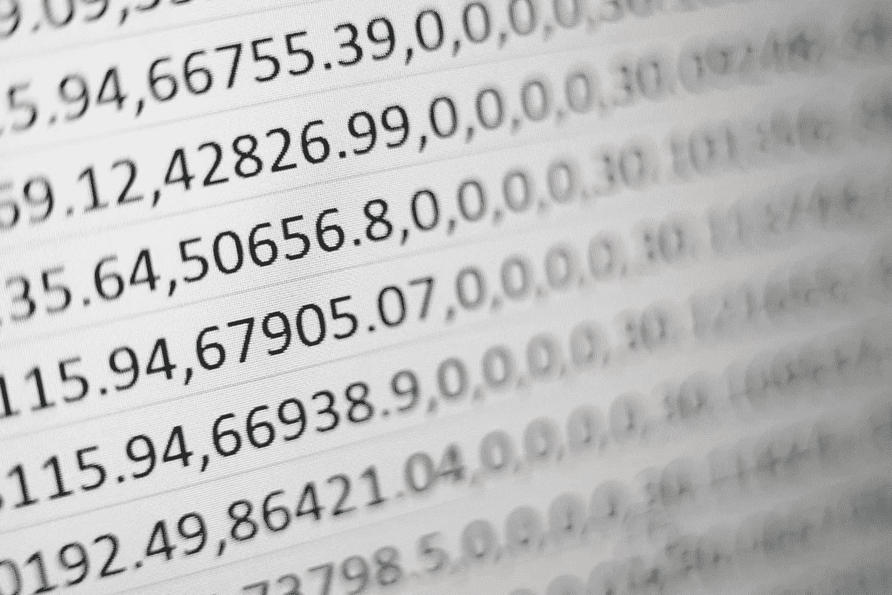
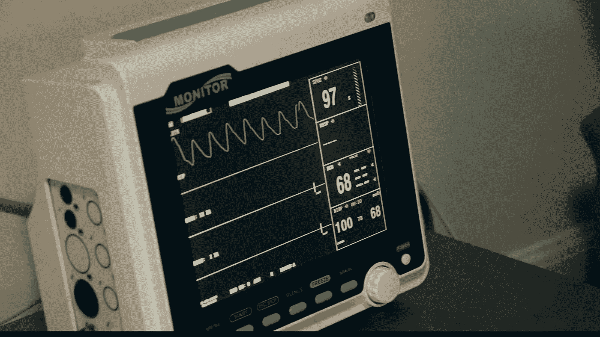
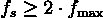
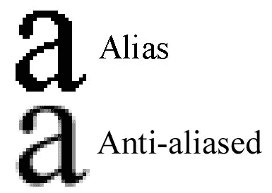
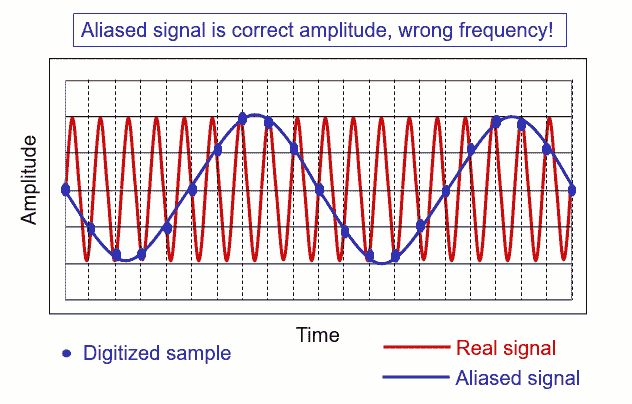
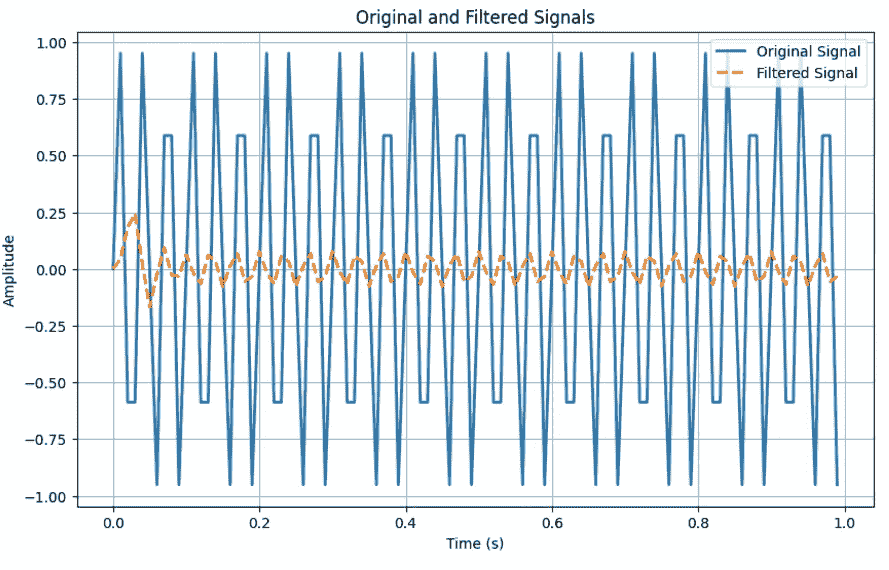
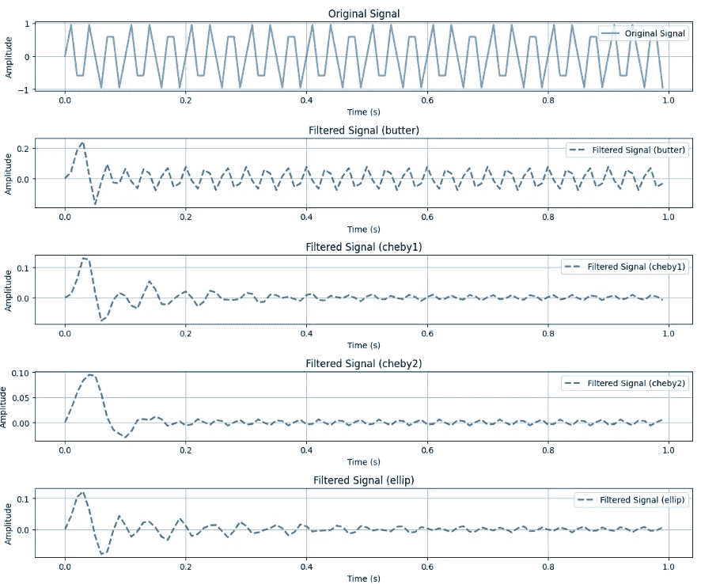
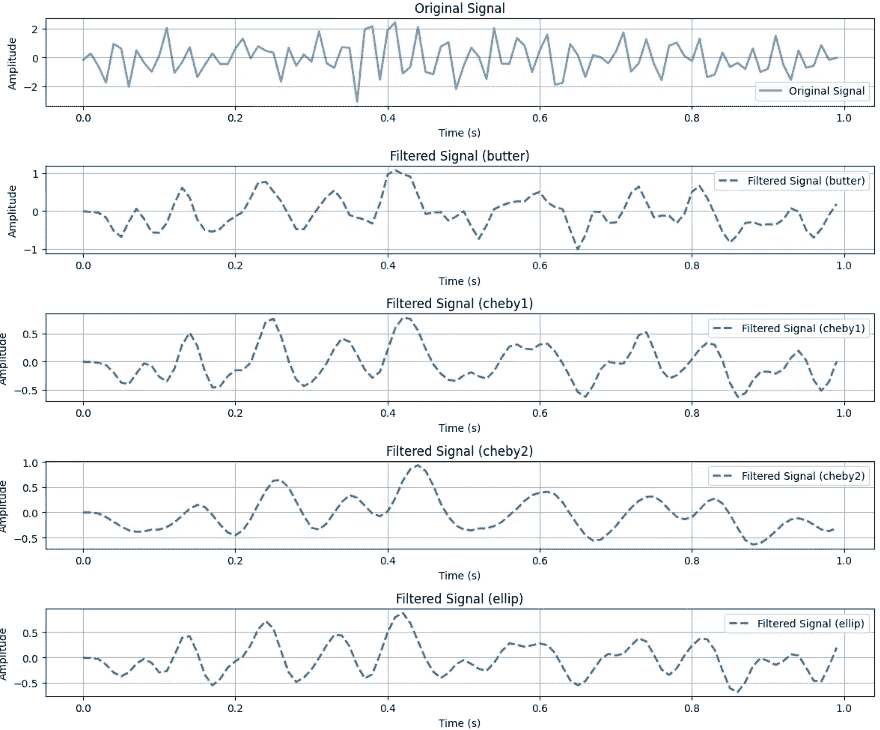
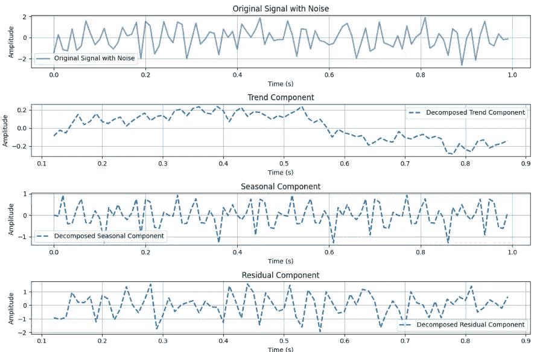
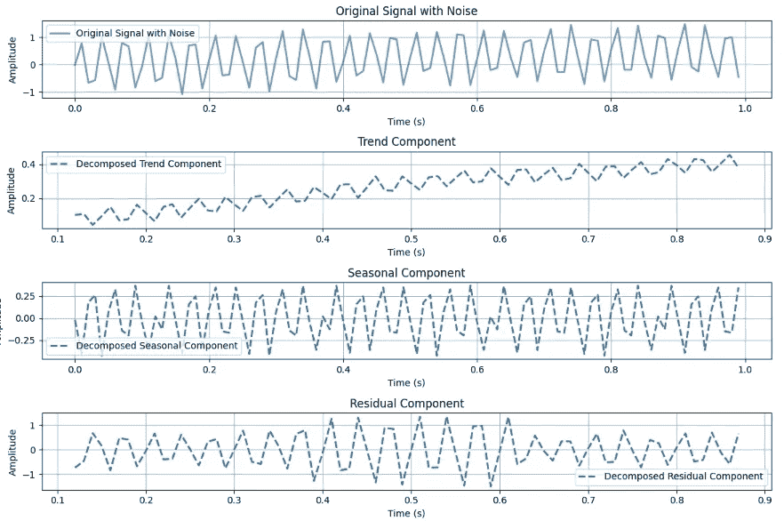

# 理解预测性维护 — 数据采集与信号去噪

> 原文：[`towardsdatascience.com/understanding-predictive-maintenance-data-acquisition-and-signal-denoising-0309b1b103a7`](https://towardsdatascience.com/understanding-predictive-maintenance-data-acquisition-and-signal-denoising-0309b1b103a7)

[](https://marcin-staskopl.medium.com/?source=post_page-----0309b1b103a7--------------------------------)[](https://towardsdatascience.com/?source=post_page-----0309b1b103a7--------------------------------) [Marcin Stasko](https://marcin-staskopl.medium.com/?source=post_page-----0309b1b103a7--------------------------------)

·发表于 [Towards Data Science](https://towardsdatascience.com/?source=post_page-----0309b1b103a7--------------------------------) ·阅读时长 10 分钟·2023 年 11 月 8 日

--


图片由 [Michael Dziedzic](https://unsplash.com/@lazycreekimages?utm_source=medium&utm_medium=referral) 提供，来源于 [Unsplash](https://unsplash.com/?utm_source=medium&utm_medium=referral)

# 文章目的

我想开始一系列文章，给你提供预测性维护的实际操作经验，并让你更容易入门信号处理。在这篇文章中，我们将重点关注数据采集和信号清理。如果你对某些部分感兴趣，我会考虑进一步详细讲解。在这篇文章的下一部分，我为你准备了一些实际练习。你可以使用我准备的代码进行自己的实验，通过实践来学习。

# 预测性维护的数据科学

数据科学中的预测性维护就像是为机器提供一种超级智能的护理方式。我们不是在机器坏了之后才进行修理，而是利用高级计算机程序和过去的数据来预测机器可能出现的问题。这有点像为机器提供了一个水晶球！通过这种方式，公司可以节省资金并延长重要机器的使用寿命。这种方法包括实时监控机器，收集数据，并使用智能计算机程序来告诉我们何时需要进行维护。因此，我们可以在问题出现之前进行修复，就像是在机器生病之前为其进行健康检查！

# **数据采集与处理**



图片由 [Mika Baumeister](https://unsplash.com/@mbaumi?utm_source=medium&utm_medium=referral) 提供，来源于 [Unsplash](https://unsplash.com/?utm_source=medium&utm_medium=referral)

一切都始于数据。我们需要深入了解一些通信理论原则，如 Shannon–Hartley 定理和 Nyquist 率，以确保传感器数据的准确和高效传输。

# Shannon–Hartley 定理

Shannon–Hartley 定理就像是关于通过通信频道传输多少信息的规则手册。它告诉我们频道的宽度，即频道能处理的数据量，至关重要。因此，在选择用于监控机器或传感器的设备或工具之前，我们需要确保频道足够宽，以处理我们想要的所有数据而不会丧失质量。

为了更好地利用频道，我们可以聪明地使用频道。这就像是找到最佳的方式来安排数据，以便我们能最有效地利用频道空间。这被称为优化频谱效率。因此，在选择传感器时，我们应该选择那些在可用频道空间内表现优秀的传感器。

## 定理应用

**评估频道带宽** 在选择传感器之前，仔细检查通信频道可以处理多少数据。如果频道宽度不足，考虑升级频道或寻找需要较少带宽的传感器。

**优化传感器选择**

选择那些在使用可用频道空间方面效率高的传感器。一些传感器可能在传输数据时更有效，不占用频道过多的空间。

# **Nyquist 率**



图片由 [Jair Lázaro](https://unsplash.com/@jairlazarofuentes?utm_source=medium&utm_medium=referral) 拍摄，来源于 [Unsplash](https://unsplash.com/?utm_source=medium&utm_medium=referral)

Nyquist 率就像是我们应该用传感器收集数据的速度限制。如果我们收集数据的速度太慢，我们可能会错过关于事物运作的重要细节。因此，当我们设置系统来监控事物时，需要确保我们以能够准确展示发生情况的速度收集数据，而不会造成混淆。

我们必须确保传感器以遵循 Nyquist 率的速度收集数据。这意味着数据收集速度要足够快，以捕捉所有重要细节，而不会遗漏任何重要信息。



Nyquist 定律

确保**传感器能够以至少是最快变化（***fmax***) 两倍的速度（***fs***) 测量**。这可以防止遗漏重要细节，并确保测量的准确性。选择速度与所需测量匹配的传感器。

## **Nyquist 的超级英雄——抗混叠滤波器**

为了避免混淆或错误，我们使用像抗锯齿滤波器这样的特殊滤波器。这些滤波器帮助我们的传感器专注于信息的重要部分，并去除任何额外的噪音或混淆的细节。这就像使用放大镜来清晰地查看事物一样。因此，当我们使用传感器监控机器时，我们应该确保这些滤波器到位，以便获得最佳和最准确的信息。那么，什么是锯齿效应和抗锯齿呢？

## 锯齿效应



锯齿效应和抗锯齿的比较 来源：[`www.zilliondesigns.com/`](https://www.zilliondesigns.com/)

想象一下你正试图拍摄一辆快速移动的汽车。然而，你的相机每秒只拍摄一张照片。如果汽车移动得非常快，当你拍摄下一张照片时，它可能已经在完全不同的位置了。因此，当你查看这些照片时，汽车看起来像是处于奇怪的位置，因为你错过了它在每张照片之间的移动。这种事物看起来与实际情况不同的奇怪效果被称为锯齿效应。

## 抗锯齿

现在，想象你有一台神奇的相机，可以非常快速地拍摄大量照片。它不是每秒拍一张，而是在同一秒内拍摄许多张照片，捕捉汽车移动的每一个细节。当你查看这些照片时，你会看到汽车移动的平滑而准确的表现。确保捕捉到所有细节并避免锯齿效应的过程称为抗锯齿。

简单来说，抗锯齿就像拥有一台超级快速的相机，以确保事物看起来如实，无任何奇怪的失真或模糊。它有助于创建清晰而准确的图像，尤其是在事物快速移动或变化迅速时。

好的，但为什么在信号处理中这很重要？这些动画将向你展示我们如何使用它来去噪实际信号，并捕捉这些信号的“核心”。



信号处理中的工作原理 来源：siemens.com

# 实践经验


[shraga kopstein](https://unsplash.com/@sfkopstein?utm_source=medium&utm_medium=referral) 的照片，来源于 [Unsplash](https://unsplash.com/?utm_source=medium&utm_medium=referral)

让我们深入代码，动手实践吧！首先，我们将生成一个示例信号，并设置一个绘图函数用于可视化。在这个例子中，我们将使用基本的正弦波，并尝试调整其参数。

```py
import numpy as np
import matplotlib.pyplot as plt

def generate_signal(frequency, duration, sampling_rate):
    t = np.linspace(0, duration, int(sampling_rate * duration), endpoint=False)
    signal = np.sin(2 * np.pi * frequency * t)
    return t, signal

def plot_signals(t, original_signal, filtered_signal, title):
    plt.figure(figsize=(10, 6))
    plt.plot(t, original_signal, label='Original Signal', linewidth=2)
    plt.plot(t, filtered_signal, label='Filtered Signal', linestyle='dashed', linewidth=2)
    plt.title(title)
    plt.xlabel('Time (s)')
    plt.ylabel('Amplitude')
    plt.legend()
    plt.grid(True)
    plt.show()
```

接下来，我们将创建一个使用简单滤波器（如巴特沃斯滤波器）进行信号抗锯齿的示例。

将巴特沃斯滤波器视为信号中不同频率的门控器。它允许低频通过，同时减少高频。调整如滤波器阶数和截止频率等参数可以微调其选择性。这有助于我们防止诸如混叠等问题，确保信号的更清晰表示。让我们在代码中查看实际效果！

```py
from scipy.signal import butter, lfilter

def apply_antialiasing(signal, cutoff_frequency, sampling_rate, order=4):
    # Design a low-pass Butterworth filter (maximal flat magnitute)
    nyquist = 0.5 * sampling_rate
    # Nyquist law in practice
    normal_cutoff = cutoff_frequency / nyquist
    b, a = butter(order, normal_cutoff, btype='low', analog=False)

    # Apply the filter to the signal
    filtered_signal = lfilter(b, a, signal)
    return filtered_signal
```

让我们进行一次实验

```py
 frequency = 30.0          # Frequency of the signal
duration = 1.0            # Duration of the signal in seconds
sampling_rate = 100.0     # Sampling rate in Hz
cutoff_frequency = 20.0   # Cutoff frequency of the anti-aliasing filter

# Generate a signal
t, original_signal = generate_signal(frequency, duration, sampling_rate)

# Apply anti-aliasing filter
filtered_signal = apply_antialiasing(original_signal, cutoff_frequency, sampling_rate)

# Plot the original and filtered signals
plot_signals(t, original_signal, filtered_signal, 'Original and Filtered Signals')
```



这个实验的输出

当涉及到采样时，我们的纯正弦波看起来并不像我们期望的那样“美丽”。某些部分被截断了，这是由于采样过程造成的。

我鼓励你复制这段代码并尝试调整参数。这非常有趣！

我们也可以尝试不同类型的滤波器。

```py
from scipy.signal import butter, cheby1, cheby2, ellip, lfilter
def apply_filter(signal, cutoff_frequency, sampling_rate, filter_type='butter', order=4):
    nyquist = 0.5 * sampling_rate
    normal_cutoff = cutoff_frequency / nyquist

    if filter_type == 'butter':
        b, a = butter(order, normal_cutoff, btype='low', analog=False)
    elif filter_type == 'cheby1':
        b, a = cheby1(order, 5, normal_cutoff, btype='low', analog=False)
    elif filter_type == 'cheby2':
        b, a = cheby2(order, 40, normal_cutoff, btype='low', analog=False)
    elif filter_type == 'ellip':
        b, a = ellip(order, 5, 40, normal_cutoff, btype='low', analog=False)

    filtered_signal = lfilter(b, a, signal)
    return filtered_signal
```

我们将稍微修改我们的绘图函数，以便将所有结果汇集在一个图中。

```py
 def plot_signals_subplots(t, original_signal, filtered_signals, titles):
    num_filters = len(filtered_signals)

    fig, axes = plt.subplots(num_filters + 1, 1, figsize=(12, 2 * (num_filters + 1)))

    # Plot original signal
    axes[0].plot(t, original_signal, label='Original Signal', linewidth=2, alpha=0.7)
    axes[0].set_title('Original Signal')
    axes[0].set_xlabel('Time (s)')
    axes[0].set_ylabel('Amplitude')
    axes[0].legend()
    axes[0].grid(True)

    # Plot filtered signals
    for i, (filtered_signal, filter_type) in enumerate(zip(filtered_signals, filter_types)):
        label = f'Filtered Signal ({filter_type})'
        axes[i + 1].plot(t, filtered_signal, label=label, linestyle='dashed', linewidth=2)
        axes[i + 1].set_title(f'Filtered Signal ({filter_type})')
        axes[i + 1].set_xlabel('Time (s)')
        axes[i + 1].set_ylabel('Amplitude')
        axes[i + 1].legend()
        axes[i + 1].grid(True)

    plt.tight_layout()
    plt.show()
```

```py
# Generate a signal (exactly the same as previous)
t, original_signal = generate_signal(frequency, duration, sampling_rate)

# Apply different filters
filter_types = ['butter', 'cheby1', 'cheby2', 'ellip']
filtered_signals = [apply_filter(original_signal, cutoff_frequency, sampling_rate, f) for f in filter_types]

# Plot the original and filtered signals
plot_signals(t, original_signal, filtered_signals, 'Original and Filtered Signals')
```



在美丽的纯正弦波中，某些效果可能不容易看出。让我们加入一些噪声。

```py
def generate_signal_with_noise(frequency, duration, sampling_rate, noise_amplitude=0.1):
    t = np.linspace(0, duration, int(sampling_rate * duration), endpoint=False)
    signal = np.sin(2 * np.pi * frequency * t)

    # Add noise to the signal
    noise = noise_amplitude * np.random.normal(size=len(signal))
    signal_with_noise = signal + noise

    return t, signal_with_noise
```

再次运行实验。

```py
# Generate a noisy signal
t, original_signal = generate_signal(frequency, duration, sampling_rate)
t, original_signal_with_noise = generate_signal_with_noise(frequency, duration, sampling_rate, noise_amplitude=0.8)
# Apply different filters
filter_types = ['butter', 'cheby1', 'cheby2', 'ellip']
filtered_signals = [apply_filter(original_signal_with_noise, cutoff_frequency, sampling_rate, f) for f in filter_types]

# Plot the original and filtered signals
plot_signals_subplots(t, original_signal_with_noise, filtered_signals, 'Original and Filtered Signals')
```

现在，我们可以观察去噪的效果，并了解各种滤波器的工作原理。



在这个实验中，我们精确识别了我们生成的函数（一个纯正弦波）。在研究实际数据时，我们旨在确定描述现象的函数，例如故障信号或持续增加的设备磨损。噪声在我们的数据中总是存在，理解如何处理它至关重要。

# 季节性分解

季节性分解是信号处理中的一种强大技术，用于理解信号的不同组成部分并研究其季节性模式。在这个背景下，信号可以表示各种现象，如经济数据、环境变量甚至电信号。季节性分解的目标是将复杂信号拆解为其基本部分，使分析和解释变得更容易。

一个信号通常由三个主要组件组成：趋势、季节性成分和残差（或噪声）。趋势代表信号的长期行为或整体模式，季节性成分捕捉在规律间隔内发生的重复模式，而残差是无法用趋势或季节性解释的剩余变异或噪声。

通过将信号分解为这些组件，分析师可以洞察潜在的模式和趋势，帮助他们做出更明智的决策。这个过程在金融、气候科学和制造业等领域尤为重要，因为理解季节性变化对于准确预测和有效决策至关重要。

在这次季节性分解的探索中，我们将**深入**探讨信号分解的方法，逐一检查每个组件，并学习如何调查和解释从这种分析方法中获得的见解。

```py
from statsmodels.tsa.seasonal import seasonal_decompose    

# Generate a signal with noise
t, original_signal_with_noise = generate_signal_with_noise(frequency, duration, sampling_rate, noise_amplitude=0.8)

# Perform seasonal decomposition
decomposition = seasonal_decompose(original_signal_with_noise, period=25)  # Adjust the period as needed

# Get the trend, seasonal, and residual components
trend = decomposition.trend
seasonal = decomposition.seasonal
residual = decomposition.resid

# Plot signals in separate subplots
plot_signals_subplots(t, original_signal_with_noise, [trend, seasonal, residual], 'Original Signal with Noise and Decomposed Components')
```



通过添加有趣的信号来使我们的正弦波更有趣。我将调整信号生成以模拟设备的磨损，想象它像机器的零部件随着时间的推移逐渐磨损。这可能会导致由于摩擦增加而产生更多的振动。

```py
def generate_signal_with_wear_and_noise(frequency, duration, sampling_rate, wear_slope=0.02, noise_amplitude=0.1):
    t = np.linspace(0, duration, int(sampling_rate * duration), endpoint=False)
    signal = np.sin(2 * np.pi * frequency * t)

    # Simulate equipment wearing with a linear trend
    wear = wear_slope * t
    signal_with_wear = signal + wear

    # Add noise to the signal
    noise = noise_amplitude * np.random.normal(size=len(signal))
    signal_with_wear_and_noise = signal_with_wear + noise

    return t, signal_with_wear_and_noise
```

开始实验。

```py
# Generate a signal with equipment wearing and noise
    t, original_signal_with_wear_and_noise = generate_signal_with_wear_and_noise(
        frequency, duration, sampling_rate, wear_slope=0.5, noise_amplitude=0.1
    )

    # Perform seasonal decomposition
    decomposition = seasonal_decompose(original_signal_with_wear_and_noise, period=25)  # Adjust the period as needed

    # Get the trend, seasonal, and residual components
    trend = decomposition.trend
    seasonal = decomposition.seasonal
    residual = decomposition.resid

    # Plot signals in separate subplots with component names
    plot_signals_subplots(t, original_signal_with_wear_and_noise, [trend, seasonal, residual], 'Signal with Wearing and Noise, and Decomposed Components')
```



哇！在我们原始的噪声信号中，我们找不到任何东西。然而，在将其分解成部分后，我们发现了趋势组件，现在已经清晰可见。这是一个信号。

# 接下来做什么？

在下一篇文章中，我们将探讨为什么检查平稳性很重要，什么是单位根，以及进行特征工程。跟随我，不要错过哦 :)
