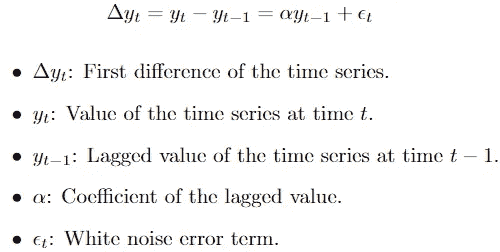
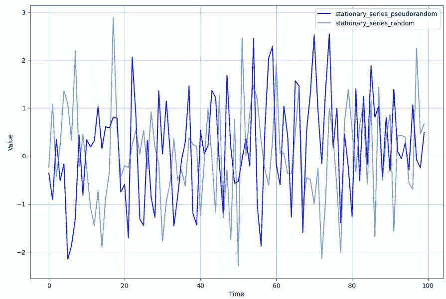
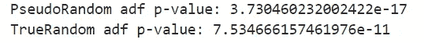
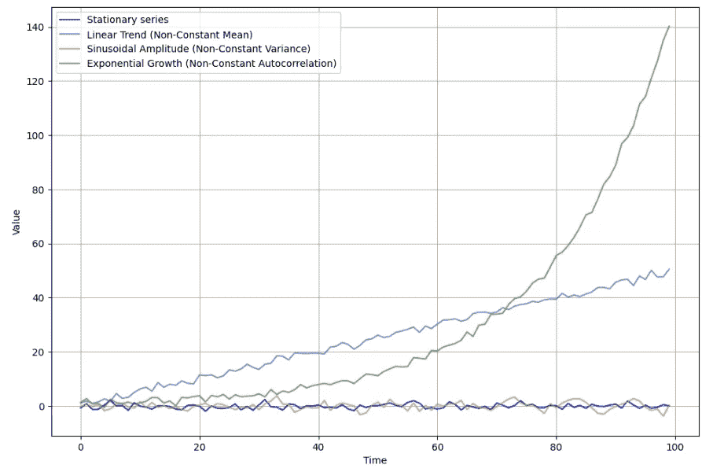
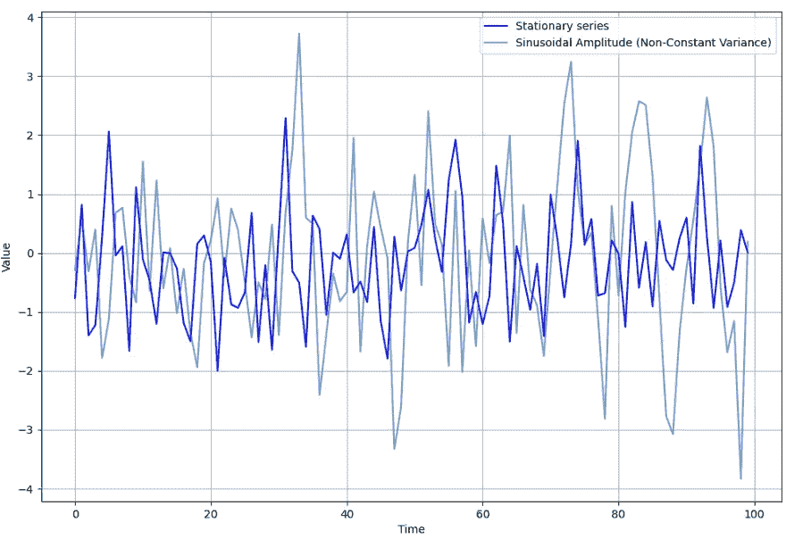
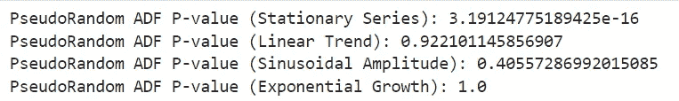
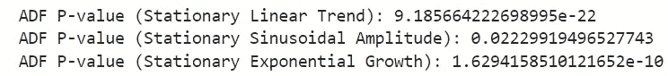
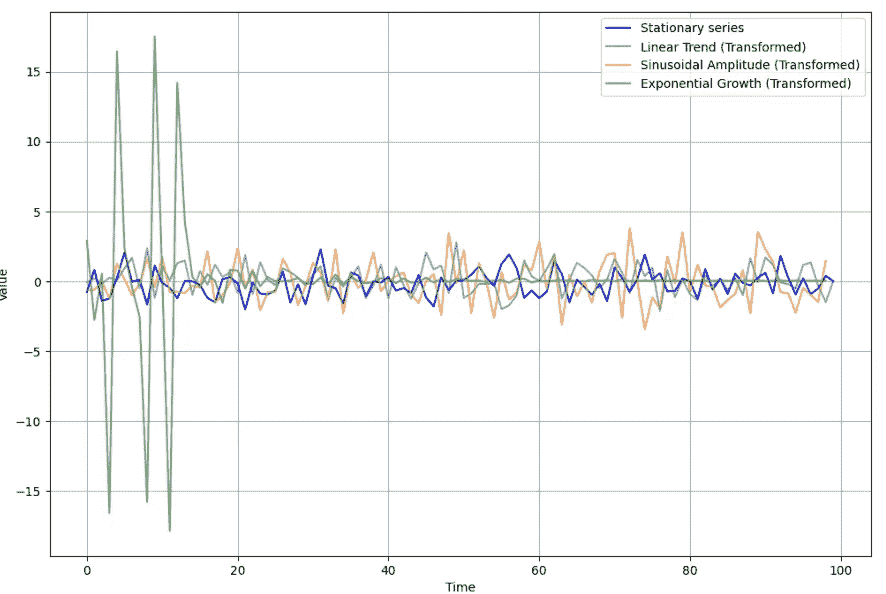

# 理解预测性维护 — 单位根和稳态

> 原文：[`towardsdatascience.com/understanding-predictive-maintenance-unit-roots-and-stationarity-f05322f7b6df`](https://towardsdatascience.com/understanding-predictive-maintenance-unit-roots-and-stationarity-f05322f7b6df)

[](https://marcin-staskopl.medium.com/?source=post_page-----f05322f7b6df--------------------------------)[](https://towardsdatascience.com/?source=post_page-----f05322f7b6df--------------------------------) [Marcin Stasko](https://marcin-staskopl.medium.com/?source=post_page-----f05322f7b6df--------------------------------)

·发表于[Towards Data Science](https://towardsdatascience.com/?source=post_page-----f05322f7b6df--------------------------------) ·阅读时间 13 分钟·2023 年 11 月 13 日

--


照片由[艾玛·戈塞特](https://unsplash.com/@emmagossett?utm_source=medium&utm_medium=referral)拍摄，来源于[Unsplash](https://unsplash.com/?utm_source=medium&utm_medium=referral)

# 文章目的

在这篇文章中，我们将深入探讨单位根和稳态的关键概念。请做好准备，我们将探讨为何检查稳态至关重要，什么是单位根，以及这些元素如何在我们的预测维护工具箱中发挥重要作用。我们还将掌握混沌理论！

这篇文章是“理解预测性维护”系列的一部分。我计划以类似风格创建整个系列。

[点击此链接查看整个系列](https://marcin-staskopl.medium.com/list/understanding-predictive-maintenance-series-e1f44d8a0cc3)。请关注我，以确保不会错过新的文章。

# 数据稳态 — 捉迷藏的分析游戏


照片由[米切尔·洛](https://unsplash.com/@mitchel3uo?utm_source=medium&utm_medium=referral)拍摄，来源于[Unsplash](https://unsplash.com/?utm_source=medium&utm_medium=referral)

是否曾经想过你的数据是否在玩捉迷藏？直接切入主题——我们在谈论稳态。它不仅仅是一个花哨的术语，它是理解你的时间依赖数据究竟有多稳定和可预测的秘密武器。请做好准备，我们将探讨为何数据稳态在建模和预测中是游戏规则的改变者。

## 稳态的关键规则

1.  **常数均值**：一个平稳的时间序列应表现出一致的平均值。如果均值发生变化，可能表明过程的基本行为发生了变化。

1.  **常数方差**：时间序列的方差，代表数据点的分布，应该保持不变。方差的波动会使得准确预测变得困难。

1.  **常数自相关**：自相关测量时间序列与其滞后值之间的相关性。在平稳序列中，自相关的强度和模式应该保持一致。

仅仅是统计性质的“*稳定性*”。

## 为什么平稳性如此重要

想象一下你的预测模型就像是专家导航员在数据的海洋中航行。为了顺利导航，它们更喜欢平静的水域——这就是平稳性的作用。平稳数据就像是一片宁静的海洋，模式保持一致。但是，如果你的数据是一片风雨交加、波涛汹涌的海洋（非平稳），准确预测就会变得非常困难。这就是为什么我们需要发现这些风暴，并将数据转变成一个平静的池塘，以便进行有效的时间序列分析。

## 现实世界的影响

数据的平稳性不仅仅是技术问题；它无处不在，影响着从金融到天气预测的决策。在金融领域，精确性对于风险和回报的估计至关重要，假设平稳性就像拥有一个可靠的指南针。气候科学家依赖平稳模型来预测长期天气模式——这就像拥有一个可靠的天气应用程序来预测地球的未来。

## 迈向深刻分析的旅程

使我们的数据平稳不仅仅是一个技术任务；它是迈向清晰的冒险。这就像将混乱的宝藏地图转变成清晰的指南，帮助分析师和决策者理解一切。在动态的时间依赖数据世界中，平稳性成为我们可靠的地图，引导我们理解表面下的模式，使我们在数据的旅程中更加顺利。

好了，现在我们了解了为什么平静的数据很酷，接下来让我们学习如何让它平静下来。但是等等，在我们动手写代码之前，让我给你介绍一下“单位根”。把它们当作影响我们数据行为的特殊成分。了解单位根就像拥有一个秘密配方，将我们波动的、混乱的数据变成一个平滑的池塘，准备好让我们潜入其中探索。所以，准备好迎接我们旅程的下一部分吧！

# 单位根——数据历史书中的顽皮时间旅行者


[Andy Beales](https://unsplash.com/@andybeales?utm_source=medium&utm_medium=referral) 拍摄于 [Unsplash](https://unsplash.com/?utm_source=medium&utm_medium=referral)

单位根是时间序列分析中的基本概念，在理解现实世界数据的行为和特征中发挥着关键作用。在这次探讨中，我们将深入了解单位根是什么，它们在真实数据分析中为何重要，以及它们如何影响预测性维护领域。当然，我们会在动手实验部分做一些实验。

## 什么是单位根？

时间序列变量中的单位根意味着一个随机过程，其中变量在任何给定时间的值受其过去值的影响。形式上，单位根表明非平稳性，表明该变量不会随着时间的推移回到一个恒定的均值。



单位根的数学解释

单位根的存在将持久性引入时间序列，导致建模和预测中的挑战。增强型迪基-富勒（ADF）测试及其他统计方法用于检测单位根的存在，提供了非平稳性的定量度量。

单位根就像数据的讲述者，编织出超越个体时刻的叙事，创造出连续的故事情节。它们标志着历史影响的持续性，将记忆的元素引入我们数据集的数字结构中。

想象你的数据集是一部历史小说，每个数据点代表着正在展开的故事中的一章。在这个背景下，单位根就是那些反复出现的主题和角色，它们在叙事中留下了不可磨灭的印记，以微妙而一致的影响引导情节发展。

## 为什么这对我们很重要？

理解单位根对时间序列分析师和建模师来说是基础性的。非平稳数据带来了挑战，因为传统模型通常假设数据是平稳的，以便进行准确的预测。分析师必须通过采用如差分等变换来处理单位根，以诱导平稳性并促进模型开发。

在预测维护场景中，单位根在确保预测模型准确性方面发挥着至关重要的作用。嵌入单位根的长期影响可能显著影响预测的可靠性，因此其识别和缓解对于有效的维护策略至关重要。

在我们进行这次技术探索时，我们将深入探讨单位根测试方法，解读结果，并探索处理非平稳时间序列数据的策略。单位根的理论基础为我们在分析旅程中的实际应用提供了坚实的基础。

**增强型迪基-富勒（ADF）帮助我们**


由 [MD_JERRY](https://unsplash.com/@salijareer?utm_source=medium&utm_medium=referral) 提供的照片，来源于 [Unsplash](https://unsplash.com/?utm_source=medium&utm_medium=referral)

想象你有一行蚂蚁朝某个方向移动。ADF 测试检查这些蚂蚁是否有目的地行进（平稳）或是随机散布在各处（非平稳）。

ADF 测试涉及一些数学运算，但我们可以简化它：

+   零假设 (`*H0*`)：这就像默认假设。ADF 的零假设是数据有单位根，这意味着它是非平稳的。就像说蚂蚁在随机游走。

    **H0: 数据具有单位根（非平稳）**

+   替代假设 (`*H1*`): 这是我们试图证明的假设。替代假设是数据是平稳的，就像蚂蚁在清晰的直线上行走一样。

    **H1: 数据是平稳的**

+   测试统计量: ADF 测试计算一个称为测试统计量的数字。如果这个数字很小，表明数据可能是平稳的。

    p 值: 这是一个概率分数。如果 *p 值* 很小（低于某个阈值，例如 0.05），我们就拒绝零假设并接受替代假设，认为我们的数据可能是平稳的。

这并不复杂，只需运行测试并检查 p 值

```py
from statsmodels.tsa.stattools import adfuller
# Perform the Augmented Dickey-Fuller (ADF) test for stationarity
adf_statistic, adf_p_value, adf_lags,
adf_nobs, adf_critical_values, adf_reg_results = adfuller(stationary_series)

# Check if the series is stationary based on the p-value
is_stationary = adf_p_value < 0.05  # Using a significance level of 0.05
```

你通常会像这样使用 adf:

```py
# What youy will probably will use most of the time
_, adf_p_value, _, _, _, _= adfuller(stationary_series)
```

但我会解释这些变量背后的含义

+   `adf_statistic`: ADF 测试中的统计量，指示了针对非平稳性零假设的证据强度。

+   `adf_p_value`: 与零假设相关的 p 值。较低的 p 值表示更强的反对非平稳性的证据。

+   `adf_lags`: 测试中使用的滞后数。

+   `adf_nobs`: ADF 测试中使用的观察数量。

+   `adf_critical_values`: 在不同显著性水平下的测试统计量的临界值。

+   `adf_reg_results`: 回归结果，提供了关于测试中执行的线性回归的额外信息。

虽然混沌可能看起来令人生畏，但我们可以通过理解和利用其模式将其转变为我们的盟友。在数据和分析的领域，混沌可以是一种强大的力量，当正确引导时，提供洞察、预测和更清晰的前进道路。这一切都是关于将不可预测性转变为优势，让混沌成为我们探索和理解旅程中的战略伙伴。

# 你的随机性有多“随机”？

让我们先生成一个简单的平稳序列，但这里有个提醒：“随机”并非全都相同。随机性主要有两种——真正的随机和伪随机。你可能更常接触伪随机，因为这是计算机的首选。

在计算中，生成真正的随机数是一个挑战，因为计算机是确定性的机器。伪随机数，顾名思义，并非真正随机，而是由模拟随机性的算法生成。这些算法以一个称为种子的初始值开始，并使用它生成看起来随机的数字序列。

## 种子

种子是伪随机数生成中的一个关键元素。它作为算法的起点。如果你使用相同的种子，每次都会得到相同的伪随机数序列。这种确定性在你希望重现的场景中是有利的。例如，如果你运行一个涉及随机性的模拟或实验，设置种子可以让你重现确切的随机数序列。

另一方面，更改种子会导致不同的伪随机数序列。这一特性常用于引入模拟中的变异性或为使用随机性的算法提供不同的初始条件。

总之，伪随机数是由算法生成的，而种子是这些算法的起点。控制种子可以让你控制伪随机数的序列，在计算机生成的随机性中提供确定性与变异性之间的平衡。

生成我们的伪随机分布的时间到了。

```py
import numpy as np
import matplotlib.pyplot as plt
np.random.seed(1992) # WOW this is our deterministic seed.

def generate_stationary_series_pseudorandom(size=100):
    stationary_series = np.random.randn(size)
    return stationary_series
```

## 我们可以使用真正的随机性吗？


图片由 [aj_aaaab](https://unsplash.com/@ajing_?utm_source=medium&utm_medium=referral) 提供，来源于 [Unsplash](https://unsplash.com/?utm_source=medium&utm_medium=referral)

现在我们可能会惊讶于即使是我们大多数时间所接触的随机性也是确定性随机。但是我们能否创造真正的随机性，确保没有确定性在其背后？

好消息！我们可以利用真正的物理现象——大气噪声。还记得你电视屏幕上的那些闪烁的黑白点吗？那就是我们的大气噪声，我们将利用它来产生真正的随机性。所以，你的电视不仅仅是用来看节目的；它是你摆脱确定性世界的门票。

```py
import requests

def generate_stationary_series_random(size=100):
    # Fetch truly random values from random.org atmospheric noise API
    response = requests.get(f'https://www.random.org/integers/?num={size}&min=-10000&max=10000&col=1&base=10&format=plain&rnd=new')
    if response.status_code == 200:
        stationary_series = [int(value) for value in response.text.strip().split('\n')]
        return stationary_series
    else:
        raise Exception(f"Failed to fetch random values. Status code: {response.status_code}")
```

使用这个函数，我们可以生成真正的随机性，万岁！

## 平稳性检验

首先，让我们生成序列。

```py
# Generate series
stationary_series_pseudorandom = generate_stationary_series_pseudorandom()
stationary_series_random = generate_stationary_series_pseudorandom()
```

创建结果图。

```py
titles = [
    'stationary_series_pseudorandom',
    'stationary_series_random'
]

plot_multiple_series(stationary_series_random, stationary_series_pseudorandom, 
                     titles=titles)
```



嗯，“壮观”

```py
_, adf_p_value, _, _, _, _= adfuller(stationary_series_pseudorandom)
print(f'PseudoRandom adf p-value: {adf_p_value}')
_, adf_p_value, _, _, _, _= adfuller(stationary_series_random)
print(f'TrueRandom adf p-value: {adf_p_value}')
```



结果

当 p 值非常小（**<0.05**）时，它提供了反对零假设的证据，表明你的数据很可能是**平稳的**。

所以，在这种情况下，p 值远小于 0.05，你可以有信心地说，“是的，我们的数据是平稳的。”

现在，让我们花一点时间来处理这些数据。我们的伪随机数的 p 值大约比真正的随机数小 200 万倍。

为什么会发生这种情况？伪随机数是由算法生成的，这引入了一定程度的确定性。这些算法可能会无意中在数据中引入模式或结构。另一方面，真正的随机数据，如大气噪声，更有可能表现出纯随机性的特征。ADF 检验专注于检测指示非平稳性的模式，可能会在真正的随机数据中发现较少的此类模式，从而导致相对较高的 p 值。

# 实践经验


图片由 [Eddie Kopp](https://unsplash.com/@fiveohfilms?utm_source=medium&utm_medium=referral) 提供，来源于 [Unsplash](https://unsplash.com/?utm_source=medium&utm_medium=referral)

现在是时候通过代码来动手了。我们将进行一些实验，帮助你熟悉文章中的概念。我建议你复现这些实验。在我们深入探讨平稳性之前，我想问你一个问题。


照片由 [Ian Barsby](https://unsplash.com/@ian_barsby?utm_source=medium&utm_medium=referral) 拍摄，来自 [Unsplash](https://unsplash.com/?utm_source=medium&utm_medium=referral)

现在我们将添加几个示例，展示如何使这些数据变为非平稳数据，我们将打破平稳性的关键规则。解释完毕后，我们将绘制所有图表。

## 线性趋势（非恒定均值）

```py
def generate_non_stationary_linear_trend(size=100):
    time = np.arange(size)
    linear_trend = 0.5 * time
    non_stationary_series = np.random.randn(size) + linear_trend
    return non_stationary_series 
```

引入线性趋势以违反恒定均值规则意味着在时间上添加系统性的增加或减少。在非平稳的线性趋势序列中，值随着时间线性增加。这违反了恒定均值规则，因为序列的平均值在变化，表明过程的基本行为发生了变化。在这种情况下，单位根有助于线性趋势的持续性，导致变量在任何给定时间的值受到其过去值的影响。

## 正弦幅度 **（非恒定方差）**

```py
def generate_non_stationary_sin_amplitude(size=100):
    time = np.arange(size)
    amplitude = 0.5 + 0.02 * time
    sin_amplitude_component = amplitude * np.sin(2 * np.pi * time / 10)
    non_stationary_series = np.random.randn(size) + sin_amplitude_component
    return non_stationary_series
```

添加一个幅度逐渐增加的正弦组件违反了恒定方差规则。在非平稳的季节性组件序列中，正弦组件的幅度随时间线性增长。这导致数据点的分布波动，使得方差变得不恒定。单位根有助于季节性组件的持续性，影响方差随着幅度的变化而变化。

## 指数增长 **（非恒定自相关）**

```py
def generate_non_stationary_exponential_growth(size=100, growth_rate=0.05):
    time = np.arange(size)
    exponential_growth_component = np.exp(growth_rate * time)
    non_stationary_series = np.random.randn(size) + exponential_growth_component
    return non_stationary_series
```

引入指数增长模式违反了恒定自相关规则。非平稳的扩展幅度序列表现出指数增长，导致自相关模式随着值的增加而变化。单位根在时间序列中引入了持续性，导致建模和预测中的挑战。单位根的存在意味着非平稳性，表明变量随时间不会恢复到恒定均值。

## 开始实验

执行代码生成时间序列并绘制结果。

```py
# Example usage
stationary_series_pseudorandom = generate_stationary_series_pseudorandom()
non_stationary_linear_trend_series = generate_non_stationary_linear_trend()
non_stationary_sin_amplitude_series = generate_non_stationary_sin_amplitude()
non_stationary_exponential_growth_series = generate_non_stationary_exponential_growth()

# Visualize the examples
plot_multiple_series(stationary_series_pseudorandom, 
                     non_stationary_linear_trend_series, 
                     non_stationary_sin_amplitude_series, 
                     non_stationary_exponential_growth_series,
                     titles=[
                         'Stationary series',
                         'Linear Trend (Non-Constant Mean)',
                         'Sinusoidal Amplitude (Non-Constant Variance)',
                         'Exponential Growth (Non-Constant Autocorrelation)'
                     ])
```



在探索性数据分析中，发现线性趋势或指数增长相对简单，因为这些模式展示了明显的视觉线索。然而，在处理正弦幅度时，区分平稳状态和非平稳状态变得具有挑战性。仅通过查看数据，很难判断幅度是平稳还是非平稳。



这个案例将展示统计测试的力量。我们手中有强大的工具。

```py
_, adf_p_value_stationary, _, _, _, _ = adfuller(stationary_series_pseudorandom)
_, adf_p_value_linear_trend, _, _, _, _ = adfuller(generate_non_stationary_linear_trend())
_, adf_p_value_sin_amplitude, _, _, _, _ = adfuller(generate_non_stationary_sin_amplitude())
_, adf_p_value_exponential_growth, _, _, _, _ = adfuller(generate_non_stationary_exponential_growth())

# Print the results
print(f'PseudoRandom ADF P-value (Stationary Series): {adf_p_value_stationary}')
print(f'PseudoRandom ADF P-value (Linear Trend): {adf_p_value_linear_trend}')
print(f'PseudoRandom ADF P-value (Sinusoidal Amplitude): {adf_p_value_sin_amplitude}')
print(f'PseudoRandom ADF P-value (Exponential Growth): {adf_p_value_exponential_growth}')
```



测试结果表明，只有平稳序列在 ADF 测试中是平稳的。

ADF 测试在平稳和非平稳时间序列之间提供了明确的区分。在第一种情况下，我们可以自信地拒绝原假设，表明时间序列是平稳的。然而，对于其他情况，我们必须接受原假设，得出数据是非平稳的结论。具体来说，在正弦幅度的情况下，尽管非平稳性在视觉上显而易见，但 ADF 测试通过不允许我们拒绝原假设来确认我们的观察结果。

# 实践变换

现在，让我们玩一玩变换，尝试将我们的非平稳时间序列转变为平稳序列——就像做一点反向工程。在现实场景中，确定所需的确切变换通常是一个试错过程。我建议进行探索性数据分析，绘制时间序列，并进行经验尝试。如果某个变换使序列平稳，你不仅达到了平稳性，还可以获得有关数据特征的宝贵见解。

```py
def make_linear_trend_stationary(series):
    # Subtract the linear trend to make the mean constant.
    time = np.arange(len(series))
    linear_trend = 0.5 * time # Somehow we have found this trend :)
    stationary_series = series - linear_trend
    return stationary_series

def make_sin_amplitude_stationary(series):
    # Apply differencing to stabilize and make the variance constant.
    diff_series = np.diff(series)
    return diff_series

def make_exponential_growth_stationary(series, epsilon=1e-8):
    # Add a small constant to avoid zero or negative values
    series = np.where(series <= 0, epsilon, series)

    # Add a small constant to avoid non-finite values
    series += epsilon

    # Apply the log for stabilization
    series = np.log(series)

    # Take the first difference to remove the exponential growth
    stationary_series = np.diff(series)

    return stationary_series
```

在定义了我们的变换函数后，是时候将它们付诸实践了。让我们将这些变换应用于我们的非平稳时间序列，看看是否能够成功引入平稳性。

```py
# Apply transformations to make non-stationary examples stationary
stationary_linear_trend = make_linear_trend_stationary(generate_non_stationary_linear_trend())
stationary_sin_amplitude = make_sin_amplitude_stationary(generate_non_stationary_sin_amplitude())
stationary_exponential_growth = make_exponential_growth_stationary(generate_non_stationary_exponential_growth())

# Perform ADF test for the transformed series
adf_p_value_stationary_linear_trend = adfuller(stationary_linear_trend)[1]
adf_p_value_stationary_sin_amplitude = adfuller(stationary_sin_amplitude)[1]
adf_p_value_stationary_exponential_growth = adfuller(stationary_exponential_growth)[1]

# Print the results
print(f'ADF P-value (Stationary Linear Trend): {adf_p_value_stationary_linear_trend}')
print(f'ADF P-value (Stationary Sinusoidal Amplitude): {adf_p_value_stationary_sin_amplitude}')
print(f'ADF P-value (Stationary Exponential Growth): {adf_p_value_stationary_exponential_growth}')
```



现在我的数据平稳了，太棒了！

数据的样子如下：



好消息！由于我们的数据现在是平稳的，我们可以在每种情况下自信地拒绝原假设。现在，为了增加一点趣味，我将接受用给定种子反向工程你的随机生成迭代的挑战。让我们看看我能否揭开这个谜团！😄

[在这个链接中查看整个系列](https://marcin-staskopl.medium.com/list/understanding-predictive-maintenance-series-e1f44d8a0cc3)。通过关注我，确保你不会错过新文章。
