# 理解预测性维护——波数据：特征工程（第一部分）

> 原文：[`towardsdatascience.com/understanding-predictive-maintenance-wave-data-feature-engineering-part-1-fd22b6a19323`](https://towardsdatascience.com/understanding-predictive-maintenance-wave-data-feature-engineering-part-1-fd22b6a19323)

## 开始学习波数据信号处理所需的所有信息

[](https://marcin-staskopl.medium.com/?source=post_page-----fd22b6a19323--------------------------------)[](https://towardsdatascience.com/?source=post_page-----fd22b6a19323--------------------------------) [Marcin Stasko](https://marcin-staskopl.medium.com/?source=post_page-----fd22b6a19323--------------------------------)

·发布于 [Towards Data Science](https://towardsdatascience.com/?source=post_page-----fd22b6a19323--------------------------------) ·阅读时间 16 分钟·2023 年 11 月 21 日

--


照片由 [Lukas Tennie](https://unsplash.com/@luk10?utm_source=medium&utm_medium=referral) 提供，发布在 [Unsplash](https://unsplash.com/?utm_source=medium&utm_medium=referral) 上。

# 文章目的

我们即将深入探讨一些有趣的内容——波数据信号处理。这在预测性维护中非常重要，但在其他领域也是如此。我将在这一系列中逐步讲解，使其易于理解。如果你有任何想法，请随时分享！

本文是《理解预测性维护》系列的一部分。

[查看整个系列的链接](https://marcin-staskopl.medium.com/list/understanding-predictive-maintenance-series-e1f44d8a0cc3)。通过关注我，确保你不会错过新的文章。所有没有说明文字的图片均由我创作。

# 为什么我们的分析在时域中进行很重要？

信号处理中的时域分析是一种方法，重点关注信号在时间上的行为和特征。与频域分析不同，后者探讨信号成分的频率内容，时域分析提供了信号在不同时间间隔内变化的洞察。这种方法使我们能够观察信号表现出的变化、模式和趋势，提供了关于系统或过程的动态和时间方面的宝贵信息。

## 为什么在预测性维护中它如此重要？


照片由 [James Lewis](https://unsplash.com/@jamesplewis?utm_source=medium&utm_medium=referral) 提供，发布在 [Unsplash](https://unsplash.com/?utm_source=medium&utm_medium=referral) 上。

通过将这一分析技术应用于设备数据，维护专业人员可以识别和分析机械性能中的时间模式。监测变化有助于及早发现异常或偏离预期行为，从而及时干预以解决潜在问题，防止其升级。这种前瞻性的维护方法提高了设备的可靠性，减少了停机时间，并最终有助于更加经济高效的运营过程。

理解信号的时间域特征使得行业能够**超越被动维护实践**。通过时间域分析获得的见解支持预测性维护，使组织能够根据设备的实际状态安排维护活动，而不是基于任意的时间间隔。这不仅优化了资源利用，还延长了机械的使用寿命，从而带来显著的成本节省和改进的整体运营性能。

## 振动数据——预测性维护的核心

理解振动数据在预测性维护中至关重要，原因有几个。首先，异常振动通常是机械故障的早期指示。通过持续监测和分析振动数据，维护团队可以在故障发生之前检测到异常。其次，振动分析提供了潜在问题的具体性质的见解，从而允许进行有针对性和及时的干预。最后，通过利用振动数据，预测性维护策略可以摆脱基于时间的例行维护，转向更高效的基于状态的维护方法，从而优化设备性能并减少停机时间。

# 特征工程理论

在实践部分，我将为每个特征提供代码示例，并附上解释以便于实际应用。让我们探索特征工程背后的理论及其在振动数据分析中的应用。

## **时间域特征**

在这一类别中，我们为每个振动信号计算统计度量，如均值、标准差、偏度和峰度。此外，我们还深入探讨诸如均方根（RMS）和峰值因子等指标，以提供信号能量和峰值特征的整体度量。

+   `分布统计度量` 计算每个振动信号的统计度量，如`均值`、`标准差`、`偏度`和`峰度`。

+   `RMS（均方根）` 提供信号整体能量的度量。

+   `峰值因子` 峰值与`RMS`值的比率。

## 频域特征

转换到频域时，我们采用如`快速傅里叶变换 (FFT)`的技术来转换时域信号。提取的特征包括`主频率`、`谱熵`和`谱峭度`。`功率谱密度 (PSD)`提供了关于功率分布和谐波关系的见解。

+   `FFT (快速傅里叶变换)` 将时域信号转换为频域。从结果频谱中提取特征，如`主频率`、`谱熵`和`谱峭度`。

+   `功率谱密度 (PSD)` 描述信号的功率如何在频率上分布。

## 时频特征

探索时频域涉及技术，如`小波变换`和`短时傅里叶变换 (STFT)`，提供信号的动态表示，并捕捉频率内容随时间的变化。

+   `小波变换` 提供信号的时频表示。从小波系数中提取特征。

+   `短时傅里叶变换 (STFT)` 表示信号频率内容如何随时间变化。

## 包络分析

解调技术，如`Hilbert 变换`或`小波变换`，用于提取信号包络。分析包络内的特征增加了另一层理解。

+   `解调` 使用`Hilbert 变换`或`小波变换`提取信号的包络。分析包络的特征。

## 窗口上的统计测量

滚动统计，通过固定大小的窗口计算，允许捕捉趋势和模式。此外，高阶统计矩在窗口上，称为波形矩，提供了宝贵的见解。

+   `滚动统计` 在固定大小的窗口上计算统计量，捕捉趋势和模式。

+   `波形矩` 高阶统计矩在窗口上。

## 重现图

深入研究重现图并利用`重现定量分析 (RQA)`可以辨别数据结构中的模式，为振动信号提供独特的视角。

+   `重现定量分析 (RQA)` 分析重现图的结构以捕捉数据中的模式。

## 特定领域特征

特定领域特征，如`峰值特征`和`形状特征`，旨在识别和分析振动信号中的峰值和整体波形形状。

+   `峰值特征` 识别和分析振动信号中的峰值。

+   `形状特征` 提取与信号波形形状相关的特征。

尽管这些示例并未涵盖所有可能性，但其中一些可能对您的需求有用。 :)

# 实践经验


图片由[Amauri Mejía](https://unsplash.com/@amavcinema?utm_source=medium&utm_medium=referral)提供，来自[Unsplash](https://unsplash.com/?utm_source=medium&utm_medium=referral)

现在是时候通过代码亲自操作了。我们将进行一些实验，帮助你熟悉文章中的概念。我建议你复现这些实验。

## 为实验创建信号

我们需要模拟振动信号并增加更多现实感，以复现设备磨损

```py
def generate_vibration_signal(duration, sampling_rate, frequency, amplitude, noise_level, max_wear, wear_threshold):
    t = np.linspace(0, duration, int(sampling_rate * duration), endpoint=False)

    # Generate a sinusoidal signal
    signal = amplitude * np.sin(2 * np.pi * frequency * t)

    # Add random noise to simulate real-world conditions
    noise = np.random.normal(0, noise_level, signal.shape)
    signal_with_noise = signal + noise

    # Simulate equipment wear
    wear = np.linspace(0, max_wear, len(t))
    wear[wear > wear_threshold] = 0  # Reset wear if it exceeds the threshold
    signal_with_wear = signal_with_noise + wear

    return t, signal_with_wear
```

在这段代码中，磨损在达到特定值后会重置——模拟设备更换

让我们生成信号并绘图

```py
# Parameters
duration = 20         # seconds
sampling_rate = 20    # Hz
frequency = 5         # Hz (vibration frequency)
amplitude = 1.0       # Min Max range
noise_level = 0.3     # Noise factor to increase reality
max_wear = 1          # Maximum wear before reset
wear_threshold = 0.5  # Wear threshold for reset

# Generate synthetic vibration signal with wear and threshold
time, vibration_signal = generate_vibration_signal(duration, sampling_rate, frequency, amplitude, noise_level, max_wear, wear_threshold)

# Plot the signal
plt.plot(time, vibration_signal)
plt.title('Synthetic Vibration Signal with Equipment Wear')
plt.xlabel('Time (s)')
plt.ylabel('Amplitude')
plt.legend()
plt.show()
```

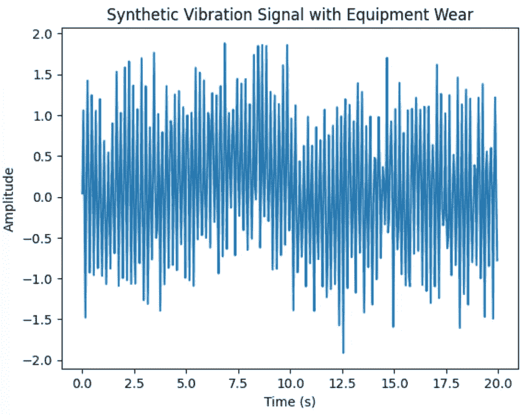

带磨损效应的噪声信号用于下一步实验

本文的任务是向你介绍这些酷炫的功能。我们在这里不会构建整个过程——今天没有管道给我们。那是另一个文章的故事！现在，让我们深入探索从信号中创建特征的有趣世界。准备好迎接特征盛宴了吗？出发吧！🚀

## 窗口化还是不窗口化，这是个问题。


由我使用 DiscoDiffusion 模型生成

时间序列窗口化就像是在连续时间线中查看快照，这非常有用，特别是在预测维护中。想象一下你在看一部电影，但不是看完整部电影，而是每隔几分钟暂停一次并拍一张照片。这些照片就是你的“窗口”。这些窗口帮助我们理解事物如何随时间变化。在机器和设备的世界中，了解它们过去的行为有助于我们预测未来可能发生的情况。

使用这些窗口的一个大优点是它们使理解发生了什么变得更容易。这就像将一个大故事拆分成更小的章节。每个窗口就是一个章节，通过查看它们，我们可以发现该时间段内发生的任何奇怪或有趣的事情。这种详细的视角帮助我们找出机器可能出现磨损或故障的原因。此外，这些窗口帮助我们处理信息获取频率的变化，并处理数据中的任何异常，确保我们的预测是可靠的。

但当然，这并非全是阳光和彩虹。选择这些窗口的正确大小有点棘手。如果它们太大或太小，我们可能会错过重要细节或添加不必要的噪声。这就像为相机选择正确的镜头——你想捕捉到恰到好处的量。此外，决定这些窗口是否应该重叠也是一个难题。重叠的窗口提供更多的上下文，但重叠过多可能会使数据变得重复。这就像试图平衡在书籍每一章中包含多少背景故事。找到这个甜蜜点对确保我们关于机器维护的预测准确无误至关重要。

## 窗口化示例

```py
df_windowed = pd.DataFrame({'time': time, 'vibration_signal': vibration_signal})

# Make some experiments
window_size = int(2)  

# Apply mean windowing using the 'rolling' function
df_windowed['mean_amplitude'] = df_windowed['vibration_signal'].rolling(window=window_size, min_periods=1).mean()

# Plot the original signal and the mean windowed signal
plt.plot(df_windowed['time'], df_windowed['vibration_signal'], label='Original Signal')
plt.plot(df_windowed['time'], df_windowed['mean_amplitude'], label=f'Mean Window ({window_size} samples)')
plt.title('Synthetic Vibration Signal with Mean Windowing')
plt.xlabel('Time (s)')
plt.ylabel('Amplitude')
plt.legend()
plt.show()
```

我打算举办一个不同大小的窗口派对，向你展示它们如何改变事物。这就像 Mean Windowing 是我们的酷 DJ，在窗口范围内旋转平均值。让我们看看数据舞池如何跟随不同窗口大小的节拍！


平均窗口大小 = 2

窗口大小为 2 时，很难看到任何清晰的模式；这引入了太多噪音。我们需要增加窗口大小，以更好地了解数据中发生的情况。

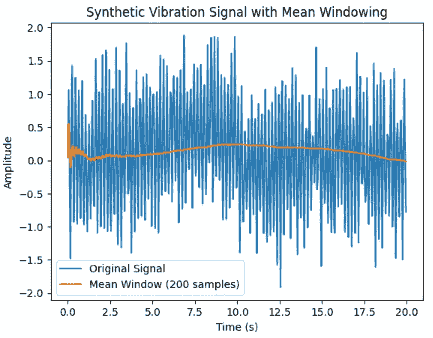

平均窗口大小 = 200

现在，窗口太大了，这不好，因为我们丢失了很多数据细节。我们需要一个合适的窗口，以捕捉所有重要信息。

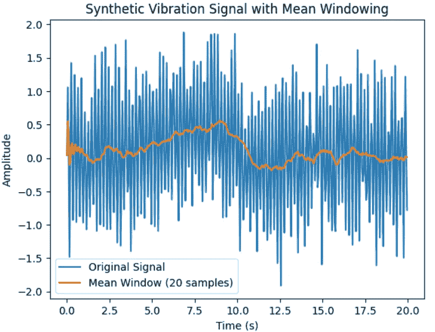

平均窗口大小 = 20

窗口大小为 20 时，数据模式变得非常明显，这让我们能够识别在信号生成过程中引入的合成“磨损效应”。在训练模型时，进行试错以找出最佳窗口大小是至关重要的。本文中，我将使用窗口大小 20 来生成特征。

# 时间域特征

## 分布统计度量

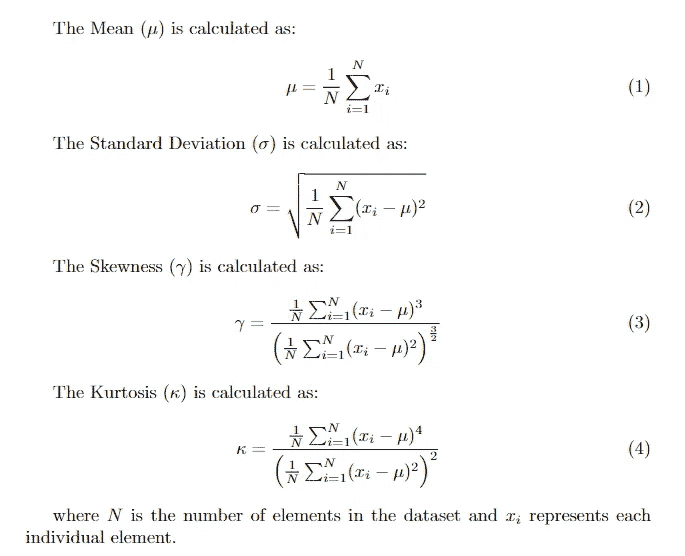

分布统计（Latex 编译）

让我们玩一下分布测量。当然，我可能会跳过`mean`和`standard deviation`，因为它们很明显，但我尝试让这个文章有点趣味，以便深入解释每个内容。

## **均值**

想象一下你和你的朋友们在吃披萨派对上。每个人都喜欢各种配料的披萨。这个`mean`就像是计算每个人披萨上意大利辣肠片的平均数量。如果一个朋友有很多，而另一个朋友只有几个，平均值帮助你知道每个人的意大利辣肠片数量。就像找到披萨的和谐！

## **标准差**

现在，让我们谈谈`standard deviation`。想象一群猫。一些猫非常放松和懒惰，而另一些猫则非常活跃和好动。这个`standard deviation`就像是测量每只猫的能量水平如何偏离或不同于所有猫的平均能量水平。如果标准差很高，那你就有一群既懒又活跃的猫。如果标准差很低，大多数猫的能量水平相似——也许是一个悠闲的猫派对！

## **偏度**

让我们用水果篮的场景来更清楚地理解`positive`和`negative` `skewness`之间的区别。

+   `Positive Skewness (向右偏斜)` 想象你的朋友们正在填充一个水果篮。大多数朋友决定添加各种水果，但有几个朋友特别热衷，添加了额外的香蕉、苹果和橙子。由于这种额外的水果热情，水果篮的秋千向右倾斜。这就是`positive skewness`，表示右侧有更多的兴奋。

+   `Negative Skewness (Light to the Left)` 现在，假设几个朋友决定保持轻松，只在篮子里添加几颗葡萄和浆果。这种轻盈的水果方式使跷跷板向左倾斜。这就是 `negative skewness`，表示向左方向的轻微偏斜。

## **峰度**

现在，想象你在坐过山车。一些过山车很疯狂，充满了曲折，而其他的则比较温和。`Kurtosis` 是我们过山车的评论员，评估车程的刺激程度。`Positive kurtosis` 意味着过山车有急转弯和意外的回旋，而 `negative kurtosis` 表示平稳、更温和的骑行。`Kurtosis` 就是我们统计主题公园的刺激因子！

## 偏度比较

```py
import matplotlib.pyplot as plt
import numpy as np
from scipy.stats import skew, kurtosis

# Set a random seed for reproducibility
np.random.seed(1992)

# Generate synthetic datasets with varying skewness and kurtosis
# Normal distribution
normal_data = np.random.normal(loc=170, scale=5, size=1000)

# Positively skewed distribution                
skewed_data = np.random.gamma(shape=2, scale=5, size=1000)

# Negatively skewed distribution                 
negative_skewed_data = -np.random.gamma(shape=2, scale=5, size=1000)      

# Calculate mean and median for each dataset
normal_mean, normal_median = np.mean(normal_data), np.median(normal_data)
skewed_mean, skewed_median = np.mean(skewed_data), np.median(skewed_data)
negative_skewed_mean, negative_skewed_median = np.mean(negative_skewed_data), np.median(negative_skewed_data)

# Plot the distributions
plt.figure(figsize=(12, 6))

plt.subplot(1, 3, 1)
plt.hist(normal_data, bins=30, color='blue', alpha=0.7)
plt.axvline(x=normal_mean, color='red', linestyle='--', label=f'Mean: {normal_mean:.2f}')
plt.axvline(x=normal_median, color='green', linestyle='--', label=f'Median: {normal_median:.2f}')
plt.legend()
plt.title('Normal Distribution')

plt.subplot(1, 3, 2)
plt.hist(skewed_data, bins=30, color='orange', alpha=0.7)
plt.axvline(x=skewed_mean, color='red', linestyle='--', label=f'Mean: {skewed_mean:.2f}')
plt.axvline(x=skewed_median, color='green', linestyle='--', label=f'Median: {skewed_median:.2f}')
plt.legend()
plt.title('Positively Skewed Distribution')

plt.subplot(1, 3, 3)
plt.hist(negative_skewed_data, bins=30, color='green', alpha=0.7)
plt.axvline(x=negative_skewed_mean, color='red', linestyle='--', label=f'Mean: {negative_skewed_mean:.2f}')
plt.axvline(x=negative_skewed_median, color='green', linestyle='--', label=f'Median: {negative_skewed_median:.2f}')
plt.legend()
plt.title('Negatively Skewed Distribution')

plt.tight_layout()
plt.show()
```

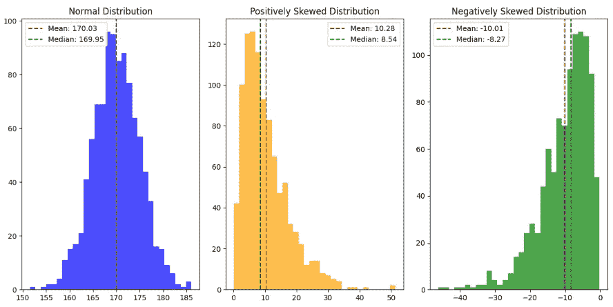

偏度比较图与均值和中位数

`Normal` 分布的数据在两侧均匀分布，均值与中位数紧密对齐。

`Positive / Right-skewed` 分布在右侧有较长或较胖的尾部，表示左侧的数据点更多。均值通常大于中位数。

`Negative / Left-skewed` 分布在左侧有较长或较胖的尾部，表明右侧的数据点更多。均值通常小于中位数。

## 峰度比较

```py
# Leptokurtic distribution (heavier tails)
heavy_tails_data = np.random.exponential(scale=10, size=1000)

# Platykurtic distribution (lighter tails)
light_tails_data = np.random.uniform(low=160, high=180, size=1000)        

# Calculate mean and median for each dataset
normal_mean, normal_median = np.mean(normal_data), np.median(normal_data)
heavy_tails_mean, heavy_tails_median = np.mean(heavy_tails_data), np.median(heavy_tails_data)
light_tails_mean, light_tails_median = np.mean(light_tails_data), np.median(light_tails_data)

# Plot the distributions with mean and median
plt.figure(figsize=(12, 6))

plt.subplot(1, 3, 1)
plt.hist(normal_data, bins=30, color='blue', alpha=0.7)
plt.axvline(x=normal_mean, color='red', linestyle='--', label=f'Mean: {normal_mean:.2f}')
plt.axvline(x=normal_median, color='green', linestyle='--', label=f'Median: {normal_median:.2f}')
plt.legend()
plt.title('Normal (esokurtic) Distribution')

plt.subplot(1, 3, 2)
plt.hist(heavy_tails_data, bins=30, color='red', alpha=0.7)
plt.axvline(x=heavy_tails_mean, color='red', linestyle='--', label=f'Mean: {heavy_tails_mean:.2f}')
plt.axvline(x=heavy_tails_median, color='green', linestyle='--', label=f'Median: {heavy_tails_median:.2f}')
plt.legend()
plt.title('Leptokurtic Distribution (Heavier Tails)')

plt.subplot(1, 3, 3)
plt.hist(light_tails_data, bins=30, color='green', alpha=0.7)
plt.axvline(x=light_tails_mean, color='red', linestyle='--', label=f'Mean: {light_tails_mean:.2f}')
plt.axvline(x=light_tails_median, color='green', linestyle='--', label=f'Median: {light_tails_median:.2f}')
plt.legend()
plt.title('Platykurtic Distribution (Lighter Tails)')

plt.tight_layout()
plt.show()
```

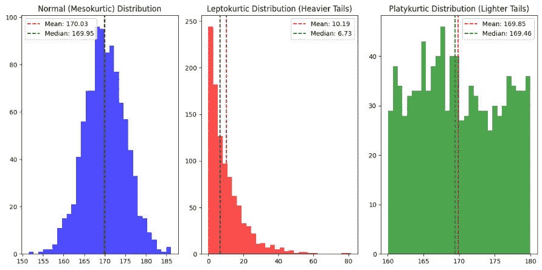

峰度图比较

现在，让我们计算统计数据进行比较。

```py
# Calculate skewness and kurtosis for each dataset
normal_skewness = skew(normal_data)
normal_kurtosis = kurtosis(normal_data)

skewed_skewness = skew(skewed_data)
skewed_kurtosis = kurtosis(skewed_data)

negative_skewness = skew(negative_skewed_data)
negative_kurtosis = kurtosis(negative_skewed_data)

heavy_tails_skewness = skew(heavy_tails_data)
heavy_tails_kurtosis = kurtosis(heavy_tails_data)

light_tails_skewness = skew(light_tails_data)
light_tails_kurtosis = kurtosis(light_tails_data)

# Print the calculated values
print("Normal Distribution:")
print(f"Skewness: {normal_skewness}, Kurtosis: {normal_kurtosis}\n")

print("Positively Skewed Distribution:")
print(f"Skewness: {skewed_skewness}, Kurtosis: {skewed_kurtosis}\n")

print("Negatively Skewed Distribution:")
print(f"Skewness: {negative_skewness}, Kurtosis: {negative_kurtosis}\n")

print("Leptokurtic Distribution (Heavier Tails):")
print(f"Skewness: {heavy_tails_skewness}, Kurtosis: {heavy_tails_kurtosis}\n")

print("Platykurtic Distribution (Lighter Tails):")
print(f"Skewness: {light_tails_skewness}, Kurtosis: {light_tails_kurtosis}\n")
```

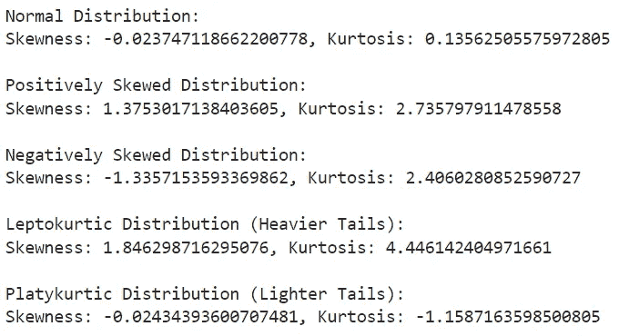

计算的统计结果输出

**正态分布**

+   `Skewness` -0.0237（略微负偏）

+   `Kurtosis` 0.1356（平峰度，比正常分布更平坦）

**正偏分布**

+   `Skewness` 1.3753（强烈正偏）

+   `Kurtosis` 2.7358（峰态分布，尾部比正常分布更重）

**负偏分布**

+   `Skewness` -1.3357（强烈负偏）

+   `Kurtosis` 2.4060（峰态分布，尾部比正常分布更重）

**峰态分布（更重的尾部）**

+   `Skewness` 1.8463（正偏）

+   `Kurtosis` 4.4461（高峰度，非常重的尾部）

平峰度分布（更轻的尾部）

+   `Skewness` -0.0243（略微负偏）

+   `Kurtosis` -1.1587（平峰度，尾部比正常分布轻得多）

## 使用滚动窗口应用统计

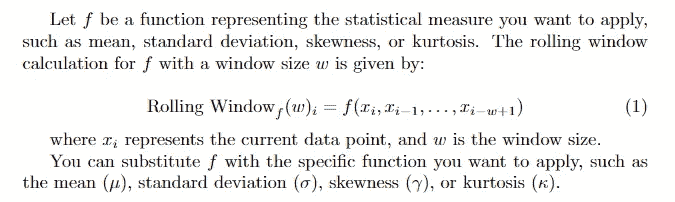

滚动窗口解释（Latex 编译）

```py
def calculate_rolling_statistics(signal, window_size):

    df = pd.DataFrame({'signal': signal})
    rolling_stats = df['signal'].rolling(window=window_size, min_periods=1)

    mean_values = rolling_stats.mean()
    std_dev_values = rolling_stats.std()
    skewness_values = rolling_stats.apply(skew, raw=True)
    kurtosis_values = rolling_stats.apply(kurtosis, raw=True)

    return mean_values, std_dev_values, skewness_values, kurtosis_values

window_size = 20  

# Calculate rolling statistics
rolling_means, rolling_std_devs, rolling_skewness, rolling_kurtosis = calculate_rolling_statistics(vibration_signal, window_size)
```

我会将结果绘制出来，为了更好的可视化，我会分开 `skewness` 和 `kurtosis`

```py
# Plot the signal and rolling statistics
plt.figure(figsize=(12, 6))

# Plot Rolling Mean, Rolling Mean + Std Dev, Rolling Mean - Std Dev
plt.subplot(2, 1, 1)
plt.plot(time[:len(rolling_means)], vibration_signal[:len(rolling_means)], label='Vibration Signal')
plt.plot(time[:len(rolling_means)], rolling_means, label='Rolling Mean')
plt.plot(time[:len(rolling_means)], rolling_means + rolling_std_devs, label='Rolling Mean + Std Dev', linestyle='--')
plt.plot(time[:len(rolling_means)], rolling_means - rolling_std_devs, label='Rolling Mean - Std Dev', linestyle='--')
plt.title(f'Synthetic Vibration Signal with Rolling Mean and Standard Deviation (Window Size = {window_size})')
plt.xlabel('Time (s)')
plt.ylabel('Amplitude')
plt.legend()

# Plot Rolling Skewness and Rolling Kurtosis
plt.subplot(2, 1, 2)
plt.plot(time[:len(rolling_means)], vibration_signal[:len(rolling_means)], label='Vibration Signal')
plt.plot(time[:len(rolling_means)], rolling_skewness, label='Rolling Skewness', linestyle='--')
plt.plot(time[:len(rolling_means)], rolling_kurtosis, label='Rolling Kurtosis', linestyle='--')
plt.title(f'Synthetic Vibration Signal with Rolling Skewness and Kurtosis (Window Size = {window_size})')
plt.xlabel('Time (s)')
plt.ylabel('Amplitude')
plt.legend()

plt.tight_layout()
plt.show()
```

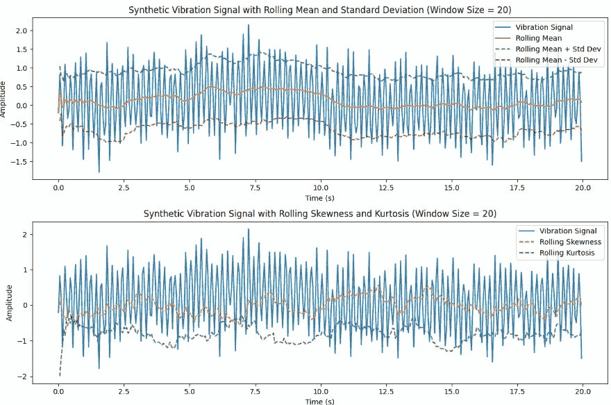

滚动应用与原始信号

观察结果可以明显看出，滚动窗口作为一种有效的去噪技术。我建议尝试不同的窗口大小，因为数据科学通常涉及通过试验和错误进行实证探索。

**幕后** `**.apply()**` **的故事**

这里有一点额外的内容，展示函数和窗口如何在后台一起工作。我会仅仅做一次，以给你一个关于当应用函数在处理窗口时如何工作的直观了解，使用我们的简单示例。

```py
def calculate_rolling_statistics_behind_scenes(signal, window_size):
    mean_values = np.convolve(signal, np.ones(window_size)/window_size, mode='valid')
    std_dev_values = np.array([np.std(signal[i-window_size+1:i+1]) for i in range(window_size-1, len(signal))])
    skewness_values = np.array([skew(signal[i-window_size+1:i+1]) for i in range(window_size-1, len(signal))])
    kurtosis_values = np.array([kurtosis(signal[i-window_size+1:i+1]) for i in range(window_size-1, len(signal))])

    return mean_values, std_dev_values, skewness_values, kurtosis_values
```

+   `mean_values` 这是通过使用 `np.convolve` 函数计算的，该函数执行卷积操作。在这种情况下，它通过用一个窗口与信号进行卷积来计算滚动平均值。`mode='valid'` 参数确保卷积仅在完整窗口可以适合而无需零填充的地方进行。

+   `std_dev_values` 这是通过使用列表推导式遍历信号来计算的。对于信号中的每个位置 `i`，它计算子数组 `signal[i-window_size+1:i+1]` 的标准差。这代表了滚动标准差。

+   `skewness_values` 类似于标准差，它是通过使用列表推导式遍历信号来计算的。对于每个位置 `i`，它计算子数组 `signal[i-window_size+1:i+1]` 的偏度。

+   `kurtosis_values` 再次，类似于标准差和偏度，它是通过使用列表推导式遍历信号来计算的。对于每个位置 `i`，它计算子数组 `signal[i-window_size+1:i+1]` 的峰度。

## RMS（均方根）

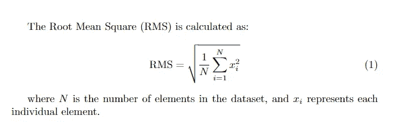

RMS 方程（Latex 编译）

`Root Mean Square (RMS)` 就像是数学中的超级英雄。它接收一组数字，对每一个数字进行平方，计算平均值，然后取平方根。这个过程会给出一个单一的数字，代表原始数字的典型大小或强度。它在各个领域中都是一个方便的工具，从测量机械振动到评估信号强度。

```py
def calculate_rolling_rms(signal, window_size):
    df = pd.DataFrame({'signal': signal})
    rolling_stats = df['signal'].rolling(window=window_size, min_periods=1)

    rms_values = np.sqrt(rolling_stats.apply(lambda x: np.mean(x**2), raw=True))

    return rms_values

window_size = 20
rolling_rms = calculate_rolling_rms(vibration_signal, window_size)
```

```py
plt.plot(time[:len(rolling_rms)], vibration_signal[:len(rolling_rms)], label='Vibration Signal')
plt.plot(time[:len(rolling_rms)], rolling_rms, label='Rolling RMS', linestyle='--')
plt.title(f'Synthetic Vibration Signal with Rolling RMS (Window Size = {window_size})')
plt.xlabel('Time (s)')
plt.ylabel('Amplitude')
plt.legend()

plt.tight_layout()
plt.show()
```

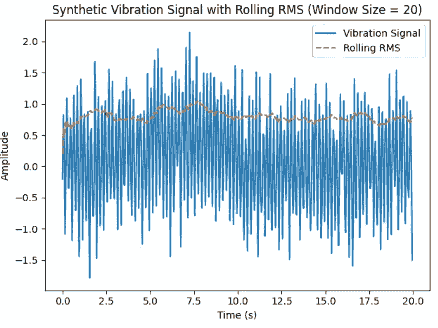

RMS 揭示了一个单一而强大的指标，捕捉了潜在的信号功率，同时有效地减少了噪声。这个图表作为一个视觉证明，展示了 RMS 在各种应用中提高信号清晰度和精度的实际效果。

## 峰值因子

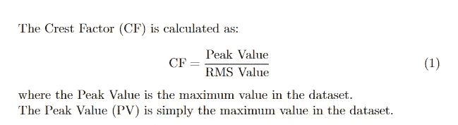

峰值因子方程（Latex 编译）

`Crest Factor (CF)` 就像信号分析世界中的副手 `Root Mean Square (RMS)`。虽然 `RMS` 给出了整体强度，`Crest Factor` 则突出显示了峰值。它是最高点与 RMS 值的比率，告诉你信号的尖锐程度或“峰值”程度。可以将 `CF` 视为帮助你理解数据中尖锐峰值的超级英雄伙伴，无论是在声音波、电子信号还是其他波动测量中。它们一起组成了揭示数据中隐藏秘密的动态组合。

```py
def calculate_crest_factor_and_peak(signal, window_size):
    df = pd.DataFrame({'signal': signal})
    rolling_stats = df['signal'].rolling(window=window_size, min_periods=1)

    peak_values = rolling_stats.apply(lambda x: np.max(np.abs(x)), raw=True)
    rms_values = np.sqrt(rolling_stats.apply(lambda x: np.mean(x**2), raw=True))

    crest_factor_values = peak_values / rms_values

    return crest_factor_values, peak_values

# Calculate rolling Crest Factor and Peak values
rolling_crest_factor, rolling_peak_values = calculate_crest_factor_and_peak(vibration_signal, window_size)
```

创建图表

```py
# Plot the vibration signal, rolling Crest Factor, and Peak values

plt.plot(time[:len(rolling_crest_factor)], vibration_signal[:len(rolling_crest_factor)], label='Vibration Signal')
plt.plot(time[:len(rolling_crest_factor)], rolling_crest_factor, label='Rolling Crest Factor', linestyle='--')
plt.plot(time[:len(rolling_peak_values)], rolling_peak_values, label='Rolling Peak Values', linestyle='-.')
plt.title(f'Synthetic Vibration Signal with Rolling Crest Factor and Peak Values (Window Size = {window_size})')
plt.xlabel('Time (s)')
plt.ylabel('Amplitude')
plt.legend()

plt.tight_layout()
plt.show()
```

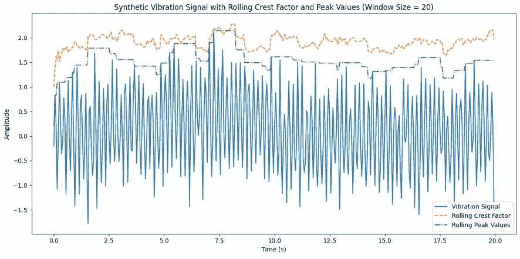

想象一下`RMS`和`CF`作为信号分析中的动态二人组。`RMS`就像整体强度专家，通过计算数字来提供全局视角。它平方、平均和开方，以展示信号的强度。现在，认识一下峰值侦探。它专注于信号中的尖峰部分，指出哪里出现了极高的值。它们一起组成了一个酷炫的团队，帮助你理解数据中的总体强度和尖峰。

这就是第一部分的内容！我们已经深入探讨了理论基础，并通过特征构建示例进行了实践。在系列的下一部分，我将揭示下一组特征的详细信息。敬请期待更多激动人心的见解！

这篇文章是“理解预测性维护”系列的一部分。

[查看完整系列链接](https://marcin-staskopl.medium.com/list/understanding-predictive-maintenance-series-e1f44d8a0cc3)。确保你通过关注我，不错过新文章。
