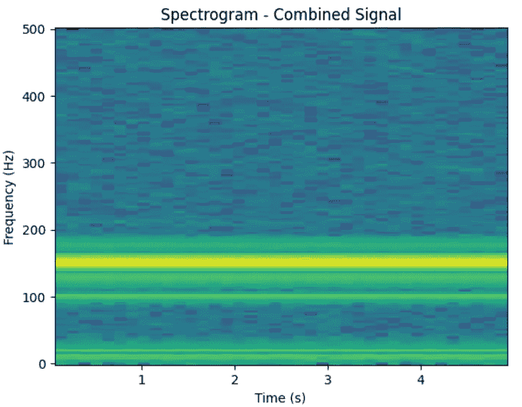

# 了解预测性维护——波形数据：特征工程（第二部分）

> 原文：[`towardsdatascience.com/understanding-predictive-maintenance-wave-data-feature-engineering-part-2-spectral-3eced3bdbb3e`](https://towardsdatascience.com/understanding-predictive-maintenance-wave-data-feature-engineering-part-2-spectral-3eced3bdbb3e)

## 频谱数据的特征工程

[](https://marcin-staskopl.medium.com/?source=post_page-----3eced3bdbb3e--------------------------------)[](https://towardsdatascience.com/?source=post_page-----3eced3bdbb3e--------------------------------) [Marcin Stasko](https://marcin-staskopl.medium.com/?source=post_page-----3eced3bdbb3e--------------------------------)

·发布在[Towards Data Science](https://towardsdatascience.com/?source=post_page-----3eced3bdbb3e--------------------------------) ·阅读时间 12 分钟·2023 年 12 月 1 日

--


图片由[Evie S.](https://unsplash.com/@evieshaffer?utm_source=medium&utm_medium=referral)拍摄，发布在[Unsplash](https://unsplash.com/?utm_source=medium&utm_medium=referral)

# 文章目的

这是关于波形数据特征工程的文章第二部分。我们将专注于频谱特征。你有什么想法要补充吗？请随时分享！

本文是《了解预测性维护》系列的一部分。

[查看系列文章的完整列表](https://marcin-staskopl.medium.com/list/understanding-predictive-maintenance-series-e1f44d8a0cc3)。通过关注我来确保不错过新文章。所有没有说明的图片均由我创建。

# 频域特征

过渡到频域，我们使用像`快速傅里叶变换（FFT）`这样的技术将时域信号转换。提取的特征包括`主频率`、`频谱熵`和`频谱峭度`。`功率谱密度（PSD）`和`谐波比`提供了关于功率分布和谐波关系的见解。

+   `FFT（快速傅里叶变换）`将时域信号转换为频域。从结果频谱中提取特征，如`主频率`、`频谱熵`和`频谱峭度`。

+   `功率谱密度（PSD）`描述信号的功率如何在频率上分布。

# 下一篇文章计划

+   小波变换

+   解调

+   循环量化分析（RQA）

# 为实验创建信号

我将使用与上一部分完全相同的方法：

[](/understanding-predictive-maintenance-wave-data-feature-engineering-part-1-fd22b6a19323?source=post_page-----3eced3bdbb3e--------------------------------) ## 了解预测性维护——波形数据：特征工程（第一部分）

### 开始学习波形数据信号处理所需的所有信息

[towardsdatascience.com

让我们生成信号：

```py
# Parameters
duration = 20         # seconds
sampling_rate = 20    # Hz
frequency = 5         # Hz (vibration frequency)
amplitude = 1.0       # Min Max range
noise_level = 0.3     # Noise factor to increase reality
max_wear = 1          # Maximum wear before reset
wear_threshold = 0.5  # Wear threshold for reset

# Generate synthetic vibration signal with wear and threshold
time, vibration_signal = generate_vibration_signal(duration, sampling_rate,
 frequency, amplitude, noise_level, max_wear, wear_threshold) 
```

# 快速傅里叶变换（FFT）和短时傅里叶变换（STFT）


FFT 方程（已编译的 LaTeX）

## 信号表示

让我们从信号开始，它本质上是一系列数据点，表示信号随时间的变化。这可以是声音波形、一系列数字或任何随时间变化的数据。

## 离散傅里叶变换（DFT）

`FFT` 是计算称为离散傅里叶变换（DFT）的更高效方法。`DFT` 将我们的信号表示为正弦函数的总和，每个函数表示不同的频率分量。这就是魔法发生的地方。

## 分而治之

`FFT` 并不是直接计算整个信号的 `DFT`，而是利用了这样的事实：任何复合信号的 `DFT` 可以表示为其子部分的 `DFT` 的组合。它将信号划分为较小的部分，计算每个部分的 `DFT`，然后将它们组合起来。

## 蝴蝶操作

`FFT` 的魔力在于一种称为蝴蝶操作的过程。这就像一种舞蹈动作，其中计算出的频率被配对并以特定的方式组合。这一过程递归进行，直到得到整个信号的最终频率分量。

## 效率提升

`FFT` 速度的关键在于其能够显著减少与直接 `DFT` 方法相比所需的计算次数。通过利用信号中的对称性和模式，`FFT` 高效地计算频率分量。

## 代码时间

现在我们可以将理论应用到简单的代码行中：

```py
import numpy as np

# Apply FFT to the signal
fft_result = np.fft.fft(vibration_signal)

# This very important part, let`s investigate it more in depth
frequencies = np.fft.fftfreq(len(fft_result), 1/sampling_rate)
```

`len(fft_result)` 这是 `FFT` 结果的长度，本质上是频域中的点数。`FFT` 操作将时域信号转换为频域信号，`len(fft_result)` 给出频率分量的数量。

`1/sampling_rate` 这是采样率 `sampling_rate` 的倒数，表示原始时域信号中样本之间的时间间隔。采样率是每秒钟的样本数。

`np.fft.fftfreq()` 这个函数生成与 `FFT` 结果对应的频率。它有两个参数，第一个是结果的长度 `len(fft_result)`，第二个是采样间隔 `1/sampling_rate`。它返回一个频率数组。

但不用担心。使用这两行代码，整个“魔法”就会发生。

```py
# Plot the time-domain signal
plt.subplot(2, 1, 1)
plt.plot(t, vibration_signal)
plt.title('Vibration Signal with Wear')
plt.xlabel('Time (s)')
plt.ylabel('Amplitude')

# Plot the frequency-domain signal (FFT)
plt.subplot(2, 1, 2)
plt.plot(frequencies, np.abs(fft_result))
plt.title('Frequency Domain Signal (FFT)')
plt.xlabel('Frequency (Hz)')
plt.ylabel('Amplitude Spectrum')

plt.tight_layout()
plt.show()
```


振动信号及其 FFT 表示（代码输出）

在图中，我们注意到一个位于 0 的中心信号，两侧有两个镜像对称的信号。这表明我们的信号由一个单一的波组成。在进行实验之前，让我们首先探讨对称性的概念，然后我们可以用各种信号进行实验。

## 背景 — FFT 对称性

背后发生了什么？我们有一些数学和理论概念。让我们简化一下。

在许多实际场景中，信号由实数组成。在时间域，这些信号可以表示为一系列值。当你对实值信号进行`FFT`时，得到的频率谱是对称的。

`复共轭对` 对称性来自于`FFT`涉及复数这一事实。对于每个正频率分量，存在一个具有相同幅度的负频率分量。这些频率对是彼此的复共轭。

`镜像信息` 正频率表示信号在一个方向上的振荡信息，而负频率表示相同的信息，但方向相反。`FFT`捕捉了两个方向，这就是图形看起来对称的原因。

总之，`FFT`中的对称性是实值信号和复数在`FFT`上下文中数学属性的结果。

## 让我们开始下一个实验。

现在我们理解了`FFT`的基本概念。让我们模拟两个不同参数的信号连接在一起。

我们将生成第二个类似的信号，我们只关注频率和幅度：

```py
# First Signal
frequency = 10  
amplitude = 1

#Second Signal
frequency = 20  
amplitude = 1
```

现在让我们创建一个组合信号并绘制图形：

```py
t2, vibration_signal_2 = generate_vibration_signal(duration, sampling_rate,
   frequency, amplitude, noise_level, max_wear, wear_threshold)

# Combine the signals just simply add them :) 
combined_signal = vibration_signal + vibration_signal_2

plt.plot(t1, combined_signal, label='Signal 1')
plt.title('Combined Signals')
plt.xlabel('Time (s)')
plt.ylabel('Amplitude')
plt.show()
```


组合信号（代码输出）

现在让我们进行`FFT`并绘制结果：

```py
# Apply FFT to the combined signal
fft_result = np.fft.fft(combined_signal)
frequencies = np.fft.fftfreq(len(fft_result), 1/sampling_rate)

# Plot the frequency-domain signal (FFT)
plt.plot(frequencies, np.abs(fft_result))
plt.title('Frequency Domain Signal (FFT)')
plt.xlabel('Frequency (Hz)')
plt.ylabel('Amplitude Spectrum')
plt.show()
```


FFT 信号的表示（代码输出）

现在你可以看到我们有相同的幅度高度，但多出了 2 个信号，且它们的偏移量相等。`第一个信号 = 10Hz` `第二个信号 = 20Hz`

X 轴位置根据信号频率进行调整。让我们引入第三个信号 = 100 Hz 并绘制。

```py
frequency = 100  
amplitude = 1
t3, vibration_signal_3 = generate_vibration_signal(duration, sampling_rate,
   frequency, amplitude, noise_level, max_wear, wear_threshold)

# Combine the signals just simply add them :)
combined_signal = vibration_signal + vibration_signal_2 + vibration_signal_3

frequency = 150 # Just for make offset, now you know how it works  
amplitude = 2
t4, vibration_signal_4 = generate_vibration_signal(duration, sampling_rate,
    frequency, amplitude, noise_level, max_wear, wear_threshold)

# Combine the signals
combined_signal = vibration_signal + vibration_signal_2 +
    vibration_signal_3 +vibration_signal_4

# Apply FFT to the combined signal
fft_result = np.fft.fft(combined_signal)
frequencies = np.fft.fftfreq(len(fft_result), 1/sampling_rate)

plt.plot(frequencies, np.abs(fft_result))
plt.title('Frequency Domain Signal (FFT)')
plt.xlabel('Frequency (Hz)')
plt.ylabel('Amplitude Spectrum')

plt.tight_layout()
plt.show()
```


组合信号和额外的第三个信号组件（代码输出）

正如我们所见，由于更高的频率值，我们的“新”信号现在偏移了很多。

如果我们添加一个具有不同幅度的第四个信号会发生什么？

制作一个新信号并将其一起绘制。

```py
frequency = 150 # Just for make offset, now you know how it works  
amplitude = 2
t4, vibration_signal_4 = generate_vibration_signal(duration, sampling_rate,
    frequency, amplitude, noise_level, max_wear, wear_threshold)

# Combine the signals
combined_signal = vibration_signal + vibration_signal_2 +
    vibration_signal_3 + vibration_signal_4

frequency = 150 # Just for make offset, now you know how it works  
amplitude = 2
t4, vibration_signal_4 = generate_vibration_signal(duration, sampling_rate,
    frequency, amplitude, noise_level, max_wear, wear_threshold)

# Combine the signals
combined_signal = vibration_signal + vibration_signal_2 +
    vibration_signal_3 + vibration_signal_4

# Apply FFT to the combined signal
fft_result = np.fft.fft(combined_signal)
frequencies = np.fft.fftfreq(len(fft_result), 1/sampling_rate)

plt.plot(frequencies, np.abs(fft_result))
plt.title('Frequency Domain Signal (FFT)')
plt.xlabel('Frequency (Hz)')
plt.ylabel('Amplitude Spectrum')

plt.tight_layout()
plt.show()
```


组合信号和额外的第四个信号组件（代码输出）

现在你可以看到我们的幅度谱由于幅度值 1 和 2 高了两倍。

## 功率谱密度（PSD）


功率谱密度方程（Latex 编译）

`PSD` 就像是对信号进行特殊的快照，了解它在不同频率下的功率。这有助于我们观察音乐或振动频谱中的能量分布。我们有两种主要的 `PSD` 估计方法，`Welch` 和 `Barlett`。

对于实验，我们将创建一个新的组合信号，以便于清晰度和改进可视化（不接近频率以便清晰看到峰值）

```py
frequency = 100  
amplitude = 1
t5, vibration_signal_5 = generate_vibration_signal(duration, sampling_rate,
       frequency, amplitude, noise_level, max_wear, wear_threshold)

frequency = 200
amplitude = 1
t6, vibration_signal_6 = generate_vibration_signal(duration, sampling_rate, 
       frequency, amplitude, noise_level, max_wear, wear_threshold)

frequency = 400
amplitude = 3
t7, vibration_signal_7 = generate_vibration_signal(duration, sampling_rate,
       frequency, amplitude, noise_level, max_wear, wear_threshold)

combined_signal2 = vibration_signal_5 + vibration_signal_6 + vibration_signal_7
```

## Welch 方法


PSD Welch 方法方程（Latex 编译）

```py
def welch_method(signal, segment_size=128, overlap=64):
    f, Pxx = plt.psd(signal, NFFT=segment_size, Fs=sampling_rate, noverlap=overlap)
    plt.title('Welch Method')
    plt.xlabel('Frequency (Hz)')
    plt.ylabel('Power/Frequency (dB)')
    plt.show()
    return f, Pxx

freq_welch, P_welch = welch_method(combined_signal2)
```


Welch 方法将信号分成重叠的段并对周期图进行平均。这种方法在准确性和计算复杂性之间提供了权衡。然而，它可能牺牲频率分辨率以改善方差特性。

## Bartlett 方法


PSD Bartlett 估计方程（Latex 编译）

`Bartlett 方法` 是 `Welch` 方法的一个特例，没有段间重叠。虽然提供了简便性和减少了计算负担，但它与 `Welch` 方法在准确性和频率分辨率之间存在类似的权衡。

```py
def bartlett_method(signal, segment_size=128):
    f, Pxx = plt.psd(signal, NFFT=segment_size, Fs=sampling_rate, window=np.bartlett(segment_size))
    plt.title('Bartlett Method')
    plt.xlabel('Frequency (Hz)')
    plt.ylabel('Power/Frequency (dB)')
    plt.show()
    return f, Pxx

freq_bartlett, P_bartlett = bartlett_method(combined_signal2) 
```


关于差异的图形说明


图片来源和我的推荐：[`www.researchgate.net/figure/Welchs-and-Bartletts-methods-for-power-spectral-density-estimation-The-Bartletts_fig1_349283231`](https://www.researchgate.net/figure/Welchs-and-Bartletts-methods-for-power-spectral-density-estimation-The-Bartletts_fig1_349283231)

## 短时傅里叶变换（STFT）— 窗函数 + FFT


短时傅里叶变换方程（Latex 编译）

## 为什么它在预测性维护中有用？

`STFT` 分析使工程师能够仔细检查信号的频率成分，例如机械的振动或声发射。与各种故障或异常相关的独特频率模式允许早期检测潜在问题，有助于减少停机时间和维护成本。

`STFT` 在预测性维护中的主要优势之一是它能及早识别故障特征。这尤其重要，因为 `STFT` 可以检测低振幅的振动或信号中的微妙变化，提供一个早期警告系统，使从业人员能够在问题升级之前解决它们。

此外，`STFT` 在区分正常和异常频率模式中发挥了关键作用。通过比较健康设备和故障设备的基线频谱，工程师可以有效识别偏差并预警即将出现的问题，为有效的预测性维护策略奠定基础。

## 让我们写一些代码

```py
from scipy.signal import spectrogram

# Apply Short-Time Fourier Transform (STFT) to the combined signal
frequencies, times, Sxx = spectrogram(combined_signal, fs=sampling_rate,
nperseg=256, noverlap=128)
```

哇，仅仅“一行”代码！Python 的威力。在这个函数中，我们需要处理两个具有有趣名称的参数 `nperseg` 和 `noverlap`。

`nperseg` (**每个**段的**点**数).

这个参数决定了每个时间窗口或段的大小。较大的 `nperseg` 结果提供更好的频率分辨率，但时间分辨率较差，而较小的 `nperseg` 结果提供更好的时间分辨率，但频率分辨率较差。换句话说，它影响时间和频率分辨率之间的权衡。在这个例子中，`nperseg=256` 意味着每个时间窗口长 256 个点。

`noverlap` (**重叠**点的**数量**).

这个参数控制连续时间窗口之间的重叠。重叠的窗口有助于捕捉信号随时间的动态变化。如果 `noverlap` 设置为小于 `nperseg` 的值，窗口将会重叠。在这个例子中，`noverlap=128` 意味着每个时间窗口与前一个窗口重叠 128 个点。

让我们绘制它

```py
plt.pcolormesh(times, frequencies, 10 * np.log10(Sxx), shading='auto')
plt.title('Spectrogram - Combined Signal')
plt.xlabel('Time (s)')
plt.ylabel('Frequency (Hz)')
plt.show()
```


STFT 结果的 combined_signal 的频谱图（代码输出）

我们必须使用 `Sxx`，它基本上是频谱图输出（`Sxx[i, j]`）。我们可以很容易地发现我们的 4 个信号组合在一起。带子越粗，幅度越高。

`Spectogram Grid (Sxx)` 想象一个像图纸一样的大网格。

`Grid Rows (up and down)` 网格中的每一行表示不同的声音频率，比如高音或低音。较高的行可能表示高音，较低的行可能表示低音。

`Grid Columns (left to right)` 网格中的每一列表示不同的时间点，就像快照一样。向右移动时，你可以看到声音如何随时间变化。

`Colors in the Grid` 网格中的颜色告诉你每个频率在每个时刻的响度或强度。明亮的颜色可能意味着响声，暗淡的颜色可能意味着安静的声音。

## 如果我们的一个信号要强得多，会发生什么？

让我们在预测性维护的背景下重新框定解释，并模拟一种情况，在这种情况下，我们将第四个信号的幅度显著增加，类似于机器中的潜在故障或异常。

```py
amplitude = 20 # Increase it 
t4, vibration_signal_4 = generate_vibration_signal(duration, sampling_rate,
  frequency, amplitude, noise_level, max_wear, wear_threshold)

# Combine the signals
combined_signal = vibration_signal + vibration_signal_2 + 
  vibration_signal_3 + vibration_signal_4

# Apply FFT to the combined signal
fft_result = np.fft.fft(combined_signal)
frequencies = np.fft.fftfreq(len(fft_result), 1/sampling_rate)

plt.plot(frequencies, np.abs(fft_result))
plt.title('Frequency Domain Signal (FFT)')
plt.xlabel('Frequency (Hz)')
plt.ylabel('Amplitude Spectrum')

plt.tight_layout()
plt.show()
```


FFT 结果的 combined_signal，具有显著更高幅度的组成部分（代码输出）

现在，观察我们的新信号，它显著占据主导地位。这并不意味着其他信号消失了，而是它们的存在被显著信号的幅度所掩盖，使它们看起来更像是噪声。

```py
from scipy.signal import spectrogram

# Apply Short-Time Fourier Transform (STFT) to the combined signal
frequencies, times, Sxx = spectrogram(combined_signal, fs=sampling_rate, nperseg=256, noverlap=128)

plt.pcolormesh(times, frequencies, 10 * np.log10(Sxx), shading='auto')
plt.title('Spectrogram - Combined Signal')
plt.xlabel('Time (s)')
plt.ylabel('Frequency (Hz)')
plt.show()
```



STFT 结果的 combined_signal 频谱图，具有显著更高幅度的组成部分（代码输出）

在频谱图结果中，出现了一条显著而强烈的线条，指示未来机械故障的潜在前兆。在正常操作条件下，我们的机械设备会产生背景谱。然而，随着磨损的进展或某个部件即将故障，这种正常状态的偏差变得显而易见。为了更深入地研究这一点，我们可能会探索训练卷积神经网络（CNN）来分析这些频谱模式，并识别与即将发生的故障相关的特征。特征工程相关文章之后，我将开始建模系列。

这是波数据特征工程第二部分的结束。在下一篇文章中，我将进行讨论。

+   小波变换

+   解调

+   递归量化分析（RQA）

本文是《理解预测性维护》系列的一部分。由于您提供的宝贵反馈和建议，我计划将其编撰成书。如果有任何值得扩展或包含的内容，请告诉我。我正在考虑所有您的反馈。

[查看完整系列请点击此链接](https://marcin-staskopl.medium.com/list/understanding-predictive-maintenance-series-e1f44d8a0cc3)。请关注我，以确保您不会错过新文章。
