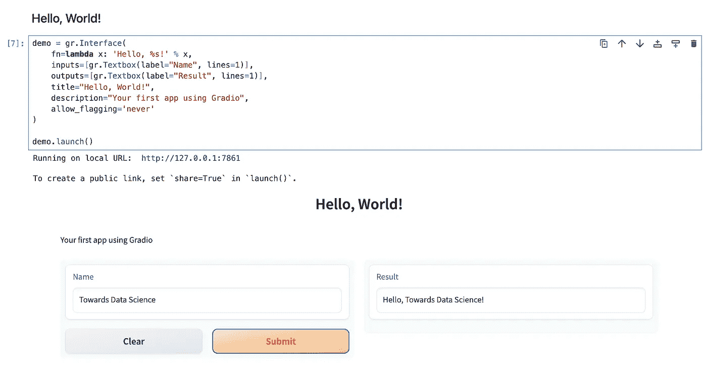
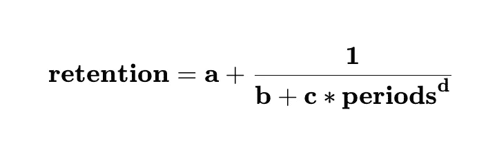
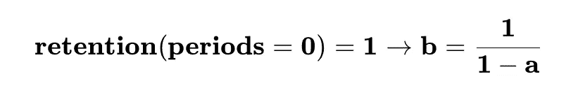
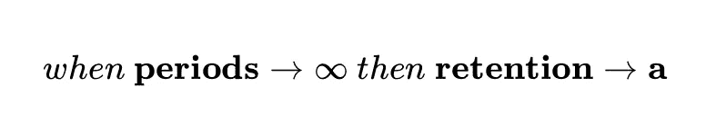
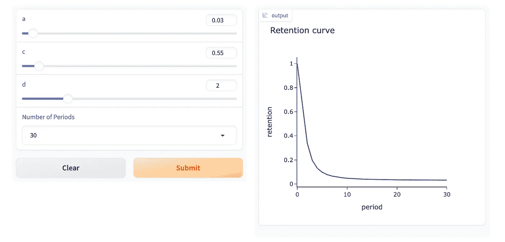
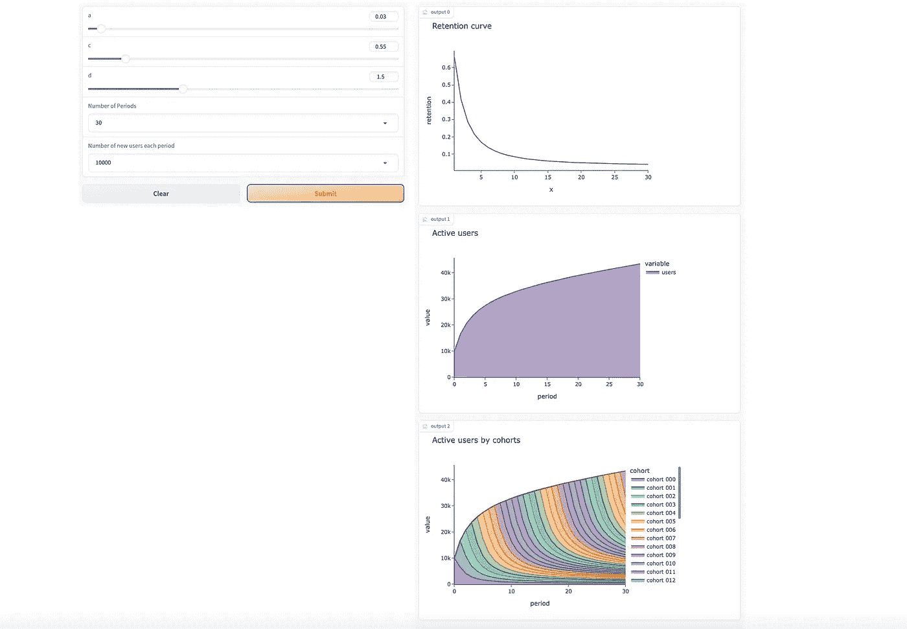
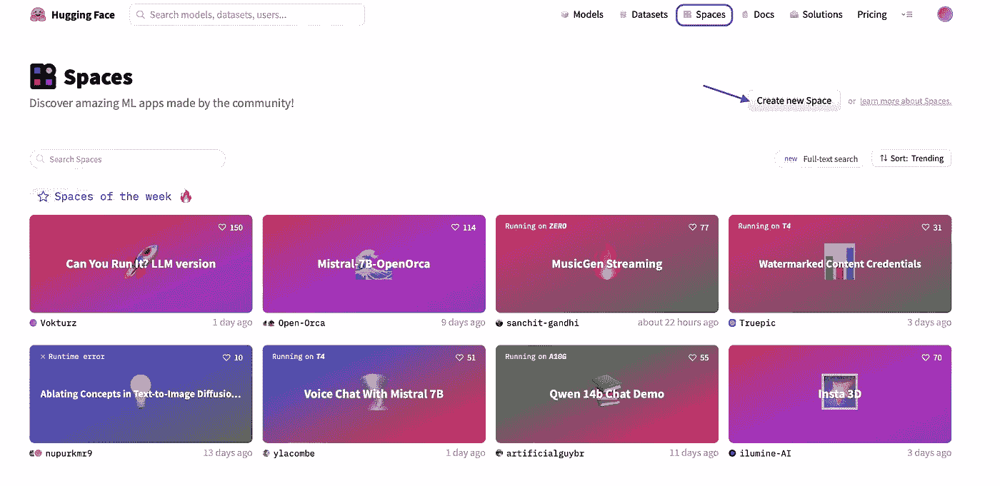
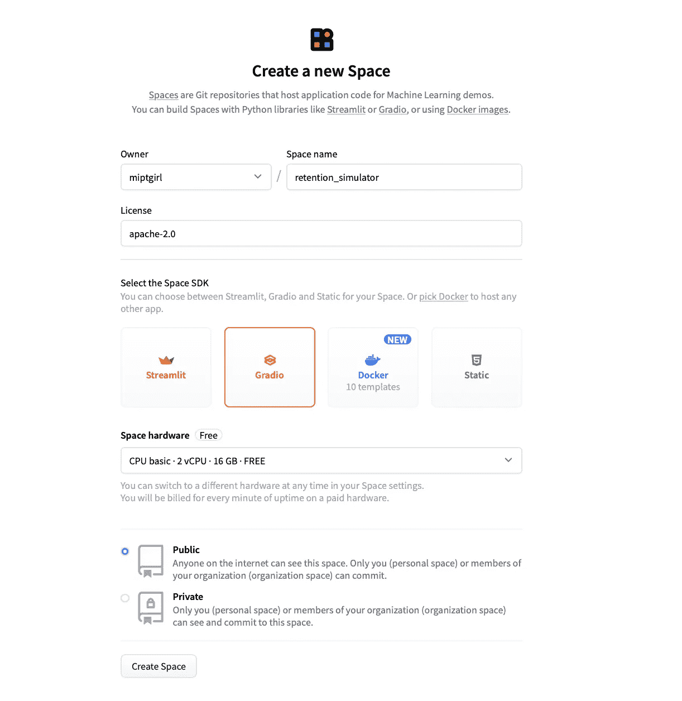
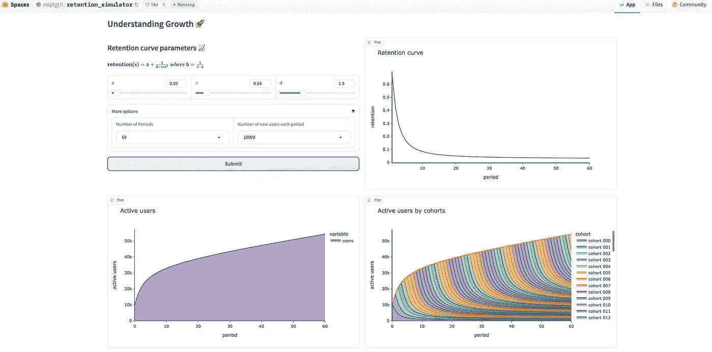
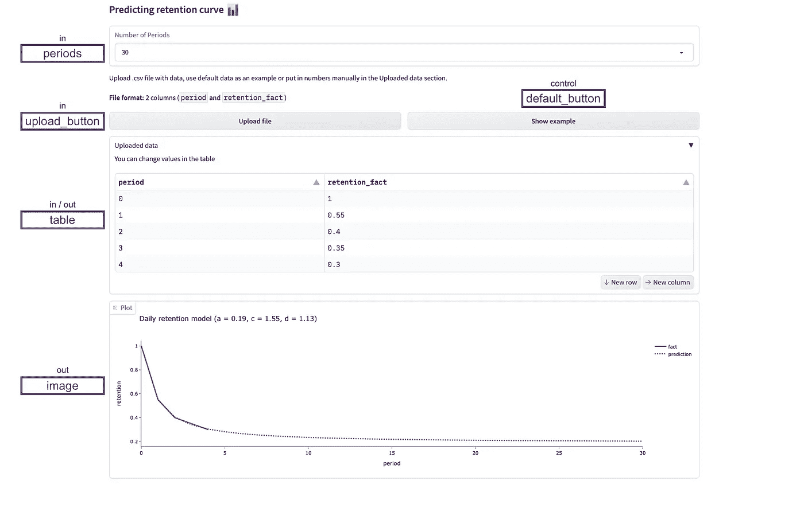

# 使用 Gradio 理解保留率

> 原文：[`towardsdatascience.com/understanding-retention-with-gradio-c288b48918af?source=collection_archive---------3-----------------------#2023-10-21`](https://towardsdatascience.com/understanding-retention-with-gradio-c288b48918af?source=collection_archive---------3-----------------------#2023-10-21)

## 如何利用网络应用程序进行分析

[](https://miptgirl.medium.com/?source=post_page-----c288b48918af--------------------------------)[](https://towardsdatascience.com/?source=post_page-----c288b48918af--------------------------------) [玛利亚·曼苏罗娃](https://miptgirl.medium.com/?source=post_page-----c288b48918af--------------------------------)

·

[关注](https://medium.com/m/signin?actionUrl=https%3A%2F%2Fmedium.com%2F_%2Fsubscribe%2Fuser%2F15a29a4fc6ad&operation=register&redirect=https%3A%2F%2Ftowardsdatascience.com%2Funderstanding-retention-with-gradio-c288b48918af&user=Mariya+Mansurova&userId=15a29a4fc6ad&source=post_page-15a29a4fc6ad----c288b48918af---------------------post_header-----------) 发表在 [Towards Data Science](https://towardsdatascience.com/?source=post_page-----c288b48918af--------------------------------) ·15 min 阅读·2023 年 10 月 21 日[](https://medium.com/m/signin?actionUrl=https%3A%2F%2Fmedium.com%2F_%2Fvote%2Ftowards-data-science%2Fc288b48918af&operation=register&redirect=https%3A%2F%2Ftowardsdatascience.com%2Funderstanding-retention-with-gradio-c288b48918af&user=Mariya+Mansurova&userId=15a29a4fc6ad&source=-----c288b48918af---------------------clap_footer-----------)

--

[](https://medium.com/m/signin?actionUrl=https%3A%2F%2Fmedium.com%2F_%2Fbookmark%2Fp%2Fc288b48918af&operation=register&redirect=https%3A%2F%2Ftowardsdatascience.com%2Funderstanding-retention-with-gradio-c288b48918af&source=-----c288b48918af---------------------bookmark_footer-----------)

图片来源：DALL-E 3

我记得我第一次构建网络应用程序的那一刻。大约在八年前，那时我还是一个相当初级的分析师，并且确信 BI 工具可以解决所有问题。

工程团队构建了一个新 SDK 的原型，并希望了解它是否能更好地收集数据。他们在一组设备上进行测试，查看数据并将其与旧版本进行比较。然而，这组设备不断变化，因此在 BI 工具中保持数据的更新需要相当多的工作。因此，我决定构建一个网络应用程序。

我找了一套文章（如果我没记错的话，大约十篇或十一篇），阅读了它们并尝试将这些知识应用于我的任务。我花了大约一周的时间完成了第一个原型。我必须同时编写后端和前端，因此现在我可以认为自己至少是一个初级全栈开发者。后端我使用了 Flask（我很幸运没有碰到 Django，否则我可能要花整整一个月），前端则使用了 Bootstrap 和 Leaflet。

总体而言，这是一个具有挑战性的任务，需要付出很多努力来提升工程技能。我相信深入了解与你的主要专业领域相关的其他领域总是值得的。

然而，我很高兴的是，如今有许多工具允许分析师和数据科学家在不到一个小时的时间内构建原型。在许多情况下，这些原型可以将你的分析提升到一个新的水平。以下是一些例子：

+   根据输入参数（如营销预算或我们将在何处推出新功能）预测收入和受众，

+   可以加快团队工作速度或减少临时工作量的工具，如 A/B 测试计算器或自动根本原因分析，

+   MVP 解决方案，例如，如果你想使用 LLMs 来自动化一些内部流程，值得在花时间开发生产版本之前先测试一个原型。我在之前的一篇文章中分享了一个这样的 ML 原型，“在一个小时内构建你的第一个深度学习应用”。

在这篇文章中，我想介绍一个这样的框架，它可以帮助你快速且几乎不费力地创建外观美观的网页应用程序，而无需烦恼于 JavaScript 和 CSS。我们将学习 Gradio 的基础知识，开发几个网页应用程序，并将它们发布到 HuggingFace Spaces，以便任何人都可以访问它们。

Gradio 并不是唯一一个这样的框架。还有其他一些开源 Python 替代品：

+   [Streamlit](https://streamlit.io/) 是另一个流行且强大的库，用于用少量代码构建数据应用程序。它也得到了 HuggingFace Spaces 的支持，以便你可以托管这些应用程序。

+   [Dash](https://dash.plotly.com/) 如果你已经习惯了 Plotly，它可能会很方便，并且提供更多的定制能力。

+   不过，如果你想构建一些自定义且复杂的东西，你最后的选择可能是 [Flask](https://flask.palletsprojects.com/en/3.0.x/) 或甚至 [Django](https://www.djangoproject.com/)。

你可以在 这篇文章 中找到有关不同框架主要功能的更多细节。

# Gradio 基础知识

[Gradio](https://www.gradio.app/) 是一个开源的 Python 库，用于构建交互式应用程序。

Gradio 的主要优点是：

+   你可以仅使用 Python 来构建应用程序，这也意味着你可以在应用程序中使用所有 Python 库，

+   你可以在 Jupyter Notebook 中运行它或作为一个单独的网页，

+   你可以在 HuggingFace spaces 上永久托管 Gradio 应用。

没有灵丹妙药，所以 Gradio 有其局限性：

+   它是专为机器学习应用设计的。因此，如果你将它用于其他用途，可能需要更改默认设置（例如，使用 `allow_flagging= "never"` 关闭标记功能）。

+   自定义有限，尤其是在设计方面。

+   我会记住 Gradio 主要是一个用于快速原型开发的框架。它大多工作良好，但偶尔会遇到一些奇怪的行为。例如，Safari 中的表格编辑行为反直觉，或者有时需要重新启动 Jupyter Notebook 以加载界面。

要开始使用 Gradio，我们需要安装 Python 包。

```py
pip install gradio
```

遵循老程序员的传统，让我们从“Hello, World!”开始。

我们可以使用 `gr.Interface` 类来定义界面（[文档](https://www.gradio.app/docs/interface)）。这是 Gradio 的核心类之一，帮助你基于任何 Python 函数创建 Web 应用。

我们需要指定以下参数：

+   `inputs`**:** 界面的输入组件（在我们的例子中，只是一个文本框），

+   `outputs`**:** 界面的输出组件（在我们的例子中，也只是一个文本框），

+   `fn`**:** 核心功能（一个获取输入并返回输出的函数，在我们的例子中，从输入中获取名称并返回“Hello, <name>!”），

+   `title` & `description`**:** 一些 Markdown 让我们的应用更加用户友好。

```py
import gradio as gr

demo = gr.Interface(
    inputs=[gr.Textbox(label="Name", lines=1)],
    outputs=[gr.Textbox(label="Result", lines=1)],
    fn=lambda x: 'Hello, %s!' % x,
    title="Hello, World!",
    description="Your first app using Gradio",
    allow_flagging='never')

demo.launch()
```

你可以在你的 Jupyter Notebook 中运行这段代码，查看结果。这对于调试非常方便。稍后，我们将讨论如何让你的 Web 应用对他人可用。



作者提供的图片

就这样：只需几行代码，你的第一个 Gradio 应用就运行了。我还必须指出，它看起来相当不错，我们没有使用任何前端魔法。

> 当你在 Jupyter Notebook 中工作时，Gradio 会在后台启动许多进程，因此不时使用 `*gr.close_all()*` 关闭连接是值得的。

我们查看了最基本的示例，了解了 Gradio 的构建模块：输入、输出和函数。现在，我们准备开始真实的分析任务。

# 增长模拟

作为第一个示例，我们将研究保留对产品用户增长的影响。

## 保留作为增长的基础

两个参数定义了产品的增长：

+   acquisition（每个周期的新用户数量），

+   retention（保留用户的能力）。

让我们建模用户基础如何根据保留曲线增长。

我们可以使用以下函数和一组参数（`a`、`b`、`c` 和 `d`）来描述任何保留曲线：



让我们谈谈留存的最常见情况：队列由产品中的第一次操作定义，所有操作都计入留存。在这种情况下，`periods = 0`的留存必须等于 1（因为队列入口和留存事件是相同的）。所以，我们可以自动定义其中一个参数：



增长的主要因素是长期留存。它决定了客户是否长期使用产品，以及你的产品是否可持续增长，或者客户在一个月内流失，你是否需要不断获取更多的新用户来实现增长。在我们的公式中，`a`参数负责长期留存。



我们可以使用这个公式来定义留存曲线。所以我们已经拥有了继续开发所需的一切。

## 可视化留存图表

让我们从简单的开始，制作一个接受留存曲线参数并以图表形式显示关系的应用程序。

类似于我们的“Hello, World”示例，我们需要使用`gr.Interface`类并传递`inputs`、`outputs`和`fn`来映射它们。

+   我们现在需要更多的输入参数。因此，`inputs`将是一个控件列表。我们将使用`gr.Slider`和`gr.Dropdown`控件。

    对于[gr.Slider](https://www.gradio.app/docs/slider)，我们需要传递最小值、最大值、默认值和一个标签，我们将在函数中使用。

    对于[gr.Dropdown](https://www.gradio.app/docs/dropdown)，我们需要定义一个可能值的列表、默认值和标签。

+   我们仍然只有一个输出——一个图表，因此`outputs`将是`gr.Plot`，没有任何参数。

+   函数`fn`将把输入映射到输出，因此它将获取输入参数并返回`plotly.Figure`对象进行可视化。

```py
import plotly.express as px

# functions to calculate retention

def get_retention(a, b, c, d, periods):
    return  a + 1./(b + c * (periods ** d))

def get_retention_same_event(a, c, d, periods):
    b = 1./(1 - a)
    return get_retention(a, b, c, d, periods)

# define function - return plot depending on input parameters

def get_retention_plot(a, c, d, num_periods):
    df = pd.DataFrame({'x': range(num_periods + 1)})
    df['retention'] = df.x.map(lambda x: get_retention_same_event(a, c, d, x))

    return px.line(df, x = 'x', y = 'retention', 
                  color_discrete_sequence = px.colors.qualitative.Prism, 
                  title = 'Retention curve', labels = {'x': 'period'})

# define inputs
inputs = [
    gr.Slider(0, 1, 0.03, label="a"),
    gr.Slider(0, 5, 0.55, label="c"),
    gr.Slider(0, 5, 1.5, label="d"),
    gr.Dropdown([10, 30, 60, 90], value = 30, label="Number of Periods"),
    gr.Dropdown([10, 100, 1000, 10000], value = 10000, label="Number of new users each period")
]

# define outputs
outputs = gr.Plot()

# define interface
demo = gr.Interface(
    fn=get_retention_plot,
    inputs=inputs,
    outputs=outputs,
    cache_examples=True,
    allow_flagging = 'never' # hiding default flag functionality in the interface
)

# launch
demo.launch(debug = True)
```

让我们尝试运行这个应用程序。它在工作——我们可以看到一个图表，提交新参数时图表会发生变化。



## 添加更多图表

我们的目标是查看留存对增长的影响，因此我们需要添加不仅展示留存，还展示随时间推移的观众图表。让我们改变一下界面。

为了简化起见，我们假设在每个周期内，相同数量的新用户开始使用我们的产品（`cohort_size`参数）。

我们只需对实现做几个小改动：

+   更改`get_retention_plot`函数，以便它接受一个关于队列大小的新参数，计算随时间变化的用户数量，并返回三个图形。

+   参数`outputs`现在等于三个`gr.Plot()`对象的列表。

```py
 def get_retention_plot(a, c, d, num_periods, cohort_size):
    ret_df = pd.DataFrame({'x': range(num_periods + 1)})
    ret_df['retention'] = ret_df.x.map(lambda x: get_retention_same_event(a, c, d, x))

    ret_fig = px.line(ret_df.iloc[1:], x = 'x', y = 'retention', 
                      color_discrete_sequence = px.colors.qualitative.Prism, 
                      title = 'Retention curve')

    # simulation

    tmp_data = []

    for cohort in range(num_periods + 1):
        for cohort_period in range(num_periods + 1):
            period = cohort_period + cohort
            if period > num_periods:
                continue
            retention = get_retention_same_event(a, c, d, cohort_period)
            tmp_data.append(
                {
                    'cohort': 'cohort %s' % str(cohort).rjust(3, '0'),
                    'cohort_period': cohort_period,
                    'period': period,
                    'retention': retention,
                    'users': int(round(retention * cohort_size))
                }
            )
    users_df = pd.DataFrame(tmp_data)

    users_fig = px.area(users_df.groupby('period').users.sum(),
                    color_discrete_sequence = px.colors.qualitative.Prism, 
                      title = 'Active users')

    cohorts_fig = px.area(users_df.pivot_table(index = 'period', columns = 'cohort', values = 'users',
                    aggfunc = 'sum'),
                    color_discrete_sequence = px.colors.qualitative.Prism, 
                    title = 'Active users by cohorts')

    return ret_fig, users_fig, cohorts_fig

inputs = [
    gr.Slider(0, 1, 0.03, label="a"),
    gr.Slider(0, 5, 0.55, label="c"),
    gr.Slider(0, 5, 1.5, label="d"),
    gr.Dropdown([10, 30, 60, 90], value = 30, label="Number of Periods"),
    gr.Dropdown([10, 100, 1000, 10000], value = 10000, label="Number of new users each period")
]

outputs = [gr.Plot(), gr.Plot(),  gr.Plot()]

demo = gr.Interface(
    fn=get_retention_plot,
    inputs=inputs,
    outputs=outputs,
    allow_flagging = 'never',
    cache_examples=True,
)

demo.launch(debug = True)
```

太棒了，现在我们可以看到完整的画面并分析关系。然而，还有改进的空间——我们可以添加格式以使应用程序对用户更方便。



作者提供的图片

## 添加一些样式

我们可以稍微调整一下界面，使其更加用户友好和直观。

为此，我们将使用 `gr.Blocks()` 作为上下文。[此功能](https://www.gradio.app/docs/blocks)允许您创建更自定义的网页应用程序，并定义布局和数据流（触发函数的事件及其后续执行）。

Blocks 将为我们开启新的机会：

+   使用 `gr.Blocks()`，我们可以使用 `gr.Row()` 和 `gr.Column()` 来组织布局。

+   `gr.Markdown` 允许您添加 markdown 元素，例如标题或甚至带有公式的 LaTeX（默认情况下，您需要将其放在 $ 内部）。

+   `gr.Accordion` 可以帮助您隐藏一些默认不想显示给用户的参数。

+   此外，这种方法允许您定义更复杂的更新逻辑。例如，不仅在提交按钮上更新图表，还可以在任何输入参数发生变化时更新图表。我们将在以下示例中使用此功能。

在使用 Blocks 时，我们需要将每个输入和输出定义为变量，例如，`a = gr.Slider(0, 1, 0.03, label=”a”)`。

此外，没有默认控件，所以我们需要自己定义按钮 —— `btn_caption = gr.Button(“Submit”)`。

按钮点击的操作也必须指定，设置已经熟悉的参数 —— `inputs`、`outputs` 和 `fn`。

```py
btn_caption.click(fn=get_retention_plot, 
        inputs=[a, c, d, num_periods, cohort_size], 
        outputs=[plot1, plot2, plot3])
```

这里是完整的代码版本。

```py
with gr.Blocks() as demo:
    gr.Markdown("# Understanding Growth 🚀")
    with gr.Row():
        with gr.Column():
            gr.Markdown("## Retention curve parameters 📈")
            gr.Markdown(r"$\textbf{retention}(\textsf{x}) = \textsf{a} + \frac{\textsf{1}}{\textsf{b} + \textsf{c} * \textsf{x}^{\textsf{d}}}\ where\ \textsf{b} = \frac{\textsf{1}}{\textsf{1}-\textsf{a}}$")
            with gr.Row():
                a = gr.Slider(0, 1, 0.03, label="a")
                c = gr.Slider(0, 5, 0.55, label="c")
                d = gr.Slider(0, 5, 1.5, label="d")
            with gr.Accordion("More options", open=False):
                with gr.Row():
                    num_periods = gr.Dropdown([10, 30, 60, 90], value = 30, label="Number of Periods")
                    cohort_size = gr.Dropdown([10, 100, 1000, 10000], value = 10000, label="Number of new users each period")
            btn_caption = gr.Button("Submit")
        with gr.Column():
            plot1 = gr.Plot()
    with gr.Row():
        plot2 = gr.Plot()
        plot3 = gr.Plot()

    btn_caption.click(fn=get_retention_plot, 
        inputs=[a, c, d, num_periods, cohort_size], 
        outputs=[plot1, plot2, plot3])

demo.launch()
```

## 托管您的应用程序

此外，我们可以使用 HuggingFace Spaces 来托管我们的网页应用程序，并轻松地与他人分享。

要开始使用 Spaces，您需要有一个账户。如果还没有注册，请访问此[链接](https://huggingface.co/join)。这不会超过几分钟。

下一步是创建一个新的 Space。您可以在[文档](https://huggingface.co/docs/hub/spaces-overview)中找到更详细的说明。



作者提供的图片

对于新的 Space，您必须填写以下参数：名称、许可证和 Gradio 作为您的 SDK。



作者提供的图片

然后，您需要将代码提交到 Hugging Spaces 的 Git 仓库。首先，我们需要克隆仓库。

```py
-- cloning repo
git clone https://huggingface.co/spaces/<your_login>/<your_app_name>
cd <your_app_name>
```

最近，HuggingFace 更改了[Git 认证过程](https://huggingface.co/blog/password-git-deprecation)，所以我们需要先创建一个令牌，然后将其设置到 Git 仓库中。

```py
git remote set-url origin https://<your_login>:<token>@huggingface.co/spaces/<your_login>/<your_app_name>
git pull origin
```

现在，到了提交与我们的应用程序相关的文件的时候。我们至少需要以下文件：

+   包含启动 Gradio 应用程序的 Python 代码的 `app.py`

+   包含您应用程序所需的 Python 包列表的 `requirements.txt` 文件。在我们的情况下，仅需 `pandas` 和 `plotly`。

然后，基本的 git 步骤：添加、提交并推送到 HuggingFaces。

```py
git add app.py
git add requirements.txt
git commit -m 'First version of retention simulator app'
git push
```

构建应用程序花了几分钟，现在完成了。我们的网页应用程序现在已在 HuggingFaces Spaces 上运行。您可以[在这里](https://huggingface.co/spaces/miptgirl/retention_simulator)尝试一下。



作者提供的图片

它比我们最初的版本看起来好很多，因为布局不需要滚动，用户也不需要猜测参数`a`、`c`和`d`的含义。

# 预测保留率

我们已经学会了如何在 Web 应用程序中根据一组参数生成图表。但是在现实生活中，我们通常需要输入大量数据，所以让我们找出如何在应用程序中使用`.csv`文件中的数据。

作为示例，我们将查看前几个周期的实际保留数据，并尝试预测后续周期的保留率。这是一个相当常见的任务，因为我们通常不希望等三个月才能比较新队列的第三个月保留率。我们将上传实际数据作为`.csv`文件。

不要浪费时间，我们直接进入实现部分吧。

## 从文件中获取数据

这是生成整个界面和业务逻辑的代码。它可能看起来有点复杂。不用担心，我们稍后会讨论核心要点。

```py
# parses file or string and returns dataframe
def parse_file(input_text_or_file, num_periods):
    if isinstance(input_text_or_file, str):
        df = pd.read_csv(StringIO(input_text_or_file), sep = '\t')
    else:
        df = pd.read_csv(input_text_or_file.name, sep = '\t')
    return df

# takes dataframe and returns plot
def show_graph_for_df(df, num_periods):
    df['period'] = df.period.map(int)
    df['retention_fact'] = df.retention_fact.map(float)
    result = scipy.optimize.minimize(lambda x: get_mse_for_retention(x, df), [random.random(), random.random(), random.random()])
    a, c, d = result.x

    pred_df = pd.DataFrame({'period': range(num_periods + 1)})
    pred_df['retention_pred'] = pred_df.period.map(lambda x: get_retention_same_event(a, c, d, x))
    pred_df = pred_df.merge(df, how = 'left')

    fig = go.Figure()
    fig.add_trace(go.Scatter(x=pred_df.period, y=pred_df.retention_fact, name='fact',
                             line=dict(color=plotly.colors.qualitative.Prism[0], width=3)))

    fig.add_trace(go.Scatter(x=pred_df.period, y=pred_df.retention_pred, name='prediction',
                             line=dict(color=plotly.colors.qualitative.Prism[0], width=3, dash='dot')))

    fig.update_layout(title='Daily retention model (a = %.2f, c = %.2f, d = %.2f)' % (a, c, d),
                       yaxis_title='retention',
                       xaxis_title='period')
    return fig

# takes file and return plot
def show_graph_for_file(temp_file, num_periods):
    df = parse_file(temp_file, num_periods)
    return show_graph_for_df(df, num_periods)

# hard-coded example of data
default_csv = 'period\tretention_fact\n0\t1\n1\t0.55\n2\t0.4\n3\t0.35\n4\t0.3\n'

# interface 
with gr.Blocks() as demo:
    gr.Markdown('# Predicting retention curve 📊')
    periods = gr.Dropdown([10, 30, 90, 180], label="Number of Periods", value = 30)
    gr.Markdown('Upload .csv file with data, use default data as an example or put in numbers manually in the Uploaded data section.')
    gr.Markdown('''__File format:__ 2 columns (`period` and `retention_fact`)''')

    with gr.Row():
        upload_button = gr.UploadButton(label="Upload file", file_types = ['.csv'], live=True, file_count = "single")
        default_button = gr.Button('Show example')

    with gr.Row():
        with gr.Accordion("Uploaded data", open=False):
            gr.Markdown('You can change values in the table')
            table = gr.Dataframe(type="pandas", col_count=2, interactive = True, headers = ['period', 'retention_fact'])

    with gr.Row():    
        image = gr.Plot()    

    # business logic of triggers and events
    upload_button.upload(fn=show_graph_for_file, inputs=[upload_button, periods], outputs=image, api_name="upload_graph")
    upload_button.upload(fn=parse_file, inputs=[upload_button, periods], outputs=table, api_name="upload_csv")
    default_button.click(fn=lambda x: show_graph_for_file(default_csv, x), inputs=[periods], outputs=image, api_name="upload_example_graph")
    default_button.click(fn=lambda x: parse_file(default_csv, x), inputs=[periods], outputs=table, api_name="upload_example_csv")
    table.change(fn=show_graph_for_df, inputs=[table, periods], outputs=image, api_name="upload_table_graph")
    periods.change(fn=show_graph_for_df, inputs=[table, periods], outputs=image, api_name="upload_periods_graph")

demo.launch(debug=True)
```

让我们更详细地看一下。我们在界面中有以下元素：

+   `periods`——输入参数。

+   `upload_button`——输入参数，允许你从`.csv`文件中加载数据。

+   `default_button`——允许你用预定义的值更新表格和图表作为示例。

+   `table`显示上传数据的数据框（无论是来自`.csv`文件还是示例）；此外，你还可以在表格中直接更改数字，图表将会更新——所以它也是一个输入参数。

+   `image`——输出参数，显示一个图表。



作者提供的图像

函数`parse_file`从`upload_button`获取文件或从默认示例中获取字符串，并返回一个我们可以进一步使用的`pandas`数据框。所以，使用文件中的数据是非常简单的。

关键的业务逻辑在下面的代码片段中定义。它定义了所有界面元素的操作：

+   用于上传`.csv`文件——表格和图表都会更新。

+   用于点击“显示示例”按钮——表格和图表都会更新。

+   用于更改表格中的数据——仅更新图表。

+   用于更改周期数——仅更新图表。

```py
upload_button.upload(fn=show_graph_for_file, inputs=[upload_button, periods], outputs=image, api_name="upload_graph")
upload_button.upload(fn=parse_file, inputs=[upload_button, periods], outputs=table, api_name="upload_csv")

default_button.click(fn=lambda x: show_graph_for_file(default_csv, x), inputs=[periods], outputs=image, api_name="upload_example_graph")
default_button.click(fn=lambda x: parse_file(default_csv, x), inputs=[periods], outputs=table, api_name="upload_example_csv")

table.change(fn=show_graph_for_df, inputs=[table, periods], outputs=image, api_name="upload_table_graph")
periods.change(fn=show_graph_for_df, inputs=[table, periods], outputs=image, api_name="upload_periods_graph")
```

## 定义最佳拟合函数

我们解决问题的关键部分是为实际数据找到最佳拟合函数。让我们看看如何做到这一点。

+   首先，我们定义了一个函数`get_mse_for_retention`，它返回一组参数（`a`、`c`和`d`）的误差。它还接受数据框作为输入。

+   我们使用标准均方误差（MSE）作为我们将要最小化的误差。

+   然后，我们将使用`scipy.optimize.minimize`函数进行优化。我们只需要传递两个参数：要优化的函数（我们传递了一个带有硬编码数据框的 lambda 函数，因为我们只优化参数）和参数的初始值（只是一个随机值的列表）。

+   优化后，我们可以使用`result.x`访问最优参数。

```py
def get_mse_for_retention(params, df):
    tmp_df = df.copy()
    tmp_df['retention_pred'] = tmp_df.index.map(
        lambda x: get_retention_same_event(params[0], params[1], params[2], x)
    )

    tmp_df['se'] = (tmp_df.retention_fact - tmp_df.retention_pred)
    tmp_df['se'] = tmp_df['se']**2

    return tmp_df.se.mean() ** 0.5

result = scipy.optimize.minimize(lambda x: get_mse_for_retention(x, df), [random.random(), random.random(), random.random()])
a, c, d = result.x
print(a, c, d)
```

就这样，现在我们知道了我们实际数据的理论保留曲线，并且可以在应用程序中使用它进行预测。

## 最后一步

我也按照相同的指示将这个应用程序发布到了 HuggingFace Spaces。所以你可以在[这里](https://huggingface.co/spaces/miptgirl/retention_prediction)尝试使用它。

> 你可以在[GitHub](https://github.com/miptgirl/miptgirl_medium/tree/main/gradio_retention_app)上找到这两个应用程序的完整代码。

# 总结

在这篇文章中，我们已经了解了 Gradio 库的基础知识，并学习了如何仅使用 Python 构建愉快的网页应用程序。

我们学到了几种方法：

+   高级`gr.Interface`类，允许你快速获得一个可用的原型。

+   使用`gr.Blocks`的更可定制化的方法，你可以指定所需的确切布局，并定义输入和输出之间的复杂关系。

> 非常感谢你阅读这篇文章。我希望这对你有所启发。如果你有任何后续问题或评论，请在评论区留言。

# 参考

本文的灵感来源于“使用 Gradio 构建生成式 AI 应用程序”[课程](https://www.deeplearning.ai/short-courses/building-generative-ai-applications-with-gradio/)。
