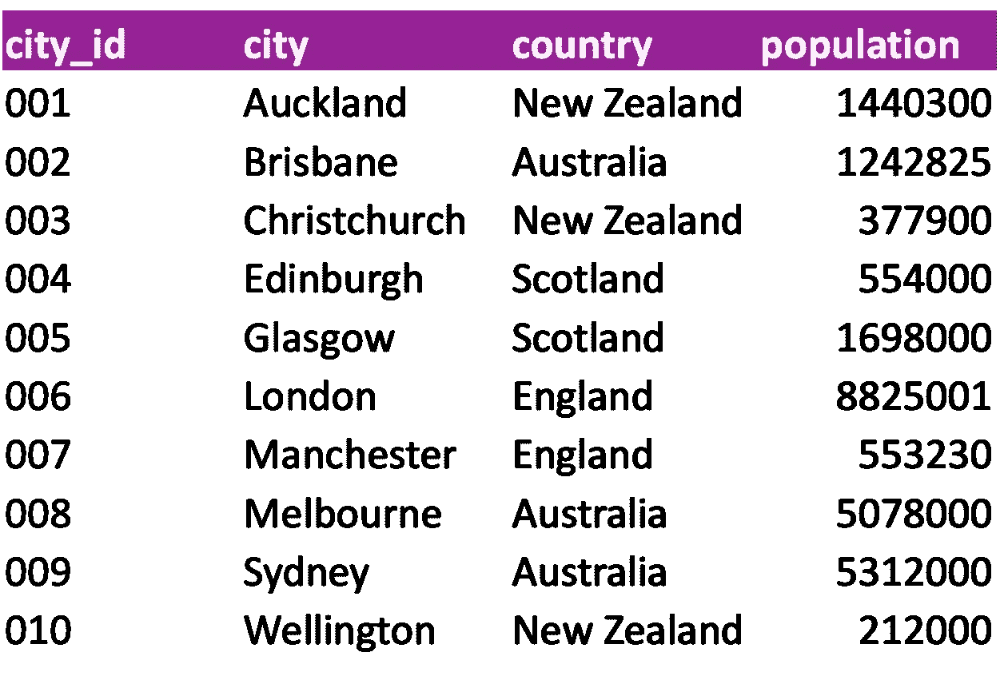

# 理解 SQL：执行顺序

> 原文：[`towardsdatascience.com/understanding-sql-order-of-execution-ba2b4e558828?source=collection_archive---------13-----------------------#2023-04-03`](https://towardsdatascience.com/understanding-sql-order-of-execution-ba2b4e558828?source=collection_archive---------13-----------------------#2023-04-03)

## 关于数据库如何解释你的 SQL 查询的简要指南

[](https://medium.com/@dataforyou?source=post_page-----ba2b4e558828--------------------------------)[](https://towardsdatascience.com/?source=post_page-----ba2b4e558828--------------------------------) [Rob Taylor, PhD](https://medium.com/@dataforyou?source=post_page-----ba2b4e558828--------------------------------)

·

[关注](https://medium.com/m/signin?actionUrl=https%3A%2F%2Fmedium.com%2F_%2Fsubscribe%2Fuser%2F98de080592fc&operation=register&redirect=https%3A%2F%2Ftowardsdatascience.com%2Funderstanding-sql-order-of-execution-ba2b4e558828&user=Rob+Taylor%2C+PhD&userId=98de080592fc&source=post_page-98de080592fc----ba2b4e558828---------------------post_header-----------) 发表在 [Towards Data Science](https://towardsdatascience.com/?source=post_page-----ba2b4e558828--------------------------------) ·7 min 阅读·2023 年 4 月 3 日[](https://medium.com/m/signin?actionUrl=https%3A%2F%2Fmedium.com%2F_%2Fvote%2Ftowards-data-science%2Fba2b4e558828&operation=register&redirect=https%3A%2F%2Ftowardsdatascience.com%2Funderstanding-sql-order-of-execution-ba2b4e558828&user=Rob+Taylor%2C+PhD&userId=98de080592fc&source=-----ba2b4e558828---------------------clap_footer-----------)

--

[](https://medium.com/m/signin?actionUrl=https%3A%2F%2Fmedium.com%2F_%2Fbookmark%2Fp%2Fba2b4e558828&operation=register&redirect=https%3A%2F%2Ftowardsdatascience.com%2Funderstanding-sql-order-of-execution-ba2b4e558828&source=-----ba2b4e558828---------------------bookmark_footer-----------)

图片由 [Wengang Zhai](https://unsplash.com/@wgzhai?utm_source=medium&utm_medium=referral) 提供，来源于 [Unsplash](https://unsplash.com/?utm_source=medium&utm_medium=referral)

## 介绍

编写高效的 SQL 查询是处理大数据量的任何数据分析师必备的技能。我相信我们中的许多人都经历过这样的痛苦：在小规模数据上运行良好的查询，应用到大规模数据集时却慢得令人抓狂。

通常，通过简单了解数据库是如何*解析*查询的，可以显著提高查询性能。这不仅有助于优化查询速度和性能，还能帮助调试和解决错误的脚本。

所以今天，我将带你了解 SQL 查询的执行顺序，并讨论构建查询时出现的一些常见错误。

## 声明式与过程式语言

首先，重要的是要了解 SQL 是一种*声明式*编程语言。这意味着我们定义所需的结果，但不提供*如何*实现它的指令。这与*命令式*或*过程式*语言形成对比，这些语言要求每一步产生输出的过程都必须明确指定。使用像 SQL 这样的声明式语言的含义是，虽然 SQL 期望语句按照特定顺序编写，但语句的评估*顺序*会有所不同。

为了演示，以下是构建 SQL 查询时常用的七个子句及其使用顺序的列表：

```py
1\. SELECT
2\. FROM
3\. WHERE
4\. GROUP BY
5\. HAVING
6\. ORDER BY
7\. LIMIT
```

现在将其与*执行顺序*进行比较：

```py
1\. FROM
2\. WHERE
3\. GROUP BY
4\. HAVING
5\. SELECT
6\. ORDER BY
7\. LIMIT
```

如你所见，语句已经有些打乱。例如，注意到虽然 SELECT 子句*写在*第一位，但在执行时它的位置要低得多。正如我们将很快看到的，执行顺序是最重要的，这是分析师必须特别注意的。

## FROM 子句

自然，数据库需要知道数据的来源，因此这是一个逻辑上的第一步。虽然较简单的查询可能只涉及一个表，但通常情况下，所需的信息存在于多个表中。因此，JOIN 语句与 FROM 语句一起使用，以合并源表。如果需要进行联接，则数据库首先会将所有内容汇集在一起。

这意味着你应该考虑源表的大小、使用的联接类型以及联接中使用的谓词数量。例如，通过仅选择必要的列、筛选掉不必要的行，并确保有共同的标识符以完成联接，来减少源表的大小，这将提高效率。此外，INNER JOIN 应优先于 OUTER JOIN，因为前者通常更快。

最终，你不希望处理不必要的数据，因此将处理的数据集最小化应该是主要目标，尽可能做到这一点。

## WHERE 子句

该子句用于通过仅返回满足给定条件的行来筛选基本表或联接输出。可以使用任何支持的数据类型来过滤记录。例如，考虑下表，它列出了少量英联邦城市及其人口：



一个名为‘cities’的小示例表（作者图片）。

如果我们要将这个表过滤到只包含新西兰的城市，我们可以写出如下查询：

```py
SELECT 
   city
  ,country
FROM 
  cities
WHERE 
  country = 'New Zealand';
```

这将返回包含奥克兰、基督城和惠灵顿的行。或者，如果我们想返回所有人口超过五十万的城市，那么查询将是这样的：

```py
SELECT
   city
  ,country
FROM
  cities
WHERE 
  population > 500000;
```

我们还可以使用 AND 操作符组合这些过滤条件，这样只会返回奥克兰：

```py
SELECT
   city
  ,country
FROM
  cities
WHERE 
  country = 'New Zealand' 
  AND population > 500000;
```

关于 WHERE 子句，有一个重要的事情需要记住，那就是它*不能*用于过滤聚合列。例如，看看下面修改后的查询：

```py
SELECT 
   country
  ,SUM(popualtion) 
FROM 
  cities
WHERE 
  SUM(popualtion) > 5000000
GROUP BY 
  country;
```

上述查询的意图是获取所有城市总人口超过 500 万的国家。不幸的是，这个查询会失败，因为在 WHERE 语句中使用了聚合函数。问题在于聚合函数需要 GROUP BY 子句，而 GROUP BY 子句是在 WHERE 子句*之后*执行的。这意味着 WHERE 条件无法被评估，因为数据库尚未知道任何聚合变量。

我们将很快看到如何解决这个问题，但在此之前，让我们快速了解一下 GROUP BY 子句。

## GROUP BY 子句

正如你可能已经识别的，这个子句允许我们聚合或汇总数量，并与 COUNT()、SUM()、MIN()、MAX() 等函数结合使用。实际上，GROUP BY 将变量或变量组折叠，并为每个不同的元素或元素组合返回一个单一的值。例如，如果我们想统计每个国家的城市人口，我们可以按国家分组，如下所示：

```py
SELECT 
   country
  ,SUM(popualtion) 
FROM 
  cities
GROUP BY 
  country;
```

输出将返回四行 —— 每个国家一行 —— 以及表中列出的每个国家的聚合人口。

## HAVING 子句

这个子句解决了之前尝试使用聚合函数进行过滤时遇到的问题，即 WHERE 子句。HAVING 子句允许我们使用分组和聚合的数据进行结果过滤，因为它是在 GROUP BY 语句*之后*执行的。数据库现在已经知道了这些聚合，这意味着它们可以在所有后续的语句中使用。我们现在可以像这样修改之前的查询：

```py
SELECT 
   country
  ,SUM(population)
FROM 
  cities
GROUP BY 
  country
HAVING 
  SUM(popualtion) > 5000000;
```

这将只返回两个国家：澳大利亚和英国。

## SELECT 子句

SELECT 子句是我们定义所需列的地方，同时还包括任何分组和聚合字段。这也是我们可以使用 AS 操作符应用*列别名*的地方。现在，虽然 select 语句在构建查询时排在首位，但它不会在数据被源化和过滤后执行。这一点很重要，因为这意味着聚合变量和别名*不能*在 WHERE、GROUP BY 或 HAVING 语句中使用。

例如，考虑以下查询，它创建了一个列别名**total_pop**，然后在 HAVING 子句中使用。这个查询会抛出错误，因为别名尚未创建。HAVING 子句*位于* SELECT 子句之前，因此没有名为**total_pop**的引用**。

```py
SELECT 
   country
  ,SUM(population) AS total_pop
FROM 
  cities
GROUP BY 
  country
HAVING 
  total_pop > 5000000;
```

我不会详细讲解这些内容，但 DISTINCT 和 UNION 语句是在 SELECT 之后*执行*，在 ORDER BY 子句之前执行，其中 DISTINCT 在 UNION 之前执行。

## ORDER BY 子句

我们现在接近尾声，许多重要的工作已经完成。我们已经来源（并可能联接）了表，应用了一些过滤，分组并汇总了一些字段，并指定了我们希望在最终表中包含的列。

在这个阶段，你可能会考虑你希望目标表中数据的排列方式。例如，你可能希望按时间顺序排列行，或者基于某些排名值进行排序。这正是 ORDER BY 子句的作用。

这个语句的好处在于，因为它位于排序的后端，我们可以在 GROUP BY 语句中使用聚合和列别名。例如，假设我们想按城市总人口对国家进行排序。我们可以编写如下查询：

```py
SELECT 
   country
  ,SUM(population) AS total_pop
FROM 
  cities
GROUP BY 
  country
ORDER BY
  total_pop;
```

请注意，我们可以在 ORDER BY 语句中使用列别名**total_pop**。默认情况下，这将按升序返回记录（即从小到大）。要按降序返回行，我们可以使用 DESC 运算符，如下所示：

```py
SELECT 
   country
  ,SUM(population) AS total_pop
FROM 
  cities
GROUP BY 
  country
ORDER BY
  total_pop DESC;
```

## LIMIT 子句

在处理大型表时，通常不建议让查询返回所有行，特别是在你仅进行开发和测试时。LIMIT 子句在这里非常有用，允许我们定义希望返回的行数。它也可以与 ORDER BY 子句结合使用，以返回*前 n*或*后 n*条记录。例如，假设我们想要表中人口最多的前三个城市。我们可以如下使用 ORDER BY 和 LIMIT 子句：

```py
SELECT 
   city
  ,country
  ,population AS city_pop
FROM 
  cities
ORDER BY
  city_pop DESC
LIMIT
  3;
```

请注意，并非所有数据库都支持 LIMIT 语句，但它们会有执行类似功能的等效语句。

## 总结

语句执行的顺序是构建 SQL 查询时需要掌握的重要概念，我们已经触及了一些常见的陷阱。虽然我没有提供详细的示例，但我希望这个简短的入门介绍能让你思考如何提高查询性能。如果你刚刚开始接触 SQL，希望这篇文章能帮助你在学习的旅程中前进。

感谢阅读！

如果你喜欢这篇文章并希望保持更新，请考虑[关注我在 Medium 上的账号。](https://medium.com/@dataforyou) 这将确保你不会错过任何新内容。

要获得所有内容的无限访问权，请考虑订阅[Medium](https://medium.com/membership)。

你还可以在 [Twitter](https://twitter.com/dataforyounz)、[LinkedIn](https://www.linkedin.com/in/dataforyou/) 上关注我，或者查看我的 [GitHub](https://github.com/dataforyounz)，如果你更喜欢这样的话 😉
