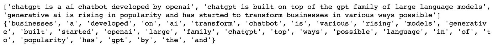
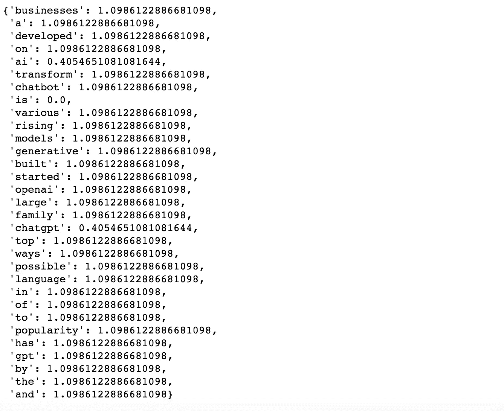
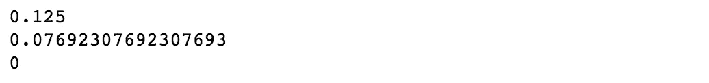
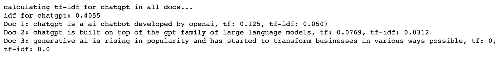
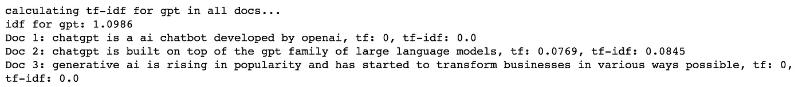
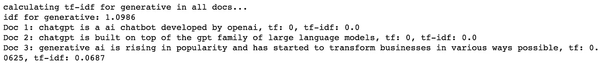
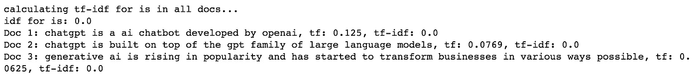
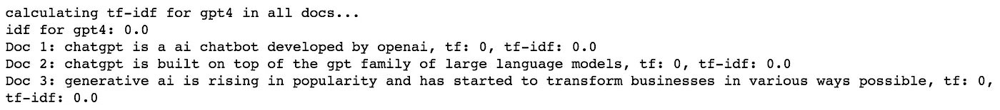
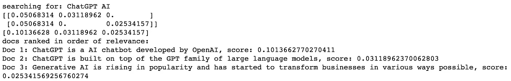
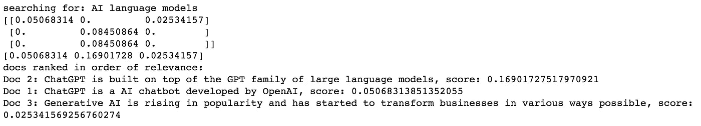

# 了解 TF-IDF：NLP 中的一种传统特征提取方法

> 原文：[`towardsdatascience.com/understanding-tf-idf-a-traditional-approach-to-feature-extraction-in-nlp-a5bfbe04723f`](https://towardsdatascience.com/understanding-tf-idf-a-traditional-approach-to-feature-extraction-in-nlp-a5bfbe04723f)

## 学习 TF-IDF 的基础知识以及如何在 Python 中从零实现它

[](https://itsuncheng.medium.com/?source=post_page-----a5bfbe04723f--------------------------------)[](https://towardsdatascience.com/?source=post_page-----a5bfbe04723f--------------------------------) [Raymond Cheng](https://itsuncheng.medium.com/?source=post_page-----a5bfbe04723f--------------------------------)

·发表于[Towards Data Science](https://towardsdatascience.com/?source=post_page-----a5bfbe04723f--------------------------------) ·阅读时间 9 分钟·2023 年 3 月 30 日

--


照片由[Aaron Burden](https://unsplash.com/@aaronburden?utm_source=medium&utm_medium=referral)拍摄，来源于[Unsplash](https://unsplash.com/?utm_source=medium&utm_medium=referral)

# 介绍

特征提取是[自然语言处理](https://en.m.wikipedia.org/wiki/Natural_language_processing)（NLP）中的一个重要初始步骤，它涉及将文本数据转换为数学表示，通常是向量形式，这被称为[词嵌入](https://en.wikipedia.org/wiki/Word_embedding)。存在各种词嵌入方法，从经典的方法如[word2vec](https://proceedings.neurips.cc/paper/2013/file/9aa42b31882ec039965f3c4923ce901b-Paper.pdf)和[GloVe](https://nlp.stanford.edu/pubs/glove.pdf)到更现代的[BERT](https://arxiv.org/pdf/1810.04805.pdf)嵌入。虽然基于[transformer](https://arxiv.org/pdf/1706.03762.pdf)的嵌入今天主导了 NLP 领域，但了解以前方法的演变仍然是有帮助的。

在本文中，我们将探索一种被称为[TF-IDF](https://en.wikipedia.org/wiki/Tf%E2%80%93idf)的传统特征提取方法，该方法基于统计分析。我们将深入探讨 TF-IDF 及其实现，并提供一个额外的应用以帮助巩固您的理解。因此，请跟随我们，直到最后，揭开 TF-IDF 的方方面面！

# 什么是 TF-IDF？

TF-IDF，全称为词频-逆文档频率，是自然语言处理（NLP）中常用的技术，用于确定文档或语料库中单词的重要性。为了提供一些背景信息，一项[调查](http://nbn-resolving.de/urn:nbn:de:bsz:352-0-311312)显示，2015 年 83%的基于文本的推荐系统在数字图书馆中使用 TF-IDF 来提取文本特征。这表明了这一技术的流行程度。本质上，它通过比较词在特定文档中的频率与其在整个语料库中的频率来衡量词的重要性。其基本假设是，频繁出现在文档中但在语料库中很少出现的词在该文档中尤为重要。

现在，让我们看看计算 TF-IDF 的数学公式：

TF（词频）通过计算词在文档中的出现频率并将其除以文档中的总词数来确定。

`TF = (词在文档中出现的次数) / (文档中的总词数)`

另一方面，IDF（逆文档频率）测量词在整个语料库中的重要性。其计算公式为：

`IDF = log((语料库中的文档总数) / (包含该词的文档数))`

最终，某词在给定文档中的 TF-IDF 分数是该词 TF 和 IDF 分数的乘积。结果的 TF-IDF 分数越高，表明该词在文档中的相对重要性越高。

# 用 Python 实现 TF-IDF

现在我们已经了解了 TF-IDF 的数学计算方法，让我们用 Python 实现它。虽然有库可以更快地计算 TF-IDF 特征，但本文将专注于从头开始构建它。

## 设置和预处理

首先，让我们导入后续需要的必要包，例如来自[collections](https://docs.python.org/3/library/collections.html)模块的[Counter](https://docs.python.org/3/library/collections.html#collections.Counter)类。

```py
import re
import math
from collections import Counter
import numpy as np
```

接下来，我们将定义一个文档/语料库的列表作为示例。我们借用最近围绕[ChatGPT](https://openai.com/blog/chatgpt)和生成性 AI 的热潮。

```py
docs = ["ChatGPT is a AI chatbot developed by OpenAI.",
        "ChatGPT is built on top of the GPT family of large language models.",
        "Generative AI is rising in popularity and has started to transform businesses in various ways possible."]
```

在计算文本特征之前，标准做法是首先对文档进行预处理，如转换为小写、词形还原、词干提取、去除停用词等。在本示例中，我们将文档转换为小写并去除标点符号。然而，根据任务的不同，可以进行更多的预处理，这些步骤可以使用[NLTK](https://www.nltk.org/)或[SpaCy](https://spacy.io/)等 NLP 库来完成。我们还将跟踪语料库中的唯一词汇集。

```py
p_docs = []
tok_set = []
for doc in docs:
    p_doc = re.sub(r'[^\w\s]', '', doc.lower())
    p_docs.append(p_doc)
    tok_set.extend(p_doc.split())

tok_set = set(tok_set)
print(p_docs)
print(tok_set)
```



## 计算语料库中唯一词汇的 IDF

在获得词汇集之后，我们可以使用上述公式计算语料库中每个词的 IDF。

```py
def calculate_idf(p_docs, tok_set):
    idf = {}
    for tok in tok_set:
        N = len(p_docs)
        df = 0
        for doc in p_docs:
            if tok in doc.split():
                df += 1
        idf[tok] = math.log(N/df)
    return idf

idf = calculate_idf(p_docs, tok_set)
print(idf)
```



注意，像“openai”和“gpt”这样的词的 IDF 高于“chatgpt”或“ai”，因为前者在语料库中的出现频率较低。

## 计算每个文档中每个词的 TF

虽然 IDF 是在整个语料库中对每个词计算的，但 TF 是在每个文档中对每个词计算的。使用 TF 的公式，我们可以快速获取文档中某个词的计数，并使用 Counter 类计算其相对频率。

```py
def calculate_tf(tok, p_doc):
    toks = p_doc.split()
    tok_freq = Counter(toks)
    if tok in tok_freq:
        return tok_freq[tok]/len(toks)
    return 0
```

这是“chatgpt”在每个文档中的词频示例。

```py
print(calculate_tf("chatgpt", p_docs[0]))
print(calculate_tf("chatgpt", p_docs[1]))
print(calculate_tf("chatgpt", p_docs[2]))
```



## 最后，进入 TF-IDF

现在，是时候实现 TF-IDF 函数了。我们可以先将之前的预处理代码包装成一个函数，以便在计算 TF-IDF 时调用它。

```py
def prepare_docs(docs):
    p_docs = []
    tok_set = []
    for doc in docs:
        p_doc = re.sub(r'[^\w\s]', '', doc.lower())
        p_docs.append(p_doc)
        tok_set.extend(p_doc.split())

    tok_set = set(tok_set)
    return p_docs, tok_set

def tf_idf(tok, docs):
    p_docs, tok_set = prepare_docs(docs)
    print(f"calculating tf-idf for {tok} in all docs...")
    idf_dict = calculate_idf(p_docs, tok_set)
    idf = idf_dict[tok] if tok in idf_dict else 0.0
    print(f"idf for {tok}: {round(idf, 4)}")
    for i, doc in enumerate(p_docs):
        tf = calculate_tf(tok, doc)
        tf_idf = tf * idf
        print(f"Doc {i+1}: {doc}, tf: {round(tf, 4)}, tf-idf: {round(tf_idf, 4)}")
```

让我们尝试一些示例。

```py
print(tf_idf("chatgpt", docs))
```



```py
print(tf_idf("gpt", docs))
```



```py
print(tf_idf("generative", docs))
```



```py
print(tf_idf("is", docs))
```



```py
print(tf_idf("gpt4", docs))
```



从上面的例子中，我们可以看到“chatgpt”在文档 1 和 2 中的 TF-IDF 高于文档 3，因为该词没有出现在文档 3 中。尽管“chatgpt”在文档 1 和 2 中只出现过一次，但前者的 TF 稍高，因为它的词数更少，从而导致更高的 TF-IDF。

“gpt”在文档 1 和 3 中的 TF-IDF 为 0，因为它们都不包含这个词。文档 2 中有“gpt”，然而，其 TF-IDF 高于文档 1 中“chatgpt”的 TF-IDF，因为它在语料库中的稀有出现超越了第二个文档的较长长度。

“generative”在文档 1 和 2 中的 TF-IDF 为 0，因为没有出现。“is”在所有文档中的 TF-IDF 都为 0，因为它出现在所有文档中。像“gpt4”这样的未登录词也有 TF-IDF 为 0。

这里是如何在 Python 中实现 TF-IDF 的方法。

## 奖励：用 TF-IDF 构建搜索引擎 MVP

TF-IDF 有许多潜在的应用，其中之一是构建搜索引擎。在本节中，我们将探讨如何使用 TF-IDF 构建一个简单的搜索引擎 MVP。我们采取的方法是通过 TF-IDF 词汇的总和来排名文档，总和越高，文档排名越高。

要开始，先修改 `tf_idf` 函数，将 TF-IDF 结果附加到列表中，并将未登录词的 TF-IDF 设置为 0。

```py
def tf_idf(tok, docs):
    p_docs, tok_set = prepare_docs(docs)
    idf_dict = calculate_idf(p_docs, tok_set)
    idf = idf_dict[tok] if tok in idf_dict else 0
    tf_idfs = []
    for i, doc in enumerate(p_docs):
        tf = calculate_tf(tok, doc)
        tf_idf = tf * idf
        tf_idfs.append(tf_idf)
    return tf_idfs
```

通过这个修改，我们现在可以实现搜索引擎。下面的代码计算每个查询词在语料库中的 TF-IDF 值，并按其总和对文档进行排名。

```py
def search_query(query, docs):
    print(f"searching for: {query}")
    terms = query.lower().split()
    score = 0
    tf_idfs = []
    for tok in terms:
        tf_idfs.append(tf_idf(tok, docs))
    tf_idfs = np.array(tf_idfs)
    print(tf_idfs)
    doc_scores = np.sum(tf_idfs, axis=0) # summation of tf_idfs of all query terms for each doc
    print(doc_scores)
    rank_doc = np.argsort(doc_scores)[::-1]
    print("docs ranked in order of relevance:")
    for i in rank_doc:
        print(f"Doc {i+1}: {docs[i]}, score: {doc_scores[i]}")
```

让我们尝试搜索查询“ChatGPT AI”：

```py
print(search_query("ChatGPT AI", docs))
```



我们可以看到，“ChatGPT AI”与文档 1 的相关性最高，因为它的 TF-IDF 最高。这是有道理的，因为“ChatGPT”和“AI”都包含在该文档中，而另外两个文档各自只包含一个术语。

如果我们尝试“AI 语言模型”会发生什么？

```py
print(search_query("AI language models", docs))
```



文档 2 排名最高，因为它包含了两个词项“language”和“models”，而另外两个文档只包含“AI”。在这种情况下，文档 1 排在文档 3 之前，因为它较短，导致词频略高。

就这样，你拥有了一个基于 TF-IDF 的极其简单的搜索引擎！

# 结论

在本文中，我们学习了 TF-IDF，它是什么，它如何工作，以及最重要的，为什么它在现代 NLP 应用中是必需的。我们还实现了 TF-IDF 并展示了如何用它构建一个极简的搜索引擎。如果你不想从头实现它，可以使用 `[sklearn.feature_extraction.text.TfidfVectorizer](https://scikit-learn.org/stable/modules/generated/sklearn.feature_extraction.text.TfidfVectorizer.html)` 更快地实现它。这里有两个很好的博客文章介绍了如何使用它：[1](https://www.analyticsvidhya.com/blog/2021/11/how-sklearns-tfidfvectorizer-calculates-tf-idf-values/) 和 [2](https://okan.cloud/posts/2022-01-16-text-vectorization-using-python-tf-idf/)。

TF-IDF 并不是文本特征提取的唯一方法。还有许多其他方法可能表现更好，值得了解它们。尽管如此，它仍然是一种流行的文本特征方法，我们可能会在未来涵盖更近期的方法。

感谢阅读。如果这对你有帮助，随时关注我并订阅更多即将发布的文章。

希望你度过了一段愉快的时光。

干杯。

# 参考文献

[1] Mikolov, Tomas 等. “词语和短语的分布式表示及其组合性。” *神经信息处理系统进展* 26 (2013)。

[2] Pennington, Jeffrey, Richard Socher 和 Christopher D. Manning. “Glove：词表示的全局向量。” *2014 年自然语言处理经验方法会议（EMNLP）论文集*。2014。

[3] Devlin, Jacob 等. “Bert：用于语言理解的深度双向变换器预训练。” *arXiv 预印本 arXiv:1810.04805* (2018)。

[4] Vaswani, Ashish 等. “注意力即一切。” *神经信息处理系统进展* 30 (2017)。

[5] Beel, Joeran 等. “论文推荐系统：文献综述。” *国际数字图书馆期刊* 17 (2016): 305–338。

[6] “如何 sklearn 的 Tfidfvectorizer 计算 tf-idf 值”，Analytics Vidhya，[`www.analyticsvidhya.com/blog/2021/11/how-sklearns-tfidfvectorizer-calculates-tf-idf-values/`](https://www.analyticsvidhya.com/blog/2021/11/how-sklearns-tfidfvectorizer-calculates-tf-idf-values/)

[7] “使用 Python 进行文本向量化：TF-IDF”，Okan Bulut，[`okan.cloud/posts/2022-01-16-text-vectorization-using-python-tf-idf/`](https://okan.cloud/posts/2022-01-16-text-vectorization-using-python-tf-idf/)

[8] “理解机器学习中的 TF-IDF”，Capital One，[`www.capitalone.com/tech/machine-learning/understanding-tf-idf/`](https://www.capitalone.com/tech/machine-learning/understanding-tf-idf/)

[9] “理解 TF-IDF：一个简单的介绍”，MonkeyLearn，[`monkeylearn.com/blog/what-is-tf-idf/`](https://monkeylearn.com/blog/what-is-tf-idf/)
