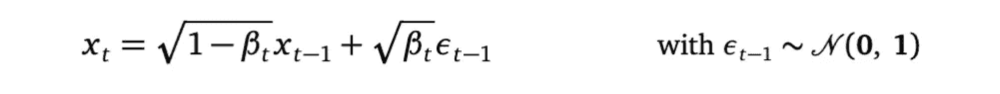
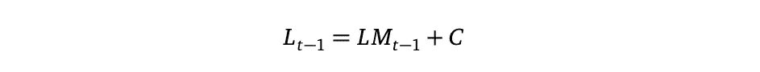
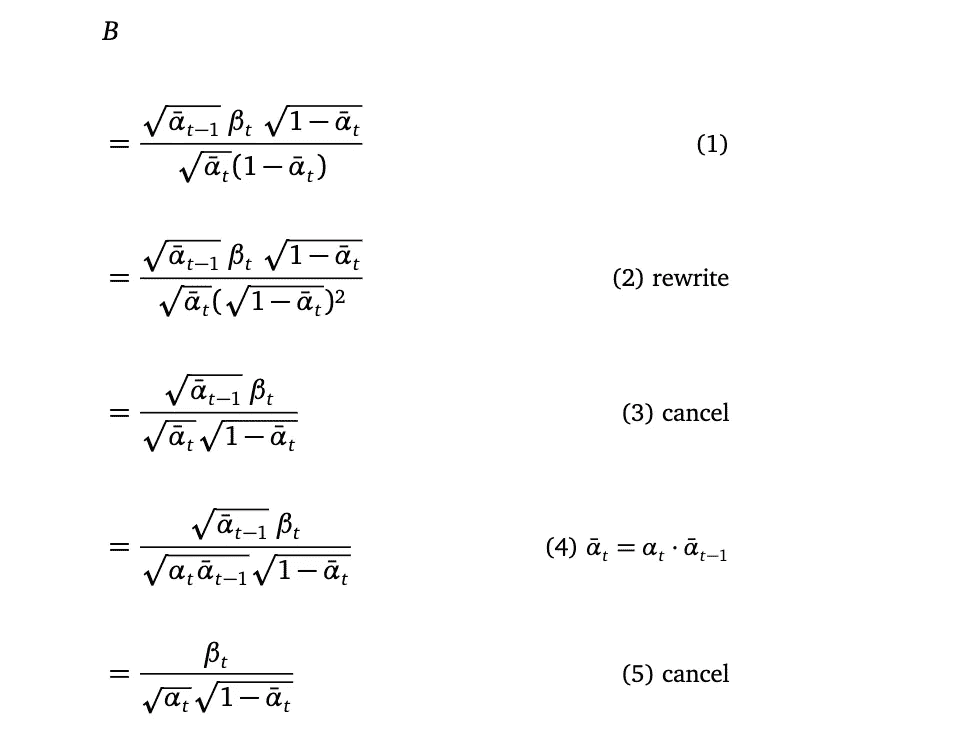
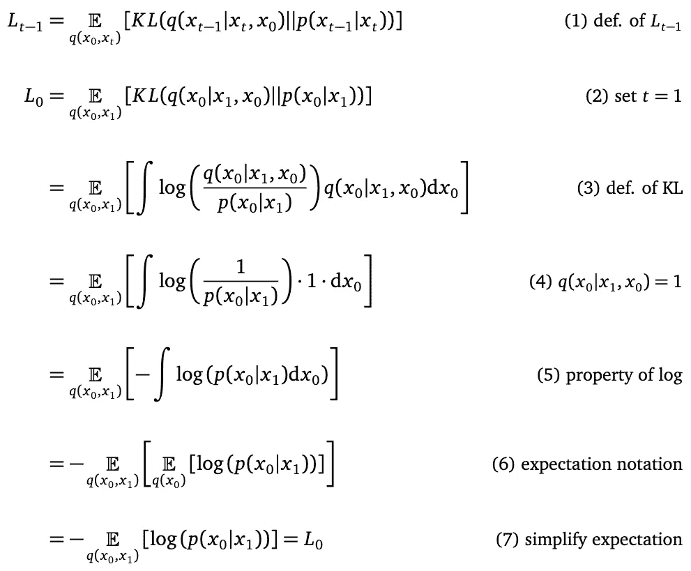
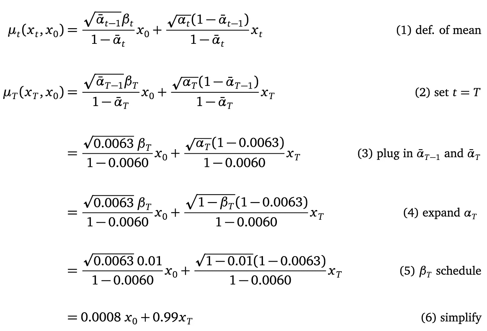

# 以苏格拉底式的方法理解去噪扩散概率模型（DDPMs）

> 原文：[`towardsdatascience.com/understanding-the-denoising-diffusion-probabilistic-model-the-socratic-way-445c1bdc5756`](https://towardsdatascience.com/understanding-the-denoising-diffusion-probabilistic-model-the-socratic-way-445c1bdc5756)

## 深入探讨去噪扩散模型背后的动机以及损失函数的详细推导

 [Wei Yi](https://jasonweiyi.medium.com/?source=post_page-----445c1bdc5756--------------------------------)

·发表于 [Towards Data Science](https://towardsdatascience.com/?source=post_page-----445c1bdc5756--------------------------------) ·69 分钟阅读·2023 年 2 月 25 日

--

由 [Chaozzy Lin](https://unsplash.com/@chaozzy?utm_source=medium&utm_medium=referral) 拍摄的照片，来源于 [Unsplash](https://unsplash.com/?utm_source=medium&utm_medium=referral)

[去噪扩散概率模型](https://arxiv.org/pdf/2006.11239.pdf)由 Jonathan Ho 等人提出，是一篇很棒的论文。但我在理解它时遇到了困难。因此，我决定深入研究这个模型，并完成所有的推导。在这篇文章中，我将重点关注理解论文的两个主要障碍：

1.  为什么去噪扩散模型的设计涉及前向过程、前向过程后验和反向过程。这些过程之间有什么关系？顺便提一下，在这篇文章中，我称前向过程后验为“前向过程的反向”，因为我发现“后验”这个词让我困惑，或者我潜意识中想要避免这个词，因为它让我感到恐惧——每次出现它的时候，事情就变得复杂起来。

1.  如何推导神秘的损失函数。在论文中，推导损失函数 *Lₛᵢₘₚₗₑ* 的过程中有很多省略步骤。我经过了所有的推导，填补了遗漏的步骤。现在我意识到，*Lₛᵢₘₚₗₑ* 的解析公式推导讲述了一个真正美丽的贝叶斯故事。在填补了所有步骤之后，整个故事变得容易理解。

# 一些符号

Medium 支持文本中的 Unicode，这使得我能够书写许多数学下标符号，比如 *x₀* 和 *xₜ*。但我无法书写其他一些下标。例如：

对于这些内容，我将使用下划线“_”来引导下标，比如 *x_T* 和 *p(x_0:T)*。

如果某些数学符号在你的手机上显示为问号，请尝试在计算机上阅读本文。这是一个已知的 Unicode 渲染问题。

# 从噪声中生成自然图像的任务

我们的目标是使用神经网络从噪声中生成自然图像。神经网络的输入是噪声，输出应该是自然图像，例如人脸。不同的噪声将产生不同的自然图像，例如，一种噪声可能会产生女性的面孔，另一种噪声可能会产生男性的面孔。

你可能会问，什么样的噪声？在没有其他约束的情况下，热衷于贝叶斯方法的研究者会从高斯噪声开始。

这种噪声的维度是多少呢？理想的输出是一个具有红绿蓝（RGB）值的彩色二维图像。我们先将彩色图像简化为[0, 255]之间的灰度值，然后将灰度值缩放到[0, 1]的范围内。接着将这个二维缩放后的灰度值数组重塑为一个长的一维向量，长度为*d*。我将在文章中多次提到名称*d*。我们就以上内容作为图像生成任务的简单定义。但请注意，实际上，神经网络可以直接生成彩色图像。

自然的假设是输入噪声的维度和结构与输出图像的维度和结构相同，即长度为*d*的向量。因此，噪声应该是*d*维的多变量标准高斯分布*N*(**0**, **1**)，这是一种学术上的默认设置。

现在，从噪声生成图像的任务变得更加具体：设计一个神经网络，该网络从*d*维的多变量标准高斯分布中获取一个样本，并输出一个*d*维的缩放灰度值向量。将输出向量转化为二维形状和 RGB 颜色是我们都知道的[如何](https://lukemelas.github.io/image-colorization.html)做到的，这不在本文讨论范围之内。

# 迭代生成图像

一步生成自然图像从噪声中是困难的。那么在多个较小步骤中生成图像怎么样呢？有点类似于让图像从老式摄影中的柯达胶卷中显现出来。这样，在每一步中，神经网络的任务应该更简单，因为每一步的输入和输出比从纯噪声到最终自然图像要更相似。

这种迭代生成的想法带来了一个自身的问题。那么中间图像应该是什么样的？有经验的老一辈（像我这样）可能会建议中间图像应该是渐进的——在这个迭代过程中，不应出现首先出现一只猫的图像，然后猫变成了一个人的脸的情况。

对中间图像的“渐进性”约束是有道理的。但是如何将其数学化呢？

## 正向过程将自然图像转变为噪声

尽管尚不清楚如何定义迭代生成过程的逐步性，但定义相反的过程，即通过逐步添加一点高斯噪声将自然图像转变为纯噪声的过程却很简单。

将自然图像通过逐步添加噪声转变为纯噪声的过程称为*前向扩散过程*，简称*前向过程*。

## 反向过程将噪声转变为自然图像

另一方面，将高斯噪声转变为自然图像的过程称为*反向过程*。

## 前向和反向过程的示意图

下面的图来自论文，展示了这两个过程，前向过程在底部，反向过程在顶部。

图片来自论文 [去噪扩散概率模型](https://arxiv.org/pdf/2006.11239.pdf)，第 2 页

在图中，*x₀, x₁*，*x₂*、…、*x_T* 是*d*维多变量高斯随机变量。我们使用随机变量*x₀*来表示自然图像。这意味着如果我们从*x₀*的概率密度函数中抽取一个样本，这个样本向量一旦重新排列成 2D 图像，应该看起来像一幅灰度自然图像。我们还没有讨论*x₀*的概率密度函数的具体形式。我稍后会讲到。

在图中，随机变量*x₁*、*x₂*、…、*x_T*对应于中间图像，即添加了噪声的图像（如果我们看底部的前向过程），或者移除了噪声的图像（如果我们看顶部的反向过程）。稍后，我还会介绍这些随机变量的概率密度函数，分别从前向过程和反向过程的角度来看。

记住*x₀*是自然图像，*x_T*是纯噪声，而不是反过来，请记住：小下标，小噪声，大下标，大噪声。这个想法来源于[这个视频](https://www.youtube.com/watch?v=HoKDTa5jHvg)。

现在有一种方法可以数学地定义中间图像的逐步性。每个从反向过程中生成的图像*xₜ*必须接近（别担心，我们稍后会定义“接近”是什么意思）从前向过程中扩散得到的相应图像。

# 前向过程

前向过程是一个概率模型。为什么？因为每一步都向图像中添加了高斯噪声。因此，结果不是确定性的——从相同的自然图像*x₀*开始，你可能会得到不同的标准多变量高斯噪声样本*x_T*。就像在不同时间将墨水滴入一杯水中，每次都会得到不同的扩散效果。

在这个概率模型中，*x₀, x₁*，… 到 *x_T* 是随机变量。每个都是*d*维随机变量。

由于前向过程是概率性的，因此讨论它的适当数学工具是概率密度函数和概率理论。

上图使用 *q(xₜ|xₜ₋₁)* 来表示前向扩散过程中从图像 *xₜ* 到图像 *xₜ₋₁* 的单步概率密度函数。我们将其概率密度函数定义为：

前向过程在固定均值向量和协方差矩阵的条件下

*βₜ* 是一个随时间变化的值，很像是调度学习率*。*

使用重参数化技巧（参见推导 [这里](https://lilianweng.github.io/posts/2021-07-11-diffusion-models/)），随机变量 *xₜ* 可以等效地描述为：

其中 *ϵₜ₋₁* 是 *d*-维标准高斯噪声。这个公式揭示了更嘈杂的图像 *xₜ* 是较少噪声图像 *xₜ₋₁* 和某些噪声 *ϵₜ₋₁* 之间的加权平均。换句话说，前向过程将噪声 *ϵₜ₋₁* 添加到较少噪声的图像 *xₜ₋₁* 中。*βₜ* 的值控制了在时间戳 *t* 上添加的噪声量。这就是为什么 *βₜ* 被安排为非常小的值，从 *β₁=10⁻⁴* 到 *β_T=10⁻²*。而 *T* 被设置为 1000——否则噪声将迅速主导前向过程。

*q(xₜ|xₜ₋₁)* 是随机变量 *xₜ* 的概率密度函数，它描述了前向过程中的单一步骤。以下的联合概率密度函数描述了整个前向过程：

这是前向过程 *q(x_1:T|x₀)* 的*第一次分解*。

为什么前向过程的联合概率密度函数 *q(x_1:T|x₀)* 会依赖于随机变量 *x₀*？这是因为当 *t=1* 时，*q(xₜ|xₜ₋₁)* 变成了 *q(x₁|x₀)*，其中提到了 *x₀*。

**随机变量依赖性**

由于本文将讨论许多随机变量依赖于其他随机变量的情况，让我们以 *q(x₁|x₀)* 为例来阐明**随机变量 *x₁* 依赖于随机变量 *x₀* 的含义**。以下推导展示了 *q(x₁|x₀)* 的概率密度函数。

*q(x₁|x₀)* 的概率密度函数公式

我们将 *q(x₁|x₀)* 定义为多元高斯，在线（2）中用 *N(x₁; mean vector, covariance matrix)* 符号表示，因为多元高斯分布完全由其均值向量和协方差矩阵指定。“完全指定”意味着在写下均值向量和协方差矩阵后，多元高斯分布是一个固定函数，其结构，如指数函数、行列式，如在（3）行中由字母 *N* 假定。

然后，在第（3）行中，我们将此符号扩展为多变量高斯分布的概率密度函数的数学公式。*d* 是随机变量 *x₁* 的维度，即图像中的像素数量 *height×width*。[*det*](https://en.wikipedia.org/wiki/Determinant) 是行列式函数。

因此，很明显，第（3）行是随机变量 *x₁* 的概率密度函数。从第（3）行，我们还知道以下几点：

首先，作为随机变量 *x₁* 的概率密度函数，第（3）行的函数在 *x₁* 的定义域上 **积分为 1**。这是因为所有适当的概率密度函数都积分为 1。

*q(x₁|x₀) 在 x₁ 的定义域上积分为 1*

其次，第（3）行是随机变量 *x₁* 的概率密度函数，但它也提到了另一个随机变量 *x₀*。这就是为什么随机变量 *x₁* **依赖于** 随机变量 *x₀*——评估 *q(x₁|x₀)* 对某个 *x₁* 的值需要一个 *x₀* 的值。

现在你可能会问，我们能否将第（3）行视为随机变量 *x₀* 的概率密度函数，并说 *x₀* 依赖于随机变量 *x₁*？

答案是否定的。确实，从数学函数的角度来看，我们可以将 *q(x₁|x₀)*，第（3）行*，* 解释为 *x₁* 的单一参数函数或 *x₀* 的单一参数函数。但是，第（3）行不是随机变量 *x₀* 的适当概率密度函数，因为它在 *x₀* 的定义域上不积分为 1。

**随机变量 *x₀* 的概率密度函数？***

在明确第（3）行不能被解释为随机变量 *x₀* 的概率密度函数后，一个自然的后续问题是：我们是否知道 *x₀* 的概率密度函数 *q(x₀)*？

不，我们不知道。*q(x₀)* 描述了自然图像的概率。这意味着：

1.  给定自然图像，假设 *X₀*，将 *X₀* 代入 *q(x₀=X₀)* 应返回一个介于 0 和 1 之间的概率值，以指示这个自然图像在所有自然图像中出现的可能性。

1.  总结起来，或者说，积分，所有自然图像的 *q(x₀)* 概率值给我们 *1*。

显然，像往常一样，我们不知道 *q(x₀)* 的解析公式。但这并不妨碍我们写下其符号，并为随机变量 *x₀* 绘制样本——我们只是从自然图像的训练集中随机挑选一张图像。

正向过程由 *T+1* 个随机变量 *x₀, x₁* 到 *x_T* 组成。它们形成了两组：

+   *x₀*：有关于随机变量 *x₀* 的观测。观测是来自训练数据集的实际图像。我们称 *x₀* 为观测随机变量。

+   *x₁* 到 *x_T*：对它们没有观测，因此它们是 *潜在随机变量*。

正向过程的定义带来了三个重要属性。

## **属性 1：完全联合概率密度函数 *q(x_0:T)***

联合概率密度函数表示轨迹。从视觉上看，完全的联合概率密度函数*q(x_0:T)*描述了图像的可能轨迹集合。每条轨迹由*T+1*幅图像组成，其中*x₀*表示无噪声图像，*x_T*表示纯噪声图像。

以下插图展示了从两个自然图像*X₀*和*X₁*开始的一些轨迹。这些轨迹以不同的纯噪声图像结束，表明前向过程具有概率性。这是插图，因为我手绘了这幅图——并不是说从*X₀*开始的轨迹与从*X₁*开始的轨迹没有重叠。

手绘插图，由我制作

插图还显示在时间戳*t*，随机变量*xₜ*负责解释前向过程在此时间戳生成的所有可能图像。

## **属性 2: 边际概率密度函数 *q(xₜ|x₀)***

通过重复使用重参数化技巧（见推导 [这里](https://lilianweng.github.io/posts/2021-07-11-diffusion-models/)）给我们每个潜在随机变量的概率密度函数，而无需依赖其他潜在随机变量，因此得到的概率密度称为边际：

前向过程边际

其中

这个属性揭示了给定*x₀*时，潜在随机变量 xₜ不再依赖于潜在随机变量*xₜ₋₁*。换句话说，给定*x₀*时，潜在随机变量*x₁*到*x_T*彼此独立。

对于独立随机变量*a*和*b*，概率论中的乘积规则是*p(a, b) = p(a) p(b)*。应用乘积规则给我们*q(x_1:T|x₀)*的*第二个因式分解*：

这两个因式分解是等效的，意味着它们描述了相同随机变量集合的联合概率分布。有时我们会选择其中一个以简化公式推导。

## **属性 3: 前向过程的逆过程 q(***xₜ₋₁|*xₜ, *x₀)*

使用贝叶斯规则，可以推导出前向过程的逆过程的概率密度函数。在论文中，前向过程的逆过程称为前向过程后验。但我发现“后验”这个词在这篇文章中容易引起混淆。

让我们从前向过程*q(xₜ|xₜ₋₁)*开始，它是随机变量*xₜ*的概率密度函数：

注意，我们可以将冗余的条件随机变量 *x₀* 加入到 *q(xₜ|xₜ₋₁)* 中，将其变成 *q(xₜ|xₜ₋₁, x₀)*，因为根据定义，给定 *xₜ₋₁*，随机变量 *xₜ* 不依赖于任何其他随机变量。因此，添加 *x₀* 作为依赖项不会改变 *xₜ* 的概率密度。

然而，*xₜ* 在 *q(xₜ|x₀)* 和 *xₜ₋₁* 在 *q(xₜ₋₁|x₀)* 中确实依赖于 *x₀*。我们知道 *q(xₜ|x₀)* 和 *q(xₜ₋₁|x₀)* 的公式来自于上述边际概率密度的属性 2。

通过重新排列项，我们可以推导出前向过程逆过程的概率密度函数：

使用贝叶斯规则推导前向过程逆过程中的条件

首先，请注意当 *t=1* 时，*q(xₜ₋₁|xₜ, x₀)* 变成 *q(x₀|x₁, x₀)*，其中 *x₀* 同时出现在“|”的左右两边。量 *q(x₀|x₁, x₀)* 总是等于 *1*，因为在给定 *x₀* 的情况下，*x₀* 的概率是 *1*。为什么？因为 *x₀* 已经发生，对它没有不确定性了。

记住这一点，当你看到第一个解析损失函数从 *t=2* 开始时，你会微笑。而当我们扩展损失函数以涵盖 *t=1* 的情况时，你将再次微笑。

方程 *q(xₜ₋₁|xₜ, x₀)* 的左边告诉我们这是一个将更嘈杂的图像 *xₜ* 转换为较少噪声的图像 *xₜ₋₁ —* 的过程，请记住大下标表示更多噪声，小下标表示较少噪声。因此，*q(xₜ₋₁|xₜ, x₀)* 描述了与前向过程相反的过程。我们称之为前向过程的逆过程。

方程的右边告诉我们 *q(xₜ₋₁|xₜ, x₀)* 由前向过程概率密度 *q(xₜ|xₜ₋₁)* 定义，通过 *q(xₜ₋₁|x₀)/q(xₜ|x₀)* 进行缩放。我们已经定义了这三个组成部分。如果将它们代入方程的右边，并耐心简化公式，你将看到 *q(xₜ₋₁|xₜ, x₀)* 是一个多元高斯分布，它由其均值向量和协方差矩阵完全指定。经过忽略不计的数学推导后，我们得到：

前向过程条件的逆过程

与

前向过程条件的固定均值向量和协方差矩阵

我们可以看到* xₜ *的均值向量是* x₀ *和* xₜ *之间的加权和。这两个随机变量前面的权重取决于时间戳*t*。协方差矩阵也是一个依赖于时间戳*t*的量。均值向量和协方差矩阵都没有提到可训练参数（我们稍后将介绍可训练参数）。

反向过程很重要，因为它描述了我们确切想要的生成过程——一个将噪声逐渐转变为自然图像的过程，即去噪。当然，这只是贝叶斯规则在说话，我们想亲自看到反向过程是否真正能够提供这种去噪能力。我们可以通过研究反向过程开始时和结束时的采样图像来找到答案。

但要全面理解去噪模型还需要很多数学知识，我不想用每一个细节来折磨你。所以如果你愿意相信我的话，反向过程以**接近纯高斯噪声**的嘈杂图像开始，以**接近*x₀***的图像结束，即反向过程以此为条件的自然图像。换句话说，反向过程将嘈杂图像去噪成自然图像。如果你仍然渴望更多数学内容，关于反向过程开始和结束的推导在附录*“反向过程从哪里开始和结束”*中。

注意“反向过程的开始是接近**纯高斯噪声**的嘈杂图像”这句话。它是*接近*纯高斯噪声，而不是*等于*纯高斯噪声，因为反向过程*q(xₜ₋₁|xₜ, x₀)*是以初始图像*x₀*为条件的（详细信息见附录）。正是这种初始图像*x₀*的参与使得反向过程能够在最后生成一个非常接近*x₀*的图像。

一方面，在反向过程*q(xₜ₋₁|xₜ, x₀)*的定义中对初始图像*x₀*的条件是不可避免的。这是因为*q(xₜ₋₁|xₜ, x₀)*是通过对前向过程*q(xₜ|xₜ₋₁)*应用贝叶斯规则得到的，当*t=1*时包含了随机变量*x₀*。而贝叶斯规则的应用不会去除任何随机变量。

另一方面，反向过程对初始图像*x₀*的条件有明确的直观。这种直观将在我们介绍反向过程后变得清晰。

# 反向过程

图顶端是反向过程*p(xₜ₋₁|xₜ)*。反向过程从更嘈杂的图像*xₜ*生成一个噪声较少的新图像*xₜ₋₁*，与反向过程*q(xₜ₋₁|xₜ, x₀)*相同。注意图中使用了符号*p_θ*，但我决定使用*p*，因为*p_θ*在 Medium 上不好看。

逆过程必须包含与前向过程的逆过程相同的一组随机变量 *x₀, x₁* 到 *x_T*，因为我们希望在逆过程和前向过程的逆之间建立“逐步性”对应关系。换句话说，既然前向过程的逆过程已经告诉我们如何逐步去除图像中的噪声，我们希望我们的神经网络在每一步都模仿这一过程。我们传达逐步模仿要求的方式是要求逆过程中的随机变量 *xₜ* 行为类似于前向过程的逆过程中的对应随机变量。

由于前向过程的逆过程是使用多元高斯分布定义的，因此使用多元高斯分布定义逆过程也是合理的：

逆过程定义

在归纳公式中，*p(xₜ₋₁|xₜ)*，均值向量 *μₚ(xₜ, t)* 和协方差矩阵 *Σₚ(xₜ, t)* 实际上是两个深度神经网络，预测多元高斯分布的 *d* 维均值和 *d×d* 维协方差矩阵。

在基础公式中，*p(x_T)* 是标准的多元高斯分布，这确认了逆过程从纯噪声开始。请注意，逆过程的起始点不依赖于任何随机变量，这与前向过程的逆情况不同。

在联合概率的情况下，符号*p(x_0:T)* 是*p(x₀, x₁, …, x_T)* 的简写。它表示了*T+1*个随机变量的概率密度函数。联合概率的公式是归纳情况和基础情况中所有项的乘积，遵循概率理论的基本性质。

神经网络 *μₚ(xₜ, t)* 和 *Σₚ(xₜ, t)* 接受两个输入，第一个是噪声图像 *xₜ*，第二个是时间戳 *t*。噪声图像 *xₜ* 是有意义的。毕竟，我们希望使用神经网络来去噪。但是如何理解时间戳 *t* 作为神经网络的输入？意图与自然语言处理中的 Transformer 模型类似，该模型使用余弦函数编码句子中词语的位置，并将编码的位置作为额外输入提供给 Transformer。在这里，我们也希望将我们在逆过程中的位置编码作为额外输入，以便为神经网络提供一些位置信息。

神经网络如何预测一个*d*维均值向量和*d×d*协方差矩阵？对于均值向量，均值预测神经网络将有*d*个输出单元，每个单元预测*d*维均值向量中的一个条目。协方差矩阵预测神经网络具有*d×d*个输出单元。这只是一个粗略的理解。对于较大的*d*，神经网络的输出数量，尤其是对于协方差预测神经网络，数量非常庞大。协方差矩阵有更简洁的方法，参见[这里](https://medium.com/towards-data-science/variational-gaussian-process-what-to-do-when-things-are-not-gaussian-41197039f3d4)的均值场参数化。

## *μₚ(xₜ, t)* 和 *Σₚ(xₜ, t)* 包含模型参数。

均值向量预测网络*μₚ(xₜ, t)*和协方差矩阵预测网络*Σₚ(xₜ, t)*中的权重是这个机器学习任务中的模型参数。我们希望通过优化找到这些模型参数的适当值，以便当从*p(x_T)*的噪声样本开始，并迭代地从分布*p(xₜ₋₁|xₜ)*中采样*xₜ₋₁*，当我们从分布*p(x₀|x₁)*中检索一个*x₀*样本时，这个*x₀*样本就是一个现实自然图像的缩放灰度图。

你可能还会有另一个问题，我们是否应该使用相同的均值神经网络来预测所有时间戳的均值向量？协方差矩阵预测网络也是同样的问题。这是一个设计选择。至少需要一个网络，作者通过实验表明一个网络就足够了。你可以有两个或更多网络，但这需要学习更多的参数。

与正向过程中的情况类似，联合概率密度函数*p(x_0:T)*也表示反向过程可以生成的图像轨迹集，起始于某些纯高斯噪声。

## 为什么我们需要反向过程*p(xₜ₋₁|xₜ)*？难道反向过程*q(xₜ₋₁|xₜ, x₀)*不够吗？

既然我们已经知道反向过程的分布*q(xₜ₋₁|xₜ, x₀)*，它用于去噪图像，你可能会问，为什么反向过程*p(xₜ₋₁|xₜ)*仍然是必要的？为什么我们不能直接从*q(xₜ₋₁|xₜ, x₀)*中采样自然图像？

当然可以。但请仔细看看*q(xₜ₋₁|xₜ, x₀)*。*xₜ₋₁*不仅依赖于*xₜ*，还依赖于初始图像*x₀*。这意味着我们需要知道初始图像才能开始采样，而正向过程的反向将给出一个非常接近已知*x₀*的图像（参见附录*反向过程从何开始和结束？*）。这不是我们想要的。我们希望能够自由地采样自然图像！

此时，你可能不想停下来。你可能会问，我们能否推导出*q(xₜ₋₁|xₜ)*的解析公式，即反向过程在不依赖于*x₀*的情况下？让我们再次使用贝叶斯规则来实现：

现在我们可以发现问题：在方程的右侧，*q(xₜ|xₜ₋₁)* 已经被定义，但 *q(xₜ₋₁)* 和 *q(xₜ)* 还没有定义。因此，这是一条死路。

你仍然不会停下来，你会问，为什么不能定义 *q(xₜ)*？我听到了！让我们试着定义 *q(xₜ)*。从概念上讲，*q(xₜ)* 表示前向过程在时间戳 *t* 可以生成的可能图像集。从轨迹的角度来看，见下文，前向过程在时间 *t* 生成的图像取决于轨迹的起点（自然图像 *X₀, X₁* 等）。因此，*q(xₜ)* 的概率密度函数不可避免地参考起点的概率密度函数，即 *q(x₀)*。

由我手绘的插图

*q(x₀)* 是什么？它是训练数据的概率密度。不幸的是，我们之前已经明确了 *q(x₀)* 是未知的。我们能做的最好事情就是通过从我们的训练集中随机挑选自然图像来从中取样。因此，我们将无法写下 *q(xₜ)* 的解析公式。

前向过程的反向过程 *q(xₜ₋₁|xₜ, x₀)* 智能地定义了随机变量 *xₜ₋₁* 在 *x₀* 条件下的概率密度函数。以 *x₀* 为条件使我们能够插入一个 *x₀* 的样本来推理 *xₜ₋₁* 的属性。只要我们能够从 *x₀* 中取样（我们可以），并以期望的方式推理 *xₜ₋₁*，我们就可以了。有关“以期望方式推理随机变量”的更多细节，请参见下文的取样平均。

**模仿前向过程的反向过程能否给我们一个可以从任何多变量高斯噪声开始的反向过程？**

我们已经确定，反向过程的起点已经是纯高斯噪声。通过模仿反向过程将**主要**的高斯噪声去噪到训练集中的自然图像，我们的无条件去噪模型，即反向过程 *p(xₜ₋₁|xₜ)* 应该能够将**纯**高斯噪声转化为逼真的自然图像。就像如果一条线性回归线穿过许多数据点，我们期望这条线能够在相同方向上插值到其他未见的数据点。

**为什么反向过程使用神经网络来预测均值向量和协方差矩阵？**

在概率建模中，决定使用哪个分布族之后，最困难的任务就是决定使用什么值来完全指定分布。在我们的例子中，我们决定使用多变量高斯族。然后我们需要决定两个量来完全指定一个多变量高斯，即均值向量和协方差矩阵。让我在这里再次展示反向过程的归纳案例：

如果你考虑一下，均值向量预测函数*μₚ(xₜ, t)*和协方差矩阵预测函数*Σₚ(xₜ, t)*需要完成一项困难的任务——给定一个*任意*的噪声图像*xₜ*和时间戳*t*作为输入，它们需要输出两个量（均值和协方差矩阵），这些量描述了去噪版本*xₜ*的图像的光谱。

显然，这些函数*μₚ(xₜ, t)*和*Σₚ(xₜ, t)*不能太简单。具有两个参数的线性函数、具有三个参数的二次函数，甚至具有四个参数的三次函数都无法胜任这一任务。任务如此困难，只有具有数百万个参数的函数才能胜任（论文的附录 B 描述了从 3570 万到 2.56 亿参数的架构）。神经网络是定义具有数百万个参数的函数的便捷方式，并且在实现惊人功能方面有良好的记录。

上述归纳情况也展示了将深度神经网络纳入统计模型的最常见方式——使用神经网络预测难以指定的概率分布参数。结合变分推断（我稍后会介绍），它最大化我们模型的似然用于参数学习，这三者（统计模型、神经网络和变分推断）在现代机器学习中是**好朋友**（best friends forever）。抱歉，我家有小孩，一些缩写不可避免。

**为什么正向过程的反向过程*q(xₜ₋₁|xₜ, x₀)*必须以初始图像*x₀*为条件的直观解释**

我们的目标是训练一个定义为反向过程的模型，将噪声图像逐渐去噪成清晰的自然图像。为了训练这样的模型，我们需要大量的去噪轨迹作为训练数据。

仅仅拥有一组自然图像是不足以训练这样的模型的。相反，我们需要完整的轨迹，每个轨迹由图像组成，这些图像从接近噪声到清晰的自然图像逐渐变化。只有这样，训练好的模型才能以噪声图像和时间步作为输入，逐渐去噪图像。

正向过程的反向过程是提供这些逐渐变化的图像轨迹的机制。如果正向过程的反向过程不以初始图像*x₀*为条件，我们怎么能控制最终生成的自然图像呢？我们需要一种方法，将我们的请求插入到正向过程的反向过程*q(xₜ₋₁|xₜ, x₀)*中，以便生成我们所需的自然图像。

对自然图像*x₀*的正向过程的反向过程进行条件化是一种实现目标的方法，更不用说，当我们应用贝叶斯规则推导正向过程的反向过程的概率密度*q(xₜ₋₁|xₜ, x₀)*时，这种条件化会自动发生。

顺便说一下，前向过程的反向过程可以通过去噪得到一个清晰的自然图像，而无需复杂的神经网络。这是因为它有一个条件目标图像的优势。这显示了数据在统计建模中的重要性。

# 过程回顾 ***q(xₜ|xₜ₋₁), q(xₜ₋₁|xₜ, x₀) 和 p(xₜ₋₁|xₜ)***

由于我们将频繁参考前向过程、前向过程的反向过程以及反向过程，让我们做一个回顾：

+   **前向过程 *q(xₜ|xₜ₋₁)*** 通过逐渐添加高斯噪声将自然图像转换为高斯噪声。前向过程是一个没有任何模型参数的固定过程。

+   **前向过程的反向过程 *q(xₜ₋₁|xₜ, x₀)*** 通过去除噪声将噪声更大的图像转换为噪声较少的图像。前向过程的反向过程也是一个没有任何模型参数的固定过程。它通过对前向过程应用贝叶斯规则来交换随机变量的顺序。贝叶斯规则将对 *x₀* 的依赖性加入到前向过程的反向过程中，因此从中得到的最终样本是与 *x₀* 非常相似的图像。换句话说，我们不能使用前向过程的反向过程来采样任意自然图像。

+   **反向过程 *p(xₜ₋₁|xₜ)*** 将任意的高斯噪声转换为自然图像。这是我们想要学习的过程。反向过程包含了我们模型的所有参数，即概率密度 *p(xₜ₋₁|xₜ)* 内部两个神经网络的权重。由于不依赖于 *x₀*，反向过程允许我们采样任意自然图像。但我们首先需要通过梯度下降找到模型参数的良好值，这需要一个解析形式的损失函数，以便梯度下降算法可以计算损失的梯度。

# 目标函数

既然反向过程的结构已经定义且其必要性已解释，现在是时候考虑我们要最小化的目标函数，以进行均值向量预测网络 *μₚ(xₜ, t)* 和协方差矩阵预测网络 *Σₚ(xₜ, t)* 的参数学习。

对于一个概率模型，数据的似然性总是思考目标函数的良好起点。让我们定义一下“数据的似然性”在我们的模型中意味着什么。

## 联合概率密度函数，已插入数据

之前定义的反向过程的联合概率密度函数 *p(x₀, x₁⋯, x_T)*，或简称为 *p(x_0:T)* 是一个以 *T+1* 个随机变量为自变量的函数，即 *x₀, x₁* 到 *x_T*。作为概率密度函数，当实际值代入其自变量时，其评估结果是介于 [0, 1] 之间的概率值。

概率模型的目的是很好地解释训练数据。“很好地解释训练数据”意味着当将训练数据集中的图像逐一代入*x₀*参数时，它们会得到一个高概率值。

将图像*X₀*代入联合概率密度函数*p(x_0:T)*的参数*x₀*中，该函数有*T+1*个随机变量，结果是一个具有*T*个随机变量的新函数：*p(x₀=X₀, x₁⋯, x_T)*。这个函数尚不能计算为概率值，因为它涉及随机变量*x₁*到*x_T*，这些不是具体值。*x₁*到*x_T*是潜在随机变量，没有观测值，因此我们无法找到一些有意义的具体值（如观测随机变量*x₀*的情况）来代入。它们需要被去除，或者更准确地说，*积分去除*。

## 似然*p(x₀)*

根据定义，随机变量，例如*x₁*，描述了一系列可能的值。去除概率密度函数中的随机变量的常用方法是计算相对于该随机变量的期望值。换句话说，要从*p(x₀, x₁⋯, x_T)*中去除随机变量*x₁*，计算该函数相对于*x₁*的平均值，或称期望值。本质上，我们在说由于无法观测到潜在随机变量的具体值，我们必须推理它们的平均行为。

让我们首先选择*x₁*来积分去除。由于*x₁*是一个连续随机变量，其期望值由积分定义，因此有“积分去除随机变量”之称：

相同的“积分去除”方法，应用*T*次，可以将所有潜在随机变量从*p(x₀, x₁⋯, x_T)*中去除：

数据的似然，所有潜在随机变量都被积分去除

*p(x₀)*现在仅描述了使用我们的模型生成实际图像的可能性，我们称*p(x₀)*为数据的似然。

注意，上述方程仅是一个符号，表示*p(x₀)*是在所有潜在随机变量被积分去除后剩下的部分。它并没有告诉我们*如何*去除这些变量。这是因为积分符号*“∫”*表示积分的结果，而没有告诉我们如何进行积分。

## 为什么不将*x₀*也从似然*p(x₀)*中积分去除呢？

上述的*T-*维积分仅将潜在随机变量*x₁*到*x_T*积分去除，保留了观测随机变量*x₀*在*p(x₀)*中。为什么？因为如果*x₀*也被积分去除，整个联合概率密度函数会变为 1，因为当所有概率密度函数在其完整的随机变量集上积分时，结果为 1：

你看，这里没有地方插入实际图像以评估这个数字 1 对训练数据解释的效果。这阻止了我们进行参数学习。

这就是为什么我们将*x₀*保持未积分掉，使用*p(x₀)*，这称为*数据的似然*，或简称*似然*。

## 似然*p*（*x₀*）提到所有模型参数

即使似然*p*（*x₀*），当插入实际图像时，即*p*（*x₀=X₀*），是一个不提及任何随机变量的函数，它仍然通过概率密度函数*p(xₜ₋₁|xₜ)*提到所有模型参数，即两个神经网络中的权重，如下所示：

权重存在于均值预测网络*μₚ*和协方差矩阵预测网络*Σₚ*中。潜在随机变量*x₁*到*x_T*已被积分掉，但它们的均值*和*协方差矩阵项保留在积分结果中。

你可能会问，既然我们没有讨论潜在随机变量是如何被积分掉的，我们怎么知道*μₚ*（*xₜ, t*）和*Σₚ(xₜ, t)*会在积分中保留？你稍后会在分析损失部分的推导中看到，但这里你必须相信我：如果在积分之后，那些高斯潜在随机变量消失了，而且描述它们的两个重要东西，即均值向量*μₚ*（*xₜ, t*）和协方差矩阵*Σₚ(xₜ, t)*也消失了，那么似乎这些随机变量在我们的模型中从未存在过。这是不合理的。因此，这两个神经网络*μₚ*（*xₜ, t*）和*Σₚ(xₜ, t)*将会在积分中保留。换句话说，*p(x₀)*提到所有在*μₚ*（*xₜ, t*）和*Σₚ(xₜ, t)*中的模型参数。

*p(x₀)*提到所有模型参数，即两个神经网络中的权重，但我们尚不知道模型参数的正确值。如果我们假装知道所有参数值，则可以通过逐个插入训练图像，从训练图像集中评估*p(x₀)*，将其转化为[0, 1]之间的概率值。这将产生许多概率值。对这些概率值取平均给我们提供了一个衡量我们模型解释训练数据的效果的指标。

当然，我们不知道神经网络权重的值。我们可以将它们设置为任意值，但这可能导致一个解释训练数据效果不佳的模型。即，这个具有随机神经网络权重的模型对*p(x₀=X)*，其中*X*是从训练数据集中采样的自然图像，返回非常低的概率值。请注意，当你实际进行这个操作时，你不会知道返回的概率值是小还是大，因为你还没有基准值可以进行比较。你可以确定的是，当你要求模型去噪一个纯噪声图像时，它完全不会生成一个现实的自然图像。

在这种情况下，问题不是我们的模型结构无法解释数据，而是模型尚未正确校准。这里的“模型结构”指的是用两个深度神经网络预测去噪图像的均值向量和协方差矩阵的逆过程。

优化可以找到这些神经网络的适当参数值。它需要一个损失函数来最小化。

## 数据的负对数似然作为损失函数

损失函数必须提到所有模型参数。似然*p(x₀)* 满足这一要求。一个好的模型应该让实际图像*X₀*评估为一个高似然概率值*p(x₀=X₀)*。我们想要最小化损失函数，因此带有负号。一个好的模型不仅需要对训练集中的单个图像表现良好，还需要对训练集中的所有图像表现良好，因此需要对从训练集中采样的图像*x₀~q(x₀).*进行期望。我们可以取*p(x₀)*的*log*，因为*log*是一个单调函数，不会影响损失函数的最优值；我们引入*log*函数是因为它是我们下面将使用的 KL 散度的核心部分。

上述思路引导我们到著名的负期望对数似然，记作*L*：

负对数似然损失函数的定义

第（一）行是数据的负对数似然的定义。

第（二）行代入了*p(x₀)*的定义，该定义将所有潜在随机变量*x₁*到*x_T*从密度函数*p(x₀, ⋯, x_T)*中积分出去。

## 负对数似然损失函数是不可优化的

通过优化执行参数学习的标准方法是使用梯度下降法来最小化相对于模型参数的损失函数。梯度下降法需要知道损失函数的解析公式以进行求导。不幸的是，负对数似然损失函数的解析公式非常难以推导。

为了求出损失函数*L*的解析公式，让我们再看一下它的定义：

*p(x_0:T)* 已经定义过（在此再次展示）为：

很容易看出我们的模型参数——预测神经网络*μ*ₚ的均值向量中的权重和预测神经网络Σₚ的协方差矩阵——在损失函数中提到。但它们是在积分符号*∫*中提到的。

与指数符号*exp*或平方操作符“²”等代表我们立即知道如何计算的东西不同，积分符号代表计算的结果，即它要求你积分一个函数，而没有告诉你如何进行积分。

从我们的微积分课程中，我们都知道求导是工作，但执行积分是艺术——只要你有导数速查表，求导是机械的过程。然而，积分需要创造力，我们有这么多积分，简直不知道怎么做。

不幸的是，损失函数 *L* 内的*p(x_0:T)*的积分属于非常难以解析求解的积分。我们称之为不可处理的积分。让我们使用设置*T*为 1 的短反向过程来演示这一点。我们的目标是展示 *L* 是不可处理的：

由于我们知道如何从自然图像的训练集中采样*x₀*，因此关于*x₀*的外部期望可以通过样本平均来处理（请参见下一节关于样本平均的内容）。所以唯一困难的项是对数内部的积分，我们希望证明这个积分很难求解：

在将*T*设置为 1 之后，上述项变为：

显示损失 *L* 是不可处理的推导

行（1）显示了当*T=1*时反向过程的缩短联合概率密度函数。

行（2）将联合概率密度函数分解为概率密度函数的乘积，每个函数分别对应一个随机变量*x₁*和*x₀*。

行（3）插入了这些单一概率密度函数的名称。

行（4）插入了实际的概率密度函数，它们是多元高斯分布。第一个*exp*是标准高斯分布中随机变量*x₁*的部分，第二个*exp*是条件在*x₁*上的随机变量*x₀*。我使用了比例符号“∝”来忽略每个多元高斯分布前面的归一化项。

行（4）中的积分在解析上很难解决。请注意，在这种情况下，我们知道如何使用积分的乘积法则来计算积分，但这只是困难且麻烦，特别是当*T=1000*时。论文作者提出的变分方法（稍后解释）更为优雅。

这个小练习还揭示了我们可以使用一种称为样本平均的技术来解析地近似积分。这是因为在行（4）中，每个随机变量的概率密度函数只出现了一次，这次对密度函数的提及是在计算相对于该随机变量的期望值。样本平均可以近似这些期望。

## 使用样本平均来推导损失的解析形式？

损失函数 *L* 包含一个不可处理的积分。近似不可处理积分的方式有很多种，例如样本平均、重要性采样和高斯求积。让我们来看一下其中最简单的方法——样本平均。

**什么是样本平均？**

样本平均是简单的——基于随机变量样本的函数评估来近似期望。

正式地，设*x*是来自分布*h(x)*的连续随机变量，我们想计算函数*f(x)*的期望，样本平均通过以下方式近似该期望：

然后样本平均方法用于计算函数*f(x)*的期望，通过对函数*f(x)*进行以下关于*x*的积分的近似，方法是将来自分布*h(x)*的*x*样本代入进行*f(x)*的评估平均。

样本平均的定义

行（1）是关于*x*来自概率密度函数*h(x)*的*f(x)*期望的符号表示。

行（2）由于我们假设*x*是一个连续随机变量，上述期望在数学上由这一行所示的积分定义。这是识别样本平均是否适用的公式模式。我们称之为*样本平均模板*。

行（3）是样本平均步骤。它通过对函数*f*进行从分布*h(x)*中抽取的样本*S₁, S₂, …, Sₙ*的评估进行平均，来近似积分。

换句话说，只要在插入样本*x*时函数*f(x)*是可评估的，样本平均就能近似积分。

我们有一个难以处理的积分

**通过采样平均进行积分的解析近似**

正如你所见，样本平均通过积分函数的总和来近似积分。这个项的总和在分析上与我们的模型参数有关。一个简单的例子说明了这一点：我们想写下某个模型的损失函数的解析公式，写成以下积分形式。在这个积分中，假设*x*是可以从*h(x)*中抽取的随机变量，*μ*是我们需要优化的模型参数。

在从*h(x)*中抽取两个样本*S₁*和*S₂*后，应用样本平均来近似该积分，这会得到一个关于*μ*的解析表达式，位于以下近似方程的右侧：

近似的右侧是一个提到模型参数*μ*的表达式。这个表达式是解析的——它不涉及代表计算结果的符号，如积分*∫*，它只涉及代表计算的符号，如指数函数*exp*和平方运算符“²”，我们知道如何计算梯度。

我们一直使用样本平均法。例如，为了计算学校中学生的期望身高，我们不知道学生身高的分布，但我们有测量的学生身高样本。然后通过做平均来计算期望。

**使样本平均法不可用的反例**

只要 *p(x)* 不出现在需要积分的函数 *f(x)* 中，并且 *p(x)* 易于采样，我们就可以使用样本平均法。这里是一个反例：

样本平均法反例

在这种情况下，*q(xₒ)* 是数据分布，其概率密度公式未知。但我们仍然可以通过随机从训练集中挑选图像来进行采样。样本平均法可以去掉右侧的 *q(xₒ)*，但注意 *q(xₒ)* 也出现在被积分的 *g* 函数中。这个剩余的 *q(xₒ)* 不能通过样本平均法去除。即使插入样本 *Xₒ*，*g(1+q(xₒ=Xₒ))* 仍然是一个不可评估的函数。因此，在这种情况下，样本平均法无法解决积分问题。

幸运的是，我们的损失函数 *L* 不属于这种情况，因此我们可以使用样本平均法来解析地近似 *L*。

**通过样本平均法推导 L 的解析公式**

为了推导损失函数 L 的解析公式，将 *L* 重写如下：

样本平均法对 L 的操作

行（3）显示，在*log*内，内部积分符合我们的样本平均模板，其中匹配的部分用不同的颜色突出显示：

为了应用样本平均法来近似这个内部积分，从逆过程的定义中采样潜在随机变量 *x₁* 到 *x_T*：

明确地说，采样过程如下：

1.  首先从标准多元高斯分布中对 *x_T* 进行采样，使用基本情况去除关于 *x_T* 的积分。

1.  有了随机变量 *xₜ* 的样本 *Sₜ*，将 *Sₜ* 插入 *p(xₜ₋₁|xₜ=Sₜ)*，然后采样 *xₜ₋₁*，使用归纳情况。

1.  只要在这个过程中我们不丢失模型参数，我们将得到损失函数 *L* 的解析公式。在样本平均法中丢失模型参数意味着样本平均法可能会导致一个不再提及模型参数的公式。这是不好，因为一个不提及模型参数的损失函数是无用的。重参数化技巧被用来防止这种情况发生。但在我们的情况下，当应用样本平均法时，我们不需要担心丢失模型参数。附录 *“为什么在应用样本平均法推导损失函数 L 的解析公式时不会丢失模型参数？”* 解释了原因。

1.  一旦所有 *x₁* 到 *x_T* 的样本可用，将其称为一个样本轨迹。将此轨迹代入联合概率密度 *p(x_0:T)* 中以获得此轨迹下的 *p(x₀)* 的解析表达式。

1.  重复步骤 1~4 来获得不同轨迹下的 *p(x₀)* 的解析表达式，并对其进行平均以近似内部积分。假设有 *m* 个样本轨迹，每个轨迹 *i* 给出一个解析公式 *pᵢ(x₀)*，则平均的解析公式是，即近似的内部积分：

现在，损失 *L* 的近似解析公式是：

通过样本平均近似的损失 L

行（1）是带有内部期望值近似的损失 *L*。这让我们得到一个与样本平均模板相匹配的期望。

行（2）应用样本平均来近似外部期望，通过与从 *q(x₀)* 中绘制的样本图像 *Sⱼ* 平均 *logs*。这产生了一个解析表达式，我们可以从中计算梯度。

**通过样本平均得到的 *L* 的解析公式计算代价高昂**

上述样本平均需要大量计算，因为每个轨迹需要 *T* 个样本，每个潜在随机变量一个。常识告诉我们，仅为随机变量绘制一个样本是不够的——例如，你不应该仅通过测量一个学生的身高来计算学校的平均学生身高。这有什么不好？因为小样本量给出的估计（在此例中是期望身高）具有高方差。每次绘制一个样本时，你会得到不同的期望——这就是方差。

我们希望为每个随机变量绘制更多样本，因为更多样本意味着平均值更接近原始积分。换句话说，方差更小。但绘制更多样本需要大量计算：为每个潜在随机变量绘制两个样本并设定 *T=1000*，结果是 *m=2¹⁰⁰⁰* 个轨迹需要平均。这是非常昂贵的。

实际上，我们只能为每个潜在随机变量绘制一个样本。但这会带来高方差问题。

**使用少量样本进行样本平均得到的 *L* 的解析公式具有高方差**

对每个潜在随机变量仅绘制少量样本（例如，每个潜在随机变量一个样本）的问题在于，对于实际图像 *X₀* 计算得到的概率数 *p(x₀=X₀)* 具有高方差。这是因为概率数 *p(x₀=X₀)* 依赖于潜在随机变量 *x₁* 到 *x_T* 的具体采样值。每次计算相同图像 *X₀* 的 *p(x₀=X₀)* 时，这个概率数都会不同。由于每个样本轨迹中有 *T* 个具体采样值，方差可能会非常高。

更糟的是，在参数学习过程的开始，预测神经网络的均值向量和方差矩阵中的权重是随机初始化的。因此，通过这些神经网络采样的图像可能质量非常差——在某种程度上，它们根本不像之前图像的去噪版本。即使这并不会导致方差增加，但低质量的样本使参数学习变得更加困难。

为什么对 *p(x₀=X₀)* 的高方差不好？因为 *p(x₀=X₀)* 是我们衡量模型解释训练数据的效果的指标，在这种情况下，就是衡量模型对训练图像 *X₀* 的解释效果。如果对于同一图像，我们的测量有时报告一个大的 *p(x₀=X₀)* 概率值，有时又报告一个小的概率值，那么优化器，例如 Adam 优化器，就不确定我们当前的模型是否能很好地解释训练数据。这种不确定性通常表现为非常慢甚至发散的训练过程。

由于样本平均法不是推导损失函数 *L* 的解析公式的好方法。是否有更好的方法？再次，变分推断提供了帮助。

为了缩短当前文章，我决定不介绍变分推断，而是将其作为已知知识使用。有关变分推断及其两个应用的介绍，请参见：[解密 Tensorflow 时间序列：局部线性趋势](https://medium.com/towards-data-science/demystifying-tensorflow-time-series-local-linear-trend-9bec0802b24a) 和 [变分高斯过程 (VGP) — 当事物不是高斯时该怎么做](https://medium.com/towards-data-science/variational-gaussian-process-what-to-do-when-things-are-not-gaussian-41197039f3d4)。

# 变分推断用于推导损失函数 L 的解析公式

关键思想是使用另一个分布来***计算***否则无法解析的积分。我将通过在损失函数中使用重要性采样来引入这个新分布。请注意“计算”一词，而不是“近似”。因此，当我通过重要性采样引入新分布时，它是一个等号“=”，而不是一个近似号“≈”。

## **通过重要性采样推导**

重要性采样引入了一个易于采样的分布，以帮助解决否则无法解析的积分。在我们的例子中，这个不可解析的积分是关于联合逆过程分布 *p(x₀, …, x_T)* 中的随机变量 *x₁* 到 *x_T*。

请注意，在我们的例子中，*p(x₀, …, x_T)* 是可以采样的。正如我们之前所描述的，样本平均法适用于在解析上近似损失函数。

引入新分布的真正动机，在我们的案例中是联合前向过程*q(x_1:T|x₀)*，是它有助于推导*L*的分析公式。它编码了反向过程中的“渐进性”要求。你可能不知道我在说什么。这两点将在我们完成使用重要性采样推导损失函数的分析公式后变得清晰。

在损失*L*中，积分是相对于潜在随机变量*x₁*到*x_T*，如下方行（2）所示，因此我们引入的新分布必须覆盖相同的随机变量集。我们为前向过程定义的*q(x_1:T|x₀)*分布符合这一要求。行（3）将其引入到*L*的公式中。

变分损失 L*ᵥ*的推导。

我想指出，上述推导对任何具有随机变量*x₀*到*x_T*的概率模型都是有效的，因为它仅使用了概率理论中的属性。这些属性对任何有效的概率分布都成立。只有从接下来的对*Lᵥ*的推导开始，当我们开始使用前向过程和反向过程的定义来分解联合概率时，我们才开始依赖具体的模型结构。

行（3）引入了*q(x_1:T|x₀)/q(x_1:T|x₀)*量。这个量的值为 1，因此其添加不会改变积分。注意这一行前面的等号。引入*q(x_1:T|x₀)*分布不会以任何方式改变*L*的值。

行（4）重新组织项，将旧的积分转变为相对于*q(x_1:T|x₀)*的新积分。

行（5）表示使用等效期望符号的积分。

行（6）使用詹森不等式将对数函数推入内期望，因为对数的期望比期望的对数更易于计算。詹森不等式还将我们最终将最小化的结果转化为一个比原始损失*L*大的新函数。重要的是，这个新函数的最小值与原始*L*的最小值在同一位置。因此，我们可以最小化新损失而不是旧损失。

行（7）将期望符号替换为其定义，即积分。行（8）重新排列项。

行（9）应用概率理论中的反向链式法则推导联合概率*q(x_0:T)*。

行（10）表示使用等效期望符号的积分。注意我们从引入*q*分布在随机变量*x₁*到*x_T*的过程中开始，最终得到相对于随机变量*x₀*到*x_T*的期望。我们将这个新量命名为*Lᵥ*，代表*变分损失*。

## 新的损失 *Lᵥ* 用于推导分析公式并进行最小化。

从现在开始，*Lᵥ*是需要最小化的量。我们的目标是推导新损失*Lᵥ*的解析公式。查看第（10）行，很难相信它是解析的。但在数学中，惊人的事情确实会发生。请继续阅读。

## 重新编写*Lᵥ*以获得重要的*Lₜ₋₁*项

这是一个重要的推导，请注意。

操作变分损失*Lᵥ*以揭示*Lₜ₋₁*项

第（1）行展示了新损失*Lᵥ*的推导。*Lᵥ*提到我们之前定义的逆过程*p(x_0:T)*和正向过程*q(x_1:T|xₒ)*的联合概率密度。

第（2）行将这两个联合概率密度进行因式分解。它使用逆过程的定义对*p(x_0:T)*进行因式分解，并使用*q*的第一次因式分解对*q(x_1:T|x₀)*进行因式分解。

从这一行开始，我们依赖于我们定义的模型结构，即在逆过程*p*中随机变量*xₜ₋₁*依赖于*xₜ*，在正向过程*中*xₜ*依赖于*xₜ₋₁*。这对于任意的概率模型不一定成立。

第（3）行再次进行因式分解。注意，由于这一行的因式分解，乘积从*t=2*开始，而不是*t=1*。

第（4）行将期望值外的减号移到期望值内，并使用*log(a×b) = log(a) + log(b)*的性质。

第（5）行引入了名称*F_T*来表示第一个项，*Fₒ*表示期望值内的第三项，以缩短推导，使其适合一行。

第（6）行是关键行，它使用贝叶斯规则替换*q(xₜ₋₁|xₜ)*：

注意对*x₀*的依赖性，旨在将*q(xₜ|xₜ₋₁)*转变为*q(xₜ|xₜ₋₁, x₀)*。这个附加项是多余的，它不会改变条件概率，因为根据定义，随机变量*xₜ*仅依赖于*xₜ₋₁*。请参见下面重新显示的*xₜ*的定义。它仅提到*xₜ₋₁*而不是*x₀*。

这个附加项使我们更容易应用贝叶斯规则，因为贝叶斯规则提到了*q(xₜ|x₀)*和*q(xₜ₋₁|x₀)*，这些都明确依赖于*x₀*。

注意在*q(xₜ₋₁|xₜ, x₀)*中对*x₀*的依赖不是多余的。*x₀*出现在这里是由于贝叶斯规则。

使用贝叶斯规则的原因是为了使项*q(xₜ₋₁|xₜ, x₀)*弹出。*q(xₜ₋₁|xₜ, x₀)*是正向过程逆向过程中的一个项。我们现在有了*p(xₜ₋₁|xₜ)*和*q(xₜ₋₁|xₜ, x₀)*之间的概率比，在第（6）行看到。*p(xₜ₋₁|xₜ)*和*q(xₜ₋₁|xₜ, x₀)*都是：

1.  **相同**随机变量*xₜ₋₁*的概率密度函数和

1.  它们是**多元高斯分布**，**其解析概率密度已知**——我们之前定义了逆过程中的*p(xₜ₋₁|xₜ)*和正向过程中的*q(xₜ₋₁|xₜ, x₀)*的解析形式。

这两个性质使得可以从分析上推导 *p(xₜ₋₁|xₜ)* 和 *q(xₜ₋₁|xₜ, x₀)* 之间的 KL 散度，具体细节稍后说明。

（7）行使用对数的性质来拆分项。

（8）行使用对数的性质将对数的和转换为对数的乘积。

（9）行意识到在乘积对数中，分子和分母共享许多项，这些项可以相互抵消，只剩下一个分子项和一个分母项。

（10）行引入了名称 *F₀* 来表示期望值内部的最后一项。并且引入了名称 *Lₜ₋₁* 来表示求和中的每个负对数项，以使推导更简短。即：

显然，*t=[2, T]* 范围内的 *Lₜ₋₁* 项是重要的。注意，*Lₜ₋₁, t* 从 2 开始而不是 1，因为在（3）行中有拆分。这些 *T-1* 项构成了整个损失函数的大部分，只剩下另外三个项。我们稍后再担心这三个项，首先关注 *Lₜ₋₁* 项，因为它将成为我们最小化的最终损失函数的核心。

# 推导 *Lₜ₋₁* 的解析公式

让我们继续处理 *t=[2, T]* 的 *Lₜ₋₁*：

处理 *Lₜ₋₁* 项以揭示它们的 KL 散度性质

（1）行是 *Lₜ₋₁* 项的定义。（2）行将负号推入了 *log* 中。期望值是相对于从 *q* 分布中得到的随机变量 *x₀* 到 *x_T*。

（3）行用其数学定义替代期望符号，这是一种对随机变量 *x₀* 到 *x_T* 的积分。

（4）行通过使用前向过程的第二次分解来分解联合概率密度 *q*。

注意第二次分解是许多分布的乘积，每个分布提及单个潜在随机变量。这是正确的，因为在给定观察随机变量 *x₀* 的情况下，所有潜在随机变量 *x₁* 到 *x_T* 彼此独立。

（5）行将 *q* 分布中的所有因子组织成四部分：

1.  *q(x₀)*，这是关于 *x₀* 的分布，其公式未知。

1.  *q(xₜ₋₁|x₀)*，这是关于 *xₜ₋₁* 的分布。

1.  *q(xₜ|x₀)*，这是关于 *xₜ* 的分布。

1.  *q(xₒₜₕₑᵣ)*，这是关于除 *xₜ₋₁* 和 *xₜ* 外的其他潜在随机变量的分布。

（5）行的分解原因是对数函数仅提及了 *x₀, xₜ₋₁* 和 *xₜ*。

（6）行应用链式法则推导联合概率 *q(xₜ₋₁, xₜ|x₀)*。

（7）行是关键行。使用反向链式法则（适用于任何联合概率密度），它将 *q(xₜ₋₁, xₜ|x₀)* 替换为两个相乘的因子 *q*(*xₜ₋₁|xₜ, x₀)q(xₜ|x₀)*，因为

第 (8) 行将积分变量拆分为 4 部分，对应于 *x₀, xₜ₋₁, xₜ* 和 *xₒₜₕₑᵣ*。并且重新排列项，使得内部积分在单个随机变量 *xₜ₋₁* 上进行，外部积分在其余随机变量 *x₀, xₜ* 和 *xₒₜₕₑᵣ* 上进行。这一步是有效的，因为原始积分 *dx_0:T* 只是 *dx₀ dx₁, … dx_T* 的简写。这一行还使用了我们之前推导出的前向过程的属性 2 以及概率论中的条件规则：

第 (9) 行认识到内部积分是 *q(xₜ₋₁|xₜ, x₀)* 和 *p*(*xₜ₋₁|xₜ)* 之间的 KL 散度。这个 KL 散度是在两个多变量高斯分布之间，其解析概率密度函数是已知的。因此，我们可以解析地写出这个 KL 散度的公式。它是一个涉及随机变量 *xₜ* 和 *x₀*（注意，它不涉及 *xₜ₋₁*）以及所有模型参数的函数。

第 (10) 行将 *q(xₜ, xₒₜₕₑᵣ, x₀)* 分解为条件分布。

现在我们得到了 *q(xₜ₋₁|xₜ, x₀)* 和 *p*(*xₜ₋₁|xₜ)* 之间 KL 散度的解析表达式，但这个 KL 散度在一个积分中。我们如何用解析方法解决这个积分呢？

没错，我们可以使用样本平均法来近似 *x₀, xₜ* 和 *xₒₜₕₑᵣ* 的期望值：

+   从训练集中随机挑选自然图像来抽样 *x₀*。

+   从边际分布 *q(xₜ|x₀)* 中抽取样本 *xₜ*，在插入 *x₀* 的样本之后。

+   不需要抽取 *xₒₜₕₑᵣ*，因为第 (10) 行显示 *xₒₜₕₑᵣ* 在 KL 散度中没有提及。*xₒₜₕₑᵣ* 中的随机变量值不会改变 KL 散度的计算结果。

唷，经过这么多步骤，我们终于得到了新损失函数 *Lᵥ* 中 *[2, T]* 范围内 *Lₜ₋₁* 项的解析表达式。

## **使用样本平均法解决积分问题**

让我在这里粘贴 *Lₜ₋₁* 的解析公式，并添加使用样本平均法近似解析积分的步骤。

第 (1) 行是我们刚才推导出的 *Lₜ₋₁* 的解析公式。它对随机变量 *x₀,* *xₜ* 和 *xₒₜₕₑᵣ* 进行了多重积分。这三种变量都很容易处理，因为：

1.  首先，从我们的训练集中抽样 *x₀*。我们将 *x₀* 的样本称为 *S₀*。

1.  将 *S₀* 代入 *q(xₜ|x₀)* 中，得到 *q(xₜ|x₀=S₀)*，这是一个完全指定的多变量高斯分布，准备进行抽样。我们将一个 *xₜ* 的样本称为 *Sₜ*。

1.  忽略对 *xₒₜₕₑᵣ* 的积分，因为 *xₒₜₕₑᵣ* 不出现在 KL 散度中，它们的样本不会改变积分结果的解析形式。

第 (2) 行使用上述抽样方案抽取 *n* 对 (*S₀, Sₜ*)；将每对样本代入 KL 散度公式中得到一个解析项，然后对这些解析项取平均。

你可能会问，我们应该采样多少对 *n*？越多越好，但根据经验，单对样本已经给我们带来了良好的结果，所以 *n=1*。

因此，行 (3) 使用了 *n=1* 的事实，从行 (2) 中去掉求和，以得出这个简单公式：

# **KL 散度的解释**

## KL(q(xₜ₋₁|xₜ, x₀) || p(xₜ₋₁|xₜ)) 为神经网络建立了回归目标。

在经过如此多的努力推导出这个 KL 散度的解析公式之后，仔细查看它是明智的。

对于时间步 *t* 在 *[2, T]* 中，这个 KL 散度量化了两个分布之间的距离：

+   *q(xₜ₋₁|xₜ, x₀)* — 通过使用贝叶斯规则从前向过程推导出的反向过程。

+   *p(xₜ₋₁|xₜ)* — 我们使用深度神经网络实现的反向过程。

我们在最小化这两个分布之间的 KL 散度。也就是说，我们要求这两个分布在每个时间步 *t=[2,T]* 上都相似。两个分布相似确保了从中采样的图像在对应时间戳上也相似。

请注意：

+   反向过程 *q(xₜ₋₁|xₜ, x₀)* 是从前向过程推导出来的，前向过程没有可训练的参数，通过贝叶斯规则（上面属性 3）推导。贝叶斯规则没有引入任何可训练的参数，因此得到的反向过程也没有可训练的参数。

+   反向过程 *p(xₜ₋₁|xₜ)* 是通过神经网络定义的，它包含了我们模型中的所有可训练参数，即网络中的权重。

因此，反向过程 *q(xₜ₋₁|xₜ, x₀)* 是静态的。通过最小化 KL 散度，随机梯度下降优化算法调整神经网络中的参数值，使得反向过程 *p(xₜ₋₁|xₜ)* 尽可能接近 *q(xₜ₋₁|xₜ, x₀)*，以便反向过程 *p(xₜ₋₁|xₜ)* 生成的图像与静态前向过程 *q(xₜ₋₁|xₜ, x₀)* 的图像相似。

换句话说，前向过程的静态反向过程为反向过程提供了真实图像或回归目标，以便在时间步 *t=[2, T]* 时，反向过程将生成的图像回归到这些真实图像。

在解释反向过程的角色作为真实图像或回归目标提供者时，请注意一个细微之处：

+   在传统回归模型中，如线性回归，我们最小化模型预测与真实值之间的距离。

+   但在这里，逆过程 *p(xₜ₋₁|xₜ)*，作为一个概率模型，我们并不会直接最小化由我们的模型（逆过程）生成的图像与来自真实生成器（正向过程的逆）的图像之间的距离。KL 散度损失函数中没有提到模型的预测部分。相反，我们最小化两个机制，即逆过程和正向过程的逆过程，以便在每个时间步生成的图像相似。

正是这种每步相似性要求在 *p(xₜ₋₁|xₜ)* 和 *q(xₜ₋₁|xₜ, x₀)* 之间建立了由逆过程 *p(xₜ₋₁|xₜ)* 生成的图像的“渐变”变化。这是因为正向过程的静态逆过程逐步去除图像中的噪声，因此根据定义，正向过程的逆过程生成的图像具有逐渐去噪的效果——它们变得越来越清晰。通过回归到这些越来越清晰的图像，学习到的逆过程以时间戳 *t* 作为输入，被迫生成逐渐变化的图像。

这种每步相似性要求限制了基于神经网络的逆过程按照已知且更简单的过程——正向过程的逆过程行为。每步的 KL 散度防止了学习到的神经网络做出奇怪的行为，例如在早期步骤中首先生成一只猫的图像，然后将猫变成人的脸。

请注意这里的时间戳范围 *t=[2, T]*。这个范围意味着 *Lₜ₋₁* 项只覆盖时间戳从 2 到 *T*，将第一步 *t=1* 排除在外。时间戳 *t=1* 作为最终生成自然图像的步骤，当然是重要的。记得我们留下了三个 *Lᵥ* 项没有分析吗？稍后我们将看到这些留下的项涵盖了第一个时间戳。

## 轨迹视角

让我们用下面的插图揭示 *KL(q(xₜ₋₁|xₜ, x₀) || p(xₜ₋₁|xₜ))* 从轨迹角度上试图做什么。

手绘插图由我制作

左侧子图展示了两个自然图像 *X****₀*** 和 *X₁*。从每个自然图像出发，如果我们多次应用正向过程，我们会得到多个轨迹。起始于 *X****₀*** 或 *X₁* 的黑色曲线代表了这些轨迹。时间戳从左到右，因此每条轨迹末尾的图像已经是纯高斯噪声。

在这种完全无条件的设置下，在时间戳*t-1*，我们模型中的随机变量*xₜ₋₁*可以取自任何轨迹，无论轨迹是从*X₀*还是*X₁*开始。换句话说，在时间戳*t-1*，我们的模型需要能够解释所有可能由前向过程生成的图像，这些图像可以从任何自然图像开始。我们的模型可以通过给随机变量*xₜ₋₁*一个在所有轨迹中间的均值和一个较大的方差来做到这一点。

中间的子图展示了当*x₀*给定时的情况，这将随机变量*x₀*设置为自然图像*X₀*。这种设置限制了模型仅需解释从自然图像*X₀*开始的轨迹。它们是中间子图中的红色轨迹。换句话说，我们的模型现在只需解释在时间戳*t-1*上的红色曲线中的可能值。模型可以通过提供更精确的均值和更小的方差来做到这一点，因为它不再需要覆盖从自然图像*X₁*开始的黑色轨迹。

右侧的子图展示了当*x₀*仍然被条件化为*X₀*时的情况，并且*xₜ*还受到特定图像*Sₜ*的条件限制，而该图像是从分布*q(xₜ|x₀=X₀)*中抽样得到的。这种第二次条件限制进一步约束了模型，只需解释在时间戳*t*通过*Sₜ*的轨迹。这些是蓝色轨迹，它们都从*X₁*开始，并经过*Sₜ*。

在这种条件下，随机变量*xₜ₋₁*在时间戳*t-1*上可以取的可能值被进一步限制。这意味着我们的模型需要预测一个接近蓝色轨迹中间的均值，并预测一个更小的*xₜ₋₁*的协方差。

但是，“接近蓝色轨迹中间”的预测均值应该是多少，以及“更小的”预测协方差应该是多少？这两个目标量由前向过程*q(xₜ₋₁|xₜ, x₀)*的反向定义决定，其定义在这里再次展示：

with

通过对模型进行*xₜ*和*x₀*的条件化，我们使模型在每一步训练中都能更容易学习，因为每一步，模型只需要解释一个相对较少的轨迹中的单一时间步。

## 优化通过固定 q 来迫使 p 发生变化

由于前向过程*q(xₜ₋₁|xₜ, x₀)*的反向是固定的，即*q(xₜ₋₁|xₜ, x₀)*中没有可训练的参数，优化的唯一方法是改变模型参数的值，使*p*更接近*q*。

值得注意的是，许多其他论文介绍了一个可学习的*q*并将*q*移近*p*。但在这篇论文中没有。在这篇论文中，在重要性采样中引入的*q*分布是固定的，最小化*q*和*p*之间的 KL 散度会移动*p*。

# 从*Lₜ₋₁*到均值向量距离公式 LMₜ₋₁

由于 KL 散度 *Lₜ₋₁=KL(q(xₜ₋₁|xₜ, x₀) || p(xₜ₋₁|xₜ))* 是解析的，我们来写下来。回顾 KL 散度中提到的两个分布的概率密度函数都是多变量高斯分布：

两个多变量高斯分布之间 KL 散度的解析公式是：

*Lₜ₋₁*项 KL 散度的解析表达式。

上述公式有 4 项。

第一项在第（1）行计算两个协方差[矩阵行列式](https://en.wikipedia.org/wiki/Determinant)之间的对数比率，表示为“det”。此项提到模型参数。

第二项在第（2）行涉及* d*，即随机变量*xₜ₋₁*的维度，这也是我们处理的图像的像素数量。此项未提及任何模型参数。

第三项在第（3）行计算两个矩阵乘积的[迹](https://en.wikipedia.org/wiki/Trace_(linear_algebra))，表示为“tr”。此项提到模型参数。

第四项在第（4）行是向量*μₚ(xₜ, t)-μₜ(xₜ, x₀)*的平方，由协方差矩阵*Σₚ(xₜ, t)⁻¹*缩放。

我知道，这个公式看起来很吓人。写下来也很麻烦。但我的建议是尝试接受这种困难，因为两个高斯分布之间的 KL 散度公式很可能会出现在变分机器学习中，例如在变分高斯过程中。

请记住，我们需要最小化此项相对于模型参数的值，该项出现在：

1.  *μₚ(xₜ, t)*，负责预测* p(xₜ₋₁|xₜ)* 多变量高斯分布的均值向量的神经网络。

1.  *Σₚ(xₜ, t)*，第二个神经网络负责预测*p(xₜ₋₁|xₜ)* 多变量高斯分布的协方差矩阵。

## 通过将反向过程协方差矩阵设置为常数来简化模型。

让我们通过移除第二个预测协方差矩阵的神经网络来简化模型。数学上，我们设置*Σₚ(xₜ, t)=*σ*ₜ²***I**，其中σ*ₜ²的一个明显选择是：

上述公式使反向过程*p(xₜ₋₁|xₜ)*的协方差矩阵与前向过程的反向协方差矩阵相同。

通过这种简化，前三项变成常数，我们称它们的和为*C。C*不再涉及模型参数。它们在优化过程中可以忽略。这使我们只剩下第四项，称为*LMₜ₋₁*。所以我们有：

*LMₜ₋₁*定义为：

通过矩匹配推导*LMₜ₋₁*项，展示神经网络预测的目标

第(1)行是第四项。第(2)行代入了简化的协方差矩阵。第(3)行中的||…||²是向量平方操作，即向量与自身的点积。第(4)行交换了平方中的两个分量，这对结果没有影响，仅仅是为了与论文中的项的顺序保持一致。

请注意，我省略了关于*x₀*和*xₜ*的期望，以使公式更简洁。但计算方法与之前相同，我们需要对*x₀*和*xₜ*进行采样，将样本代入*LSₜ₋₁*中，以便在分析上近似积分。

## 解释*LMₜ₋₁*的含义

*LMₜ₋₁*量化了两个向量*μₜ(xₜ, x₀)*和*μₚ(xₜ, t)*之间的距离。这现在非常有意义：

1.  我们最初希望最小化逆向过程的*q(xₜ₋₁|xₜ, x₀)*与*p(xₜ₋₁|xₜ)*之间的距离，这就是我们神经网络实现的逆向过程，针对每个时间步*t*从 2 到*T*。换句话说，我们希望为*p(xₜ₋₁|xₜ)*分布找到一个配置（模型参数值），使得这两个分布相似。

1.  对于随机变量*xₜ₋₁*，这两个分布都是多元高斯分布。多元分布完全由其均值向量和协方差矩阵指定。如果*p(xₜ₋₁|xₜ)*需要与*q(xₜ₋₁|xₜ, x₀)*相似，它们的均值向量和协方差矩阵必须彼此相似。这被称为[矩匹配](https://en.wikipedia.org/wiki/Method_of_moments_(statistics))，其中均值是第一个矩，而协方差是第二个。*LMₜ₋₁*中的字母“M”代表矩匹配。

1.  在我们将*p(xₜ₋₁|xₜ)*分布的协方差矩阵简化为与正向过程的逆过程中的协方差矩阵相等的量后，唯一可以改变的以使这两个分布相似或不同的是均值向量。因此，我们希望最小化*p(xₜ₋₁|xₜ)*和*q(xₜ₋₁|xₜ, x₀)*分布的均值向量之间的距离。

1.  由于*p(xₜ₋₁|xₜ)*分布的均值向量是由我们的神经网络预测的，我们可以通过优化来调整神经网络权重的值，从而最小化*LMₜ₋₁*。

## 简化 LMₜ₋₁

对 *LMₜ₋₁* 可以进行大量简化。在 *LMₜ₋₁* 的公式中，*μₚ(xₜ, t)* 部分来自神经网络，像一个黑箱，我们几乎无法简化。因此，让我们尝试简化另一个项 *μₜ(xₜ, x₀)*，这是反向过程 *q(xₜ₋₁|xₜ, x₀)* 的均值向量，其解析概率密度函数已经推导出来：

与协方差矩阵：

以及均值向量：

我们只需要关注均值向量 *μₜ(xₜ, x₀)*，因为之前对 *LMₜ₋₁* 的推导揭示了我们只需要用我们的神经网络来预测接近或匹配 *μₜ(xₜ, x₀)* 的均值向量。

我们也有 *q(xₜ|x₀)* 的解析概率密度函数：

使用重参数化技巧，我们可以将上述内容重写为：

重新整理上述方程中的项以获得 *x₀* 的表达式：

现在将 *x₀* 的表达式代入 *μₜ(xₜ, x₀)* 的公式中：

均值向量目标的推导

第（1）行是一个糟糕的公式，第（2）行引入了名称 *A* 来表示 *xₜ* 前的系数，名称 *B* 表示 *ϵₜ*。我们将分别简化 *A* 和 *B*。

**简化 A**

**简化 B**

哇，多么惊人的简化！它给我们：

神经网络预测的简化均值向量目标

# 神经网络重新利用预测噪声以适应 t≥2

不要惊慌，我们的目标没有改变——我们仍然希望我们的神经网络预测 *p(xₜ₋₁|xₜ)* 分布的均值向量，并且预测的均值向量应该尽可能接近 *μₜ(xₜ, x₀)*。但看到 *μₜ(xₜ, x₀)* 的简化公式后，我们意识到：

1.  *xₜ* 通过采样已知，不需要预测它。

1.  给定时间戳 *t*，*βₜ* 是常数，因此所有从 *βₜ* 推导出的其他量，即 *αₜ* 和 *αₜ* bar* 也是常数。

1.  唯一需要预测的部分是噪声 *ϵₜ*。

我们可以去掉原始神经网络，设计一个新的 *ϵₚ(xₜ, t)* 来预测噪声 *ϵₜ*。然后我们可以通过以下方式构造期望的均值向量 *μₚ(xₜ, t)*：

从噪声预测中重建均值预测

将这个公式代入 *LMₜ₋₁* 的定义给我们：

*LMₜ₋₁ 在神经网络重新利用预测噪声后的操作*

第（7）行是简化后的目标函数。

注意，这个目标函数提到了噪声 *ϵₜ* 两次。它们是相同的随机变量，而不是两个不同的噪声。这是因为它们都来自相同的源：

第一次我们使用上述方法将 *x₀* 表达为 *xₜ* 和 *ϵₜ* 的函数。第二次我们使用该方法将 *xₜ* 表达为 *x₀* 和 *ϵₜ* 的函数。

## 这个目标函数仍然是解析的吗？

还记得我们之前为了简化推导而省略了相对于 *xₜ* 和 *x₀* 的期望*吗*？为了回答 *LMₜ₋₁* 是否仍然是解析的，我们必须将它们添加回去，因为只有有了这些期望，我们才能计算正确的 *LMₜ₋₁*。

注意：

1.  在 *LMₜ₋₁* 的最终公式中，不再提及 *xₜ*，*xₜ* 通过 *x₀* 和噪声 *ϵₜ* 表达。因此，我们不需要添加相对于 *xₜ* 的期望。而是需要添加相对于 *ϵₜ* 的期望，它是一个标准的多变量高斯分布，即 *ϵₜ~N(***0***, **1**)*。

1.  提到了时间戳 *t*，它表示 *2* 和 *T* 之间的整数。我们需要添加相对于 *t* 的期望，它来自均匀分布*。*

1.  提到了 *x₀*，它来自未知的数据分布 *q(x₀)*。

所以，*LMₜ₋₁* 的完整公式是：

完整的损失 *LMₜ₋₁* 的期望形式，对于 t≥2

其中 *Uni(2,T)* 表示 2 和 *T* 之间的均匀分布。

这个公式在样本平均的情况下是解析的。当我们将 *x₀*、*ϵₜ* 和 *t* 的样本代入上述公式时，我们会得到一个解析表达式，从中可以计算梯度以进行随机梯度下降。

作者发现通过忽略向量距离项前的常数，结果会更好：

简化的 *LMₜ₋₁* 损失的期望形式，对于 t≥2

以下 **算法 0** 最小化上述损失：

来源于论文 [去噪扩散概率模型](https://arxiv.org/pdf/2006.11239.pdf)，第 4 页

**算法 0** 通过样本平均来评估相对于 *x₀*、*xₜ* 和 *t* 的期望。注意在第 (3) 行，时间戳 *t* 是从均匀分布 *Uni(2, T)* 中抽样的。

论文和这篇文章之间的一个符号差异是，在论文中，作者使用 *ϵ_θ* 来表示神经网络，而我使用 *ϵₚ*。作者使用 *ϵ_θ* 来强调神经网络具有参数集 *θ*。这在上述算法的第 (5) 行也明确显示，当计算相对于 *θ* 的损失函数的梯度时（注意 ▽ 符号表示对向量的导数）。我使用 *ϵₚ*，因为 Unicode 中没有下标 *θ*，我不想写太多 *ϵ_θ*，因为它们看起来不好。

另一个符号差异是论文中使用 *ϵ* 表示标准高斯噪声，而我使用了 *ϵₜ*。我使用 *ϵₜ* 是因为我以这种方式推导了我的公式。但我认为 *ϵ* 更好，因为标准高斯噪声不依赖于时间戳 *t*。

# *Lᵥ* 中的剩余项

对 *Lᵥ* 的推导表明，它是一个相对于 *q(x_0:T)* 的期望，并且在期望内部有多个项，如下所示：

变分损失 *Lᵥ* 再次

之前我们只关注 *t=[2, T]* 的 *Lₜ₋₁* 项。现在让我们讨论其余的项，我使用期望的线性特性将其提取到第 (2) 行的第一个期望中：*E[a + b] = E[a] + E[b]*。

在 *Lᵥ* 中操作项，排除 *Lₜ₋₁* 项

第 (2) 行用实际公式替代了名称 *F_T* 和 *F₀*。

第 (3) 行和 (4) 行利用 *log* 的属性重写了这些项。

第 (5) 行简化了第二个 *log*。

第 (6) 行利用期望的线性特性将期望拆分为两个部分。

第 (7) 行将第一个期望命名为 *L_T*，与论文中的命名一致。

第 (8) 行将第二个期望的负值命名为 *L₀*，与论文中的命名一致。

在优化中可以忽略 *L_T* 项，而 *L₀* 需要特别处理。我们将会看到原因。

## 忽略 *L_T* 项

这里是 *L_T* 项的公式：

它提到 *q(X_T|x₀)*，即随机变量 *X_T* 的边际概率密度。前向过程不包括任何模型参数。

它还提到 *p(X_T)*，即时间戳 *T* 的逆向过程。我们定义了 *p(X_T) = N(***0***,**1**)*。所以 *p(X_T)* 也不涉及模型参数。

这意味着整个 *L_T* 项不提及模型参数，因此在参数学习过程中可以忽略。

## 近似 *L₀* 项

*L₀* 项是：

这个项是针对时间戳 *t=1* 的。让我们理解一下这个项的含义。我们希望最小化这个项，这意味着找到使对数似然 *log(p(x₀|x₁))* 最大化的模型参数。换句话说，我们希望 *p(x₀|x₁)* 在自然图像插入 *x₀* 时评估为高概率值。

另一种理解方法是使用 *Lₜ₋₁* 的公式：

第 (1) 行是我们之前推导出的 *Lₜ₋₁* 的定义。注意，当我们推导它时，*t* 从 2 开始，因为当 t≥2 时，所有 *Lₜ₋₁* 项都是两个合适的高斯分布之间的 KL 散度。对于 *t=1*，这不成立，如第 (4) 行所示。

第 (2) 行设置 *t=1* 以推导 *L₀*。第 (3) 行将 KL 符号展开为其数学定义。

第（4）行使用了 *q(x₀|xₜ, x₀) = 1* 的性质。这一行还揭示了当 *t=1* 时，不再有 KL 散度。公式退化为一个 *log* 的积分。这就是为什么我们不能在 *Lₜ₋₁* 中处理 *t=1* 的原因。

第（5）行利用对数的性质简化了公式。

第（6）行用期望符号替代了积分。

第（7）行将两个关于 *x₀* 的期望简化为一个关于 *x₀* 的期望，因为一个期望已经去掉了随机变量 *x₀*。第二个关于 *x₀* 的期望不再改变结果。这一行还揭示了得到的量确实是 *L₀* 项。

***L₀* 需要以不同的方式最小化，它不能适应算法 0**

现在我们应该理解，并不是说我们不能从 *Lₜ₋₁* 的角度推导 *L₀*。我们可以，但 *L₀* 的推导不是两个适当的多元高斯分布之间的 KL 散度，这意味着 *L₀* 的解析公式不同于 *t≥2* 的 *Lₜ₋₁* 的解析公式。这意味着我们需要一种不同的方法来最小化 *L₀*。换句话说，*L₀* 的最小化不适合算法 0*。好吧，它还不适合，稍后我们将引入一个近似方法使其适合。

***L₀* 是可优化的**

由于我们希望最小化 *L₀*，所以重要的是：

1.  *L₀* 没有提及任何模型参数，因此在优化过程中可以忽略。或者

1.  *L₀* 提及了模型参数，并且是解析的，因此可以用于梯度下降的梯度计算。

由于之前的损失函数 *LMₜ₋₁* 仅处理 *t≥2* 的情况，我们希望 *L₀* 落入上述第二类，以便我们损失函数的某部分涵盖 *t=1* 的情况。确实如此：

显示 *L₀ 是解析的* 推导

第（1）行是 *L₀* 的定义。

第（2）行代入了 *p(x₀|x₁)* 的定义，它是一个多元高斯分布，神经网络 *µₚ(x₁, 1)* 预测其均值向量，协方差矩阵设置为常数 𝛼₁² **I**。我忽略了指数前的归一化项，并使用了比例符号 “∝”。

第（3）行和第（4）行简化了公式。

第（4）行揭示了 *L₀* 提及了 *µₚ(x₁, 1)* 中的所有模型参数，并且在我们采样 *x₀* 和 *xₜ* 后是解析的。因此 *L₀* 是可优化的。

**在算法 0 中最小化 *L₀* 的近似值**

上面的第（4）行还表明，为了最小化 *L₀*，神经网络 *µₚ(x₁, 1)* 需要预测一个接近自然图像的均值向量，比如说 *X₀*，这是为 *x₀* 采样得到的。

之前当我们推导 *Lₜ₋₁* 的解析公式时，对于 *t≥2*，我们意识到我们希望神经网络 *µₚ(xₜ, t)* 预测接近于反向过程 *µₜ(xₜ, x*₀*) 的均值向量。

如果我们可以：

+   写下 *µₜ(xₜ, x*₀*)* 对于 *t=1*，即 *µ₁(x₁, x₀)*，并且，

+   如果 *µ₁(x₁, x₀)* 接近自然图像样本 *X₀*

然后我们可以将“最小化 *µₚ(x₁, 1)* 和 *X₀* 之间的距离”这一原始任务转换为“最小化 *µₚ(x₁, 1)* 和 *µ₁(x₁, x₀)* 之间的距离”的近似任务。后者的好处是我们可以使用算法 0 处理 *t=1* 的情况，方式与 *t≥2* 的情况相同。

**我们可以写出 *µ₁(x₁, x₀)***

注意，我们不能将 *t=1* 代入上述第一行。这是因为当 *t=1* 时，如 𝛼*ₜ₋₁* bar 等量没有定义。但我们可以将 *t=1* 代入第二行。这是因为第二行将第一行中的 *x₀* 替换为仅提到 *x₁* 的表达式。而且所有涉及 𝛼*₁ 和 β₁* 的量都已定义。

设 *t=1* 推导：

在插入 *x₁* 和 *ϵ₁* 的样本后，上述为常数。

**我们知道*µ₁(x₁, x₀)* 必须接近自然图像 *X₀***

这是因为 *µ₁(x₁, x₀)* 是反向过程中的结束随机变量 *x₀* 的均值向量。因此，如果我们从反向过程抽取 *x₀* 的样本，我们应该得到一个接近自然图像 *X₀* 的图像。这是反向过程定义的结果。实际上，如果我们从反向过程抽取许多 *x₀* 的图像并对所有这些采样图像取平均，则平均值应该恰好等于 *X₀*。换句话说，反向过程可以“期望”生成精确的起始图像。但如果我们仅从反向过程抽取一个 *x₀* 的样本，该样本不等于 *X₀*。这就是为什么我们对 *L₀* 项进行近似的原因。

现在我们可以使用算法 0 处理从 *t=1* 开始的所有时间戳。从数学上讲，我们扩展了 *LMₜ₋₁*，它仅涵盖 *t≥2* 的情况，请参见期望下的 *t~Uni(2,T)* 部分：

简化的损失函数，对于 *t≥2*

为了涵盖 *t=1* 的情况，请参见期望下的 *t~Uni(1,T)* 部分：

简化的损失函数，对于 *t≥1*

# 最终损失和论文中的算法 1

*Lₛᵢₘₚₗₑ* 是最终的损失函数，它涵盖了从 *1* 到 *T* 的所有时间戳。下文中复制的论文算法 1 最小化 *Lₛᵢₘₚₗₑ*：

来自论文 [Denoising Diffusion Probabilistic Models](https://arxiv.org/pdf/2006.11239.pdf)，第 4 页

我们高兴地注意到，在第（3）行中，时间戳 *t* 是从均匀分布 *Uni(1, T)* 中采样的，这覆盖了所有 *t≥1* 的情况，这是因为对 *L*₀ 项的近似。

## 对于样本平均的 Lₛᵢₘₚₗₑ 高方差没有问题吗？

我之前提到，我们可以使用样本平均来计算负对数似然 *L* 相对于所有潜在随机变量 *x₁* 到 *x_T* 的解析公式。但如果我们在实际计算中只能为每个随机变量绘制一个样本，那么计算出的期望会有很高的方差。

为什么我们可以毫无问题地使用样本平均来计算解析公式 *Lₛᵢₘₚₗₑ* 并且每个随机变量只绘制一个样本？

主要原因是，在最终的损失函数 *Lₛᵢₘₚₗₑ* 中，只有 3 个随机变量需要采样，而在负对数似然的期望情况下则需要采样 *T+1=1000+1* 个随机变量。因此，最终损失函数的方差应该比负对数似然期望情况中的方差小得多。

更进一步，现在样本不再通过未经校准的神经网络绘制，它们都来自标准分布，其行为不依赖于我们训练神经网络的程度。这使得参数学习过程更加可预测。

但为了有趣的考虑，咱们来看看样本平均的替代方法。也就是，解析计算最终损失函数 *Lₛᵢₘₚₗₑ* 的期望：

1.  对于随机变量 *x₀*，由于数据分布 *q(x₀)* 是未知的，因此没有办法从解析上计算其期望。因此，样本平均是唯一的选择。

1.  对于来自均匀分布的随机变量 *t*，它的期望就是取所有可能的 *t* 值，计算期望内的公式并求平均。在我们随机梯度下降的上下文中，这等同于样本平均。尽管在随机梯度下降中，算法 1 只处理一个项，而不是将所有这些项相加然后除以 *T*，该算法会重复进行直到收敛。这相当于在 *t* 上逐渐计算期望。更多细节，请参见 [我们能在线性回归模型上使用随机梯度下降 (SGD) 吗？](https://medium.com/towards-data-science/can-we-use-stochastic-gradient-descent-sgd-on-a-linear-regression-model-e50327b07d33)

1.  对于标准的多元高斯随机变量 *ϵₜ*，我们可以使用高斯求积法对期望进行解析近似。有关高斯求积法的更多详细信息，请参见 [变分高斯过程（VGP）——当事情不是高斯时该怎么办](https://medium.com/towards-data-science/variational-gaussian-process-what-to-do-when-things-are-not-gaussian-41197039f3d4)。但高斯求积法在低维情况下效果更好。在我们的情况下，*ϵₜ* 是一个 *d* 维随机变量，其中 *d* 是我们想要生成的图像的像素数量，因此 *d* 是一个大整数。应用高斯求积法并不实际。有关为什么不实际的更多详细信息，请参见上述链接的附录。

鉴于以上情况，使用样本平均法来近似 *Lₛᵢₘₚₗₑ* 中的期望是一个明智的选择。

# 结论

这篇文章通过推理*q(xₜ|xₜ₋₁)*、*q(xₜ₋₁|xₜ, x₀)*和*p(xₜ₋₁|xₜ)*之间的关系，明确了去噪扩散概率模型设计的动机。它还提供了用于模型参数学习的损失函数的详细推导。

# 支持我

如果你喜欢我的故事，请考虑成为我的推荐会员。我将收到你订阅费用的一小部分，这对我帮助很大。

 [## 使用我的推荐链接加入 Medium - Wei Yi

### 阅读 Wei Yi 的每一个故事（以及 Medium 上成千上万其他作家的作品）。我很享受花费数千小时来写作...

medium.com](https://medium.com/@jasonweiyi/membership?source=post_page-----445c1bdc5756--------------------------------)

# 附录

## 前向过程的反向过程从哪里开始和结束？

**前向过程的反向过程从哪里开始？** 换句话说，如果我们在前向过程的反向过程 *q(xₜ₋₁|xₜ, x₀)* 开始时取样，例如当 *t* 是一个大数，比如 *t=T*，其中 *T=1000*，那么图像是什么样的？它看起来像纯噪声，还是自然图像？

要查看样本的样子，我们需要前向过程反向的概率密度函数。我们再次定义了该概率密度函数的解析表达式：

前向过程条件的反向过程

通过

固定前向过程条件的均值向量和协方差矩阵

要推断时间戳*t=T*时样本*xₜ₋₁*的情况，只需计算在时间戳*t=T*时*q(xₜ₋₁|xₜ, x₀)*的均值向量和协方差矩阵。这是因为均值向量和协方差矩阵完全决定了多元高斯分布的形状，而分布的形状决定了从中抽取的样本的样貌。

让我们先计算协方差矩阵，因为这更简单。

时间戳*t=T*时前向过程反向的协方差矩阵

第（1）行是前向过程反向定义中协方差矩阵的项*q(xₜ₋₁|xₜ, x₀)*。

第（2）行设置时间戳*t=T*，代表前向过程反向的起始点。

第（3）行将近似值代入分数中。要理解原因，我们需要回顾以下定义，并注意到*βₜ*的调度限制了其值在*β₁=10⁻⁴*到*β_T=10⁻²*之间：

当*t=T*且*T*较大时，*α_T*的平均值非常小，接近 0（实际上并不太接近，*α_T*的平均值是 0.0060，而*α_T-1*的平均值是 0.0063）。

第（4）行将分数简化为 1。

第（5）行代入了*β_T*的计划值。

从第（5）行我们看到，时间戳*t=T*时前向过程反向概率密度函数的协方差矩阵是对角矩阵*0.01****I***，这表明样本的方差不大，但也不小。

现在让我们看一下概率密度函数的均值向量。

时间戳*t=T*时前向过程反向的均值向量

如果忽略*0.0008x₀*的微小贡献，则时间戳*t=T*时前向过程高斯概率密度函数的反向均值向量几乎是*x_T*。但*x_T*的样子是什么呢？

好的，我们可以从边际概率密度函数*q(x_T|x₀)*中抽样，该函数在前向过程的性质 2 中定义。再次查看*q(xₜ|x₀)*的定义：

我们可以计算当*t=T*时这个分布的情况：

噢，边际分布*q(x_T|x₀)*的均值是*0.07x₀*，协方差矩阵几乎是单位矩阵。由于*x₀*是一个值在*0*和*1*之间的具体图像，因此*0.07x₀*接近于零向量。换句话说，从这个边际概率密度函数中得到的*x_T*样本会显得非常嘈杂，因为其均值接近零，而协方差接近单位矩阵——也就是纯高斯噪声。

根据以上信息，我们可以得出结论，前向过程的逆过程以一个接近纯高斯噪声的嘈杂图像开始。注意，“接近纯高斯噪声”这个短语。起始图像不是纯高斯噪声，在这个 0.07*x₀*均值向量和之前忽略的 0.0008*x₀*项中，仍然包含关于条件图像*x₀*的信息。正是关于*x₀*的信息使得前向过程的逆过程能够将起始图像*x_T*去噪为一个接近*x₀*的图像，我们现在将通过回答以下问题来验证这一点。

**前向过程的逆过程在哪里结束？**

我们现在知道该做什么了。我们需要查看概率密度函数*q(xₜ₋₁|xₜ, x₀)*在*t=2*时的均值向量和协方差矩阵，所以*t-1*是 1。当*t=2*时：

我们来看一下协方差矩阵：

时间戳 t=2 时前向过程逆向的协方差矩阵

所以我们知道，当*t=2*时，概率密度函数*q(xₜ₋₁|xₜ, x₀)*的协方差是一个很小的*0.0001**I****。

现在我们来看均值向量：

时间戳 t=2 时前向过程逆向的均值向量

现在我们看到均值向量有一半的贡献来自具体图像*x₀*，另一半的贡献来自去噪图像*x₂*。注意到图像*x₂*由于接近前向过程逆向的终点，已经与*x₀*相似。因此，上述均值大致导致了一个非常接近*x₀*的均值向量。加上协方差矩阵很小*0.0001**I***，我们可以推断随机变量*x₁*，即前向过程逆向的终点，来自于以下分布：

这表明采样图像非常接近图像*x₀*，变化非常小，因为协方差矩阵很小。

现在我们可以看到，当条件图像为*x₀*时，前向过程的逆过程开始于一个非常嘈杂的*x₀*版本，并以一个非常接近*x₀*的图像结束，展示了去噪图像的能力。

## 为什么在应用样本平均来推导损失函数 L 的解析公式时不会丢失模型参数

应用样本平均来近似损失函数中的积分时，一个典型的问题是结果公式不再提及模型参数。重新参数化技巧（见[这里](https://medium.com/towards-data-science/demystifying-tensorflow-time-series-local-linear-trend-9bec0802b24a)）是防止这种情况发生的最佳方法。

我们使用样本平均来推导损失函数*L*的解析近似的情况没有丢失模型参数的问题，让我们用一个短反向过程（*T=1*）的例子来看看原因。

让我们展示损失函数*L*及其一些操作，以演示样本平均：

推导显示样本平均近似的损失 L 保留模型参数

第（1）行是损失 L，第（2）行用数学定义替换了期望符号。

第（3）行设定*T=1*来演示在短反向轨迹上的后续推导。

第（4）行利用反向过程的定义对内积分中的联合概率进行因式分解。

第（5）行将所有概率密度函数符号替换为实际的概率密度分布名称。它还显示随机变量*x₁*可以从标准多变量高斯分布*N(**0**, **1**)*中抽取样本。我们用*S₁*表示*x₁*的样本。

第（6）行插入了样本*S₁*，通过仅用一个样本进行样本平均来去除内积分，目的是为了演示。样本平均是一种近似，这在该行前面的近似符号“≈”中得以体现。

第（7）行从未知分布*q(x₀)*中抽取随机变量*x₀*的样本*S₀*；实际上就是从训练集中随机挑选一张自然图像。然后再次使用样本平均来去除对*x₀*的积分。

第（8）行插入了多变量高斯概率密度函数的公式。比例符号“∝”允许我省略指数函数前的归一化项。

第（9）行简化了公式。它表明在样本平均后，解析损失仍然是一个提到所有模型参数的函数。因此不需要重新参数化技巧。
