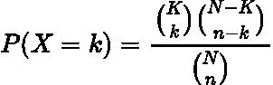
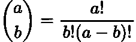
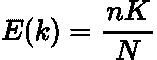
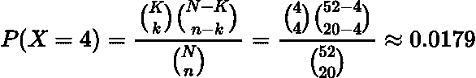
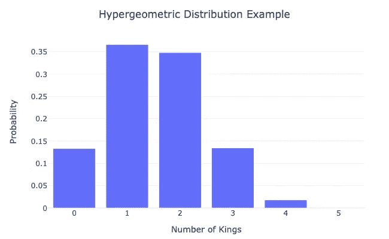
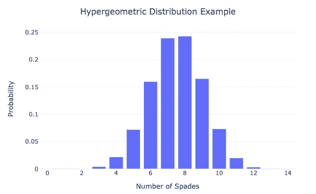

# 什么是超几何分布

> 原文：[`towardsdatascience.com/understanding-the-hypergeometric-distribution-e6540c7fec3c`](https://towardsdatascience.com/understanding-the-hypergeometric-distribution-e6540c7fec3c)

## 解析数据科学中一个较不知名的分布

 [Egor Howell](https://medium.com/@egorhowell?source=post_page-----e6540c7fec3c--------------------------------)

·发布于 [Towards Data Science](https://towardsdatascience.com/?source=post_page-----e6540c7fec3c--------------------------------) ·5 分钟阅读·2023 年 6 月 21 日

--

图片由 [Roth Melinda](https://unsplash.com/ko/@rm_photography?utm_source=medium&utm_medium=referral) 提供，[Unsplash](https://unsplash.com/?utm_source=medium&utm_medium=referral)

# 背景

[**二项分布**](https://medium.com/towards-artificial-intelligence/decoding-the-binomial-distribution-a-fundamental-concept-for-data-scientists-81c64c7e4580) 是一个在数据科学内外都非常著名的分布。然而，你听说过它的较不知名的“亲戚”[**超几何分布**](https://en.wikipedia.org/wiki/Hypergeometric_distribution) 吗？如果没有，这篇文章将为你详细解释它是什么以及它为何对我们数据科学家有用。

补充视频。

# 直觉

超几何分布衡量在***n***次试验（样本）中成功的***k***的概率，*没有替换*，给定有关总体的一些信息。这与二项分布非常相似，但有一个关键区别是*没有替换*。因此，每次抽取/试验的成功（或结果）的概率会变化，而在二项分布中，成功（和失败）的概率是固定的。

一个易于理解的例子是确定从一副标准扑克牌中随机抽取 20 张牌中抽到全部 4 张国王的概率。如果我们抽到一张国王，那么抽到下一张国王的概率将与第一次不同，因为总体构成已经改变。因此，成功的概率是动态的。

# 理论

[**概率质量函数（PMF）**](https://en.wikipedia.org/wiki/Probability_mass_function) 的超几何分布如下所示：

作者的 LaTeX 公式。

其中：

+   ***n*** 是试验的次数

+   ***k*** 是成功的数量。

+   ***N*** 是总体规模。

+   ***K*** 是总体中的成功总数。

+   ***X*** 是来自超几何分布的[**随机变量**](https://en.wikipedia.org/wiki/Random_variable)。

> 感兴趣的读者可以在[这里](https://math.stackexchange.com/questions/2236194/derivation-for-hypergeometric-distribution-formula-and-comparsion-with-bernoulli)找到 PMF 的推导。

类似括号的符号指的是[**二项系数**](https://en.wikipedia.org/wiki/Binomial_coefficient)：

作者提供的 LaTeX 公式。

[**阶乘**](https://www.freecodecamp.org/news/what-is-a-factorial/#:~:text=A%20factorial%20is%20a%20mathematical,1%20(which%20%3D%206).) 表明我们在处理*组合和排列*。你可以在我之前的博客中阅读更多内容：

 [## 组合和排列基础知识]

### 关于组合和排列及其区别的简要描述。

towardsdatascience.com](/a-primer-on-combinations-and-permutations-d654aacea292?source=post_page-----e6540c7fec3c--------------------------------)

分布的均值由以下公式给出：

作者提供的 LaTeX 公式。

# 示例

让我们回到之前的例子，从一副普通的 52 张牌中随机抽取 20 张卡片，计算其中 4 张国王的情况。我们拥有的信息是：

+   ***N = 52***：牌堆中的卡片数量。

+   ***n = 20***：我们抽样的卡片数量。

+   ***k = 4***：我们希望得到的国王数量（成功）。

+   ***K = 4***：牌堆中的国王数量。

将这些数字代入 PMF：

作者提供的 LaTeX 公式。

因此，概率非常低。这是合理的，因为从一副牌中抽到一张国王的概率是 ***~0.077 (1/13)，*** 所以在样本更小的情况下，如我们上面所示，这个概率会进一步降低。

> 如果你想玩一些数字和不同的情境，我在[这里](https://stattrek.com/online-calculator/hypergeometric)链接了一个超几何分布计算器。

# 代码与图表

上述例子展示了超几何分布应用的有用示范。然而，我们可以通过将 PMF 绘制为成功数量 ***k*** 的函数来获得更全面的视角。

以下是一个 Python 绘制的图示，展示了在我们期望的国王数量 ***k*** 变化时的例子：

作者的 GitHub Gist。

作者在 Python 中生成的图表。

正如我们所见，从 20 张卡片样本中得到 5 张国王的概率为 0，因为牌堆中没有五张国王！我们得到的最可能的国王数量是 1。

现在让我们考虑一个新问题。随机抽取 30 张牌样本中，黑桃的超几何分布是多少？

作者提供的 GitHub Gist。

由作者用 Python 生成的图。

我们在 30 张牌的样本中得到 8 张黑桃的可能性最大。正如图示，很难在样本中得到没有黑桃的情况。

# 应用

超几何分布涉及到[许多领域](https://studiousguy.com/hypergeometric-distribution-examples/)：

+   *扑克牌中赢得一手的概率*

+   *投票人群分析*

+   *制造业中的质量控制*

+   *种群中的遗传变异*

因此，超几何分布是你在数据科学职业生涯中最有可能遇到的内容，因此值得了解。

# 总结与进一步思考

在这篇文章中，我们讨论了超几何分布。这与二项分布非常相似，但成功的概率会变化，因为我们是在不放回的情况下抽样。这个分布在数据科学中非常强大，广泛应用于质量控制和赌博行业。因此，作为数据科学家，了解它非常值得。

完整代码可以在我的 GitHub 上找到：

 [## Medium-Articles/Statistics/Distributions/hypergeometric.py at main · egorhowell/Medium-Articles

### 在我的中等博客/文章中使用的代码。通过创建账户来贡献 egorhowell/Medium-Articles 的开发…

github.com](https://github.com/egorhowell/Medium-Articles/blob/main/Statistics/Distributions/hypergeometric.py?source=post_page-----e6540c7fec3c--------------------------------)

# 另一个事项！

我有一份免费的通讯，[**Dishing the Data**](https://dishingthedata.substack.com/)，我在其中每周分享成为更好数据科学家的技巧。没有“废话”或“点击诱饵”，只有来自实践数据科学家的纯粹可操作见解。

 [## Dishing The Data | Egor Howell | Substack

### 如何成为更好的数据科学家。点击阅读由 Egor Howell 撰写的《Dishing The Data》，一份 Substack 出版物，内容包括…

newsletter.egorhowell.com](https://newsletter.egorhowell.com/?source=post_page-----e6540c7fec3c--------------------------------)

# 与我联系！

+   [**YouTube**](https://www.youtube.com/@egorhowell)

+   [**LinkedIn**](https://www.linkedin.com/in/egor-howell-092a721b3/)

+   [**Twitter**](https://twitter.com/EgorHowell)

+   [**GitHub**](https://github.com/egorhowell)

# 参考文献

+   *关于超几何分布的更多信息:* [`brilliant.org/wiki/hypergeometric-distribution/`](https://brilliant.org/wiki/hypergeometric-distribution/)

+   *理论方法：* [`dlsun.github.io/probability/hypergeometric.html`](https://dlsun.github.io/probability/hypergeometric.html)
