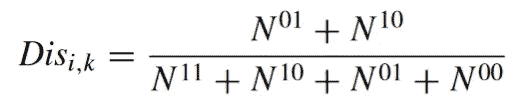
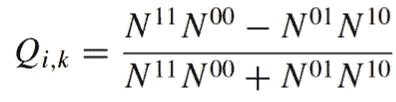

# 理解集成学习中多样性的重要性

> 原文：[`towardsdatascience.com/understanding-the-importance-of-diversity-in-ensemble-learning-34fb58fd2ed0`](https://towardsdatascience.com/understanding-the-importance-of-diversity-in-ensemble-learning-34fb58fd2ed0)

## 多样性在提升集成性能中的作用

[](https://donatoriccio.medium.com/?source=post_page-----34fb58fd2ed0--------------------------------)[](https://towardsdatascience.com/?source=post_page-----34fb58fd2ed0--------------------------------) [Donato Riccio](https://donatoriccio.medium.com/?source=post_page-----34fb58fd2ed0--------------------------------)

·发布于 [Towards Data Science](https://towardsdatascience.com/?source=post_page-----34fb58fd2ed0--------------------------------) ·阅读时长 9 分钟·2023 年 1 月 2 日

--


图片由 [Mulyadi](https://unsplash.com/@mullyadii?utm_source=medium&utm_medium=referral) 提供，发布在 [Unsplash](https://unsplash.com/?utm_source=medium&utm_medium=referral) 上

集成学习是一种将多个模型结合以获得更好结果的机器学习技术。只有近年来，随着计算速度的提高，集成学习才成为应对机器学习领域困难问题的最有效技术之一。这种方法在大多数机器学习竞赛的获胜解决方案中使用，奖金高达 10 万美元。

我们如何选择最佳的集成成员，将它们组合成一个更强大的模型？在本文中，我们将探讨如何选择模型进行集成以及如何对它们进行聚合。

# **什么是多样性？**

集成学习基于结合多个模型的概念，这些模型被称为*弱学习者*。这个名字来源于这样一个想法：个体集成成员不需要非常准确。只要它们比随机模型稍微好一点，结合它们就会有益。多样性是集成学习中的一个重要概念，指的是集成中的个体模型的预测应该**尽可能地彼此不同**。这是因为不同的模型可能会犯不同类型的错误。通过结合多样化模型的预测，我们可以减少整体的集成误差。

# **我们如何增加多样性？**

多年来，开发了几种集成学习算法。每种算法都有独特的方式来实现多样性。这些方法包括：

在**不同的训练数据子集**上训练每个模型。当样本是有放回地抽取时，称为**自助法**。当抽样是无放回地进行时，称为**粘贴法**。这也有助于减少集成预测的方差，从而改善其泛化能力。自助法中的多样性理念在**随机森林**和**极端随机树**中得到了进一步的发展。前者通过选择每次分裂时树可用的**随机特征数量**来实现多样性，而后者通过进行**随机分裂**来降低树之间的相关性。

使用**不同特征集**训练每个模型。可以使用可用特征的不同组合或原始特征的不同转换来训练集成。这有助于捕捉数据的不同方面，从而提高性能。

使用**不同类型的算法**训练**每个模型**。这是**投票**和**堆叠**元模型中使用的方法。通过使用不同的算法，集成中的个别模型可以捕捉数据中的不同模式并产生不同类型的错误。


投票集成。包括多样化的集成成员是很重要的。[1]

然而，多样化的预测并不总是更好。

## **良好的和不良的多样性**

在多数投票集成中，*浪费* 投票的概念可以用来理解集成的多样性。如果集成已经是正确的，分类器之间的低分歧表明已经有一些投票被浪费了，因为无论个别分类器的投票结果如何，都会做出相同的正确决策。这被称为**良好的多样性**，它测量了集成已经正确时的分歧。在这种情况下，更多的分歧意味着更少的浪费投票。相反，**不良的多样性**测量集成不正确时的分歧。在这种情况下，任何分歧都代表着浪费的投票，因为个别分类器没有为集成做出的正确决策做出贡献。为了最大化集成的效率，重要的是增加良好的多样性并减少不良的多样性，这可以通过减少浪费投票的数量来实现。

从准确性角度来看，另一种思考方式是这样的。例如，假设决策树模型在识别狗方面表现很好，但在识别猫时有困难。另一方面，逻辑回归模型在识别猫方面表现更好，但在识别狗时有困难。这些算法各有优缺点，会对数据产生不同类型的错误。通过结合这两个模型的预测，我们可以创建一个总体准确性高于任何单个模型的集成。这就是**良好多样性**的一个例子。我们可以再添加一个第三个模型，该模型在分类猫和狗方面都很差。第三个模型将增加集成的多样性，但不会带来任何好处。这被认为是**差的多样性**。[2]

# **我们如何测量多样性？**

让我们称***f₁, f₂, … fₙ***为集成中不同模型的预测。

多样性度量有两种类型：成对和全局。成对度量需要对每一对***fᵢ, fⱼ***进行计算。最终，你会得到一个***n*x*n***矩阵。全局度量是在整个预测矩阵上计算的，它们由单一值表示。以下列表绝非详尽，你可以在 Kuncheva 的论文中找到更多度量，参考文献中有列出。

在公式中，0 表示预测错误，1 表示预测正确。例如，***N⁰¹***表示第一个分类器正确而第二个错误的次数。

**皮尔逊相关系数** 计算集成中相似性的最简单方法是使用皮尔逊相关系数。如果两个模型的预测高度相关，这意味着它们非常相似。当**ρᵢⱼ** = 0 时获得最大多样性，而两个产生完全相同输出的分类器将有**ρᵢⱼ** = 1。即使在软投票集成中，当预测是概率时，也可以计算相关系数。

以下指标用于二元类别预测。

**分歧** 正如名字所示，它表示预测之间的分歧程度。通过将预测不同的次数除以总的预测次数来计算分歧。分歧值介于 0（没有预测不同）和 1（每个预测都不同）之间。



分歧度量。[2]

**Yule 的 Q** Yule 的 Q 值介于-1 和 1 之间。这个度量提供了重要的信息：正值表示模型在正确分类*相同*对象，而在不同对象上的错误将导致负 Q 值。0 的值表明预测是独立的。



Yule 的 Q。[2]

**熵** 以下度量是一个全局指标。它在整个预测矩阵上计算。熵基于这样一个思想：当不一致性达到最大时，一半的预测是零，而另一半是 1。在以下公式中，L 是集成模型的总成员数，*l*是正确分类实例 z*ⱼ*的分类器总数。


二元预测的熵。[2]

**Python 实现**

```py
def coefficients(preds):
    A = np.asarray(preds[:, 0], dtype=bool)
    B = np.asarray(preds[:, 1], dtype=bool)

    a = np.sum(A * B)           # A right, B right
    b = np.sum(~A * B)          # A wrong, B right
    c = np.sum(A * ~B)          # A right, B wrong
    d = np.sum(~A * ~B)         # A wrong, B wrong

    return a, b, c, d

def disagreement(preds, i,j):
    L = preds.shape[1]
    a, b, c, d = coefficients(preds[:, [i, j]])
    return float(b + c) / (a + b + c + d)

def paired_q(preds, i, j):
    L = preds.shape[1]
    # div = np.zeros((L * (L - 1)) // 2)
    a, b, c, d = coefficients(preds[:, [i, j]])
    return float(a * d - b * c) / ((a * d + b * c) + 10e-24) 

def entropy(preds):
    L = preds.shape[1]
    tmp = np.sum(preds, axis=1)
    tmp = np.minimum(tmp, L - tmp)
    ent = np.mean((1.0 / (L - np.ceil(0.5 * L))) * tmp)
    return ent
```

# 构建投票分类器

现在让我们比较两个集成模型，以评估其成员的多样性。在以下示例中，我使用了[pycaML](https://pypi.org/project/pycaML/)，它允许用几行代码训练和比较模型及集成模型。

我为第一个集成模型选择了 9 个模型，为第二个集成模型选择了 10 个模型。每个模型都使用默认参数进行训练。数据集可在[UCI 存储库](https://archive.ics.uci.edu/ml/datasets/diabetes)中获得。

**模型比较** 为了有一个基准来比较集成模型，下面的图展示了表现最好的 10 个模型。我们将重点关注 F1 得分。

```py
from pmlb import fetch_data
from pycaML import ClassificationExperiment
name = 'diabetes'
df = fetch_data(name, return_X_y=False)
df.head()
df.to_csv(f'{name}.csv', index=False)
from pycaML import ClassificationExperiment
exp = ClassificationExperiment(name = name)
exp.load_data(f'{name}.csv', target='target')
exp.start()
exp.result.loc[:, exp.result.columns.str.contains('Test')].head(10)
```


在糖尿病数据集上表现最好的 10 个模型，由 pycaML 生成。图像由作者提供。

预测矩阵可以如下计算。最终，我们将得到一个 154x19 的矩阵，每一行是测试集中的一个实例，每一列是一个模型。得到矩阵后，我们可以将其拆分为两个集成模型进行比较。第一个包含奇数索引的模型，而第二个包含偶数索引的模型。

```py
preds = pd.DataFrame()
for preds in exp.result.index:
    preds[preds] = exp.predict(preds)

preds.shape

# (154, 19)

ensemble_1 = preds.iloc[:, 1::2]
ensemble_2 = preds.iloc[:, ::2]

def disagreement_matrix(preds):
    res = np.zeros((preds.shape[1], preds.shape[1]))
    for i in range(preds.shape[1]):
        for j in range(i, preds.shape[1]):
            res[i, j] = disagreement(preds, i, j)
            res[j, i] = res[i, j]
    return res

sns.heatmap(d, annot=True, cmap='coolwarm', vmin=0, vmax=1, cbar = False)
```

查看集成模型 1 的不一致矩阵，似乎 Perceptron 是与其他模型不一致最多的模型。另一方面，提升模型之间的不一致较少。


集成模型 1 的不一致矩阵。图像由作者提供。

集成模型 2 包含不同的模型。总体来看，不一致性相当低。与其他模型不一致最多的是 Passive Aggressive Classifier。


集成模型 2 的不一致矩阵。图像由作者提供。

由于集成模型 1 具有更高的熵，这意味着其多样性更高。


熵得分。图像由作者提供。

现在让我们通过投票来建立最终模型，这种元模型被称为硬投票。两个集成模型使用与之前相同的指标进行评估，即 F1 得分。

```py
preds_voting = preds.mode(axis=1)[0]
print(f'F1 score for {model}: {f1_score(preds_voting, y_test, average="macro"):.3f})
```


模型评估后的结果。图像由作者提供。

最终，我们展示了更高的多样性（集成模型 1）导致了更好的集成模型。比较中找到的最佳模型是 Extra Trees，其 F1 得分为 0.71。最终模型的表现比在数据集上训练的最佳模型高出不少，达到了 0.764 的得分。

## 结论

集成学习是一种强大的机器学习技术，它涉及训练多个模型并结合它们的预测以实现更好的性能。我们发现，当集成中的模型多样性增加时，集成的性能也会提高。

这一发现突显了集成学习中多样性的价值。在构建集成模型时，考虑模型之间的多样性对于实现最佳性能至关重要。

因此，下次你在进行机器学习项目并考虑使用集成学习时，记得优先考虑模型之间的多样性。这可能会对模型的最终性能产生重要影响。

*喜欢这篇文章吗？通过订阅我的通讯，* [*数据面试*](https://thedatainterview.substack.com/)*，每周获取数据科学面试问题。*

*此外，你还可以在* [*LinkedIn*](https://www.linkedin.com/in/driccio/)*上找到我。*

## 参考文献

[1] Géron, A. (2019). 实用机器学习与 Scikit-Learn、Keras 和 TensorFlow: 构建智能系统的概念、工具和技术（第 2 版）。O’Reilly.

[2] Kuncheva, L.I., Whitaker, C.J. 分类器集成中的多样性测量及其与集成准确性的关系。 *机器学习* **51**, 181–207 (2003). [`doi.org/10.1023/A:1022859003006`](https://doi.org/10.1023/A:1022859003006)
