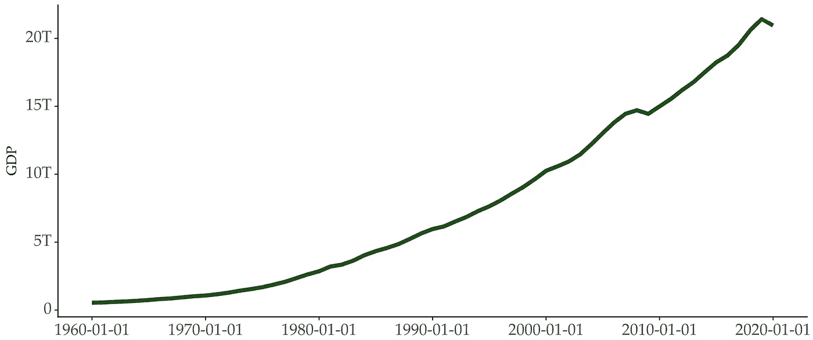
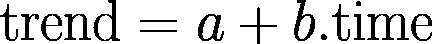
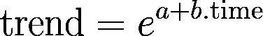
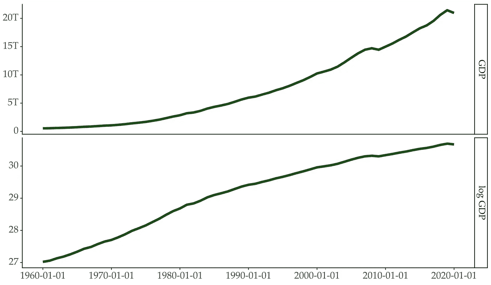
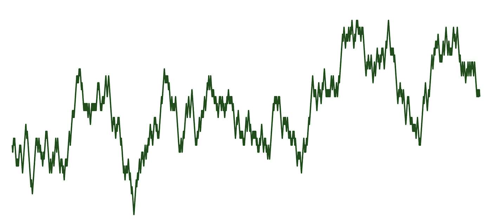
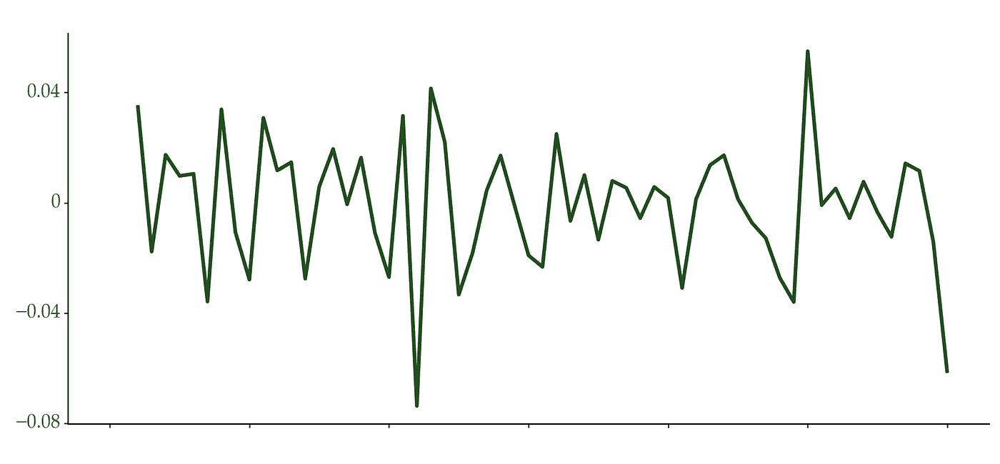

# 了解时间序列趋势

> 原文：[`towardsdatascience.com/understanding-time-series-trend-addfd9d7764e`](https://towardsdatascience.com/understanding-time-series-trend-addfd9d7764e)

## 确定性趋势与随机趋势，以及如何处理它们

[](https://vcerq.medium.com/?source=post_page-----addfd9d7764e--------------------------------)[](https://towardsdatascience.com/?source=post_page-----addfd9d7764e--------------------------------) [Vitor Cerqueira](https://vcerq.medium.com/?source=post_page-----addfd9d7764e--------------------------------)

·发表于[Towards Data Science](https://towardsdatascience.com/?source=post_page-----addfd9d7764e--------------------------------) ·阅读时间 6 分钟·2023 年 3 月 14 日

--


图片由[Ali Abdul Rahman](https://unsplash.com/@_actually_?utm_source=medium&utm_medium=referral)拍摄，来源于[Unsplash](https://unsplash.com/?utm_source=medium&utm_medium=referral)

检测和处理趋势是时间序列建模的关键步骤。

在本文中，我们将：

+   描述时间序列的趋势及其不同特征；

+   探索如何检测它；

+   讨论处理趋势的方法；

# 了解趋势

## 趋势作为时间序列的构建块

在任何给定时间，时间序列可以分解为三个部分：趋势、季节性和剩余部分。


时间序列的加法分解

趋势表示时间序列水平的长期变化。这种变化可以是向上（水平上升）或向下（水平下降）。如果变化在一个方向上是系统性的，那么趋势就是单调的。



美国 GDP 时间序列具有向上和单调的趋势。数据来源于参考文献[1]。作者提供的图片。

## 趋势作为非平稳性的原因

如果时间序列的统计属性不变，则该时间序列是平稳的。这包括时间序列的水平，在平稳条件下保持不变。

因此，当时间序列表现出趋势时，平稳性假设并未得到满足。建模非平稳时间序列具有挑战性。如果不处理，统计测试和预测可能会产生误导。这就是为什么在建模时间序列之前检测和处理趋势很重要。

对趋势的适当描述会影响建模决策。这进一步影响预测性能。

## 确定性趋势

趋势可以是确定性的，也可以是随机的。

确定性趋势可以用一个明确的数学函数建模。这意味着时间序列的长期行为是可预测的。任何偏离趋势线的情况只是暂时的。

在大多数情况下，确定性趋势是线性的，可以写成如下形式：



线性趋势的方程。系数*b 是连续期间趋势的预期变化。系数 a 是截距。*

但，趋势也可以遵循指数或多项式形式。



指数趋势方程。通过对两边取对数，这一趋势可以变为线性。

在经济学中，有几个时间序列的例子呈指数增长，例如 GDP：



美国 GDP 时间序列。原始趋势是指数的，但在对数变换后变为线性。数据来源于参考文献[1]。作者提供的图像。

具有确定性趋势的时间序列称为趋势平稳。这意味着去除趋势成分后，序列变得平稳。

线性趋势也可以通过将时间作为解释变量来建模。以下是你可以这样做的一个例子：

```py
import numpy as np
import pandas as pd
from statsmodels.tsa.arima.model import ARIMA

# https://github.com/vcerqueira/blog/blob/main/data/gdp-countries.csv
series = pd.read_csv('data/gdp-countries.csv')['United States']
series.index = pd.date_range(start='12/31/1959', periods=len(series), freq='Y')

log_gdp = np.log(series)

linear_trend = np.arange(1, len(log_gdp) + 1)

model = ARIMA(endog=log_gdp, order=(1, 0, 0), exog=linear_trend)
result = model.fit()
```

## 随机趋势

随机趋势可以随机变化，这使得它们的行为难以预测。

随机游走是具有随机趋势的时间序列的一个例子：

```py
rw = np.cumsum(np.random.choice([-1, 1], size=1000))
```



随机游走时间序列，其趋势突然和不可预测地变化。作者提供的图像。

随机趋势与单位根、积分和差分有关。

具有随机趋势的时间序列被称为差分平稳。这意味着通过差分操作可以使时间序列变得平稳。差分指的是取连续值之间的差异。

差分平稳时间序列也称为积分时间序列。例如，ARIMA（自回归积分滑动平均）模型包含一个特定的术语（I）用于积分时间序列。这个术语涉及应用差分步骤直到序列变得平稳。

最终，差分平稳或积分时间序列的特征是单位根。不深入数学细节，单位根是非平稳时间序列的一个特征。

## 预测含义

确定性和随机趋势对预测有不同的影响。

确定性趋势在整个时间范围内具有恒定的方差。在线性趋势的情况下，这意味着斜率不会改变。但现实世界中的时间序列展示了复杂的动态，趋势在长期内发生变化。因此，使用确定性趋势模型进行长期预测可能会导致性能较差。假设方差恒定会导致预测区间过窄，从而低估了不确定性。


随机游走的多个实现。作者提供的图像。

随机趋势假定随着时间变化。因此，时间序列的方差会随着时间增加。这使得随机趋势在长期预测中更具优势，因为它们提供了更合理的不确定性估计。

# 如何检测趋势

随机趋势可以通过单位根测试来检测。例如，扩展的迪基-福勒测试或 KPSS 测试。

## 扩展的迪基-福勒（ADF）测试

ADF 测试检查自回归模型是否包含单位根。测试的假设包括：

+   原假设：存在单位根（时间序列不是平稳的）；

+   备择假设：不存在单位根。

这个测试在*statsmodels*中可用：

```py
from statsmodels.tsa.stattools import adfuller

pvalue_adf = adfuller(x=log_gdp, regression='ct')[1]

print(pvalue_adf)
# 1.0
```

参数*regression=‘ct’*用于在模型中包括一个常数项和确定性趋势。正如你可以在[文档中检查](https://www.statsmodels.org/dev/generated/statsmodels.tsa.stattools.adfuller.html)的那样，这个参数有四个可能的备选值：

+   *c*: 包括一个常数项（默认值）；

+   *ct*: 常数项加线性趋势；

+   *ctt*: 常数项加线性和二次趋势；

+   *n*: 无常数或趋势。

选择应包括哪些项非常重要。错误的包含或排除某项可能会显著降低测试的效能。在我们的案例中，我们使用了*ct*选项，因为对数 GDP 系列显示出线性确定性趋势行为。

## KPSS 测试

KPSS 测试也可以用来检测随机趋势。测试假设相对于 ADF 是相反的：

原假设：时间序列是趋势平稳的；

备择假设：存在单位根。

```py
from statsmodels.tsa.stattools import kpss

pvalue_kpss = kpss(x=log_gdp, regression='ct')[1]

print(pvalue_kpss)
# 0.01
```

KPSS 拒绝了原假设，而 ADF 没有。因此，两种测试都表明存在单位根。请注意，一个时间序列可以具有包含确定性和随机成分的趋势。

那么，你如何处理单位根呢？

# 如何处理趋势

我们已经探讨了如何使用时间作为解释变量来考虑线性趋势。

处理趋势的另一种方法是差分。不是处理绝对值，而是对时间序列在连续期间的变化建模。

单次差分操作通常足以实现平稳性。然而，有时你需要进行多次差分。你可以使用 ADF 或 KPSS 来估计所需的差分步骤数。*pmdarima*库在*ndiffs*函数中封装了这个过程：

```py
from pmdarima.arima import ndiffs

# how many differencing steps are needed for stationarity?
ndiffs(log_gdp, test='adf')
# 2
```

在这种情况下，对数 GDP 系列需要 2 次差分步骤才能实现平稳性：

```py
diff_log_gdp = log_gdp.diff().diff()
```



对数 GDP 时间序列的二次差分。图像由作者提供。

# 关键要点

+   趋势是时间序列的一个关键组成部分；

+   展现趋势的时间序列是非平稳的，因为均值水平不是恒定的；

+   时间序列的趋势可以是确定性或随机的。确定性趋势用明确的数学函数建模，而随机趋势可以随机变化；

+   可以使用单位根检验如 ADF 或 KPSS 来检测随机趋势；

+   差分操作用于从时间序列中去除随机趋势。

感谢阅读，下次故事见！

## 参考文献

[1] [各种国家的 GDP 时间序列数据](https://www.kaggle.com/datasets/iamtushara/gdp-timeseries-data-for-various-countries)（许可证：CC0：公共领域）

[2] [随机和确定性趋势，见《预测：原理与实践》](https://otexts.com/fpp2/stochastic-and-deterministic-trends.html)

[3] [随机游走——介绍及其性质](https://www.youtube.com/watch?v=ouahL4HbwBE&ab_channel=BenLambert) 由 Ben Lambert 制作
