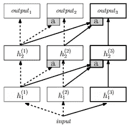
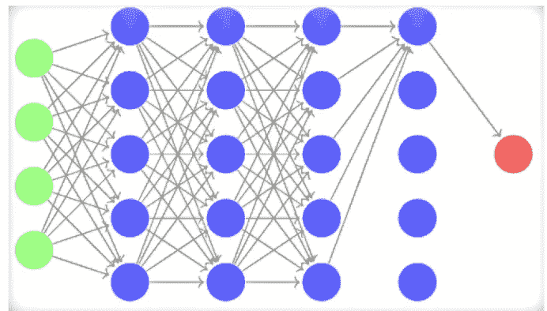

# 了解我们失去的东西

> 原文：[`towardsdatascience.com/understanding-what-we-lose-b91e114e281b?source=collection_archive---------4-----------------------#2023-05-23`](https://towardsdatascience.com/understanding-what-we-lose-b91e114e281b?source=collection_archive---------4-----------------------#2023-05-23)

## **我们如何应对大型语言模型中的灾难性遗忘**

 [Matt Tengtrakool](https://medium.com/@matt.tengtrakool?source=post_page-----b91e114e281b--------------------------------)

·

[关注](https://medium.com/m/signin?actionUrl=https%3A%2F%2Fmedium.com%2F_%2Fsubscribe%2Fuser%2F720b7ac13f06&operation=register&redirect=https%3A%2F%2Ftowardsdatascience.com%2Funderstanding-what-we-lose-b91e114e281b&user=Matt+Tengtrakool&userId=720b7ac13f06&source=post_page-720b7ac13f06----b91e114e281b---------------------post_header-----------) 发表在 [Towards Data Science](https://towardsdatascience.com/?source=post_page-----b91e114e281b--------------------------------) ·8 min read·2023 年 5 月 23 日

--

*图 1：遗忘的共享体验。* 图像由 OpenAI 开发的 DALL·E 生成。

遗忘是人类经历的固有部分。我们都会丢失钥匙，忘记一个熟悉的名字，或者记不起几天前晚餐吃了什么。但这种明显的记忆缺失不一定是缺陷。相反，它突显了一个复杂的认知机制，使我们的大脑能够优先排序、筛选和管理大量信息。遗忘，悖论般地，证明了我们学习和记忆的能力。

就像人们会遗忘一样，机器学习模型也会遗忘——特别是大型语言模型。这些模型通过调整内部参数以响应数据暴露来进行学习。然而，如果新数据与模型之前学到的内容相反，它可能会覆盖或削弱旧信息。即使是相符的数据也可能会干扰并调整本来很好的学习权重。这种现象被称为“灾难性遗忘”，是训练稳定和多才多艺的人工智能系统中的一个重大挑战。

## **LLM 中遗忘的机制**

核心是，LLM 的记忆存在于其权重中。在神经网络中，每个权重本质上构成了网络高维权重空间中的一个维度。随着学习过程的展开，网络在这个空间中导航，依靠选择的梯度下降，旨在最小化损失函数。

这个损失函数通常是 LLM 分类任务中的交叉熵损失形式，它将模型的输出分布与目标分布进行比较。从数学角度看，对于目标分布 y 和模型输出 ŷ，交叉熵损失可以表示为：

在训练过程中，网络调整其权重以最小化这个损失。现在，决定一个权重应该改变多少的核心因素是学习率。在随机梯度下降更新规则中：

η 是学习率。然而，选择这个学习率可能很棘手，并且对灾难性遗忘有影响。如果 η 较高，模型具有很高的适应性，能够快速学习新任务，但可能会丧失先前的知识。较小的 η 能保持旧知识，但可能会影响新任务的学习。

此外，当我们意识到权重更新并不是独立时，复杂性就上升了。调整与某一特征相关的权重可能会无意中影响其他特征的表现，导致复杂的依赖关系网络。

我们还必须考虑训练过程中任务或数据的课程顺序。顺序引入任务可能会导致后续任务的主导地位，使模型偏向最新学习的任务，这是灾难性遗忘的直接表现。

## **应对灾难性遗忘的策略**

我们希望我们的 LLM 记住的信息超出我们自身的记忆。因此，我们努力构建在内存使用上高效的系统，但不一定受限于我们的生物标准。在与 LLM 中的灾难性遗忘作斗争的过程中，研究人员开发了几种创新策略。最突出的三种策略包括弹性权重巩固、渐进神经网络和优化固定扩展层。每种技术都采用了独特的数学方法来缓解遗忘问题。

## **弹性权重巩固（EWC）：记住每个权重的重要性**

EWC 受到神经科学和贝叶斯推理的启发，其目标是量化每个权重对模型之前学习的任务的重要性。基本思想是，在遇到新数据时，对先前任务关键的权重应进行较少的调整。

*图 2：EWC 示意参数空间，* [`www.pnas.org/doi/full/10.1073/pnas.1611835114`](https://www.pnas.org/doi/full/10.1073/pnas.1611835114)

在图 2 中，我们可以清楚地看到弹性权重巩固（Elastic Weight Consolidation）在训练任务 B 时防止灾难性遗忘所起的关键作用，而不会丧失我们从任务 A 中获得的知识。该图显示了参数空间，其中灰色区域表示任务 A 的最佳表现，奶油色区域表示任务 B 的良好表现。在我们学习任务 A 之后，我们的参数值标记为θ*A。

如果我们只集中于任务 B，并沿其梯度方向采取步骤（如蓝色箭头所示），我们将最小化任务 B 的损失，但可能会抹去我们对任务 A 的知识——这就是灾难性遗忘的问题。另一方面，如果我们用相同的系数约束所有权重（如绿色箭头所示），我们会施加一个严厉的限制，使我们保留任务 A 的记忆，但使得学习任务 B 变得困难。

这是 EWC 发挥作用的地方——它通过为任务 B（由红色箭头指示）找到一个不会对任务 A 的知识产生重大影响的解决方案，从而找到最佳平衡点。它通过具体确定每个权重相对于任务 A 的重要性来实现这一点。

EWC 在损失函数中引入了一个二次惩罚，限制重要权重的修改。这个惩罚项与当前权重值和初始权重值之间的差异的平方成正比，由重要性因子进行缩放。这个重要性因子通过费舍尔信息矩阵（Fisher Information Matrix）计算，作为权重对先前学习任务的意义的启发式指标。

在弹性权重巩固中，首先对神经网络进行任务 A 的训练，然后计算并保存费舍尔信息矩阵（Fisher Information Matrix）及学得的权重。在对网络进行任务 B 的训练时，EWC 修改损失函数以包括一个惩罚项，该惩罚项使用保存的 FIM 和权重计算，阻止对任务 A 关键权重的剧烈变化，从而在学习新任务与保留先前任务的知识之间取得平衡。惩罚的二次性质确保了从初始权重的较大偏差会产生更高的惩罚。通过对对先前任务贡献更大的权重赋予更大的惩罚，EWC 旨在在适应新信息的同时保留其学习的知识。

## **渐进神经网络（ProgNet）：构建神经网络塔**

ProgNets 引入了一种新架构，使网络在遇到新任务时能够扩展。它不是改变单个网络的权重，而是为每个任务添加一个新的网络（或列），将这些列堆叠起来，类似于建造一座塔。每个新列连接到所有以前添加的列，但反向不连接，从而保留旧列中的知识。

在 ProgNet 背后，每个任务由一个独立的列学习，输出是所有先前和当前列输入的函数。先前列的权重保持不变，防止任何灾难性遗忘，而新列的权重正常训练。

*图 3 : 基于块的 ProgNet 模型，* [`arxiv.org/abs/1606.04671`](https://arxiv.org/abs/1606.04671)

*​​*设想渐进神经网络为一组独立的处理单元，每个单元能够识别并利用与其任务相关的最重要输入。以图 3 为例，输出₃不仅与直接连接的隐藏层 h₂ 进行交互，还与之前列的 h₂ 层进行接口，通过其独特的横向参数修改这些层的输出。这个输出₃ 单元扫描并评估可用数据，战略性地忽略不必要的输入。例如，如果 h₂¹ 包含所有需要的信息，输出₃ 可能选择忽略其他信息。另一方面，如果 h₂² 和 h₂³ 包含有价值的信息，输出₃ 可能会优先关注这些，而忽略 h₂¹。这些侧向连接使网络能够有效管理跨任务的信息流，同时排除无关数据。

## **优化固定扩展层（OFELs）：每个任务的新房间**

OFELs 的概念就像为每个新家庭成员在房子里建一个新房间。在神经网络的背景下，OFELs 为 LLM 遇到的每个任务添加一个新层。这种层的扩展允许网络容纳新信息，而不会干扰已学到的内容。

*图 4 : OFEL 图示，* [`www.mdpi.com/2073-4425/10/7/553`](https://www.mdpi.com/2073-4425/10/7/553)

OFELs 涉及到修改网络本身的架构。在这里，对于每个新任务，会在神经网络中添加一个新层，而不是重新训练整个网络。这种架构修改有助于在特定层中封装所需的知识，从而最小化对旧层已有权重的影响。

其中 g 是激活函数。OFELs 的架构设计使其能够加入一个专门用于新任务的新层，这意味着网络可以独立处理新输入（`x_new`）与旧输入（`x_old`）。本质上，虽然方程式呈现了架构中底层过程的全面视图，但在推理或预测新任务时，我们通常只会使用`x_new`而不需要`x_old`。

通过有选择地优化新层，OFELs 在获取与新任务相关的知识和保留之前学到的信息之间取得了微妙的平衡。这一精细的优化过程使模型能够适应新挑战，同时保持利用先前知识的能力，从而实现更强大和多样化的学习。

## **前瞻性学习**

遗忘——无论是在人的大脑还是 LLMs 中——都是一个迷人的悖论。一方面，它可能成为持续学习和适应能力的障碍。另一方面，它是我们大脑和 AI 模型管理和优先处理信息的固有部分。应对灾难性遗忘的策略——弹性权重巩固、渐进神经网络和优化固定扩展层——提供了富有洞察力但又各不相同的方法，以保留大型语言模型的保留能力。它们各自提供独特的解决方案，反映了人工智能领域必须持续体现的机智和适应性。然而，至关重要的是要理解，灾难性遗忘的问题尚未完全解决；在这一领域仍有待开发的途径，需要深入探索、创新和创造力。

解决灾难性遗忘的挑战不仅推动我们朝着更高效的 AI 系统前进，而且朝着对学习和遗忘的更深入理解——这是人类和机器共同拥有的认知功能。因此，对于研究人员、科学家、从业者以及任何对智能工作原理感兴趣的人来说，参与这一持续对话变得至关重要。驯服灾难性遗忘现象的探索不仅仅是学术追求，而是一段承诺重新定义我们关系理解的旅程。
