# 单变量离散分布：易于理解的解释

> 原文：[`towardsdatascience.com/univariate-discrete-distributions-an-easy-to-understand-explanation-981c8fb078ae`](https://towardsdatascience.com/univariate-discrete-distributions-an-easy-to-understand-explanation-981c8fb078ae)

## 数学和视觉上理解单变量离散分布

[](https://tinztwinspro.medium.com/?source=post_page-----981c8fb078ae--------------------------------)[](https://towardsdatascience.com/?source=post_page-----981c8fb078ae--------------------------------) [Janik 和 Patrick Tinz](https://tinztwinspro.medium.com/?source=post_page-----981c8fb078ae--------------------------------)

·发表于 [Towards Data Science](https://towardsdatascience.com/?source=post_page-----981c8fb078ae--------------------------------) ·阅读时间 9 分钟·2023 年 10 月 20 日

--


图片来源 [unDraw](https://undraw.co/license)

**你是否有这样的感觉？你想学习新的东西，但不知道从哪里开始。这就是我们在想要数学理解分布时的感受。是的，我们的教授向我们解释了所有这些分布，但只是用公式的数学方式！我们的教授没有用易于理解的视觉方式来解释。**

这就是为什么我们写这篇文章来讲解最重要的单变量离散分布。我们想以数学和视觉的方式向你解释这些分布。我们的目标是让你理解数学和分布图之间的关系。此外，我们还为每个分布提供了一个例子。

作为数据科学家，了解分布如何工作是非常重要的。分布假设是一些机器学习算法的基础，并且对于解决统计问题至关重要，例如在保险行业中。

我们将讨论以下分布：

+   **伯努利分布**

+   **二项分布**

+   **几何分布**

+   **泊松分布**

+   **均匀分布**

让我们深入了解吧！

# **伯努利分布是什么？**

如果一个随机变量 *X* 只有两个可能的结果（标记为 0 或 1），则存在一个参数为 *p* 的伯努利分布。*X*=1（成功）发生的概率是 *p*，而 *X*=0（失败）发生的概率是 1-*p*。

让我们来看一个例子。

## 示例：

*X* 代表一次掷硬币的结果，其中 *X*=1（正面）和 *X*=0（反面）。*p* 是硬币落在正面的概率。

接下来，你将看到伯努利分布的视觉和数学解释。首先，我们从数学开始！

## 数学描述：

伯努利分布具有以下要求：


随机变量 *X* 是伯努利分布的。概率 *p* 的值范围在 0 和 1 之间。

概率质量函数（PMF）是


公式显示，当 *k*=0 时，概率为 1-*p*。另一方面，当 *k*=1 时，概率为 *p*。

该分布的均值和方差是


现在，我们理解了数学原理。接下来，我们看一下视觉解释。

## **视觉解释：**

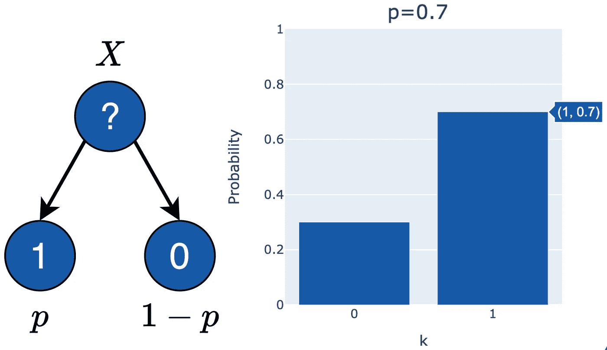

伯努利分布的视觉解释（图像来源于作者）

在左侧的视觉图中，你可以看到随机变量 *X* 有两个可能的结果（*k* = 1 或 *k* = 0）。在右侧，你看到 *k* = 1（概率 *p* = 0.7）和 *k*=0（概率 *p*=1–0.7=0.3）的示例。

以下代码显示了如何生成右侧的图表：

```py
import plotly.graph_objects as go

fig = go.Figure(data=[go.Bar(
    x=[0, 1],
    y=[0.3, 0.7],
    width=[0.8, 0.8],
    marker_color=['#165AA7', '#165AA7']
)],
layout = {
   'xaxis': {'title': 'k', 'tick0': '0', 'dtick': '1'},
   'yaxis': {'title': 'Probability', 'range': [0, 1]},
   'title': 'p=0.7',
   'barmode': 'relative',
}
)

fig.show()
```

伯努利分布 (*n*=1) 是二项分布的特例。所以现在让我们看看二项分布吧！

# **什么是二项分布？**

如果一个随机变量 *X* 等于 *n* 个具有参数 *p* 的伯努利分布随机变量的总和，则存在一个具有参数 *n* 和 *p* 的二项分布：


*X* 代表在参数 *p* 的 *n* 次伯努利试验中的成功总数（1 的数量）。


**具有二项分布的随机变量是 *n* 个伯努利随机变量的总和！**

接下来，我们看一下这种分布的一个示例。

## **示例：**

例如，*X* 代表 *n* 次抛硬币中的正面总数。得到正面的概率是 *p*。

下面，你可以看到二项分布的数学解释。

## 数学描述：

我们有以下要求：

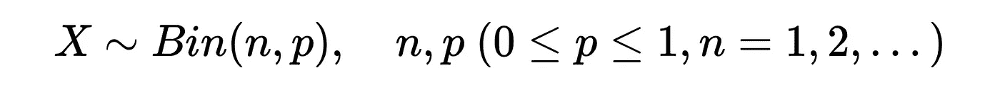

随机变量 *X* 是二项分布的。概率 *p* 的值范围在 0 和 1 之间。*n* 的值是 1, 2, … 。

概率质量函数（PMF）是

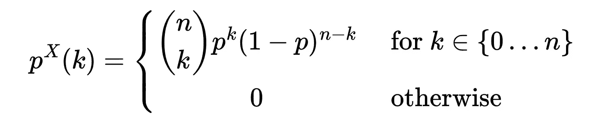

该分布的均值和方差是


现在，我们知道了所有的公式。接下来，我们看看二项分布的视觉解释。

## 视觉解释：

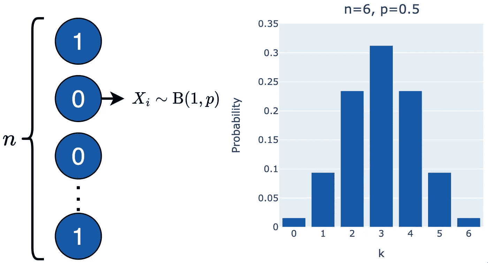

二项分布的视觉解释（图像来源于作者）

在这个示例中，我们选择 *n*=6 和 *p*=0.5。我们可以用 PMF 计算概率（y 轴）的值。计算所有值后，我们得到右侧的图表。*k*=3（1 的数量）的概率是 31.25%。最高概率是 *X*=1 发生三次。

假设我们掷一枚硬币六次。那么，硬币正面出现三次的概率是 31.25%。

你可以在下面查看右侧图形的代码：

```py
import plotly.graph_objects as go

fig = go.Figure(data=[go.Bar(
    x=[0, 1, 2, 3, 4, 5, 6],
    y=[0.015625, 0.09375, 0.234375, 0.3125, 0.234375, 0.09375, 0.015625],
    width=[0.8, 0.8],
    marker_color=['#165AA7', '#165AA7', '#165AA7', '#165AA7', '#165AA7', '#165AA7', '#165AA7']
)],
layout = {
   'xaxis': {'title': 'k', 'tick0': '0', 'dtick': '1'},
   'yaxis': {'title': 'Probability', 'range': [0, 0.35]},
   'title': 'n=6, p=0.5',
   'barmode': 'relative',
}
)

fig.show()
```

我们使用二项分布的 PMF 手动计算了 y 值。试着在代码中重现这些值。

# **什么是几何分布？**

我们有一个具有参数*p*的伯努利试验序列。一个具有参数*p*的几何分布随机变量*X*表示在第一次成功之前发生的失败试验（0 的数量）。

## **示例：**

你可以使用几何分布来确定设备和组件的寿命，即等待第一次故障或等待第一次成功。

下面，你可以看到几何分布的数学解释。

## 数学描述：

我们有以下要求：


随机变量*X*是几何分布的。概率*p*的值范围在 0 到 1 之间。

概率质量函数（PMF）为

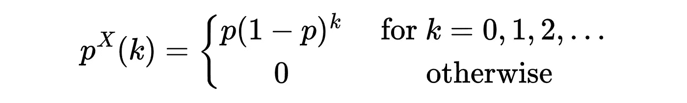

该分布的均值和方差为


现在，我们知道了这个分布背后的数学原理。让我们更直观地看一下它。

## 视觉解释：

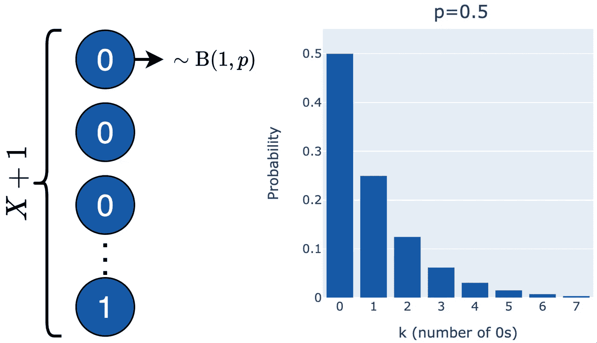

几何分布的视觉解释（图片由作者提供）

*X*表示失败的数量（0 的数量）。我们假设有一个电子组件，其故障概率为 50%（*p*=0.5）。对于第一个组件，错误概率为 50%。之后，概率会降低。

在下面，你可以看到右侧图形的代码：

```py
import plotly.graph_objects as go

fig = go.Figure(data=[go.Bar(
    x=[0, 1, 2, 3, 4, 5, 6, 7],
    y=[0.5, 0.25, 0.125, 0.0625, 0.03125, 0.015625, 1/128, 1/256],
    width=[0.8, 0.8],
    marker_color=['#165AA7', '#165AA7', '#165AA7', '#165AA7', '#165AA7', '#165AA7', '#165AA7', '#165AA7']
)],
layout = {
   'xaxis': {'title': 'k (number of 0s)', 'tick0': '0', 'dtick': '1'},
   'yaxis': {'title': 'Probability', 'range': [0, 0.55]},
   'title': 'p=0.5',
   'barmode': 'relative',
}
)

fig.show()
```

我们使用 PMF 来计算图形的 y 值。试着自己动手做做看！

# **什么是泊松分布？**

泊松分布是二项分布在试验次数*n*趋于无穷大且*p*趋于零时的极限情况。乘积*np=λ*保持不变。此外，参数*λ*是分布的均值和方差。*λ*表示成功事件的平均数量。

**泊松分布对二项分布的近似规则：**

> ***n* >= 50 和 *p* <= 0.05**

泊松分布也被称为**稀有事件分布**。

## **示例：**

例如，一家汽车保险公司需要计算一年内发生 1、2 或 3 起车祸的概率。

在下面，你可以看到泊松分布的数学解释。

## 数学描述：

泊松分布有以下要求：


随机变量*X*是具有参数*λ*的泊松分布。参数*λ*的值范围大于 0。

概率质量函数（PMF）为

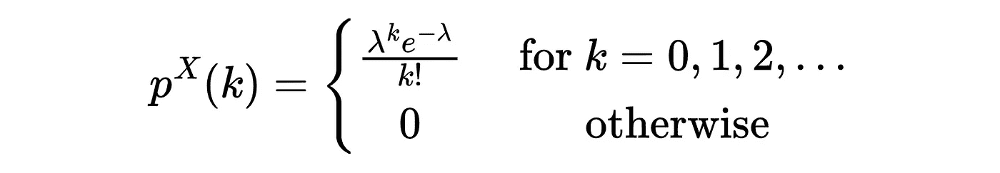

该分布的均值和方差为


现在，我们知道了泊松分布的公式。是时候从视觉上看看它了。

## 视觉解释：

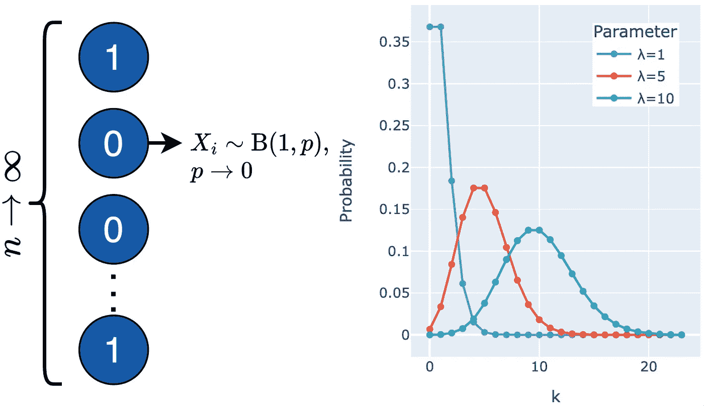

泊松分布的视觉解释（图片由作者提供）

我们假设一个保险公司想要知道一年内发生十次车祸的概率。此外，我们知道平均事故率为五。因此，我们可以查看红色图表，看到 *k* = 10 的概率非常小。这样，你就能得到所有的概率。

接下来，你可以看到右侧图表的代码。

```py
import math
import plotly.express as px

df = pd.DataFrame(columns = ['Parameter', 'k', 'Probability'])
for _lambda in [1, 5, 10]:
    for k in range(24):
        poisson_formula = (pow(_lambda,k) * math.exp(-_lambda))/math.factorial(k)
        df = df.append({'Parameter' : "λ=" + str(_lambda), 'k' : k, 'Probability' : poisson_formula}, ignore_index = True)

fig = px.line(df, x='k', y='Probability', color='Parameter', markers=True)
fig.show()
```

我们绘制了 *λ*=1、*λ*=5 和 *λ*=10 的图表。此外，我们使用上述 PMF 计算概率。最后，我们绘制了一个折线图，显示 *k* 值和概率。

# **什么是均匀分布？**

随机变量 *X* 具有离散均匀分布（参数 *a* 和 *b*），可以以相等的概率取 *a* 到 *b* 之间的任何整数。在均匀分布中，所有结果的发生概率相同。

## **示例：**

例如，掷一次骰子。随机变量 *X* 的可能值为：


每个数字的概率是相同的。

接下来，我们将介绍此分布背后的数学。

## 数学描述：

我们有以下要求：


概率质量函数（PMF）是

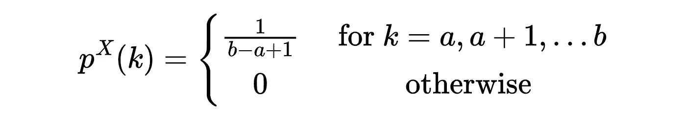

此分布的均值和方差为

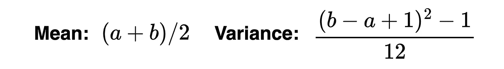

现在，我们知道如何从数学上定义分布。让我们看看视觉解释。

## 视觉解释：

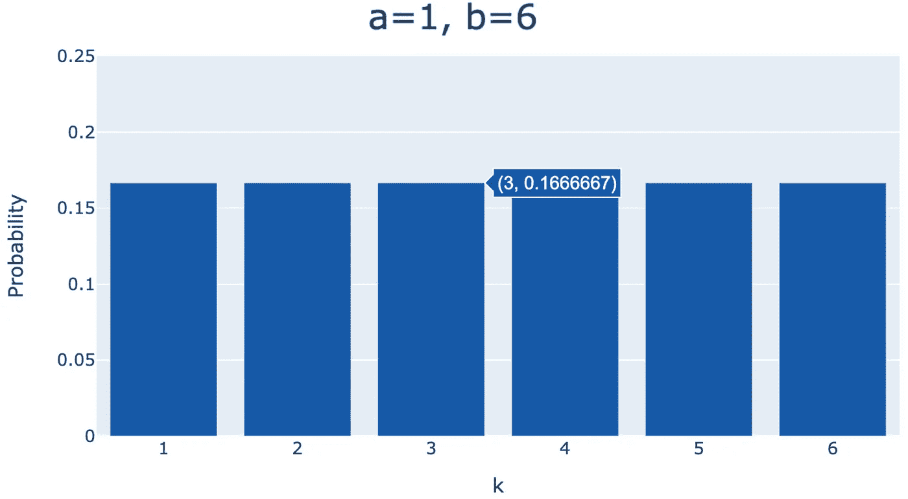

均匀分布的视觉解释（图片由作者提供）

在这个例子中，我们设置 *a*=1 和 *b*=6。我们可以看到所有 *k* 的值具有相同的概率。

接下来，你可以看到上面图表的代码。

```py
import plotly.graph_objects as go

fig = go.Figure(data=[go.Bar(
    x=[1, 2, 3, 4, 5, 6],
    y=[1/6, 1/6, 1/6, 1/6, 1/6, 1/6],
    width=[0.8, 0.8],
    marker_color=['#165AA7', '#165AA7', '#165AA7', '#165AA7', '#165AA7', '#165AA7']
)],
layout = {
   'xaxis': {'title': 'k', 'tick0': '0', 'dtick': '1'},
   'yaxis': {'title': 'Probability', 'range': [0, 0.25]},
   'title': 'a=1, b=6',
   'barmode': 'relative',
}
)

fig.show()
```

我们使用均匀分布的概率质量函数（PMF）并绘制 x 轴和 y 轴的值。

# 结论

恭喜你，了解了最重要的单变量离散分布的工作原理。在每个解释中，我们首先给出了直观的示例。然后，我们介绍了分布背后的数学，并将这些数学内容放入程序代码中。程序代码为每个分布生成了一个图表。之后，我们基于图表和图形解释了分布的视觉效果。

希望你对单变量离散分布的理解比以前更好。感谢你的关注。

👉🏽 [**加入我们免费的每周 Magic AI 新闻通讯，获取最新的 AI 更新！**](https://magicai.tinztwins.de)

👉🏽 [**你可以在我们的数字产品页面找到所有免费资源！**](https://shop.tinztwins.de/)

[**免费订阅**](https://tinztwinspro.medium.com/subscribe) **以在我们发布新故事时收到通知：**

[## 每当 Janik 和 Patrick Tinz 发布内容时，您将收到一封电子邮件。

### 每当 Janik 和 Patrick Tinz 发布内容时，您将收到一封电子邮件。通过注册，如果您还没有创建 Medium 帐户，您将创建一个...

[tinztwinspro.medium.com](https://tinztwinspro.medium.com/subscribe?source=post_page-----981c8fb078ae--------------------------------)

在我们的 [关于页面](https://medium.com/@tinztwinspro/about) 了解更多关于我们的信息。不要忘记关注我们在 [X](https://twitter.com/tinztwins) 上。非常感谢您的阅读。如果您喜欢这篇文章，随时分享。**祝您度过愉快的一天！**

使用 [我们的链接](https://tinztwinspro.medium.com/membership) 注册 Medium 会员，以阅读无限制的 Medium 故事。
