# 释放隐藏模式：无监督机器学习文章推荐系统指南

> 原文：[`towardsdatascience.com/unleash-the-hidden-patterns-a-guide-to-unsupervised-machine-learning-for-article-recommender-d1e7eb219c8d?source=collection_archive---------12-----------------------#2023-03-07`](https://towardsdatascience.com/unleash-the-hidden-patterns-a-guide-to-unsupervised-machine-learning-for-article-recommender-d1e7eb219c8d?source=collection_archive---------12-----------------------#2023-03-07)

## 构建一个基于无监督机器学习的文章推荐系统，并生成有助于推荐的特征和模式

 [Suhas Maddali](https://suhas-maddali007.medium.com/?source=post_page-----d1e7eb219c8d--------------------------------)

·

[关注](https://medium.com/m/signin?actionUrl=https%3A%2F%2Fmedium.com%2F_%2Fsubscribe%2Fuser%2F2a74f90399ae&operation=register&redirect=https%3A%2F%2Ftowardsdatascience.com%2Funleash-the-hidden-patterns-a-guide-to-unsupervised-machine-learning-for-article-recommender-d1e7eb219c8d&user=Suhas+Maddali&userId=2a74f90399ae&source=post_page-2a74f90399ae----d1e7eb219c8d---------------------post_header-----------) 发表在 [Towards Data Science](https://towardsdatascience.com/?source=post_page-----d1e7eb219c8d--------------------------------) ·8 分钟阅读·2023 年 3 月 7 日

[]

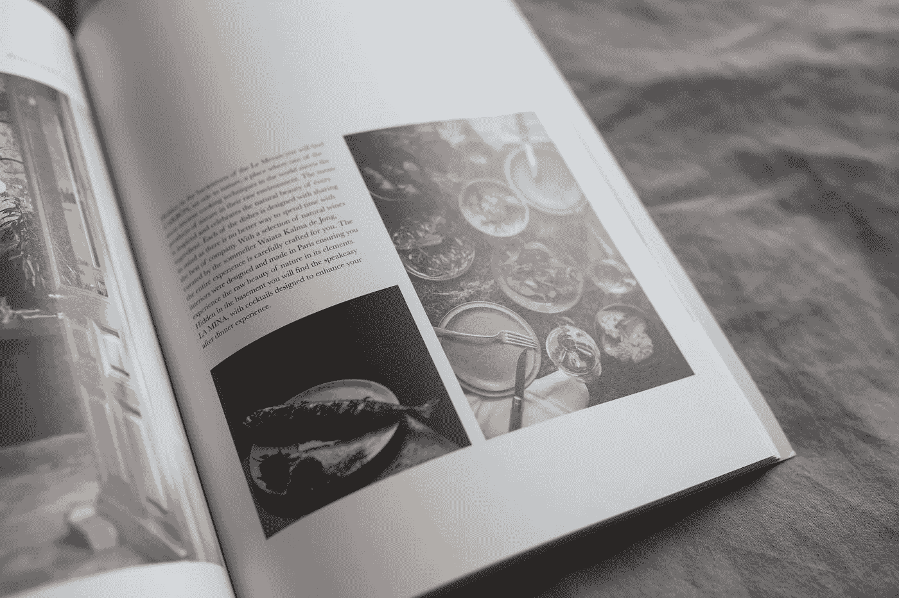

照片由 [Salomé Watel](https://unsplash.com/@samefaisrire?utm_source=medium&utm_medium=referral) 提供，图片来源于 [Unsplash](https://unsplash.com/?utm_source=medium&utm_medium=referral)

最近有很多关于**人工智能**和**机器学习**令人难以置信的能力的讨论。随着我们看到机器学习应用的各种前沿领域，这一转变所产生的更高价值的可能性也在不断增长。像**谷歌**、**微软**和**英伟达**这样的公司正在推动人工智能和机器学习的边界，以利用技术进步建设一个伟大的社会。

现在，人工智能的**炒作**非常多，一个常被忽视的话题是无监督机器学习。我敢打赌，人们可能已经有机会享受一些最先进的流媒体服务，如**Netflix**和**Amazon Videos**，它们拥有最先进的推荐系统。然而，对于作为无监督机器学习一部分的推荐系统的惊人能力却鲜有讨论。

在本文中，我们将主要关注基于用户之前阅读的文章构建文章推荐系统，为他们提供积极的体验，并促使他们阅读更多类似类型的文章。这属于无监督机器学习，因为我们没有关于特定文章是否与其他文章相关的**标签**。相反，我们仅提供**文本信息**，我们必须在向用户推荐项目之前突出和可视化相似性。

最初，我们从数据开始，并在继续推荐文章的努力之前了解它们的类型。在浏览数据后，我们将可视化数据中的关键见解。最后，我们根据文章与所有文章列表之间的**余弦相似度**分数构建推荐系统以获取推荐。

## 阅读数据

第一步是读取数据。以下是读取数据的代码。读取数据后，我们将进行探索性数据分析。这里是数据的代码和表示。

**注意：** 数据集来自 [CI&T DeskDrop 文章分享与阅读 | Kaggle](https://www.kaggle.com/datasets/gspmoreira/articles-sharing-reading-from-cit-deskdrop?select=shared_articles.csv)，根据 [数据库内容许可证 (DbCL) v1.0 — 开放数据公约：开放数据的法律工具](https://opendatacommons.org/licenses/dbcl/1-0/) 许可证

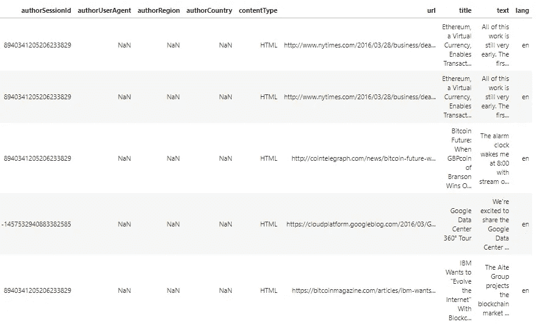

输入数据（作者提供的图片）

在我们的数据中，标题、文本和语言特征是最重要的。其他特征，如内容类型和作者用户代理，对于构建推荐系统的任务并不十分适用。我们将采取步骤**去除**这些特征，仅考虑标题、文本和语言等特征。请注意，图中未显示所有特征，因为这将成为一张大图。

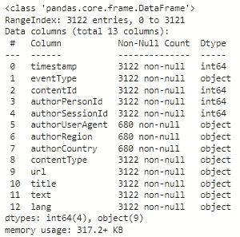

数据信息（作者提供的图片）

我们获取数据的信息，并确定数据集中存在的**非空**值的数量。我们发现有些特征如 authorSessionID 和 authorUserAgent 包含超过**50%**的缺失值。我们将删除这些特征以及上面讨论的其他特征，专注于标题、文本和语言特征。

**探索性数据分析（EDA）**

现在让我们通过使用视觉效果和图表来探索数据集并理解它。第一步是探索数据中存在的文本内容类型。

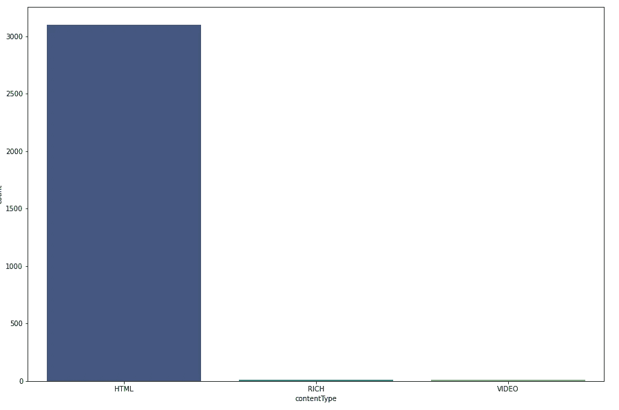

内容类型的计数图（作者提供的图片）

从图中观察，大部分内容以**HTML 链接**的形式存在，用于推荐。这些 HTML 链接包含实际的文本数据和标题。我们在这里的重点是从文本中提取有意义的见解，而不是使用其他格式，如‘视频’和‘富媒体’格式。因此，我们可以从项目中删除这些类别。

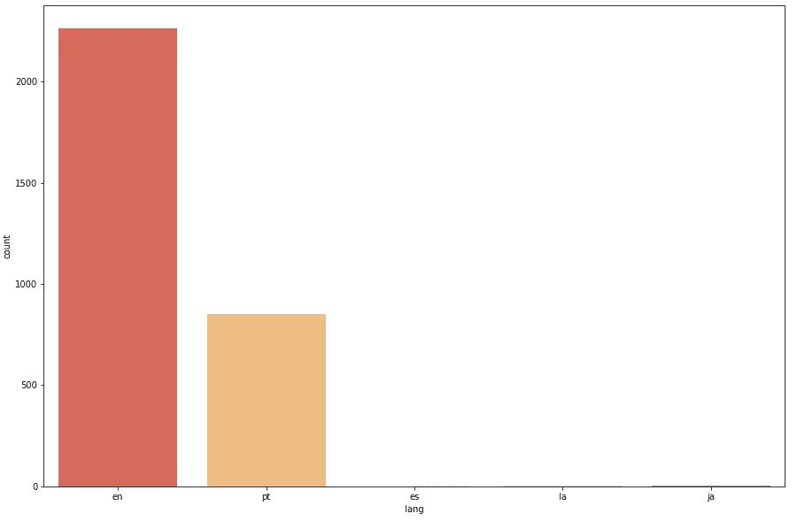

语言的计数图（作者提供的图片）

我们的大部分文本和标题都是英文标题。由于我们只关注英语语言，我们可以采取措施删除其他类别，以提高我们的推荐模型效率。

标题词云（作者提供的图片）

词云提供了对我们文本语料库中最常出现的词汇的良好理解。词汇在语料库中的**出现频率**越高，词云图中的文本大小就**越大**。从图中可以看出，包含‘Google’、‘机器学习’和‘Apple’等词汇的标题在我们的标题空间中经常出现。

文本词云（作者提供的图片）

现在我们已经探索了标题并找出了最常见的词汇，是时候在我们的文章列表中探索**文本**本身，寻找有趣的趋势和模式了。大量文章包含‘数据’、‘用户’和‘时间’等词汇。

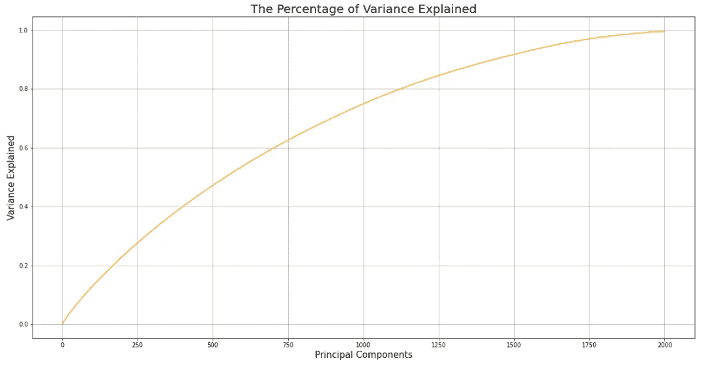

方差解释百分比（作者提供的图片）

将给定的一组标题转换为**TFIDF**格式并应用**主成分分析**，上述图表展示了每个组件解释的方差累计百分比。值得注意的是，随着组件数量的增加，解释的方差也在增加，因为更多的组件信息导致了更多的解释和信息。

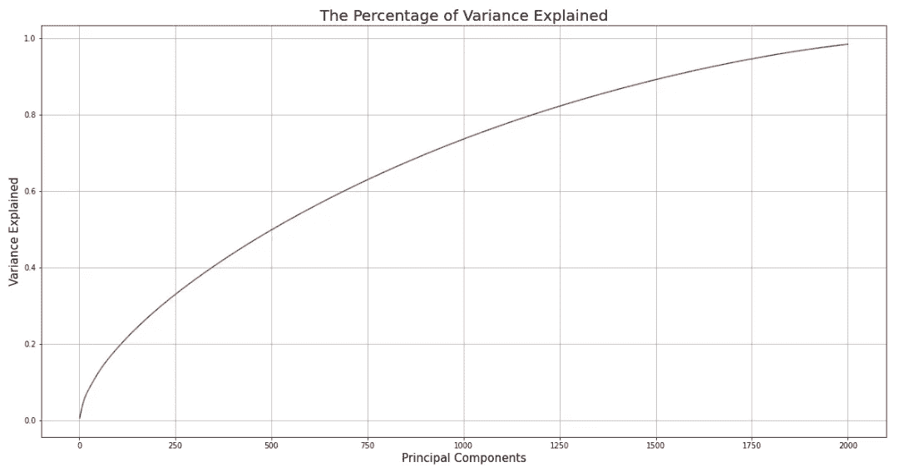

方差解释百分比（作者提供的图片）

此图显示了 tfidf 组件对整个文本解释的方差，而不仅仅是考虑标题。这个图与之前的图大相径庭，因为只有少数主成分集能够解释数据方差的大部分。因此，这可以帮助降维，因为更少的特征能够解释大部分方差。

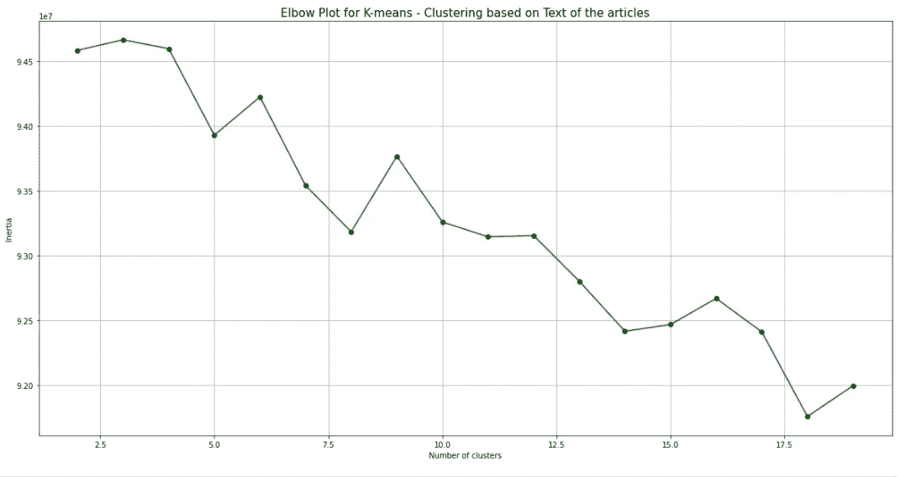

K-means 聚类图（图片来源：作者）

聚类是一种将相似的数据点分组在一起的技术，以寻找有趣的模式和共同点。通过这种方式，基于数据点所在的簇，可以给出推荐。

为了确定正确的簇数，使用**k-means 聚类模型**并遵循**肘部法则**来找到最佳簇数是很方便的。在我们的案例中，最佳值**k 为 11**，因为它符合肘部的形状。

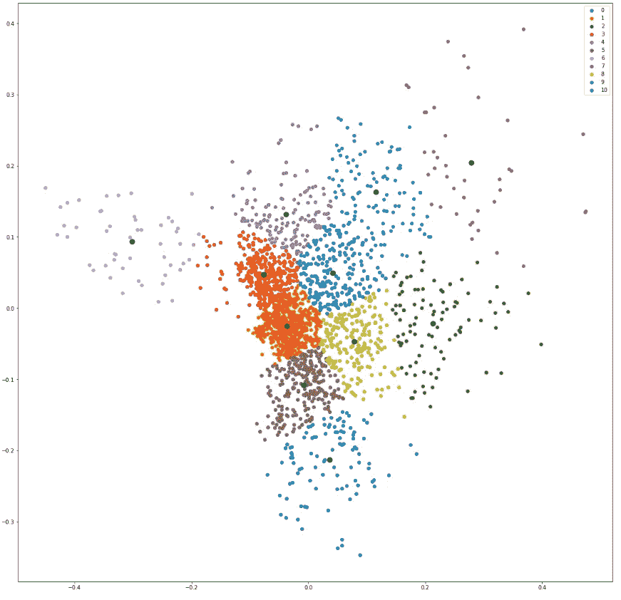

PCA 与聚类 2D 图（图片来源：作者）

在执行 PCA 和基于最佳簇数的聚类后，到了可视化聚类结果的时刻。根据上述图，聚类效果相当不错，因为在簇中发现了模式。

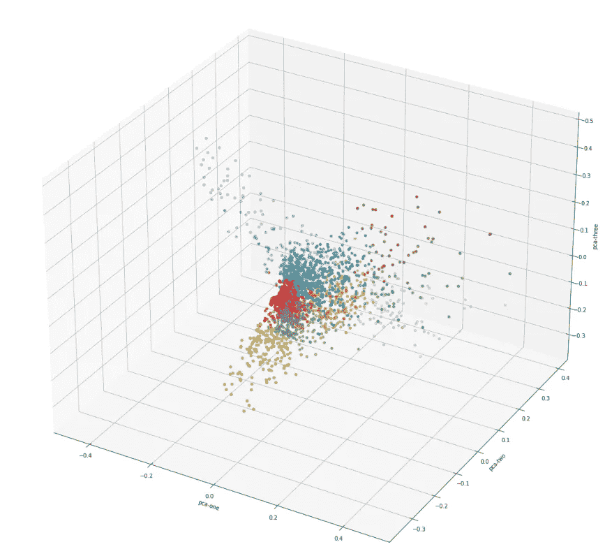

PCA 与聚类 3D 图（图片来源：作者）

让我们确定**3D** 图的外观，以发现潜在的模式。可以看到，有很多空间可以分隔簇，因此可以指导我们的推荐系统根据之前阅读的文本给出好的建议。

还有其他降维技术，如**TSNE**和**Kernal PCA**。逐一了解它们以确定最佳聚类对于推荐系统将很有帮助。必须采取步骤可视化文本数据点并生成有趣的模式。

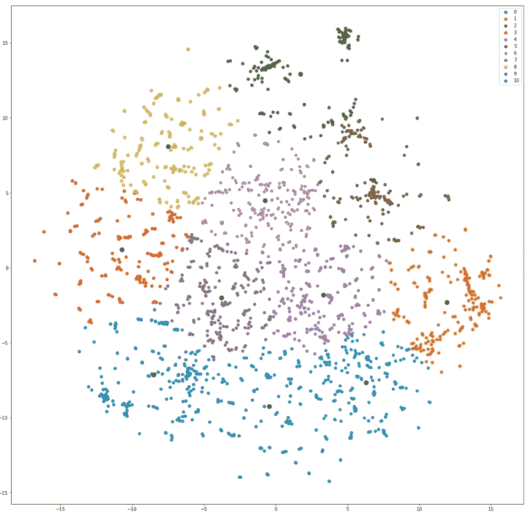

TSNE 与聚类 2D 图（图片来源：作者）

使用 TSNE 降维并以 11 个簇可视化表示，可以看到数据点分布得很好。因此，相似的文章在同一簇中的机会较小。结果，PCA 在聚类和确定最佳簇数方面表现良好。我们还将使用 3D 可视化来指导我们的思考和理解聚类机制。

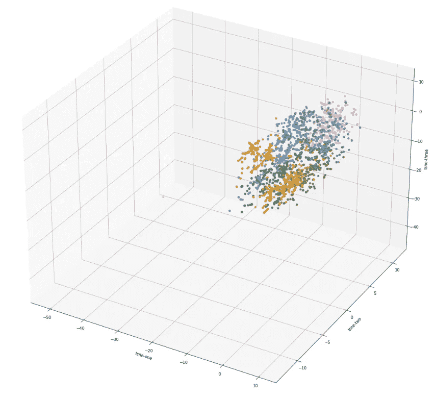

TSNE 与聚类 3D 图（图片来源：作者）

在执行聚类任务后，可以看到许多文本的数据嵌入非常**接近**。因此，当数据点没有在各个方向上分布时，准确执行聚类可能具有挑战性。因此，我们可能会寻找替代的聚类方法和降维技术。

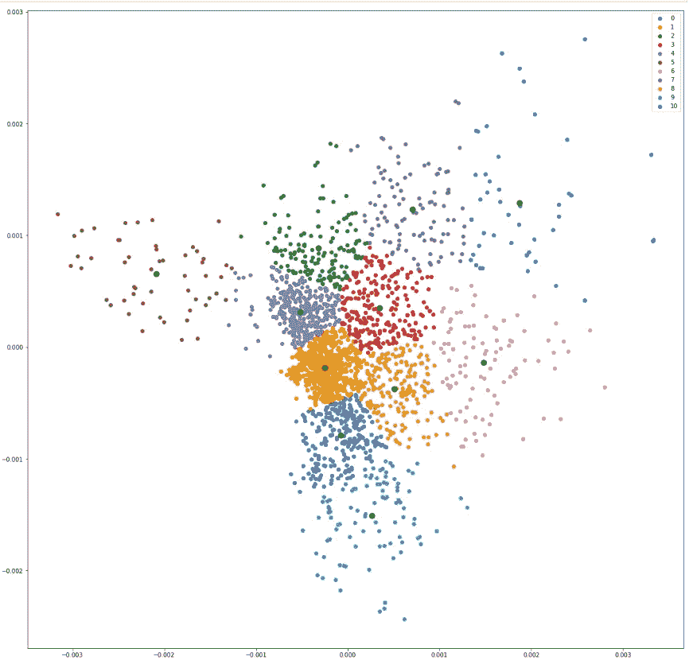

核 PCA 与聚类 2D 图（作者提供的图片）

核 PCA 是另一种用于维度缩减的流行方法。如所见，数据表示的分布良好，有助于确定和使用聚类的数量。总体而言，算法很好地减少了维度并分离了数据点。让我们也来看一下使用这种技术进行维度缩减后的**3D 表示**的聚类结果。

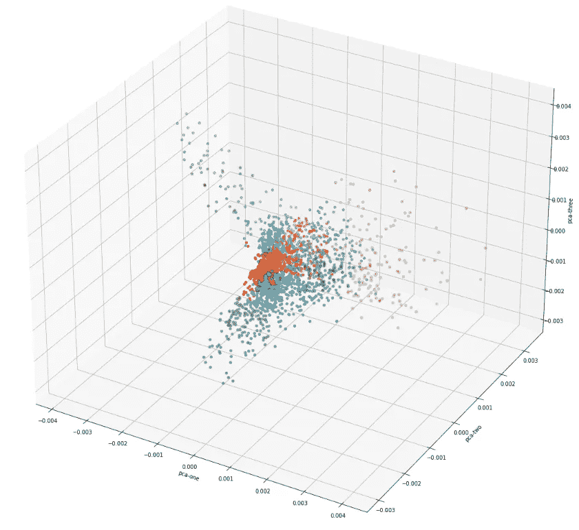

核 PCA 与聚类 3D 图（作者提供的图片）

在用核 PCA 绘制了 3D 生成的表示后，聚类效果相当好，点分布也相当均匀。因此，这种方法可以帮助基于聚类方法生成推荐。

比如，用户访问一个**特定的网站**并阅读了一段有趣的文本。在这一步之后，基于核主成分分析（PCA）表示的簇中的项目将推荐给用户。用户可能会觉得这些文章很吸引人，从而促进业务增长。

在执行了之前的步骤后，我们定义了一个函数，生成一组**有用的特征**，这些特征可以被各种推荐系统模型用于进行推荐。以下函数中使用的特征是重要的，能够很好地表示文本的类型及其内容和可读性。

我们将这个函数应用于数据框，并生成一组新的特征，这些特征被推荐系统所使用。最后，**余弦相似度**在确定感兴趣的文本与所有其他可能的文本和文章列表之间的距离时被考虑在内。

在根据生成的特征和核 PCA 表示获取当前文本的余弦差异后，将其与现有文章列表进行比较，以确定距离簇最小的文章。结果是，这些文章被推荐给用户，使他们的阅读体验变得引人入胜和有趣。

我们导入了各种用于测量余弦相似度和生成结构和内容相似的文章推荐的有用库。

## 结论

在阅读了这篇详尽的文章之后，你应该对**推荐系统**在文章上的具体实现细节有了较好的了解。进行维度缩减可以确保我们减少**计算资源**的消耗，同时在进行预测或提供推荐时减少**异常值的影响**。感谢你花时间阅读这篇文章。

*以下是你可以联系我或查看我工作的方式。*

***GitHub:***[*suhasmaddali (Suhas Maddali ) (github.com)*](https://github.com/suhasmaddali)

***YouTube:***[*https://www.youtube.com/channel/UCymdyoyJBC_i7QVfbrIs-4Q*](https://www.youtube.com/channel/UCymdyoyJBC_i7QVfbrIs-4Q)

***LinkedIn:***[*(1) Suhas Maddali，东北大学，数据科学 | LinkedIn*](https://www.linkedin.com/in/suhas-maddali/)

***Medium:*** [*Suhas Maddali — Medium*](https://suhas-maddali007.medium.com/)

***Kaggle:***[*Suhas Maddali | 贡献者 | Kaggle*](https://www.kaggle.com/suhasmaddali007)
